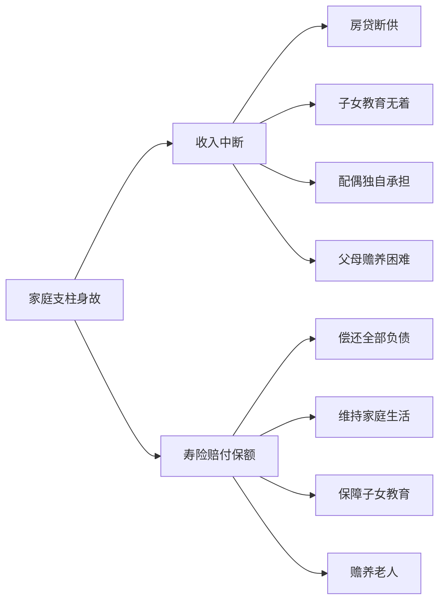
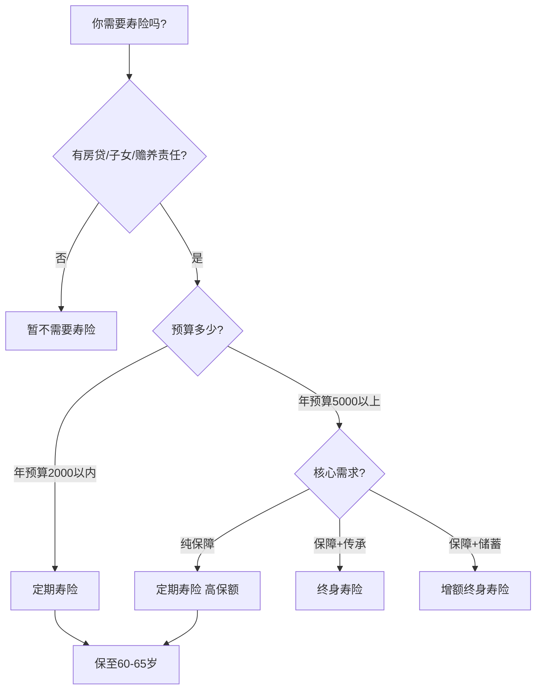
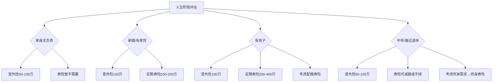
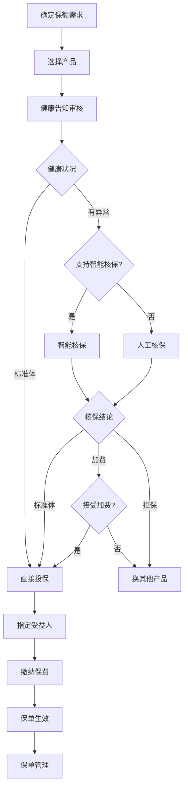

## 四、寿险与意外险选购技巧

寿险和意外险是家庭保障体系的两大支柱——重疾险管"病"，医疗险管"医"，而寿险管"死"，意外险管"残"。很多人只关注重疾险和医疗险，忽略了寿险和意外险，这是严重的配置缺失。一个有房贷、有孩子的家庭支柱，如果只买了重疾险没有寿险，万一因交通事故（非疾病）身故，家人将面临房贷断供、生活无着的困境。

本节将系统讲解寿险和意外险的选购方法，从产品认知到保额计算、从条款细节到投保实操，帮你做出最适合自己家庭的选择。

### 4.1 寿险的本质与作用

#### 4.1.1 寿险的核心逻辑

寿险（人寿保险）的赔付条件极其简单——被保险人身故（或全残）即赔。它不像重疾险需要确诊特定疾病，不像医疗险需要住院发票，只要被保险人去世，保险公司就赔付保额给受益人。

寿险解决的核心问题是：**如果家庭经济支柱不在了，家人的生活质量如何维持？**



#### 4.1.2 为什么寿险常被忽视

寿险在中国的投保率远低于重疾险，原因包括：

1. **心理因素**：谈论死亡让人不舒服，"不吉利"的心态根深蒂固
2. **认知偏差**：人们倾向于高估自己的健康，低估早逝风险
3. **销售导向**：寿险佣金相对较低，销售人员更倾向推荐重疾险和年金险
4. **信息不对称**：很多人不知道定期寿险的保费其实非常便宜

但数据告诉我们，30-50岁年龄段的身故风险并非可以忽略不计。根据国家统计局数据，中国每年因意外伤害死亡约70万人，30-50岁群体占比约25%。加上疾病身故，这个年龄段的家庭支柱面临的死亡风险远比想象中高。

#### 4.1.3 哪些人必须买寿险

**必须买寿险的人群**：
- 有房贷/车贷等长期负债的人——人走了，债不会消失
- 有未成年子女的家庭支柱——孩子至少需要18年的经济支撑
- 有需要赡养的父母——特别是独生子女
- 家庭收入严重依赖单一成员——"单引擎"家庭风险极高

**可以不买或少买寿险的人群**：
- 没有任何负债、没有家庭责任的单身人士
- 退休老人（无负债、子女已独立）
- 配偶有充足独立收入且无负债的家庭

> 💡 **关键判断标准**：如果你走了，是否有人会因为失去你的收入而陷入经济困境？如果答案是"是"，你就需要寿险。

### 4.2 寿险的分类与选择

#### 4.2.1 四种主要寿险形态

寿险产品形态众多，但核心可以分为四大类：

| 类型 | 保障期限 | 30岁男性100万保额年保费 | 核心功能 | 适合人群 |
|------|----------|------------------------|----------|----------|
| 定期寿险 | 20-30年或至60/70岁 | 约1000-1500元 | 纯身故保障，消费型 | 有房贷、有家庭责任的大多数人 |
| 终身寿险（传统型） | 终身 | 约8000-15000元 | 身故保障+财富传承 | 高净值人群、有传承需求者 |
| 增额终身寿险 | 终身 | 约5-10万/年 | 储蓄增值+身故保障 | 有长期储蓄需求、追求确定性收益者 |
| 两全保险 | 固定期限 | 约3000-5000元 | "生死两全"，到期返本 | 追求"不亏本"心理的人群 |

#### 4.2.2 定期寿险：绝大多数人的最优选择

**为什么定期寿险是首选？**

定期寿险的核心优势是"高杠杆"——用最少的钱获得最大的保障。以30岁男性为例，100万保额保至60岁，年保费仅约1000-1500元，相当于每天3-4元。这个价格，一杯奶茶都不到。

**定期寿险的保障期限选择**：

| 期限选择 | 适用场景 | 逻辑 |
|----------|----------|------|
| 保至60岁 | 子女已成年、房贷已还清、退休有养老金 | 最常见的选择，覆盖家庭责任最重的30年 |
| 保至65岁 | 子女较晚出生、或希望延长保障 | 子女可能还在读书的缓冲期 |
| 保20年/30年 | 明确知道负债何时还清 | 精确匹配负债期限，保费更低 |
| 保至70岁 | 追求更长保障期 | 保费增加约40-60%，性价比略降 |

> 💡 **核心原则**：定期寿险的保障期限应该覆盖你承担家庭经济责任的全部时期。简单说就是——从现在到最小的孩子经济独立、房贷还清、父母赡养义务基本完成的那一年。

**定期寿险 vs 终身寿险的决策框架**：



#### 4.2.3 终身寿险：高净值人群的工具

传统终身寿险保费是定期寿险的6-10倍，杠杆率低。它真正有价值的地方在于：

1. **财富传承**：身故赔付的保额可以定向给指定受益人，避免遗产纠纷
2. **债务隔离**：寿险金不属于被保险人的遗产，理论上不用于偿还被保险人生前债务（但有例外，详见资产保护章节）
3. **税务筹划**：在部分国家/地区，寿险金可以规避遗产税（中国目前无遗产税，但未来可能出台）

**终身寿险的"保单贷款"功能**：

终身寿险具有现金价值，投保人可以用保单做抵押向保险公司贷款，通常可贷现金价值的80%。这在急需资金周转时是一个灵活的融资渠道，且贷款期间保障不受影响。

> ⚠️ **注意**：终身寿险的现金价值在前期远低于已交保费。如果投保后5年内退保，可能损失50-70%的已交保费。终身寿险是长期持有的产品，不适合短期投资。

#### 4.2.4 增额终身寿险：储蓄型寿险的深度解析

增额终身寿险近年来成为"储蓄替代"的热门产品，本质是保额逐年递增、现金价值稳步增长的终身寿险。

**增额终身寿险的核心数据**：

| 持有年限 | 现金价值IRR | 对比银行定期存款（2.5%单利） | 对比国债（2.6%） |
|----------|------------|---------------------------|-----------------|
| 10年 | 约1.8-2.2% | 银行存款更高 | 国债更高 |
| 15年 | 约2.5-2.8% | 基本持平 | 基本持平 |
| 20年 | 约2.8-3.0% | 增额终身寿胜出 | 增额终身寿胜出 |
| 30年 | 约3.0-3.2% | 明显胜出 | 明显胜出 |

**增额终身寿险的真实收益计算示例**：

以某产品为例，30岁男性年交10万，交5年（共交50万）：

| 年龄 | 保单年度 | 累计交费 | 现金价值 | IRR |
|------|----------|----------|----------|-----|
| 35岁 | 第5年 | 50万 | 45.2万 | -2.0% |
| 40岁 | 第10年 | 50万 | 54.8万 | 0.9% |
| 45岁 | 第15年 | 50万 | 65.3万 | 1.8% |
| 50岁 | 第20年 | 50万 | 77.6万 | 2.2% |
| 55岁 | 第25年 | 50万 | 92.1万 | 2.5% |
| 60岁 | 第30年 | 50万 | 109.3万 | 2.7% |
| 70岁 | 第40年 | 50万 | 153.8万 | 2.9% |

> 💡 **结论**：增额终身寿险适合"确定10年以上不会动用的钱"。如果资金可能随时需要使用，银行存款或货币基金更合适。建议将可投资资产的20-30%配置在增额终身寿险中，作为长期安全垫。

**增额终身寿险的"减保"操作**：

增额终身寿险最灵活的功能是"减保"——部分退保取出现金价值。操作方式：
1. 减保不影响剩余保额的继续增长
2. 大多数产品对减保次数和比例有限制（如每年不超过基本保额的20%）
3. 减保后剩余现金价值继续按约定利率增长
4. 减保取回的资金不需要缴纳个人所得税

#### 4.2.5 两全保险：返本心理的理性分析

两全保险（也叫"生死两全"保险）的卖点是"到期没出事，保费全部退还"。听起来很美好，但实际性价比如何？

**两全保险的真实成本分析**：

以30岁男性、100万保额、保至60岁为例：

| 方案 | 年保费 | 30年总交费 | 保障内容 |
|------|--------|-----------|----------|
| 方案A：定期寿险 | 1200元 | 3.6万 | 身故赔付100万 |
| 方案B：两全保险 | 4000元 | 12万 | 身故赔付100万，生存至60岁返还12万 |

差额：4000-1200=2800元/年。如果把这2800元/年按年化3%投资，30年后本息合计约13.2万，比两全保险"返还"的12万还多。

> 💡 **结论**：两全保险的"返还"本质上是用你多交的保费做的投资，而且收益率通常不如你自己投资。从纯经济角度看，"定期寿险+自行投资差额"的组合更优。两全保险适合心理上无法接受"消费型"保险的人——如果"返本"能让你安心投保，那它就有价值。

### 4.3 寿险保额的科学计算

#### 4.3.1 保额计算公式

寿险保额不是拍脑袋决定的，需要科学计算。核心公式：

```text
寿险保额 = 房贷余额 + 其他负债 + 子女教育费用 + 父母赡养费用 + 家庭N年生活费 - 已有储蓄和投资 - 社保抚恤金
```

#### 4.3.2 各项计算细则

**（1）房贷余额**

直接查询贷款合同中的剩余本金。注意区分"等额本息"和"等额本金"的不同还款进度：
- 等额本息：前期还的主要是利息，本金减少较慢
- 等额本金：每月偿还固定本金，本金减少较快

可以通过银行APP或拨打贷款银行客服查询精确的剩余本金。

**（2）子女教育费用**

| 教育阶段 | 公立学校年费用 | 私立/国际学校年费用 | 总计（按18年算） |
|----------|---------------|-------------------|----------------|
| 幼儿园（3年） | 1-3万 | 5-15万 | 3-45万 |
| 小学（6年） | 1-2万 | 8-20万 | 6-120万 |
| 初中（3年） | 1-3万 | 10-25万 | 3-75万 |
| 高中（3年） | 2-4万 | 12-30万 | 6-90万 |
| 大学（4年） | 3-8万 | 15-40万（含留学） | 12-160万 |

如果考虑留学可能，教育费用预算建议按80-150万准备。

**（3）父母赡养费用**

计算方式：每位老人每月赡养费 × 12 × 预计赡养年数

| 赡养情况 | 每月费用 | 赡养年数 | 总费用（每位老人） |
|----------|----------|----------|------------------|
| 有退休金、有医保 | 1000-2000元 | 15-20年 | 18-48万 |
| 无退休金、有医保 | 2000-3000元 | 15-20年 | 36-72万 |
| 无退休金、无医保 | 3000-5000元 | 15-20年 | 54-120万 |

**（4）家庭生活费**

建议按家庭月支出 × 12 × 保障年数计算。保障年数一般取10-15年，给配偶足够的时间重新建立经济基础。

#### 4.3.3 保额计算实例

**案例：35岁男性，一线城市，有一孩（3岁），房贷余额150万**

| 项目 | 金额 | 计算说明 |
|------|------|----------|
| 房贷余额 | 150万 | 剩余贷款本金 |
| 车贷+其他负债 | 10万 | 信用卡+消费贷 |
| 子女教育 | 100万 | 按公立为主、留学可能计算 |
| 父母赡养 | 60万 | 3位老人，有退休金，每人2000/月×15年 |
| 家庭10年生活费 | 120万 | 月支出1万×12×10年 |
| **合计需求** | **440万** | |
| 减：已有储蓄投资 | -50万 | 存款+基金 |
| 减：社保抚恤金 | -10万 | 丧葬费+抚恤金 |
| **建议保额** | **380万** | |

> 💡 如果预算有限，可以先配置200万定期寿险（覆盖房贷+子女教育），后续经济改善后再加保至380万。有保障总比没有好。

#### 4.3.4 夫妻双方的保额分配

双薪家庭中，夫妻双方都应该配置寿险，但保额可以按收入比例分配：

```text
丈夫保额 = 总保障需求 × (丈夫收入 / 家庭总收入)
妻子保额 = 总保障需求 × (妻子收入 / 家庭总收入)
```

但如果一方是全职主妇/主夫，虽然没有直接收入，其家庭贡献（育儿、家务等）的经济价值也不应被忽视。建议全职主妇/主夫至少配置50-100万的定期寿险，用于覆盖万一去世后配偶需要请人照顾孩子的费用。

### 4.4 寿险选购的核心要点

#### 4.4.1 条款细节对比清单

选择寿险产品时，需要逐一对比以下关键条款：

| 对比维度 | 重要程度 | 说明 |
|----------|----------|------|
| 免责条款数量 | ⭐⭐⭐⭐⭐ | 免责越少越好。标准为3条（投保人故意杀害、被保险人故意犯罪、2年内自杀），多于5条要警惕 |
| 等待期 | ⭐⭐⭐⭐ | 90天优于180天。等待期内因疾病身故不赔（意外不受限制） |
| 全残保障 | ⭐⭐⭐⭐ | 是否包含全残责任。全残比身故更需要保障——人活着但丧失劳动能力 |
| 健康告知宽松度 | ⭐⭐⭐⭐ | 健康告知越宽松，越容易投保。特别是有小毛病的人群 |
| 保费 | ⭐⭐⭐ | 同类产品保费差异通常在10-20%以内 |
| 免体检保额 | ⭐⭐⭐ | 免体检保额越高，投保越方便（通常40岁以下免体检保额为50-100万） |
| 受益人指定 | ⭐⭐⭐ | 是否支持指定受益人及比例分配 |

#### 4.4.2 免责条款深度解读

寿险的免责条款直接决定了哪些情况不赔。标准的免责条款应该只有以下3条：

1. **投保人对被保险人的故意杀害、故意伤害**——防止道德风险
2. **被保险人故意犯罪或抗拒依法采取的刑事强制措施**——法律底线
3. **被保险人自合同成立或复效之日起2年内自杀**——防止骗保

**需要警惕的额外免责条款**：

| 额外免责条款 | 风险等级 | 说明 |
|-------------|----------|------|
| 酒驾不赔 | 🟡 中等 | 合理但有争议——如果只是乘客呢？要看条款是否区分驾驶人和乘客 |
| 战争、军事冲突不赔 | 🟢 低 | 对普通人影响极小 |
| 核辐射、核污染不赔 | 🟢 低 | 对普通人影响极小 |
| 被保险人吸毒不赔 | 🟡 中等 | 合理，但要确认是"主动吸毒"还是"被诱导吸毒" |
| 高风险运动不赔 | 🟡 中等 | 如果你爱好攀岩、潜水、跳伞等，需要特别关注 |
| 无证驾驶不赔 | 🟡 中等 | 合理，但要区分有证驾驶无证车辆和无证驾驶 |

> 💡 **选购建议**：优先选择免责条款只有3条的"标准免责"产品。如果你有特殊爱好（高风险运动等），需要额外关注相关免责条款。

#### 4.4.3 健康告知与核保

寿险的健康告知通常比重疾险宽松，但以下情况需要注意：

| 健康状况 | 影响程度 | 可能的核保结果 |
|----------|----------|---------------|
| 高血压（1-2级） | 低-中 | 标准体或加费10-30% |
| 高血压（3级） | 高 | 可能拒保 |
| 糖尿病 | 高 | 大多数产品拒保 |
| 乙肝病毒携带 | 低 | 肝功能正常可标准体 |
| 乙肝小三阳 | 中 | 可能加费10-20% |
| 乙肝大三阳 | 高 | 可能加费30-50%或拒保 |
| 甲状腺结节（1-2级） | 低 | 标准体承保 |
| 甲状腺癌术后 | 高 | 通常拒保 |
| 抑郁症/焦虑症 | 中-高 | 可能加费或拒保 |

**智能核保与人工核保的区别**：

- **智能核保**：在线回答健康问卷，系统即时给出结论。优点是快速、不留拒保记录；缺点是能选择的结论有限（通常只有标准体、拒保两种）
- **人工核保**：提交体检报告等资料，由核保员审核。优点是可以争取加费承保、除外承保等中间结论；缺点是耗时长（通常7-15个工作日），且可能留下核保记录

> 💡 **实操建议**：如果健康有异常，优先选择支持智能核保的产品试一下。智能核保被拒不留记录，不影响在其他产品投保。如果智能核保不行，再走人工核保，但要注意有些公司的核保记录是共享的。

#### 4.4.4 受益人指定的学问

受益人指定是寿险中极其重要但经常被忽略的环节。

**法定受益人 vs 指定受益人**：

| 对比维度 | 法定受益人 | 指定受益人 |
|----------|-----------|-----------|
| 赔付方式 | 按法定继承顺序分配 | 按合同约定的受益人和比例分配 |
| 手续复杂度 | 需要所有法定继承人到场签字 | 受益人直接领取 |
| 税务影响 | 可能涉及遗产税（未来） | 不属于遗产，不受遗产税影响 |
| 债务关系 | 可能被用于偿还死者债务 | 不属于遗产，理论上不用于偿债 |
| 家庭纠纷风险 | 高（容易引发继承纠纷） | 低（明确指定） |

**指定受益人的实操建议**：

1. **务必指定受益人**，不要留空（默认为法定受益人）
2. **指定至少2个受益人**，避免唯一受益人先于被保险人身故
3. **明确受益比例**，如"配偶60%，子女40%"
4. **定期更新**：离婚后务必及时变更受益人，否则前配偶仍然有权领取保险金
5. **受益人变更**：随时可以变更，不需要原受益人同意（只需要被保险人申请）

### 4.5 意外险的本质与作用

#### 4.5.1 什么是"意外"

意外险中的"意外"有严格的法律定义，必须同时满足以下四个条件：

1. **外来的**：伤害来自外部因素，不是身体内在疾病导致
2. **突发的**：突然发生，不是长期慢性积累
3. **非本意的**：不是被保险人故意造成的
4. **非疾病的**：不是疾病导致的

**常见"意外"判定对照表**：

| 场景 | 是否算"意外" | 原因 |
|------|------------|------|
| 交通事故 | ✅ 是 | 外来、突发、非本意、非疾病 |
| 摔倒骨折 | ✅ 是 | 符合四个条件 |
| 触电身亡 | ✅ 是 | 符合四个条件 |
| 食物中毒 | ✅ 是 | 符合四个条件（但集体食物中毒可能被调查） |
| 猝死 | ❌ 否 | 猝死是疾病导致的，严格来说不算意外 |
| 中暑死亡 | ❌ 否 | 中暑是身体机能问题，有"非疾病"争议 |
| 高原反应 | ❌ 否 | 身体对环境的反应，属于"身体内在因素" |
| 溺水 | ✅ 是 | 外来、突发、非本意、非疾病 |
| 自杀/自残 | ❌ 否 | "本意"，不满足条件3 |
| 醉驾导致的事故 | 🟡 有争议 | 部分产品免责，部分可赔 |

> ⚠️ **猝死保障是加分项**：猝死严格来说不算意外，但近年来很多优秀的意外险会额外包含"猝死保障"（通常赔付20-50万）。如果你工作压力大、经常加班，这个保障非常有价值。

#### 4.5.2 意外险的四大保障责任

一份完整的意外险应该包含以下四项保障：

| 保障责任 | 说明 | 重要程度 | 一般保额 |
|----------|------|----------|----------|
| 意外身故 | 因意外导致身故，赔付保额 | ⭐⭐⭐⭐⭐ | 50-100万 |
| 意外伤残 | 因意外导致伤残，按等级赔付 | ⭐⭐⭐⭐⭐ | 50-100万 |
| 意外医疗 | 因意外导致的医疗费用报销 | ⭐⭐⭐⭐ | 2-5万 |
| 意外住院津贴 | 因意外住院期间的每日补贴 | ⭐⭐⭐ | 100-200元/天 |

#### 4.5.3 意外伤残 vs 意外全残：一字之差，天壤之别

这是意外险中最重要的概念区分，也是最容易被销售误导的地方。

**意外伤残**：按照《人身保险伤残评定标准》将伤残分为1-10级，按比例赔付。

| 伤残等级 | 赔付比例（保额100万） | 典型情形 |
|----------|---------------------|----------|
| 1级 | 100万 | 双目永久失明、四肢瘫痪 |
| 2级 | 90万 | 两肢以上缺失 |
| 3级 | 80万 | 一手缺失+一目失明 |
| 4级 | 70万 | 一肢缺失+一目失明 |
| 5级 | 60万 | 一目失明、一肢功能完全丧失 |
| 6级 | 50万 | 一手拇指缺失、鼻缺损 |
| 7级 | 40万 | 一足缺失、一耳听力完全丧失 |
| 8级 | 30万 | 一拇指缺失、肋骨骨折8根以上 |
| 9级 | 20万 | 一拇指末节缺失、一耳听力部分丧失 |
| 10级 | 10万 | 一手指末节缺失、一眼视力降低 |

**意外全残**：只保1级伤残（最严重的状态），只有"全残"才赔。

> ⚠️ **血泪教训**：小王购买了一份只保"意外全残"的长期意外险（年缴2000元），后来因工伤导致右手食指截断（约8级伤残），保险公司以"未达到全残标准"拒赔。如果他买的是保"意外伤残"的产品，可以获得30万赔付。只保"全残"的产品，本质上只赔最极端的情况，实用性极差。

**选购建议**：必须选择保"意外伤残"（1-10级）的产品，绝不选择只保"意外全残"的产品。

### 4.6 意外险的分类与选择

#### 4.6.1 五种主要意外险形态

| 产品类型 | 保障期限 | 年保费 | 核心保障 | 适合人群 |
|----------|----------|--------|----------|----------|
| 一年期综合意外险 | 1年 | 100-300元 | 意外身故/伤残+医疗+住院津贴 | 所有人（首选） |
| 交通意外险 | 1年或单次 | 50-200元 | 仅保障交通事故 | 经常出差/开车的人 |
| 旅行意外险 | 单次旅行 | 10-50元/次 | 旅行期间意外+医疗+延误+救援 | 出门旅行时 |
| 长期意外险 | 10-30年 | 1000-2000元/年 | 长期保障，部分含满期返还 | 追求长期稳定保障 |
| 少儿意外险 | 1年 | 60-150元 | 意外医疗为主，身故保额受限 | 0-17岁儿童 |

#### 4.6.2 一年期综合意外险：性价比之王

一年期综合意外险是意外险中的核心产品，原因如下：

**性价比对比**（100万保额为例）：

| 对比维度 | 一年期综合意外险 | 长期意外险 |
|----------|-----------------|-----------|
| 年保费 | 150-300元 | 1000-2000元 |
| 意外伤残保障 | ✅ 1-10级全保 | ✅ 1-10级全保 |
| 意外医疗 | ✅ 含（不限社保） | 部分含 |
| 住院津贴 | ✅ 含 | 部分含 |
| 猝死保障 | ✅ 多数含 | 少数含 |
| 到期返还 | ❌ 不返还 | 部分返还 |
| 产品更新 | 每年可换更好的产品 | 锁定20-30年 |

> 💡 **核心建议**：每年花150-300元买一年期综合意外险就够了。长期意外险看起来"保得久"，但保费是一年期的5-10倍，且保障内容不一定更好。一年期产品每年可以换新的、更好的产品，灵活性远超长期意外险。

#### 4.6.3 交通意外险：经常出行者的补充

交通意外险只保障交通事故导致的身故/伤残，保费低、保额高。适合经常出差、开车上下班的人群。

**交通意外险的保障范围**：

| 交通方式 | 典型保额 | 年保费 |
|----------|----------|--------|
| 航空意外 | 200-500万 | 10-50元 |
| 火车/高铁意外 | 100-300万 | 20-50元 |
| 轮船意外 | 100-200万 | 10-30元 |
| 公共汽车意外 | 50-100万 | 10-30元 |
| 自驾车意外 | 50-100万 | 30-100元 |
| 综合交通意外（全部） | 100-500万 | 50-200元 |

> 💡 **实操建议**：如果你已经有一份100万保额的综合意外险，交通意外险可以作为额外补充。但不要用交通意外险替代综合意外险——交通意外只占全部意外事故的一部分，日常的摔倒、烧伤、溺水等都不在交通意外险的保障范围内。

#### 4.6.4 旅行意外险：出行必备

旅行意外险保障旅行期间的各类风险，包括意外身故/伤残、意外医疗、紧急救援、航班延误、行李丢失等。保费极低（国内旅行10-30元/次，境外旅行30-100元/次），是性价比极高的保障。

**旅行意外险选购要点**：

| 保障责任 | 国内旅行 | 境外旅行 | 说明 |
|----------|----------|----------|------|
| 意外身故/伤残 | 50-100万 | 50-100万 | 基础保障 |
| 意外医疗 | 5-10万 | 30-50万 | 境外医疗费用更高 |
| 紧急救援 | 不太重要 | ⭐⭐⭐⭐⭐ | 境外紧急医疗转运费用可达数十万 |
| 航班延误 | 有最好 | 有最好 | 通常延误4小时以上赔付200-500元 |
| 行李丢失 | 有最好 | 有最好 | 通常赔付2000-5000元 |
| 高风险运动 | 看活动 | 看活动 | 滑雪、潜水、蹦极等需额外确认保障范围 |

> ⚠️ **境外旅行特别注意**：一定要确认旅行意外险覆盖目的地国家。部分产品不覆盖战乱地区、极地探险等。去美国、日本等医疗费用高昂的国家，意外医疗保额建议不低于50万。

#### 4.6.5 少儿意外险的特殊注意事项

为孩子购买意外险有以下特殊限制：

1. **身故保额限制**：根据监管规定，10岁以下儿童身故赔付总额不超过20万，10-17岁不超过50万。这不是产品限制，而是监管要求（防止道德风险）
2. **意外医疗是核心**：孩子磕碰受伤的概率远高于身故/伤残，意外医疗保额建议3-5万
3. **不限社保用药**：孩子受伤后使用的进口药、进口钢钉等社保外用药费用不低，不限社保的意外医疗更实用
4. **门诊也能报**：部分少儿意外险覆盖门诊费用，不需要住院也能报销

### 4.7 意外险选购的核心要点

#### 4.7.1 条款细节对比清单

| 对比维度 | 重要程度 | 说明 |
|----------|----------|------|
| 伤残保障 vs 全残保障 | ⭐⭐⭐⭐⭐ | 必须选"伤残"（1-10级），不选"全残" |
| 意外医疗免赔额 | ⭐⭐⭐⭐ | 0免赔优于100元免赔，100元免赔优于其他 |
| 意外医疗报销范围 | ⭐⭐⭐⭐ | 不限社保 > 限社保内。社保外用药（进口药、进口器材）费用高昂 |
| 意外医疗报销比例 | ⭐⭐⭐⭐ | 100%报销优于80%报销 |
| 猝死保障 | ⭐⭐⭐⭐ | 工作压力大的人必备 |
| 住院津贴 | ⭐⭐ | 锦上添花，每天100-200元 |
| 等待期 | ⭐⭐⭐ | 最好0天等待期，部分产品有3天等待期 |
| 投保年龄 | ⭐⭐ | 确认是否覆盖你需要的年龄段 |

#### 4.7.2 意外医疗的深度解析

意外医疗是意外险中使用频率最高的保障。一个小摔伤、一次扭伤，医疗费用可能就几百到几千元，意外医疗的报销体验直接影响你对保险的满意度。

**意外医疗报销计算示例**：

小李意外摔伤导致手臂骨折，医疗费用明细：

| 费用项目 | 金额 | 社保报销 | 自费部分 |
|----------|------|----------|----------|
| 急诊费 | 500元 | 300元 | 200元 |
| X光+CT检查 | 800元 | 600元 | 200元 |
| 手术费（含进口钢钉） | 12000元 | 5000元 | 7000元 |
| 住院费（5天） | 3000元 | 2000元 | 1000元 |
| 药费（含进口消炎药） | 2000元 | 1000元 | 1000元 |
| **合计** | **18300元** | **8900元** | **9400元** |

**不同意外医疗方案的报销差异**：

| 方案 | 免赔额 | 报销范围 | 报销比例 | 实际报销金额 |
|------|--------|----------|----------|-------------|
| 方案A：0免赔、不限社保、100%报销 | 0元 | 全部费用 | 100% | 9400元 |
| 方案B：100免赔、不限社保、100%报销 | 100元 | 全部费用 | 100% | 9300元 |
| 方案C：0免赔、限社保内、100%报销 | 0元 | 仅社保内费用 | 100% | 约5400元 |
| 方案D：100免赔、限社保内、80%报销 | 100元 | 仅社保内费用 | 80% | 约4240元 |

方案A和方案D之间相差5160元，这就是条款差异带来的实际影响。

#### 4.7.3 高风险运动与职业限制

**职业限制**：

意外险通常有职业限制，常见的分类如下：

| 职业类别 | 举例 | 可投保性 |
|----------|------|----------|
| 1-2类（低风险） | 办公室白领、教师、医生 | 所有意外险均可投保 |
| 3-4类（中风险） | 外勤销售、快递员、厨师 | 大部分意外险可投，部分需加费 |
| 5-6类（高风险） | 建筑工人、矿工、消防员 | 仅少数高危职业意外险可投 |
| 拒保类 | 爆破工、潜水教练、特技演员 | 几乎无产品可投 |

> ⚠️ **职业变更注意**：投保时是1-2类职业，后来换到了5-6类职业（如辞职后去工地打工），需要主动告知保险公司。如果出险时职业与投保时不符且属于更高风险类别，保险公司可能降低赔付比例或拒赔。

**高风险运动**：

以下运动通常不在普通意外险保障范围内，需要单独购买专项保险或含高风险运动保障的意外险：
- 潜水（水下呼吸器）
- 跳伞/滑翔翼
- 攀岩/岩降
- 蹦极
- 滑雪/单板滑雪
- 马术
- 赛车/卡丁车

### 4.8 寿险与意外险的组合策略

#### 4.8.1 为什么两者缺一不可

寿险和意外险不是替代关系，而是互补关系：

| 对比维度 | 定期寿险 | 综合意外险 |
|----------|----------|-----------|
| 保障范围 | 所有身故（含疾病+意外） | 仅意外导致的身故/伤残 |
| 伤残保障 | 仅全残 | 1-10级伤残全保 |
| 疾病身故 | ✅ 赔 | ❌ 不赔 |
| 意外医疗 | ❌ 不含 | ✅ 含 |
| 保费（100万保额） | 1000-1500元/年 | 150-300元/年 |
| 赔付方式 | 身故/全残才赔 | 身故/伤残/医疗都赔 |

**核心区别**：
- **寿险赔"死"**：不管什么原因去世都赔（疾病、意外、自然死亡），但只赔身故和全残
- **意外险赔"残"**：只赔意外导致的，但1-10级伤残都赔，还报销意外医疗费用

一个有房贷的家庭支柱，最理想的状态是：
- 定期寿险200万（覆盖房贷+家庭基本需求）
- 综合意外险100万（覆盖意外伤残+意外医疗）

两者合计年保费约1500-2000元，就能获得300万的身故保障和100万的意外伤残保障。

#### 4.8.2 不同人生阶段的配置方案



#### 4.8.3 预算分配建议

以年收入20万的家庭为例，保险总预算建议为年收入的5-10%（即1-2万元）：

| 保障类型 | 建议预算占比 | 金额参考 | 说明 |
|----------|-------------|----------|------|
| 重疾险 | 40-50% | 5000-8000元 | 核心保障，优先级最高 |
| 医疗险 | 10-15% | 1000-2000元 | 百万医疗险性价比极高 |
| 定期寿险 | 15-20% | 1000-2000元 | 高杠杆，有负债必买 |
| 意外险 | 5-10% | 300-600元 | 保费低，保障全 |
| 其他 | 10-15% | 1000-2000元 | 孩子教育金、养老储备等 |

### 4.9 常见误区与避坑指南

#### 4.9.1 寿险的六大误区

**误区一："我还年轻，不需要寿险"**

事实：年轻恰恰是买定期寿险的最佳时机——保费便宜、健康告知容易通过。30岁男性100万保额保至60岁，年保费约1200元；40岁再买同样的保障，保费可能翻倍。

**误区二："有社保就不需要商业寿险"**

事实：社保的身故保障极其有限——丧葬补助金+抚恤金通常只有几万到十几万元，远远无法覆盖房贷和家庭生活需求。

**误区三："终身寿险比定期寿险好"**

事实：终身寿险保费是定期寿险的6-10倍，杠杆率低。对于预算有限的家庭，同样的钱买定期寿险可以获得更高的保障额度。终身寿险适合有传承需求的高净值人群。

**误区四："返还型保险更划算"**

事实：返还型保险（如两全保险）多收的保费，保险公司拿去投资后返还给你，但投资收益率通常低于你自己投资。"消费型+自行投资差额"的组合长期收益更高。

**误区五："受益人填'法定'就行了"**

事实：法定受益人意味着保险金按法定继承分配，可能引发家庭纠纷，还可能被用于偿还死者债务。务必指定受益人并明确比例。

**误区六："寿险买了就不用改了"**

事实：随着人生阶段变化（结婚、生子、买房、还清贷款），寿险保额需要相应调整。建议每3-5年重新评估一次保障需求。

#### 4.9.2 意外险的六大误区

**误区一："意外身故保额越高越好"**

事实：意外险的核心价值在伤残保障和意外医疗，不在身故保额。100万保额一年期意外险年保费约150-300元，性价比已经很高。超过100万的意外身故保额意义不大（寿险已经覆盖了身故保障）。

**误区二："长期意外险比一年期好"**

事实：长期意外险保费是一年期的5-10倍，保障内容不一定更好。一年期产品每年可以换新的更好的产品，灵活性远超长期意外险。

**误区三："有寿险就不需要意外险了"**

事实：寿险只赔身故和全残，不赔伤残（1-10级），更不报销意外医疗费用。意外导致的手指截断（8级伤残），寿险不赔，意外险赔30万（保额100万×30%）。

**误区四："意外险什么意外都赔"**

事实：猝死、中暑、高原反应等严格来说不算"意外"。只有同时满足"外来的、突发的、非本意的、非疾病的"四个条件才算意外。

**误区五："给孩子买很高的意外身故保额"**

事实：10岁以下儿童身故赔付总额受监管限制不超过20万。给孩子买意外险应该重点关注意外医疗保额和报销范围，而不是身故保额。

**误区六："换工作了不用通知保险公司"**

事实：如果职业类别发生变化（如从办公室白领变成建筑工人），需要主动告知保险公司。出险时职业类别不符可能导致赔付纠纷。

### 4.10 2025-2026年寿险与意外险产品推荐方向

> ⚠️ **重要提示**：以下为选购方向和产品特征参考，非具体产品推荐。保险产品更新频繁，投保前请以保险合同条款为准。

#### 4.10.1 定期寿险选购方向

当前市场主流的高性价比定期寿险产品通常具备以下特征：

- 保额上限：最高300-350万
- 保障期限：可选保20/30年或至60/65/70岁
- 缴费期限：可选交至60/65/70岁（与保障期限一致）
- 健康告知：3条左右，较为宽松
- 免责条款：3条标准免责
- 保费参考：30岁男性100万保额保至60岁，年交约1000-1500元

**选购渠道**：
- 互联网保险平台（蚂蚁保、微保、水滴保等）——产品对比方便，投保便捷
- 保险经纪平台（慧择、小雨伞等）——产品选择多，有经纪人服务
- 保险公司官网/APP——直接投保，但只能选择该公司的产品

#### 4.10.2 一年期综合意外险选购方向

高性价比一年期综合意外险的典型特征：

- 意外身故/伤残保额：50-100万
- 意外医疗：3-5万，0免赔，不限社保，100%报销
- 猝死保障：20-50万
- 住院津贴：100-200元/天
- 年保费：150-300元
- 投保年龄：18-65岁

#### 4.10.3 增额终身寿险选购方向

选择增额终身寿险的关键指标：

- **预定利率**：目前市场主流为3.0%（部分老产品为3.5%）
- **IRR（内部收益率）**：持有20年以上应达到2.8%以上
- **减保规则**：每年减保不超过基本保额的20%为较宽松的规则
- **现金价值回本时间**：5年交费的产品通常第6-7年现金价值超过已交保费
- **保险公司实力**：增额终身寿险是超长期产品，保险公司的长期稳健性非常重要

### 4.11 投保实操全流程

#### 4.11.1 定期寿险投保流程



#### 4.11.2 投保时的关键检查清单

在最终确认投保前，请逐一核对以下内容：

- [ ] **保额是否足够**：按本章保额计算公式核对
- [ ] **保障期限是否合理**：覆盖到最小的孩子经济独立
- [ ] **受益人是否指定**：不要留空默认法定受益人
- [ ] **健康告知是否如实填写**：隐瞒既往病史可能导致理赔被拒
- [ ] **免责条款是否清楚**：确认只有3条标准免责
- [ ] **等待期是多久**：90天优于180天
- [ ] **缴费期限**：建议选择最长的缴费期限（分散缴费压力，且有豁免条款时更有利）
- [ ] **保单生效日期**：确认从哪天开始保障

#### 4.11.3 保单管理与维护

投保不是结束，而是开始。长期保单需要定期维护：

1. **每年检视**：确认保单信息正确，保障是否仍然充足
2. **受益人更新**：结婚、离婚、生子后及时变更受益人
3. **保额调整**：收入增长、负债增加时考虑加保
4. **联系方式更新**：确保保险公司能联系到你
5. **缴费提醒**：确保银行卡余额充足，避免保单失效
6. **保单存档**：将保单信息告知家人（至少让家人知道你买了什么保险、保单号在哪里找）

> 💡 **保单管理工具推荐**：可以使用"金事通"APP（银保信官方）查询名下所有保险公司的保单信息，避免遗漏。

### 4.12 进阶内容：寿险与意外险的深层逻辑

#### 4.12.1 精算定价原理

理解保险定价原理有助于判断产品性价比。

**定期寿险的定价因素**：

| 因素 | 影响方向 | 说明 |
|------|----------|------|
| 年龄 | 年龄越大，保费越高 | 30岁到40岁，保费可能翻倍 |
| 性别 | 男性保费高于女性 | 男性平均寿命较短，死亡率更高 |
| 吸烟与否 | 吸烟者保费高30-50% | 吸烟显著增加死亡率 |
| 职业 | 高风险职业保费高 | 1-6类职业费率递增 |
| 保障期限 | 期限越长，保费越高 | 保至70岁比保至60岁贵约40-60% |
| 保额 | 保额越高，保费越高 | 但不是线性增长，高保额可能有折扣 |

**意外险的定价因素**：

| 因素 | 影响方向 | 说明 |
|------|----------|------|
| 职业类别 | 影响最大 | 1类和6类职业保费可能相差3-5倍 |
| 年龄 | 影响较小 | 成年人各年龄段差异不大 |
| 性别 | 影响极小 | 意外发生率与性别关系不大 |
| 保额 | 线性影响 | 保额翻倍，保费大致翻倍 |

#### 4.12.2 保险公司的安全机制

很多人担心"小保险公司不安全"，实际上中国的保险公司有极其严格的安全机制：

1. **设立门槛**：注册资本不低于2亿元（实缴货币资本）
2. **保证金制度**：保险公司需将注册资本的20%存入指定银行，用于清偿债务
3. **责任准备金**：每卖出一份保单，保险公司必须提取相应准备金
4. **保险保障基金**：全行业缴纳，用于在保险公司被撤销或破产时保障投保人利益
5. **再保险机制**：保险公司将部分风险转移给再保险公司

历史上中国从未发生过保险公司无法兑付保单的情况。即使保险公司被接管（如安邦保险、华夏人寿），保单效力不受影响，投保人权益得到全额保障。

> 💡 **结论**：选保险产品看条款和性价比，不必过度追求"大公司品牌"。在保障条款相同的情况下，"小公司"的产品往往性价比更高。

#### 4.12.3 保险金的税务与法律属性

**保险金的税务属性**：
- 人寿保险的身故保险金：免征个人所得税
- 意外伤残保险金：免征个人所得税
- 满期生存保险金（如两全保险）：免征个人所得税
- 保险赔款：不属于遗产（指定受益人的情况下）

**保险金的法律属性**：
- 指定受益人的保险金：不属于被保险人遗产，不用于偿还被保险人生前债务
- 法定受益人的保险金：属于遗产，可能被用于偿还死者债务
- 保单的现金价值：属于投保人的财产，法院可以强制执行（用于偿还投保人债务）

> ⚠️ **风险提示**：不要为了逃避债务而突击购买保险。法院在认定恶意避债的情况下，可以撤销相关保险合同。保险的债务隔离功能是在正常投保前提下的法律属性，不是避债工具。
