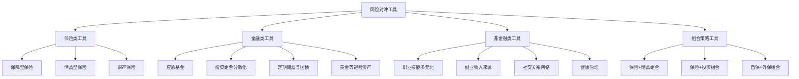
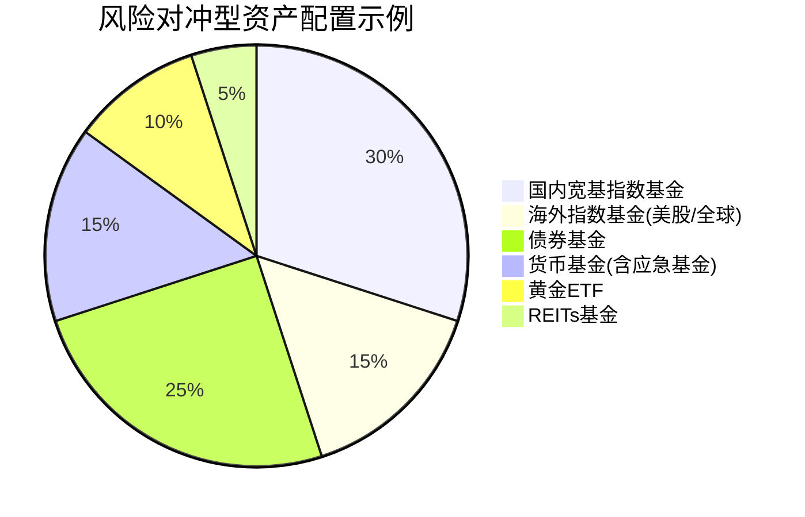
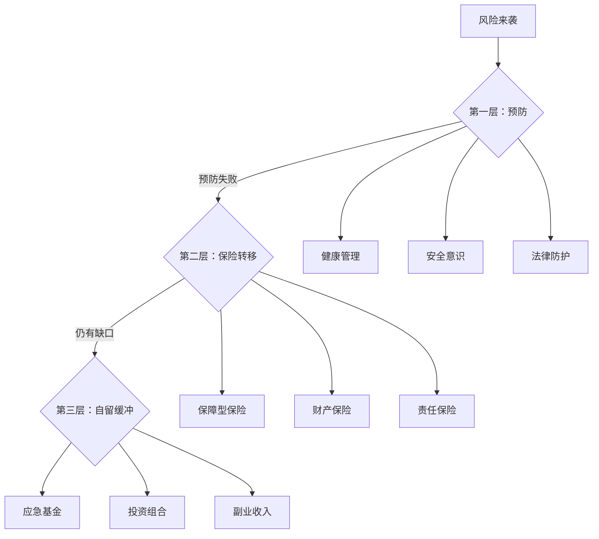

## 五、风险对冲工具

风险对冲的本质是用确定的小成本去锁定不确定的大损失。在前一章的理论基础中，我们理解了风险对冲的原理——本节将聚焦于**具体可用的工具**，从保险工具到非保险工具，从单一工具到组合策略，帮你建立完整的风险对冲工具箱。

### 1. 风险对冲工具全景图

在个人和家庭的风险管理中，可用来对冲风险的工具远不止保险。下图展示了个人可触及的主要风险对冲工具体系：



每类工具解决的风险维度不同，下面逐一展开。

---

### 2. 保险类对冲工具详解

保险是最核心的风险对冲工具——它把个体无法承受的大额损失转移给保险公司。但不同保险产品的对冲逻辑完全不同。

#### 2.1 保障型保险：损失转移的主力

保障型保险（纯消费型）是风险对冲效率最高的工具，用较低的保费撬动高额保障。

| 险种 | 对冲的风险 | 对冲机制 | 典型杠杆倍数 | 适用场景 |
|------|-----------|---------|-------------|---------|
| 定期寿险 | 身故导致家庭收入中断 | 身故赔付固定保额 | 100-300倍 | 家庭经济支柱、房贷压力 |
| 重疾险 | 重大疾病的收入损失+康复费用 | 确诊/达到标准即赔 | 30-80倍 | 所有成年人 |
| 百万医疗险 | 大额医疗费用 | 凭发票报销（扣除免赔额后） | 1000倍以上 | 所有人 |
| 意外险 | 意外伤害导致的伤残/身故/医疗 | 按伤残等级或身故赔付 | 200-500倍 | 所有人 |
| 定期寿险（全残） | 全残导致丧失劳动能力 | 全残即赔 | 100-300倍 | 高危职业者 |

**杠杆倍数的计算方法**：杠杆倍数 = 保额 ÷ 年交保费。以30岁男性为例，100万定期寿险（保至60岁，30年交），年保费约1000-1500元，杠杆倍数约670-1000倍。这是任何金融工具都难以比拟的对冲效率。

**为什么不选返还型**：返还型保险表面上"有病赔钱、没病返本"，实际上相当于你多交了一笔钱让保险公司拿去投资，到期再还给你——而他们给你的收益率通常只有1.5%-2.5%，远低于你自己做稳健理财的收益。多交的保费可以拆出来单独购买保障型+自己做基金定投，综合收益几乎一定高于返还型。

#### 2.2 储蓄型保险：长期确定性工具

储蓄型保险（年金险、增额终身寿险等）在风险对冲中的角色不同于保障型——它对冲的不是"灾难性损失"，而是"长寿风险"和"利率下行风险"。

**年金险的对冲逻辑**：
- **对冲目标**：退休后现金流不足的风险（活得太久，钱花完了）
- **机制**：年轻时定期缴费，退休后按约定领取——只要活着就能领
- **核心价值**：在利率下行周期锁定长期确定收益
- **IRR参考**：2024年后的新产品预定利率上限2.5%，实际IRR约2.0%-2.3%

**增额终身寿险的对冲逻辑**：
- **对冲目标**：资产保值增值 + 财富传承 + 一定的流动性
- **机制**：保额按约定利率（2.5%左右）逐年复利增长，可通过减保取现获得流动性
- **核心价值**：在利率下行环境中锁定终身复利，同时兼具身故保障

**储蓄型保险适用的场景**：
1. 已配齐保障型保险，仍有长期储蓄需求
2. 风险偏好极低，无法接受本金波动
3. 希望锁定长期利率（对抗利率下行）
4. 有明确的养老规划或教育金规划
5. 需要通过保险实现财富定向传承

**储蓄型保险不适用的场景**：
1. 保障型保险尚未配齐——先把保命的钱花到位
2. 短期资金需求——储蓄型保险前几年退保会亏本
3. 追求高收益——储蓄型保险的收益上限有限，跑不赢权益类投资

#### 2.3 财产保险：实物资产的对冲工具

很多人只关注人身保险，忽略了财产保险的对冲价值。

| 财产险种 | 保障对象 | 典型费用 | 对冲场景 |
|---------|---------|---------|---------|
| 家财险 | 房屋及室内财产 | 100-300元/年 | 火灾、水管爆裂、盗窃、台风暴雨 |
| 车险（商业） | 车辆及第三方责任 | 2000-8000元/年 | 交通事故、车辆损坏、第三方人伤 |
| 宠物责任险 | 宠物伤人赔偿 | 50-200元/年 | 宠物咬伤他人、损坏他人财物 |
| 个人责任险 | 日常过失造成他人损失 | 100-500元/年 | 孩子打碎商场物品、运动伤人 |
| 旅行险 | 旅行期间意外/医疗/延误 | 10-100元/次 | 航班延误、行李丢失、境外就医 |
| 手机碎屏险 | 手机屏幕损坏 | 50-150元/年 | 手机跌落碎屏 |

**家财险的隐藏价值**：一套价值300万的房子，如果因火灾或水管爆裂造成损失，修复费用可能高达几十万。一份200元/年的家财险，就能覆盖房屋主体+室内装修+家具家电+管道爆裂等风险，杠杆倍数极高。尤其对于老旧小区、高层住户，这份投入非常值得。

---

### 3. 金融类对冲工具详解

#### 3.1 应急基金：最基础的风险缓冲层

应急基金不属于"投资"，而是风险对冲的第一道防线。它对冲的是"短期现金流断裂"的风险——失业、突发医疗、意外维修等。

**应急基金的科学计算**：

```text
应急基金 = 月刚性支出 × N个月

月刚性支出 = 房租/房贷 + 基本生活费 + 保险费用 + 交通通讯 + 子女教育基础费用

N 的取值：
- 双薪稳定收入家庭：N = 3-6
- 单一收入来源家庭：N = 6-12
- 自由职业/创业期：N = 12-24
- 有慢性病成员：N = 6-12（额外预留医疗储备）
```

**应急基金的存放要求**：
- **安全性**：本金不能有任何损失风险
- **流动性**：随时可取，T+0或T+1到账
- **收益性**：在满足前两个条件的前提下尽量提高收益

**实操推荐方案**：

| 存放层级 | 工具 | 金额占比 | 到账时间 | 年化收益(2024参考) |
|---------|------|---------|---------|-------------------|
| 第一层（即时可用） | 货币基金/银行活期 | 30%-50% | 即时 | 1.5%-2.0% |
| 第二层（1-2天可用） | 短债基金/银行T+1理财 | 30%-40% | 1-2个工作日 | 2.0%-3.0% |
| 第三层（一周可用） | 大额存单/国债逆回购 | 10%-20% | 1-7天 | 2.3%-2.8% |

#### 3.2 投资组合分散化：系统性风险的对冲

投资组合分散化对冲的是"把所有鸡蛋放在一个篮子里"的风险。核心原理是现代投资组合理论（MPT）——不同资产之间的低相关性可以降低整体组合的波动率。

**分散化的四个维度**：

1. **资产类别分散**：股票、债券、商品、现金等不同大类资产
2. **地域分散**：A股、港股、美股、新兴市场等不同市场
3. **时间分散**：定投、分批建仓等不同时间窗口
4. **风格分散**：成长/价值、大盘/小盘、主动/被动等不同风格

**一个简单的风险对冲型投资组合示例（中等风险偏好）**：



**为什么黄金是重要的对冲工具**：黄金与股票市场的长期相关性接近零甚至为负。当股市暴跌时（如2008年金融危机、2020年疫情），黄金往往上涨。将5%-15%的资产配置于黄金，可以有效降低组合的最大回撤。实操上通过黄金ETF（如华安黄金ETF 518880）即可实现，费率仅0.5%/年。

#### 3.3 国债与大额存单：利率锁定工具

在利率下行周期，国债和大额存单是锁定长期利率的重要对冲工具。

**国债的优势**：
- 以国家信用为担保，安全性最高
- 利息收入免征个人所得税
- 可以提前兑取（但会损失部分利息）
- 2024年30年期国债利率约2.5%左右

**大额存单的优势**：
- 受存款保险制度保护（50万以内100%赔付）
- 利率高于同期定期存款
- 可转让、可质押
- 起存门槛通常20万元

**操作建议**：如果你判断未来利率会继续下降，现在买入长期国债或大额存单，就相当于锁定了当前的利率水平——这就是对冲利率下行风险的核心操作。

---

### 4. 非金融类对冲工具

风险对冲不仅限于金融工具。以下非金融工具同样重要，甚至在某些场景下比金融工具更有效。

#### 4.1 职业技能多元化：对冲失业风险

失业风险是个人面临的最大经济风险之一，但很多人从未把它当作需要"对冲"的风险。

**技能多元化的对冲策略**：

| 策略 | 具体做法 | 对冲效果 |
|------|---------|---------|
| 纵向深耕 | 在主业领域做到前10% | 降低被裁员概率，提高议价能力 |
| 横向扩展 | 学习主业上下游技能 | 增加转岗/转型的可能性 |
| 跨域迁移 | 掌握一个可迁移的通用技能 | 在行业衰退时有退路 |
| 副业验证 | 在职期间发展可变现的副业 | 提供第二收入来源的验证 |

**最具对冲价值的通用技能**（按变现能力排序）：
1. **写作/内容创作**：几乎所有行业都需要，可远程工作
2. **编程/自动化**：提高效率的通用工具，副业变现路径清晰
3. **销售/谈判**：任何商业活动的核心能力
4. **数据分析**：从数据中发现价值的能力越来越重要
5. **英语/外语**：打开海外市场和信息的窗口

#### 4.2 副业收入来源：对冲单一收入风险

副业的价值不仅是"多赚点钱"，而是构建一个与主业不相关的收入来源——当主业出问题时，副业可以部分甚至完全替代。

**副业的风险对冲评估框架**：

```text
副业对冲价值 = 与主业的相关性 × 收入稳定性 × 可持续性

- 与主业相关性越低，对冲效果越好（主业裁员时副业不受影响）
- 收入越稳定，对冲效果越好（不是偶尔赚一笔）
- 可持续性越强，对冲效果越好（不是一次性的）
```

**高对冲价值副业的特征**：
- 时间灵活，不影响主业
- 技能可积累，越做越值钱
- 与主业行业周期不同步（一个行业的低谷可能是另一个的高峰）
- 不依赖单一客户或平台

#### 4.3 健康管理：对冲医疗风险的源头

保险是在风险发生后提供经济补偿，而健康管理是在风险发生前降低其概率。从对冲角度看，健康管理是"预防性对冲"，效率远高于"事后补偿"。

**高对冲价值的健康管理投入**：

| 投入项目 | 年成本 | 对冲的风险 | ROI分析 |
|---------|--------|-----------|--------|
| 定期体检（含专项筛查） | 500-3000元 | 重大疾病晚期发现 | 早期发现癌症的5年生存率可达90%+，晚期降至20%以下 |
| 规律运动 | 时间成本 | 心脑血管疾病、代谢病 | WHO数据：每周150分钟中等强度运动降低心血管风险30% |
| 心理健康管理 | 0-5000元 | 抑郁、焦虑、职业倦怠 | 心理问题导致的误工和医疗成本远超预防投入 |
| 高质量睡眠 | 改善环境成本 | 免疫力下降、认知衰退 | 长期睡眠不足与阿尔茨海默症风险显著相关 |

#### 4.4 法律工具：对冲法律风险

法律风险往往被严重低估。以下法律工具是重要的风险对冲手段：

- **遗嘱**：对冲意外身故后财产分配纠纷的风险。即使资产不多，有遗嘱也能避免家庭成员因财产分割产生矛盾。
- **婚前/婚内财产协议**：对冲婚姻变动带来的财产风险。不是不信任，而是明确权责。
- **授权委托书**：对冲因疾病/意外丧失行为能力后无人处理事务的风险。可在健康时预先指定信任的人代为处理。
- **借条/合同规范**：对冲民间借贷和商业合作中的违约风险。白纸黑字写清楚，是最低成本的法律对冲。

---

### 5. 组合策略：把工具组合成系统

单一工具只能对冲单一风险，真正的风险管理需要将多种工具组合成一个系统。

#### 5.1 "三层防线"组合模型



**三层防线的逻辑**：
1. **第一层（预防）**：尽量不让风险发生——健康生活、注意安全、法律保护
2. **第二层（转移）**：风险发生后由保险公司承担——保障型保险
3. **第三层（自留）**：保险覆盖不到的部分自己承担——应急基金、投资收益、副业收入

#### 5.2 不同人生阶段的工具组合

| 阶段 | 年龄段 | 核心对冲工具 | 次要工具 | 预算占比(年收入) |
|------|--------|------------|---------|----------------|
| 单身期 | 22-28岁 | 意外险+百万医疗+应急基金 | 职业技能投资 | 3%-5% |
| 成家期 | 28-35岁 | 定期寿险+重疾险+医疗险+家财险 | 副业+基金定投 | 5%-8% |
| 成熟期 | 35-50岁 | 全面保障+投资组合+养老规划 | 子女教育金+法律工具 | 8%-12% |
| 退休期 | 50-65岁 | 年金险+医疗险+健康管理 | 国债+低风险理财 | 5%-10% |
| 养老期 | 65岁+ | 医疗险(续保)+护理险 | 应急基金+子女支持 | 3%-5% |

#### 5.3 "保险+储蓄"组合策略详解

这是最经典的对冲组合之一，核心思想是"保障归保障，储蓄归储蓄"。

**组合方案示例**（年收入20万的30岁男性）：

| 组件 | 产品类型 | 年费用 | 解决的问题 |
|------|---------|--------|-----------|
| 重疾险 | 消费型，50万保额，保至70岁 | 3000-4000元 | 重大疾病期间的收入损失 |
| 定期寿险 | 100万保额，保至60岁 | 1000-1500元 | 身故后家庭经济保障 |
| 百万医疗险 | 保证续保20年 | 300-500元 | 大额医疗费用 |
| 意外险 | 100万保额 | 150-300元 | 意外伤残/身故/医疗 |
| 应急基金 | 货币基金+短债 | 年存入3-5万 | 短期现金流断裂 |
| 基金定投 | 宽基指数基金 | 年投入2-4万 | 长期资产增值、对抗通胀 |
| **合计** | | **约7-11万/年** | **全面覆盖** |

这个组合中，保障型保险用不到1万的年支出覆盖了200万+的风险敞口；应急基金提供6-12个月的缓冲；基金定投则对冲长期通胀风险。三者各司其职，形成完整的对冲体系。

---

### 6. 对冲工具的选购决策框架

面对众多工具，如何做选择？以下是实操决策流程：

#### 6.1 需求评估四步法

```text
第一步：列出你面临的所有风险
  - 身故/全残风险
  - 重大疾病风险
  - 意外伤害风险
  - 财产损失风险
  - 失业/收入中断风险
  - 长寿/养老资金不足风险
  - 法律纠纷风险
  - 通胀侵蚀购买力风险

第二步：评估每个风险的概率和损失金额
  - 概率 × 损失 = 风险敞口
  - 优先处理风险敞口最大的

第三步：确定哪些风险需要转移，哪些可以自留
  - 高频低损 → 自留（应急基金覆盖）
  - 低频高损 → 转移（购买保险）
  - 低频低损 → 忽略或自留
  - 高频高损 → 必须转移且尽量预防

第四步：选择具体工具并配置
  - 按预算从核心到辅助逐步配置
  - 不追求一步到位，先解决最大的风险
```

#### 6.2 工具选择的常见误区

| 误区 | 正确做法 | 原因分析 |
|------|---------|---------|
| 只买保险不做储蓄 | 保险+应急基金+投资 | 保险只覆盖合同约定的风险，还有大量风险需要自己缓冲 |
| 储蓄型保险当投资 | 保障型保险+独立投资 | 储蓄型保险收益率有限，且流动性差 |
| 应急基金放在定期存款 | 分层存放（活期+货基+短债） | 定期存款提前支取损失利息，违背流动性要求 |
| 投资组合全押股票 | 股债平衡+另类资产 | 全股票组合波动太大，可能在急需用钱时正好大跌 |
| 忽视财产保险 | 配置家财险+责任险 | 一份200元/年的家财险可以覆盖数十万的财产风险 |
| 只关注赚钱忽略健康 | 健康管理是最高ROI的对冲 | 一场大病的经济影响远超任何投资收益 |

---

### 7. 进阶：动态对冲与定期检视

风险对冲不是一次性工作，而是一个需要定期检视和调整的动态过程。

#### 7.1 何时需要重新评估对冲策略

以下事件触发时，必须重新审视你的对冲工具组合：

1. **收入重大变化**：涨薪30%以上或收入下降——保额和应急基金需要同步调整
2. **家庭结构变化**：结婚、生子、离婚、家庭成员去世——受益人、保额、保障范围需要重新设计
3. **负债变化**：新增房贷或还清房贷——定期寿险保额需要覆盖负债
4. **健康状况变化**：确诊慢性病或体检异常——可能需要加保或调整险种
5. **政策变化**：社保政策调整、保险产品下架——需要替换或补充
6. **市场利率变化**：利率大幅下行——储蓄型保险和固收类工具的配置比例需调整

#### 7.2 年度检视清单

建议每年做一次完整的对冲策略检视，以下是检查清单：

```text
□ 保障型保险
  □ 保额是否覆盖当前负债+5-10年家庭支出？
  □ 受益人信息是否需要更新？
  □ 是否有更优性价比的产品可以替换？
  □ 续保条件是否仍然满足？

□ 应急基金
  □ 金额是否覆盖当前3-6个月刚性支出？
  □ 存放方式是否最优（收益与流动性的平衡）？
  □ 是否被挪用过？需要补充吗？

□ 投资组合
  □ 各类资产比例是否偏离目标配置超过5%？
  □ 是否需要再平衡？
  □ 是否有新的投资工具值得纳入？

□ 非金融工具
  □ 职业技能是否有新的发展方向？
  □ 副业收入是否稳定增长？
  □ 体检是否按时完成？健康指标有无异常？
  □ 法律文件（遗嘱、协议等）是否需要更新？
```

#### 7.3 一个真实的动态对冲案例

**背景**：张先生，35岁，互联网行业，年收入40万，有房贷200万，妻子全职带娃，孩子2岁。

**初始配置（2023年）**：
- 定期寿险200万（覆盖房贷）
- 重疾险50万
- 百万医疗险
- 意外险100万
- 应急基金15万
- 基金定投月3000元

**2024年变化**：妻子生二胎，张先生升职加薪至55万，房贷余额降至150万。

**调整方案**：
- 定期寿险加保至300万（两个孩子+房贷+家庭支出增加）
- 妻子配置定期寿险+重疾险+医疗险（全职妈妈也有经济价值，如果她生病需要人照顾或请保姆，家庭开支会大幅增加）
- 应急基金增至25万（四口之家，月刚性支出增加）
- 基金定投增至月5000元（收入增加，长期投资相应增加）
- 开始考虑教育金规划（两个孩子的教育储备）

这个案例说明：对冲策略必须跟着生活变化动态调整，"买了保险就一劳永逸"的想法极其危险。

---

### 8. 工具对比速查表

最后，用一张表汇总所有主要对冲工具的核心特征，方便速查：

| 工具 | 对冲的风险 | 成本 | 杠杆率 | 流动性 | 优先级 |
|------|-----------|------|--------|--------|--------|
| 百万医疗险 | 大额医疗费用 | 低(300-800元/年) | 极高 | N/A | ★★★★★ |
| 意外险 | 意外伤残/身故 | 极低(150-300元/年) | 极高 | N/A | ★★★★★ |
| 定期寿险 | 身故致收入中断 | 低(1000-3000元/年) | 高 | N/A | ★★★★☆ |
| 重疾险 | 重疾收入损失 | 中(3000-8000元/年) | 中 | N/A | ★★★★☆ |
| 应急基金 | 短期现金流断裂 | 机会成本 | 低 | 极高 | ★★★★★ |
| 家财险 | 房屋财产损失 | 极低(100-300元/年) | 高 | N/A | ★★★★☆ |
| 基金定投 | 通胀侵蚀 | 按计划投入 | 中 | 高 | ★★★★☆ |
| 黄金ETF | 系统性风险 | 管理费0.5%/年 | 低 | 高 | ★★★☆☆ |
| 年金险 | 长寿风险 | 高(年缴万元+) | 低 | 低 | ★★★☆☆ |
| 国债 | 利率下行风险 | 按面值买入 | 低 | 中 | ★★★☆☆ |
| 副业收入 | 失业/收入中断 | 时间成本 | 中 | 中 | ★★★★☆ |
| 健康管理 | 疾病风险 | 低-中 | 极高 | N/A | ★★★★★ |

> **核心原则**：优先配置高杠杆、低成本的保障型保险（百万医疗、意外险、定期寿险），再建立应急基金，最后考虑投资组合和储蓄型保险。先保命，再保钱，最后赚钱。

---

### 9. 常见问题解答

**Q：我收入不高，应该先买哪个工具？**

A：按以下顺序逐步配置，不要一步到位：
1. 医保（必须有）→ 2. 百万医疗险（约300元/年）→ 3. 意外险（约150元/年）→ 4. 应急基金（逐步积累）→ 5. 定期寿险（有负债/家庭责任时）→ 6. 重疾险（预算充足时）

**Q：保险和投资的钱应该怎么分配？**

A：一个简单的参考比例——保险费用占家庭年收入的5%-10%（保障型），投资储蓄占20%-30%。如果保险预算紧张，先用2%-3%把百万医疗+意外险+定期寿险配齐，这三样加起来不到5000元/年就能覆盖200万+的风险敞口。

**Q：有了社保还需要这些工具吗？**

A：社保是基础保障，但存在明显缺口：医保有起付线、封顶线和自费药限制（实际报销比例约50%-70%）；社保没有身故保障和重疾一次性赔付；失业保险的金额和期限都很有限。商业保险和非保险工具是社保的必要补充。

**Q：如何判断一个工具是否值得买？**

A：三个判断标准：
1. **杠杆率**：保额÷年保费，越高越好
2. **不可替代性**：这个风险有没有其他更便宜的方式覆盖
3. **机会成本**：这笔钱如果用于其他用途，收益是否更高
