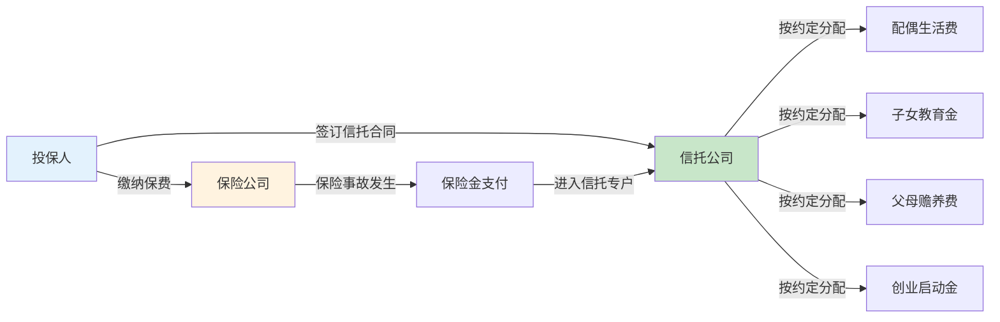
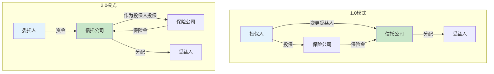
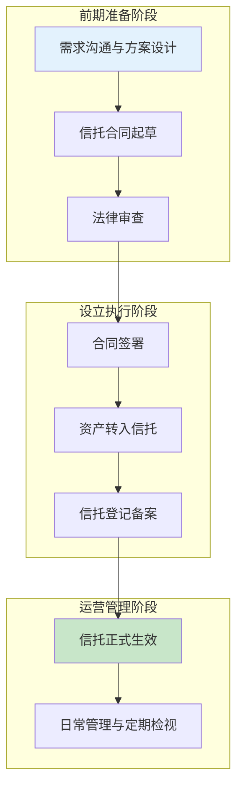
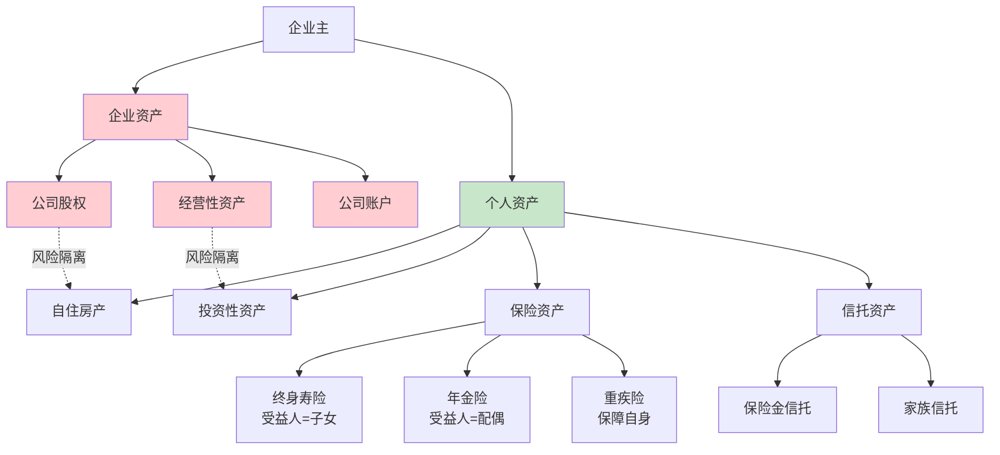

## 六、资产保护与信托

### 6.0 为什么需要资产保护？

保险的核心功能是风险转移，但当你的资产达到一定规模后，仅靠保险已经不够——你需要一套**资产保护体系**，确保辛苦积累的财富不会因为法律纠纷、婚姻变故、企业经营风险或意外事件而一夜归零。

资产保护不是"逃债"或"避税"，它的本质是：**在合法合规的前提下，通过合理的法律架构安排，将个人资产与潜在风险隔离开来，确保在最坏的情况下，你和家人的基本生活保障不会受到影响。**

#### 6.0.1 资产保护的三大核心场景

| 场景 | 风险来源 | 可能后果 | 典型案例 |
|------|---------|---------|---------|
| 企业经营风险 | 公司债务、担保、诉讼 | 个人资产被牵连偿还企业债务 | 企业主用个人房产为企业贷款做担保，企业破产后房产被拍卖 |
| 婚姻风险 | 离婚财产分割、配偶债务 | 婚前财产被分割、共同债务连带 | 婚后一方经营失败，另一方婚前房产被用于偿债 |
| 人身风险 | 重大疾病、意外身故、伤残 | 家庭失去经济来源，资产被迫低价变现 | 经济支柱猝死，家人被迫低价卖房偿还贷款 |

#### 6.0.2 资产保护的法律基础

资产保护的合法性建立在以下法律原则之上：

**《中华人民共和国信托法》（2001年）**——确立了信托财产的独立性原则。该法第十五条规定："信托财产与委托人未设立信托的其他财产相区别"；第十六条规定："信托财产与属于受托人所有的财产相区别，不得归入受托人的固有财产或者成为固有财产的一部分。"

**《中华人民共和国保险法》（2009年修订）**——第二十三条规定："任何单位和个人不得非法干预保险人履行赔偿或者给付保险金的义务，也不得限制被保险人或者受益人取得保险金的权利。"第四十二条规定了保险金作为受益人个人财产的法律地位。

**《中华人民共和国婚姻法》/《民法典》婚姻家庭编**——第十八条规定了婚前财产属于个人财产，第一千零六十三条规定了遗嘱或赠与合同中确定只归一方的财产为个人财产。

这些法律条款构成了资产保护的制度基础。需要强调的是：**资产保护必须在风险发生之前进行规划。** 如果风险已经发生（如已被起诉、已经负债），再去转移资产，法律上可能被认定为"恶意转移财产"而被撤销。

***

### 6.1 保险金信托：保险+信托的双重保护

#### 6.1.1 什么是保险金信托？

保险金信托是将保险与信托相结合的一种金融工具，其基本结构是：

1. 投保人购买大额人寿保险（通常是终身寿险或年金险）
2. 将保险合同的受益人变更为信托公司
3. 保险事故发生后，保险金不直接支付给个人，而是进入信托专户
4. 信托公司按照信托合同的约定，管理和分配这笔资金



#### 6.1.2 保险金信托的三大核心价值

**价值一：保险金的定向分配**

普通保险理赔后，保险金一次性支付给受益人，存在三个问题：
- 受益人可能不具备管理大额资金的能力（如未成年子女）
- 受益人可能挥霍无度
- 受益人可能面临婚姻风险，保险金可能被配偶分割

保险金信托解决这些问题的方式是：将保险金放入信托，由专业受托人按照委托人设定的条件和时间表进行分配。例如：

| 分配条件 | 分配方式 | 设计意图 |
|---------|---------|---------|
| 子女满18岁 | 每年发放10万元生活费 | 保障基本生活 |
| 子女考入大学 | 额外发放20万元教育金 | 激励学业 |
| 子女结婚 | 发放50万元婚嫁金 | 人生大事支持 |
| 子女创业 | 发放100万元启动金（需提交商业计划） | 支持创业但防止盲目 |
| 子女满35岁 | 一次性发放剩余本金 | 成熟后自主管理 |

**价值二：债务隔离功能**

保险金一旦进入信托账户，就成为信托财产，与委托人的其他财产相分离。即使委托人日后面临债务纠纷，信托财产原则上不受影响（前提是在负债前设立，非恶意避债）。

法律依据：《信托法》第十七条明确规定，除以下四种情形外，对信托财产不得强制执行：
1. 设立信托前债权人已对该信托财产享有优先受偿的权利
2. 受托人处理信托事务所产生债务
3. 信托财产本身应担负的税款
4. 法律规定的其他情形

**价值三：跨代财富传承**

保险金信托可以实现财富的跨代传承，避免"富不过三代"的困境。通过设定复杂的分配条件，激励后代积极向上，同时防止财富被一次性挥霍。

#### 6.1.3 保险金信托的门槛与成本

| 项目 | 费用/门槛 | 说明 |
|------|----------|------|
| 保险保额门槛 | 通常100万起 | 部分信托公司要求300万起 |
| 信托设立费 | 1-3万元 | 一次性收取 |
| 信托管理费 | 0.3%-1%/年 | 按信托资产规模收取 |
| 保险产品要求 | 终身寿险或年金险为主 | 需要与信托公司对接 |
| 设立周期 | 2-4周 | 包括投保+信托合同签署 |

#### 6.1.4 保险金信托的两种模式

**模式一：1.0模式（保险金信托）**

先投保，再将保单受益人变更为信托公司。保险事故发生后，保险金进入信托。

适用场景：已购买大额保单的客户，希望增加保险金的管理功能。

**模式二：2.0模式（保险金信托升级版）**

投保人将保单转让给信托公司，由信托公司作为投保人和受益人。委托人将资金交给信托公司，信托公司用这笔资金缴纳保费。

优势：
- 保单本身也属于信托财产，具有更强的资产隔离效果
- 避免了投保人退保、保单被冻结的风险
- 更高的法律保护强度



#### 6.1.5 保险金信托的实操流程

**第一步：选择保险公司和信托公司**

目前国内开展保险金信托业务的主要机构：

| 信托公司 | 合作保险公司 | 起投门槛 | 特色 |
|---------|------------|---------|------|
| 中信信托 | 中信保诚、泰康等 | 100万保额 | 规模最大，产品线丰富 |
| 平安信托 | 平安人寿 | 100万保额 | 集团内协同，流程顺畅 |
| 外贸信托 | 多家保险公司 | 100万保额 | 合作公司多，选择灵活 |
| 长安信托 | 多家保险公司 | 100万保额 | 服务响应快 |

**第二步：投保并确定保险方案**

根据资产规模和传承需求，确定保险产品的类型和保额：

| 资产规模 | 建议保额 | 产品类型 | 信托功能定位 |
|---------|---------|---------|------------|
| 500万-1000万 | 100-300万 | 终身寿险 | 基础保障+定向传承 |
| 1000万-3000万 | 300-800万 | 终身寿险+年金险 | 传承+教育金+养老金 |
| 3000万-1亿 | 800-3000万 | 大额终身寿险 | 家族财富传承核心架构 |
| 1亿以上 | 3000万以上 | 定制化方案 | 家族信托+保险金信托综合方案 |

**第三步：签订信托合同**

信托合同是保险金信托的核心文件，需要明确以下要素：
- **委托人**：设立信托的人（通常是投保人）
- **受托人**：信托公司
- **受益人**：享受信托利益的人（配偶、子女、父母等）
- **信托财产**：保险金
- **分配方案**：何时、向谁、分配多少、什么条件
- **信托期限**：通常10-50年，甚至永续
- **终止条件**：信托何时结束

**第四步：变更保单受益人（1.0模式）或转让保单（2.0模式）**

联系保险公司办理受益人变更或保单转让手续，确保信托公司成为保单的合法受益人或投保人。

**第五步：后续管理与检视**

每年检视信托合同，根据家庭状况变化（如子女出生、婚姻变化、资产增减）调整分配方案。

***

### 6.2 家族信托：高净值家庭的终极保护工具

#### 6.2.1 什么是家族信托？

家族信托是一种更为全面的资产保护和传承工具，其核心架构是：委托人将一定规模的资产（现金、房产、股权、艺术品等）委托给信托公司管理，信托公司按照信托合同的约定，为受益人的利益进行管理和分配。

与保险金信托相比，家族信托的资产范围更广、功能更全面：

| 对比维度 | 保险金信托 | 家族信托 |
|---------|----------|---------|
| 信托财产 | 仅限保险金 | 现金、房产、股权、艺术品等 |
| 设立门槛 | 100万保额起 | 通常1000万起 |
| 设立成本 | 较低（1-3万） | 较高（10-50万） |
| 管理费 | 0.3%-1%/年 | 0.5%-2%/年 |
| 功能范围 | 保险金定向分配 | 资产管理+传承+税务规划+公益 |
| 适用人群 | 中高净值家庭 | 高净值/超高净值家庭 |

#### 6.2.2 家族信托的核心功能

**功能一：资产隔离与保护**

家族信托一旦设立，信托财产就独立于委托人、受托人和受益人的固有财产。这意味着：
- 委托人破产时，信托财产不受影响
- 受益人离婚时，信托财产不被分割
- 受托人破产时，信托财产不被清算

**功能二：财富传承规划**

家族信托可以实现跨代甚至永续的财富传承：

```text
信托设立
    ├── 第一代（子女）：生活保障、教育支持
    ├── 第二代（孙辈）：创业支持、婚嫁礼金
    ├── 第三代（曾孙辈）：教育基金、医疗保障
    └── ......
```

**功能三：家族治理**

通过信托条款的设计，可以建立家族治理机制：
- 设立家族委员会，参与信托重大决策
- 制定家族宪章，明确家族价值观和行为准则
- 设立家族基金会，开展公益慈善活动

**功能四：税务规划**

在合法合规的前提下，信托可以帮助优化税务结构：
- 遗产规划：通过信托安排，合理规划未来可能开征的遗产税
- 所得分配：通过合理的分配方案，优化受益人的税负

#### 6.2.3 家族信托的设立条件与流程

**设立条件：**

1. **资产门槛**：通常1000万人民币起，部分信托公司要求3000万起
2. **委托人资格**：具有完全民事行为能力的自然人或法人
3. **资产合法性**：信托财产必须来源合法
4. **设立时间**：必须在风险发生前设立，否则可能被认定为恶意避债

**设立流程：**



**关键文件清单：**

| 文件 | 用途 | 注意事项 |
|------|------|---------|
| 信托合同 | 明确各方权利义务 | 必须由专业律师审核 |
| 资产证明 | 证明资产来源合法 | 包括银行流水、股权证明等 |
| 受益人身份证明 | 确认受益人资格 | 需要身份证、户口本等 |
| 风险测评问卷 | 评估委托人风险承受能力 | 信托公司要求的标准流程 |
| 税务合规声明 | 确认税务合规 | 避免未来税务纠纷 |

#### 6.2.4 家族信托的费用结构

| 费用项目 | 费率/金额 | 说明 |
|---------|----------|------|
| 设立费 | 10-50万元 | 一次性收取，与信托规模相关 |
| 管理费 | 0.5%-2%/年 | 按信托资产规模收取 |
| 投资顾问费 | 0.5%-1%/年 | 如需专业投资管理 |
| 法律顾问费 | 5-20万元/年 | 复杂架构可能更高 |
| 变更手续费 | 1-5万元/次 | 修改信托条款时收取 |
| 终止费 | 1-3万元 | 信托结束时收取 |

#### 6.2.5 家族信托的常见架构

**架构一：简单家族信托**

委托人→信托公司→受益人（配偶、子女）

适合资产规模1000-3000万、家庭关系简单的家庭。

**架构二：家族信托+有限合伙**

```text
委托人 → 家族信托 → 有限合伙企业（LP）→ 经营性资产
                        ↑
                   家族成员（GP）管理经营
```

适合持有企业股权的家族，通过有限合伙实现所有权与经营权分离。

**架构三：多层信托架构**

```text
委托人 → 境内家族信托 → 境内资产
         → 境外家族信托 → 境外资产
         → 慈善信托 → 公益捐赠
```

适合拥有境内外资产的超高净值家庭。

***

### 6.3 债务隔离：企业主的必修课

#### 6.3.1 为什么企业主需要债务隔离？

在中国，很多中小企业主存在一个致命的风险：**个人资产与企业资产混同。** 具体表现为：

- 用个人账户收取公司货款
- 用个人房产为企业贷款做担保
- 以个人名义为企业借款
- 公司账目与个人账目不分

一旦企业经营出现风险（如亏损、被起诉、破产），这些混同的资产将面临被追偿的风险。更严重的是，如果存在"公司人格混同"（即公司与个人财产不分），法院可能"刺破公司面纱"，直接追究股东的个人责任。

#### 6.3.2 债务隔离的五层防护体系

**第一层：公司治理规范化**

这是最基础也是最重要的防护措施：

| 混同行为 | 正确做法 | 法律后果 |
|---------|---------|---------|
| 个人账户收公司货款 | 必须走公司对公账户 | 混同则可能承担连带责任 |
| 个人为公司担保 | 避免个人担保，用公司资产抵押 | 担保则承担担保责任 |
| 公司账目不清 | 建立规范的财务制度 | 账目不清可能被认定人格混同 |
| 公司与个人资产不分 | 严格区分，独立管理 | 混同则丧失有限责任保护 |

**第二层：保险资产保护**

根据《保险法》第二十三条和第四十二条，保险金具有一定的法律保护地位：

- **人寿保险金**：在指定受益人的情况下，保险金属于受益人的个人财产，不属于被保险人的遗产，原则上不用于偿还被保险人的债务
- **年金保险**：定期给付的年金，在一定条件下具有债务隔离功能

但需要注意的重要限制：

> ⚠️ **关键提醒**：保险的债务隔离功能有严格的前提条件：
> 1. 投保时不存在恶意避债的意图
> 2. 投保资金来源合法且非负债资金
> 3. 保费支出合理，不影响正常偿债能力
> 4. 保险合同合法有效
>
> 如果法院认定投保行为属于"恶意避债"（如明知即将被起诉仍大量购买保险），可以依法撤销保险合同。

**第三层：保险金信托隔离**

如前所述，保险金信托通过将保险金转化为信托财产，实现了更强的债务隔离效果。关键优势在于：
- 信托财产独立于委托人的其他财产
- 即使委托人破产，信托财产原则上不受影响
- 但同样要求在风险发生前合法设立

**第四层：家族信托隔离**

家族信托提供最强的资产隔离效果，但设立门槛也最高。适合资产规模较大的企业主。

**第五层：资产代持与保险规划**

对于不适合设立信托的资产，可以通过合理的保险规划实现部分保护：
- 为配偶和子女购买大额人寿保险
- 设立合理的受益人安排
- 结合遗嘱和保险进行综合规划

#### 6.3.3 企业主资产保护的典型架构



**架构要点：**
1. 企业资产与个人资产严格分离，用不同颜色标识风险边界
2. 保险资产（终身寿险、年金险）作为个人资产的核心保护层
3. 信托资产（保险金信托、家族信托）提供更强的隔离效果
4. 自住房产作为基本生活保障，应避免为企业债务做担保

#### 6.3.4 债务隔离的时间窗口

资产保护必须在风险发生前进行，这被称为"机会窗口"：

| 时间节点 | 可采取的措施 | 法律效力 |
|---------|------------|---------|
| 企业经营良好时 | 设立信托、购买保险、规范治理 | 最高，完全合法有效 |
| 企业出现经营困难 | 加强保险配置、调整受益人 | 较高，但需注意合理性 |
| 已知即将面临诉讼 | 仅限合理范围内的保险购买 | 较低，可能被质疑 |
| 已被起诉或已负债 | 几乎无法进行资产转移 | 无效，可能被撤销 |

> ⚠️ **核心原则**：资产保护是"未雨绸缪"，不是"亡羊补牢"。在你不需要它的时候做准备，才是最有效的保护。

***

### 6.4 婚前财产规划：保护你的婚前资产

#### 6.4.1 婚前财产的法律地位

根据《民法典》第一千零六十三条，以下财产属于夫妻一方的个人财产：
1. 一方的婚前财产
2. 一方因受到人身损害获得的赔偿或者补偿
3. 遗嘱或者赠与合同中确定只归一方的财产
4. 一方专用的生活用品
5. 其他应当归一方的财产

但问题在于：**婚前财产在婚后可能与共同财产混同，导致其个人财产性质难以证明。** 例如：
- 婚前存款在婚后多次进出，无法区分哪笔是婚前的
- 婚前房产在婚后出售，房款与婚后收入混在一起
- 婚前股票账户在婚后继续操作，收益属于共同财产

#### 6.4.2 婚前财产保护的四种工具

**工具一：婚前财产公证**

最直接的保护方式，通过公证处对婚前财产进行公证，明确哪些财产属于个人。

| 优点 | 缺点 |
|------|------|
| 法律效力强，证据力最高 | 可能影响感情，被视为"不信任" |
| 费用低（几百到几千元） | 仅能证明婚前的财产状况 |
| 操作简单，当天出证 | 婚后财产增值部分仍可能争议 |

**工具二：人寿保险**

通过购买人寿保险实现婚前财产的保护和传承：

| 保险类型 | 保护方式 | 适用场景 |
|---------|---------|---------|
| 婚前购买终身寿险 | 保费由婚前财产支付，受益人设为父母或子女 | 保护婚前资产不被分割 |
| 婚前购买年金险 | 年金收益属于个人财产（如婚前已缴清） | 为婚后提供稳定的个人收入 |
| 婚后为配偶购买 | 体现关爱，但保费可能被认定为共同财产支出 | 夫妻关系良好时的保障安排 |

关键操作要点：
- **保费来源**：必须用婚前个人财产支付，保留完整的资金流水证明
- **缴费方式**：尽量一次性缴清（趸交），避免婚后用共同财产继续缴费
- **受益人指定**：明确指定受益人（父母或子女），避免法定继承的争议

**工具三：家族信托**

对于资产规模较大的人群，婚前设立家族信托是最强的保护方式：

- 将婚前资产装入信托，信托财产独立于夫妻共同财产
- 即使离婚，信托财产原则上不参与分割
- 可以设定分配条件，保障自己和子女的利益

**工具四：婚前协议**

虽然在国内接受度不如西方国家高，但婚前协议是合法有效的法律文件，可以约定：
- 婚前财产的归属
- 婚后收入的分配方式
- 离婚时财产的分割方案
- 债务的承担方式

#### 6.4.3 婚前财产保护的实操清单

```text
婚前财产保护 Checklist：

□ 整理婚前财产清单
  ├── 房产：产权证、购房合同、付款凭证
  ├── 存款：银行流水、存款证明
  ├── 股票/基金：账户截图、交易记录
  ├── 车辆：行驶证、购车发票
  ├── 公司股权：公司章程、出资证明
  └── 其他：贵重物品、知识产权等

□ 保留完整的资金流向证据
  ├── 婚前财产的来源证明
  ├── 婚前财产与婚后收入的隔离
  └── 所有大额支出的凭证

□ 选择合适的保护工具
  ├── 资产规模 < 500万：婚前公证 + 保险
  ├── 资产规模 500-3000万：保险 + 保险金信托
  └── 资产规模 > 3000万：家族信托 + 保险

□ 办理相关手续
  ├── 婚前财产公证
  ├── 保险投保（婚前完成缴费）
  ├── 信托设立（婚前完成资产转入）
  └── 婚前协议签署（如适用）

□ 定期检视与更新
  ├── 每年检查财产状况
  ├── 重大生活事件后重新评估
  └── 法律法规变化后调整方案
```

***

### 6.5 不同人群的资产保护策略

#### 6.5.1 普通工薪阶层（年收入10-30万）

**核心目标**：基础保障，防止因病致贫

**推荐方案：**

| 工具 | 用途 | 预算占比 |
|------|------|---------|
| 重疾险 | 弥补收入损失 | 年收入5%-8% |
| 百万医疗险 | 覆盖大额医疗费用 | 几百元/年 |
| 定期寿险 | 保障家庭负债（房贷等） | 年收入1%-2% |
| 意外险 | 覆盖意外风险 | 几百元/年 |

**资产保护重点**：
- 为房贷购买等额的定期寿险
- 为家庭经济支柱配置充足的重疾险保额
- 指定明确的受益人，避免保险金被用于偿债

#### 6.5.2 中产阶层（年收入30-100万）

**核心目标**：全面保障+基础资产隔离

**推荐方案：**

| 工具 | 用途 | 说明 |
|------|------|------|
| 终身寿险 | 资产传承+债务隔离 | 保额200-500万 |
| 年金险 | 养老规划+资产保护 | 锁定长期收益 |
| 保险金信托 | 保险金定向分配 | 100万保额起 |
| 婚前财产公证 | 婚前资产保护 | 如适用 |

**资产保护重点**：
- 配置终身寿险，指定子女为受益人
- 考虑设立保险金信托，保障保险金的合理使用
- 如有房贷，定期寿险保额应覆盖贷款余额

#### 6.5.3 高净值人群（年收入100万以上或资产1000万以上）

**核心目标**：系统化资产保护+家族传承

**推荐方案：**

| 工具 | 用途 | 说明 |
|------|------|------|
| 大额终身寿险 | 核心传承工具 | 保额500万-3000万 |
| 家族信托 | 全面资产保护与传承 | 1000万起 |
| 保险金信托 | 保险金管理与分配 | 终身寿险+信托 |
| 股权架构设计 | 企业资产与个人资产隔离 | 有限合伙、持股平台 |
| 家族基金会 | 公益慈善+家族治理 | 超高净值家庭适用 |

**资产保护重点**：
- 建立完整的资产隔离架构
- 通过家族信托实现跨代传承
- 规范企业治理，避免个人与企业资产混同
- 配置专业的法律、税务、信托顾问团队

***

### 6.6 常见误区与避坑指南

#### 误区一：保险可以完全避债

**真相**：保险的债务隔离功能有严格限制。如果投保行为被法院认定为"恶意避债"（如明知即将被起诉仍大量购买保险），法院可以依法撤销保险合同。保险保护的是合法、合理、非恶意的资产安排。

#### 误区二：设立信托就可以高枕无忧

**真相**：信托的保护效果取决于设立的时间和方式。如果在负债后才设立信托，或者信托条款设计不合理，保护效果会大打折扣甚至无效。信托需要专业律师参与设计，不是简单的"把钱放进去就行"。

#### 误区三：婚前财产永远是个人财产

**真相**：婚前财产如果与婚后共同财产混同，其个人财产性质可能丧失。例如，婚前存款在婚后用于共同生活支出，或者婚前房产在婚后加上配偶名字，都可能导致财产性质变化。关键是**保持婚前财产的独立性，保留完整的证据链**。

#### 误区四：资产保护等于逃税

**真相**：合法的资产保护和税务规划是在法律框架内进行的合理安排，与逃税有本质区别。逃税是违法行为，而资产保护是利用法律赋予的权利进行合理规划。但需要注意，任何资产保护方案都必须经得起法律的审查。

#### 误区五：只有富人才需要资产保护

**真相**：任何有资产、有负债、有家庭的人都需要资产保护。普通家庭最大的风险是"因病致贫"和"房贷断供"，通过合理的保险配置和受益人安排，就能实现基本的资产保护。

#### 误区六：受益人填"法定"就行

**真相**：填写"法定受益人"意味着保险金将作为被保险人的遗产处理，需要按照法定继承程序分配。这不仅耗时长，还可能被用于偿还被保险人的债务。**务必明确指定受益人及其受益比例**，才能实现保险金的定向传承和债务隔离。

***

### 6.7 进阶专题：信托的法律架构与税务影响

#### 6.7.1 信托财产的法律性质

信托财产在中国法律体系中具有独特的法律地位：

1. **独立性**：信托财产独立于委托人、受托人和受益人的固有财产
2. **不得强制执行**：原则上不得对信托财产强制执行（法律另有规定除外）
3. **破产隔离**：委托人或受托人破产时，信托财产不纳入破产财产
4. **不可继承**：委托人死亡时，信托财产不作为遗产继承

但这种独立性不是绝对的，存在以下例外情况：
- 设立信托前，债权人已对该财产享有优先受偿权
- 受托人处理信托事务产生的债务
- 信托财产本身应缴纳的税款

#### 6.7.2 信托的税务处理

目前中国尚未开征遗产税和赠与税，但信托涉及的税务问题仍需关注：

| 税种 | 信托环节 | 税务处理 |
|------|---------|---------|
| 增值税 | 资产转入信托 | 视同销售，可能产生增值税 |
| 企业所得税 | 信托公司取得收益 | 信托公司缴纳 |
| 个人所得税 | 受益人取得分配 | 可能需要缴纳个税 |
| 印花税 | 信托合同签订 | 按合同金额缴纳 |
| 房产税 | 房产装入信托 | 可能产生房产税 |

> ⚠️ **重要提示**：信托的税务处理较为复杂，且各地税务机关的执行口径可能存在差异。在设立信托前，务必咨询专业的税务顾问，确保税务合规。

#### 6.7.3 境内信托与境外信托的选择

| 对比维度 | 境内信托 | 境外信托 |
|---------|---------|---------|
| 法律环境 | 《信托法》（2001年） | 英美法系，法律更成熟 |
| 设立门槛 | 1000万起 | 通常100万美元起 |
| 保密性 | 较低，受国内监管 | 较高，受当地法律保护 |
| 资产类型 | 以境内资产为主 | 可持有境外资产 |
| 税务影响 | 受国内税法管辖 | 可能涉及跨境税务问题 |
| 适用场景 | 纯境内资产的家庭 | 有境外资产或身份的家庭 |

***

### 6.8 资产保护方案设计模板

以下是一个资产保护方案的设计框架，供参考使用：

```text
资产保护方案设计模板

一、基本信息
├── 委托人姓名：
├── 年龄：
├── 婚姻状况：
├── 职业/企业状况：
├── 家庭成员：
└── 资产总规模：

二、资产清单
├── 不动产：___（房产证号、位置、估值）
├── 金融资产：___（存款、股票、基金、保险）
├── 企业资产：___（股权比例、估值）
└── 其他资产：___（车辆、贵重物品等）

三、负债清单
├── 房贷余额：
├── 车贷余额：
├── 企业负债：
├── 担保责任：
└── 其他负债：

四、风险评估
├── 企业经营风险等级：高/中/低
├── 婚姻风险等级：高/中/低
├── 健康风险等级：高/中/低
└── 法律诉讼风险等级：高/中/低

五、保护目标
├── 短期目标（1-3年）：
├── 中期目标（3-10年）：
└── 长期目标（10年以上）：

六、方案设计
├── 保险配置方案
│   ├── 终身寿险：保额___，受益人___
│   ├── 年金险：年缴___，受益人___
│   └── 其他保险：
├── 信托方案
│   ├── 信托类型：保险金信托/家族信托
│   ├── 信托规模：
│   ├── 受益人安排：
│   └── 分配方案：
├── 企业治理优化
│   ├── 股权架构调整：
│   ├── 财务规范：
│   └── 担保清理：
└── 婚姻财产规划
    ├── 婚前公证：
    ├── 婚前协议：
    └── 保险安排：

七、实施计划
├── 第一阶段（1-3个月）：
├── 第二阶段（3-6个月）：
└── 第三阶段（6-12个月）：

八、定期检视
├── 检视频率：每年一次
├── 检视内容：资产变化、家庭变化、法律变化
└── 调整机制：
```

***

### 6.9 本节核心要点回顾

| 知识点 | 核心内容 | 行动建议 |
|--------|---------|---------|
| 保险金信托 | 保险+信托的双重保护，实现保险金的定向分配和债务隔离 | 保额100万以上的终身寿险考虑对接信托 |
| 家族信托 | 高净值家庭的终极保护工具，实现全面资产隔离和跨代传承 | 资产1000万以上应考虑设立家族信托 |
| 债务隔离 | 企业主必须将个人资产与企业资产严格分离 | 规范公司治理+保险保护+信托隔离 |
| 婚前财产保护 | 通过保险、信托、公证等工具保护婚前个人财产 | 婚前完成资产保护方案设计和执行 |
| 时间窗口 | 资产保护必须在风险发生前进行 | 立即评估风险，趁早规划 |

> **本节金句**：资产保护不是有钱人的专利，而是每个有资产、有家庭、有责任的人的必修课。最好的保护时机是"你还不需要它的时候"。
