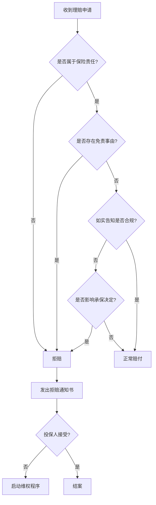
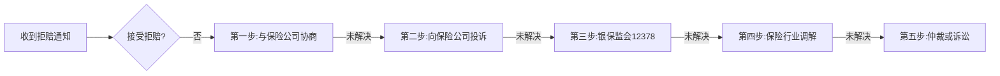

## 七、理赔流程详解

理赔是保险契约的最终兑现环节，也是检验一份保单是否"买对了"的唯一标准。中国保险行业2023年理赔年报显示，主要寿险公司平均理赔获赔率达98.5%以上，但仍有大量投保人因流程不熟、材料不全、时机错过等原因遭遇拒赔或延迟赔付。本章从理赔的底层逻辑出发，逐险种拆解完整流程，提供实操模板和维权路径，让你在最需要保障的时刻不走弯路。

### 7.1 理赔的底层逻辑

#### 7.1.1 理赔的本质：合同履行

保险理赔的本质是保险公司履行保险合同约定的给付义务。《保险法》第二十三条规定："保险人收到被保险人或者受益人的赔偿或者给付保险金的请求后，应当及时作出核定；情形复杂的，应当在三十日内作出核定。"这意味着：

- 保险公司有法定义务在30日内做出核定结论
- 核定通过后，应在10日内支付保险金
- 不属于保险责任的，应自作出核定之日起3日内发出拒赔通知书并说明理由

理解这个法律框架，是后续所有维权行为的基础。

#### 7.1.2 理赔审核的三条主线

保险公司的理赔审核围绕三条主线展开：

1. **保险责任确认**：出险事故是否属于保单约定的保障范围
2. **免责条款排查**：是否存在免责事由（如等待期内出险、故意行为等）
3. **如实告知复核**：投保时是否如实告知了健康状况和重要信息



#### 7.1.3 理赔时效的法律规定

| 时效类型 | 法律依据 | 具体要求 |
|----------|----------|----------|
| 报案时效 | 《保险法》第二十一条 | 及时通知保险人。合同约定的报案期限一般为出险后10日，但延迟报案不等于自动拒赔 |
| 核定时效 | 《保险法》第二十三条 | 收到请求后30日内做出核定，合同另有约定的从其约定 |
| 给付时效 | 《保险法》第二十三条 | 核定通过后10日内支付保险金 |
| 诉讼时效 | 《保险法》第二十六条 | 人寿保险5年，其他保险2年，自知道或应当知道保险事故发生之日起算 |

> **关键认知**：很多人以为超过报案时效就不能理赔了。实际上，法律并未规定超过报案时效就丧失理赔权利，只是延迟报案可能增加举证难度。即使超过了合同约定的报案期限，只要能证明事故真实发生且属于保险责任，保险公司仍应赔付。

### 7.2 五步标准理赔流程

#### 第一步：出险后及时报案

报案是理赔的起点，也是最容易被忽视的环节。

**各险种报案时效要求：**

| 险种 | 建报案时限 | 最晚时限 | 说明 |
|------|-----------|----------|------|
| 重疾险 | 确诊当日 | 10天内 | 病理报告出具后立即报案 |
| 医疗险 | 住院24小时内 | 48小时内 | 住院前报案可避免后续纠纷 |
| 意外险 | 出险后立即 | 24小时内 | 涉及第三方的需同时报警 |
| 寿险（身故） | 知悉当日 | 10天内 | 需先取得死亡证明 |
| 车险 | 事故现场 | 48小时内 | 重大事故需先报交警 |

**报案方式及优先级：**

1. **保险公司官方客服热线**（首选）：通话有录音记录，是最有力的报案证据。保单上均有标注，全国统一号码。
2. **保险公司APP/微信公众号在线报案**：方便快捷，可同时上传现场照片，适合小额医疗险报案。
3. **保险经纪人/代理人协助报案**：适合重疾险、寿险等复杂理赔，经纪人可帮助判断报案口径。
4. **拨打12378银保监投诉热线**：仅在保险公司客服无法联系时使用。

**报案时需要提供的核心信息：**

```text
报案信息清单：
□ 保单号（不确定可提供投保人姓名+身份证号查询）
□ 出险人姓名、身份证号
□ 出险时间（精确到日，越具体越好）
□ 出险地点
□ 出险经过简述
□ 就医医院/处理机构
□ 联系方式（确保后续可联系到）
```

> **实操建议**：报案后务必记录报案号（理赔案号）。这是后续查询理赔进度、补充材料、投诉维权的关键凭证。建议将报案号保存在手机备忘录中。

#### 第二步：了解理赔材料清单

材料准备是理赔成败的核心环节。以下按险种详细列出所需材料：

**重疾险理赔材料：**

| 材料类型 | 具体文件 | 说明 |
|----------|----------|------|
| 身份证明 | 被保险人身份证正反面复印件 | 需在有效期内 |
| 诊断证明 | 病理报告/诊断证明书 | 需由二级及以上医院出具，加盖医院公章 |
| 病历资料 | 住院病历、入院记录、出院小结 | 出院后到病案室复印，盖章 |
| 检查报告 | 影像学报告（CT/MRI/PET-CT）、血液检查报告 | 作为辅助证据 |
| 银行账户 | 被保险人名下银行卡复印件 | 需为借记卡，注明开户行 |
| 理赔申请表 | 保险公司提供的标准表格 | 可从官网下载或拨打客服索要 |

**医疗险理赔材料：**

| 材料类型 | 具体文件 | 说明 |
|----------|----------|------|
| 医疗费用发票 | 住院发票原件 | **最关键材料**，原件丢失极难补办 |
| 费用清单 | 住院费用汇总清单 | 医院财务处或自助机打印 |
| 社保报销单 | 社保结算单/分割单 | 已经社保报销的，需提供分割单 |
| 病历资料 | 出院小结、诊断证明 | 盖章件 |
| 用药明细 | 用药清单（如有自费药） | 用于判断是否在保障范围内 |
| 身份及账户 | 身份证+银行卡 | 同重疾险 |

> **特别注意**：医疗险是报销型，发票原件只有一份。如果你有两份医疗险（如公司团险+个人百万医疗险），需要先用发票原件在第一家报销，取得分割单后再向第二家申请。或者使用电子发票分别申请。切记不要把原件同时提交给两家公司。

**意外险理赔材料：**

| 材料类型 | 具体文件 | 说明 |
|----------|----------|------|
| 事故证明 | 交通事故认定书/派出所证明/单位证明 | 证明事故性质为"意外" |
| 医疗材料 | 同医疗险 | 如果涉及医疗费用报销 |
| 伤残鉴定 | 司法鉴定机构出具的伤残鉴定报告 | 仅涉及伤残理赔时需要 |
| 死亡证明 | 死亡证明、户籍注销证明 | 仅涉及身故理赔时需要 |
| 身份及账户 | 身份证+银行卡 | 同上 |

**寿险（身故）理赔材料：**

| 材料类型 | 具体文件 | 说明 |
|----------|----------|------|
| 死亡证明 | 医学死亡证明/法院宣告死亡判决书 | 非正常死亡需公安部门证明 |
| 户籍注销 | 户籍所在地派出所出具 | 注销后的户籍页复印件 |
| 受益人身份 | 受益人身份证、与被保险人关系证明 | 户口本/结婚证/出生证明等 |
| 继承权证明 | 如无指定受益人，需所有法定继承人的继承权公证书 | 此时保险金作为遗产分配 |
| 银行账户 | 受益人名下银行卡 | 身故保险金直接打入受益人账户 |

#### 第三步：选择提交渠道

| 提交方式 | 适用场景 | 优缺点 |
|----------|----------|--------|
| 线上APP/公众号 | 小额医疗险（5000元以下） | ✅ 便捷快速，可追踪进度；❌ 材料需拍照上传，可能因清晰度被退回 |
| 线下柜台 | 大额理赔、身故理赔 | ✅ 当面审核，一次性补齐材料；❌ 需亲自到场，耗时 |
| 邮寄提交 | 异地理赔 | ✅ 不受地域限制；❌ 材料丢失风险，建议用EMS并保留快递单号 |
| 经纪人代办 | 所有类型 | ✅ 专业省心，处理纠纷更有经验；❌ 依赖经纪人专业度和责任心 |

> **推荐策略**：小额（5000元以下）走线上快赔；大额走线下柜台，当面确认材料齐全；身故理赔建议经纪人陪同办理，因为涉及受益人认定和遗产分配等复杂问题。

#### 第四步：跟踪审核进度

理赔审核过程中，保险公司可能要求补充材料或进行调查。

**审核进度查询方式：**
- 保险公司APP→我的理赔→查看进度
- 拨打客服热线，提供报案号查询
- 联系保险经纪人代为跟进

**审核时间参考：**

| 理赔类型 | 审核周期 | 说明 |
|----------|----------|------|
| 小额快赔（5000元以下） | 1-3个工作日 | 部分公司已实现秒赔（上传材料后几小时内到账） |
| 一般理赔 | 5-10个工作日 | 材料齐全且无疑点的标准理赔 |
| 复杂理赔 | 15-30个工作日 | 涉及调查、核实、多部门会审 |
| 疑难理赔 | 30-60个工作日 | 需要外部调查（如走访医院、调取监控等） |

> **注意**：如果超过30天仍无结论，保险公司必须先做出"是否属于保险责任"的核定。若核定属于保险责任，应在核定后10日内支付。若保险公司既不核定也不拒赔，你有权向银保监会投诉。

**调查配合要点：**

保险公司进行理赔调查时，可能会：
- 调取被保险人在所有医院的就诊记录（需签署授权书）
- 调取社保使用记录
- 走访被保险人的工作单位和居住地
- 委托第三方调查公司

配合调查时的注意事项：
1. **如实回答**，不要隐瞒或编造信息
2. **不要签署空白授权书**，授权范围应限定在与本次理赔相关的医疗机构
3. **保留一份授权书副本**
4. **对调查员的提问做好记录**，防止被断章取义

#### 第五步：理赔款到账与确认

审核通过后，理赔款通常1-3个工作日到账。收到理赔款后，应核对以下信息：

- 金额是否与保单约定一致
- 扣除项是否合理（如有无息贷款、自动垫交保费等）
- 是否存在"通融赔付"（低于应赔金额的协商赔付）

如果金额不符预期，不要急于签字确认。可以：
1. 要求保险公司出具理赔计算明细
2. 核对保单条款中的赔付标准
3. 如有异议，在收到理赔决定书之日起提出书面异议

### 7.3 各险种理赔实战指南

#### 7.3.1 重疾险理赔：触发条件与实操要点

重疾险的理赔不是"确诊即赔"那么简单。根据中国保险行业协会和中国医师协会联合制定的《重大疾病保险的疾病定义及使用规范（2020年修订版）》，28种法定重疾的理赔触发条件分为三类：

| 触发条件 | 适用疾病举例 | 说明 |
|----------|-------------|------|
| 确诊即赔 | 恶性肿瘤（重度）、严重Ⅲ度烧伤 | 有明确的病理学诊断即可 |
| 达到某种状态 | 脑中风后遗症、严重阿尔茨海默病 | 需确诊后经过一定时间（如180天），且遗留约定的功能障碍 |
| 实施某种手术 | 重大器官移植术、冠状动脉搭桥术 | 需实际实施了约定的手术 |

**重疾险理赔的三个关键时间点：**

1. **确诊时间**：必须在等待期后。等待期内发现的异常，即使等待期后确诊，也可能被拒赔（取决于条款约定）。
2. **病理报告出具时间**：恶性肿瘤以病理报告出具日期为准。建议在报案前先拿到正式病理报告。
3. **理赔申请提交时间**：确诊后尽快提交，不要拖延。虽然法律保护5年诉讼时效，但时间越久，举证难度越大。

**甲状腺癌理赔注意事项（高频争议点）：**

2021年重疾险新定义将TNM分期为I期的甲状腺癌从重疾降级为轻症。如果你的保单是2021年2月1日前投保的旧版，甲状腺癌仍按重疾赔付；之后投保的新版，I期甲状腺癌只能按轻症赔付（通常为保额的20%-30%）。

投保时间 → 定义版本 → 赔付标准：
- 2021.2.1前投保 → 旧定义 → 甲状腺癌I期按重疾赔付100%保额
- 2021.2.1后投保 → 新定义 → 甲状腺癌I期按轻症赔付20%-30%保额

#### 7.3.2 医疗险理赔：社保+商保的最佳配合

医疗险理赔的核心原则是"补偿原则"——总赔付不超过实际花费。社保和商保的报销顺序和比例直接影响你自费多少。

**推荐报销顺序：社保 → 公司团险 → 百万医疗险**

具体操作流程：

```text
第1步：住院时出示社保卡，出院直接结算社保部分
第2步：出院后打印社保结算单（分割单），上面写明：
       - 总医疗费用
       - 社保报销金额
       - 自费金额
第3步：如有公司团险，用社保结算单+发票复印件申请团险报销
       团险报销后，取得团险的分割单
第4步：用社保+团险的分割单，向百万医疗险申请报销
       报销金额 = 总费用 - 社保报销 - 团险报销 - 免赔额
```

**发票原件的处理技巧：**

发票原件只有一份，但多家报销都需要原件，怎么办？

1. **电子发票时代**：越来越多医院支持电子发票，可自行打印多份，每份都具有同等效力。
2. **分割单制度**：第一家报销后出具分割单，第二家接受分割单+发票复印件。
3. **医院补打**：部分医院可以补打费用清单，但发票原件一般不补。出院时务必确认拿到所有票据。
4. **社保先行**：社保报销时原件会被收取，但社保会出具分割单，用于后续商保报销。

> **真实案例**：某用户住院花费8万元，社保报销4.5万元，公司团险报销1.5万元，个人百万医疗险（1万元免赔额）报销：8万 - 4.5万 - 1.5万 - 1万 = 1万元。实际自费为0。如果漏掉了公司团险报销，百万医疗险的报销金额为：8万 - 4.5万 - 1万 = 2.5万元，但实际自费仍是1.5万元（团险那部分没报出来）。所以三个渠道都要报。

#### 7.3.3 意外险理赔：意外认定是关键

意外险理赔最容易产生纠纷的是"意外"的认定。保险法定义的"意外"需同时满足四个条件：

| 条件 | 含义 | 常见争议案例 |
|------|------|-------------|
| 外来的 | 由外部因素导致，非身体内部原因 | 中暑是否算意外？——多数条款明确除外 |
| 突然的 | 不是长期积累的结果 | 猝死是否算意外？——通常不算，属于疾病身故 |
| 非本意的 | 不是被保险人故意造成的 | 自伤自杀不赔 |
| 非疾病的 | 不是由疾病引起的 | 高原反应是否算意外？——存在争议 |

**意外险理赔的证据链构建：**

意外发生后，第一时间做的事情决定了理赔成败：

1. **现场拍照/录像**：记录事故现场、伤情状况、周围环境
2. **报警/叫救护车**：110报警记录和120急救记录是意外事故的有力证据
3. **通知单位/社区**：取得工作证明或社区证明
4. **就医时说清楚**：告诉医生"意外受伤"，病历上要体现"因XX意外导致XX伤害"的表述。如果医生写成"因XX疾病导致"，意外险可能拒赔

> **关键提醒**：就医时病历的措辞直接影响理赔结果。一定要主动告诉医生受伤原因，确保病历记录与"意外"一致。曾有案例因医生写成"头晕摔倒"（先头晕后摔倒→疾病导致），被意外险拒赔；而"走路绊倒摔伤"（纯意外）则顺利获赔。

**猝死保障：**

标准意外险不保猝死（属于疾病），但很多意外险产品附加了"猝死保障"。投保时需注意：
- 是否包含猝死责任
- 猝死保额是否独立于意外身故保额
- 猝死的时间认定标准（通常是6小时或24小时内）

#### 7.3.4 寿险理赔：身故与受益人

寿险理赔看似简单（身故即赔），但涉及受益人认定时往往变得复杂。

**受益人的法律优先顺序：**

1. **指定受益人**：投保时明确指定了受益人及其份额。理赔金直接打入指定受益人账户，不属于被保险人遗产，无需偿还被保险人生前债务。
2. **法定受益人**：未指定受益人或指定不明的，保险金作为被保险人遗产，按《继承法》法定继承顺序分配。
3. **受益人先于被保险人死亡**：如未重新指定，该受益人应得份额按法定继承处理。

> **强烈建议**：务必在保单上指定受益人，且不要只写"法定"。指定受益人的好处：(1)避免家庭纠纷；(2)保险金不被用于偿还债务；(3)理赔速度更快，无需办理继承权公证。指定方式示例：受益人一：配偶XXX，比例60%；受益人二：子女XXX，比例40%。

**宣告死亡的理赔：**

被保险人失踪满法定期限（普通2年，意外事故导致4年，意外事故经证明不可能生还的可不受时间限制），经法院宣告死亡后，寿险可以理赔。但如果被保险人日后重新出现，保险公司有权追回已支付的保险金。

#### 7.3.5 豁免保费理赔（轻症/中症豁免）

很多人不知道"豁免保费"也需要主动申请理赔。当被保险人确诊轻症或中症后，后续保费可以免交，但保障继续有效。

**豁免理赔的操作：**

1. 确诊轻症/中症后，先按轻症/中症申请理赔，获得相应比例的保险金
2. **同时申请保费豁免**，提交豁免申请表
3. 保险公司审核通过后，出具《保费豁免确认书》
4. 后续各期保费自动免除，无需再缴纳

如果没有主动申请豁免，保险公司不会自动免除。已缴纳的保费通常不退还，所以确诊后应第一时间申请。

### 7.4 理赔被拒的原因分析与应对策略

#### 7.4.1 十大常见拒赔原因

| 排名 | 拒赔原因 | 占比（估算） | 可避免性 | 应对策略 |
|------|----------|-------------|----------|----------|
| 1 | 未如实告知既往病史 | ~30% | 投保时可避免 | 投保前如实告知，不确定的走智能核保或人工核保 |
| 2 | 不在保障范围内 | ~20% | 投保时可避免 | 仔细阅读保险责任条款，不要只看宣传页 |
| 3 | 等待期内出险 | ~15% | 不可避免 | 等待期是行业惯例，只能提前投保 |
| 4 | 免责条款触发 | ~10% | 部分可避免 | 了解免责条款，酒驾/吸毒/犯罪等行为可避免 |
| 5 | 理赔材料不全/不规范 | ~10% | 完全可避免 | 按照材料清单逐一准备，不确定时先咨询客服 |
| 6 | 不符合赔付标准 | ~5% | 部分可避免 | 了解疾病赔付条件（如重疾的"状态"要求） |
| 7 | 保单已失效（未交费） | ~3% | 完全可避免 | 设置自动扣费，定期检查保单状态 |
| 8 | 就医医院不符要求 | ~3% | 完全可避免 | 确认条款对医院的要求（通常为二级及以上公立医院） |
| 9 | 职业变更未告知 | ~2% | 可避免 | 高风险职业变更后及时通知保险公司 |
| 10 | 保险事故发生在境外 | ~2% | 部分可避免 | 出境前确认保单是否覆盖境外 |

#### 7.4.2 "未如实告知"拒赔的深度分析

未如实告知是最常见的拒赔原因，也是争议最大的领域。

**《保险法》第十六条的核心规定：**

- 投保人故意或因重大过失未履行如实告知义务，足以影响保险人决定是否同意承保或者提高保险费率的，保险人有权解除合同。
- 但合同成立超过两年的，保险人不得解除合同；发生保险事故的，保险人应当承担赔偿或者给付保险金的责任（即"两年不可抗辩条款"）。

**"两年不可抗辩"的正确理解：**

很多人以为只要过了两年就能赔，这是误解。两年不可抗辩的适用条件：
1. 合同成立满两年
2. 投保时确实存在未如实告知的情况（而非故意欺诈）
3. 未告知的事项确实影响了承保决定

如果投保人是故意隐瞒已确诊的重大疾病（带病投保），即使过了两年，法院仍可能认定为保险欺诈，判决保险公司不赔。

**实操建议：**
- 投保时一定要如实告知健康状况
- 不确定是否需要告知的事项，走智能核保或人工核保
- 保留投保时的健康告知截图或录音
- 如果被拒赔理由是"未如实告知"，首先核实保险公司是否在30天内行使了合同解除权（超过30天未行使的，丧失解除权）

#### 7.4.3 拒赔后的维权路径



**各维权渠道详解：**

**第一步：与保险公司理赔部门协商**
- 联系理赔部门负责人，要求出具书面拒赔理由
- 针对拒赔理由逐条反驳，提交补充证据
- 参考保单条款中的具体表述，指出保险公司的理解偏差
- 保留所有沟通记录（邮件、录音、短信）

**第二步：向保险公司投诉部门投诉**
- 拨打保险公司投诉热线（通常与客服热线不同，可在官网找到）
- 明确要求投诉部门在规定时间内（通常10个工作日）回复
- 如投诉部门也无法解决，要求出具投诉处理结果确认书

**第三步：向银保监会投诉（12378热线）**
- 拨打12378，按语音提示选择投诉
- 准备好保单号、报案号、拒赔理由等关键信息
- 12378投诉后，保险公司通常会在5个工作日内主动联系你
- 也可以通过银保监会官网在线投诉

> **12378的威力**：银保监会投诉是保险理赔纠纷中最有效的非诉讼维权手段。保险公司对银保监会投诉非常重视，因为投诉率直接影响其监管评级。很多在客服层面无法解决的理赔纠纷，通过12378投诉后都能得到重新审核。

**第四步：保险行业调解**
- 各地保险行业协会设有保险纠纷调解委员会
- 调解不收费，通常15-30天出结果
- 调解结果不具有强制执行力，但保险公司一般会尊重调解意见

**第五步：仲裁或诉讼**
- 如保单中有仲裁条款，先申请仲裁
- 没有仲裁条款的，可以直接向法院起诉
- 保险合同纠纷的管辖法院：被保险人住所地或保险公司所在地法院
- 建议委托专业保险律师，费用通常为赔偿金额的10%-20%

**诉讼时效提醒：**
- 人寿保险：5年
- 其他保险：2年
- 起算点：知道或应当知道保险事故发生之日

### 7.5 理赔中的常见误区与纠正

#### 误区一："保险公司会主动找我理赔"

**现实**：保险公司不会主动理赔。你必须主动报案、提交材料、申请理赔。很多人买了保险出险后不知道要报案，或者以为代理人会帮自己处理一切，结果错过了最佳理赔时机。

#### 误区二："报案晚了就不能赔了"

**现实**：报案时效是合同约定，但《保险法》并未规定超过报案时效就丧失理赔权利。延迟报案可能增加举证难度，但只要能证明事故真实且属于保险责任，保险公司仍应赔付。如果保险公司以"报案不及时"为由拒赔，可以引用《保险法》第二十一条进行维权。

#### 误区三："重疾险确诊就能赔"

**现实**：28种法定重疾中，只有少部分是"确诊即赔"，很多需要"达到某种状态"或"实施某种手术"才能赔付。投保前应仔细阅读每种重疾的赔付条件。

#### 误区四："医疗险发票丢了就不能报销了"

**现实**：发票丢失确实很麻烦，但并非完全无法解决。可以：
1. 到医院财务处申请发票遗失证明
2. 用费用清单和社保分割单作为替代
3. 电子发票可重新下载打印
4. 部分保险公司接受医院盖章的费用证明

#### 误区五："被拒赔了只能认命"

**现实**：拒赔不是终局。保险理赔纠纷中，消费者通过维权成功翻案的比例相当高。据统计，通过12378投诉后重新审核的案件中，约有30%-40%的案件被改判为正常赔付或部分赔付。

### 7.6 理赔实操技巧大全

#### 7.6.1 报案阶段技巧

1. **报案口径很重要**：描述出险经过时，用词要准确。例如意外受伤，要说"因XX意外导致受伤"，不要说"身体不适导致XX"。
2. **多份保单分别报案**：如果你在多家公司有保出险后分别向各家公司报案，不要只报一家。
3. **报案后不要轻易撤案**：有些保险公司客服会引导你"材料不齐先撤案，准备好再报"，不建议这样做。报案后材料不齐可以补充，但撤案后再报可能被视为"延迟报案"。

#### 7.6.2 就医阶段技巧

1. **选择符合要求的医院**：大部分保险要求二级及以上公立医院。私立医院、诊所、社区卫生服务中心通常不在理赔范围内（高端医疗险除外）。
2. **病历措辞要准确**：就医时主动告诉医生受伤/发病原因，确保病历记录与保险理赔条件一致。
3. **保留所有单据**：门诊病历、检查报告、处方单、发票、费用清单，一个都不要丢。
4. **住院期间注意**：住院病历中的入院记录、医嘱单、护理记录、体温单等都是理赔材料，出院后到病案室全部复印。

#### 7.6.3 材料准备技巧

1. **材料准备时间轴**：

| 时间节点 | 应完成事项 |
|----------|-----------|
| 出险当日 | 报案，拍照保留现场证据 |
| 就医期间 | 收集门诊病历、检查报告、发票 |
| 出院当日 | 确认拿到发票原件、费用清单、出院小结 |
| 出院后1周 | 到病案室复印完整住院病历 |
| 出院后2周 | 准备身份证、银行卡等基础材料 |
| 出院后3周内 | 提交理赔申请 |

2. **材料检查清单**（提交前逐一核对）：

```text
提交前自检清单：
□ 理赔申请表是否填写完整、签名
□ 身份证是否在有效期内
□ 银行卡是否为被保险人本人名下
□ 发票是否为原件（医疗险）
□ 诊断证明是否加盖医院公章
□ 病历是否盖章
□ 所有复印件是否清晰可辨
□ 社保报销分割单是否已取得（如有社保）
□ 材料之间的时间线是否一致
```

3. **电子材料备份**：所有纸质材料提交前，先拍照或扫描保存一份电子版。万一材料丢失或保险公司要求补充，可以快速提供。

#### 7.6.4 沟通技巧

1. **通话录音**：与保险公司客服沟通时，养成录音习惯（合法的，属于保护自身权益）。
2. **书面优先**：重要的理赔沟通尽量用邮件或书面方式，留下书面记录。
3. **要求书面拒赔理由**：如果保险公司口头告知拒赔，务必要求出具书面拒赔通知书，上面需写明拒赔依据和条款。
4. **不要接受口头承诺**：客服说"可以赔"但没有书面确认的，不要当真。

### 7.7 数字化理赔新趋势

#### 7.7.1 智能理赔

越来越多的保险公司推出了智能化理赔服务：

- **秒赔**：材料齐全且金额在规定范围内的，系统自动审核，几小时内到账
- **直赔**：与医院合作，出院时直接结算，无需先行垫付
- **闪赔**：拍照上传发票，OCR自动识别金额，简化材料要求

#### 7.7.2 电子发票与区块链存证

- 电子发票在理赔中的法律效力等同于纸质发票
- 部分保险公司已接入区块链存证系统，发票信息不可篡改
- 未来趋势：医院诊疗数据与保险公司系统打通，实现"无感理赔"

#### 7.7.3 在线理赔平台

- 保险公司APP/微信公众号：主流理赔渠道
- 第三方保险平台（如蚂蚁保、微保）：可一键申请理赔，平台协助跟进
- 银保监会"中国保险万事通"公众号：可查询个人名下所有保单

### 7.8 理赔案例复盘

#### 案例一：重疾险理赔——甲状腺癌的赔付争议

**情况**：张先生2020年投保重疾险50万，2023年确诊甲状腺乳头状癌TNM分期I期。

**争议点**：保险公司按轻症赔付（20%保额=10万），张先生认为应按重疾赔付（100%保额=50万）。

**分析**：张先生投保时间在2021年2月1日前，适用旧版疾病定义，甲状腺癌不分期均按重疾赔付。

**结果**：张先生引用保单条款中的旧版疾病定义，通过12378投诉后，保险公司改按重疾赔付50万。

**启示**：投保时间决定了适用哪版疾病定义。旧版保单的甲状腺癌保障明显优于新版。

#### 案例二：医疗险理赔——发票原件之争

**情况**：李女士住院花费12万，社保报销6万，剩余6万向百万医疗险申请报销（免赔额1万，应报销5万）。保险公司要求提供发票原件，但原件已被社保收取。

**解决**：李女士到社保中心取得费用分割单（载明总费用、社保报销金额、自费金额），连同发票复印件和医院盖章的费用清单一并提交。保险公司接受分割单，正常赔付5万。

**启示**：社保报销后的分割单是商保报销的关键凭证，出院后务必及时取得。

#### 案例三：意外险理赔——猝死保障的争议

**情况**：王先生投保了含猝死保障的意外险（意外身故50万+猝死30万），某日加班时突发心源性猝死。保险公司以"猝死属于疾病，不属于意外"为由拒赔意外身故，仅同意按猝死责任赔付30万。

**分析**：保险公司的做法符合条款约定。猝死在医学上属于疾病导致的死亡，不属于意外。但保单附加了猝死保障责任，应按猝死条款赔付。

**结果**：家属接受猝死赔付30万。

**启示**：投保意外险时，如果担心猝死风险，务必确认保单是否包含猝死保障，以及猝死保额是否充足。

### 7.9 理赔自查清单

以下清单帮助你在投保时就为未来理赔做好准备：

```text
投保阶段：
□ 如实告知所有健康状况，不确定的走核保
□ 指定受益人（不要只写"法定"）
□ 确认保单对医院的要求（二级及以上公立医院）
□ 了解等待期及各险种的赔付条件
□ 保留投保时的健康告知记录

保单持有阶段：
□ 设置保费自动扣费，避免保单失效
□ 每年检视保单，确认保障是否充足
□ 职业或健康状况变化时及时通知保险公司
□ 将保单信息告知家人（至少告知保险公司名称和保单号）

出险阶段：
□ 第一时间报案，记录报案号
□ 就医时选择符合要求的医院
□ 确保病历措辞与保险理赔条件一致
□ 保留所有医疗单据原件
□ 社保报销后及时取得分割单

理赔阶段：
□ 按材料清单逐一准备，提交前自查
□ 所有材料提交前拍照/扫描备份
□ 跟踪理赔进度，超过30天主动催办
□ 对理赔结果有异议时，不要轻易接受拒赔
□ 维权路径：协商→投诉→12378→调解→诉讼
```

***

