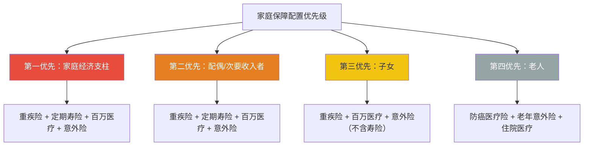
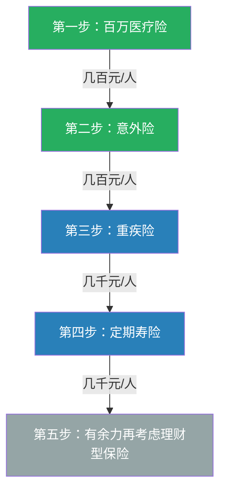
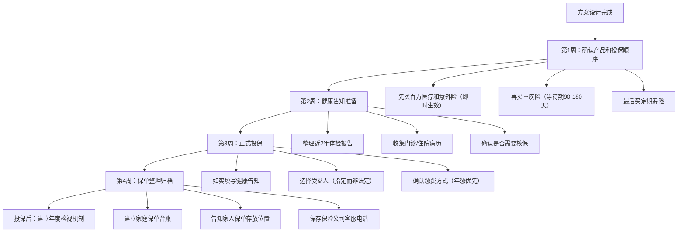

## 八、家庭保障方案设计完整模板

家庭保障方案不是简单地给每个人买几份保险，而是一个需要综合考虑家庭结构、收入分布、负债状况、健康条件和人生阶段的系统工程。本章提供从方法论到实操模板的完整指南，覆盖七种典型家庭形态，帮助你设计出真正适合自己家庭的保障方案。

### 8.1 家庭保障方案设计方法论

#### 8.1.1 设计的底层逻辑：需求倒推法

家庭保障方案的核心逻辑是**需求倒推**——先确定家庭面临的风险敞口有多大，再倒推需要多少保额和保费预算。

```text
家庭风险敞口 = 家庭负债总额 + 家庭年支出 × 需保障年限 + 子女教育金缺口 + 父母赡养缺口
```

举例：一个家庭房贷200万、年支出25万、需要保障孩子到大学毕业还有15年、父母赡养预计需要50万，那么总风险敞口为：

```text
200 + 25×15 + 50 = 625万
```

这就是这个家庭至少需要的寿险+重疾险的总保额基准线。

#### 8.1.2 保费预算的合理区间

保费预算不是拍脑袋定的，行业通行的标准有两条：

| 预算标准 | 计算方式 | 适用场景 |
|----------|----------|----------|
| **双十法则** | 年保费 = 年收入 × 10%，保额 = 年收入 × 10 | 收入稳定的家庭 |
| **生命价值法** | 保额 = (退休年龄 - 当前年龄) × 年收入 | 高收入人群 |
| **遗属需求法** | 保额 = 遗属未来生活所需总额 - 已有保障 | 精确计算 |

实际操作中，建议将家庭年收入的 **5%~10%** 用于保障型保险（重疾+医疗+寿险+意外），**不超过15%** 包含储蓄型保险（年金、增额终身寿等）。超过这个比例会挤压家庭现金流，低于这个比例则保障可能不足。

#### 8.1.3 保障配置的优先级排序

家庭保障配置必须遵循"先大人后小孩、先经济支柱后其他成员"的原则：



这个优先级背后的逻辑是：保险的本质是保障家庭经济安全。如果经济支柱倒下而没有保障，整个家庭会陷入财务危机，孩子的保险保费都可能交不起。所以任何时候都是**先保大人，后保孩子**。

#### 8.1.4 方案设计的五步流程

一个完整的家庭保障方案设计需要经过五个步骤：


**第一步：家庭信息梳理**——收集所有家庭成员的年龄、职业、收入、健康状况、社保情况、已有商业保险。

**第二步：风险敞口量化**——计算家庭负债、年支出、子女教育金需求、父母赡养需求，得出总风险敞口。

**第三步：产品选型匹配**——根据每个家庭成员的情况，选择最适合的险种和产品。比如有甲状腺结节的人，需要选择对甲状腺结节承保条件宽松的产品。

**第四步：方案组合优化**——在预算约束下，通过调整保额、保障期限、缴费方式来优化方案。通常是"缩短保障期限换取更高保额"或"降低保额换取更长保障期限"之间的权衡。

**第五步：动态调整机制**——建立定期检视机制，随着家庭情况变化（收入增长、房贷减少、孩子出生等）调整保障方案。

### 8.2 典型家庭保障方案模板

以下提供七种典型家庭形态的保障方案模板。每个模板都包含家庭情况描述、风险分析、具体方案和方案要点。实际应用时需要根据自身情况做调整。

#### 8.2.1 模板一：三口之家（基础型）

**家庭画像**：

| 成员 | 年龄 | 职业 | 年收入 | 社保 | 健康状况 |
|------|------|------|--------|------|----------|
| 爸爸 | 32岁 | 程序员 | 30万 | 有 | 标准体 |
| 妈妈 | 30岁 | 行政 | 12万 | 有 | 标准体 |
| 孩子 | 3岁 | - | - | 少儿医保 | 标准体 |

**家庭财务概况**：房贷余额150万，年支出约20万，储蓄40万，保险预算2.5万/年。

**保障方案**：

| 家庭成员 | 重疾险 | 定期寿险 | 医疗险 | 意外险 | 年保费 |
|----------|--------|----------|--------|--------|--------|
| 爸爸 | 50万保至70岁 | 200万保至60岁 | 百万医疗200万 | 100万 | 约10000元 |
| 妈妈 | 30万保至70岁 | 100万保至60岁 | 百万医疗200万 | 50万 | 约5500元 |
| 孩子 | 30万保30年 | 不需要 | 百万医疗200万 | 20万 | 约2500元 |
| **合计** | - | - | - | - | **约18000元** |

**方案要点**：

- **爸爸保额最高**：爸爸是主要经济支柱（收入占家庭71%），重疾险50万+定期寿险200万，确保万一发生极端情况，家庭至少有200万覆盖房贷+3~5年生活费。
- **孩子不需要寿险**：寿险的本质是保障家庭经济责任。孩子没有收入来源和负债，不需要寿险。有些代理人推荐给孩子买终身寿险作为"储蓄"，实际收益率远不如银行定期存款，不推荐。
- **保障期限的选择**：保至70岁比终身便宜30%~40%，省下的钱可以做养老金规划。如果预算充足，可以选择终身。
- **百万医疗险的配置要点**：选择保证续保20年的产品，关注外购药、质子重离子治疗是否覆盖，免赔额1万是行业标准。
- **剩余预算7000元**可用于孩子的教育金储备或家庭应急基金。

#### 8.2.2 模板二：五口之家（三代同堂）

**家庭画像**：

| 成员 | 年龄 | 职业 | 年收入 | 社保 | 健康状况 |
|------|------|------|--------|------|----------|
| 爷爷 | 67岁 | 退休 | 退休金5万/年 | 有 | 高血压（控制良好） |
| 奶奶 | 65岁 | 退休 | 退休金4万/年 | 有 | 标准体 |
| 爸爸 | 40岁 | IT管理 | 45万 | 有 | 标准体 |
| 妈妈 | 38岁 | 教师 | 18万 | 有 | 标准体 |
| 孩子 | 10岁 | - | - | 少儿医保 | 标准体 |

**家庭财务概况**：房贷余额120万，年支出约35万，储蓄/投资100万，保险预算5万/年。

**保障方案**：

| 家庭成员 | 重疾险 | 定期寿险 | 医疗险 | 意外险 | 年保费 |
|----------|--------|----------|--------|--------|--------|
| 爸爸 | 80万终身 | 200万至65岁 | 百万医疗200万 | 100万 | 约18000元 |
| 妈妈 | 50万终身 | 100万至60岁 | 百万医疗200万 | 50万 | 约10000元 |
| 孩子 | 50万保30年 | 不需要 | 百万医疗200万 | 30万 | 约3500元 |
| 爷爷 | 不建议重疾险 | 不需要 | 防癌医疗险200万 | 老年意外险50万 | 约2500元 |
| 奶奶 | 不建议重疾险 | 不需要 | 百万医疗险200万 | 老年意外险50万 | 约3000元 |
| **合计** | - | - | - | - | **约37000元** |

**方案要点**：

- **老人为什么不建议买重疾险**：65岁以上老人购买重疾险，会出现"保费倒挂"现象——总交保费超过保额。以65岁男性为例，购买10万保额的重疾险，20年总保费可能达到12~15万，相当于你用更多的钱买更少的保障，完全不划算。
- **老人医疗险的差异化选择**：爷爷有高血压，部分百万医疗险会拒保或除外承保，所以选择健康告知更宽松的防癌医疗险（只保癌症，但三高、糖尿病都能投保）。奶奶是标准体，可以直接投保百万医疗险。
- **老人意外险重点关注骨折保障**：老年人最大的意外风险是摔倒导致骨折。选择包含骨折/脱臼保障、住院津贴的老年意外险，保额50万足够覆盖住院和康复费用。
- **爸爸保额升级**：40岁上有老下有小，经济压力最大，重疾险80万终身确保万一患重疾有充足的资金覆盖治疗费+3年收入损失。
- **预算分配逻辑**：经济支柱占50%预算，配偶占25%，孩子占10%，老人占15%。这个比例确保"钱花在刀刃上"。

#### 8.2.3 模板三：双薪丁克家庭

**家庭画像**：

| 成员 | 年龄 | 职业 | 年收入 | 社保 | 健康状况 |
|------|------|------|--------|------|----------|
| 丈夫 | 33岁 | 金融 | 40万 | 有 | 标准体 |
| 妻子 | 30岁 | 设计 | 25万 | 有 | 标准体 |

**家庭财务概况**：房贷余额100万，年支出约20万，储蓄80万，保险预算2万/年。

**保障方案**：

| 家庭成员 | 重疾险 | 定期寿险 | 医疗险 | 意外险 | 年保费 |
|----------|--------|----------|--------|--------|--------|
| 丈夫 | 50万保至70岁 | 150万保至60岁 | 百万医疗200万 | 100万 | 约9000元 |
| 妻子 | 50万保至70岁 | 100万保至60岁 | 百万医疗200万 | 50万 | 约6500元 |
| **合计** | - | - | - | - | **约15500元** |

**方案要点**：

- **丁克家庭的寿险需求相对较低**：没有子女教育金负担，寿险主要是覆盖房贷和配偶过渡期生活费。定期寿险保额 = 房贷余额 + 配偶2~3年生活费。
- **更需要关注重疾险和养老规划**：没有子女意味着老年时期没有家庭成员可以照护，需要更充足的重疾保障和养老储备。
- **剩余预算4500元建议投入增额终身寿险或年金险**：作为养老金储备的起点。增额终身寿险的现金价值按3%~3.5%复利增长，长期来看比银行存款更有优势。
- **夫妻互保方案**：如果选择有投保人豁免功能的产品，可以做夫妻互保——丈夫给妻子投保、妻子给丈夫投保。万一一方确诊轻症/中症，两份保单都能豁免后续保费。

#### 8.2.4 模板四：单亲家庭

**家庭画像**：

| 成员 | 年龄 | 职业 | 年收入 | 社保 | 健康状况 |
|------|------|------|--------|------|----------|
| 妈妈 | 35岁 | 会计 | 18万 | 有 | 标准体 |
| 孩子 | 6岁 | - | - | 少儿医保 | 标准体 |

**家庭财务概况**：房贷余额80万，年支出约12万，储蓄20万，保险预算1.5万/年。

**保障方案**：

| 家庭成员 | 重疾险 | 定期寿险 | 医疗险 | 意外险 | 年保费 |
|----------|--------|----------|--------|--------|--------|
| 妈妈 | 50万保至60岁 | 100万保至孩子22岁 | 百万医疗200万 | 100万 | 约8500元 |
| 孩子 | 30万保30年 | 不需要 | 百万医疗200万 | 20万 | 约2500元 |
| **合计** | - | - | - | - | **约11000元** |

**方案要点**：

- **单亲家庭的最大风险是唯一经济支柱倒下**：妈妈既是唯一的收入来源，又是唯一的照护者。如果妈妈出问题，孩子的生活和教育都会受到严重影响。所以妈妈的保障必须做足。
- **定期寿险保到孩子22岁**：孩子大学毕业后能独立，寿险保至孩子22岁即可。100万保额 = 80万房贷 + 20万孩子教育和生活过渡金。
- **重疾险保额覆盖收入中断期**：50万重疾险保额 = 治疗费20~30万 + 2年收入损失36万。如果确诊重疾，这笔钱可以覆盖治疗和康复期的所有开支。
- **给孩子配置被保人豁免**：选择带有投保人豁免的产品，万一妈妈确诊轻症/重疾，孩子的保单保费全部豁免，保障继续有效。
- **单亲家庭特别需要建立应急基金**：建议应急基金至少覆盖6个月家庭支出（约6万），放在货币基金或银行活期中，随时可取用。保险预算中预留的4000元可以逐步补充应急基金。

#### 8.2.5 模板五：自由职业/无固定收入家庭

**家庭画像**：

| 成员 | 年龄 | 职业 | 年收入 | 社保 | 健康状况 |
|------|------|------|--------|------|----------|
| 丈夫 | 36岁 | 自媒体 | 20~50万（波动大） | 灵活就业社保 | 标准体 |
| 妻子 | 34岁 | 全职太太 | 0 | 居民医保 | 标准体 |
| 孩子 | 5岁 | - | - | 少儿医保 | 标准体 |

**家庭财务概况**：无房贷（已全款购房），年支出约18万，储蓄50万，保险预算2万/年。

**保障方案**：

| 家庭成员 | 重疾险 | 定期寿险 | 医疗险 | 意外险 | 年保费 |
|----------|--------|----------|--------|--------|--------|
| 丈夫 | 50万保至70岁 | 100万保至60岁 | 百万医疗200万 | 100万 | 约9500元 |
| 妻子 | 30万保至70岁 | 50万保至60岁 | 百万医疗200万 | 50万 | 约5500元 |
| 孩子 | 30万保30年 | 不需要 | 百万医疗200万 | 20万 | 约2500元 |
| **合计** | - | - | - | - | **约17500元** |

**方案要点**：

- **收入不稳定的家庭，保费预算要保守**：自由职业者收入波动大，保险预算按年收入下限的10%计算（20万×10%=2万），而不是按上限。宁可预算紧一些，也不要因为收入波动导致断缴。
- **缴费方式选择年缴而非月缴**：年缴可以利用收入好的年份一次性缴费，避免每月扣款失败导致保单失效。部分产品还提供年缴折扣。
- **百万医疗险是自由职业者的"救命险"**：自由职业者的社保报销比例通常低于职工医保，百万医疗险的1万免赔额以上的费用基本都能覆盖，这对收入不稳定的家庭尤为重要。
- **全职太太也需要保障**：全职太太虽然没有收入，但如果生病，丈夫需要请假照顾或请护工，这期间家庭收入会减少。30万重疾险可以覆盖这部分隐性损失。
- **定期寿险保额与收入挂钩**：丈夫100万定期寿险，覆盖家庭5年基本支出。没有房贷压力，保额可以适当降低。

#### 8.2.6 模板六：高收入双薪家庭

**家庭画像**：

| 成员 | 年龄 | 职业 | 年收入 | 社保 | 健康状况 |
|------|------|------|--------|------|----------|
| 丈夫 | 42岁 | 企业高管 | 100万 | 有 | 标准体 |
| 妻子 | 40岁 | 医生 | 50万 | 有 | 标准体 |
| 大孩 | 15岁 | - | - | 学生医保 | 标准体 |
| 小孩 | 8岁 | - | - | 少儿医保 | 标准体 |

**家庭财务概况**：房贷余额300万，年支出约60万，储蓄/投资500万，保险预算10万/年。

**保障方案**：

| 家庭成员 | 重疾险 | 定期寿险 | 医疗险 | 意外险 | 年保费 |
|----------|--------|----------|--------|--------|--------|
| 丈夫 | 100万终身 | 500万至65岁 | 高端医疗 | 200万 | 约45000元 |
| 妻子 | 80万终身 | 300万至60岁 | 高端医疗 | 100万 | 约28000元 |
| 大孩 | 50万保30年 | 不需要 | 百万医疗200万 | 50万 | 约4000元 |
| 小孩 | 50万保30年 | 不需要 | 百万医疗200万 | 30万 | 约3500元 |
| **合计** | - | - | - | - | **约80500元** |

**方案要点**：

- **高收入家庭的保额要匹配收入水平**：丈夫年收入100万，重疾险保额至少100万（覆盖1年收入损失），定期寿险500万覆盖房贷+家庭5年支出。保额不足的话，出险时赔付的钱对家庭帮助有限。
- **高端医疗险的选择**：年收入超过50万的家庭建议考虑高端医疗险。高端医疗险的优势包括：覆盖私立医院和特需门诊、直付服务（不用自己垫钱）、全球就医网络、无免赔额。年保费约8000~15000元/人。
- **大孩15岁重疾险选保30年**：孩子成年后会重新配置保险，现在只需要保障到45岁左右。保30年比终身便宜60%以上，省下的钱可以用于孩子的教育基金。
- **保险+信托组合**：高收入家庭可以考虑保险金信托——将大额寿险的受益人设为信托公司，确保理赔金按照设定的条件分期支付给家人，避免一次性获得大额赔付后的挥霍或被他人觊觎。
- **剩余预算约2万**：可以用于增额终身寿险或年金险，作为养老金和子女教育金的补充储备。

#### 8.2.7 模板七：老年夫妻（退休期）

**家庭画像**：

| 成员 | 年龄 | 职业 | 年收入 | 社保 | 健康状况 |
|------|------|------|--------|------|----------|
| 丈夫 | 62岁 | 退休 | 退休金8万/年 | 职工医保 | 高血压+糖尿病 |
| 妻子 | 60岁 | 退休 | 退休金5万/年 | 职工医保 | 标准体 |

**家庭财务概况**：无房贷，年支出约10万，储蓄120万，保险预算1.5万/年。

**保障方案**：

| 家庭成员 | 重疾险 | 定期寿险 | 医疗险 | 意外险 | 年保费 |
|----------|--------|----------|--------|--------|--------|
| 丈夫 | 不建议 | 不需要 | 防癌医疗险200万 | 老年意外险 | 约3500元 |
| 妻子 | 不建议 | 不需要 | 百万医疗险200万 | 老年意外险 | 约4000元 |
| **合计** | - | - | - | - | **约7500元** |

**方案要点**：

- **退休期的保险策略是"减法"**：过了60岁，重疾险保费倒挂、寿险意义不大（没有负债和经济责任），真正需要的是医疗险和意外险。
- **有慢病的老人选择防癌医疗险**：丈夫有高血压和糖尿病，大部分百万医疗险会拒保。防癌医疗险只保癌症，健康告知宽松，三高、糖尿病、心脑血管疾病都能投保。癌症是老年人最高发的重疾，占重疾理赔的60%以上，防癌医疗险能覆盖最高频的风险。
- **标准体老人优先百万医疗险**：妻子是标准体，可以直接投保百万医疗险，覆盖范围更广（不限于癌症）。
- **老年意外险重点看骨折保障**：老年人骨质疏松，摔倒后容易骨折。选择包含骨折/关节脱位保障、住院津贴、救护车费用的产品。意外身故保额不需要太高（50万足够），但意外医疗保额要高（至少5万）。
- **剩余预算约7500元**：建议存入应急医疗基金，或购买护理险（覆盖失能后的护理费用）。60岁是购买护理险的最后窗口期，过了65岁基本买不到了。

### 8.3 保障方案设计的核心原则

#### 8.3.1 先保障后理财

这是家庭保障方案设计的第一原则。很多家庭在保障不足的情况下，把大量预算投入年金险、增额终身寿险等理财型保险。实际上，保障型保险（重疾+医疗+寿险+意外）是家庭财务的"防火墙"，理财型保险是"增值工具"。防火墙没建好就去搞装修，一场大火会把所有投入烧光。

**正确的顺序**：



百万医疗险和意外险加起来每人每年几百元，是性价比最高的保障。先把这两个配齐，再考虑重疾险和寿险。

#### 8.3.2 保额优先于保障期限

预算有限时，"高保额+短保障期限"优于"低保额+长保障期限"。原因很简单：保险的核心功能是风险发生时的赔付。如果保额只有10万，即使保终身，在真正需要的时候也帮不上什么忙。相反，50万保额保到70岁，虽然不是终身，但在最需要保障的年龄段（30~60岁）提供了充足的资金支持。

**具体建议**：

- 重疾险最低保额：30万（覆盖基本治疗费）；建议保额：50万（覆盖治疗费+2年收入损失）
- 定期寿险保额：家庭负债总额 + 家庭年支出 × 3~5年
- 医疗险保额：百万医疗险100~200万足够，保额再高也不太可能用到
- 意外险保额：经济支柱100万，配偶50万，孩子20~30万

#### 8.3.3 关注产品细节而非品牌

很多人买保险时纠结于"买大公司的还是小公司的"。实际上，在中国大陆，所有保险公司都受银保监会（现国家金融监督管理总局）监管，理赔标准一致。你真正应该关注的是：

- **重疾险**：高发轻症是否覆盖（极早期恶性肿瘤、不典型心梗、轻微脑中风等）、轻症赔付比例（20%~30%保额）、是否有多次赔付
- **医疗险**：续保条件（保证续保多少年）、外购药是否报销、质子重离子是否覆盖、免赔额多少
- **定期寿险**：免责条款多少条（最少3条，即故意犯罪、故意杀害、2年内自杀）、等待期长短
- **意外险**：是否含猝死保障（很多意外险不含猝死）、社保外用药是否报销、住院津贴多少

#### 8.3.4 定期检视和动态调整

家庭保障方案不是一次性定好的。以下情况需要重新评估和调整保障方案：

| 触发事件 | 调整方向 |
|----------|----------|
| 孩子出生 | 增加孩子的保障，提高经济支柱的寿险保额 |
| 购房/换房 | 根据新贷款额度调整定期寿险保额 |
| 收入大幅增长（>30%） | 提高重疾险和寿险保额，或补充新的保障 |
| 收入大幅下降 | 优先保留保障型保险，暂缓理财型保险 |
| 家庭成员健康状况变化 | 及时补充保障，趁健康时投保 |
| 离婚/再婚 | 重新梳理保障需求，调整受益人 |
| 退休 | 降低寿险保额或不再续保，重点保障医疗和意外 |

建议每年做一次家庭保障"体检"，检查保单是否覆盖当前的风险敞口。

### 8.4 常见方案设计误区

#### 误区一：给孩子买了一堆保险，大人却裸奔

这是最常见的错误。很多家庭在孩子出生后，被代理人推销了教育金、终身寿险、重疾险，花了上万元，而大人只有社保。正确的做法是大人的保障配齐后再给孩子买。大人是孩子的"保险"，大人倒下了，孩子的保费都交不起。

#### 误区二：只买重疾险不买医疗险

重疾险和医疗险的功能完全不同。重疾险是"确诊即赔"——确诊合同约定的重大疾病，一次性赔付保额，用途不限。医疗险是"报销型"——住院产生的医疗费用，扣除免赔额后按比例报销。两者缺一不可：

- 重疾险覆盖：治疗费之外的收入损失、康复费、护理费
- 医疗险覆盖：实际发生的高额医疗费用

一场重疾的总花费通常是治疗费30~50万 + 2~3年收入损失50~100万。只有重疾险没有医疗险，治疗费要从重疾赔付中扣；只有医疗险没有重疾险，收入损失无人覆盖。

#### 误区三：买了保险就万事大吉，不做保单管理

很多家庭买了保险后就把保单往抽屉一扔，几年后都不记得买了什么。以下保单管理习惯非常重要：

- 建立家庭保单台账（Excel表格），记录每份保单的保险公司、产品名称、保额、缴费日期、受益人
- 每年年初检查是否有保单到期需要续保
- 确保家人知道保单存放位置和理赔报案电话
- 保单受益人从"法定"改为"指定"，避免理赔时的继承纠纷

#### 误区四：追求返还型保险

"有病赔钱，没病返本"听起来很美好，但返还型保险的保费通常是消费型的2~3倍。你多交的那部分保费，保险公司拿去投资，几十年后返还给你，算下来年化收益率可能只有1%~2%。不如买消费型保险，省下的钱自己做投资，收益远高于返还型的"返本"。

#### 误区五：忽视健康告知

投保时的健康告知是法律义务。有些人为了顺利投保，隐瞒既往病史或体检异常。这样做后果严重——出险时保险公司有权拒赔，而且保费不退。正确的做法是如实告知，让保险公司核保。有些疾病（如甲状腺结节3级、乙肝病毒携带）很多产品仍然可以标准体或除外承保，不需要隐瞒。

### 8.5 方案落地执行清单

设计好方案后，按以下清单执行：



**投保顺序很重要**：先买没有等待期的意外险和次日生效的百万医疗险，再买等待期90~180天的重疾险，最后买定期寿险。这样从投保第一天起就有基本保障，而不是所有保单都在等待期内"裸奔"。

**健康告知准备**：投保前先整理近2年的体检报告、门诊记录、住院病历。如果有异常指标（如结节、息肉、血压偏高等），提前了解各产品对这些情况的核保标准，选择核保条件最有利的产品投保。

**受益人设定**：寿险和意外险的受益人建议"指定"而非"法定"。指定受益人可以在理赔时直接领取赔付金，不需要走继承程序。法定受益人的赔付金会被视为遗产，需要走继承流程，可能涉及其他继承人的分割。

> **本节要点**：家庭保障方案设计的核心是需求倒推——先算清家庭风险敞口，再倒推保额和预算。配置顺序遵循"先大人后小孩、先保障后理财、保额优先于保障期限"三大原则。每个家庭的情况不同，本章提供的七个模板覆盖了最常见的家庭形态，但实际方案需要根据自身情况做调整。记住，保险方案不是一劳永逸的，需要随着家庭情况变化定期检视和调整。
