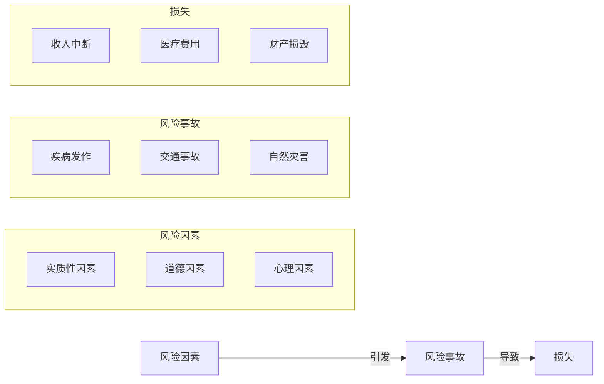
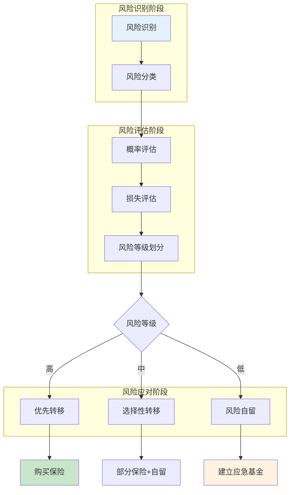
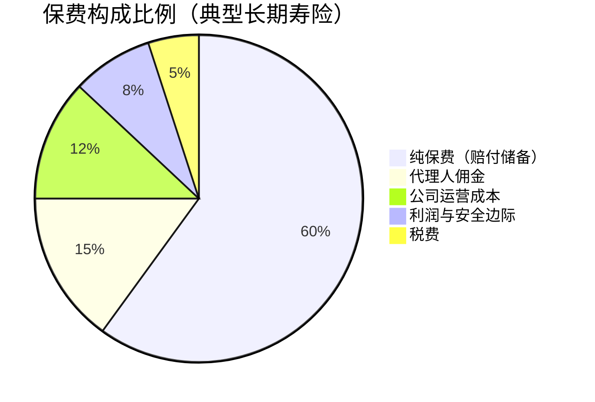
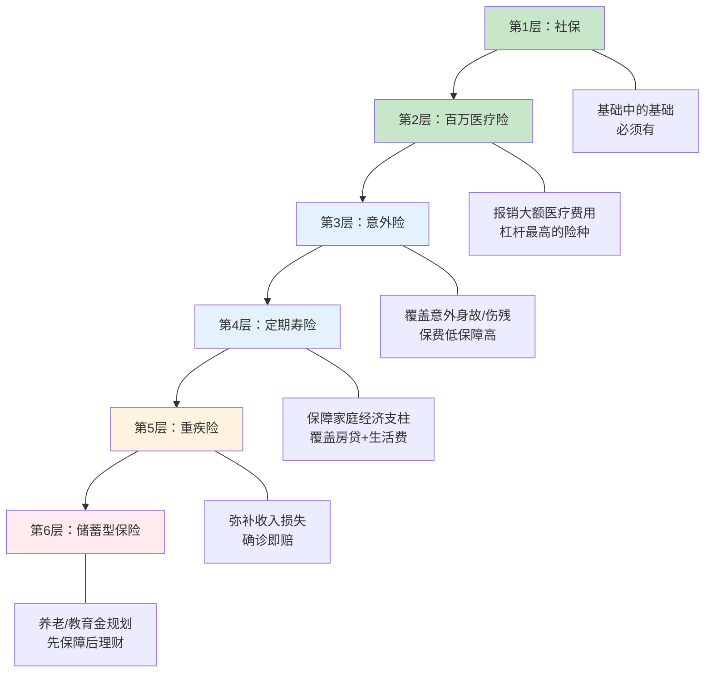

## 一、风险与保险的本质

理解风险与保险的本质，是做好一切保险配置的前提。很多人买保险时直奔产品，既不理解自己面对的风险全貌，也不理解保险作为一种金融工具的运作逻辑——这导致了大量"买错保险"或"保险无用论"的悲剧。本章从底层原理出发，帮你建立科学的风险认知框架和保险思维模型。

### 1.1 风险的本质：不确定性与损失的交织

#### 1.1.1 风险的学术定义

在风险管理学中，**风险（Risk）** 是指在特定条件下和特定时期内，实际结果与预期结果之间的差异。更通俗地说：风险 = 不确定性 × 潜在损失。

注意两个关键词：

- **不确定性**：如果一件事100%会发生（比如人终有一死），那它本身不是风险，而是确定性事件。风险指的是"可能发生也可能不发生"的状态。
- **潜在损失**：如果不确定性带来的只有好事（比如彩票中奖），那它不构成需要管理的风险。风险特指可能带来负面后果的不确定性。

#### 1.1.2 风险的五大特征

| 特征 | 含义 | 实例 |
|------|------|------|
| **客观性** | 风险不以人的意志为转移，它是客观存在的 | 无论你是否承认，疾病和意外的风险始终存在 |
| **普遍性** | 风险无处不在，每个人、每个家庭、每个企业都面临风险 | 从新生儿到百岁老人，无人能完全规避风险 |
| **不确定性** | 风险发生的时间、地点、程度和后果都是不确定的 | 你不知道自己何时会生病，也不知道病情有多严重 |
| **可变性** | 风险会随着环境、技术、行为等因素的变化而变化 | 医疗技术进步降低了某些疾病的致死率，但环境污染又产生了新的健康风险 |
| **可测性** | 虽然个体的风险事件不可预测，但大量同类风险的统计规律是可以计算的 | 保险公司无法预测某个人何时死亡，但可以精确计算一个百万人群体的死亡率 |

理解"可测性"至关重要——它正是保险存在的数学基础。单个个体的命运无法预测，但大数法则让群体行为变得可计算。

#### 1.1.3 风险三要素

任何风险事件的发生都遵循一个链条：

- **风险因素（Hazard）**：引起或增加风险事故发生概率的条件。分为实质性因素（如建筑结构老化）、道德因素（如故意骗保）、心理因素（如疏忽大意）。
- **风险事故（Peril）**：造成损失的直接原因，如车祸、火灾、疾病发作。
- **损失（Loss）**：风险事故带来的经济或非经济后果。

举个例子：长期吸烟（风险因素）→ 肺癌确诊（风险事故）→ 丧失劳动能力 + 巨额医疗费（损失）。理解这个链条，有助于我们从源头控制风险（戒烟），同时在末端做好财务准备（保险）。

#### 1.1.4 个人与家庭面临的风险全景

从财务规划的角度，个人和家庭面临的风险可以分为以下几大类：

**人身风险**——与人的生命和健康直接相关：

- **早逝风险**：家庭经济支柱过早离世，导致家庭收入中断、房贷断供、子女教育资金不足。
- **长寿风险**：寿命超出预期，导致养老储蓄不足，晚年生活质量下降。
- **疾病风险**：重大疾病带来的高额医疗费用、康复费用以及收入损失。
- **伤残风险**：意外或疾病导致的残疾，既丧失收入能力，又增加护理费用。

**财产风险**——与有形和无形资产相关：

- **直接损失**：火灾、盗窃、自然灾害导致的财产损毁。
- **间接损失**：财产损毁后的停工停产损失、替代成本增加。

**责任风险**——因自身行为对他人造成损害的赔偿责任：

- **民事责任**：过失伤害他人（如交通事故、产品质量问题）。
- **职业责任**：专业失误导致客户损失（如医疗事故、建筑缺陷）。

**财务风险**——与经济活动和金融市场相关：

- **投资风险**：股票、基金等投资亏损。
- **信用风险**：借贷方违约无法偿还。
- **通胀风险**：货币购买力下降侵蚀储蓄价值。

### 1.2 风险管理：识别、评估与应对

#### 1.2.1 科学的风险评估框架

面对风险，"拍脑袋"做决策是最大的风险。我们需要一个系统化的评估流程：

**风险评估的三个核心维度**：

| 维度 | 评估标准 | 高风险示例 | 低风险示例 |
|------|----------|------------|------------|
| 发生概率 | 统计数据、个人情况 | 30岁男性驾车出行（中频） | 被陨石击中（极低频） |
| 损失程度 | 直接费用+间接费用+机会成本 | 重大疾病（50万+治疗费+2-3年收入损失） | 手机屏幕碎裂（几百元维修费） |
| 可预测性 | 是否有历史数据、是否可建模 | 常见疾病（有大量精算数据） | 新型传染病（数据不足） |

**高风险** = 高概率 + 高损失，必须优先处理；**中等风险** = 二者居其一，选择性处理；**低风险** = 低概率 + 低损失，可以自留。

#### 1.2.2 风险管理的四种方式

面对识别出的风险，有四种基本的应对策略：

| 方式 | 含义 | 适用场景 | 优点 | 缺点 | 典型示例 |
|------|------|----------|------|------|----------|
| **风险规避** | 完全避免可能导致风险的活动 | 风险极高且无法承受 | 彻底消除风险 | 同时放弃了相关收益 | 不做高危极限运动、不投资P2P |
| **风险自留** | 自己承担风险后果 | 损失较小或概率极低 | 节省保费支出 | 可能面临意外损失 | 小额财产损失（手机碎屏）自费修理 |
| **风险转移** | 将风险的财务后果转嫁给第三方 | 损失较大但概率可控 | 用确定的小额支出换取不确定的巨额损失保障 | 需要持续支付保费 | 购买保险 |
| **风险控制** | 降低风险发生概率或减小损失 | 可以采取预防措施 | 从根源上减少风险 | 无法完全消除 | 安装防盗门、定期体检、安装烟雾报警器 |

这四种方式并非互斥，而是需要组合使用。一个成熟的风险管理方案通常是：

1. **先规避**：明显不值得冒的风险直接不做。
2. **再控制**：能通过预防措施降低的风险积极控制。
3. **然后转移**：剩余的、自己承受不起的高损失风险通过保险转移。
4. **最后自留**：小概率、低损失的风险自己承担。

#### 1.2.3 必须转移的风险 vs 可以自留的风险

这里有一个实用的判断标准——**"如果风险真的发生，你的家庭财务会不会崩溃？"**

- **必须转移**：重大疾病（治疗费30-100万）、家庭经济支柱身故（房贷+子女教育+赡养老人）、重大残疾（终身护理费）。
- **可以自留**：手机丢失（几千元）、小额门诊费用（几百到几千元）、小磕小碰的医疗费。

核心原则：**保险应该用来保障你承受不起的风险，而不是用来报销你能承受的小额费用。**

### 1.3 保险的本质：风险的社会化分担机制

#### 1.3.1 保险的定义与核心逻辑

**保险（Insurance）** 的本质是一种**风险的社会化分担机制**：大量面临同类风险的人，每人缴纳少量保费，形成一个资金池；当其中少数人真的遭遇风险损失时，从资金池中获得远超其个人保费的赔偿。

这个机制的成立依赖三个条件：

1. **大量同质风险单位**：足够多的人面临相似的风险（如100万个30岁男性），使得统计规律可计算。
2. **损失的偶然性**：损失必须是意外发生的，而非故意制造。
3. **损失的确定性**：虽然个体不可预测，但群体的总损失可以精确估算。

#### 1.3.2 大数法则——保险的数学基石

**大数法则（Law of Large Numbers）** 是保险存在的数学基础。其核心含义是：当试验次数足够多时，事件发生的频率会趋近于其理论概率。

用一个直观的例子说明：

假设某地区30岁男性的年死亡率为0.1%（即千分之一）：
- 如果只有10个人投保，实际死亡人数可能是0人或1人甚至2人，波动极大，保险公司可能赔穿也可能白赚。
- 如果有10,000人投保，实际死亡人数大概在8-12人之间，波动很小，保险公司可以精确预测赔付。
- 如果有1,000,000人投保，实际死亡人数大概在990-1,010人之间，几乎可以完美预测。

这就是为什么保险公司需要大规模承保——规模越大，风险越可控。这也是为什么新兴的小型保险公司往往比大型保险公司承担更大的经营风险。

#### 1.3.3 保费的精算构成

你每年缴纳的保费并不是随便定的，它由精算师通过严格的数学计算得出：

$$保费 = 纯保费 + 附加保费$$

其中：

**纯保费** = 预期赔付金额，基于以下因素计算：
- **预定死亡率/发病率**：不同年龄、性别、职业的死亡率/发病率表（生命表）。
- **预定利率**：保险公司投资保费的预期收益率（中国目前上限为3.0%）。
- **预定费用率**：未来理赔的管理成本。

**附加保费** = 保险公司的经营成本，包括：
- **佣金**：代理人/经纪人的销售佣金（首年佣金通常为首年保费的30%-50%）。
- **管理费用**：公司运营、办公、人员工资等。
- **利润**：保险公司的合理利润。
- **安全边际**：为应对异常情况预留的缓冲。

**为什么了解保费构成很重要？** 因为它解释了几个常见的消费者困惑：
- **为什么储蓄型保险比消费型贵得多？** 储蓄型保险的"纯保费"中很大一部分是储蓄部分，而消费型只包含风险保费。
- **为什么互联网保险更便宜？** 因为省去了代理人佣金（附加保费大幅降低），纯保费相同。
- **为什么退保会亏钱？** 因为前期的大部分保费已经作为佣金和运营成本花掉了，现金价值（退保可拿回的金额）很低。

#### 1.3.4 保险的三大经济功能

保险不仅是一种风险转移工具，它在宏观经济中承担着三大功能：

**（一）经济补偿功能（核心功能）**

这是保险最基本的功能。当被保险人发生损失时，保险公司按照合同约定进行赔付，帮助被保险人恢复到损失前的经济状态。注意：保险的目的是"补偿"而非"获利"，这也是为什么财产保险的赔付不能超过实际损失（损失补偿原则）。

**（二）资金融通功能**

保险公司收取的保费并不立即全部用于赔付，而是形成巨额的保险资金池。这些资金需要进行投资管理（主要是债券、股票、不动产等），以实现保值增值。保险资金是资本市场最重要的机构投资者之一。

截至2025年底，中国保险业总资产超过30万亿元，保险资金运用余额超过28万亿元，是仅次于银行的第二大金融行业。

**（三）社会管理功能**

保险通过市场机制实现了社会层面的风险管理：
- **减轻政府救助压力**：自然灾害后，保险赔付减轻了政府的财政负担。
- **促进安全生产**：企业财产保险要求企业达到一定的安全标准。
- **维护社会稳定**：医疗、养老等保险构建了社会安全网。

#### 1.3.5 保险与其他风险管理工具的对比

| 工具 | 机制 | 优势 | 劣势 | 适用场景 |
|------|------|------|------|----------|
| **保险** | 支付保费转移风险 | 杠杆高（小额保费撬动大额保障） | 持续付费，不返还（消费型） | 大额损失风险 |
| **储蓄** | 积累资金应对未来 | 资金完全自控 | 积累速度慢，杠杆低 | 小额、可预见的支出 |
| **投资** | 用收益覆盖风险 | 可能获得高回报 | 可能亏损，不确定性大 | 财富增值（非风险保障） |
| **互助** | 亲友间互相帮助 | 灵活、无成本 | 金额有限、可能伤感情 | 小额应急 |
| **社会保障** | 政府强制的社会保险 | 覆盖面广、费用低 | 保障水平有限 | 基础保障 |

一个常见的错误是用投资或储蓄替代保险。投资的收益是不确定的，而风险事件的花费是确定的——你不能用不确定的钱去覆盖确定的支出。保险的本质是用确定的小额支出（保费）去覆盖不确定的巨额损失。

### 1.4 可保风险的条件

并非所有风险都可以通过保险来转移。一个风险要成为"可保风险"，必须满足以下条件：

| 条件 | 解释 | 反例（不可保） |
|------|------|----------------|
| **大量同质风险单位** | 必须有足够多的投保人，使大数法则成立 | 非常罕见的疾病（样本太少无法精算） |
| **损失必须是偶然的** | 不能是故意制造的 | 故意纵火骗取保险金 |
| **损失必须是明确的** | 损失的时间、原因、金额可以确定 | 精神痛苦、名誉损失（难以量化） |
| **损失不能是灾难性的** | 不能所有投保人同时遭受损失 | 核战争、全球性地震（会击穿保险公司的赔付能力） |
| **保费必须合理** | 保费不能高到投保人无法承受 | 已确诊癌症患者的重疾险（精算上不可行） |
| **损失概率可以计算** | 必须有充分的统计数据支持 | 完全未知的新型风险 |

理解这些条件，有助于你理解为什么有些事情保险不保——不是保险公司"坑你"，而是从精算和经营角度确实无法承保。

### 1.5 常见误区与纠正

**误区一："保险是骗人的"**

纠正：保险不是骗人的，但不专业的销售行为可能让人产生被骗的感觉。保险合同是法律文件，赔付严格按照合同条款执行。买之前不看条款、买之后发现不符合预期，这是信息不对称的问题，不是保险本身的问题。解决方法：认真阅读条款，特别是免责条款和赔付条件。

**误区二："我还年轻，不需要保险"**

纠正：年轻恰恰是买保险的最佳时机——保费便宜、身体条件好、容易通过核保。等到年纪大了、身体出问题了，要么保费暴涨，要么直接被拒保。而且年轻人往往是家庭的未来经济支柱，一旦出事影响更大。

**误区三："有社保就够了"**

纠正：社保是基础保障，但保障范围和额度都有限。以医保为例，很多进口药、靶向药不在报销范围内，报销比例通常只有60%-80%，年度报销上限也有限。一场大病的实际花费可能达到50-100万，社保能覆盖的可能只有一半。缺口部分要么自费，要么靠商业保险。

**误区四："保险就是投资理财"**

纠正：保险的核心功能是风险保障，不是投资回报。储蓄型保险（如年金险、增额终身寿险）确实有理财功能，但收益率通常低于同等期限的银行理财或基金。买保险的第一原则是"先保障后理财"——先把保障型保险（重疾、医疗、寿险、意外）配足，再考虑储蓄型保险。

**误区五："返还型保险不花钱，更划算"**

纠正：返还型保险看起来"不花钱"，但实际上你多交的保费被保险公司拿去投资，几十年后再把本金（不含通胀损失）还给你。以30岁男性、保额50万的重疾险为例，消费型年缴约5,000元，返还型年缴约12,000元。多出的7,000元如果自己投资30年（假设年化5%），最终价值约46万元，远超返还型保险到期返还的36万元。返还型保险的本质是：你把钱借给保险公司投资，保险公司赚了差价再还给你。

**误区六："买保险只看品牌不看条款"**

纠正：保险理赔看的是合同条款，不是公司品牌。大公司和小公司都受银保监会监管，都有保险保障基金兜底。同一款产品，条款差异可能很大——A公司的"重疾"定义可能比B公司宽松得多。比起公司大小，更重要的是：保障范围是否全面、免责条款是否合理、赔付条件是否宽松。

### 1.6 保险思维模型：金字塔与优先级

理解了风险和保险的本质后，你需要一个框架来指导实际决策。以下是经过实践验证的保险配置优先级模型：

**核心原则**：
- **先保障后理财**：先把前五层配足，再考虑第六层。
- **先大人后小孩**：大人才是孩子最大的保障。如果大人倒下了，孩子的保费都交不起。
- **先经济支柱后其他成员**：家庭收入最高的人优先配置。
- **先保额后保费**：保额足够比保费便宜更重要。50万保额的消费型重疾险，比30万保额的返还型重疾险更实用。

### 1.7 进阶：保险精算的核心原理

对于希望深入理解保险运作机制的读者，本节介绍几个精算核心概念。

#### 1.7.1 生命表与死亡率

生命表（Mortality Table）是保险精算的基础工具，记录了不同年龄人群的死亡概率。中国的生命表由银保监会（现国家金融监督管理总局）编制，目前使用的是《中国人身保险业经验生命表（2010-2013）》。

生命表的核心指标：

| 指标 | 含义 | 保险应用 |
|------|------|----------|
| $q_x$ | x岁的人在一年内死亡的概率 | 计算定期寿险保费 |
| $p_x$ | x岁的人活过一年的概率 | 计算生存保险保费 |
| $l_x$ | 从初始群体中活到x岁的人数 | 计算联合生存概率 |
| $e_x$ | x岁的人的平均预期余命 | 养老金精算 |

生命表每隔10年左右更新一次，因为人口的死亡率会随着医疗水平、生活方式等因素变化。最新的第四套生命表显示，中国人口预期寿命持续提高，这意味着寿险保费可能下降（死亡率降低），但养老年金保费可能上升（活得更久，领取更多）。

#### 1.7.2 利率与保费的关系

保费计算中的"预定利率"是一个关键变量：

- **预定利率越高，保费越低**：因为保险公司预期投资收益更高，可以向投保人收取更少的保费。
- **预定利率越低，保费越高**：保险公司预期投资收益更低，需要收取更多保费来覆盖未来的赔付。

这就是为什么利率下行周期中，保险产品会"涨价"——2023年从3.5%下调到3.0%，导致重疾险、寿险等保障型产品保费普遍上涨10%-20%。

#### 1.7.3 风险选择与核保

保险公司不是来者不拒的——它需要进行**风险选择（Underwriting）**，即评估每个投保人的风险水平，决定是否承保以及以什么条件承保。这个过程叫做**核保**。

核保的结果通常有五种：

| 核保结论 | 含义 | 发生概率 |
|----------|------|----------|
| **标准体承保** | 正常承保，标准费率 | 最常见 |
| **加费承保** | 同意承保，但需要额外加收保费 | 有健康异常但可控 |
| **除外承保** | 同意承保，但某些疾病/部位除外不保 | 特定风险较高 |
| **延期承保** | 暂不承保，观察一段时间后再评估 | 当前状况不稳定 |
| **拒保** | 拒绝承保 | 风险过高 |

核保的依据包括：年龄、性别、健康状况（体检报告、既往病史）、职业、生活习惯（吸烟、饮酒）、家族病史、财务状况等。

**这也是为什么"趁年轻、趁健康买保险"如此重要**——一旦身体出了问题，核保可能给出不利结论，甚至直接拒保。到那时，你最需要保险的时候，反而是最难买到保险的时候。

### 1.8 本节小结

| 核心概念 | 关键要点 |
|----------|----------|
| 风险的本质 | 不确定性 × 潜在损失；具备客观性、普遍性、可测性等特征 |
| 风险三要素 | 风险因素 → 风险事故 → 损失；理解链条有助于源头控制和末端保障 |
| 风险管理四法 | 规避、自留、转移、控制；组合使用，保险用于转移承受不起的大额损失 |
| 保险的本质 | 风险的社会化分担机制；依赖大数法则和精算技术 |
| 保费构成 | 纯保费（赔付储备）+ 附加保费（佣金+运营+利润） |
| 可保风险条件 | 大量同质、偶然性、明确性、非灾难性、可计算、保费合理 |
| 配置优先级 | 社保→百万医疗→意外→定寿→重疾→储蓄型；先保障后理财 |
| 关键行动 | 趁年轻、趁健康投保；优先保障经济支柱；保额充足比品牌重要 |
