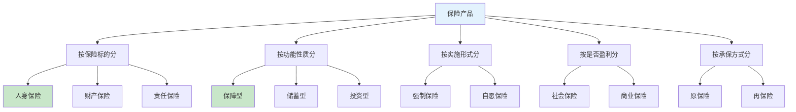

## 二、保险的分类与功能

理解保险的分类体系是做出正确购买决策的前提。保险产品种类繁多，不同分类维度下同一产品可能属于不同类别。本章系统梳理保险的分类框架，深入解析每类保险的核心功能、适用场景和关键特征，为后续的保险配置打下知识基础。

### 2.1 保险分类的总体框架

保险可以从多个维度进行分类。掌握这些维度之间的关系，才能在面对具体产品时准确判断其本质。

**核心分类维度说明**：

| 分类维度 | 分类依据 | 主要类别 | 实际意义 |
|----------|----------|----------|----------|
| 保险标的 | 保障的对象是什么 | 人身保险、财产保险、责任保险 | 决定你需要哪种大类的保险 |
| 功能性质 | 保险的核心目的 | 保障型、储蓄型、投资型 | 决定保险在财务规划中的角色 |
| 实施形式 | 是否强制购买 | 强制保险、自愿保险 | 决定你是否有选择权 |
| 是否盈利 | 保险的经营目的 | 社会保险、商业保险 | 决定保障水平和购买渠道 |
| 承保方式 | 风险由谁承担 | 原保险、再保险 | 普通消费者无需关注，了解即可 |

### 2.2 人身保险：保障人的生命与健康

人身保险是以人的寿命和身体为保险标的的保险，是个人保险配置的核心。根据保障内容的不同，人身保险进一步分为以下几大类：

#### 2.2.1 人寿保险（寿险）

人寿保险以被保险人的寿命为标的，以被保险人的生存或死亡为给付条件。

**寿险的细分类型**：

| 类型 | 保障期限 | 给付条件 | 核心功能 | 适合人群 |
|------|----------|----------|----------|----------|
| 定期寿险 | 固定期限（如20年、至60岁） | 保障期内身故 | 低保费高保额，纯保障 | 有房贷、有家庭责任的经济支柱 |
| 终身寿险 | 终身 | 无论何时身故 | 保障+财富传承 | 高净值人群、有传承需求者 |
| 两全保险 | 固定期限 | 期内身故赔付，期满生存返还 | 保障+强制储蓄 | 风险厌恶型、有储蓄需求者 |
| 年金保险 | 终身或固定期限 | 被保险人生存至约定年龄 | 提供稳定现金流 | 养老规划、教育金规划 |

**定期寿险 vs 终身寿险的详细对比**：

| 对比维度 | 定期寿险 | 终身寿险 |
|----------|----------|----------|
| 保费水平 | 30岁男性100万保额约1000-1500元/年 | 同等条件约8000-15000元/年 |
| 保障期限 | 10年/20年/至60岁/至70岁可选 | 终身 |
| 是否返还保费 | 不返还（消费型） | 100%赔付（人终有一死） |
| 现金价值 | 极低或无 | 随时间增长，可贷款或退保取回 |
| 核心用途 | 覆盖家庭责任期风险 | 财富传承、资产隔离 |
| 杠杆率 | 极高（保费低、保额高） | 较低（保费高） |
| 适合阶段 | 25-55岁家庭责任期 | 资产充足后的长期规划 |

**年金保险的工作机制**：

年金保险本质上是一种"先交钱、后领钱"的长期储蓄产品。其运作流程如下：

年金保险的收益率通常在2.5%-3.5%之间（保证利率），虽然不高但胜在确定性极强。与银行存款相比，年金保险的优势在于可以锁定终身利率，不受未来利率下行影响。

**选购年金险的关键指标**：

- **保证利率**：合同中写明的最低收益率，通常为2.5%或3%
- **万能账户结算利率**：实际运作利率，通常高于保证利率但不保证
- **退保手续费**：前几年退保会损失本金，通常第5年后退保无手续费
- **领取灵活性**：是否支持部分领取、保单贷款

#### 2.2.2 健康保险

健康保险以被保险人的身体为标的，对因疾病或意外导致的医疗费用或收入损失进行补偿。健康保险是普通家庭最实用、最高频使用的保险类型。

**健康保险的两大核心分支**：

**（一）医疗保险**

医疗保险报销因疾病或意外产生的医疗费用，遵循"损失补偿"原则——花多少报多少，不能重复获利。

| 类型 | 免赔额 | 保额 | 报销范围 | 典型产品 | 年保费参考 |
|------|--------|------|----------|----------|------------|
| 百万医疗险 | 1万元 | 100-600万 | 住院+特殊门诊，社保报销后100%报销 | 众安尊享e生、平安e生保 | 30岁约200-400元 |
| 中端医疗险 | 0-5000元 | 100-300万 | 含门诊、可选私立医院 | MSH欣享人生 | 30岁约3000-8000元 |
| 高端医疗险 | 0元 | 不限 | 全球就医、私立医院、体检 | Bupa、Cigna | 30岁约2-10万元 |
| 小额医疗险 | 0-100元 | 1-5万 | 门诊+住院 | 学平险、门诊险 | 100-500元 |
| 防癌医疗险 | 0元 | 100-400万 | 仅报销癌症相关医疗费 | 好医保防癌医疗险 | 60岁约800-1500元 |

**百万医疗险的核心条款解读**：

1. **免赔额**：年度1万元免赔，即医保报销后自费超过1万的部分才开始报销。这意味着小额住院（自费几千元）百万医疗险不赔。
2. **续保条件**：最关键条款之一。优先选择"保证续保"产品（如保证续保6年、15年、20年），避免因健康变化或产品停售失去保障。
3. **报销比例**：经社保报销后通常100%报销，未经社保报销通常只报60%。
4. **等待期**：通常30天，等待期内发生的疾病不报销。
5. **既往症**：投保前已存在的疾病通常不报销，投保时必须如实告知。

**（二）重大疾病保险（重疾险）**

重疾险在被保险人确诊合同约定的重大疾病时，一次性给付保险金。与医疗险的"报销制"不同，重疾险是"给付制"——确诊即赔，不限用途。

**重疾险的核心价值**：

重疾险的赔付金不仅用于治疗费用，更重要的是弥补因疾病导致的收入损失。一场大病通常需要：
- 直接治疗费用：30-100万元
- 康复期费用：10-30万元
- 收入损失：治疗+康复期2-5年，按年收入20万计算损失40-100万元
- 护理费用：10-20万元

因此重疾险保额建议为年收入的3-5倍，最低30万元。

**重疾险的产品形态演变**：

| 产品类型 | 保障内容 | 保费水平 | 适合人群 |
|----------|----------|----------|----------|
| 单次赔付重疾 | 重疾赔付一次后合同终止 | 最低 | 预算有限 |
| 多次赔付重疾（分组） | 重疾分组，每组可赔一次 | 中等 | 追求较全面保障 |
| 多次赔付重疾（不分组） | 重疾不分组，可赔多次 | 较高 | 预算充足，追求最佳保障 |
| 带身故责任重疾 | 重疾+身故二赔一 | 最高 | 希望"必赔"的人群 |

**重疾险中的轻症和中症**：

现代重疾险通常包含轻症和中症保障，这是非常实用的创新：

- **轻症**：重疾的早期阶段，如原位癌、轻度脑中风后遗症。赔付保额的20%-30%，不影响重疾保额。
- **中症**：介于轻症和重疾之间，如中度帕金森病。赔付保额的50%-60%。
- **豁免功能**：确诊轻症/中症后，后续保费免交，保障继续有效。

**必须关注的高发轻症**（银保监会统一定义的28种重疾之外，轻症没有统一标准）：

| 高发轻症 | 对应重疾 | 重要性 |
|----------|----------|--------|
| 极早期恶性肿瘤 | 恶性肿瘤 | 极高 |
| 不典型心肌梗塞 | 急性心肌梗塞 | 极高 |
| 轻微脑中风 | 脑中风后遗症 | 极高 |
| 冠状动脉介入手术 | 冠状动脉搭桥术 | 高 |
| 单侧肾脏切除 | 重大器官移植术 | 高 |

#### 2.2.3 意外伤害保险

意外伤害保险保障因外来的、突发的、非本意的、非疾病的客观事件导致的身体伤害。

**意外险的保障层次**：

| 保障项目 | 赔付方式 | 说明 |
|----------|----------|------|
| 意外身故 | 一次性给付 | 意外导致身故赔付全部保额 |
| 意外伤残 | 按伤残等级比例赔付 | 1级赔100%，10级赔10%，按比例 |
| 意外医疗 | 报销制 | 门诊+住院均可报销，通常无免赔或低免赔 |
| 住院津贴 | 按天给付 | 意外住院每天补贴100-300元 |
| 猝死保障 | 一次性给付 | 部分产品含猝死保障（猝死严格来说是疾病） |

**意外险的独特价值**：

意外险是所有保险中杠杆率最高的产品。100-300元/年即可获得50-100万的意外身故/伤残保障。更重要的是，意外伤残是意外险独有的保障——重疾险和寿险都不保伤残。一场车祸导致的截肢，重疾险不赔（不属于重大疾病定义），寿险不赔（人还活着），只有意外险按伤残等级赔付。

**意外险的分类**：

| 类型 | 保障范围 | 保费 | 适合人群 |
|------|----------|------|----------|
| 综合意外险 | 意外身故+伤残+医疗 | 100-300元/年 | 所有人必买 |
| 交通意外险 | 仅保障乘坐交通工具的意外 | 50-200元/年 | 经常出差者可补充 |
| 旅行意外险 | 旅行期间的意外+医疗+救援 | 10-50元/天 | 出行前购买 |
| 高危职业意外险 | 针对高危职业人群 | 500-2000元/年 | 建筑工人、外卖骑手等 |
| 老年意外险 | 60岁以上老人专属 | 200-500元/年 | 退休老人 |

**选购意外险的注意事项**：

1. **职业限制**：大部分意外险只承保1-4类职业，高危职业（5-6类）需专门产品
2. **伤残 vs 全残**：部分产品只保"全残"不保"伤残"，一字之差保障天壤之别。务必选择保"伤残"的产品
3. **意外医疗报销范围**：优选不限社保目录的产品，自费药也能报销
4. **猝死保障**：标配版通常不含猝死，需要附加或选择含猝死版本

#### 2.2.4 投保人/被保险人豁免

豁免是一种附加功能，当投保人或被保险人发生特定情形（如确诊轻症/重疾、身故、全残）时，后续保费免交，保障继续有效。

| 豁免类型 | 含义 | 重要性 |
|----------|------|--------|
| 被保人豁免 | 被保人确诊轻症/重疾后免交保费 | 重疾险标配，极其重要 |
| 投保人豁免 | 投保人发生特定情形后免交保费 | 为家人投保时强烈建议附加 |

### 2.3 财产保险：保障你的资产

财产保险以财产及其相关利益为保险标的，补偿因约定事故导致的经济损失。

#### 2.3.1 家庭财产保险

| 险种 | 保障内容 | 年保费 | 适用场景 |
|------|----------|--------|----------|
| 家财险 | 房屋主体+室内装潢+室内财产 | 100-500元 | 自有住房 |
| 水管爆裂险 | 因水管爆裂导致的财产损失 | 附加 | 老旧小区 |
| 盗抢险 | 入室盗窃导致的财产损失 | 附加 | 治安较差区域 |
| 家庭成员责任险 | 家庭成员过失导致他人损失 | 附加 | 有小孩的家庭 |

#### 2.3.2 车辆保险

车辆保险是财产保险中与个人最密切相关的险种：

| 险种 | 性质 | 保障内容 | 说明 |
|------|------|----------|------|
| 交强险 | 强制 | 对第三方的人身伤亡和财产损失 | 必买，不买不能上路 |
| 第三者责任险 | 自愿 | 对第三方的赔偿，建议200万 | 交强险的补充，强烈建议 |
| 车损险 | 自愿 | 自己车辆的损失 | 2020年改革后已包含盗抢、涉水、自燃、玻璃等 |
| 车上人员责任险 | 自愿 | 车上乘客的伤亡 | 可用驾乘意外险替代 |

**车险改革后的变化（2020年9月起）**：

2020年车险综合改革后，车损险将原来的多个附加险（盗抢险、涉水险、自燃险、玻璃单独破碎险、不计免赔险、无法找到第三方特约险）全部纳入主险。这意味着买了车损险就自动获得这些保障，不需要再单独购买。

#### 2.3.3 其他财产保险

| 险种 | 保障对象 | 适用场景 |
|------|----------|----------|
| 货物运输保险 | 运输中的货物 | 网购高价值商品、企业物流 |
| 账户安全险 | 银行卡/支付宝/微信盗刷 | 日常使用 |
| 碎屏险 | 手机屏幕碎裂 | 手机用户 |
| 退货运费险 | 退货产生的运费 | 网购高频用户 |

### 2.4 责任保险：转移法律赔偿责任

责任保险保障被保险人因过失导致第三方人身伤亡或财产损失而需承担的法律赔偿责任。

#### 2.4.1 与个人相关的责任保险

| 险种 | 保障内容 | 适用场景 | 年保费参考 |
|------|----------|----------|------------|
| 个人责任险 | 日常生活中对他人造成的损害 | 所有人 | 通常包含在家财险中 |
| 高空坠物责任险 | 高空坠物导致他人伤害 | 高层住户 | 附加在车险中 |
| 雇主责任险 | 家政人员在工作中受伤 | 雇用保姆、月嫂的家庭 | 100-300元 |
| 遛狗责任险 | 宠物导致他人伤害或财产损失 | 养宠物家庭 | 50-200元 |

#### 2.4.2 职业责任保险

| 险种 | 保障对象 | 说明 |
|------|----------|------|
| 医疗责任险 | 医生 | 医疗事故赔偿 |
| 律师责任险 | 律师 | 执业过失赔偿 |
| 注册会计师责任险 | 会计师 | 审计过失赔偿 |
| 董事高管责任险 | 公司高管 | 决策失误导致的股东诉讼 |

### 2.5 保障型 vs 储蓄型 vs 投资型保险

从功能性质角度，保险产品可分为三大类。理解这一分类对于做出正确的购买决策至关重要。

#### 2.5.1 保障型保险

保障型保险的核心目的是"花小钱转移大风险"，保费全部用于购买保障。

**特征**：
- 保费低、保额高，杠杆率极高
- 没有或极少有现金价值
- 不返还保费（消费型）
- 核心目标：用最小的成本获得最大的保障

**典型产品**：定期寿险、消费型重疾险、百万医疗险、意外险

**适用场景**：所有人的基础保障配置。尤其是收入不高但家庭责任重的年轻人，保障型保险是性价比最高的选择。

#### 2.5.2 储蓄型保险

储蓄型保险在提供保障的同时具有储蓄功能，到期或退保时可以拿回本金甚至更多。

**特征**：
- 保费较高，部分保费用于储蓄
- 有较高的现金价值
- 通常返还保费或给付生存金
- 核心目标：保障 + 强制储蓄

**典型产品**：两全保险、终身寿险（传统型）、年金保险

**适用场景**：有长期储蓄需求、风险偏好较低、希望"不亏本"的人群。但需要注意，储蓄型保险的实际收益率通常低于同期银行定期存款和国债，其核心价值在于确定性和纪律性。

#### 2.5.3 投资型保险

投资型保险将保障与投资相结合，保单价值随投资账户表现浮动。

**特征**：
- 保费最高，保障部分较低
- 收益不确定，可能亏损
- 具有一定的灵活性（可调整保额、追加保费）
- 核心目标：保障 + 资产增值

**典型产品**：

| 类型 | 投资方式 | 风险等级 | 结算方式 | 适合人群 |
|------|----------|----------|----------|----------|
| 万能险 | 保险公司统一投资 | 低 | 有保证利率（通常1.75%-3%）+ 浮动收益 | 追求稳健收益者 |
| 分红险 | 保险公司整体利润分红 | 低 | 红利不保证，通常0-4% | 看重分红预期者 |
| 投连险 | 投保人自选基金账户 | 中-高 | 完全取决于账户表现，可能亏损 | 有一定风险承受能力者 |

**三类保险的本质区别**：

| 对比维度 | 保障型 | 储蓄型 | 投资型 |
|----------|--------|--------|--------|
| 核心功能 | 风险转移 | 保障+储蓄 | 保障+投资 |
| 保费水平 | 低 | 中 | 高 |
| 杠杆率 | 极高 | 中等 | 最低 |
| 现金价值 | 极低/无 | 较高 | 随投资表现波动 |
| 收益确定性 | 不适用 | 确定 | 不确定 |
| 适合人群 | 所有人的基础保障 | 风险厌恶型储蓄者 | 有一定风险承受能力者 |
| 优先级 | 最高 | 其次 | 最后 |

### 2.6 强制保险与自愿保险

#### 2.6.1 强制保险（法定保险）

强制保险是由法律法规规定必须购买的保险，个人没有选择权。

| 强制险种 | 法律依据 | 说明 |
|----------|----------|------|
| 交强险 | 《道路交通安全法》 | 机动车必须购买，不买不能上路、年检 |
| 社会保险 | 《社会保险法》 | 用人单位必须为员工缴纳五险 |
| 旅行社责任险 | 《旅游法》 | 旅行社必须购买 |
| 建筑工程一切险 | 《建筑法》 | 建筑施工企业必须购买 |

**交强险的赔偿限额**（2020年改革后）：

| 赔偿项目 | 有责任限额 | 无责任限额 |
|----------|------------|------------|
| 死亡伤残 | 18万元 | 1.8万元 |
| 医疗费用 | 1.8万元 | 1800元 |
| 财产损失 | 2000元 | 100元 |

交强险的保额远远不够——一次交通事故造成他人死亡，赔偿金额通常在100万以上。因此第三者责任险是必买的商业车险补充。

#### 2.6.2 自愿保险（商业保险）

自愿保险由个人根据自身需求自主决定是否购买。本书后续章节重点讨论的就是如何科学地选择和配置自愿保险。

### 2.7 社会保险与商业保险的关系

社会保险和商业保险是个人保障体系的两大支柱，二者互补而非替代。

| 对比维度 | 社会保险 | 商业保险 |
|----------|----------|----------|
| 性质 | 国家强制、普惠性 | 自愿购买、个性化 |
| 保费 | 个人+单位共同承担 | 个人全额承担 |
| 保障水平 | 基础保障，"保基本" | 可定制，"保充足" |
| 报销限制 | 有起付线、封顶线、目录限制 | 视产品而定，高端产品限制少 |
| 是否盈利 | 非营利 | 营利性 |
| 参保门槛 | 低（几乎无门槛） | 有健康告知、年龄限制 |

**社保的局限性**（为什么需要商业保险补充）：

1. **医保报销有上限**：职工医保年度报销上限通常30-50万，大病治疗费用可能超过这个数字
2. **医保有目录限制**：进口药、靶向药、特效药很多不在医保目录内
3. **医保不报收入损失**：生病期间无法工作，收入断流，医保不管
4. **养老金替代率低**：退休后养老金通常只有在职收入的40%-60%
5. **工伤保险范围有限**：上下班途中出事才算工伤，工作之外的意外不管

### 2.8 保险的八大功能

保险不仅仅是一种风险转移工具，它具有多重功能，在个人和家庭财务管理中扮演着不可替代的角色。

#### 2.8.1 风险转移功能（核心功能）

这是保险最基本、最核心的功能。通过支付小额保费，将可能发生的巨额损失转移给保险公司。

**运作原理**：保险公司通过大数法则，将众多投保人的风险汇集起来。每个投保人支付的保费虽然远小于可能遭受的损失，但汇集后的保费池足以覆盖少数不幸者的赔付。

**实例**：30岁男性购买100万定期寿险，年保费约1200元。如果不幸身故，保险公司赔付100万——这是833倍的杠杆。

#### 2.8.2 经济补偿功能

保险在风险事故发生后提供经济补偿，帮助被保险人恢复到事故发生前的经济状态。

- 医疗险报销治疗费用，避免"因病致贫"
- 车损险赔偿车辆维修费用
- 家财险赔偿房屋和财产损失

#### 2.8.3 收入替代功能

当被保险人因疾病、意外或身故导致收入中断时，保险金替代收入维持家庭正常运转。

- 重疾险的赔付金弥补治疗期间的收入损失
- 定期寿险的赔付金替代家庭经济支柱的未来收入
- 意外伤残的赔付金补偿劳动能力下降带来的收入减少

#### 2.8.4 强制储蓄功能

储蓄型保险和年金保险具有强制储蓄功能。与银行存款不同，保险的退保成本较高，反而帮助投保人坚持长期储蓄计划。

**适用场景**：自律性较差、容易冲动消费的人群；为子女教育、自己养老等刚性支出做长期储备。

#### 2.8.5 财富传承功能

终身寿险是高净值人群进行财富传承的重要工具，具有以下优势：

- **指定受益人**：保险金直接给付给指定受益人，不进入遗产分配流程
- **避免债务追偿**：在一定条件下，保险金不受被保险人生前债务影响
- **税务优势**：保险金在中国目前免征个人所得税
- **隐私保护**：保险理赔不需要公示，避免继承纠纷

#### 2.8.6 资产隔离功能

合理配置的保险可以实现一定程度的资产隔离：

- 企业主的个人保险在企业破产时通常不受影响
- 指定受益人的保险金不属于被保险人的遗产
- 年金保险的生存金在一定条件下具有债务隔离效果

**注意**：资产隔离功能有法律边界。恶意避债、转移财产的保险安排可能被法院撤销。具体操作应咨询专业律师。

#### 2.8.7 资金融通功能

具有现金价值的保单可以进行保单贷款，通常可贷出现金价值的80%，利率低于信用贷款。

**保单贷款的特点**：
- 不需要征信审批，手续简便
- 贷款期间保障继续有效
- 通常6个月为一个贷款周期，可续贷
- 利率约4.5%-6%（低于信用卡和消费贷）

#### 2.8.8 社会管理功能

从宏观角度看，保险还承担着社会管理的功能：

- **减轻政府负担**：商业保险分担了部分社会保障压力
- **促进社会稳定**：保险赔付减少了因灾因病返贫的现象
- **推动安全生产**：责任保险促使企业加强安全管理
- **支持资金融通**：保险公司作为机构投资者参与资本市场

### 2.9 各类保险的功能定位速查

以下速查表帮助你快速判断各类保险在家庭保障体系中的角色：

| 保险类型 | 核心功能 | 解决的问题 | 优先级 | 年保费参考（30岁） |
|----------|----------|------------|--------|---------------------|
| 百万医疗险 | 报销医疗费用 | 大额医疗费 | ★★★★★ | 200-400元 |
| 意外险 | 意外身故/伤残/医疗 | 意外导致的损失 | ★★★★★ | 100-300元 |
| 定期寿险 | 身故赔付 | 家庭经济支柱身故后的收入替代 | ★★★★★ | 1000-1500元/100万 |
| 重疾险 | 确诊一次性给付 | 重疾治疗+收入损失 | ★★★★ | 3000-8000元/30万 |
| 终身寿险 | 身故赔付+传承 | 财富传承 | ★★★ | 8000-15000元/100万 |
| 年金险 | 定期领取 | 养老/教育金 | ★★★ | 视领取金额而定 |
| 防癌医疗险 | 报销癌症医疗费 | 老人无法买百万医疗时的替代 | ★★★ | 800-1500元/60岁 |
| 车险（商业） | 车辆损失+第三方赔偿 | 交通事故 | ★★★★ | 视车型和保额而定 |

### 2.10 常见误区

**误区一：买了一份保险就万事大吉**

不同保险解决不同问题。重疾险不报销医疗费（只给现金），医疗险不赔收入损失，意外险不保疾病。完整的保障需要多种保险组合搭配。

**误区二：保险越多越好**

保险配置存在边际效用递减。在基础保障充足后，额外的保险投入不如用于投资增值。家庭保险总保费建议控制在年收入的5%-10%。

**误区三：返还型保险比消费型"划算"**

返还型保险看似"不花钱"，实际上多交的保费如果自己投资，收益率通常高于保险公司返还的金额。以30岁男性100万定期寿险为例：消费型年保费约1200元，返还型约5000元。多出的3800元如果每年投入年化5%的理财产品，20年后本息合计约12.5万，而返还型通常只返还已交保费10万。

**误区四：只给孩子买保险，大人裸奔**

孩子不产生收入，其生病对家庭经济的影响远小于大人倒下。正确顺序是大人先配齐保障，再给孩子配置。

**误区五：有了社保就不需要商业保险**

社保是"保基本"，面对大病、重大意外时远远不够。社保报销后个人仍需承担的费用（目录外药品、超过封顶线的部分、收入损失等）需要商业保险补充。

**误区六：保险是骗人的，买了也不赔**

保险理赔率实际上很高（行业平均理赔率超过97%）。"不赔"的主要原因集中在：未如实告知既往病史、不在保障范围内、等待期内出险。只要投保时如实告知、了解保障范围，绝大多数理赔都能顺利进行。

***

