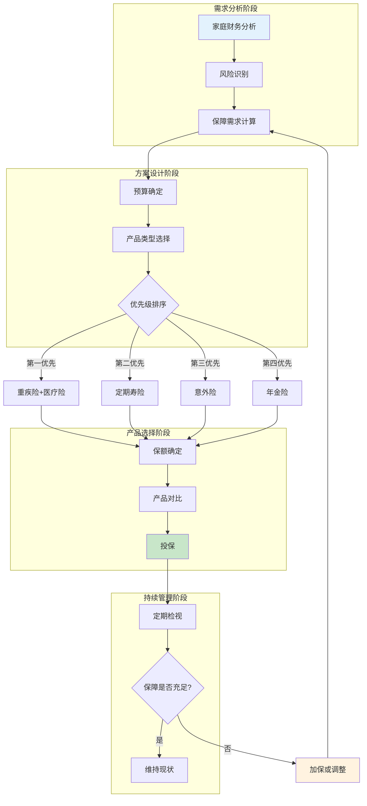
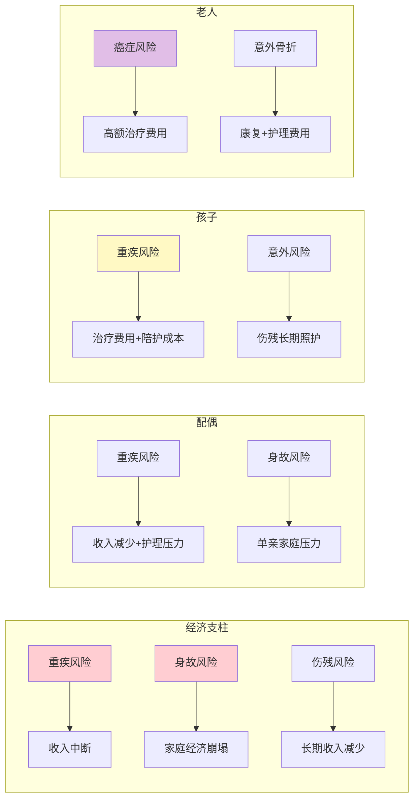
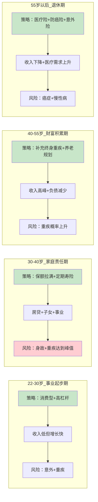

## 三、保险配置的核心原则

保险配置不是"随便买几个产品"的随机行为，而是一项需要遵循科学原则的系统工程。买错保险的代价远大于不买保险——前者让你在真正需要保障时发现"白买了"，后者至少让你省下了保费。本章梳理保险配置的六大核心原则，帮助你建立从需求分析到产品落地的完整决策框架。

### 3.0 保险配置决策流程

科学的保险配置需要遵循系统化的决策流程，确保保障的全面性和合理性。以下流程图展示了从需求分析到持续管理的完整路径：



**决策流程的核心要点**：

| 阶段 | 关键动作 | 常见错误 |
|------|----------|----------|
| 需求分析 | 盘点家庭收入、负债、已有保障 | 只看收入不看负债，低估风险敞口 |
| 预算确定 | 按家庭年收入的5%-10%分配 | 预算过高挤压生活，或过低保障不足 |
| 产品类型 | 按风险优先级选择险种 | 先买理财险再考虑保障险 |
| 保额确定 | 用科学公式计算，而非拍脑袋 | 保额过低，出险时赔付杯水车薪 |
| 产品对比 | 对比免责条款、等待期、费率 | 只看价格不看条款 |
| 持续管理 | 每年检视一次保障方案 | 买完就忘，多年不调整 |

### 3.1 先保障后理财：保险的第一优先级

#### 原则详解

"先保障后理财"是保险配置最根本的优先级原则：在家庭保险预算有限的情况下，必须优先配置保障型保险（重疾险、寿险、医疗险、意外险），待保障充足后，再用余钱考虑理财型保险（年金险、增额终身寿险、分红险等）。

这不是主观偏好，而是由两类保险的本质功能决定的：

| 维度 | 保障型保险 | 理财型保险 |
|------|-----------|-----------|
| 核心功能 | 转移重大风险（疾病、身故、伤残） | 资产增值、养老储备 |
| 解决的问题 | "万一出事怎么办" | "钱怎么保值增值" |
| 杠杆效应 | 极高（几百元保费撬动几十万保额） | 低（接近本金等价交换） |
| 不可替代性 | 高（其他金融工具无法替代） | 低（基金、股票、存款可替代） |
| 紧迫程度 | 高（风险随时可能发生） | 低（可延后规划） |

#### 为什么保障必须优先

**第一，保障型保险的杠杆效应远高于理财型保险。**

以30岁男性为例：

- 一份保额50万的重疾险，年缴保费约5000-8000元（消费型），杠杆比约60-100倍
- 一份年缴5万元的年金险，20年后总保费100万，现金价值约120-130万，杠杆比仅1.2-1.3倍

保障型保险用几千元就能获得几十万的风险保障，这种杠杆是任何理财产品都无法提供的。

**第二，保障缺口是不可逆的损失，理财缺口只是收益减少。**

假设你有5万元保险预算，全部买了年金险。一年后确诊重疾，年金险的现金价值可能只有3-4万（早期退保损失大），而一份50万保额的重疾险能直接赔付50万。这两种结果对家庭的冲击完全不同。

**第三，理财型保险的收益率并不突出。**

当前市场环境下，年金险和增额终身寿险的实际IRR（内部收益率）通常在2.5%-3.5%之间，而同期银行大额存单利率约2%-2.5%，国债收益率约2.5%-3%。理财型保险的收益优势并不明显，但流动性却远差于这些替代品。

#### 常见错误与纠正

**错误一：给孩子买了大量教育金，却没有重疾险和医疗险。**

这是最常见的"先理财后保障"错误。家长被"给孩子存一笔钱"的美好愿景吸引，每年花2-3万买教育金保险，却没给孩子配百万医疗险（每年仅需几百元）。一旦孩子确诊白血病等重大疾病，教育金保险帮不上任何忙——退保有损失，不退保又急需用钱。

**纠正方案**：先用每年300-500元给孩子配好百万医疗险和意外险，再用1000-2000元配少儿重疾险，总共不超过3000元就能获得充足保障。剩余预算再考虑教育金。

**错误二：只买返还型保险，拒绝消费型保险。**

很多人觉得"消费型保险不出险就白交钱了"，所以只选返还型（即"有病赔钱，没病返本"）。但返还型保险的保费通常是消费型的2-3倍，多出来的保费本质上是"多交钱让保险公司帮你投资，到期返还本金"，实际收益率很低。

**纠正方案**：用消费型保险做足保额，省下来的保费差额自己投资。例如：消费型重疾险50万保额年缴4000元，返还型50万保额年缴10000元。选择消费型，每年省下的6000元自己做基金定投，20年后的收益大概率高于返还型的"返本"金额。

**错误三：把保险当投资，用保险替代基金/股票。**

保险的本质是风险管理工具，不是投资工具。用保险做投资，就像用螺丝刀当锤子——能用，但效率极低。

**纠正方案**：严格区分"保障账户"和"投资账户"。保障账户用保险解决，投资账户用基金、股票、债券等专业投资工具解决。

### 3.2 先大人后小孩：保护经济支柱就是保护全家

#### 原则详解

"先大人后小孩"是指在家庭保险配置中，必须优先确保家庭经济支柱（通常是夫妻双方）的保障充足，然后再为孩子和老人配置保险。

这个原则的底层逻辑是：**保险保护的不是人，而是这个人的经济价值。** 一个不产生收入的家庭成员（如幼儿、无收入的老人），其生病或身故对家庭经济的直接冲击远小于家庭经济支柱的倒下。

#### 经济支柱倒下的连锁反应

以一个典型的三口之家为例：丈夫年收入30万，妻子年收入15万，孩子3岁，房贷余额150万，家庭年支出20万。

如果丈夫突然确诊重疾（以肺癌为例）：

| 影响维度 | 具体损失 | 金额估算 |
|----------|----------|----------|
| 直接治疗费用 | 手术+化疗+靶向药（社保报销后自费部分） | 20-40万 |
| 收入中断 | 治疗+康复期2-3年无法工作 | 60-90万 |
| 护理成本 | 家人陪护或请护工 | 5-10万/年 |
| 康复费用 | 营养品、中医调理、定期复查 | 3-5万/年 |
| 房贷压力 | 收入减少后月供压力剧增 | 持续10-15年 |
| 子女教育 | 教育支出不能停 | 持续15-20年 |

**总经济冲击：100-200万以上**，这还不包括精神层面的打击。

而如果只是孩子生病（虽然同样令人心痛），家庭经济支柱仍有收入能力，可以通过收入+社保+商业保险组合应对。

#### 推荐配置顺序

```text
家庭经济支柱（收入最高者） > 配偶 > 孩子 > 双方父母
```

**为什么父母排在孩子后面？** 这个排序看似"不孝"，但有其经济逻辑：

- 父母年龄大，保费极高（55岁以上买重疾险可能出现"保费倒挂"，即总保费超过保额）
- 父母的医疗费用可以由子女（经济支柱）的收入承担
- 给父母买保险的最佳方式是：确保自己的保障充足，然后用自己多余的预算给父母配置防癌险和医疗险

#### 常见错误与纠正

**错误一：给孩子买了5份保险，自己只有社保。**

这是最普遍的错误。很多新手父母把全部保险预算花在孩子身上，自己裸奔。一旦自己生病，不仅收入中断，孩子的保费也交不起了。

**纠正方案**：用"631法则"分配家庭保险预算——经济支柱占60%，配偶占30%，孩子占10%。以家庭年保费预算2万元为例：经济支柱12000元，配偶6000元，孩子2000元。

**错误二：给老人买重疾险，保费倒挂。**

55岁以上老人买重疾险，经常出现总保费（20年缴）接近甚至超过保额的情况。例如：55岁男性买10万保额重疾险，20年总保费可能达到9-11万，杠杆率极低。

**纠正方案**：老人优先配置百万医疗险（如果健康状况允许）+ 防癌险 + 意外险。百万医疗险年缴1000-2000元即可获得200-400万保额，杠杆率远高于重疾险。

### 3.3 先保额后保费：保额不足等于白买

#### 原则详解

"先保额后保费"是指在预算范围内，必须优先确保保额充足，而不是为了省钱选择低保额。保额不足的保险，就像一把挡不住子弹的防弹衣——有和没有的区别不大。

#### 保额不足的真实后果

以重疾险为例，根据中国保险行业协会数据：

- 2023年重疾险件均保额约为13万元
- 而重大疾病的平均治疗费用（含自费部分）为20-50万
- 平均收入损失为30-100万（2-5年康复期）

**13万的保额，连治疗费用都不够，更别说弥补收入损失了。**

很多人买保险时觉得"有就行"，10万保额的重疾险年缴2000元，50万保额的年缴8000元，为了省6000元选择了10万保额。结果出险时发现10万根本解决不了问题，这时候后悔已经来不及了。

#### 各险种推荐保额

| 险种 | 推荐保额 | 计算依据 | 最低保额底线 |
|------|----------|----------|-------------|
| 重疾险 | 年收入×3-5倍 | 覆盖治疗费+3-5年收入损失 | 30万 |
| 定期寿险 | 年收入×10倍 | 覆盖房贷+子女教育+父母赡养 | 100万（有房贷者） |
| 百万医疗险 | 200-400万 | 实际医疗费用报销 | 100万 |
| 意外险 | 50-100万 | 意外伤残按比例赔付，需要高基数 | 50万 |

#### 保额充足但保费可控的实操策略

很多人觉得"保额要高，保费也要高"，其实不然。以下是几个在预算有限时提高保额的策略：

**策略一：选择消费型而非返还型。**

| 方案 | 保额 | 年缴保费 | 20年总保费 | 返还 |
|------|------|----------|-----------|------|
| 返还型重疾险 | 30万 | 8000元 | 16万 | 70岁返还16万 |
| 消费型重疾险 | 50万 | 5000元 | 10万 | 不返还 |

同样的预算，消费型能买到更高保额，而且总保费更低。

**策略二：缩短保障期限。**

| 方案 | 保额 | 保障期限 | 年缴保费（30岁男性） |
|------|------|----------|---------------------|
| 终身重疾险 | 50万 | 终身 | 8000元 |
| 定期重疾险 | 50万 | 至70岁 | 4000元 |
| 定期重疾险 | 50万 | 至60岁 | 2500元 |

在预算紧张的阶段（如刚工作、刚买房），先用定期重疾险获得充足保额，等经济条件改善后再补充终身重疾险。

**策略三：拉长缴费期限。**

同一份保险，缴费期限越长，年缴保费越低（但总保费略高）。选择30年缴比20年缴每年少缴15%-25%。更重要的是，拉长缴费期还有两个隐藏优势：

- 通胀效应：30年后的5000元比今天的5000元"轻"得多
- 豁免优势：如果在缴费期内确诊轻症/中症，后续保费豁免，缴费期越长受益越大

**策略四：善用"定期寿险+重疾险"组合。**

不要试图用一份终身重疾险覆盖所有风险。将"身故保障"和"重疾保障"拆开：

- 重疾险：纯重疾保障（不含身故责任），保费降低30%-40%
- 定期寿险：单独覆盖身故风险，100万保额年缴仅1000元左右

两者组合的保费远低于一份含身故责任的终身重疾险，但保障更全面。

#### 保额计算速查公式

```text
重疾险保额 = 治疗费用(30-50万) + 收入损失(年收入×3-5年) - 社保报销额度

定期寿险保额 = 房贷余额 + 子女教育费用(50-100万) + 父母赡养费用(20-50万) 
              + 家庭3-5年生活费 - 已有储蓄和投资

意外险保额 = 50-100万（意外伤残按等级比例赔付，保额需足够高）
```

详细的保额计算方法请参考[第八节：保额计算的科学方法](../理论基础/08-八保额计算的科学方法.md)。

### 3.4 先规划后产品：不分析就买是最大的浪费

#### 原则详解

"先规划后产品"是指在购买任何保险产品之前，必须先完成家庭风险分析和保障需求规划。跳过规划直接买产品，就像不量尺寸就买衣服——大概率不合身。

#### 家庭风险分析五步法

**第一步：盘点家庭财务状况**

制作一张家庭资产负债表：

| 类别 | 项目 | 金额 |
|------|------|------|
| **收入** | 本人年收入 | ____万元 |
| | 配偶年收入 | ____万元 |
| | 其他收入（租金、分红等） | ____万元 |
| **负债** | 房贷余额 | ____万元 |
| | 车贷余额 | ____万元 |
| | 其他负债 | ____万元 |
| **支出** | 年固定支出（房贷+车贷+保险） | ____万元 |
| | 年生活支出 | ____万元 |
| | 子女教育年支出 | ____万元 |
| **资产** | 储蓄+理财 | ____万元 |
| | 房产市值 | ____万元 |
| | 其他资产 | ____万元 |

**第二步：识别家庭风险敞口**

根据家庭成员的角色和年龄，识别各自面临的主要风险：



**第三步：盘点已有保障**

很多家庭已经有一定的保障基础，但自己不清楚：

| 保障来源 | 通常覆盖内容 | 常见限制 |
|----------|-------------|----------|
| 社会医疗保险 | 住院费用的60%-80% | 有起付线、封顶线、自费药不报 |
| 单位团体险 | 意外+补充医疗+重疾（部分企业） | 离职即失保，保额通常不高 |
| 单位补充医疗 | 社保不报的部分再报销50%-80% | 仅在职期间有效 |
| 城乡居民医保 | 基础住院费用 | 报销比例低于职工医保 |

**第四步：计算保障缺口**

```text
保障缺口 = 总保障需求 - 已有保障

例：
- 重疾保障需求：100万（治疗30万+收入损失70万）
- 已有保障：社保报销约15万 + 单位团险重疾10万 = 25万
- 重疾保障缺口：100万 - 25万 = 75万
```

**第五步：按预算分配保险方案**

建议家庭保险总预算为年收入的5%-10%。以年收入30万的家庭为例（预算2-3万/年）：

| 险种 | 优先级 | 预算占比 | 预算金额 | 目标保额 |
|------|--------|----------|----------|----------|
| 百万医疗险（全家） | 最高 | 10% | 2000-3000元 | 200-400万/人 |
| 重疾险（经济支柱） | 高 | 35% | 7000-10000元 | 50万 |
| 重疾险（配偶） | 高 | 15% | 3000-5000元 | 30万 |
| 定期寿险（经济支柱） | 高 | 15% | 3000-4000元 | 100-200万 |
| 意外险（全家） | 中 | 10% | 2000-3000元 | 50-100万/人 |
| 少儿重疾险 | 中 | 10% | 2000-3000元 | 30-50万 |
| 预留机动 | - | 5% | 1000-1500元 | - |

#### 为什么不能跳过规划直接买产品

**场景对比**：

| 维度 | 有规划的购买 | 无规划的购买 |
|------|-------------|-------------|
| 决策依据 | 家庭风险分析+保障缺口计算 | 朋友推荐/广告/销售话术 |
| 保额确定 | 根据收入和负债科学计算 | "买个20万差不多吧" |
| 预算分配 | 按家庭成员角色分配 | 谁先买谁花得多 |
| 产品选择 | 对比3-5款产品，看条款选性价比最高的 | "大公司的肯定好" |
| 几年后发现 | 保障充足，安心 | 保额不够、险种错配、预算浪费 |

### 3.5 先短后长：用时间换空间

#### 原则详解

"先短后长"是指在预算紧张时，优先选择短期/定期保险获得充足保额，等经济条件改善后再逐步补充长期/终身保障。这个原则的核心思想是：**在风险最高的年龄段获得最充足的保障，而不是为了"保终身"牺牲保额。**

#### 人生各阶段的风险曲线



#### 实操方案：阶段性保险配置

**阶段一：22-30岁（年预算3000-5000元）**

刚工作收入低，但身体好、保费便宜。这个阶段的核心是"用最少的钱获得最大的保障"。

| 险种 | 产品类型 | 保额 | 年缴保费 | 说明 |
|------|----------|------|----------|------|
| 百万医疗险 | 1年期 | 200-400万 | 200-300元 | 优先保证续保的 |
| 消费型重疾险 | 保至60岁 | 30-50万 | 1500-3000元 | 不要买终身，先用定期 |
| 意外险 | 1年期 | 50-100万 | 150-300元 | 含意外医疗 |

**阶段二：30-40岁（年预算10000-20000元）**

成家立业，房贷、子女、事业压力叠加，这是风险最集中、保额需求最高的阶段。

| 险种 | 产品类型 | 保额 | 年缴保费 | 说明 |
|------|----------|------|----------|------|
| 百万医疗险 | 保证续保20年 | 200-400万 | 300-500元 | 升级为长期医疗险 |
| 重疾险 | 终身 | 50万 | 5000-8000元 | 补充终身重疾 |
| 定期寿险 | 保至60岁 | 100-200万 | 1000-2000元 | 覆盖房贷+家庭责任 |
| 意外险 | 1年期 | 100万 | 200-300元 | 含猝死责任 |

**阶段三：40-55岁（年预算15000-30000元）**

收入达到高峰，但健康状况开始走下坡路。这个阶段的重点是查漏补缺和养老规划。

- 检视已有保障是否充足
- 补充终身寿险（财富传承需求）
- 开始配置年金险（养老储备）
- 关注防癌险（给父母配置）

#### "先短后长"的经济学原理

保险定价的核心是"风险概率"。年龄越大，出险概率越高，保费越贵。所以：

- 30岁买50万终身重疾险：年缴约8000元，20年总保费16万
- 30岁买50万定期重疾险（至60岁）：年缴约4000元，30年总保费12万
- 差额：每年4000元，如果定投年化6%的基金，30年后约32万

选择定期+自己投资的组合，在60岁时你既有30年的保障，又有32万的投资收益，比单纯买终身重疾险更优。

### 3.6 避免重复投保：花两份钱只赔一份是最蠢的事

#### 原则详解

"避免重复投保"是指同类保险不需要买多份，因为大多数保险遵循"损失补偿原则"——赔付金额不超过实际损失。买两份不会赔双份，只会浪费保费。

#### 各险种的赔付规则

| 险种 | 赔付方式 | 是否可以叠加 | 说明 |
|------|----------|-------------|------|
| 重疾险 | 确诊即赔定额 | **可以叠加** | 买3份50万重疾险，确诊赔150万 |
| 定期寿险 | 身故/全残赔定额 | **可以叠加** | 买2份100万寿险，身故赔200万 |
| 意外险 | 意外身故/伤残赔定额 | **可以叠加** | 同上 |
| 百万医疗险 | 报销型（凭发票） | **不可叠加** | A报销了50万，B最多报销剩余部分 |
| 意外医疗险 | 报销型（凭发票） | **不可叠加** | 同百万医疗险 |
| 住院津贴 | 按天定额 | **可以叠加** | 3份×100元/天=300元/天 |

**关键结论**：
- **给付型保险**（重疾险、寿险、意外身故/伤残）可以买多份，因为是定额赔付，与实际花费无关
- **报销型保险**（医疗险、意外医疗）不需要买多份，因为是凭发票报销，总额不超过实际花费

#### 常见的重复投保陷阱

**陷阱一：买了百万医疗险又买了小额医疗险。**

百万医疗险通常有1万元免赔额，很多人觉得"1万以下不赔"，于是又买了小额医疗险来覆盖这1万元。但实际上，小额医疗险的保额通常只有1-2万，年缴保费却要300-500元，性价比很低。1万元的免赔额完全可以用家庭应急基金覆盖。

**纠正方案**：百万医疗险+家庭应急基金（3-6个月生活费），不需要小额医疗险。

**陷阱二：公司有团体险，自己又买了同类型的商业险。**

很多公司的团体险已经覆盖了意外险和补充医疗险，员工不清楚，又自己买了同类型产品。例如公司团体意外险50万保额，自己又买了50万意外险——意外身故/伤残部分可以叠加没问题，但意外医疗部分就重复了。

**纠正方案**：先搞清楚公司团体险的保障范围和保额，再有针对性地补充缺口，而不是全面重复购买。

**陷阱三：在多家公司买了多份百万医疗险。**

有些人觉得"多买几份更安全"，在3家公司各买了一份百万医疗险。但医疗险是报销型，实际花费50万，A公司报销了50万，B和C公司一分钱不用赔。你白白多交了两份保费。

**纠正方案**：百万医疗险只需要一份，选保证续保期最长、条款最好的那一份即可。把省下的保费用来提高重疾险和寿险的保额。

#### 如何检视是否重复投保

拿出你所有的保单，按以下步骤检查：

1. **按险种分类**：把所有保单按重疾险、寿险、医疗险、意外险分类
2. **计算总保额**：每个险种的总保额是多少
3. **识别报销型重复**：医疗险和意外医疗险是否买了多份
4. **检查公司团体险**：哪些保障已被公司团体险覆盖
5. **评估是否超额**：重疾险总保额超过年收入10倍的，可能需要优化

```text
检视清单：
□ 重疾险总保额：____万（合理范围：年收入×3-5倍）
□ 定期寿险总保额：____万（合理范围：负债+10年生活费）
□ 百万医疗险份数：____份（应该只有1份）
□ 意外险总保额：____万（合理范围：50-100万）
□ 意外医疗险份数：____份（报销型不需要多份）
□ 公司团体险覆盖范围：________________
```

### 3.7 六大原则的综合应用

#### 决策优先级矩阵

将六大原则整合为一个可执行的决策矩阵：

| 优先级 | 原则 | 核心问题 | 执行动作 |
|--------|------|----------|----------|
| P0 | 先保障后理财 | 买保险的目的是什么？ | 只买保障型，理财用其他工具 |
| P1 | 先大人后小孩 | 保护谁最重要？ | 经济支柱优先，预算按631分配 |
| P2 | 先保额后保费 | 保多少才够？ | 用公式计算保额，不够就降类型 |
| P3 | 先规划后产品 | 买什么才对？ | 先做需求分析再选产品 |
| P4 | 先短后长 | 预算不够怎么办？ | 定期险+自行投资组合 |
| P5 | 避免重复 | 有没有花冤枉钱？ | 检视保单，砍掉报销型重复 |

#### 不同预算水平的配置方案

**低预算（年保费预算3000-5000元）**

适用人群：刚毕业的年轻人、收入较低的家庭

| 家庭成员 | 险种 | 产品类型 | 保额 | 年缴保费 |
|----------|------|----------|------|----------|
| 本人 | 百万医疗险 | 1年期 | 200万 | 200元 |
| 本人 | 消费型重疾险 | 保至60岁 | 30万 | 2000元 |
| 本人 | 意外险 | 1年期 | 50万 | 150元 |
| 配偶 | 百万医疗险 | 1年期 | 200万 | 200元 |
| 配偶 | 意外险 | 1年期 | 50万 | 150元 |
| **合计** | | | | **约2700元** |

**中等预算（年保费预算10000-20000元）**

适用人群：工作5-10年的双职工家庭、有房贷的年轻家庭

| 家庭成员 | 险种 | 产品类型 | 保额 | 年缴保费 |
|----------|------|----------|------|----------|
| 经济支柱 | 百万医疗险 | 保证续保20年 | 400万 | 400元 |
| 经济支柱 | 终身重疾险 | 终身 | 50万 | 6000元 |
| 经济支柱 | 定期寿险 | 保至60岁 | 150万 | 1500元 |
| 经济支柱 | 意外险 | 1年期 | 100万 | 200元 |
| 配偶 | 百万医疗险 | 保证续保20年 | 400万 | 350元 |
| 配偶 | 消费型重疾险 | 保至70岁 | 30万 | 2500元 |
| 配偶 | 意外险 | 1年期 | 50万 | 150元 |
| 孩子 | 百万医疗险 | 1年期 | 200万 | 600元 |
| 孩子 | 少儿重疾险 | 保30年 | 50万 | 800元 |
| 孩子 | 意外险 | 1年期 | 20万 | 60元 |
| **合计** | | | | **约12560元** |

**高预算（年保费预算30000-50000元）**

适用人群：高收入家庭、有传承需求的家庭

在中等预算基础上增加：
- 经济支柱终身寿险（财富传承+债务覆盖）
- 配偶终身重疾险升级
- 年金险（养老储备）
- 高端医疗险（覆盖私立医院、海外就医）

### 3.8 常见误区与深度纠正

#### 误区一："大公司一定比小公司好"

**错误逻辑**：大公司品牌大、网点多、理赔快；小公司可能倒闭、理赔难。

**事实真相**：

- 所有保险公司都受银保监会（现国家金融监管总局）监管，偿付能力必须达标
- 保险法规定经营人寿保险的公司不得解散，只能被其他公司接管
- 理赔速度与公司大小无关，与条款约定和案件复杂度有关
- 小公司为了竞争，往往产品性价比更高（同样的保额，保费更低）

**纠正方案**：选保险看条款不看公司。重点关注：免责条款（哪些不赔）、等待期长短、赔付比例、续保条件。条款好的"小公司"产品远胜条款差的"大公司"产品。

#### 误区二："有社保就够了"

**错误逻辑**：社保能报销大部分医疗费用，不需要商业保险。

**事实真相**：社保的报销范围和比例有明确限制：

| 限制项 | 具体内容 | 实际影响 |
|--------|----------|----------|
| 起付线 | 门诊500-1800元，住院1000-1500元 | 小病自费 |
| 封顶线 | 职工医保约30-50万/年 | 大病超封顶线自费 |
| 自费药 | 进口药、靶向药、免疫疗法药物 | 癌症治疗主力药物多数自费 |
| 自付比例 | 10%-30%不等 | 实际报销60%-80% |
| 报销目录外 | 丙类药、特殊诊疗项目 | 不在目录内完全自费 |

**一个真实的案例**：肺癌患者使用奥希替尼（泰瑞沙）靶向药，月费用约1.5万元（2024年医保谈判后降至约5000元/月），治疗周期12-24个月。仅靶向药一项，医保报销后自费部分仍需3-10万元。加上手术、化疗、检查等费用，总自费部分通常在15-40万。

#### 误区三："保险是骗人的，买了也不赔"

**错误逻辑**：听别人说保险理赔难，保险公司找各种理由拒赔。

**事实真相**：根据银保监会数据，2023年保险行业理赔获赔率在97%以上，绝大多数理赔申请都获得了赔付。拒赔的主要原因集中在：

1. **未如实告知既往病史**（最常见）：投保时隐瞒了高血压、糖尿病等已有疾病
2. **不在保障范围内**：如猝死不属于意外险的"意外"（部分产品已扩展猝死责任）
3. **等待期内出险**：重疾险通常有90-180天等待期
4. **免责条款触发**：如酒驾、吸毒、故意犯罪等

**纠正方案**：投保时如实告知健康状况（不隐瞒也不过度告知），仔细阅读免责条款和等待期条款，保留好就医资料和发票。做到这三点，理赔不会有问题。

#### 误区四："给孩子买寿险是必要的"

**错误逻辑**：孩子的生命也需要保护。

**事实真相**：寿险的核心功能是保障"经济价值"——当一个人身故时，寿险赔付弥补的是家庭失去的经济来源。孩子不产生收入，身故对家庭的经济冲击远小于经济支柱。给孩子买寿险，本质上是在为一个"不产生收入的人"购买"收入替代保险"，逻辑上说不通。

**纠正方案**：孩子的保险配置优先级应为：百万医疗险 > 少儿重疾险 > 意外险。不需要给孩子买寿险，把预算用在大人身上。

### 3.9 进阶内容：保险配置的高阶策略

#### 策略一：利用"保单贷款"功能提高资金效率

部分长期保险（如终身寿险、年金险）具有保单贷款功能，可以贷出现金价值的80%，利率通常在4%-6%之间，低于银行信用贷款。这意味着你可以在紧急需要用钱时，不用退保损失保障，而是通过保单贷款获得流动性。

**适用场景**：短期资金周转（3-6个月），而非长期借贷。

#### 策略二：善用"减额交清"功能

如果缴费期内经济状况恶化（如失业、重大变故），无力继续缴纳保费，可以选择"减额交清"——不再缴纳保费，将保额按已缴保费比例降低。这样既不会损失已缴保费，又能保留一定的保障。

**计算示例**：原保额50万，已缴5年（共缴4万），总保费16万。减额交清后保额约为50万×(4万/16万)=12.5万。虽然保额降低了，但不需要再交一分钱保费。

#### 策略三：家庭保单的"豁免"配置

投保人豁免（投保人发生身故/重疾/全残时，被保人的后续保费豁免）是家庭保险配置中的重要功能。特别是给孩子投保时，一定要附加投保人豁免——如果家长出事，孩子的保费不用再交，保障继续有效。

#### 策略四：定期保单检视清单

每年至少检视一次家庭保障方案，以下情况需要及时调整：

| 触发事件 | 调整方向 |
|----------|----------|
| 结婚 | 增加配偶保障，调整寿险受益人 |
| 生子 | 增加少儿保障，提高经济支柱保额 |
| 买房 | 增加定期寿险保额（覆盖房贷） |
| 升职加薪 | 提高重疾险保额（收入增长→保障缺口增大） |
| 离职创业 | 补充单位团体险缺失的保障 |
| 父母生病 | 评估是否需要增加自己的保额（护理负担） |
| 孩子成年 | 减少少儿保障，增加养老储备 |
| 还清房贷 | 可考虑降低定期寿险保额或停缴 |

### 3.10 本节小结

保险配置的六大核心原则，本质上是一个决策优先级框架：

1. **先保障后理财**——保险的本质是风险管理，不是投资增值
2. **先大人后小孩**——保护经济支柱就是保护全家
3. **先保额后保费**——保额不足等于白买，宁可降类型也要拉保额
4. **先规划后产品**——不分析需求就买产品是最大的浪费
5. **先短后长**——用时间换空间，在高风险期获得充足保障
6. **避免重复**——报销型保险不需要多份，别花冤枉钱

记住：**买对比买贵更重要，买对比买早更重要，买对比买多更重要。** 花30分钟做一次家庭风险分析，比花3小时听保险销售的话术有价值一万倍。
