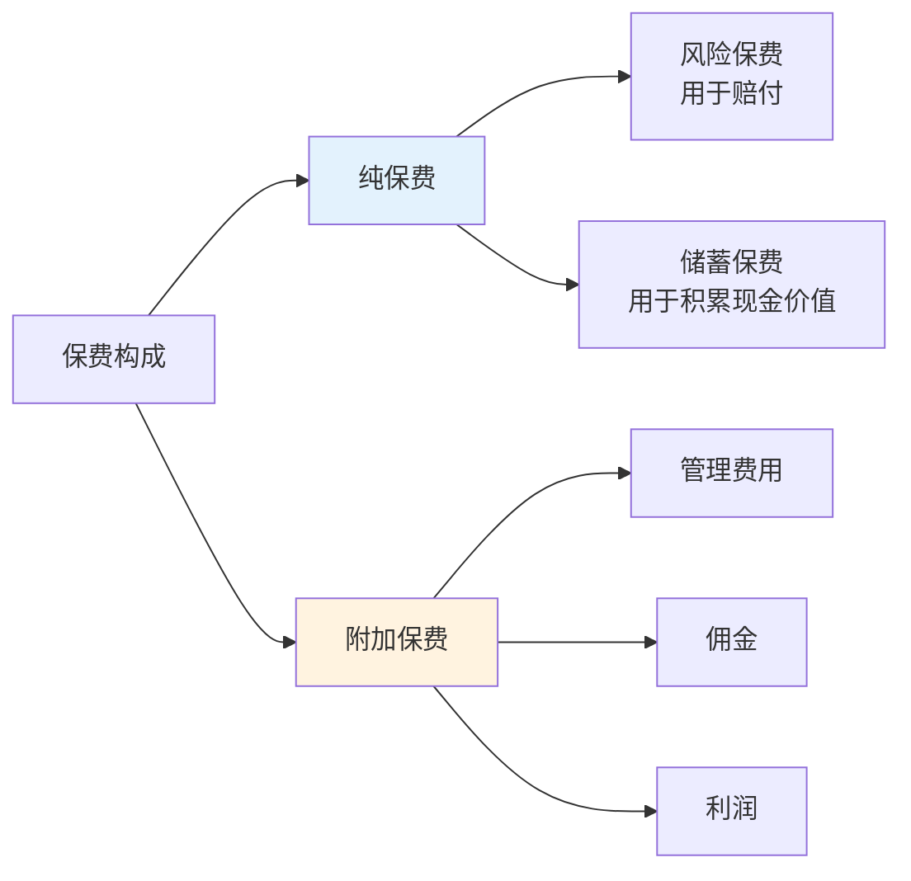
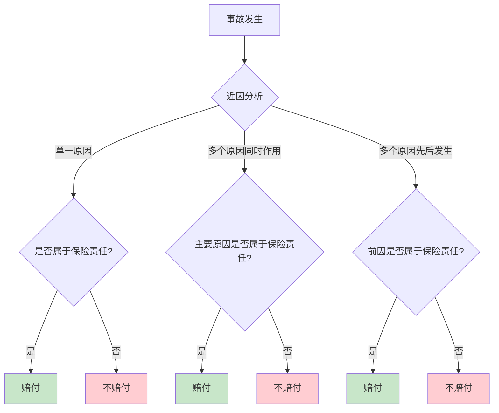
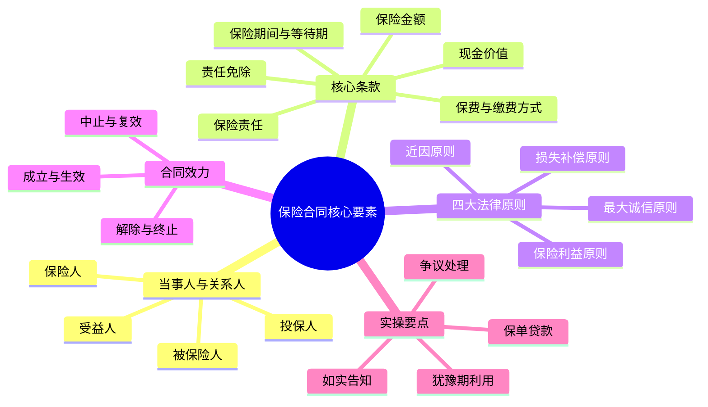

## 四、保险合同的核心要素

保险合同是你与保险公司之间的法律契约，它决定了你在什么情况下能获得赔偿、能获得多少赔偿、以及哪些情况不在保障范围内。**看不懂合同就买保险，等于在一份你不理解的协议上签字——出了问题才发现"不赔"，往往为时已晚。**

本节将从合同当事人、核心条款、法律原则、合同效力四个维度，系统拆解保险合同的每一个关键要素。

### 4.1 保险合同的当事人与关系人

保险合同涉及多方主体，每一方都有明确的权利义务。搞清楚"谁是谁"是读懂合同的第一步。

#### 4.1.1 三大核心主体

| 主体 | 定义 | 权利 | 义务 |
|------|------|------|------|
| **保险人**（保险公司） | 承担保险责任的一方 | 收取保费、调查核实 | 按合同约定给付保险金 |
| **投保人** | 与保险人签订合同、支付保费的人 | 指定受益人、解除合同、变更合同 | 如实告知、按时缴费、通知变更 |
| **被保险人** | 受保险合同保障的人 | 请求赔偿、知情权 | 配合调查、防损义务 |

#### 4.1.2 受益人——最容易被忽视的关键角色

受益人是保险事故发生后有权领取保险金的人。这个角色只存在于**人身保险**中（财产保险没有受益人的概念）。

**受益人的指定规则**：

- **指定受益人**：投保人/被保险人可以指定一人或多人为受益人，并明确受益份额和顺序
- **法定受益人**：未指定受益人时，保险金作为被保险人的遗产，按《民法典》继承顺序分配
- **变更受益人**：投保人/被保险人可以随时变更受益人，但需书面通知保险公司

**为什么要指定受益人？** 这是一个极其重要的实操问题：

| 对比项 | 指定受益人 | 法定受益人 |
|--------|-----------|-----------|
| 领取速度 | 快，通常1-2周 | 慢，可能数月（需所有继承人到场） |
| 所需材料 | 仅受益人身份证明 | 所有法定继承人的身份证明、关系证明、继承权公证书 |
| 家庭纠纷风险 | 低 | 高（婆媳矛盾、兄弟争产等） |
| 债务隔离 | 保险金不属于遗产，不受被保险人债务追偿 | 可能被认定为遗产，需先偿还债务 |
| 税务影响 | 目前无遗产税，但未来政策不确定 | 同左，但作为遗产更容易被纳入征税范围 |

**关键提醒**：指定受益人时写全名+身份证号+与被保险人关系，仅写"妻子""孩子"等模糊称呼可能在理赔时引发争议。受益人可以指定多人并设定份额，例如"配偶张某某（身份证号XXX）60%，儿子李某某（身份证号XXX）40%"。

#### 4.1.3 投保人与被保险人的关系

投保人和被保险人可以是同一人（自己给自己买），也可以是不同人（给别人买），但必须满足一个前提条件——**保险利益**（详见4.3节）。

常见组合场景：

- **自己给自己买**：投保人=被保险人，最简单的形式
- **配偶互保**：夫妻各为对方的投保人
- **父母为子女投保**：投保人为父母，被保险人为未成年子女
- **企业为员工投保**：投保人为企业，被保险人为员工（团体保险）
- **子女为父母投保**：投保人为成年子女，被保险人为父母

**注意**：为他人投保以死亡为给付条件的保险（如寿险），必须经被保险人**书面同意并认可保险金额**，否则合同无效。这是防止道德风险的重要制度设计。

### 4.2 保险合同的核心条款拆解

保险合同通常由以下几个部分组成：保险条款、投保单、保险单、批单、特别约定。以下逐一拆解其中最核心的条款。

#### 4.2.1 保险责任条款——"保什么"

保险责任条款是合同的核心，明确规定了保险公司在什么情况下承担赔付责任。

**重疾险的保险责任示例**：

```text
本合同的保险责任包括：
（一）重大疾病保险金：被保险人经医院确诊初次发生本合同约定的重大疾病
      （无论一种或多种），本公司按本合同基本保险金额给付重大疾病保险金，
      本合同终止。
（二）轻症疾病保险金：被保险人经医院确诊初次发生本合同约定的轻症疾病
      （无论一种或多种），本公司按本合同基本保险金额的30%给付轻症疾病
      保险金，本合同继续有效。
（三）身故保险金：被保险人身故，本公司按本合同已交保险费给付身故保险金，
      本合同终止。
```

**阅读要点**：

1. **触发条件**：是"确诊即赔"还是"达到某种状态才赔"或"实施某种手术才赔"？重疾险的28种法定重疾中，确诊即赔的只有3种（恶性肿瘤-重度、严重Ⅲ度烧伤、严重原发性肺动脉高压），其余大多需要达到约定状态或实施约定手术
2. **赔付金额**：是按保额赔付还是按比例赔付？多次赔付的间隔期是多久？
3. **赔付后合同状态**：赔付后合同是终止还是继续有效？继续有效的话是否豁免后续保费？

#### 4.2.2 责任免除条款——"不保什么"

责任免除条款（俗称"免责条款"）规定了保险公司不承担赔付责任的情形。**这是理赔纠纷的重灾区，必须逐字阅读。**

**常见的责任免除类型**：

| 免责类型 | 具体情形 | 是否合理 | 说明 |
|----------|---------|---------|------|
| **故意行为** | 投保人/被保险人故意杀害、伤害被保险人 | 合理 | 防止道德风险，国际通行 |
| **犯罪行为** | 被保险人故意犯罪或抗拒依法采取的刑事强制措施 | 合理 | 法律基本原则 |
| **自杀条款** | 合同成立2年内自杀 | 合理 | 2年后自杀通常可赔，体现对精神疾病的人文关怀 |
| **战争暴乱** | 战争、军事冲突、暴乱或武装叛乱 | 合理 | 不可抗力 |
| **既往病症** | 投保前已存在的疾病 | 需具体看 | 如实告知后可能除外或加费承保 |
| **等待期内** | 等待期内发生的疾病 | 合理 | 通常90-180天，防止带病投保 |
| **高危活动** | 跳伞、攀岩、潜水等 | 需具体看 | 意外险常见免责，重疾险通常不除外 |
| **酒驾/无证驾驶** | 醉酒驾驶、无合法有效驾驶证驾驶 | 合理 | 违法行为 |
| **医疗美容** | 整形手术、美容治疗 | 需具体看 | 医疗险常见免责 |
| **不孕不育治疗** | 辅助生殖技术相关费用 | 需具体看 | 医疗险常见免责 |

**关键法律保障**：根据《保险法》第十七条，保险公司对免责条款必须做到**明确说明**，未作提示或者明确说明的，该条款**不产生效力**。实务中，如果保险公司在投保时没有让你签署免责条款确认书，或者没有用足以引起注意的方式（加粗、加大字号等）标注免责条款，在理赔纠纷中法院通常会作出有利于被保险人的解释。

**实操建议**：拿到合同后第一时间翻到"责任免除"部分，重点看以下几项：
1. 你最担心的风险是否被除外
2. 你已有的健康问题是否被除外
3. 你的职业或生活方式是否触发免责

#### 4.2.3 保险金额与保险价值

**保险金额**（简称"保额"）是保险公司承担赔偿或给付保险金责任的最高限额，也是你投保时选择的数字。它直接决定了出险时你能拿到多少钱。

**保险价值**是保险标的的实际价值，主要出现在财产保险中。保险金额不能超过保险价值（否则是超额保险，超出部分无效）。

人身保险中不存在"保险价值"的概念——人的生命和健康无法用金钱衡量，保额完全由投保人和保险公司约定。

**保额确定的几种方式**：

| 方式 | 适用险种 | 说明 |
|------|---------|------|
| 定值保险 | 财产险（特殊） | 投保时约定保险价值，理赔时不再重新评估 |
| 不定值保险 | 财产险（一般） | 出险时才确定保险价值，按实际损失赔付 |
| 约定保额 | 人身险 | 双方约定固定金额，出险时按约定赔付 |
| 比例赔付 | 财产险 | 保额不足时按比例赔付（保额/保险价值×损失） |

**比例赔付的陷阱**：如果你的房屋实际价值100万，但你只投保了50万，发生30万损失时，保险公司不是赔30万，而是赔 50÷100×30=15万。这就是"不足额投保"的后果。

#### 4.2.4 保险期间与等待期

**保险期间**是合同的有效期限，决定了保障的时间跨度。

不同险种的保险期间差异很大：

| 险种 | 常见保险期间 | 特点 |
|------|------------|------|
| 意外险 | 1年 | 逐年续保，无等待期 |
| 医疗险 | 1年 | 逐年续保，有等待期（通常30天） |
| 定期重疾 | 20年/30年/至60岁/至70岁 | 固定期限，有等待期（通常90-180天） |
| 终身重疾 | 终身 | 保一辈子，有等待期 |
| 定期寿险 | 10年/20年/30年/至60岁 | 固定期限，通常无等待期 |
| 终身寿险 | 终身 | 保一辈子，兼具储蓄功能 |
| 年金险 | 终身 | 活多久领多久 |

**等待期**（又称"观察期"）是合同生效后的一段时间内，即使发生保险事故，保险公司也不赔付。设置等待期的目的是防止**逆选择**——已经感觉身体不适的人突击投保。

- 重疾险等待期：通常90天或180天
- 医疗险等待期：通常30天
- 意外险：一般无等待期（意外不可预见）
- 寿险：通常90天或无等待期

**等待期内出险的处理方式**：

| 处理方式 | 含义 | 对投保人的影响 |
|----------|------|--------------|
| 合同终止，退还保费 | 最严格 | 保障归零，已有的健康异常可能导致无法重新投保 |
| 该疾病除外，合同继续 | 较宽松 | 该病不赔，但其他保障不受影响 |
| 合同终止，不退保费 | 最差 | 保障归零，保费也打了水漂 |

**选购建议**：同等条件下，优先选择等待期处理方式更宽松的产品。比如两款重疾险其他条件相似，一款等待期内出险合同终止退保费，另一款仅该疾病除外合同继续，应选后者。

#### 4.2.5 保费与缴费方式

**保费**是你为获得保障所支付的对价。保费的计算基于精算模型，主要考虑以下因素：



**缴费方式的选择**：

| 缴费方式 | 说明 | 适用场景 |
|----------|------|---------|
| **趸交**（一次性缴清） | 一次性支付全部保费 | 手头资金充裕，希望简化手续 |
| **年缴** | 每年缴纳一次 | 最常见的方式，费率适中 |
| **半年缴** | 每半年缴纳一次 | 分摊缴费压力 |
| **季缴** | 每季度缴纳一次 | 进一步分摊 |
| **月缴** | 每月缴纳一次 | 现金流紧张时选择，总保费略高 |

**缴费期限的选择**（针对长期险）：

| 缴费期限 | 优点 | 缺点 |
|----------|------|------|
| 趸交 | 总保费最低 | 一次性支出大，失去保费豁免的意义 |
| 10年交 | 总保费较低 | 年缴压力较大 |
| 20年交 | 平衡点，推荐 | 总保费略高于趸交 |
| 30年交 | 年缴压力最小，豁免杠杆最大 | 总保费最高 |

**保费豁免**是长期险的重要功能：在缴费期内，如果投保人或被保险人发生合同约定的轻症/中症/重疾/身故/全残，后续未缴的保费全部免除，保障继续有效。缴费期限越长，保费豁免的杠杆价值越大。

**建议**：重疾险、寿险等长期险，优先选择**20年或30年缴费期限**，最大化保费豁免的杠杆效应。

#### 4.2.6 现金价值——保单的"隐藏资产"

现金价值是长期人身保险合同中，保单在某一时刻所具有的价值。简单说，就是你退保时能拿回的钱。

**现金价值的构成**：

现金价值 = 已交保费 - 保险公司的管理费用分摊 - 佣金分摊 - 已承担的保险责任成本 + 剩余保费所产生的利息

**现金价值的用途远不止退保**：

| 功能 | 说明 | 实操要点 |
|------|------|---------|
| **退保** | 解除合同，拿回现金价值 | 前几年退保损失巨大，可能只拿回已交保费的10%-30% |
| **保单贷款** | 以现金价值为质押向保险公司借款 | 通常可贷现金价值的80%，利率约5%-6%，不影响保障 |
| **自动垫交** | 未按时缴费时，保险公司自动用现金价值垫交保费 | 避免保单失效，但会消耗现金价值 |
| **减额交清** | 不再缴费，用现金价值一次性交清，保额相应降低 | 适合不想继续缴费但也不想退保的情况 |
| **展期定期** | 用现金价值转为保额不变的定期寿险 | 适合重疾险，把保障期限缩短但保额不减 |

**现金价值曲线的典型走势**：


**关键认知**：前几年退保是最亏的，因为大部分保费已经作为佣金支付给了销售人员和公司的管理费用。如果你买的保险确实不合适，也要算清楚"沉没成本"——已经交出去的钱拿不回来了，但未来的钱应该投向更合适的产品。

### 4.3 保险合同的四大法律原则

保险合同的运作建立在四大法律原则之上，理解这些原则能帮你从根本上理解"为什么有些情况赔，有些情况不赔"。

#### 4.3.1 最大诚信原则

最大诚信原则（Utmost Good Faith）是保险法最核心的原则，要求合同双方在订立和履行合同过程中，必须以最大的诚意如实告知对方一切重要事实。

**对投保人的要求——如实告知**：

投保时，保险公司会通过健康问卷（告知事项）了解你的健康状况。根据《保险法》第十六条：

- 投保人**故意**不如实告知的，保险人有权解除合同，且不退还保费
- 投保人因**重大过失**未如实告知的，保险人有权解除合同，但应退还保费
- 保险人自合同成立之日起**超过2年**的，不得解除合同；发生保险事故的，应当承担赔偿责任（"两年不可抗辩"条款）

**如实告知的原则**：

1. **问什么答什么**：没问到的不需要主动告知
2. **如实回答**：不隐瞒、不夸大、不编造
3. **以医学记录为准**：自己的主观感觉不算，以医院的诊断记录为依据
4. **不知道的不算隐瞒**：如果确实不知道自己有某疾病，不构成隐瞒

**常见告知误区**：

| 误区 | 真相 |
|------|------|
| "几年前体检有个小异常，应该没事吧" | 体检异常必须如实告知，保险公司会核保评估 |
| "我有乙肝小三阳，但肝功能正常，不用告知" | 必须告知，乙肝携带者通常可以投保，只是可能加费或除外 |
| "我有抑郁症病史，但已经好了，不用说" | 精神类疾病史必须告知，通常会被除外或拒保 |
| "投保时没问到，我就不用说了" | 正确，问什么答什么，没问的不需要主动补充 |

**"两年不可抗辩"的正确理解**：

很多人误解这个条款，以为"撑过两年就没事了"。实际上：
- 两年不可抗辩保护的是**因重大过失**未如实告知的情况
- **故意隐瞒**重大事实（如已确诊癌症后投保），法院可能不适用两年不可抗辩
- 该条款不适用于投保时保险事故已经发生的情况
- 保险公司在投保时已经知道你未如实告知但仍然承保的，不得解除合同

**最佳实践**：如实告知是对自己最有利的策略。隐瞒告知看似省事，但理赔时被查出来（保险公司可以调取所有医疗记录），不仅拿不到赔偿，保费也白交了。

#### 4.3.2 保险利益原则

保险利益原则要求投保人在投保时对被保险人必须具有保险利益，即投保人因保险标的的存在而获得利益，因其受损而遭受损失。

**为什么要存在保险利益？**

- **防止赌博**：没有保险利益的保险合同本质上就是赌博
- **防止道德风险**：如果可以为任何人投保，可能诱发故意制造保险事故的行为
- **限制赔偿范围**：赔偿金额不得超过保险利益的范围

**人身保险中的保险利益**（《保险法》第三十一条）：

投保人对下列人员具有保险利益：
1. **本人**
2. **配偶、子女、父母**
3. 与投保人有抚养、赡养或者扶养关系的家庭其他成员、近亲属
4. 与投保人有劳动关系的劳动者（企业为员工投保）
5. 被保险人同意投保人为其订立合同的，视为具有保险利益

**关键区别**：

- **人身保险**：保险利益只需在**投保时**存在。比如夫妻在婚姻存续期间投保，后来离婚了，保单仍然有效
- **财产保险**：保险利益必须在**保险事故发生时**存在。比如你把房子卖了，原来的房屋保险对你就不再有效

#### 4.3.3 近因原则

近因原则（Proximate Cause）是理赔判定的核心原则：保险公司只对**近因**（最直接、最有效的原因）属于保险责任范围内的事故负责赔付。

**什么是"近因"？**

近因不是指时间上最接近的原因，而是指**在导致损失的过程中起主导作用、最直接有效的原因**。

**近因判定的几种典型场景**：

| 场景 | 近因 | 是否赔付 |
|------|------|---------|
| 被保险人因车祸受伤，送医后感染败血症死亡 | 车祸（意外） | 意外险赔付 |
| 被保险人患有心脏病，在运动中突发心梗死亡 | 心脏病（疾病） | 意外险不赔，寿险赔 |
| 暴风雨导致树木倒塌，砸坏房屋 | 暴风雨（自然灾害） | 家财险赔付 |
| 被保险人酒后驾车身亡 | 酒驾（违法行为） | 意外险不赔（免责条款） |
| 被保险人因抑郁症自杀（合同成立满2年后） | 疾病 | 寿险赔付 |

**多因一果的处理规则**：



#### 4.3.4 损失补偿原则

损失补偿原则主要适用于**财产保险**和**费用补偿型保险**（如医疗险），核心思想是：被保险人获得的赔偿不得超过其实际损失，不能通过保险获利。

**损失补偿原则的三层含义**：

1. **有损失才有补偿**：没有实际损失，不能获得赔偿
2. **损失多少补偿多少**：赔偿以实际损失为限，不能超过
3. **补偿以保险金额为限**：即使实际损失超过保额，也只赔保额

**损失补偿原则的具体体现**：

| 制度 | 含义 | 示例 |
|------|------|------|
| **比例赔付** | 不足额投保时按比例赔付 | 房屋100万，投保50万，损失30万，赔15万 |
| **免赔额** | 损失低于免赔额不赔 | 医疗险1万免赔额，住院花了8000元不赔 |
| **赔偿限额** | 每次或累计的最高赔付金额 | 医疗险保额200万，住院花了300万只赔200万 |
| **代位求偿** | 赔偿后保险公司获得向第三方追偿的权利 | 车被别人撞了，保险公司赔你后向肇事者追偿 |
| **重复保险分摊** | 多份保险的赔偿总额不超过实际损失 | 买了两份家财险，损失10万，两份合计最多赔10万 |

**重要例外——定额给付型保险**：

重疾险、寿险、意外伤害险（身故/伤残部分）属于**定额给付型**，不适用损失补偿原则。买了多少保额就赔多少，与实际损失无关。

这意味着你可以同时购买多份重疾险，确诊后每份都赔。例如买了A公司30万和B公司50万重疾险，确诊重疾后可以获赔80万。医疗险则不同，多份医疗险不能重复报销同一笔费用。

### 4.4 保险合同的效力与生命周期

#### 4.4.1 合同的成立与生效

| 阶段 | 时点 | 条件 |
|------|------|------|
| **合同成立** | 保险公司同意承保并签发保单 | 双方就合同条款达成一致 |
| **合同生效** | 合同约定的生效日（通常是缴费日或次日零时） | 投保人缴纳首期保费+保险公司同意承保 |

**可能影响合同效力的因素**：

- **年龄不实**：投保人申报的年龄不真实，且真实年龄不符合合同约定的年龄限制的，保险人可以解除合同
- **无保险利益**：投保时投保人对被保险人不具有保险利益的，合同无效
- **未经被保险人同意**：以死亡为给付条件的保险，未经被保险人书面同意并认可保险金额的，合同无效
- **恶意串通**：投保人与保险公司恶意串通损害他人利益的，合同无效

#### 4.4.2 合同的中止与复效

**合同中止**：分期缴费的保险合同，投保人自保险人催告之日起超过30日未支付当期保费，或者超过约定的期限60日未支付当期保费的，合同效力中止。

**合同中止期间**：保障暂停，发生保险事故保险公司不赔。

**合同复效**：合同中止后2年内，投保人可以申请复效（恢复合同效力）。复效需要：
1. 补缴欠缴的保费及利息
2. 重新进行健康告知（这是关键！如果中止期间健康状况恶化，可能无法复效）
3. 保险公司审核同意

**超过2年未复效**：保险人有权解除合同，退还保单的现金价值。

**实操建议**：千万不要让保单失效。如果确实缴费困难，优先考虑以下方案：
1. 利用保单贷款功能垫交保费
2. 申请减额交清
3. 降低保额减少保费
4. 实在不行主动退保，拿回现金价值

#### 4.4.3 合同的解除

**投保人解除（退保）**：

投保人可以随时解除合同，这是法律赋予的权利。退保后退还的是**现金价值**（不是已交保费），前几年退保损失很大。

| 退保时点 | 退还金额 | 损失程度 |
|----------|---------|---------|
| 犹豫期内（10-20天） | 全额退还保费（扣除工本费约10元） | 几乎无损失 |
| 第1年 | 约5%-15%已交保费 | 损失85%-95% |
| 第3年 | 约20%-30%已交保费 | 损失70%-80% |
| 第10年 | 约60%-70%已交保费 | 损失30%-40% |
| 缴费期满后 | 逐渐超过已交保费 | 无损失或有收益 |

**保险公司解除合同的法定情形**：

保险公司不能随意解除合同，只有在以下法定情形下才能解除：

1. 投保人故意或因重大过失未履行如实告知义务
2. 被保险人或受益人谎称发生了保险事故
3. 投保人、被保险人故意制造保险事故
4. 投保人申报的被保险人年龄不真实且超出承保范围

**两年不可抗辩的限制**：合同成立超过2年的，保险公司不得以未如实告知为由解除合同。

#### 4.4.4 合同的终止

保险合同终止的情形包括：

| 终止情形 | 说明 | 后果 |
|----------|------|------|
| **保险期间届满** | 合同约定的保障期间结束 | 合同自然终止 |
| **保险金已给付** | 保险公司已按合同赔付 | 合同终止（多次赔付型除外） |
| **投保人解除合同** | 退保 | 退还现金价值 |
| **保险公司解除合同** | 法定解除权 | 退还现金价值或保费（视情形） |
| **被保险人死亡** | 以被保险人生存为条件的保险 | 合同终止，可能退还现金价值 |

### 4.5 保险合同中的"隐藏条款"——你必须注意的细节

#### 4.5.1 犹豫期条款

犹豫期（也叫"冷静期"）是你签收保单后的一段时间内，可以无条件全额退保的期限。

- **期限**：长期人身保险通常为15天（银行渠道为15天，其他渠道各地规定略有不同）
- **权利**：犹豫期内退保，保险公司扣除不超过10元工本费后，退还全部已交保费
- **意义**：给你一个"后悔药"，拿到合同后仔细阅读，不满意可以无损失退保

**建议**：收到保单后第一时间通读全文，尤其是保险责任、责任免除、犹豫期等关键条款。如果有疑问，立即联系保险公司或经纪人，不要拖到犹豫期过后。

#### 4.5.2 如实告知的范围和标准

保险公司的健康问卷通常包含以下几类问题：

1. **过去是否被保险公司拒保、延期、加费或除外承保？**
2. **过去X年内是否住院、手术或被医生建议住院/手术？**
3. **目前或曾经是否患有以下疾病：**（列出一长串疾病清单）
4. **过去X年内是否有以下检查异常：**（血常规、尿常规、肝功能、肾功能、影像学检查等）
5. **女性被保险人是否怀孕？是否有妊娠并发症？**
6. **被保险人的身高和体重？**
7. **是否有吸烟/饮酒习惯？**

**告知的黄金法则**：问什么答什么，以医学记录为准，不知道的不算隐瞒。

#### 4.5.3 保单贷款条款

大部分长期人身保险（终身寿险、终身重疾险、年金险等）都有保单贷款功能。

| 项目 | 内容 |
|------|------|
| 贷款额度 | 现金价值的80% |
| 贷款利率 | 约4.5%-6%（各公司不同） |
| 贷款期限 | 通常6个月，可续贷 |
| 对保障的影响 | 不影响，保障继续有效 |
| 还款方式 | 到期一次性还本付息 |
| 逾期后果 | 贷款本息超过现金价值时，合同终止 |

**保单贷款的价值**：在急需资金时，保单贷款是一种低成本的融资方式，比信用贷利率低，而且不需要征信审批，不影响保单保障。

#### 4.5.4 争议处理条款

保险合同中通常约定争议解决方式：

1. **协商**：与保险公司直接沟通
2. **调解**：向保险行业协会或人民调解委员会申请调解
3. **仲裁**：向合同约定的仲裁机构申请仲裁
4. **诉讼**：向人民法院提起诉讼

**法律保护**：根据《保险法》第三十条，对合同条款有两种以上解释的，人民法院或仲裁机构应当作出有利于被保险人和受益人的解释。这被称为"不利解释原则"或"疑义利益归于被保险人"原则。

### 4.6 保险合同的实操检查清单

拿到一份保险合同后，建议按以下清单逐项检查：

**第一层：基本信息核对**

- [ ] 投保人、被保险人姓名和身份证号是否正确
- [ ] 受益人是否指定（未指定则为法定受益人）
- [ ] 保险金额是否与投保时约定的一致
- [ ] 保险期间是否正确
- [ ] 缴费方式和缴费期限是否正确
- [ ] 等待期天数是否与产品介绍一致

**第二层：核心条款确认**

- [ ] 保险责任是否覆盖你最关心的风险
- [ ] 责任免除是否有哪些你特别在意的条款
- [ ] 轻症/中症/重疾的疾病定义是否符合预期
- [ ] 等待期内出险的处理方式是否可以接受
- [ ] 是否有保费豁免条款，豁免条件是什么

**第三层：附加条款和特别约定**

- [ ] 是否有附加险，附加险的保障内容和费率
- [ ] 是否有特别约定（批单优先于正文）
- [ ] 是否有自动续保/保证续保条款（医疗险关键）
- [ ] 免赔额和赔付比例（医疗险关键）

**第四层：服务和权益**

- [ ] 犹豫期天数
- [ ] 保单贷款利率
- [ ] 理赔报案电话和流程
- [ ] 客户服务电话
- [ ] 合同送达地址和联系方式变更方式

### 4.7 常见误区与纠正

**误区一："合同都一样，不用看"**

纠正：不同产品、不同公司的合同条款差异巨大。同一险种，有的产品等待期90天，有的180天；有的等待期内出险退保费，有的只除外该疾病；有的轻症赔付3次，有的只赔1次。不看合同就是对自己的钱不负责。

**误区二："保险销售说的都算数"**

纠正：口头承诺不具有法律效力，一切以合同条款为准。销售人员的演示、话术、PPT都不能作为理赔依据。如果销售人员的描述与合同条款不一致，以合同条款为准。

**误区三："两年不可抗辩就是挡箭牌"**

纠正：两年不可抗辩条款保护的是因重大过失未如实告知的情况，不保护故意隐瞒。而且如果隐瞒的事实属于足以影响承保决定的重大事项（如已确诊癌症后投保），法院可能不支持适用该条款。

**误区四："买了保险就什么都保"**

纠正：每份保险合同都有明确的保障范围和免责条款。重疾险只保合同约定的疾病，医疗险有免赔额和报销范围限制，意外险只保意外不保疾病。没有一份保险能"包打天下"。

**误区五："保险合同是保险公司说了算"**

纠正：保险合同受到《保险法》《民法典》《消费者权益保护法》等多重法律保护。当合同条款有歧义时，法律要求作出有利于被保险人的解释。保险公司单方面不合理的免责条款可能被法院认定无效。

### 4.8 进阶：保险合同的精算逻辑

理解保险合同背后的精算原理，能帮助你更理性地看待保费、保额和产品设计。

#### 4.8.1 保费定价的三要素

| 要素 | 含义 | 影响 |
|------|------|------|
| **预定发生率** | 预计保险事故发生的概率 | 基于生命表、疾病发生率表等精算数据 |
| **预定利率** | 保险公司对资金运用的预期回报率 | 利率越高，保费越低（2024年后上限为2.5%） |
| **预定费用率** | 保险公司运营成本的预期比例 | 包括管理费、佣金、税金等 |

**预定利率对保费的影响**：预定利率每下降0.5%，重疾险保费可能上涨10%-20%。这就是为什么近年来利率下行环境下，重疾险越来越贵。

#### 4.8.2 等待期的精算设计

等待期不是保险公司"耍流氓"，而是对抗逆选择的必要机制。如果没有等待期，一个刚查出癌症的人可以立刻投保100万重疾险，次日申请理赔——这将导致保费对所有人大幅上涨。

等待期的存在，保护了正常投保人群的利益，使保费维持在合理水平。

#### 4.8.3 免赔额的精算逻辑

以百万医疗险为例，1万元免赔额的设定有其精算逻辑：

- 据统计，约60%-70%的住院费用在1万元以下
- 设置1万元免赔额可以剔除大量小额理赔，大幅降低保险公司的理赔成本
- 由此节省的成本使得百万医疗险的保费可以低至每年几百元
- 真正的大额医疗费用（超过1万的部分）才是保险的核心价值所在

**这并不是"坑"，而是一种高效的风险转移设计**——用1万元的自留风险换取几百万的保障杠杆，对大多数人来说是划算的。

### 4.9 本节总结



**一句话总结**：保险合同不是一张"买了就完事"的纸，而是一份你需要**读懂、核对、保管好**的法律文件。花30分钟认真读一遍合同，可能在未来帮你避免数万甚至数十万的损失。
