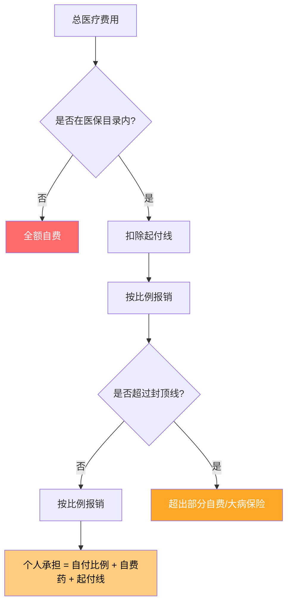
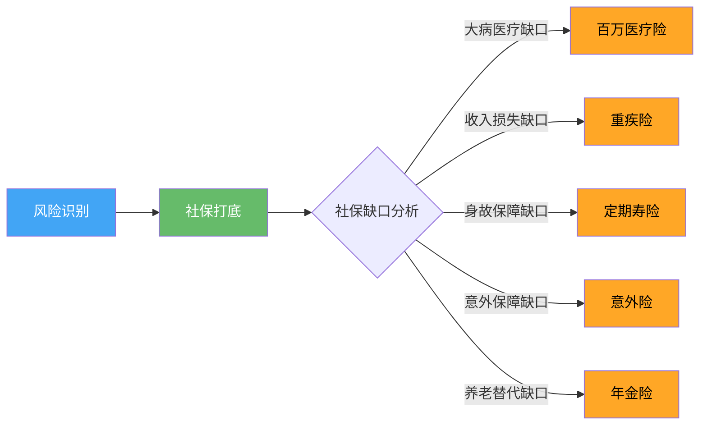
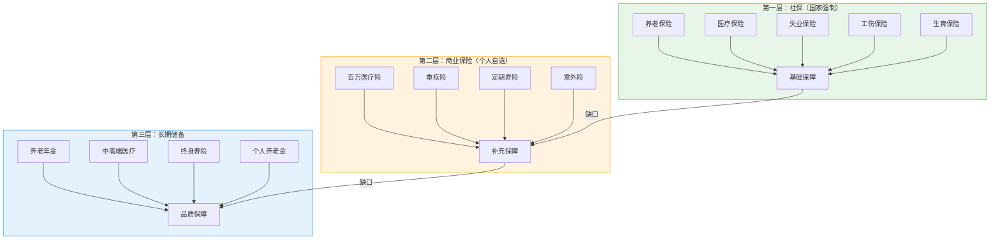

## 五、社保与商业保险的关系

社保是国家强制的"基础防护网"，商业保险是个人自选的"加固装甲"。两者不是替代关系，而是互补关系——社保解决"有没有"的问题，商业保险解决"够不够"的问题。搞不清楚这个底层逻辑，要么裸奔在风险中，要么花了冤枉钱买重了保障。

### 1. 社保体系全景：你到底交了什么

#### 1.1 五险一金的完整构成

中国的社会保险体系俗称"五险一金"，由用人单位和个人共同缴纳，具有强制性和普惠性。

| 险种 | 企业缴费比例 | 个人缴费比例 | 缴费基数 | 保障范围 |
|------|-------------|-------------|---------|---------|
| 养老保险 | 16% | 8% | 上年度月均工资（60%-300%社平工资） | 退休后按月领取养老金 |
| 医疗保险 | 6%-10%（各地不同） | 2% | 同上 | 门诊+住院医疗费用报销 |
| 失业保险 | 0.5%-1% | 0.2%-0.5% | 同上 | 失业期间领取失业金 |
| 工伤保险 | 0.2%-1.9%（行业风险等级） | 0 | 同上 | 工伤医疗+伤残津贴+工亡补助 |
| 生育保险 | 0.5%-1%（多地已并入医保） | 0 | 同上 | 产检+生育津贴+生育医疗 |
| 住房公积金 | 5%-12% | 5%-12% | 同上 | 购房贷款+租房提取 |

**实际案例：** 假设你在杭州工作，月薪 15,000 元，社保基数按实际工资计算（假设在上下限范围内）。每月社保个人缴纳约为：养老保险 1,200 + 医疗保险 300 + 失业保险 75 = 1,575 元；企业缴纳约为：养老 2,400 + 医疗 1,200 + 失业 112.5 + 工伤 45 + 生育 112.5 = 3,870 元。加上公积金（按 12%）个人 1,800 + 企业 1,800 = 3,600 元。这意味着你月薪 15,000，企业实际用工成本约 18,870 元。

#### 1.2 养老保险的运作机制

养老保险采用"统账结合"模式：企业缴纳的 16% 进入统筹账户（用于当期退休人员发放），个人缴纳的 8% 进入个人账户（退休后按月返还给你）。

**养老金计算公式：**

$$月养老金 = 基础养老金 + 个人账户养老金$$

- 基础养老金 = 退休时当地社平工资 × (1 + 本人平均缴费指数) / 2 × 缴费年限 × 1%
- 个人账户养老金 = 个人账户储存额 / 计发月数（60岁退休为139个月）

**具体测算：** 假设你在北京工作 35 年，平均缴费指数 1.0（即始终按社平工资缴费），2026 年退休时北京社平工资约 12,000 元/月，个人账户储存额约 40 万元。基础养老金 = 12,000 × (1+1) / 2 × 35% = 4,200 元；个人账户养老金 = 400,000 / 139 ≈ 2,878 元。合计约 7,078 元/月，替代率约 47%。

**关键认知：** 养老金替代率（退休金/退休前工资）国际公认合理水平为 70%-80%，而我国社保养老金替代率仅 40%-50%。这意味着仅靠社保退休，你的生活水平将下降一半。这个缺口就是商业养老保险存在的根本原因。

#### 1.3 医疗保险的报销逻辑

医保报销遵循一个复杂的分层结构，很多人交了多年医保却搞不清楚自己到底能报多少。

**职工医保报销的基本框架（以住院为例）：**

**典型报销比例（职工医保住院，各地有差异）：**

| 医院等级 | 起付线 | 报销比例 | 说明 |
|---------|--------|---------|------|
| 一级医院 | 200-500元 | 90%-97% | 社区医院、乡镇卫生院 |
| 二级医院 | 500-800元 | 85%-92% | 区县级医院 |
| 三级医院 | 800-1500元 | 80%-88% | 省市级大医院 |
| 异地就医 | 各地不同 | 降低5%-15% | 需提前备案 |

**实际报销率远低于名义比例。** 以一个真实住院案例说明：某患者在三级医院住院，总费用 12 万元。其中医保目录外费用（进口器材、自费药、特需病房）3.2 万元，起付线 1,300 元，目录内费用 8.67 万元按 85% 报销。实际报销 = 8.67 × 85% = 7.37 万元，实际报销率 = 7.37 / 12 = 61.4%。自付 4.63 万元。如果用的是更多进口药和自费器材，实际报销率可能低至 40%-50%。

**医保三大目录的限制：**

- **药品目录：** 2024版国家医保药品目录收录约3,088种药品，而市场上药品总数超20万种。很多疗效好但价格高的进口药、靶向药、免疫治疗药不在目录内。
- **诊疗项目目录：** 高端检查（如PET-CT、基因检测）、部分手术材料不在报销范围。
- **医疗服务设施目录：** 特需病房、国际部、单人间等不报销。

### 2. 商业保险的分类与定位

#### 2.1 商业保险的五大类型

商业保险按保障功能可以分为五大类，每一类解决不同的风险缺口：

| 类型 | 主要产品 | 核心功能 | 与社保的关系 |
|------|---------|---------|-------------|
| 重疾险 | 重大疾病保险 | 确诊即赔，覆盖收入损失 | 社保不覆盖收入损失，重疾险补这个缺口 |
| 医疗险 | 百万医疗、中高端医疗 | 报销社保外的医疗费用 | 覆盖医保目录外用药、起付线、自付比例 |
| 寿险 | 定期寿险、终身寿险 | 身故/全残赔付 | 社保仅退个人账户余额+丧葬费，远不够 |
| 意外险 | 意外伤害+意外医疗 | 意外伤残分级赔付+医疗报销 | 社保工伤保险范围窄，意外险覆盖全天候 |
| 年金险 | 教育年金、养老年金 | 定期领取，补充养老金 | 养老金替代率不足，年金险做长期现金流补充 |

#### 2.2 每类保险的深层逻辑

**重疾险：** 核心价值不是"治病"，而是"养病"。一个人确诊癌症后，治疗期通常 1-3 年，期间无法正常工作。重疾险一次性赔付的 30-50 万，用于覆盖：治疗期间的收入损失、康复期的生活费、房贷车贷等刚性支出、异地就医的交通住宿费。这恰恰是社保完全不覆盖的领域。

**医疗险：** 与社保医保形成"二次报销"关系。以百万医疗险为例，通常设定 1 万元免赔额，超过部分 100% 报销（含社保外用药），年度限额 200-600 万。社保报销后的剩余部分，扣除 1 万免赔，由百万医疗承担。两者叠加后，一场大病的实际自付通常不超过 2-3 万元。

**寿险：** 定期寿险是"留爱不留债"的工具。30 岁男性，保至 60 岁，保额 100 万，年保费仅 1,000-1,500 元。如果不幸身故，社保只退还养老保险个人账户余额（可能只有几万到十几万）加少量丧葬费，而家庭的房贷（可能 200-500 万）和未来生活开支完全无法覆盖。

**意外险：** 性价比最高的商业保险。100-300 元/年即可获得 50-100 万意外身故/伤残保障和 1-5 万意外医疗报销。社保的工伤保险仅覆盖"工作时间、工作场所、因工作原因"的意外，通勤途中的交通事故、周末运动受伤、旅行意外等都不在工伤范围内。

**年金险：** 对标的是社保养老金替代率不足的缺口。以养老年金为例，35 岁开始每年存入 5 万元，存 20 年共 100 万，60 岁起每月可领取约 5,000-6,000 元（保证领取 20 年），与社保养老金叠加后可将替代率提升至 70%-80% 的合理水平。

### 3. 社保与商业保险的核心差异

#### 3.1 六维对比分析

| 维度 | 社保 | 商业保险 |
|------|------|---------|
| **性质** | 国家强制，社会福利性质 | 自愿购买，合同契约关系 |
| **费用** | 企业+个人共担，费率由国家规定 | 个人全额承担，费率由精算定价 |
| **门槛** | 无健康要求，带病可参保 | 有健康告知，可能被拒保或加费 |
| **保障范围** | 基础保障，有目录限制 | 高度灵活，可覆盖社保外费用 |
| **保障水平** | 有封顶线，替代率有限 | 保额自选，理论上无上限 |
| **长期性** | 终身有效（养老/医保缴满年限） | 保障期限灵活（1年/20年/终身） |

#### 3.2 最关键的差异：健康门槛

这是很多人忽略的维度，也是最容易让人后悔的维度。

社保是零门槛的——你可以高血压、糖尿病、甚至已经确诊癌症，社保都不会拒绝你参保。但商业保险有严格的健康告知：

- 高血压二级以上（收缩压≥160mmHg），多数重疾险拒保
- 乙肝小三阳，部分医疗险加费或除外肝脏疾病
- 甲状腺结节 TI-RADS 3 级以上，甲状腺癌可能除外
- BMI 超过 30，寿险和重疾险可能加费
- 5 年内有住院记录，需要详细告知并可能被除外

**这意味着：** 越早买商业保险，身体越健康，选择越多、保费越低。很多人等到体检发现问题后才想到买保险，往往已经买不了或者买不起了。社保永远在那里，但商业保险的大门随时可能关闭。

#### 3.3 赔付逻辑的本质差异

社保是"报销制"——你花了多少钱，按比例给你报，绝不会多给你一分。商业保险则是多种赔付模式并存：

- **报销型（医疗险）：** 与社保类似，实报实销，但可覆盖社保外费用
- **给付型（重疾险/寿险）：** 达到条件就赔约定金额，不管你实际花了多少。确诊癌症赔 50 万，你花 10 万治好也赔 50 万，花 80 万没治好也赔 50 万
- **津贴型（住院津贴）：** 按天给付，与实际费用无关。住一天院补 300 元

这三种模式与社保的纯报销制形成了互补：社保报销医疗费用，重疾险覆盖收入损失和非医疗支出，津贴险补偿住院期间的隐性成本（护工费、营养费等）。

### 4. 黄金搭配策略：不同人群的最优方案

#### 4.1 搭配的底层原则

**核心逻辑：社保是地基，商业保险是在地基上根据缺口建房子。** 地基不牢就直接盖楼（不交社保只买商业险）是本末倒置；只有地基不盖楼（只交社保不买商业险）则是保障严重不足。

#### 4.2 按人生阶段配置

**阶段一：刚毕业（22-26岁）—— 预算有限，优先级配置**

社保是入职即有的基础保障，商业保险优先配置：
1. 意外险（100-300元/年）—— 杠杆率最高，必备
2. 百万医疗险（200-400元/年）—— 覆盖大病高额医疗费
3. 定期寿险（暂不需要）—— 此阶段通常无房贷和家庭责任

年预算约 500-700 元，获得 100 万+ 的意外和医疗保障。

**阶段二：成家立业（27-35岁）—— 全面配置**

组建家庭后，风险承受能力下降，保障需求上升：
1. 意外险（300元/年）—— 提升保额至 100 万
2. 百万医疗险（300-500元/年）—— 家庭经济支柱必备
3. 重疾险（5,000-8,000元/年）—— 保额 30-50 万，覆盖 3-5 年收入
4. 定期寿险（1,000-2,000元/年）—— 保额覆盖房贷+5年家庭支出

年预算约 7,000-11,000 元，占家庭收入 5%-8%。

**阶段三：中年压力期（36-50岁）—— 加固保障**

上有老下有小，房贷压力最大，保障不能断：
1. 以上四类继续持有，关注续保条件
2. 补充养老年金险 —— 社保养老金替代率不足，提前储备
3. 考虑中端医疗险 —— 覆盖特需部/国际部，避免排长队

年预算可提升至 15,000-30,000 元。

**阶段四：临退休期（50-60岁）—— 精简优化**

重疾险保费已经很贵甚至买不到了，策略调整为：
1. 百万医疗险（如果还能续保就继续）或防癌医疗险（健康告知宽松）
2. 意外险（老年版，关注骨折保障）
3. 减少不必要的重疾险缴费，用已有保单维持
4. 年金险开始进入领取期

#### 4.3 按收入水平配置

| 月收入 | 社保状态 | 商业保险建议 | 年保费预算 | 重点 |
|--------|---------|-------------|-----------|------|
| 5,000以下 | 灵活就业/居民社保 | 意外险+百万医疗 | 500-800元 | 保大不保小 |
| 5,000-10,000 | 职工社保 | +定期寿险 | 2,000-5,000元 | 覆盖负债风险 |
| 10,000-20,000 | 职工社保 | +重疾险 | 8,000-15,000元 | 全面保障 |
| 20,000-50,000 | 职工社保 | +中端医疗+年金 | 15,000-30,000元 | 品质保障+养老储备 |
| 50,000以上 | 职工社保 | +高端医疗+终身寿+年金 | 50,000-200,000元 | 资产传承+税务优化 |

### 5. 社保断缴与商保的联动影响

#### 5.1 社保断缴的具体后果

社保断缴不是"白交了"那么简单，不同险种受影响程度差异巨大：

| 险种 | 断缴影响 | 恢复方式 |
|------|---------|---------|
| 养老保险 | 不清零，累计计算，断缴月份缺失影响退休金 | 续缴即可，可补缴（有滞纳金） |
| 医疗保险 | 断缴次月起无法报销，连续缴满年限可能清零 | 续缴后通常有 3-6 个月等待期 |
| 生育保险 | 连续缴满 12 个月才能享受生育待遇 | 需重新连续缴满 |
| 失业保险 | 累计计算，影响不大 | 续缴即可 |
| 工伤保险 | 断缴期间出事不赔 | 企业责任，续缴即恢复 |
| 公积金 | 影响贷款额度（需连续缴满 6-12 个月） | 续缴后重新计算连续月数 |

#### 5.2 社保断缴时商业保险能否补位

这是很多人关心的现实问题。答案是：部分可以，但有局限。

- **百万医疗险：** 可以完全替代医保的住院报销功能，但大多数百万医疗险在有社保和无社保时的保费和报销比例不同。无社保版本保费通常贵 60%-100%，且如果投保时选择"有社保"但实际断缴，报销比例会从 100% 降至 60%。
- **重疾险：** 与社保无直接关系，确诊即赔，不受社保断缴影响。
- **意外险：** 意外医疗部分可能受社保状态影响（有些产品要求先经社保报销才给 100% 报销），意外身故/伤残赔付不受影响。
- **寿险：** 完全独立于社保，不受影响。

**实操建议：** 如果社保断缴不可避免（如辞职创业、自由职业期），优先确保百万医疗险的续保不受影响，及时通知保险公司社保状态变更，或直接选择"无社保"版本投保。

### 6. 自由职业者和灵活就业者的特殊策略

#### 6.1 灵活就业社保 vs 居民社保

自由职业者面临的第一个选择是：以灵活就业身份参加职工社保，还是参加居民社保？

| 维度 | 灵活就业职工社保 | 城乡居民社保 |
|------|-----------------|-------------|
| 缴费基数 | 社平工资的60%-300% | 固定档次（几百到几千元/年） |
| 养老缴费比例 | 20%（全部自付） | 固定金额 |
| 医保待遇 | 与职工医保相同 | 低于职工医保，报销比例低5%-15% |
| 退休金水平 | 较高（与职工一致） | 较低（基础养老金+个人账户） |
| 年缴费金额 | 约 1-3 万元（各地不同） | 约 500-5,000 元 |
| 适合人群 | 收入稳定、计划长期自雇 | 收入不稳、预算有限 |

#### 6.2 灵活就业者的商业保险配置重点

自由职业者没有企业缴纳部分，社保成本全部自担，因此配置策略需要调整：

1. **优先配置百万医疗险** —— 没有企业医保的高额报销做后盾，一场大病可能直接破产
2. **重疾险保额要充足** —— 自由职业者没有病假工资和工伤待遇，收入中断风险更大
3. **意外险选择含猝死责任的** —— 自由职业者经常高强度工作，且无法认定工伤
4. **考虑失能收入保险** —— 国内此类产品较少，但可以通过重疾险+医疗险组合部分覆盖

### 7. 常见误区深度解析

#### 误区一："有社保就够了，不需要商业保险"

**纠正：** 社保是"保基本"，不是"保全面"。一场重大疾病的总成本远不止医疗费用：

| 费用项目 | 社保覆盖情况 | 典型金额 |
|---------|-------------|---------|
| 手术+住院+药费 | 部分报销（50%-70%） | 10-50万 |
| 进口药/靶向药 | 不报销 | 5-30万/年 |
| 收入损失（治疗+康复期1-3年） | 不覆盖 | 15-60万 |
| 异地就医交通住宿 | 不覆盖 | 2-5万 |
| 护工/营养/康复 | 不覆盖 | 3-10万 |
| 家庭生活刚性支出（房贷等） | 不覆盖 | 持续支出 |

社保能解决的只是第一行中的一部分，其余全部需要自费或商业保险覆盖。

#### 误区二："买了很多商业保险就不需要社保了"

**纠正：** 社保具有商业保险无法替代的独特优势：

- **终身续保无条件：** 医保不会因为你生病了就拒绝续保，百万医疗险停售就没了
- **无等待期限制：** 社保参保即可享受（有连续缴费要求），商业保险通常有 30-180 天等待期
- **既往症可保：** 社保不问健康状况，商业保险对已有疾病除外或拒保
- **养老金终身领取：** 社保养老金活多久领多久，商业年金险通常有保证领取年限
- **企业缴费补贴：** 企业承担 70% 左右的社保费用，这是实实在在的隐形收入

#### 误区三："社保报销比例 85%，百万医疗 1 万免赔额太高用不上"

**纠正：** 百万医疗险的核心价值不在于日常小病，而在于防范灾难性医疗支出。考虑这个场景：某人确诊白血病，骨髓移植总费用 80 万。社保报销 40 万（50%），剩余 40 万中扣除 1 万免赔，百万医疗报销 39 万。个人实际承担 1 万元。没有百万医疗险，自付 40 万足以掏空一个普通家庭的全部积蓄。

1 万元免赔额的设计恰恰是精算平衡的结果——排除小额理赔后，保费才能降到普通人都能承受的 200-500 元/年。

#### 误区四："商业保险理赔很困难，都是骗人的"

**纠正：** 2024年保险行业理赔数据显示，主要寿险公司的理赔获赔率均在 97% 以上，平均理赔时效 1-2 天（小额案件可做到秒赔）。理赔被拒的三大原因：

1. **未如实告知健康状况** —— 占拒赔案例的 60% 以上。投保时隐瞒既往病史，出险后必然被拒
2. **不在保障范围内** —— 如买了意外险却因疾病住院，买了医疗险却因美容整形申请理赔
3. **等待期内出险** —— 重疾险通常有 90-180 天等待期，期间确诊不赔

#### 误区五："返还型保险比消费型更划算"

**纠正：** 这是销售话术的经典陷阱。以 30 岁男性重疾险 50 万保额为例：

| 类型 | 年缴保费 | 缴费期 | 总保费 | 保障 |
|------|---------|--------|--------|------|
| 消费型重疾险 | 4,500元 | 30年 | 135,000元 | 保至70岁，不返还 |
| 返还型重疾险 | 9,800元 | 20年 | 196,000元 | 保至70岁，满期返还已交保费 |

返还型多交了 61,000 元，40 年后返还 196,000 元。如果把差额 5,300元/年投入年化 3.5% 的理财，40 年后本息约 43 万——远超返还金额。返还型保险的本质是"你多交钱，保险公司拿去投资，到期还给你本金"，而且还不给你收益。

### 8. 高阶话题：政策趋势与未来展望

#### 8.1 社保改革方向

- **延迟退休：** 渐进式延迟法定退休年龄已在推进，男性从 60 岁逐步延至 63 岁，女性从 50/55 岁逐步延至 55/58 岁。这意味着你需要更长时间缴纳社保，也需要更早规划养老储备
- **医保个人账户改革：** 门诊共济制度实施后，单位缴纳部分不再划入个人账户，全部进入统筹。个人账户"缩水"但门诊报销范围扩大
- **长期护理保险试点：** 应对老龄化，已在 49 个城市试点，未来可能成为"第六险"
- **个人养老金制度：** 每年 12,000 元额度，享受税收优惠，可投资指定金融产品

#### 8.2 商业保险创新趋势

- **惠民保（城市定制型商业医疗险）：** 由政府指导、保险公司承保，保费 50-200 元/年，可报销社保外部分费用，无健康告知，不限年龄。适合买不了百万医疗险的人群（老年人、既往症患者）
- **税优健康险：** 享受个人所得税优惠（每年 2,400 元税前扣除），可带病投保
- **长期医疗险：** 保证续保 20 年的百万医疗险出现，解决了短期医疗险停售风险
- **惠民保+百万医疗的组合：** 惠民保先报销社保外部分，百万医疗再报销剩余，实现更低自付

### 9. 实操清单：立刻能做的事

#### 9.1 检查你的社保状态

1. 登录"国家社会保险公共服务平台"（si.12333.gov.cn）或当地社保APP，查询缴费记录
2. 确认是否有断缴月份，如有尽快补缴
3. 查询医保个人账户余额和报销记录
4. 确认养老保险累计缴费年限（15年为最低门槛，但缴得越多退休金越高）

#### 9.2 盘点你的商业保险缺口

用这个表格逐项自查：

| 保障项目 | 你需要的保额 | 社保能覆盖多少 | 缺口是多少 | 是否有商业保险 | 行动 |
|---------|-------------|---------------|-----------|--------------|------|
| 重大疾病 | 年收入×3-5年 | 0（不覆盖收入损失） | 全额缺口 | 有/无 | 补充重疾险 |
| 住院医疗 | 实际医疗费用 | 50%-70% | 30%-50% | 有/无 | 补充百万医疗 |
| 身故保障 | 房贷+5年支出 | 近乎为0 | 全额缺口 | 有/无 | 补充定期寿险 |
| 意外伤残 | 年收入×10-20年 | 工伤范围窄 | 大部分缺口 | 有/无 | 补充意外险 |
| 养老储备 | 退休前收入×70% | 40%-50% | 20%-30% | 有/无 | 补充养老年金 |

#### 9.3 行动优先级

按紧迫程度排序：

1. **立即做：** 确认社保无断缴，配置意外险（当天可生效）
2. **一周内做：** 配置百万医疗险（次日生效，等待期30天）
3. **一个月内做：** 评估重疾险和定期寿险需求，对比产品
4. **半年内做：** 完成全面保障方案，考虑养老年金规划

### 10. 总结：一张图看懂社保与商保的关系

**记住这个公式：**

> 完整保障 = 社保（打底） + 商业保险（补缺） + 长期储备（提质）

社保是地板，不是天花板。社保给你一个不会塌到底的安全网，商业保险把网织密，长期储备让你在安全网上还能过得体面。三者缺一不可，比例因人而异，但顺序不能乱——先确保社保不断缴，再配置基础商业保险，最后考虑长期储备和品质升级。
