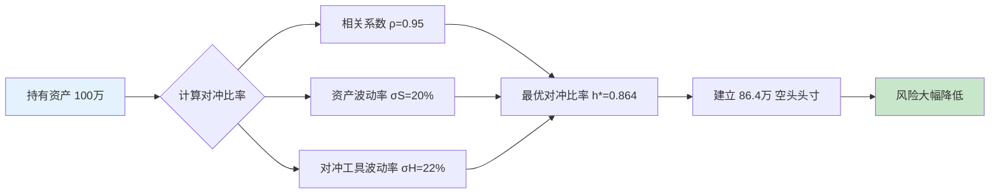
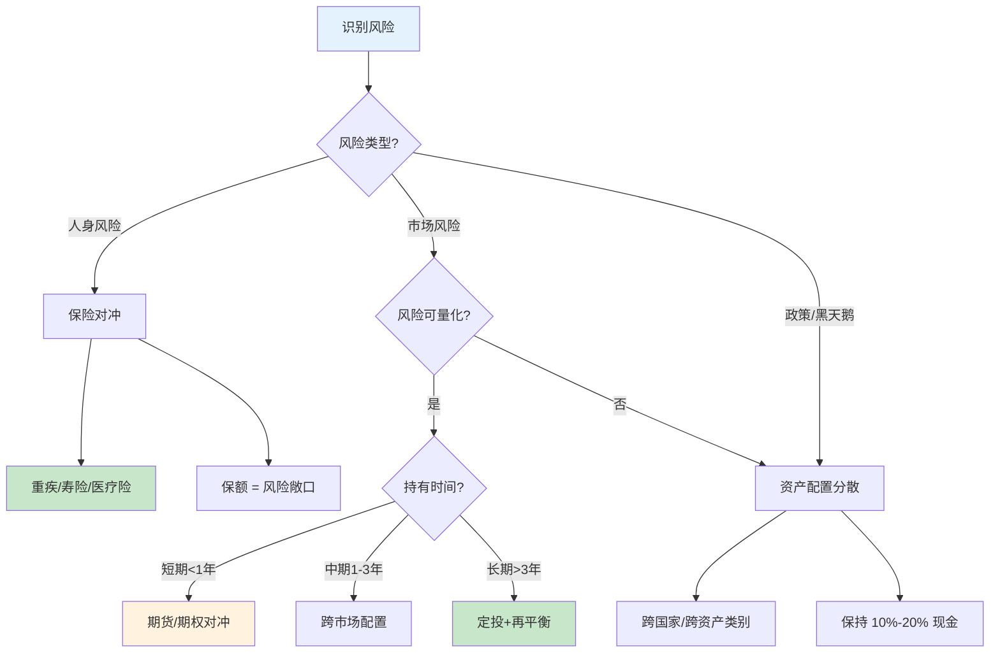

## 六、风险对冲基础

### 6.1 什么是风险对冲

风险对冲（Risk Hedging）是指通过建立一个与已有风险方向相反的头寸，使两者相互抵消，从而降低或消除潜在损失的策略。与"风险转移"（购买保险把风险卖给保险公司）不同，对冲的核心是**在自身资产组合内部构建反向关系**，让一个资产的损失被另一个资产的收益所弥补。

用一个最直观的例子说明：你持有一套市值 300 万的房产，担心房价下跌。你可以同时做空与房价挂钩的资产（如 REITs 或房产指数基金），这样即使房价真的跌了，做空头寸的盈利可以弥补房产贬值的损失——这就是对冲。

**对冲与保险的区别**：

| 维度 | 风险对冲 | 保险 |
|------|---------|------|
| 核心机制 | 建立反向头寸，收益与损失对冲 | 支付保费，出险时获得赔付 |
| 成本结构 | 持有成本（资金占用、对冲工具费用） | 固定保费（纯消费型） |
| 适用场景 | 可量化、可对标的市场风险 | 不可预测的人身风险、巨灾风险 |
| 赔付确定性 | 对冲收益与损失近似等额 | 赔付金额取决于合同条款 |
| 典型工具 | 期货、期权、反向 ETF、外汇远期 | 重疾险、寿险、医疗险、财产险 |
| 适合人群 | 有投资经验、持有大额资产者 | 所有人，尤其是家庭经济支柱 |

理解这个区别至关重要：**保险解决的是"小概率、大损失"的灾难性风险，对冲解决的是"大概率、可量化"的市场性风险**。两者不是替代关系，而是互补关系。

### 6.2 风险对冲的经济学原理

#### 6.2.1 负相关性原理

对冲能够生效的根本前提是：两个资产之间存在**负相关性**（Negative Correlation）。当资产 A 的价格下跌时，资产 B 的价格倾向于上涨，两者形成"跷跷板"效应。

相关系数（Correlation Coefficient）是衡量两个资产联动性的核心指标：

$$r = \frac{\sum_{i=1}^{n}(X_i - \bar{X})(Y_i - \bar{Y})}{\sqrt{\sum_{i=1}^{n}(X_i - \bar{X})^2 \cdot \sum_{i=1}^{n}(Y_i - \bar{Y})^2}}$$

- r = +1：完全正相关，同涨同跌，无法对冲
- r = 0：不相关，对冲效果弱
- r = -1：完全负相关，理想对冲状态

**实际应用中的关键认知**：在真实市场中，几乎找不到 r = -1 的完美对冲组合。多数有效的对冲组合相关系数在 -0.3 到 -0.7 之间，这意味着对冲只能**降低**风险而非**消除**风险。

#### 6.2.2 分散化定理（马科维茨理论）

哈里·马科维茨（Harry Markowitz）1952 年提出的现代投资组合理论（MPT）是风险对冲的理论基石。其核心公式：

$$\sigma_p^2 = w_1^2\sigma_1^2 + w_2^2\sigma_2^2 + 2w_1w_2\rho_{12}\sigma_1\sigma_2$$

其中 $\sigma_p$ 是组合风险，$w$ 是权重，$\rho$ 是相关系数。

这个公式揭示了一个反直觉的事实：**即使每个资产本身的风险不变，只要它们之间的相关性足够低，组合的整体风险就能显著降低**。这正是"不要把鸡蛋放在一个篮子里"背后的数学原理。

#### 6.2.3 对冲比率（Hedge Ratio）

对冲比率决定了需要用多大的反向头寸来对冲现有风险：

$$h^* = \rho \cdot \frac{\sigma_S}{\sigma_H}$$

其中 $\sigma_S$ 是被对冲资产的波动率，$\sigma_H$ 是对冲工具的波动率，$\rho$ 是两者相关系数。

**实例**：你持有 100 万元沪深 300 指数基金（年化波动率 20%），用沪深 300 股指期货（年化波动率 22%）对冲，两者相关系数 0.95：

$$h^* = 0.95 \times \frac{20\%}{22\%} \approx 0.864$$

即需要持有价值约 86.4 万元的空头期货合约来对冲。这就是**最优对冲比率**——不是简单地 1:1 对冲，而是根据波动率差异和相关性精确计算。



### 6.3 个人可运用的六大对冲策略

#### 6.3.1 资产配置对冲（最基础、最重要）

这是普通人最应该掌握的对冲策略，不需要任何衍生品工具，只需通过**合理的资产配置**就能实现风险对冲效果。

**核心资产对冲矩阵**：

| 资产类别 | 经济繁荣 | 经济衰退 | 通胀上升 | 通缩环境 |
|---------|---------|---------|---------|---------|
| 股票 | ↑ 涨 | ↓ 跌 | → 中性 | ↓ 跌 |
| 债券 | → 中性 | ↑ 涨 | ↓ 跌 | ↑ 涨 |
| 黄金 | → 中性 | ↑ 涨 | ↑ 涨 | → 中性 |
| 现金/货基 | → 中性 | → 中性 | ↓ 贬值 | ↑ 升值 |
| 房产 | ↑ 涨 | ↓ 跌 | ↑ 涨 | ↓ 跌 |

从表中可以看出：
- **股票 vs 债券**：经济繁荣时股票涨、债券平；经济衰退时股票跌、债券涨。这是最经典的对冲组合。
- **股票 vs 黄金**：危机时刻股票暴跌、黄金上涨（避险属性）。
- **债券 vs 通胀资产（黄金/TIPS）**：通胀侵蚀债券实际收益，但黄金在通胀期表现优异。

**实操配置框架**：

根据风险偏好，给出三组经过回测验证的对冲型配置方案：

**保守型（年化波动率 5%-8%）**：
- 国债/政金债基金：50%
- 沪深 300 指数基金：20%
- 黄金 ETF：15%
- 货币基金/存款：15%

**平衡型（年化波动率 10%-15%）**：
- 沪深 300 指数基金：35%
- 中证全债指数基金：30%
- 黄金 ETF：15%
- 海外指数基金（如标普 500 QDII）：10%
- 货币基金：10%

**进取型（年化波动率 15%-20%）**：
- A 股宽基指数基金：40%
- 港股/美股 QDII：20%
- 中证全债指数基金：15%
- 黄金 ETF：15%
- 现金：10%

**关键细节**：资产配置对冲不是"买了就不管"。需要每半年或每年做一次**再平衡（Rebalancing）**——当某类资产涨太多导致占比偏离目标时，卖出一部分、买入占比偏低的资产。再平衡本身就是在执行"低买高卖"，是维持对冲效果的必要操作。

#### 6.3.2 股债对冲（经典 60/40 策略的演进）

"60% 股票 + 40% 债券"是全球最经典的对冲型投资组合，由诺贝尔经济学奖得主威廉·夏普推广。其原理简单：股票提供长期收益，债券在股市暴跌时充当缓冲器。

**历史回测数据（美国市场 1926-2023）**：

| 组合 | 年化收益 | 最大回撤 | 夏普比率 |
|------|---------|---------|---------|
| 100% 股票 | 10.2% | -51% | 0.42 |
| 60/40 股债 | 8.7% | -22% | 0.58 |
| 100% 债券 | 5.1% | -3% | 0.36 |

60/40 组合的年化收益仅比全股票少 1.5%，但最大回撤减少了一半以上，夏普比率（风险调整后收益）显著更高。这就是对冲的价值：**用少许收益换取大幅降低的风险**。

**A 股市场的特殊性**：中国股债相关性在某些时期会短暂同向（如 2022 年股债双杀），纯粹的股债对冲效果不如欧美稳定。解决方案是加入第三类资产——黄金或大宗商品，形成"三资产对冲"。

#### 6.3.3 跨市场/跨币种对冲

持有单一国家资产面临系统性风险（政策变化、经济周期、汇率波动）。跨市场配置可以对冲"单一国家风险"。

**具体方式**：
- **QDII 基金**：通过公募基金投资海外股票/债券/房地产，门槛低（100 元起），适合普通投资者
- **港股通**：直接投资港股，与 A 股形成互补（港股估值逻辑不同，相关性约 0.5-0.7）
- **外币存款/理财**：持有美元、日元等外币资产，对冲人民币贬值风险

**汇率对冲的实操考虑**：如果你持有大量人民币计价资产（房产、A 股、存款），适当配置一些美元资产（如美元债基金或标普 500 QDII）可以在人民币贬值时起到保护作用。反之亦然。建议海外资产占比控制在总资产的 10%-30%。

#### 6.3.4 行业/风格对冲

在股票投资层面，不同行业和风格之间也存在对冲关系：

| 对冲组合 | 逻辑 |
|---------|------|
| 周期股 vs 防御股 | 经济上行时周期股（有色、化工、机械）领涨，下行时防御股（医药、公用事业、必选消费）抗跌 |
| 大盘股 vs 小盘股 | 市场流动性充裕时小盘股表现好，收紧时大盘股更稳 |
| 成长股 vs 价值股 | 利率下行时成长股受益，利率上行时价值股更抗压 |
| 国内 vs 出口导向 | 人民币升值利好进口型企业，贬值利好出口型企业 |

**实操建议**：不要把全部仓位押在同一行业或风格上。即使你非常看好某个板块，也应该配置 20%-30% 的对冲型仓位，防止单一风格长期失效（如 2021-2023 年成长股持续跑输价值股）。

#### 6.3.5 保险作为对冲工具

保险本质上也是一种风险对冲机制——用确定的小额支出（保费）对冲不确定的巨额损失。在个人风险管理中，以下保险产品具有明确的对冲属性：

- **重疾险**：对冲"因重大疾病导致收入中断"的风险。确诊即赔的特性使其可以覆盖治疗费用之外的收入损失、康复费用等隐性成本。
- **定期寿险**：对冲"家庭经济支柱身故"的风险。保额应覆盖房贷余额 + 子女教育金 + 5-10 年家庭生活费。
- **医疗险（百万医疗）**：对冲"大额医疗支出"的风险。与重疾险互补——重疾险管收入损失，医疗险管治疗费用。
- **财产险**：对冲房屋、车辆等实物资产的意外损失。家财险每年仅 100-300 元，但可覆盖数十万的房屋损失。

**保险对冲 vs 投资对冲的本质区别**：投资对冲是"用资产 A 的收益弥补资产 B 的损失"，金额大致对等；保险对冲是"用小额保费换取大额赔付"，具有高杠杆特性。一场大病花费 50 万，但你可能只交了 3 万保费——这种杠杆是任何投资对冲都做不到的。

#### 6.3.6 时间维度对冲（定投策略）

定期定额投资本身就是一种时间维度的对冲策略。通过在不同时间点均匀买入，你自动实现了"价格高时少买、价格低时多买"的效果，降低了择时风险。

**数学原理**：假设定投某基金，第一个月净值 1 元买了 1000 份，第二个月跌到 0.5 元买了 2000 份。两个月投入 2000 元，持有 3000 份，均价 0.67 元——低于两个月的算术平均价 0.75 元。这就是定投的"反脆弱"特性：**下跌反而有利于长期收益**。

**定投的对冲效果增强技巧**：
- **估值定投**：PE 百分位低于 30% 时加倍投入，高于 70% 时减半或暂停
- **目标市值法**：设定每月目标持仓市值，低于目标时补仓，高于时减仓
- **股债搭配定投**：同时定投股票型和债券型基金，市场下跌时自动实现股债再平衡

### 6.4 风险对冲的决策框架

在实际操作中，面对一个具体的风险，如何决定用哪种对冲方式？下面给出一个系统化的决策流程：



**决策要点速查**：

| 风险场景 | 推荐对冲方式 | 成本 | 复杂度 |
|---------|------------|------|--------|
| 家庭经济支柱重病/身故 | 重疾险 + 定期寿险 | 年收入 5%-8% | 低 |
| 股市系统性下跌 | 股债配置 + 黄金 | 资金占用 | 低 |
| 人民币贬值 | QDII + 美元资产 | 汇率差价 | 中 |
| 持仓个股暴跌 | 分散持仓 + 股指期货 | 资金占用 + 保证金 | 高 |
| 房价下跌 | 不做对冲（流动性差）| — | — |
| 通胀侵蚀购买力 | 黄金 + TIPS + 房产 | 资金占用 | 低 |

### 6.5 对冲的成本与代价

天下没有免费的午餐，对冲同样有成本。理解这些成本才能做出理性决策。

#### 6.5.1 直接成本

- **保费成本**：纯消费型，不返还。30 岁男性购买 50 万重疾险（保至 70 岁），年保费约 4000-6000 元，20 年总保费 8-12 万。
- **对冲工具费用**：期货有保证金占用和展期成本，期权有时间价值衰减，QDII 基金有管理费溢价（通常比国内基金高 0.3%-0.5%）。
- **再平衡交易成本**：每次调仓都有买卖手续费和可能的税费。

#### 6.5.2 机会成本

这是最容易被忽视的成本。对冲意味着你持有一部分"与主仓位方向相反"的资产，当主仓位大涨时，这部分对冲头寸会拖后腿。

以 2019 年 A 股牛市为例：沪深 300 上涨 36%，但如果你持有 60/40 股债组合，整体收益约 25%——比全仓股票少赚了 11 个百分点。这就是对冲的机会成本。

**如何看待机会成本**：不要用事后眼光评判事前决策。你在 2019 年少赚的 11%，换来的是 2022 年股债双杀时更小的回撤。对冲的价值不在于"每次都赚最多"，而在于"任何情况下都不会亏到无法翻身"。

#### 6.5.3 过度对冲的陷阱

对冲不是越多越好。过度对冲的典型表现：
- 股票仓位 50 万，却配了 50 万债券和 30 万货币基金——收益被严重稀释
- 每只股票都买了看跌期权——期权费用吃掉大部分收益
- 太多不相关资产导致组合变成"什么都有一点，什么都做不了"

**合理对冲的黄金法则**：对冲的目标是消除**不可承受的风险**，而非消除所有波动。如果你能承受 20% 的组合回撤，那就不需要把回撤对冲到 5%——那 15% 的额外对冲成本就是浪费。

### 6.6 常见误区与纠正

#### 误区一："分散投资就是对冲"

分散投资是风险对冲的必要条件，但不是充分条件。如果你买的 10 只基金全部是 A 股成长型基金，看似分散了，实际上高度同质化——市场下跌时全部一起跌。真正的对冲需要**跨资产类别、跨市场、跨风格**的分散。

**检验方法**：查看你的持仓基金的相关性。如果任意两只基金的净值走势几乎同步（相关系数 > 0.8），说明分散效果很差。很多第三方基金平台（如天天基金、蛋卷基金）提供组合分析功能，可以查看持仓相关性。

#### 误区二："对冲可以消除所有风险"

对冲只能应对**可量化、可预期**的市场风险，无法应对真正的黑天鹅事件。2020 年新冠疫情导致全球几乎所有资产同时下跌（股、债、黄金、商品全部暴跌），此时资产配置对冲基本失效。这类流动性危机需要靠**现金储备和保险**来兜底。

#### 误区三："普通人不需要对冲"

"我又不炒期货，需要什么对冲？"——这是对对冲最大的误解。资产配置本身就是对冲，买保险也是对冲，定投也是对冲。你不需要使用任何衍生品工具，只要做到以下三点，就已经在执行风险对冲：

1. 不把所有钱放在一种资产里（如全部存款或全部买房）
2. 给家庭经济支柱配齐保险
3. 定期投资而非一次性重仓

#### 误区四："黄金是最好的对冲工具"

黄金的避险属性被严重神话了。长期来看，黄金的实际年化收益仅 1%-2%（扣除通胀后），且在 1980-2000 年间整整跌了 20 年。黄金的对冲效果主要体现在**极端危机和高通胀时期**，不适合作为长期主力配置。合理占比为总资产的 5%-15%。

#### 误区五："对冲策略一成不变"

任何对冲策略都有其适用的市场环境。股债对冲在利率上行期效果变差（股债可能同跌），跨市场对冲在全球化退潮时相关性会上升（2022 年全球资产齐跌就是例证）。**每年至少审视一次**你的对冲策略是否仍然有效，根据宏观环境做适度调整。

### 6.7 实战案例：一个家庭的对冲方案

**背景**：张先生，35 岁，已婚，一个 3 岁孩子。家庭年收入 40 万，存款 100 万（全部在银行理财），有一套市值 300 万的房产（贷款 150 万）。妻子年收入 10 万。

**风险分析**：
- 房产占比过高（总资产 400 万中占 75%），高度集中
- 无任何保险保障，家庭经济支柱倒下则房贷断供
- 全部存款在银行理财，未做跨资产配置
- 无海外资产，单一市场风险

**对冲方案**：

| 对冲维度 | 当前状态 | 调整方案 | 预期效果 |
|---------|---------|---------|---------|
| 人身风险 | 零保险 | 张先生：重疾险 50 万 + 定期寿险 200 万 + 百万医疗；妻子：重疾险 30 万 + 百万医疗 | 对冲大病和身故导致的财务崩溃 |
| 资产集中风险 | 房产占比 75% | 不额外购房，用存款做跨资产配置 | 房产占比逐步降至 60% 以下 |
| 资产配置风险 | 100% 银行理财 | 40 万债基 + 30 万宽基指数 + 15 万黄金 ETF + 10 万 QDII + 5 万现金 | 多资产对冲，降低单一资产风险 |
| 单一市场风险 | 零海外资产 | 10 万 QDII（标普 500 + 纳斯达克 100） | 对冲 A 股单一市场风险 |
| 负债风险 | 150 万房贷 | 定期寿险保额覆盖贷款余额 | 对冲身故导致的房贷断供 |

**年度成本**：
- 保险保费：约 2.5 万/年（家庭年收入的 6.25%，在合理范围内）
- 对冲工具费用：QDII 管理费溢价约 500 元/年
- 再平衡交易成本：约 1000 元/年
- **总成本：约 2.65 万/年，换来的是一套覆盖人身、市场、汇率、负债的全方位风险对冲体系**

### 6.8 对冲效果的量化评估

如何判断你的对冲是否有效？以下是三个核心评估指标：

**1. 最大回撤（Maximum Drawdown）**

$$最大回撤 = \frac{峰值 - 谷值}{峰值} \times 100\%$$

对冲有效的组合，最大回撤应显著低于单一资产。例如，沪深 300 在 2022 年最大回撤 -23%，而 60/40 股债组合同期最大回撤约 -12%。

**2. 夏普比率（Sharpe Ratio）**

$$夏普比率 = \frac{R_p - R_f}{\sigma_p}$$

$R_p$ 是组合收益，$R_f$ 是无风险利率，$\sigma_p$ 是组合波动率。夏普比率越高，说明每承担一单位风险获得的收益越多。对冲的目标是**提高夏普比率而非简单降低波动**。

**3. 对冲有效性比率（Hedge Effectiveness）**

$$HE = 1 - \frac{\sigma_{对冲后组合}}{\sigma_{对冲前组合}}$$

HE 接近 1 说明对冲效果极好，接近 0 说明对冲无效。一般 HE > 0.5 即为有效对冲。

**实操建议**：使用 Excel 或 Python 跟踪你的组合指标。每月记录一次净值，计算滚动 12 个月的最大回撤和夏普比率，与基准（如纯沪深 300）对比，观察对冲是否在发挥作用。

```python
import numpy as np
import pandas as pd

# 示例：计算组合的对冲效果
def hedge_evaluation(returns_portfolio, returns_benchmark, rf=0.02):
    """评估对冲效果的三个核心指标"""
    # 最大回撤
    cum_returns = (1 + returns_portfolio).cumprod()
    running_max = cum_returns.cummax()
    drawdown = (cum_returns - running_max) / running_max
    max_dd = drawdown.min()
    
    # 夏普比率（年化）
    excess_return = returns_portfolio.mean() * 252 - rf
    volatility = returns_portfolio.std() * np.sqrt(252)
    sharpe = excess_return / volatility
    
    # 对冲有效性
    bench_vol = returns_benchmark.std() * np.sqrt(252)
    port_vol = volatility
    hedge_effectiveness = 1 - (port_vol / bench_vol)
    
    return {
        "最大回撤": f"{max_dd:.2%}",
        "年化夏普比率": f"{sharpe:.2f}",
        "对冲有效性": f"{hedge_effectiveness:.2%}",
        "组合波动率": f"{port_vol:.2%}",
        "基准波动率": f"{bench_vol:.2%}"
    }
```

### 6.9 进阶：动态对冲与风险预算

#### 6.9.1 动态对冲（Dynamic Hedging）

静态对冲是"设好就不管"，动态对冲则根据市场变化实时调整对冲头寸。当市场波动率上升时增加对冲比例，下降时减少对冲比例。

**波动率目标策略**（Volatility Targeting）：设定组合目标波动率为 10%。当实际波动率上升到 15% 时，将股票仓位从 60% 降至 40%（通过卖出股票或买入债券）；当波动率回落到 8% 时，将股票仓位升回 65%。

这种策略在 A 股市场的效果尤其显著，因为 A 股的波动率变化剧烈（牛市时波动率 15%-20%，熊市时可达 30%+）。

#### 6.9.2 风险预算（Risk Budgeting）

传统资产配置按**金额**分配权重（如 60% 股票 + 40% 债券），风险预算则按**风险贡献**分配。由于股票波动率是债券的 4-5 倍，60/40 金额配比下，股票贡献了组合 90% 以上的风险——本质上是一个"伪分散"组合。

**风险预算配比示例**（目标：股票和债券各贡献 50% 的组合风险）：

| 资产 | 金额权重 | 波动率 | 风险贡献 |
|------|---------|--------|---------|
| 股票 | 30% | 20% | 6% (50%) |
| 债券 | 70% | 4% | 2.8% (50%) |

按风险预算配置后，股票仅占 30% 的金额权重，但贡献了 50% 的风险——这才是真正的"风险分散"。

#### 6.9.3 尾部风险对冲

常规对冲应对的是"正常波动"，尾部风险对冲则针对"极端事件"（如 2008 金融危机、2020 疫情暴跌、2015 A 股熔断）。

**尾部对冲策略**：
- **持有现金缓冲**：始终保持 10%-20% 的现金，危机时用于抄底而非被迫割肉
- **购买深度虚值看跌期权**：成本极低（通常仅占组合的 0.5%-1%），但危机时可以获得数十倍回报。类似于"投资组合保险"——平时付出小成本，极端时刻获得大保护
- **趋势跟踪策略**：当资产价格跌破长期均线（如 200 日均线）时自动减仓，虽然会错过反弹初期，但能有效避开大级别下跌

### 6.10 本节要点回顾

风险对冲的核心逻辑可以用一句话概括：**不要赌单一结果，而是构建一个在多种情景下都不会崩溃的资产结构**。

关键要点：
1. 对冲与保险互补，不替代——人身风险靠保险，市场风险靠对冲
2. 资产配置对冲是最基础也最有效的策略，不需要衍生品工具
3. 对冲有成本（机会成本），目标是消除不可承受的风险而非所有波动
4. 每年至少审视一次对冲策略的有效性，根据宏观环境适度调整
5. 最大的对冲不是任何单一工具，而是"理性、纪律和长期视角"

***

