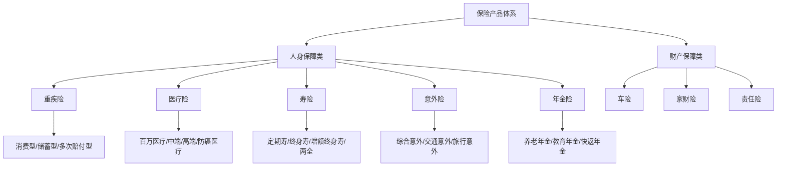
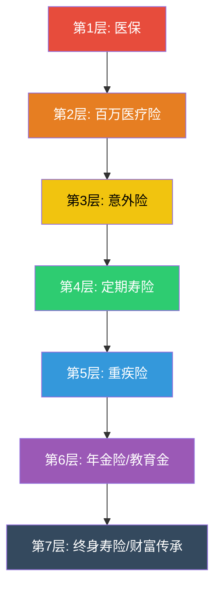
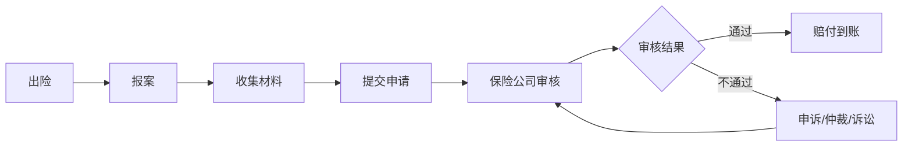

## 七、各类保险产品深度对比

保险产品种类繁多、条款复杂，普通消费者面对上百款产品往往无从下手。本章从**产品形态、费率结构、保障范围、理赔规则**四个维度，对市面上主流保险产品进行系统性深度对比，帮助你建立完整的保险产品认知框架，做出理性、高效的选购决策。

### 7.1 保险产品全景图

在逐一对比各类产品之前，先建立全局认知。保险产品按保障功能可分为**人身保障类**和**财产保障类**两大体系：



**各类保险的功能定位一句话总结**：

| 险种 | 核心功能 | 保障对象 | 给付方式 |
|------|----------|----------|----------|
| 重疾险 | 收入补偿 + 康复费用 | 被保险人 | 确诊即赔（定额给付） |
| 医疗险 | 医疗费用报销 | 被保险人 | 凭票报销（损失补偿） |
| 寿险 | 身故/全残保障 | 家人（受益人） | 身故给付（定额给付） |
| 意外险 | 意外伤害保障 | 被保险人/家人 | 按伤残等级给付 |
| 年金险 | 强制储蓄 + 稳定现金流 | 被保险人 | 按期领取（生存给付） |
| 车险 | 车辆损失 + 第三方责任 | 车主/受害者 | 凭票报销或定额 |
| 家财险 | 房屋及财产损失 | 房屋所有人 | 凭票报销（损失补偿） |

> 💡 **核心区分**：给付型保险（重疾、寿险、意外伤残）赔多少钱跟你花了多少钱无关，买多少保额就赔多少；报销型保险（医疗险、车损险）花多少报多少，不能重复获利。这个区别决定了你能不能在多家公司同时投保。

### 7.2 重疾险产品形态对比

重疾险是家庭保障的核心支柱，其产品形态直接影响保费和保障效果。

#### 7.2.1 四大产品形态对比

| 产品形态 | 特点 | 30岁男性50万保额年保费 | 适合人群 | 优缺点 |
|----------|------|------------------------|----------|--------|
| 消费型定期（保至70岁） | 纯保障，无返还 | 约2500-3500元 | 预算有限的年轻人 | ✅保费低、杠杆高 ❌到期无返还 |
| 消费型终身 | 纯保障，保终身 | 约4500-6000元 | 追求性价比的主力人群 | ✅终身保障、性价比高 ❌无现金价值 |
| 储蓄型终身（含身故责任） | 含身故赔付，有现金价值 | 约8000-12000元 | 预算充足、看重"返本"的人 | ✅身故也能赔 ❌保费贵、杠杆低 |
| 多次赔付型 | 重疾可赔付2-3次 | 约6000-10000元 | 担心多次患重疾的人 | ✅保障全面 ❌保费高、分组限制 |

**精算师视角**：从纯保障角度看，"消费型定期重疾险 + 自行投资差额"的组合，长期收益远高于储蓄型重疾险。以30岁男性为例：消费型重疾险年缴3000元，储蓄型年缴10000元，差额7000元/年如果按年化6%投资，30年后本息合计约56万，远超储蓄型重疾险的"返还"金额。

这个计算的底层逻辑是**机会成本**：你多交的7000元保费，本质上是借给保险公司去投资，而保险公司给你的"返还"收益率通常只有1.5%-2.5%，远低于你自己投资的收益。储蓄型重疾险的真正价值不是"返本"，而是**强制储蓄**和**身故保障的叠加**——如果你确定自己不会自律投资，储蓄型反而是更好的选择。

#### 7.2.2 多次赔付型重疾险的分组规则深度解析

多次赔付型重疾险分为"分组多次赔付"和"不分组多次赔付"两种：

| 类型 | 规则说明 | 实际理赔概率 | 保费差异 |
|------|----------|------------|----------|
| 分组多次赔付 | 6种高发重疾被分到不同组，同一组内只能赔一次 | 第二次理赔概率约15-20% | 比单次赔付贵约20-30% |
| 不分组多次赔付 | 所有重疾不分组，只要间隔期满（通常365天）即可再赔 | 第二次理赔概率约20-30% | 比单次赔付贵约40-60% |

**高频重疾分组示例**（某产品分组情况）：
- A组：恶性肿瘤（含白血病、淋巴瘤等）
- B组：急性心肌梗塞、冠状动脉搭桥术
- C组：脑中风后遗症、良性脑肿瘤
- D组：重大器官移植、终末期肾病
- E组：其他重疾

**分组是否合理的判断标准**：看高发重疾是否被分散到不同组。恶性肿瘤占重疾理赔的60%-70%，心脑血管疾病占20%-25%，这两大类必须分在不同组才有意义。如果某产品把恶性肿瘤和侵蚀性葡萄胎（同属肿瘤类）分在一组，而把其他低发疾病分在另一组，分组多次赔付的性价比就很低。

**癌症多次赔付的特殊条款**：部分产品对恶性肿瘤提供"二次赔付"，条件是两次确诊间隔满3年（含新发、复发、转移、持续）。这个条款非常实用——癌症5年复发率约为30%-50%，间隔3年的二次赔付能覆盖这个风险窗口。

> 💡 **选购建议**：预算有限选单次赔付（保额优先），预算充足选不分组多次赔付。分组多次赔付的性价比取决于分组是否合理——如果恶性肿瘤和心脑血管疾病分在不同组，分组多次赔付也有价值。

#### 7.2.3 重疾险的"轻症/中症"保障

现代重疾险产品通常包含轻症和中症保障，这是很多人忽略的重要维度：

| 保障层级 | 定义 | 赔付比例 | 赔付次数 | 典型病种 |
|----------|------|----------|----------|----------|
| 重疾 | 严重疾病 | 100%保额 | 1-3次 | 恶性肿瘤、急性心梗、脑中风后遗症 |
| 中症 | 中等严重疾病 | 50%-60%保额 | 2-3次 | 中度脑中风、单侧肺脏切除 |
| 轻症 | 轻度疾病 | 20%-30%保额 | 3-5次 | 原位癌、不典型心梗、轻度脑中风 |

**轻症保障的实际价值**：以原位癌为例，治愈率高达90%以上，治疗费用约3-10万。如果投保50万重疾险含轻症保障，确诊原位癌可获赔10-15万（20%-30%保额），且不影响后续重疾保障。轻症豁免保费条款更是在确诊轻症后免除后续所有保费，保障继续有效。

**选购时注意**：
- 轻症是否包含**不典型急性心肌梗塞**和**轻微脑中风**——这两项占轻症理赔的50%以上
- 是否有**轻症豁免保费**条款
- 轻症赔付是否占用重疾保额（好的产品不占用）

#### 7.2.4 重疾险条款中的关键定义

**"确诊即赔"的真相**：并非所有重疾都是确诊即赔。28种法定重疾的理赔条件分为三类：

| 理赔条件 | 占比 | 说明 | 典型病种 |
|----------|------|------|----------|
| 确诊即赔 | 约35% | 确诊符合定义即赔 | 恶性肿瘤、严重阿尔茨海默病 |
| 达到某种状态 | 约45% | 需达到合同约定的状态 | 脑中风后遗症（180天后）、终末期肾病（规律透析90天） |
| 实施某种手术 | 约20% | 需实施合同约定的手术 | 重大器官移植、冠状动脉搭桥术 |

**等待期条款对比**：等待期内确诊重疾，不同产品的处理方式差异很大：

| 处理方式 | 对投保人影响 | 市场占比 |
|----------|------------|----------|
| 退还全部保费，合同终止 | 最友好 | 约30%的产品 |
| 退还现金价值，合同终止 | 损失较大 | 约50%的产品 |
| 该病种免责，合同继续 | 中等 | 约15%的产品 |
| 退还保费，该轻症/中症免责 | 对轻症较友好 | 约5%的产品 |

### 7.3 医疗险产品形态对比

医疗险是报销型保险的代表，解决的是"看病花钱"的问题。

#### 7.3.1 五类医疗险全面对比

| 产品类型 | 保额 | 年保费（30岁） | 免赔额 | 续保条件 | 适合人群 |
|----------|------|---------------|--------|----------|----------|
| 百万医疗险 | 200-600万 | 200-400元 | 1万 | 保证续保6-20年 | 所有人（基础必备） |
| 中端医疗险 | 100-300万 | 2000-5000元 | 0 | 保证续保 | 看重门诊报销、私立医院 |
| 高端医疗险 | 不限 | 1-5万 | 0 | 保证续保 | 高净值人群、外企高管 |
| 防癌医疗险 | 200-400万 | 500-1000元 | 0 | 保证续保 | 健康异常买不了百万医疗的人 |
| 门诊险 | 1-3万 | 500-1500元 | 100-500元 | 通常不保证续保 | 频繁看门诊的人群 |

**百万医疗险与医保的关系**：百万医疗险是在医保基础上的补充，不是替代。医保有三大限制——起付线、封顶线、报销比例——百万医疗险恰恰覆盖了医保报销后的自费部分。理解这个关系是选购百万医疗险的前提。

**免赔额1万的实际影响**：根据国家卫健委数据，2024年全国医院次均住院费用约为1.2万元。也就是说，大多数普通住院费用在医保报销后，自费部分可能不足1万，百万医疗险用不上。百万医疗险真正发挥作用的是**重大疾病或严重意外**——这些情况下自费部分往往在10万以上，1万免赔额相比之下微不足道。

#### 7.3.2 百万医疗险的"续保"陷阱

很多人看到"可续保至100岁"就以为是保证续保，实际上这两个概念完全不同：

| 概念 | 含义 | 对投保人影响 |
|------|------|------------|
| 保证续保 | 在保证续保期间内（如6年、15年、20年），无论是否理赔过、健康状况如何变化，保险公司必须让你续保，且费率在保证期间内不会针对个人调整 | 最安全 |
| 可续保/非保证续保 | 产品停售就不能续了；即使产品没停售，保险公司也可以因健康状况变化而拒绝续保 | 风险大 |
| 费率可调 | 保证续保≠保费不变。保险公司在整体赔付率超过一定阈值时，可对所有投保人统一调整费率（但不能针对个人调整） | 中等 |

**如何识别续保条款的真伪**：翻开保险合同，找到"续保"条款。如果写的是"保证续保X年"且明确了保证续保期间的费率规则，那就是真保证续保。如果写的是"经保险公司审核后可续保"或"产品未停售即可续保"，那就不是保证续保。还有一种常见话术是"最高可续保至100岁"——注意"最高可"三个字，这只是一种可能性，不是承诺。

#### 7.3.3 医疗险选购要点排序

1. **保证续保年限**（20年 > 15年 > 6年 > 1年）——这是最核心的指标，决定了你在最需要保障的年龄（50岁以后）能否继续持有
2. **外购药报销**（很多靶向药、免疫药医院没有，必须院外购买）——癌症治疗中，外购药费用可能占总费用的40%-60%
3. **质子重离子治疗**（目前最先进的放疗技术，单次费用约30万）——覆盖这项保障的产品越来越多，但仍有部分产品不保
4. **增值服务**（就医绿通、住院垫付、二次诊疗意见）——就医绿通在大医院一床难求时价值巨大
5. **免赔额**（1万免赔额即可，0免赔保费贵很多）——1万免赔额的百万医疗险和0免赔的中端医疗险，保费可能差10倍
6. **报销范围**（是否限社保内用药）——不限社保用药的产品覆盖范围更广，自费药、进口药都能报

#### 7.3.4 百万医疗险的报销实例

张先生因肺癌住院治疗，总费用35万元：

| 费用项目 | 金额 | 医保报销 | 自费部分 |
|----------|------|----------|----------|
| 住院手术费 | 8万 | 6万 | 2万 |
| 化疗费用（6个疗程） | 12万 | 8万 | 4万 |
| 靶向药（院外购买） | 10万 | 0 | 10万 |
| 住院床位费+护理费 | 3万 | 2万 | 1万 |
| 其他检查费 | 2万 | 1.5万 | 0.5万 |
| **合计** | **35万** | **17.5万** | **17.5万** |

百万医疗险报销 = (17.5万 - 1万免赔额) × 100% = **16.5万元**

这就是为什么百万医疗险如此重要——社保报销后还有17.5万的自费缺口，百万医疗险帮你承担了其中的16.5万。如果张先生购买的是含外购药保障的产品，10万靶向药费用也能报销；如果产品不含外购药保障，则这10万只能自掏腰包。

#### 7.3.5 中端与高端医疗险的独特价值

中端医疗险（如MSH欣享人生、安盛天平卓越环球等）的核心差异不在于保额高低，而在于**就医范围和就医体验**：

| 对比维度 | 百万医疗险 | 中端医疗险 | 高端医疗险 |
|----------|-----------|-----------|-----------|
| 就医医院 | 二级及以上公立医院普通部 | 公立医院特需/国际部 + 部分私立 | 全球任何合法医疗机构 |
| 门诊保障 | 无 | 有（通常有限额） | 全覆盖 |
| 直付服务 | 无（先垫付后报销） | 部分有 | 全球直付网络 |
| 等候时间 | 公立普通部排队数周 | 特需/国际部1-3天 | 私立医院当天就诊 |
| 年保费（30岁） | 200-400元 | 2000-5000元 | 1-5万 |

**中端医疗险的隐性价值**：公立医院特需部/国际部的医生通常是主任医师级别，问诊时间更长（15-30分钟 vs 普通部3-5分钟），检查设备更先进，住院环境更好。对于需要频繁就医的慢性病患者或孕妇，这个体验差异非常显著。

### 7.4 寿险产品形态对比

寿险的本质是**用确定的小额支出（保费）转移不确定的巨额风险（身故）**，是家庭经济支柱的必备保障。

#### 7.4.1 四类寿险全面对比

| 产品类型 | 保障期限 | 30岁男性100万保额年保费 | 功能定位 | 适合人群 |
|----------|----------|------------------------|----------|----------|
| 定期寿险 | 20-30年或至60岁 | 约1000-1500元 | 纯身故保障 | 有房贷、有家庭责任的人 |
| 终身寿险（传统型） | 终身 | 约8000-15000元 | 身故保障+财富传承 | 高净值人群 |
| 增额终身寿险 | 终身 | 约5-10万/年（看投入额） | 储蓄增值+身故保障 | 有长期储蓄需求的人 |
| 两全保险 | 固定期限 | 约3000-5000元 | "生死两全" | 追求"返本"的人群 |

**定期寿险 vs 终身寿险的选择逻辑**：
- 如果你的核心需求是"万一我走了，家人怎么办" → **定期寿险**（覆盖负债期即可）
- 如果你的核心需求是"把钱留给后代" → **终身寿险**（兼具保障和传承功能）
- 如果你的核心需求是"长期稳定增值" → **增额终身寿险**（IRR约2.5%-3.0%，适合做养老储备）

**保额计算公式**：定期寿险的保额应覆盖以下项目之和：
```text
保额 = 剩余房贷 + 车贷 + 其他负债 + 子女教育金（至大学毕业） + 父母赡养费（5-10年） + 配偶过渡期生活费（3-5年） - 已有储蓄和投资
```
例如：房贷余额100万 + 子女教育金50万 + 父母赡养费30万 + 配偶过渡期30万 - 已有储蓄40万 = **170万**，那么定期寿险保额应不低于170万。

#### 7.4.2 增额终身寿险深度解析

增额终身寿险近年来非常火爆，本质是一种"保额逐年递增的终身寿险"，但大多数人把它当储蓄工具来用：

- **保单现金价值**按合同约定的利率（通常3.0%-3.5%复利）逐年增长
- 可以通过"减保"（部分退保）的方式取出部分现金价值，实现灵活支取
- 持有20年以上，IRR（内部收益率）通常在2.8%-3.2%之间

**增额终身寿险的IRR计算原理**：IRR（Internal Rate of Return，内部收益率）是衡量增额终身寿险真实收益的核心指标。它考虑了资金的时间价值——你前几年交的保费比后几年交的保费"更值钱"，因为早交的钱有更长的增值时间。

| 持有年限 | 现金价值（年缴10万，缴5年） | IRR |
|----------|---------------------------|-----|
| 第5年 | 约48万 | -2.0%（亏本） |
| 第10年 | 约62万 | 2.2% |
| 第15年 | 约72万 | 2.6% |
| 第20年 | 约84万 | 2.8% |
| 第30年 | 约114万 | 3.0% |

> ⚠️ **关键警告**：增额终身寿险前5-8年退保是亏本的（现金价值 < 已交保费）。这意味着这笔钱至少要锁定10年以上才能获得正收益。如果你的钱可能在5年内需要用到，千万不要买增额终身寿险。

**增额终身寿险 vs 银行存款 vs 国债**：

| 对比维度 | 增额终身寿险 | 银行定期存款 | 国债 |
|----------|-------------|-------------|------|
| 收益确定性 | 确定（合同约定） | 确定（存入时约定） | 确定（发行时约定） |
| 当前收益率 | 3.0%复利 | 2.5%左右（5年期） | 2.5-2.8% |
| 流动性 | 较差（退保有损失） | 较好（提前支取损失利息） | 较好（可转让） |
| 锁定期限 | 终身锁定 | 最长5年 | 3-5年 |
| 灵活性 | 可减保支取 | 到期可续存或取出 | 到期兑付 |
| 适合场景 | 10年以上长期储蓄 | 1-5年中期储蓄 | 3-5年中期储蓄 |
| 安全性 | 保险保障基金兜底 | 存款保险50万以内 | 国家信用背书 |

> 💡 **结论**：增额终身寿险适合"确定10年以上不会动用的钱"。如果你的钱可能随时需要用，银行存款或货币基金更合适。不要把所有储蓄都放进增额终身寿险。

#### 7.4.3 两全保险的"返本"真相

两全保险的卖点是"有事赔钱，没事返本"，听起来很完美，但精算原理告诉你真相：

两全保险的保费 = 纯风险保费 + 储蓄保费。保险公司用你的储蓄保费去投资，到期后把本金（可能加一点利息）还给你。问题在于：

1. **返还的收益率极低**：通常只有1%-2%，远低于银行定期存款
2. **资金被锁定**：在保障期间内，这笔钱不能自由使用
3. **保费贵2-3倍**：同样的保额，两全保险的保费是定期寿险的2-3倍

**对比计算**：

| 方案 | 年保费 | 30年总保费 | 保障 | 到期/身故 |
|------|--------|-----------|------|----------|
| 定期寿险（保30年，100万） | 1200元 | 36000元 | 100万身故保障 | 到期无返还 |
| 两全保险（保30年，100万） | 3500元 | 105000元 | 100万身故保障 | 返还约105000元 |
| 定期寿险 + 差额投资（年化5%） | 1200+2300=3500元 | 105000元 | 100万身故保障 | 投资部分约16万 |

方案三（定期寿险 + 差额投资）不仅保障相同，到期还能拿到约16万，远超两全保险的10.5万"返还"。

#### 7.4.4 定期寿险的保障期限选择

定期寿险的保障期限应覆盖**家庭经济责任期**，而非越长越好：

| 保障期限 | 适用场景 | 30岁男性100万保额年保费 | 建议 |
|----------|----------|------------------------|------|
| 保至60岁 | 子女已成年、房贷已还清的预期年龄 | 约1000元 | 最常用，性价比最高 |
| 保至65岁 | 延迟退休、子女教育期较长 | 约1200元 | 适合晚育家庭 |
| 保至70岁 | 全面覆盖退休前 | 约1500元 | 预算充足可选 |
| 保20年 | 短期过渡（如房贷前20年） | 约800元 | 适合特定负债覆盖 |
| 保30年 | 标准家庭责任期 | 约1100元 | 适合30岁左右投保 |

**保额递减策略**：另一种思路是购买两份定期寿险——一份保20年50万（覆盖房贷），一份保30年80万（覆盖家庭生活），这样随着房贷减少，总保额也递减，更符合实际需求，还能节省保费。

### 7.5 意外险产品形态对比

意外险是保费最低、杠杆最高的险种，人人都应该买。

#### 7.5.1 五类意外险全面对比

| 产品类型 | 保额 | 年保费 | 核心保障 | 适合人群 |
|----------|------|--------|----------|----------|
| 综合意外险 | 50-100万 | 150-300元 | 意外身故/伤残/医疗 | 所有人 |
| 交通意外险 | 100-500万 | 50-200元 | 仅保障交通事故 | 经常出差的人 |
| 旅行意外险 | 50-100万 | 10-50元/次 | 旅行期间的意外+医疗+延误 | 出门旅行时 |
| 长期意外险 | 50-100万 | 1000-2000元/年 | 保障期长，含满期返还 | 追求长期保障（实际不推荐） |
| 少儿意外险 | 20-50万 | 60-150元 | 意外医疗为主 | 0-17岁儿童 |

**意外险选购四大要点**：
1. **短期优于长期**：一年期综合意外险性价比最高，长期意外险保费贵且保障不一定更好
2. **伤残保障优于全残**：有些产品只保"全残"（1级伤残），好的产品保"伤残"（1-10级都赔）
3. **意外医疗不限社保**：社保外用药（如进口钢钉、进口药）费用高昂，不限社保报销的意外险更实用
4. **含猝死保障**：猝死严格来说不算"意外"（因为有疾病基础），但很多好的意外险会额外包含猝死责任

**"意外"的法律定义**：保险法中，意外伤害必须同时满足四个条件——**外来的、突发的、非本意的、非疾病的**。缺任何一个都不算"意外"。例如：中暑（身体内部原因）、猝死（疾病导致）、高原反应（可预见）都不属于意外。

#### 7.5.2 意外伤残等级与赔付比例对照

| 伤残等级 | 举例 | 赔付比例（保额100万） |
|----------|------|----------------------|
| 1级（最严重） | 双目永久失明 | 100万 |
| 2级 | 两肢以上缺失 | 90万 |
| 3级 | 一手缺失+一目失明 | 80万 |
| 4级 | 一肢缺失+一目失明 | 70万 |
| 5级 | 一目失明 | 60万 |
| 6级 | 一手拇指缺失 | 50万 |
| 7级 | 一足缺失 | 40万 |
| 8级 | 一耳听力完全丧失 | 30万 |
| 9级 | 一拇指末节缺失 | 20万 |
| 10级（最轻） | 一手指末节缺失 | 10万 |

> ⚠️ **注意**：很多保险销售会混淆"意外伤残"和"意外全残"。如果产品只保"全残"（即1级伤残才赔），那么你因意外断了一根手指是不赔的。务必确认产品保障的是"意外伤残"（1-10级）。

#### 7.5.3 意外医疗的报销细节

意外医疗是意外险中使用频率最高的保障，选购时需要关注以下细节：

| 对比维度 | 好的产品 | 一般的产品 | 差的产品 |
|----------|----------|-----------|----------|
| 报销范围 | 不限社保 | 社保内 + 自费药 | 仅社保内 |
| 免赔额 | 0免赔 | 100元免赔 | 500元免赔 |
| 报销比例 | 100%报销 | 80%报销 | 60%报销 |
| 保额 | 5万以上 | 2-5万 | 1万以下 |

**实际报销案例**：小李打篮球崴脚，到医院拍片+理疗，总费用1800元（其中社保内1200元，自费药600元）。

| 产品类型 | 可报销金额 | 计算过程 |
|----------|-----------|----------|
| 不限社保、0免赔、100%报销 | 1800元 | 全额报销 |
| 社保内、100元免赔、80%报销 | 880元 | (1200-100)×80% |
| 仅社保内、500元免赔、60%报销 | 420元 | (1200-500)×60% |

同样的1800元费用，不同产品报销金额相差4倍多。这就是为什么"不限社保、0免赔、100%报销"是意外医疗保障的黄金标准。

### 7.6 年金险产品形态对比

年金险是**用今天的确定性支出，换取未来确定性现金流**的工具，核心功能是养老规划和教育金规划。

#### 7.6.1 三类年金险对比

| 产品类型 | 核心功能 | 缴费期 | 领取起始 | 年领取金额（年缴10万，缴10年） | 适合人群 |
|----------|----------|--------|----------|-------------------------------|----------|
| 养老年金险 | 退休后稳定现金流 | 5-20年 | 55/60/65岁 | 约7-10万/年（终身领取） | 30-45岁有养老规划需求 |
| 教育年金险 | 子女教育金储备 | 趸交或3-5年 | 子女18岁 | 约15-20万/年（领4年） | 0-10岁子女的父母 |
| 快返年金险 | 短期储蓄替代 | 趸交或3年 | 第5年起 | 约3-4万/年（领取至终身） | 追求稳定现金流的人 |

**年金险的IRR真相**：年金险的IRR（内部收益率）通常在2.5%-3.5%之间，取决于领取方式和持有年限。以养老年金险为例：

| 领取方式 | 60岁开始领取 | 80岁时IRR | 90岁时IRR |
|----------|------------|-----------|-----------|
| 保证领取20年 | 8万/年 | 约2.8% | 约3.2% |
| 终身领取（无保证） | 9万/年 | 约3.0% | 约3.5% |
| 保证领取20年 + 身故返还 | 7万/年 | 约2.5% | 约2.8% |

**年金险 vs 增额终身寿险的选择**：
- 年金险：强制定期领取，无法一次性取出，适合需要**纪律性**的人
- 增额终身寿：灵活减保，可按需取出，适合有**自律能力**的人
- 如果你担心自己会乱花钱，年金险的"强制领取"反而是优点

#### 7.6.2 养老年金险的领取策略

养老年金险的领取起始年龄直接影响年领取金额：

| 开始领取年龄 | 年领取金额（年缴10万，缴10年） | 领取总额（至80岁） |
|------------|-------------------------------|-------------------|
| 55岁 | 约6.5万/年 | 约162万 |
| 60岁 | 约8万/年 | 约160万 |
| 65岁 | 约10万/年 | 约150万 |

从总领取金额看，早领和晚领差异不大。但早领的优势是**确定性更高**——55岁开始领比65岁开始领多领10年确定的钱。考虑到人均寿命不确定性，建议选择60岁开始领取，平衡领取金额和领取时间。

### 7.7 车险产品对比

车险是财产保险中投保率最高的险种，2020年车险综合改革后，产品结构发生了重大变化。

#### 7.7.1 车险险种体系

| 险种 | 性质 | 保障范围 | 是否必买 |
|------|------|----------|----------|
| 交强险 | 强制 | 第三方人身伤亡和财产损失（限额20万） | 法律强制 |
| 第三者责任险 | 商业 | 第三方人身伤亡和财产损失（建议200万） | 强烈推荐 |
| 车损险 | 商业 | 自己车辆的损失（含盗抢、涉水、玻璃、自燃等） | 新车/贵车推荐 |
| 车上人员责任险 | 商业 | 车上乘客的人身伤亡 | 可选 |
| 医保外用药责任险 | 附加 | 第三方医保外用药费用 | 强烈推荐 |

**2020年车险改革后的变化**：
- 车损险自动包含：盗抢险、玻璃单独破碎险、自燃损失险、涉水险、不计免赔、无法找到第三方特约险——以前需要单独购买的6个附加险，现在打包在车损险里
- 交强险限额从12.2万提升到20万
- 商业三者险可选额度从最高500万扩展到1000万

**第三者责任险保额建议**：

| 城市等级 | 建议保额 | 理由 |
|----------|----------|------|
| 一线城市（北上广深） | 200-300万 | 人均收入高、豪车多、死亡赔偿金高 |
| 二线城市 | 150-200万 | 经济水平中等 |
| 三四线城市 | 100-150万 | 经济水平较低 |

**为什么不建议只买交强险**：交强险三方财产损失限额仅2000元，人员伤亡限额18万。如果在一线城市撞了一辆豪车，2000元连补漆都不够；如果造成人员死亡，18万远不够赔偿（一线城市死亡赔偿金通常在150万以上）。

#### 7.7.2 车险费率的影响因素

| 因素 | 影响程度 | 说明 |
|------|----------|------|
| 出险次数 | 最大 | 连续3年不出险，保费最低可打3.8折；出险2次以上保费上浮 |
| 车型 | 大 | 零整比（零件总价/整车价）越高的车，保费越贵 |
| 交通违章 | 中等 | 闯红灯、超速等违章会导致保费上浮 |
| 驾龄 | 小 | 新手司机保费略高 |
| 年龄 | 小 | 25岁以下和60岁以上保费略高 |

**省钱策略**：
- 小剐蹭（维修费 < 2000元）自己修，不要走保险——一次出险可能导致明年保费上涨2000-3000元
- 保持连续不出险记录，享受无赔款优待系数（NCD）
- 新能源车保费通常比同价位燃油车贵20%-50%（电池成本高）

### 7.8 家财险与其他财产险

#### 7.8.1 家财险产品对比

| 产品类型 | 年保费 | 保额 | 保障范围 | 适合人群 |
|----------|--------|------|----------|----------|
| 基础家财险 | 50-200元 | 50-100万 | 火灾、爆炸、水管爆裂 | 所有房主 |
| 综合家财险 | 200-500元 | 100-300万 | 基础 + 盗抢、暴雨、台风 | 多雨/沿海地区 |
| 高端家财险 | 500-2000元 | 300-1000万 | 综合 + 装修、家电、贵重物品 | 高端住宅业主 |

**家财险的常见免责**：
- 地震及其次生灾害（需单独购买地震附加险）
- 被保险人故意行为
- 自然磨损、老化
- 装修质量问题导致的损失
- 贵重物品（珠宝、字画等）通常有单独限额

**家财险的实际价值**：以一套价值300万的房产为例，水管爆裂导致地板、墙面、家具损失，维修费用通常在3-10万。家财险年保费约200元，一次理赔即可覆盖数年保费。

### 7.9 保险配置的金字塔模型

理解了各类保险产品后，接下来的问题是：**按什么顺序买？买多少？**

#### 7.9.1 保险配置优先级金字塔



**每一层的配置逻辑**：

| 层级 | 险种 | 年预算（30岁，三口之家） | 核心作用 | 为什么排在这个位置 |
|------|------|------------------------|----------|-------------------|
| 第1层 | 医保 | 已含在社保中 | 基础医疗保障 | 国家福利，性价比最高 |
| 第2层 | 百万医疗险 | 600-1000元/家庭 | 大病医疗费用 | 花小钱防大风险，杠杆率最高 |
| 第3层 | 意外险 | 300-600元/家庭 | 意外伤害保障 | 保费极低，使用频率高 |
| 第4层 | 定期寿险 | 2000-4000元/家庭支柱 | 身故保障 | 有房贷/子女的家庭刚需 |
| 第5层 | 重疾险 | 5000-15000元/人 | 收入补偿 | 保费较高，需优先配置完前4层 |
| 第6层 | 年金险 | 按储蓄规划 | 养老/教育金 | 保障型保险配齐后再考虑 |
| 第7层 | 终身寿险 | 按资产规模 | 财富传承 | 高净值人群的资产规划工具 |

#### 7.9.2 不同人生阶段的保险配置方案

**单身期（22-28岁）**：

| 险种 | 保额 | 年保费 | 优先级 |
|------|------|--------|--------|
| 百万医疗险 | 200万 | 200元 | 必买 |
| 意外险 | 100万 | 150元 | 必买 |
| 消费型重疾险（定期） | 30万 | 1500元 | 建议买 |
| 定期寿险 | 暂不需要 | 0 | 等有家庭责任再买 |
| **年合计** | | **约1850元** | |

**家庭形成期（28-35岁，有房贷、有孩子）**：

| 险种 | 保额 | 年保费（家庭支柱） | 优先级 |
|------|------|-------------------|--------|
| 百万医疗险 | 300万 | 300元 | 必买 |
| 意外险 | 100万 | 200元 | 必买 |
| 定期寿险 | 200万 | 2000元 | 必买 |
| 消费型重疾险（终身） | 50万 | 5000元 | 必买 |
| 配偶：百万医疗+意外+重疾 | — | 4000元 | 必买 |
| 孩子：百万医疗+意外+少儿重疾 | — | 2000元 | 必买 |
| **年合计** | | **约13500元** | |

**家庭成熟期（35-50岁，收入高峰期）**：

在家庭形成期基础上，增加：
- 提高重疾险保额至80-100万
- 配置养老年金险（年缴3-5万，为退休做准备）
- 考虑增额终身寿险（长期储蓄）
- **年预算约3-8万**

**退休期（50岁以后）**：

| 险种 | 状态 | 说明 |
|------|------|------|
| 百万医疗险 | 继续持有 | 保证续保期内自动续保 |
| 意外险 | 继续持有 | 老年人意外风险更高 |
| 重疾险 | 通常不再新购 | 50岁以上保费极高，杠杆很低 |
| 防癌医疗险 | 补充购买 | 百万医疗险到期或无法续保时的替代 |
| 年金险 | 开始领取 | 之前配置的养老年金开始产生现金流 |

### 7.10 保险产品条款解读方法

买保险就是买合同。很多人只看宣传页，不看合同条款，这是最大的购买风险。

#### 7.10.1 合同必看的六个章节

一份保险合同通常有几十页，但真正关键的只有以下六个部分：

| 章节 | 关注重点 | 常见坑 |
|------|----------|--------|
| 保险责任 | 保什么、怎么赔、赔多少 | 赔付条件是否严苛 |
| 责任免除 | 什么情况不赔 | 免责条款的数量和范围 |
| 等待期 | 多长时间后保障生效 | 等待期内确诊如何处理 |
| 续保条款 | 是否保证续保、费率是否可调 | "可续保"≠"保证续保" |
| 现金价值表 | 退保能拿回多少钱 | 前几年退保损失很大 |
| 释义/名词解释 | 关键术语的精确定义 | "重大疾病"的具体定义 |

#### 7.10.2 条款中的常见"坑"

**坑1：轻症定义过严**
某些产品对轻症的定义比市场主流更严苛。例如，"不典型急性心肌梗塞"要求满足4项诊断标准中的3项，而宽松的产品只要求2项。差异看似很小，但在实际理赔中可能决定能不能赔。

**坑2：重疾分组不合理**
多次赔付产品把高发重疾分在同一组，导致二次赔付概率极低。例如把恶性肿瘤、白血病、淋巴瘤都放在A组——这些疾病之间互相转移的概率很高，分在一组就等于二次赔付形同虚设。

**坑3：意外医疗限社保内**
意外医疗不限社保用药和限社保内用药，报销金额可能相差3-5倍。例如进口钢钉8000元，社保内钢钉2000元——用进口钢钉的话，限社保内产品一分钱不报。

**坑4：寿险"全残"而非"伤残"**
只保全残的寿险，只在最极端的情况下（双目失明、两肢缺失等1级伤残）才赔。保伤残的产品则覆盖1-10级所有伤残。

**坑5：医疗险"既往症"免责**
绝大多数医疗险对投保前已有的疾病（既往症）不赔。如果你有甲状腺结节投保了百万医疗险，后续因甲状腺疾病住院，保险公司可以拒赔。带病投保的产品（如防癌医疗险除外）通常保费更高或保额更低。

### 7.11 理赔实操指南

买保险的最终目的是理赔。了解理赔流程和注意事项，能大幅提高理赔成功率。

#### 7.11.1 理赔全流程



**报案时效**：出险后应尽快报案，通常要求在10日内。意外险可能要求48小时内报案。报案方式包括：拨打保险公司客服电话、通过保险公司APP/微信公众号、联系保险代理人/经纪人。

**理赔材料清单**：

| 险种 | 必备材料 | 补充材料 |
|------|----------|----------|
| 重疾险 | 诊断证明、病历、身份证、银行卡 | 病理报告（癌症必需）、检查报告 |
| 医疗险 | 住院发票、费用清单、出院小结、身份证、银行卡 | 社保报销单（如已用社保报销）、处方单（外购药） |
| 意外险 | 事故证明、伤残鉴定报告（伤残理赔）、死亡证明（身故理赔） | 交警事故认定书（交通事故）、目击者证明 |
| 寿险 | 死亡证明、户籍注销证明、受益人身份证 | 事故证明（意外身故）、医院病历（疾病身故） |

#### 7.11.2 理赔被拒的常见原因与应对

| 拒赔原因 | 占比 | 应对策略 |
|----------|------|----------|
| 未如实告知既往病史 | 约40% | 投保时务必如实告知，不要隐瞒 |
| 不在保障范围内 | 约25% | 仔细阅读保险责任和免责条款 |
| 等待期内出险 | 约10% | 等待期内不要做不必要的体检 |
| 理赔材料不全 | 约10% | 按清单准备，缺什么补什么 |
| 不符合疾病定义 | 约10% | 投保前了解疾病定义 |
| 其他原因 | 约5% | 具体问题具体分析 |

**如实告知的原则**：
- **问什么答什么**：健康告知问卷问到的问题必须如实回答，没问到的不需要主动告知
- **有记录才算数**：以医院/体检机构的正式记录为准，自己觉得不舒服但没有就医记录的不需要告知
- **智能核保**：如果健康状况有异常，优先选择有智能核保的产品，可以即时得到核保结论（标体承保、除外承保、加费承保、拒保）

**理赔纠纷的解决途径**：
1. **与保险公司协商**：拨打客服电话，要求提供拒赔的具体条款依据
2. **向银保监会投诉**：拨打12378热线，银保监会会介入调解
3. **申请仲裁**：向保险合同约定的仲裁机构申请仲裁
4. **向法院起诉**：保险纠纷案件中，法院倾向于保护消费者（格式条款的不利解释原则）

### 7.12 保险选购的常见误区

#### 误区1："大公司的产品一定比小公司好"

**真相**：保险公司的"大小"和产品质量没有必然关系。中国所有保险公司都受银保监会严格监管，偿付能力必须达标。一些"小公司"（如信泰人寿、复星联合等）的产品设计和费率反而更有竞争力。保险合同的法律效力不因公司大小而改变——合同写了赔就一定赔，跟公司品牌无关。

**真正需要关注的是**：
- 偿付能力充足率（>150%为健康）
- 产品条款本身（保障范围、理赔条件）
- 理赔服务时效（大部分公司理赔时效在1-5个工作日）

#### 误区2："给孩子先买保险，大人裸奔"

**真相**：保险配置的正确顺序是**先大人后小孩**。父母是孩子的经济来源，父母倒下了，孩子的保费都交不起。正确做法是先给家庭经济支柱配齐保障，再给孩子买。孩子的保险优先级：少儿医保 > 百万医疗险 > 意外险 > 少儿重疾险 > 教育年金。

#### 误区3："保险越贵越好"

**真相**：保险产品的定价由精算师根据风险概率、运营成本、预期利润计算。贵的产品不一定保障更好，可能是因为包含了储蓄成分（如两全保险、返还型）、品牌溢价（广告费用高）、或销售渠道成本高（银行代销手续费可达保费的30%-50%）。消费型保险（纯保障、无返还）的性价比通常最高。

#### 误区4："买一份保险就够了"

**真相**：不同险种解决不同问题，不能互相替代。重疾险解决收入损失，医疗险解决医疗费用，寿险解决身故风险，意外险解决意外伤害——这四个险种的功能完全不同。只买一份百万医疗险，住院能报销，但如果确诊重疾后无法工作，收入损失谁来补偿？这就是重疾险的价值。

#### 误区5："保险不如投资"

**真相**：保险和投资是两个不同的工具，解决不同的问题。投资是用钱生钱，保险是用小钱防大风险。你投资赚了100万，一场大病可能花掉50万+停工2年损失收入50万。保险的作用是**守住你投资赚来的钱**，不让一次意外或疾病把多年积累清零。

#### 误区6："有社保就够了"

**真相**：社保（医保）有三大限制——起付线（低于起付线不报）、封顶线（超过封顶线不报）、报销比例（通常只报60%-85%）。以重大疾病为例，总费用50万，社保可能报销25万，剩下25万自费。如果没有商业保险，这25万就是沉重的经济负担。

### 7.13 保险产品的购买渠道对比

| 渠道 | 优势 | 劣势 | 适合人群 |
|------|------|------|----------|
| 保险代理人 | 面对面服务、售后跟进 | 只卖一家公司产品、可能存在利益导向 | 需要长期服务的人 |
| 保险经纪人 | 多家产品对比、方案定制 | 经纪人水平参差不齐 | 希望客观对比的人 |
| 线上平台（支付宝/微保等） | 产品丰富、价格透明、投保便捷 | 缺少专业指导、健康告知容易出错 | 有一定保险知识的人 |
| 银行渠道 | 信任度高 | 产品选择少、手续费高、销售误导风险大 | 不推荐（除非是银行专属产品） |
| 保险公司官网/APP | 直接投保、无中间费用 | 只能买自家产品 | 已确定产品的投保人 |

**线上投保 vs 线下投保的核心差异**：

| 对比维度 | 线上投保 | 线下投保 |
|----------|----------|----------|
| 产品选择 | 全市场产品 | 该公司产品 |
| 价格 | 通常更低（无渠道成本） | 包含渠道费用 |
| 核保 | 智能核保（即时结论） | 人工核保（1-3天） |
| 理赔 | 线上提交材料 | 代理人协助 |
| 服务 | 在线客服 | 专属代理人 |
| 适合人群 | 保险知识充足、偏好自助 | 需要专业指导、偏好人工服务 |

> 💡 **最佳策略**：利用线上平台做产品研究和对比，找到心仪产品后，如果健康状况有异常，可以通过保险经纪人协助核保和投保，享受专业服务的同时获得最优产品。

### 7.14 本章小结

各类保险产品的对比不是为了选出"最好的产品"，而是为了**找到最适合你当前需求和预算的产品组合**。核心原则是：

1. **先保障后理财**：优先配齐医疗险、意外险、寿险、重疾险，再考虑年金险和增额终身寿
2. **先大人后小孩**：父母的保障优先于孩子
3. **保额优先于保费**：宁可买消费型高保额，不买储蓄型低保额
4. **定期审视调整**：每2-3年审视一次保障方案，根据家庭收入、负债、成员变化调整
5. **读懂合同条款**：买之前花30分钟读关键条款，好过理赔时花30天打官司

保险不是消费，是**用确定的小额支出转移不确定的巨额风险**。选对产品、配足保额、做好告知，保险才能在关键时刻真正发挥作用。
