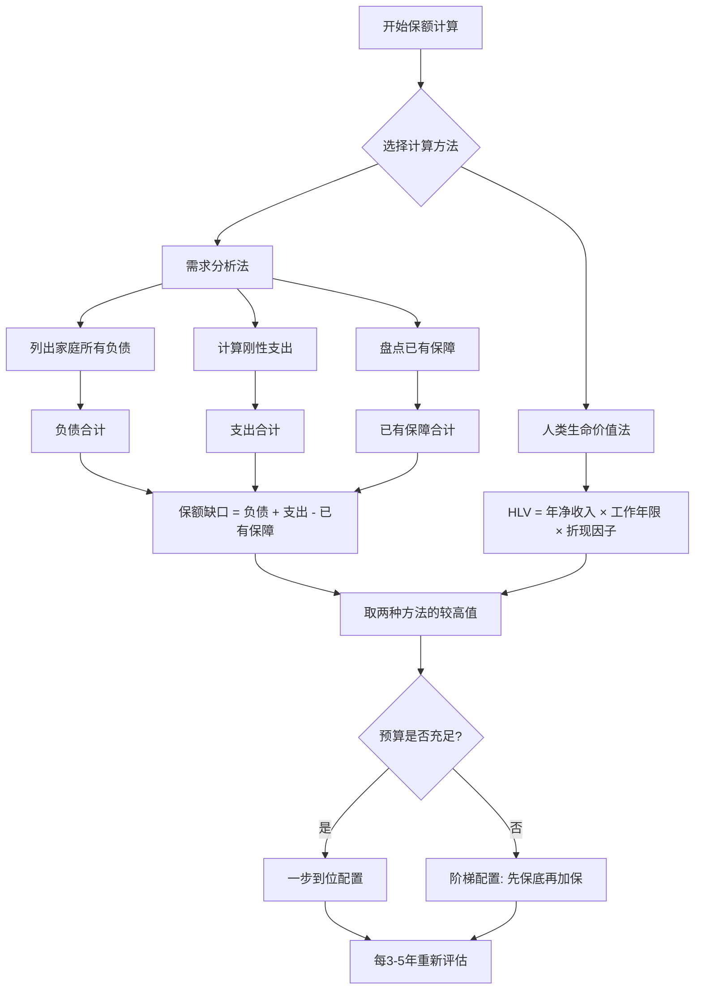

## 八、保额计算的科学方法

保额是保险合同中最核心的数字——它决定了风险发生时你能获得多少经济补偿。保额过低，保障形同虚设；保额过高，保费支出挤占生活预算。科学计算保额，是理性投保的第一步。

### 8.1 保额计算的两大经典理论

国际精算学界对人身保险保额的确定，有两套成熟的理论框架。理解它们，才能真正掌握保额计算的底层逻辑。

#### 8.1.1 人类生命价值法（Human Life Value, HLV）

由美国保险学教授休伯纳（Solomon S. Huebner）于1927年提出。核心思想：**人的经济价值等于其未来净收入的现值**。

计算公式：

```text
HLV = Σ [（年收入 - 年个人消费） × 折现系数] ，从当前到退休
```

简化实操版：

```text
HLV = (年税后收入 - 年个人消费) × 工作年限 × 折现因子
```

其中折现因子通常取 0.85-0.90（考虑货币时间价值和收入增长的对冲）。

**示例**：30岁男性，年税后收入25万，个人年消费5万，计划60岁退休。

```text
HLV = (25万 - 5万) × 30年 × 0.87 = 522万
```

这意味着此人对家庭的经济贡献现值约为522万，保额应覆盖这个数字。

**优点**：逻辑清晰，直接反映个人经济价值。  
**局限**：不考虑家庭具体负债和支出结构，可能高估或低估实际需求。

#### 8.1.2 需求分析法（Needs Analysis）

更贴近实操的方法。核心思想：**从家庭实际财务需求出发，逐项列出风险发生后需要多少钱，减去已有资源，得出保额缺口**。

```text
保额需求 = 负债清偿 + 遗属生活费 + 子女教育 + 父母赡养 + 丧葬及税费 - 已有储蓄和保障
```

这是目前保险行业和理财规划师最常用的方法，本章后续各类保险的保额计算均基于此框架展开。

**两种方法的对比**：

| 维度 | 人类生命价值法 | 需求分析法 |
|------|---------------|-----------|
| 计算出发点 | 个人未来收入现值 | 家庭实际资金需求 |
| 适用场景 | 快速估算、高收入人群 | 精确规划、普通家庭 |
| 优点 | 计算简便 | 结果更贴合实际 |
| 缺点 | 忽略家庭具体结构 | 需要详细财务数据 |
| 推荐程度 | 作为交叉验证 | 作为主要方法 |

实际操作中，建议**两种方法都算一遍，取较高值**作为保额目标。

### 8.2 重疾险保额计算：三维模型

重疾险保额最容易算错。很多人只考虑治疗费用，忽略了收入损失和康复支出——这两项往往比治疗费本身更高。

#### 8.2.1 维度一：治疗费用

以下数据基于国家癌症中心、中国心血管健康联盟等机构的公开报告，为社保报销后的个人自费部分：

| 疾病类型 | 平均自费治疗费用 | 治疗周期 | 说明 |
|----------|-----------------|---------|------|
| 恶性肿瘤 | 20-50万 | 1-3年 | 靶向药/免疫治疗可大幅推高费用 |
| 急性心肌梗塞 | 15-30万 | 6-12个月 | 含支架植入和术后用药 |
| 脑中风后遗症 | 20-60万 | 1-5年 | 康复期费用是主要支出 |
| 重大器官移植 | 30-80万 | 终身 | 手术费+终身抗排异药（约3-5万/年） |
| 冠状动脉搭桥术 | 15-25万 | 3-6个月 | 开胸手术，术后恢复期长 |
| 终末期肾病 | 10-20万/年 | 终身 | 透析费用持续产生 |
| 白血病（骨髓移植） | 50-100万 | 1-2年 | 含配型、移植、抗排异 |

**关键提醒**：上述费用不含社保不报销的进口药、院外药。以肺癌靶向药奥希替尼为例，月费用约1.5万（纳入医保后降至数千元，但仍有自付比例），未纳入医保的新型免疫治疗药物费用更高。实际治疗中，自费部分可能超出上表上限。

#### 8.2.2 维度二：收入损失

重疾确诊后，患者通常需要长期治疗和休养，工作能力严重下降甚至完全丧失。

```text
收入损失 = 年收入 × 收入中断年限
```

收入中断年限建议按3-5年计算，原因如下：
- **恶性肿瘤**：医学上以5年生存率作为治愈标准，前3-5年是关键康复期
- **心脑血管疾病**：术后至少需要1-2年恢复，重返高强度工作的可能性低
- **器官移植**：终身无法从事重体力劳动，部分人无法恢复全职工作

**示例**：年收入20万，按3年计算，收入损失 = 60万；按5年计算 = 100万。

**双职工家庭的特殊处理**：如果夫妻双方都有收入，一方患病时另一方可能需要减少工作来照顾，因此收入损失应按**家庭总收入减少额**计算，而非仅患者个人收入。

#### 8.2.3 维度三：康复与护理费用

治疗结束不等于开支结束。重疾后的康复期往往持续数年，各项支出如下：

| 项目 | 月均费用 | 说明 |
|------|---------|------|
| 营养品和特殊饮食 | 3000-8000元 | 术后营养支持、肿瘤患者特殊饮食 |
| 专人护理 | 5000-12000元 | 失能状态下需要全职护工 |
| 定期复查 | 2000-5000元 | 影像检查、血液检查、专家门诊 |
| 康复训练 | 3000-6000元 | 物理治疗、语言训练、认知训练 |
| 心理咨询 | 1000-3000元 | 常被忽略但对康复至关重要 |
| 辅助器具 | 均摊1000-2000元/月 | 轮椅、假肢、助听器等 |

按保守估计，康复期每月额外支出1-2万，2年康复期 = 24-48万。

#### 8.2.4 重疾险保额综合计算公式

```text
重疾险保额 = 治疗费用 + 收入损失 + 康复费用
           = (30-50万) + (年收入 × 3-5年) + (20-50万)
```

**三个典型场景的计算**：

| 家庭情况 | 治疗费 | 收入损失 | 康复费 | 建议保额 |
|----------|--------|---------|--------|---------|
| 三四线城市，年收入10万 | 30万 | 30万（3年） | 20万 | **80万** |
| 二线城市，年收入20万 | 40万 | 60万（3年） | 30万 | **130万** |
| 一线城市，年收入40万 | 50万 | 120万（3年） | 40万 | **210万** |

> 💡 **预算有限时的务实策略**：如果无法一步到位，采用"阶梯配置法"——先配置50万消费型重疾险打底，后续收入增长后逐步加保至目标保额。有保障永远比裸奔强。

### 8.3 定期寿险保额计算：家庭责任法

定期寿险的保额应覆盖被保险人身故后，家庭在经济过渡期内需要的全部资金。

#### 8.3.1 计算公式

```text
寿险保额 = 负债总额 + 刚性支出 - 已有保障
```

展开为：

```text
寿险保额 = 房贷余额 + 其他负债 + 子女教育费用 + 父母赡养费用
         + 家庭N年生活费 + 丧葬及税费 - 已有储蓄投资 - 社保抚恤 - 已有寿险保额
```

#### 8.3.2 各项费用的计算方法

**负债类（必须全额覆盖）**：

| 项目 | 计算方式 | 说明 |
|------|---------|------|
| 房贷余额 | 查询银行贷款明细 | 只算剩余本金，不算未来利息 |
| 车贷余额 | 查询贷款明细 | 同上 |
| 其他负债 | 信用卡+消费贷+亲友借款 | 列出所有未清偿债务 |

**刚性支出类**：

| 项目 | 计算方式 | 一线城市参考值 |
|------|---------|--------------|
| 子女教育 | 从现在到大学毕业 | 80-150万/孩（含留学可能性） |
| 父母赡养 | 每位老人月赡养费×12×预计年数 | 40-80万/位（按2000-3000元/月×15-20年） |
| 家庭生活费 | 月支出×12×保障过渡期 | 120-180万（月支出1-1.5万×10年） |
| 丧葬及税费 | 一次性支出 | 5-10万 |

**已有保障（可以扣减）**：

| 项目 | 说明 |
|------|------|
| 银行存款和理财 | 可直接用于家庭支出的部分 |
| 社保抚恤金 | 丧葬补助金+抚恤金（各地标准不同，通常5-15万） |
| 已有商业寿险保额 | 如果已经投保的寿险 |
| 单位团体保险 | 部分企业提供的身故保障 |

#### 8.3.3 完整计算示例

**案例**：35岁男性，二线城市，房贷余额120万，车贷8万，一孩（5岁），双亲健在。

| 项目 | 金额 | 计算说明 |
|------|------|---------|
| 房贷余额 | 120万 | 剩余贷款本金 |
| 车贷 | 8万 | 剩余贷款 |
| 子女教育 | 100万 | 从5岁到22岁大学毕业 |
| 父母赡养 | 72万 | 2位老人×3000元/月×10年 |
| 家庭10年生活费 | 120万 | 月支出1万×120个月 |
| **需求合计** | **420万** | |
| 减：存款理财 | -30万 | |
| 减：社保抚恤 | -10万 | |
| 减：已有寿险 | -50万 | 企业团体险 |
| **保额缺口** | **330万** | |

建议配置：200万定期寿险（保至60岁）+ 130万定期寿险（保至55岁，覆盖房贷期限）。

#### 8.3.4 夫妻双方的保额分配

双收入家庭中，夫妻双方都需要配置寿险，但保额可以不同：

- **收入较高方**：承担主要保额，覆盖家庭总需求的60%-70%
- **收入较低方**：覆盖家庭总需求的30%-40%，重点覆盖子女照护成本
- **全职主妇/主夫**：虽无直接收入，但身故后需要雇佣人承担家务和育儿，应按当地家政/育儿嫂费用计算，建议保额不低于50-100万

### 8.4 医疗险保额选择

医疗险的保额选择逻辑与其他险种不同——**保额高低不是关键，续保条件和保障范围才是**。

#### 8.4.1 百万医疗险的保额真相

市面上百万医疗险保额从100万到600万不等，但实际差异很小：

- 所有产品都有**1万元免赔额**（社保报销后的自费部分超过1万才赔）
- 绝大多数住院花费在社保报销后不超过30-50万
- 保额200万和保额400万，实际赔付金额几乎没有区别

真正影响保障力度的是：

| 关键指标 | 重要性 | 说明 |
|---------|--------|------|
| 续保条件 | ★★★★★ | 保证续保20年 > 保证续保6年 > 不保证续保 |
| 外购药报销 | ★★★★★ | 部分靶向药需要院外购买，不报销则自费巨大 |
| 质子重离子 | ★★★★ | 先进放疗技术，单次治疗费27-35万 |
| 特需/国际部 | ★★★ | 就医体验更好，但不是必需 |
| 免赔额 | ★★★ | 1万免赔额是主流，家庭共享免赔额更优 |
| 增值服务 | ★★ | 就医绿通、费用垫付、二次诊疗意见 |

#### 8.4.2 免赔额的选择策略

- **1万免赔额（标准版）**：适合有社保+小额医疗险补充的家庭，保费最低
- **5000元免赔额**：适合没有小额医疗险、希望报销门槛更低的人群
- **0免赔额**：保费显著上升，仅适合预算充足且频繁就医的人群
- **家庭共享免赔额**：全家共用1万免赔额，一人住院即可用掉免赔额，**强烈推荐家庭投保时选择**

#### 8.4.3 小额医疗险的搭配

百万医疗险的1万免赔额是保障缺口。可以用小额医疗险（保额1-5万，0免赔或100元免赔）来覆盖：

```text
小额医疗险（0-1万） + 百万医疗险（1万以上） = 完整覆盖
```

### 8.5 意外险保额配置

意外险是杠杆率最高的险种——百元保费即可获得百万保障。

#### 8.5.1 意外身故/伤残保额

建议保额：**50-100万**。

计算逻辑：
- 意外伤残按等级赔付（1级伤残赔100%保额，10级伤残赔10%保额）
- 伤残对未来收入的影响是长期的，需要足够高的保额来弥补
- 与定期寿险互补：寿险保身故，意外险保身故+伤残

#### 8.5.2 意外医疗保额

建议保额：**2-5万**，重点关注：
- **不限社保用药**（社保外用药如进口钢板、进口缝合线费用不低）
- **0免赔**或低免赔
- **100%报销**（部分产品只报销80%-90%）

#### 8.5.3 其他加分项

| 保障项目 | 建议标准 | 说明 |
|---------|---------|------|
| 意外住院津贴 | 100-200元/天 | 按住院天数给付，不限用途 |
| 猝死保障 | 30-50万 | 严格来说猝死不算意外，部分产品额外涵盖 |
| 交通意外额外赔 | 叠加赔付 | 乘坐公共交通/自驾时身故额外赔付 |

### 8.6 保额计算的进阶调整

#### 8.6.1 通胀调整：保额不是一成不变的

保险保障的是未来的风险，但保额在投保时就已确定。**必须考虑通胀侵蚀**。

假设年通胀率3%：
- 今天100万的购买力，10年后仅相当于约74万
- 20年后仅相当于约55万
- 30年后仅相当于约41万

**应对策略**：

1. **投保时留出通胀余量**：目标保额100万，实际投保120-130万
2. **选择保额递增型产品**：部分重疾险/寿险支持保额每年递增3%-5%
3. **定期加保**：每3-5年重新评估保额缺口，适时加保
4. **收入增长时加保**：加薪后第一时间增加保障，而非增加消费

#### 8.6.2 生命周期动态调整

保额需求随人生阶段变化，以下是关键调整节点：

| 人生阶段 | 保额变化趋势 | 调整重点 |
|---------|-------------|---------|
| 单身期（22-28岁） | 低需求 | 重疾险50万+意外险50万，保费低优先 |
| 成家期（28-35岁） | 急剧上升 | 加寿险（覆盖房贷），重疾险加保 |
| 育儿期（30-45岁） | 高峰期 | 寿险保额最高，教育金纳入计算 |
| 稳定期（45-55岁） | 逐步下降 | 子女独立，房贷减少，可适当降低寿险 |
| 退休期（55岁+） | 低需求 | 寿险到期可不续，保留重疾/医疗险 |

#### 8.6.3 收入波动人群的特殊处理

自由职业者、创业者、销售人员等收入不稳定人群：

- 保额计算应以**近3年平均收入的80%**为基准（保守估计）
- 避免按收入高峰期计算，防止保费负担过重
- 收入好时多存应急基金，收入差时保额至少覆盖负债

### 8.7 常见保额计算误区

#### 误区一：只看治疗费用，忽略收入损失

重疾险只算治疗费20-50万，结果保额50万——3年不工作，家庭财务直接崩盘。收入损失往往占重疾险保额需求的50%以上。

#### 误区二：寿险保额等于房贷金额

房贷200万就买200万寿险——错。房贷只是负债之一，还需要覆盖子女教育、父母赡养、家庭生活费。正确做法是按需求分析法全口径计算。

#### 误区三：医疗险保额越高越好

追求600万保额的百万医疗险，却忽略了外购药不报销、不保证续保。保额数字好看，关键时刻可能赔不到。

#### 误区四：意外险保额等同于寿险保额

意外险只保意外导致的身故/伤残，疾病身故不赔。意外险和寿险是互补关系，不是替代关系。

#### 误区五：一次投保终身不调

25岁买的50万重疾险，到40岁上有老下有小时还是50万——保额早已不足。保险配置是动态过程，需要定期审视。

#### 误区六：用"双十原则"一刀切

"保费占收入10%，保额是年收入10倍"——这个粗略法则对中低收入人群可能偏高（保费负担重），对高收入人群可能偏低（保额不足）。科学做法还是按需求分析法精确计算。

### 8.8 保额计算实操工具

#### 8.8.1 Excel保额计算模板

可以用以下结构在Excel中建立家庭保额计算表：

```text
Sheet 1: 负债清单
├── A列：负债项目
├── B列：当前余额
├── C列：月还款额
└── D列：到期日期

Sheet 2: 刚性支出
├── A列：支出项目
├── B列：年支出金额
├── C列：需要保障的年数
└── D列：合计金额（B×C）

Sheet 3: 已有保障
├── A列：保障来源
├── B列：保额/金额
└── C列：覆盖范围

Sheet 4: 保额缺口汇总
├── 负债总额（引用Sheet 1）
├── 刚性支出总额（引用Sheet 2）
├── 减：已有保障（引用Sheet 3）
└── = 保额缺口
```

#### 8.8.2 快速估算口诀

如果不想做详细计算，可以用以下口诀快速估算：

- **重疾险**：年收入 × 5 + 30万（治疗基础费）
- **定期寿险**：年收入 × 10（适用于负债不多的家庭）
- **医疗险**：百万医疗即可，关注续保条件
- **意外险**：年收入 × 3-5，最低50万

**口诀仅用于快速判断大致方向，正式配置时必须用需求分析法精算。**

### 8.9 保额计算的决策流程图



### 8.10 本章小结

保额计算的本质是一个**家庭财务风险管理问题**，而非简单的数字游戏。核心要点：

1. **两种理论方法互补使用**：需求分析法为主，人类生命价值法交叉验证
2. **重疾险用三维模型**：治疗费+收入损失+康复费，缺一不可
3. **寿险用全口径计算**：负债+刚性支出-已有保障
4. **医疗险关注续保和范围**，而非保额数字
5. **意外险是高杠杆必备**：百元保费百万保障
6. **保额需要动态调整**：通胀、生命周期、收入变化都会改变需求
7. **避免常见误区**：不拍脑袋、不一刀切、不一次投终身不调

掌握这些方法，你就能为家庭构建一个保额充足、结构合理、成本可控的保险保障体系。
