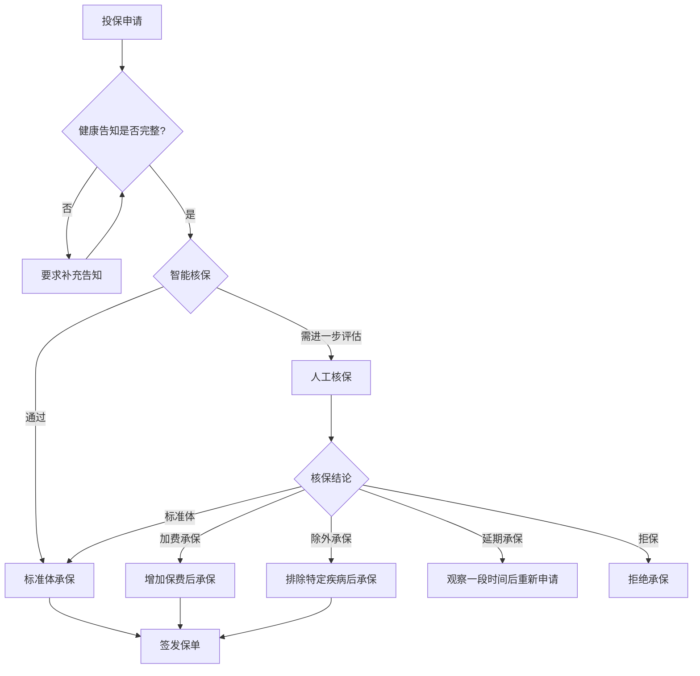
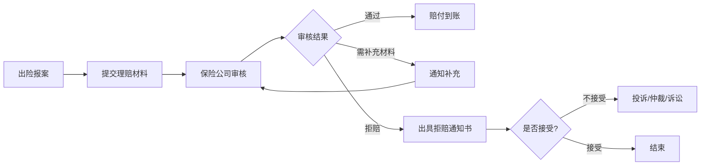
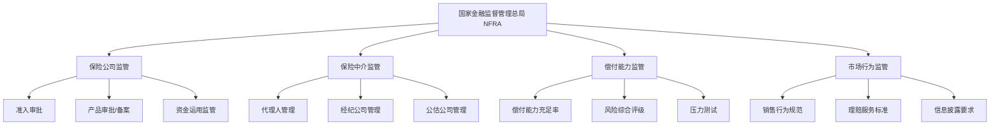

## 九、保险行业的运作机制

理解保险行业的运作机制，是做出明智投保决策的基础。当你知道保险公司如何定价、如何核保、如何理赔、如何赚钱，你就能看穿营销话术，识别真正有价值的产品。本章从底层原理到行业生态，系统拆解保险行业的运转逻辑。

---

### 9.1 保险公司的盈利模式

保险公司的商业模式可以用一句话概括：**先收钱，后赔钱，用时间差赚钱**。但具体到利润来源，远比这句话复杂。

#### 9.1.1 三大利润来源

**（1）承保利润——靠精准定价和风险控制赚钱**

```text
承保利润 = 保费收入 - 赔付支出 - 运营费用
综合成本率 = 赔付率 + 费用率
```

综合成本率（Combined Ratio）是衡量承保盈利能力的核心指标：

| 综合成本率 | 含义 | 示例 |
|-----------|------|------|
| < 100% | 承保盈利，保费收入覆盖了赔付和费用 | 综合成本率95%意味着每收100元保费，赔付+费用共95元，承保赚5元 |
| = 100% | 承保盈亏平衡 | — |
| > 100% | 承保亏损，需要投资收益来弥补 | 综合成本率105%意味着每收100元保费，赔付+费用共105元，承保亏5元 |

财产险和短期健康险主要靠承保利润。优秀的财险公司（如人保财险）综合成本率长期控制在97%-99%，看似微薄的利润在巨大保费规模下非常可观。

**（2）投资收益——用"浮存金"赚钱**

保险公司收取保费后，从收钱到赔钱之间存在巨大的时间差。这笔暂时沉淀在保险公司手中的资金叫做**浮存金（Float）**，是巴菲特最看重的保险业价值。

浮存金的投资去向和比例：

| 资产类别 | 占比范围 | 特点 |
|---------|---------|------|
| 政府债券/金融债 | 40%-55% | 安全性高，收益稳定，是保险资金的压舱石 |
| 企业债券 | 15%-25% | 收益略高，风险可控 |
| 股票/基金 | 10%-20% | 收益弹性大，监管对权益投资比例有上限 |
| 不动产/基础设施 | 5%-15% | 期限长，与保险负债匹配度高 |
| 贷款（保单质押等） | 5%-10% | 收益稳定，风险较低 |

寿险公司的利润核心是**三差**：

- **死差**：实际死亡率低于精算假设，赔付少于预期
- **费差**：实际运营费用低于精算假设
- **利差**：实际投资收益率高于保单预定利率

在利率下行周期中，早期高预定利率保单（如1990年代的8%预定利率保单）会成为保险公司的沉重负担——投资收益达不到承诺利率，产生**利差损**。这也是为什么近年来保险预定利率从3.5%下调到3.0%再到2.5%的原因。

**（3）退保利润——被忽视的收入来源**

投保人退保时，只能拿回保单的**现金价值**，通常远低于已交保费。尤其在保单前期，退保损失极大：

| 缴费年限 | 退保可拿回比例（大约） |
|---------|---------------------|
| 第1年 | 已交保费的 5%-15% |
| 第2年 | 已交保费的 15%-25% |
| 第3年 | 已交保费的 30%-40% |
| 第5年 | 已交保费的 50%-65% |
| 缴费期满后 | 趋近或超过已交保费 |

退保损失的大部分被保险公司计入利润。这就是为什么销售人员极力劝阻退保——既是为你好（确实损失大），也是为公司好（退保减少利润）。

#### 9.1.2 保险公司的利润周期

保险行业有明显的承保周期（Underwriting Cycle）：

```text
保费充足 → 利润高 → 新公司进入竞争加剧 → 保费下降 → 利润压缩
→ 部分公司退出 → 竞争缓和 → 保费回升 → 利润恢复
```

一个完整的承保周期通常为5-8年。理解这个周期，有助于在投保时判断当前市场是"价格战"阶段（产品性价比高）还是"利润修复"阶段（产品偏贵）。

---

### 9.2 保险定价的底层逻辑

保险产品的价格（保费）不是拍脑袋定出来的，而是精算师基于大量数据和数学模型计算出来的。

#### 9.2.1 大数法则——保险的数学基础

保险的核心数学原理是**大数法则**（Law of Large Numbers）：当样本量足够大时，实际损失率会趋近于理论概率。

举例说明：某地区30岁男性一年内的死亡概率是0.1%。如果有1000个这样的男性投保：
- 理论上死亡人数 = 1000 × 0.1% = 1人
- 保险公司需要准备的赔付金 = 1人 × 保额
- 每人应缴保费 = 赔付金 / 1000

但只有1000人投保时，实际死亡人数可能偏差很大（0人或2人）。只有当投保人数达到几十万甚至几百万时，实际死亡率才会非常接近0.1%。这就是为什么保险公司需要大量同质风险的投保人——**风险池越大，定价越准确，经营越稳定**。

#### 9.2.2 保费的构成

一份保险的保费由三部分组成：

```text
总保费 = 纯保费 + 附加保费 + 安全边际

纯保费 = 预期赔付金额（基于发生率 × 赔付金额）
附加保费 = 运营费用（佣金、管理费、税费等）
安全边际 = 精算师为应对不确定性预留的缓冲
```

不同险种的保费构成差异很大：

| 险种 | 纯保费占比 | 附加保费占比 | 安全边际 |
|------|-----------|-------------|---------|
| 定期寿险 | 60%-70% | 20%-30% | 5%-10% |
| 重疾险 | 50%-65% | 25%-35% | 10%-15% |
| 医疗险 | 70%-80% | 15%-25% | 5%-10% |
| 年金险 | 80%-90% | 8%-15% | 2%-5% |

理解保费构成有助于你看懂产品定价：同类产品中，附加保费占比越低（渠道费用低、运营效率高），性价比通常越高。互联网保险产品之所以便宜，核心就是大幅压缩了附加保费。

#### 9.2.3 影响定价的关键因素

不同险种的定价因子各不相同：

**寿险/重疾险定价因子**：

| 因子 | 影响程度 | 说明 |
|------|---------|------|
| 年龄 | ★★★★★ | 年龄每增加一岁，保费增加约3%-8% |
| 性别 | ★★★★ | 女性寿险便宜约15%-20%，男性重疾便宜约5%-10% |
| 保额 | ★★★★★ | 线性关系，保额翻倍保费大致翻倍 |
| 缴费期 | ★★★ | 缴费期越长，年缴保费越低（但总保费更高） |
| 职业 | ★★★ | 高危职业可能加费或拒保 |
| 健康状况 | ★★★★★ | 标准体/加费/除外，差异巨大 |
| 吸烟史 | ★★★★ | 吸烟者保费比非吸烟者高30%-50% |

**医疗险定价因子**：

除上述因素外，医疗险还特别关注：
- 既往病史和就医记录
- 体检指标（BMI、血压、血脂等）
- 社保状态（有社保比无社保便宜30%-50%）
- 免赔额选择（免赔额越高，保费越低）

---

### 9.3 核保流程与机制

核保（Underwriting）是保险公司评估投保人风险、决定是否承保以及以什么条件承保的过程。这是连接定价和理赔的关键环节。

#### 9.3.1 核保流程全景



#### 9.3.2 智能核保 vs 人工核保

| 维度 | 智能核保 | 人工核保 |
|------|---------|---------|
| 速度 | 秒级出结果 | 3-7个工作日 |
| 灵活性 | 规则固定，非黑即白 | 可综合判断，更灵活 |
| 匿名性 | 可匿名测试 | 需要提交正式申请 |
| 适用场景 | 常见健康异常 | 复杂病史、高保额 |
| 记录留存 | 通常不留记录 | 会留下核保记录 |
| 接受度 | 只能接受或拒绝结论 | 可补充材料争取更好结论 |

**智能核保的使用技巧**：
1. 同一健康异常，不同产品的智能核保问卷不同，结果可能差异很大
2. 先用智能核保匿名测试多家产品，选出核保结果最优的再正式投保
3. 智能核保被拒不代表一定不能投保，可以转人工核保或换产品尝试
4. 智能核保的结论是标准化的，人工核保可能更灵活——比如甲状腺结节3级，智能核保可能直接除外，人工核保在提供详细超声报告后可能标准体承保

#### 9.3.3 健康告知的正确理解

健康告知是投保过程中最容易出错的环节。错误的告知方式可能导致理赔被拒，理解规则至关重要。

**原则一：询问告知，问什么答什么**

中国《保险法》第十六条规定的是**询问告知**原则，即保险公司问了什么你就如实回答什么，没问到的不需要主动告知。具体操作：

- 逐条阅读健康告知问卷的每一个问题
- 只回答被问到的内容，不要主动扩展
- 问"是否被诊断为XX疾病"→ 只回答是否确诊，不包括"疑似""待查"
- 问"过去两年内是否有体检异常"→ 超过两年的不用告知
- 问"是否曾经住院"→ 门诊不算住院

**原则二：以医学诊断为准，不自我诊断**

| 场景 | 是否需要告知 | 理由 |
|------|-------------|------|
| 体检报告写"建议复查" | 通常不需要 | 未确诊为疾病 |
| 体检报告写"轻度脂肪肝" | 需要看具体问卷 | 部分问卷明确问到脂肪肝 |
| 医院诊断"高血压病" | 必须告知 | 明确的疾病诊断 |
| 体检血压偏高但未就诊 | 需要看问卷措辞 | 问"是否被诊断"则不用，问"是否有指标异常"则需要 |
| 5年前做过阑尾炎手术已痊愈 | 看问卷时间范围 | 问"过去5年内"则需要，问"过去2年内"则不需要 |

**原则三：不要隐瞒，但也不要过度告知**

隐瞒重要病史是理赔纠纷的第一大原因。但过度告知（主动说出问卷没问的内容）也可能导致不必要的核保限制。正确做法是：如实、准确、完整地回答每一个被问到的问题。

#### 9.3.4 常见健康异常的核保结果参考

| 健康异常 | 重疾险 | 医疗险 | 寿险 | 应对策略 |
|---------|--------|--------|------|---------|
| 甲状腺结节（1-2级） | 标准体或除外甲状腺癌 | 除外甲状腺疾病 | 标准体 | 优先选标准体承保的产品 |
| 甲状腺结节（3级） | 除外甲状腺癌 | 除外甲状腺疾病 | 标准体 | 可接受除外，甲状腺癌治愈率高 |
| 甲状腺癌术后 | 通常拒保，少数可除外 | 通常拒保 | 通常拒保 | 术后5年可尝试投保 |
| 乳腺结节（2-3级） | 标准体或除外乳腺癌 | 除外乳腺疾病 | 标准体 | BI-RADS 2级机会更大 |
| 肝功能异常（轻度） | 可能加费10%-30% | 可能拒保或除外 | 可能加费 | 先治疗复查正常后再投保 |
| 高血压I期 | 可能加费20%-50% | 可能拒保 | 可能加费 | 控制血压稳定后多家尝试 |
| 高尿酸血症 | 无并发症通常标准体 | 可能标准体 | 标准体 | 关注有无痛风/肾功能异常 |
| 抑郁症/焦虑症 | 通常拒保或延期 | 通常拒保 | 可能加费 | 停药稳定1-2年后尝试 |
| BMI超标（>30） | 可能加费 | 可能标准体 | 可能加费 | 减重后再投保 |
| 乙肝病毒携带 | 部分可标准体 | 部分可标准体 | 通常标准体 | 肝功能正常+病毒载量低是关键 |
| 糖尿病 | 通常拒保 | 通常拒保 | 通常拒保 | 尝试糖尿病专属产品 |
| 胃息肉（已切除良性） | 标准体或除外 | 可能标准体 | 标准体 | 提供病理报告证明良性 |

> **实操建议**：同一健康异常，不同保险公司的核保标准可能差异很大。建议同时向3-5家保险公司提交智能核保测试，选择核保结果最优的产品。如果所有智能核保都不理想，可以找保险经纪人走人工核保通道，提供详细的医疗资料争取更好的结论。

---

### 9.4 理赔运作机制

理赔是保险价值的最终兑现。理解理赔流程和规则，可以在出险时高效获得赔付。

#### 9.4.1 理赔全流程



**各环节详解**：

**（1）出险报案——越快越好**

| 险种 | 报案时限 | 报案方式 |
|------|---------|---------|
| 重疾险 | 确诊后尽快，通常要求10天内 | 客服电话/APP/微信 |
| 医疗险 | 就诊后尽快 | 客服电话/APP |
| 寿险 | 身故后尽快 | 客服电话（需受益人报案） |
| 意外险 | 事故发生后48小时内 | 客服电话/APP |
| 车险 | 事故后48小时内 | 客服电话（必须） |

报案时需要提供：保单号、被保险人信息、出险时间、出险经过、就医情况。报案越早，理赔越顺畅——延迟报案可能导致保险公司调查成本增加，甚至怀疑是否为保险事故。

**（2）理赔材料准备**

不同险种的核心材料：

| 险种 | 核心材料 |
|------|---------|
| 重疾险 | 诊断证明、病理报告、住院病历、身份证、银行卡 |
| 医疗险 | 住院病历、费用清单、发票原件、社保报销凭证、身份证、银行卡 |
| 寿险（身故） | 死亡证明、户籍注销证明、受益人身份证、关系证明、银行卡 |
| 意外险（伤残） | 伤残鉴定报告、事故证明、医疗记录、身份证、银行卡 |

**关键提醒**：
- 医疗险报销需要**发票原件**，如果有社保和其他商业医疗险，要提前规划报销顺序
- 重疾险的理赔标准以合同中的疾病定义为准，不是医生说"重大疾病"就一定能赔
- 保留所有就医相关的原始单据，包括门诊病历、检查报告、处方单等

**（3）理赔审核——保险公司怎么审**

保险公司审核理赔申请时，主要做三件事：

1. **核实保单有效性**：是否在保障期内、是否正常缴费、等待期是否已过
2. **核实保险事故**：是否属于保障范围、是否属于免责条款
3. **核实告知真实性**：投保时的健康告知是否如实

对于大额理赔（通常超过50万或100万），保险公司通常会委托第三方调查公司进行**理赔调查**，包括：
- 调取医院就诊记录
- 查询社保就医记录
- 调查投保前后的体检记录
- 核实事故发生的真实性

**（4）理赔时效**

《保险法》第二十三条规定：保险人收到理赔申请后，应当在30日内作出核定；情形复杂的，应当在60日内作出核定。核定后属于保险责任的，应当在10日内支付赔款。

实际操作中，简单案件（材料齐全、金额小）通常3-7个工作日赔付。复杂案件可能需要30-60天。

#### 9.4.2 常见拒赔原因与应对

| 拒赔原因 | 占比 | 是否合理 | 应对方式 |
|---------|------|---------|---------|
| 未如实告知 | 约30% | 视情况 | 核实告知是否确实遗漏，非故意遗漏可争取 |
| 不属于保障范围 | 约25% | 通常合理 | 仔细阅读条款，看是否有争议空间 |
| 等待期内出险 | 约15% | 合理 | 无法改变，投保时注意等待期 |
| 免责条款 | 约15% | 视情况 | 核实是否适用免责条款 |
| 材料不全 | 约10% | 可补充 | 补充材料后重新申请 |
| 其他 | 约5% | 视情况 | 具体分析 |

**被拒赔后的维权路径**：

1. **向保险公司申诉**：要求出具书面拒赔通知书，针对拒赔理由提交反驳证据
2. **向监管部门投诉**：拨打12378银行保险消费者投诉热线，或向国家金融监督管理总局提交书面投诉
3. **申请调解**：向当地保险行业协会申请调解
4. **仲裁或诉讼**：根据合同约定申请仲裁，或向法院提起诉讼

> **重要提示**：在理赔纠纷中，法院通常倾向于保护被保险人。《保险法》第三十条规定："采用保险人提供的格式条款订立的保险合同，保险人与投保人、被保险人或者受益人对合同条款有争议的，应当按照通常理解予以解释。对合同条款有两种以上解释的，人民法院或者仲裁机构应当作出有利于被保险人和受益人的解释。"

---

### 9.5 再保险机制

再保险（Reinsurance）是保险公司把部分风险转移给其他保险公司的机制，被称为"保险的保险"。

#### 9.5.1 为什么需要再保险

- **分散风险**：单一事件造成巨额赔付时（如大型自然灾害、航空事故），单个保险公司可能无法承受
- **扩大承保能力**：有了再保险支持，保险公司可以承保更大的保额
- **稳定经营**：平滑赔付波动，让财务表现更稳定
- **满足监管要求**：监管对保险公司的风险自留比例有明确要求

#### 9.5.2 再保险的类型

| 类型 | 说明 | 举例 |
|------|------|------|
| 比例再保险 | 按固定比例分出保费和赔付 | A公司将每张保单保费和保额的30%分给再保险公司 |
| 非比例再保险 | 赔付超过一定金额后由再保险公司承担 | A公司自留赔付金额前1000万，超过部分由再保险公司承担 |
| 临时再保险 | 针对特定风险逐单安排 | 某明星投保5亿保额的寿险，保险公司临时安排再保险 |
| 合同再保险 | 按事先约定的条件自动分出 | A公司与再保险公司签订年度合同，所有符合条件的保单自动分出 |

#### 9.5.3 再保险对消费者的影响

再保险对普通消费者最直接的影响体现在**高保额保单**上。当你购买一份保额500万的定期寿险时，承保的保险公司可能将其中大部分风险通过再保险分给了国际再保险巨头（如慕尼黑再保险、瑞士再保险、中国再保险等）。这意味着：

- 你的保单安全性不仅取决于承保公司，还取决于再保险公司的实力
- 高保额保单的定价中包含了再保险成本
- 再保险公司的核保标准可能比直保公司更严格（高保额保单可能需要体检）

---

### 9.6 保险销售渠道

保险产品的销售渠道直接影响价格和服务体验。了解各渠道的特点，有助于选择最适合自己的购买方式。

#### 9.6.1 主要销售渠道对比

| 渠道 | 代表 | 优势 | 劣势 | 适合人群 |
|------|------|------|------|---------|
| 个人代理人 | 平安代理人、国寿代理人 | 面对面服务，信任感强 | 只卖一家公司产品，佣金高 | 偏好线下服务、信任熟人推荐 |
| 保险经纪人 | 明亚、大童、永达理 | 多家产品对比，立场相对客观 | 经纪人水平参差不齐 | 想对比多家产品的理性消费者 |
| 银行渠道 | 各银行理财经理 | 依托银行信任感 | 产品选择少，容易与理财混淆 | 银行客户、偏好储蓄型产品 |
| 电话销售 | 保险公司电销团队 | 主动触达 | 产品性价比通常不高 | 不推荐 |
| 互联网平台 | 蚂蚁保、微保、慧择、小雨伞 | 产品性价比高，投保便捷 | 缺少人工服务，理赔需自己跟进 | 熟悉保险知识、习惯线上操作 |
| 保险公司官网/APP | 各保险公司官方渠道 | 直接对接，无中间环节 | 只有自家产品 | 已确定具体产品的消费者 |

#### 9.6.2 保险经纪人的价值

保险经纪人是独立于保险公司的第三方机构，理论上代表消费者利益而非保险公司利益。其核心价值在于：

1. **产品对比**：可以从几十家公司的产品中筛选最适合的
2. **核保协助**：对于有健康异常的投保人，经纪人可以同时向多家公司提交核保申请，选择最优结果
3. **理赔协助**：出险时协助准备材料、跟进理赔进度、协助理赔争议
4. **方案设计**：根据家庭情况设计完整的保障方案

**选择经纪人的注意事项**：
- 确认经纪人持有《保险经纪从业人员执业证书`
- 了解经纪人合作的保险公司范围（合作越多，选择越多）
- 警惕只推荐高佣金产品的经纪人
- 确认后续服务内容（续保提醒、理赔协助等）

#### 9.6.3 互联网保险的兴起

互联网保险正在重塑行业格局：

- **2015年**：互联网保险保费收入约2234亿元
- **2020年**：互联网保险保费收入约2909亿元
- **2023年**：互联网保险保费收入超过5000亿元，渗透率持续提升

互联网保险的核心优势是**砍掉中间环节，降低附加保费**。一份互联网重疾险的渠道费用可能只有传统代理人渠道的1/3到1/2，这部分省下来的钱直接体现为更低的保费或更好的保障责任。

但互联网保险也有局限：
- 复杂产品（如终身寿险、年金险）需要专业讲解，纯线上体验不足
- 理赔时缺少专属服务人员，需要自己对接保险公司
- 产品信息过多，容易陷入选择困难

---

### 9.7 监管体系与消费者保护

中国保险行业有完善的监管体系，为消费者提供了多层次的保护。

#### 9.7.1 监管架构



2023年机构改革后，原银保监会的保险监管职能整合到**国家金融监督管理总局（NFRA）**，实现银行业和保险业的统一监管。

#### 9.7.2 偿付能力监管——C-ROSS体系

中国实施**中国风险导向的偿付能力体系（C-ROSS）**，要求保险公司同时满足三个条件：

| 指标 | 要求 | 含义 |
|------|------|------|
| 核心偿付能力充足率 | ≥ 50% | 核心资本/最低资本 |
| 综合偿付能力充足率 | ≥ 100% | 实际资本/最低资本 |
| 风险综合评级 | ≥ B类 | 公司整体风险水平 |

偿付能力充足率低于监管要求的公司，会被限制新业务、限制高管薪酬、责令增加资本金。消费者可以在保险公司官网或NFRA网站查询各公司的偿付能力报告。

#### 9.7.3 保险保障基金——最后的安全网

保险保障基金是行业互助性质的基金，在保险公司被撤销或破产时，为保单持有人提供救助：

- **财产险**：保单利益在5万元以内的全额救助；超过5万元的部分，个人救助90%，机构救助80%
- **人身险**：保单利益在5万元以内的全额救助；超过5万元的部分，个人救助90%，机构救助80%

历史上，保险保障基金已多次发挥作用：
- 2007年：救助新华人寿（后成功退出）
- 2018年：接管安邦保险集团（后重组为大家保险）
- 2023年：接管天安人寿、华夏人寿等（后分别重组为中汇人寿、瑞众人寿）

这些案例证明：即使保险公司出了问题，消费者的保单利益也基本不会受损。

#### 9.7.4 保险公司安全性的正确理解

"小保险公司会不会倒闭？"是最常见的问题之一。正确理解如下：

**为什么说保险公司很安全**：
1. 成立门槛极高：注册资本不低于2亿元（实缴），且需要持续满足偿付能力要求
2. 资金运用受严格监管：投资范围、比例、集中度都有明确限制
3. 偿付能力实时监控：C-ROSS体系对资本充足率、风险状况进行季度评估
4. 即使破产也有保障：《保险法》第92条规定人寿保险合同必须由其他保险公司接管
5. 保险保障基金兜底：为保单持有人提供最后的安全网

**选择产品时应关注什么**：
- 产品保障责任是否全面
- 保费性价比是否合理
- 偿付能力充足率是否达标（建议选择充足率>150%的公司）
- 理赔服务口碑如何
- 不必过度追求"大品牌"而支付不必要的品牌溢价

---

### 9.8 保险科技的发展趋势

保险科技（InsurTech）正在从多个维度重塑保险行业。

#### 9.8.1 智能核保与精准定价

**大数据核保**：通过对接医院信息系统（HIS）、社保系统、体检机构数据库，实现自动化核保。投保人授权后，保险公司可以直接调取相关健康数据，无需提交纸质材料。

**AI辅助核保**：利用机器学习模型分析投保人的风险特征，比传统精算模型更精准。例如，通过分析投保人的就医频率、用药记录、体检趋势等，预测未来出险概率。

**个性化定价**：基于个体行为数据的差异化定价正在成为趋势：
- **健康险**：可穿戴设备数据（步数、心率、睡眠质量）用于定价——运动量大的人保费更低
- **车险**：UBI（Usage-Based Insurance）基于驾驶行为定价——急刹车少、夜间行驶少的驾驶员保费更低
- **寿险**：结合体检数据、基因检测等进行差异化定价（基因检测在国内外均有伦理争议）

#### 9.8.2 理赔自动化

**秒赔**：小额理赔（通常5000元以下）可实现"拍照上传→AI审核→即时到账"，全流程不超过1分钟。

**数据直连**：保险公司与医院信息系统打通，理赔时自动获取诊断信息、费用明细，无需提交纸质材料。

**反欺诈AI**：通过分析理赔数据的异常模式，识别疑似欺诈案件。例如，短期内多次理赔、同一医院高频就诊、理赔金额异常等。

#### 9.8.3 区块链与智能合约

区块链在保险领域的应用前景：
- **保单存证**：保单信息上链，不可篡改，解决保单真伪验证问题
- **自动理赔**：通过智能合约实现条件触发自动赔付（如航班延误险：航班延误超过2小时，自动触发赔付）
- **再保险效率**：再保险交易上链，减少对账成本和结算时间

#### 9.8.4 健康管理闭环

保险行业正在从"事后赔付"向"事前预防"转型：
- 保险公司与健康管理平台合作，为客户提供健康评估、慢病管理、在线问诊等服务
- 通过健康管理降低出险率，实现保险公司和客户的双赢
- 部分产品将健康管理与保费挂钩——完成健康任务可获得保费折扣

---

### 9.9 中国保险市场概况

#### 9.9.1 市场规模与格局

中国是全球第二大保险市场（仅次于美国），保费收入持续增长：

| 年份 | 保费收入（万亿元） | 全球排名 | 保险深度 | 保险密度 |
|------|------------------|---------|---------|---------|
| 2018 | 3.8 | 2 | 4.2% | 2724元 |
| 2020 | 4.5 | 2 | 4.5% | 3200元 |
| 2022 | 4.7 | 2 | 3.9% | 3326元 |
| 2024 | 约5.5 | 2 | 约4.3% | 约3900元 |

- **保险深度** = 保费收入 / GDP，反映保险业在国民经济中的地位
- **保险密度** = 保费收入 / 人口数，反映人均保险消费水平

与发达国家相比（保险深度7%-12%，保险密度3000-5000美元），中国保险市场仍有巨大发展空间。

#### 9.9.2 保险公司分类与特点

| 类型 | 代表公司 | 特点 | 产品风格 |
|------|---------|------|---------|
| 大型央企/国企 | 中国人寿、中国人保、太平人寿 | 品牌知名度高、网点多 | 产品偏传统，价格较高 |
| 民营大型公司 | 平安、泰康、新华 | 产品线全、服务好 | 产品丰富，价格中等 |
| 外资/合资 | 友邦、中宏、中信保诚 | 国际经验、服务品质高 | 产品精良，价格较高 |
| 中小险企 | 百年人寿、信泰人寿、复星联合 | 追求性价比抢占市场 | 产品激进，价格最低 |
| 互联网险企 | 众安保险、泰康在线 | 纯线上运营、成本低 | 短期险为主，价格极低 |

#### 9.9.3 行业发展趋势

1. **利率下行推动产品转型**：预定利率持续下调，储蓄型保险的吸引力下降，保障型产品回归主流
2. **报行合一**：监管要求保险公司的报价和实际执行费用一致，压缩渠道费用
3. **个人养老金制度**：税优政策推动商业养老保险发展
4. **惠民保兴起**：城市定制型商业医疗保险（如"沪惠保""北京普惠健康保"）成为普通人的基础保障补充
5. **保险+健康管理**：保险公司从单纯的赔付者转型为健康管理服务商

---

### 9.10 保险行业常见误区

#### 误区一："小保险公司不安全，倒闭了保单就没了"

**事实**：中国保险行业的准入门槛极高（实缴注册资本不低于2亿元），且有偿付能力监管、保险保障基金、保险法第92条等多重安全机制。历史上保险公司出现问题时，保单持有人的利益都得到了保障。选择产品应关注保障责任和性价比，而非公司大小。

#### 误区二："保险理赔很难，保险公司故意不赔"

**事实**：2023年保险行业整体获赔率超过98%。理赔被拒的主要原因是未如实告知（约30%）和不属于保障范围（约25%），并非保险公司故意刁难。投保时做好健康告知、仔细阅读保障条款，绝大多数理赔都能顺利赔付。

#### 误区三："返还型保险比消费型更划算"

**事实**：返还型保险的"返还"本质上是你多交的保费加上微薄的利息。如果你把消费型保险省下来的保费用于投资（即使只是存银行定期），几十年后的收益通常高于返还金额。消费型保险的杠杆率更高，保障效率更好。

#### 误区四："有了社保就不需要商业保险"

**事实**：社保是基础保障，但有明确的限制——起付线以下不报、封顶线以上不报、自费药和进口器材不报、不在社保目录内的治疗不报。一场大病的实际自费比例可能达到30%-50%。商业保险（尤其是百万医疗险和重疾险）是社保的必要补充。

#### 误区五："保险是骗人的，买的时候说得天花乱坠，理赔时各种拒赔"

**事实**：保险产品本身不是骗局，问题往往出在销售环节的误导和消费者的误解。解决方法是：自己学习保险知识（比如读本书）、仔细阅读合同条款、做好健康告知、找靠谱的经纪人或自己做功课。

#### 误区六："给孩子买保险比给大人买更重要"

**事实**：保险配置的第一原则是"先大人后小孩"。大人是家庭的经济支柱，大人出险对家庭的财务冲击远大于小孩出险。如果预算有限，应该优先给家庭经济支柱配置充足的保障。

---

### 9.11 本章小结

理解保险行业的运作机制，核心要点如下：

| 主题 | 关键认知 |
|------|---------|
| 盈利模式 | 保险公司靠承保利润、投资收益、退保利润赚钱；综合成本率是核心指标 |
| 定价逻辑 | 基于大数法则和精算模型；年龄、性别、健康状况是核心定价因子 |
| 核保机制 | 询问告知原则；智能核保可匿名测试；同一异常不同公司结果差异大 |
| 理赔流程 | 及时报案、材料齐全、如实告知是顺利理赔的三大要素 |
| 再保险 | 保险公司把部分风险转移给再保险公司，高保额保单背后有再保险支持 |
| 销售渠道 | 互联网渠道性价比最高，经纪人渠道选择最多，代理人渠道服务最传统 |
| 监管保障 | C-ROSS偿付能力监管+保险保障基金+保险法第92条，三重安全机制 |
| 科技趋势 | 智能核保、秒赔、个性化定价、健康管理闭环正在重塑行业 |

掌握了这些知识，你就拥有了穿透保险营销表象、直达产品本质的能力。下一章，我们将进入实操环节，手把手教你如何选购具体的保险产品。
