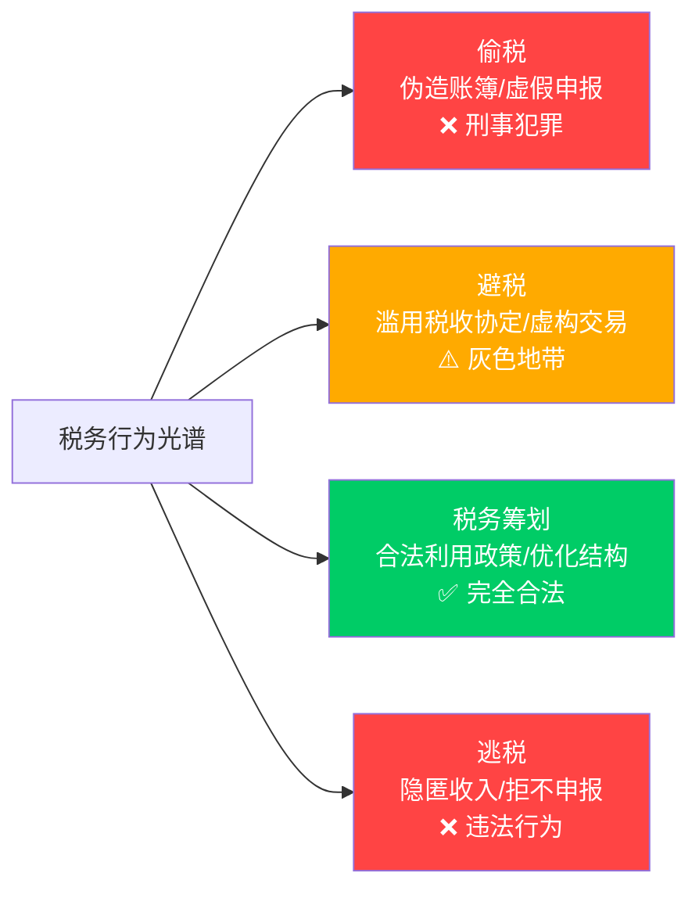

# 第三十章 税务筹划

## 章节概述

税务筹划（Tax Planning）是指纳税人在法律允许的范围内，通过对经营、投资、理财等活动的事先规划和安排，充分利用税法提供的优惠政策和选择空间，实现税负最小化、税后收益最大化的合法行为。它不是钻法律空子，而是运用法律智慧——在税法的"灰色地带"找到最优解。

本章将从中国税制的基础框架出发，逐层深入到个人所得税优化、投资税务策略、企业税务筹划、跨境税务规划，最终落到10个真实场景的实战案例。无论你是月薪一万的工薪族、年入百万的自由职业者，还是经营企业的创业者，都能在本章找到适合自己的税务优化方案。

> 税务筹划的本质是**信息差**和**时间差**。信息差——你知道别人不知道的优惠政策；时间差——你比别人更早做出规划。本章要消除的，正是这两种差距。

***

## 为什么学习税务筹划？

### 税收是人生最大的"隐形支出"

大多数人对税收没有直观感受，因为个税由公司代扣代缴，增值税隐藏在商品价格中，社保从工资里直接扣除。但如果把一生中缴纳的所有税款加总，结果往往令人震惊：

| 收入层级 | 月薪（税前） | 年缴个税（估算） | 30年累计个税 | 同期房贷利息（参考） |
|---------|------------|----------------|------------|-------------------|
| 普通工薪 | 10,000 元 | 约 2,400 元 | 72,000 元 | 约 30 万元 |
| 中产白领 | 25,000 元 | 约 18,000 元 | 540,000 元 | 约 50 万元 |
| 高管阶层 | 50,000 元 | 约 54,000 元 | 1,620,000 元 | 约 80 万元 |
| 企业主 | 年利润 100 万 | 综合税负约 30-40 万 | 900-1,200 万 | — |

**关键洞察**：对于中产以上人群，税收支出可能与房贷利息相当甚至更高。但几乎所有人都会花大量精力研究房贷利率，却很少有人认真研究税务优化。

### 四类人群的税务痛点

**工薪族的困境**：每月工资到账前，个税和社保已经扣掉了一大截。很多人不知道专项附加扣除可以多填、年终奖可以选择单独计税、公积金和企业年金有税优额度。结果是：多交了几千甚至上万元的税，却浑然不知。

**自由职业者的迷茫**：收入不稳定，没有公司代扣代缴，不知道该按"劳务报酬"还是"经营所得"申报。有些自媒体博主年入百万，因为不懂税务规划，实际税负比同收入的企业主高出一倍。

**企业主的焦虑**：企业所得税25%、增值税6-13%、分红个税20%……利润从企业到个人口袋，可能被"吃掉"40%以上。如何合理利用小微企业优惠、研发费用加计扣除、区域性税收政策，直接关系到企业的生存和发展。

**跨境工作者的困惑**：在中国和海外都有收入，面临双重征税风险。CRS（共同申报准则）让海外资产无处隐藏，税务居民身份的判定直接影响全球收入的纳税义务。

### 税务筹划的真实收益

以下是一个具体的收益对比案例：

**案例：月薪 3 万的工程师，年终奖 10 万**

| 项目 | 未筹划 | 合理筹划后 |
|-----|-------|----------|
| 专项附加扣除 | 仅填报了房贷 | 补充填列子女教育、赡养老人、继续教育 |
| 年终奖计税 | 并入综合所得 | 选择单独计税 |
| 公积金比例 | 5% | 提高至 12%（公司同意） |
| 企业年金 | 未参加 | 参加（月缴 1,000 元） |
| **年缴个税** | **约 38,000 元** | **约 24,000 元** |
| **节税金额** | — | **约 14,000 元/年** |

仅仅是用好现有政策，不做任何"灰色操作"，每年就能省下 1.4 万元。30 年就是 42 万——相当于一套小城市的首付。

***

## 税务筹划与偷税漏税的本质区别

这是本章最重要的认知前提。很多人一听到"避税"就联想到违法，其实两者有本质区别：

| 维度 | 偷税漏税 | 税务筹划 |
|-----|---------|---------|
| **合法性** | 违法，刑法可判 3-7 年 | 合法，受法律保护 |
| **时间点** | 事后隐瞒、篡改 | 事前规划、安排 |
| **手段** | 虚开发票、隐匿收入、虚假申报 | 利用优惠政策、调整交易结构、选择纳税方式 |
| **风险** | 补税+罚款+滞纳金+刑事责任 | 风险极低，合规合法 |
| **可持续性** | 随时可能被查处 | 长期可持续 |

**法律依据**：《税收征收管理法》明确规定纳税人有权依法进行税务筹划。国家税务总局多次发文鼓励纳税人充分享受税收优惠政策。合法避税是纳税人的权利，不是特权。

**一个简单的判断标准**：如果你的税务安排需要隐瞒信息才能成立，那就是偷税；如果你的税务安排经得起税务机关的全面审查，那就是筹划。

本章所有的策略和方法，都严格处于"完全合法"的绿色区域。

***

## 本章知识体系总览

本章内容分为四大模块，层层递进：

```mermaid
graph TD
    A[第30章 税务筹划] --> B[模块一：税制基础]
    A --> C[模块二：核心技巧]
    A --> D[模块三：实战案例]
    A --> E[模块四：风险与进阶]

    B --> B1[中国税制概览]
    B --> B2[个人所得税详解]
    B --> B3[增值税基础]
    B --> B4[企业所得税基础]
    B --> B5[其他重要税种]
    B --> B6[税收征管基础]
    B --> B7[税务筹划底层逻辑]

    C --> C1[个人所得税避税策略]
    C --> C2[投资税务优化]
    C --> C3[企业税务筹划]
    C --> C4[跨境税务]
    C --> C5[税务风险防范]
    C --> C6[自由职业者税务]
    C --> C7[数字资产税务]
    C --> C8[家庭税务筹划]

    D --> D1[工薪族个税优化]
    D --> D2[自由职业者税务优化]
    D --> D3[企业主税务筹划]
    D --> D4[房产交易税务优化]
    D --> D5[跨境税务筹划]
    D --> D6[股权转让税务筹划]
    D --> D7[自媒体博主税务转型]
    D --> D8[退休人员收入优化]
    D --> D9[初创企业税务规划]
    D --> D10[跨境电商税务合规]

    E --> E1[常见误区]
    E --> E2[练习方法]
    E --> E3[深度拓展]
```

### 模块一：税制基础（理论层）

这是整章的地基。不理解税制的基本框架，后面的技巧就是空中楼阁。本模块涵盖：

- **中国税制概览**：18 个税种的全景图，理解直接税与间接税的区别，了解中央税、地方税、共享税的分配机制
- **个人所得税详解**：综合所得的计算方法、税率表、扣除项目、汇算清缴的完整流程
- **增值税基础**：一般纳税人与小规模纳税人的区别、进项抵扣机制、发票管理要点
- **企业所得税基础**：应纳税所得额的计算、资产的税务处理、亏损弥补规则
- **其他重要税种**：消费税、印花税、房产税、土地增值税等的适用场景
- **税收征管基础**：税务登记、纳税申报、税务检查的流程和注意事项
- **税务筹划底层逻辑**：这是理论模块的核心——建立税务筹划的思维框架，学会从税法条文中发现筹划空间

### 模块二：核心技巧（方法层）

这是本章的核心价值所在。每个技巧都给出具体的操作步骤、适用条件和风险提示：

- **个人所得税避税策略**：专项附加扣除的深度挖掘、年终奖计税方式选择、股权激励的税务安排
- **投资税务优化**：股票、基金、房产、债券等不同投资品的税负差异和优化路径
- **企业税务筹划**：企业架构设计、小微企业优惠运用、研发费用加计扣除、区域税收政策
- **跨境税务**：CRS 的运作机制、税务居民身份规划、双重征税协定的运用
- **税务风险防范**：金税四期的监控逻辑、常见稽查指标、合规底线
- **自由职业者税务**：劳务报酬 vs 经营所得的选择、个体户核定征收、税务登记策略
- **数字资产税务**：加密货币、NFT、数字藏品的税务处理
- **家庭税务筹划**：夫妻间收入分配、房产登记在谁名下、子女教育的税务优化

### 模块三：实战案例（实操层）

10 个真实场景的完整税务筹划方案，每个案例都包含：背景分析 → 税务诊断 → 筹划方案 → 实施步骤 → 效果对比 → 风险提示。

这些案例覆盖了最常见的税务筹划场景，读者可以直接对照自己的情况进行操作。

### 模块四：风险与进阶（防护层）

- **常见误区**：识别那些看似聪明实则危险的"伪筹划"方案
- **练习方法**：如何持续提升税务筹划能力
- **深度拓展**：国际税收前沿、税务科技、税务筹划的职业发展方向

***

## 学习路径建议

### 路径一：速查模式（30 分钟）

如果你有具体的税务问题需要马上解决：

1. 直接跳到对应的核心技巧章节
2. 阅读相关的实战案例
3. 回头补读案例中提到的理论基础

适合人群：已有一定税务知识，需要快速找到解决方案的读者。

### 路径二：系统学习（1 周）

如果你想建立完整的税务筹划知识体系：

按模块顺序阅读，每天一个主题，配合实战案例加深理解。建议在阅读过程中同步对照自己的实际情况做笔记。

### 路径三：深度研究（长期）

如果你是财务从业者或对税务有深入研究需求：

1. 完整阅读本章所有内容
2. 结合练习方法章节进行实操训练
3. 关注深度拓展章节中的前沿话题
4. 将税务筹划思维融入日常财务决策

***

## 核心收获

完成本章学习后，你将获得以下能力：

**基础层能力**：
1. 理解中国 18 个税种的基本框架，知道哪些收入需要缴税、税率是多少
2. 掌握个人所得税的完整计算方法，包括综合所得、经营所得、财产转让所得等
3. 了解增值税的进项抵扣机制和发票管理要点

**应用层能力**：
4. 能够独立完成个人年度税务规划，合理利用专项附加扣除、年终奖计税等政策
5. 能够评估不同投资方式的税负差异，选择税务效率最优的投资路径
6. 能够为企业设计基本的税务优化方案，合法降低综合税负

**高阶层能力**：
7. 能够识别常见的税务风险信号，避免踏入"伪筹划"的陷阱
8. 具备跨境税务的基本判断能力，了解 CRS、税务居民身份等核心概念
9. 建立税务筹划的底层思维框架，面对新型业务场景能够自主分析筹划方案

***

## 关键术语速查

在阅读本章之前，建议先熟悉以下核心术语：

| 术语 | 含义 | 首次出现位置 |
|-----|------|-----------|
| 综合所得 | 工资薪金、劳务报酬、稿酬、特许权使用费四项合并计税 | 理论基础·个人所得税 |
| 专项附加扣除 | 子女教育、继续教育、大病医疗、房贷利息、住房租金、赡养老人、婴幼儿照护 | 核心技巧·个税策略 |
| 年终奖单独计税 | 将全年一次性奖金不并入综合所得，单独按月度税率表计算 | 核心技巧·个税策略 |
| 小微企业优惠 | 年应纳税所得额 ≤300 万的企业享受 5% 实际税率 | 核心技巧·企业税务 |
| 加计扣除 | 研发费用在实际发生额基础上额外扣除一定比例（目前 100%） | 核心技巧·企业税务 |
| 增值税进项抵扣 | 一般纳税人可以用购进货物/服务的进项税额抵扣销项税额 | 理论基础·增值税 |
| CRS | 共同申报准则（Common Reporting Standard），各国自动交换税务居民的海外金融账户信息 | 核心技巧·跨境税务 |
| 税务居民 | 在中国境内有住所，或无住所但在一个纳税年度内居住满 183 天的个人 | 核心技巧·跨境税务 |
| 双重征税协定 | 两个国家/地区之间签订的避免对同一收入重复征税的协议 | 核心技巧·跨境税务 |
| 金税四期 | 国家税务总局建设的第四期税务信息系统，具备大数据分析和智能稽查能力 | 核心技巧·风险防范 |

***

## 本章适用的法律法规依据

本章所有内容基于以下现行有效的法律法规，读者在实际操作时应以最新法规为准：

| 法律法规 | 核心内容 | 施行日期 |
|---------|---------|---------|
| 《中华人民共和国个人所得税法》（2018 修正） | 个人所得税的纳税人、税率、扣除项目、征管方式 | 2019年1月1日 |
| 《中华人民共和国企业所得税法》 | 企业所得税的税率、优惠政策、资产处理 | 2008年1月1日（多次修正） |
| 《中华人民共和国增值税法》 | 增值税的纳税人、税率、征收方式 | 2026年1月1日 |
| 《中华人民共和国税收征收管理法》 | 税务登记、纳税申报、税务检查、法律责任 | 2001年5月1日（多次修正） |
| 《个人所得税专项附加扣除暂行办法》 | 六项专项附加扣除的具体标准和操作办法 | 2019年1月1日 |
| 《关于个人所得税法修改后有关优惠政策衔接问题的通知》 | 年终奖过渡期政策、股权激励等优惠的衔接安排 | 2019年1月1日 |

***

> **开篇寄语**：世界上只有两件事是确定的——死亡和税收。我们无法避免死亡，但可以通过合法的方式优化税收。学习税务筹划，不是教你偷税漏税，而是教你用法律的智慧保护自己的财富。一个懂税务筹划的人，和一个不懂的人，在同等收入条件下，30年后的财富差距可能是百万级别。这，就是知识的力量。
