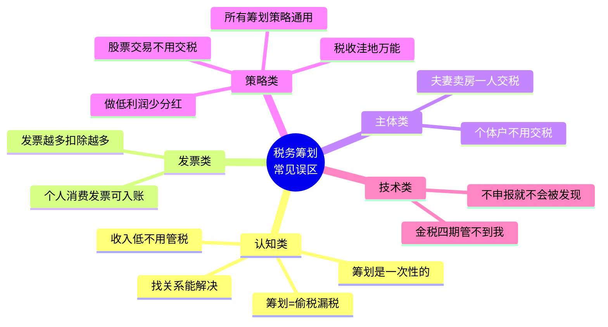
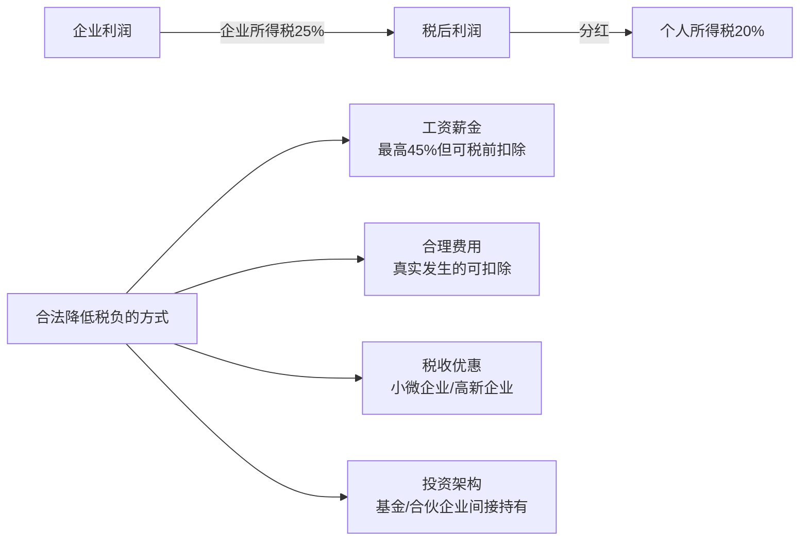
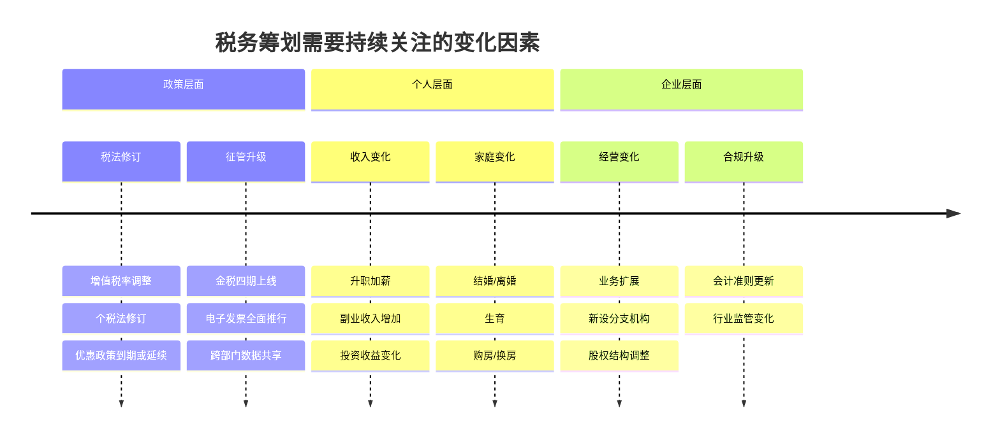
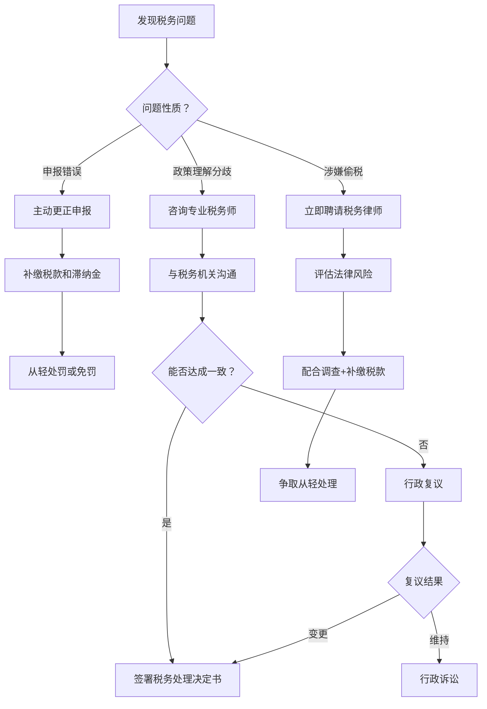

# 第三十章 税务筹划 — 常见误区

税务筹划是合法降低税负的专业行为，但公众对其存在大量认知偏差。这些误区轻则让人错失合法节税机会，重则踩中法律红线，面临补税、滞纳金甚至刑事责任。本章系统梳理税务筹划中最常见的认知误区，逐一拆解真相、给出纠正方案，并辅以真实案例和法律依据，帮助读者建立正确的税务思维。

## 误区全景图



---

## 误区一：税务筹划就是偷税漏税

### 误区描述

很多人将"税务筹划"与"偷税漏税"混为一谈，认为所有减少纳税的行为都是违法的。这种认知导致两种极端：要么放弃合法节税机会白白多交税，要么以"筹划"之名行偷税之实。

### 真相：三者有本质法律边界

税务筹划、避税、偷税漏税是三个完全不同的概念，法律后果差异巨大：

| 维度 | 税务筹划（合法） | 避税（灰色地带） | 偷税漏税（违法） |
|------|------------------|------------------|------------------|
| **法律定性** | 完全合法，受法律保护 | 不违法但可能被反避税调整 | 违法犯罪 |
| **实现方式** | 利用税法赋予的选择权和优惠政策 | 利用税法漏洞或模糊地带 | 伪造、隐瞒、虚假申报 |
| **时间节点** | 事前规划，业务发生前布局 | 事前或事中安排 | 事后隐瞒或篡改 |
| **典型手段** | 专项附加扣除、企业架构优化 | 关联交易定价、转让定价 | 虚开发票、隐匿收入、两套账 |
| **法律后果** | 合法节税，受法律保护 | 纳税调整+补税+加收利息 | 补税+0.5-5倍罚款+滞纳金+刑事责任 |
| **刑事风险** | 无 | 无（但可能被认定为偷税） | 逃避缴纳税款罪：3-7年有期徒刑 |

### 法律依据

- **《税收征收管理法》第六十三条**：纳税人伪造、变造、隐匿、擅自销毁帐簿、记帐凭证，或者在帐簿上多列支出或者不列、少列收入，构成偷税的，由税务机关追缴其不缴或者少缴的税款、滞纳金，并处不缴或者少缴的税款百分之五十以上五倍以下的罚款；构成犯罪的，依法追究刑事责任。
- **《刑法》第二百零一条**（逃税罪）：逃避缴纳税款数额较大并且占应纳税额百分之十以上的，处三年以下有期徒刑或者拘役；数额巨大并且占应纳税额百分之三十以上的，处三年以上七年以下有期徒刑。
- **特别条款**：经税务机关依法下达追缴通知后，补缴应纳税款，缴纳滞纳金，已受行政处罚的，不予追究刑事责任（五年内因逃避缴纳税款受过刑事处罚或被税务机关给予二次以上行政处罚的除外）。

### 真实案例

**案例：某网红主播偷逃税案（2021年）**

某头部主播通过设立个人独资企业，将个人劳务报酬转换为企业经营所得，同时隐匿佣金收入，虚假申报。税务机关认定其偷逃税款6.43亿元，追缴税款、加收滞纳金并处罚款共计13.41亿元。

关键区别：如果该主播仅通过合法设立企业、合理规划收入类型进行税务筹划（如将部分收入确认为经营所得并据实申报），这是合法的。但其核心违法行为是**隐匿收入和虚假申报**，这才是偷税。

### 正确理解

税务筹划的三要素：**合法性、事前性、目的正当性**。

1. **合法性**：所有操作必须在现行法律框架内进行
2. **事前性**：必须在纳税义务发生之前进行规划，事后"操作"就是造假
3. **目的正当性**：必须有合理的商业目的，不能仅为避税而设立壳公司

---

## 误区二：收入不高就不用关心税务

### 误区描述

很多工薪族认为自己的收入不高，税务问题与自己无关，因此不关心税收政策，不填报专项附加扣除，不进行年度汇算清缴。

### 真相：低收入群体反而节税空间大

中国的个人所得税制度设计了多层次的扣除机制，收入越低，每一元扣除带来的边际节税效果可能越明显（相对于总收入占比而言）。

### 工薪族常见遗漏的节税项目

| 扣除项目 | 年度扣除上限 | 适用条件 | 典型节税金额（月薪1万） |
|----------|-------------|---------|----------------------|
| 子女教育 | 每个子女每月2000元 | 3岁至博士阶段在读 | 1个孩子年省1,200-2,400元 |
| 继续教育 | 学历400元/月；职业资格3,600元/年 | 在学或取得证书当年 | 年省480-3,600元 |
| 大病医疗 | 超1.5万部分，上限8万/年 | 医保目录内自付部分 | 视医疗支出而定 |
| 住房贷款利息 | 每月1,000元 | 首套房贷，最长240个月 | 年省1,200元 |
| 住房租金 | 每月800-1,500元 | 工作城市无房 | 年省960-1,800元 |
| 赡养老人 | 每月3,000元 | 父母年满60岁 | 年省3,600元 |
| 3岁以下婴幼儿照护 | 每个婴幼儿每月2,000元 | 3岁以下 | 年省2,400元/孩 |

**计算示例**：月薪1万，扣除五险一金约2,000元，应纳税所得额 = 10,000 - 5,000（起征点）- 2,000（五险一金）= 3,000元。

- 不填任何专项附加扣除：每月个税 = 3,000 × 3% = 90元，全年1,080元
- 填报赡养老人（3,000元）+ 住房贷款利息（1,000元）：应纳税所得额 = 3,000 - 4,000 < 0，**全年个税为0**
- 节税效果：每年省下1,080元，相当于月薪涨了90元

### 年度汇算清缴的"退税红利"

很多工薪族不知道，年度汇算清缴可能获得退税：

- **年中换工作**：新单位重新累计扣除，可能导致多缴税
- **年中有未扣除项**：年中才填报专项附加扣除，前几个月多缴了税
- **年收入波动**：某些月份收入高被多预扣，年度汇总后适用低税率

2024年度个税汇算数据显示，超过70%的办理者获得了退税，人均退税约1,200元。

### 正确做法

1. **立即填报**：登录"个人所得税"APP，逐项检查可享受的专项附加扣除
2. **年度汇算**：每年3月1日至6月30日办理上一年度汇算清缴，不要放弃可能的退税
3. **信息更新**：家庭状况变化（生育、购房、父母退休等）及时更新扣除信息
4. **夫妻协商**：部分扣除项目（如子女教育、房贷利息）夫妻可约定由一方扣除，选择收入高、税率高的一方扣除更划算

---

## 误区三：发票越多税前扣除越多

### 误区描述

一些企业主和财务人员认为，只要拿到发票就能税前扣除，因此大量收集发票甚至购买发票来增加扣除。

### 真相：发票扣除有严格的"四性"要求

企业所得税税前扣除凭证必须同时满足以下条件：

```mermaid
flowchart TD
    A[取得发票/凭证] --> B{真实性？}
    B -->|否| X[❌ 不可扣除<br>可能构成虚开发票罪]
    B -->|是| C{合法性？}
    C -->|否| X
    C -->|是| D{关联性？]
    D -->|否| X2[❌ 不可扣除<br>与经营无关的支出]
    D -->|是| E{合理性？]
    E -->|否| X3[❌ 不可扣除<br>金额明显不合理]
    E -->|是| F[✅ 可以税前扣除]
```

### 虚开发票的法律后果

虚开发票是税务领域最严重的违法行为之一，打击力度远超一般偷税：

| 违法类型 | 法律依据 | 处罚标准 |
|----------|---------|---------|
| 虚开增值税专用发票 | 《刑法》第205条 | 税额较大：3年以下；巨大：3-10年；特别巨大：10年以上或无期 |
| 虚开普通发票 | 《刑法》第205条之一 | 情节严重：2年以下；情节特别严重：2-7年 |
| 为自己虚开 | 同上 | 同等处罚 |
| 介绍他人虚开 | 同上 | 同等处罚 |

**关键认知**：虚开发票不要求"金额大"才立案。根据最高检、公安部标准，虚开增值税专用发票税额10万元以上即达到立案标准。

### 常见的发票违规场景

**场景一：个人消费混入企业账**

老板用公司账户买了一部手机（个人使用），取得了公司抬头的增值税专用发票。这张发票：不能在企业所得税前扣除（与经营无关），进项税额不能抵扣（用于个人消费）。如果强行入账，属于虚假列支。

**场景二：找票冲账**

企业实际发生了费用但无法取得发票（如向个人采购），于是找其他发票"冲账"。这是典型的虚开发票行为，发票内容与实际交易不符。

**场景三：大额办公用品发票**

大量开具"办公用品"、"劳保用品"发票，实际用于招待或个人消费。金税四期系统会自动监控企业办公用品支出与经营规模的匹配度，异常高比例会被预警。

### 正确的发票管理原则

1. **以业务为起点**：先有真实业务，再取得发票，而不是先找发票再编业务
2. **三流一致**：合同流、资金流、发票流三者一致，发票的购买方、销售方、金额与实际交易匹配
3. **及时取得**：费用发生后及时索取发票，跨年发票处理复杂
4. **分类归档**：按费用类别归档，便于税务检查时快速提供
5. **小额零星例外**：单次500元以下的零星支出，凭收款凭证（载明姓名、身份证号、支出项目、金额）即可税前扣除，无需发票

---

## 误区四：个体户不需要交税

### 误区描述

很多人认为注册个体户就可以"免税"或"少交税"，因此大量自由职业者、网红、咨询顾问选择注册个体户来"避税"。

### 真相：个体户有完整的纳税义务

个体户需要缴纳的税种：

| 税种 | 计税方式 | 2025年优惠政策 |
|------|---------|---------------|
| **增值税** | 按销售额计征 | 小规模纳税人月销售额≤10万（季度≤30万）免征；超过按1%征收 |
| **个人所得税（经营所得）** | 按利润计征 | 年应纳税所得额≤200万部分减半征收 |
| **附加税** | 随增值税附征 | 增值税免征时同步免征 |
| **印花税** | 按合同金额计征 | 小规模纳税人减半征收 |

### 经营所得税率表

| 级数 | 全年应纳税所得额 | 税率 | 速算扣除数 |
|------|-----------------|------|-----------|
| 1 | ≤30,000元 | 5% | 0 |
| 2 | 30,000-90,000元 | 10% | 1,500 |
| 3 | 90,000-300,000元 | 20% | 10,500 |
| 4 | 300,000-500,000元 | 30% | 40,500 |
| 5 | >500,000元 | 35% | 65,500 |

### 核定征收 vs 查账征收

很多个体户被"核定征收"吸引，认为核定征收等于低税率。需要区分两种情况：

**查账征收**：按实际利润计税，需要规范的账簿记录。利润 = 收入 - 成本 - 费用。如果成本费用票据齐全，实际税负可能低于核定征收。

**核定征收**：税务机关按行业利润率核定应纳税所得额，适用于账簿不健全的小规模经营者。核定应税所得率通常为5%-20%（因行业而异）。

**计算对比**：某个体户年收入100万元

- 查账征收（利润率30%，成本费用票据齐全）：应纳税所得额 = 30万，个税 = 300,000 × 20% - 10,500 = 49,500元
- 核定征收（应税所得率10%）：应纳税所得额 = 10万，个税 = 100,000 × 10% - 1,500 = 8,500元（减半后4,250元）

核定征收看似划算，但**风险在于**：如果实际利润率高于核定率，税务机关有权重新核定；如果被认定为利用核定征收规避高收入人群的个税（如将劳务报酬转为经营所得），可能被纳税调整。

### 个体户的合规要点

1. **独立核算**：个体户的经营收支必须与业主个人收支分开
2. **如实申报**：即使享受免税政策，也需要按期进行纳税申报（零申报也必须报）
3. **发票管理**：个体户可以开具发票，但必须基于真实业务
4. **社保义务**：雇佣员工的个体户需要为员工缴纳社保
5. **政策变化**：核定征收政策正在逐步收紧，依赖核定征收的税务规划需要有备选方案

---

## 误区五：注册在税收洼地就万事大吉

### 误区描述

一些人认为只要在所谓的"税收洼地"（如某些有财政返还政策的园区）注册公司或个体户，就能永久享受低税率，甚至将此作为万能的避税手段。

### 真相：税收洼地的利用有严格限制

**什么是税收洼地？** 指地方政府为招商引资而提供的区域性税收优惠政策，主要包括：

| 类型 | 机制 | 典型区域 | 持续性 |
|------|------|---------|--------|
| 财政返还 | 地方留存部分按比例返还企业 | 部分经济开发区、产业园区 | 受地方财政影响大 |
| 核定征收 | 按低核定率征收个税/企业所得税 | 部分地区个体户园区 | 正在收紧 |
| 税收减免 | 特定行业的企业所得税优惠 | 海南自贸港、西部大开发地区 | 相对稳定 |
| 人才补贴 | 高端人才个税返还 | 粤港澳大湾区、海南 | 有条件限制 |

### 税收洼地利用失败的典型原因

**原因一：无实质性经营**

在洼地注册空壳公司，实际经营在其他地方。税务机关按照"实质重于形式"原则，可以否定其享受优惠的资格。

**法律依据**：《税收征收管理法》第三十五条——纳税人申报的计税依据明显偏低，又无正当理由的，税务机关有权核定其应纳税额。

**原因二：关联交易定价不合理**

将利润通过关联交易转移到洼地的低税率公司，但定价不符合独立交易原则。税务机关可以进行特别纳税调整。

**原因三：地方政策不稳定**

地方政府的财政返还是行政承诺而非法律规定，受地方财政状况影响大。近年来多个园区出现返还不兑现、延迟兑现甚至取消承诺的情况。

**原因四：金税四期穿透监管**

金税四期系统实现了全国税务数据的互联互通，跨区域的异常交易模式会被自动识别。

### 税收洼地的正确使用方式

1. **选择有法律依据的优惠**：优先选择国家层面立法确定的优惠（如海南自贸港、西部大开发），而非仅靠地方行政承诺
2. **确保实质经营**：在洼地有真实的办公场所、人员、业务活动
3. **保持合理商业目的**：设立洼地公司必须有合理的商业逻辑，而非仅为避税
4. **留存完整证据链**：保留办公场所租赁合同、员工社保缴纳记录、业务合同和资金流水
5. **动态跟踪政策**：定期评估优惠政策的持续性，做好退出预案

---

## 误区六：分红前把利润做低就能少交税

### 误区描述

企业主在公司分红前，通过虚列费用、虚构交易等方式将账面利润做低，以减少分红时需要缴纳的20%个人所得税。

### 真相：人为压低利润是偷税行为

企业分红的税收链条：



### 常见的"做低利润"手段及其后果

| 手段 | 操作方式 | 法律后果 |
|------|---------|---------|
| 虚列成本 | 编造采购合同、虚假入库 | 偷税：补税+0.5-5倍罚款 |
| 虚列工资 | 虚构员工、虚增工资 | 偷税：补税+罚款+代扣个税 |
| 虚构服务费 | 向关联方支付虚假咨询费 | 偷税+可能构成虚开发票 |
| 隐瞒收入 | 不开票收入不入账 | 偷税：补税+罚款+滞纳金 |
| 费用个人化 | 个人消费计入公司费用 | 偷税：补税+罚款 |

### 合法降低分红税负的方法

**方法一：合理薪酬设计**

企业主给自己发放合理的工资薪金。工资薪金可以在企业所得税前扣除（减少25%的企业所得税），虽然个人需要缴纳个税（最高45%），但在一定金额范围内综合税负低于"先交25%企业所得税再交20%分红个税"。

**临界点计算**：

- 企业所得税率25% + 分红个税20%：综合税负 = 1 - (1-25%) × (1-20%) = 40%
- 工资薪金的边际税率：月薪3万以内综合税率约20%-25%
- **结论**：年工资在36万以内时，发工资比分红更省税（假设企业所得税率25%）

**方法二：利用小微企业优惠**

小型微利企业年应纳税所得额≤300万元，实际税负约5%。通过合理控制企业规模，可以大幅降低企业所得税，从而间接降低分红的综合税负。

**方法三：合理利用再投资**

将利润用于再投资（扩大经营、研发创新等），可以享受研发费用加计扣除（100%-120%）等税收优惠，同时避免了分红的即时税负。

**方法四：通过持股平台间接持有**

通过有限合伙企业或基金间接持有公司股权，利用合伙企业"先分后税"的机制和部分地区对创投基金的税收优惠。

---

## 误区七：个人买卖股票不用交税

### 误区描述

很多个人投资者认为股票交易完全免税，不需要关注任何税务问题。

### 真相：个人股票交易涉及多种税收，规则复杂

**A股个人投资者税收全景**：

| 交易类型 | 税种 | 税率 | 政策依据 | 备注 |
|----------|------|------|---------|------|
| 买卖差价（资本利得） | 个人所得税 | 暂免 | 财税字〔1998〕61号 | 仅限境内上市公司股票 |
| 股息红利（持股≤1个月） | 个人所得税 | 20% | 财税〔2015〕101号 | 全额征收 |
| 股息红利（1个月<持股≤1年） | 个人所得税 | 10% | 同上 | 减半征收 |
| 股息红利（持股>1年） | 个人所得税 | 免征 | 同上 | 免税 |
| 卖出股票 | 印花税 | 0.05% | 《印花税法》2022年 | 仅卖方缴纳 |
| 股票转让（非上市） | 个人所得税 | 20% | 《个人所得税法》 | 按"财产转让所得"缴纳 |

### 容易忽略的税务场景

**场景一：限售股解禁卖出**

限售股（IPO前持有的股份、定增股份等）卖出时，需要缴纳20%的个人所得税。计算公式：应纳税额 = (卖出收入 - 取得成本) × 20%。如果无法提供取得成本凭证，按卖出收入的15%核定成本。

**场景二：新三板股票交易**

新三板股票交易的税务规则与A股不同。个人转让新三板股票，目前暂免征收个人所得税（财税〔2018〕137号），但股息红利仍需按持股期限纳税。

**场景三：港股通**

通过港股通买卖港股：资本利得暂免个税（与A股一致），股息红利按20%税率由中登公司代扣代缴（H股）或按10%税率（非H股，有税收协定优惠）。

**场景四：美股投资**

中国税务居民投资美股：理论上全球收入需要在中国申报纳税，资本利得适用20%税率。实际执行中，由于跨境信息交换机制的限制，主动申报者较少，但随着CRS（共同申报准则）的推进，合规压力在增加。

### 实操建议

1. **持仓策略**：对高股息股票，考虑持股超过1年以享受免税
2. **亏损利用**：A股资本利得虽然暂免，但如果未来政策变化，记录交易亏损可能有用
3. **限售股规划**：限售股解禁前做好税务规划，考虑分批卖出平滑税负
4. **跨境投资**：美股等海外投资的收益，了解中国的申报义务和外国的预扣税

---

## 误区八：夫妻共同财产卖房只需一人交税

### 误区描述

很多夫妻认为房产出售时只需要产权证上的人处理税务问题，另一方不需要关注。

### 真相：税务处理以"家庭"为单位

中国房地产交易税收中，多个关键概念都以"家庭"为单位认定：

**"满五唯一"免税政策的家庭认定**：

- **满五**：房产证或契税完税证明满5年
- **唯一**：该房产是**家庭**（夫妻双方及未成年子女）在该省份范围内的唯一住房
- **认定范围**：不动产登记系统中查询夫妻双方名下所有房产

**契税优惠的家庭认定**：

- 首套房/二套房的认定以家庭为单位
- 夫妻双方及未成年子女名下的房产合并计算
- 在不同城市购买的房产也需要合并认定（跨省联网已基本实现）

### 夫妻房产交易的税务优化策略

**策略一：充分利用各自的"满五唯一"名额**

如果夫妻名下各有1套房产，可以通过"换房"的方式充分利用各自的免税名额。例如：先卖A房（夫名下，满五唯一），再买新房；然后卖B房（妻名下，满五唯一），再买新房。

**策略二：离婚析产的税务考量（注意风险）**

通过离婚将房产分配给一方，使另一方获得"无房"资格，再购房享受首套房优惠。但这种方式存在法律风险和道德争议，且近年来税务机关已加强对"假离婚真避税"的监控。

**策略三：婚前/婚后购房的税务差异**

- 婚前一方购房：属于个人财产，出售时按该方名下房产计算
- 婚后购房：属于共同财产，出售时按双方名下房产合并计算
- 父母出资购房：赠与和借贷的定性影响产权归属，进而影响税务处理

### 常见的家庭房产税务陷阱

| 陷阱 | 描述 | 后果 |
|------|------|------|
| 误判"唯一" | 只看产权人名下，忽略配偶名下 | 不满足"满五唯一"条件，需缴纳个税 |
| 误判"满五" | 以合同签订日或入住日计算 | 以房产证或契税完税证明日期为准 |
| 忽略未成年子女 | 子女名下有房产也影响家庭认定 | 家庭"唯一"不成立 |
| 跨省房产遗漏 | 不同省份的房产未合并计算 | 契税优惠可能不适用 |

---

## 误区九：税务筹划是一次性的事情

### 误区描述

很多人认为税务筹划只需要做一次，做完就可以"一劳永逸"。

### 真相：税务筹划是持续的动态过程

税务环境处于持续变化中，以下因素都会影响税务筹划方案的有效性：



### 年度税务健康检查清单

建议每年至少进行一次全面的税务健康检查，检查以下项目：

**个人层面**：
- [ ] 专项附加扣除信息是否更新（新增/变更扣除项）
- [ ] 是否完成了年度汇算清缴
- [ ] 投资收益的税务处理是否正确（股息、基金分红等）
- [ ] 房产交易的税务影响是否已评估
- [ ] 跨境收入（如有）是否已申报

**企业层面**：
- [ ] 税收优惠政策是否仍适用（资格条件是否仍满足）
- [ ] 发票管理是否合规（三流一致）
- [ ] 关联交易定价是否合理
- [ ] 税务申报是否及时准确
- [ ] 税务风险指标是否正常（税负率、费用率等与行业对比）

### 政策变化的关键时间节点

| 时间 | 关注事项 |
|------|---------|
| 每年1月 | 新年度税收政策生效，检查优惠政策延续情况 |
| 每年3-6月 | 个人所得税年度汇算清缴 |
| 每年5月31日前 | 企业所得税年度汇算清缴 |
| 每季度末 | 增值税、企业所得税季度预缴 |
| 不定期 | 关注国务院、财政部、税务总局发布的政策文件 |

---

## 误区十：找关系就能解决税务问题

### 误区描述

一些企业主在遇到税务问题时，首先想到的是"找关系"、"走后门"，而不是寻求专业的法律和税务帮助。

### 真相：金税四期时代，"关系"已经失效

**金税四期的核心能力**：

| 能力 | 具体表现 | 对"找关系"的影响 |
|------|---------|-----------------|
| 大数据比对 | 银行流水、社保数据、发票数据、工商数据全面打通 | 人为无法掩盖数据异常 |
| 智能预警 | 系统自动监控异常指标（税负率、费用率、收入成本比等） | 预警在基层之前触发 |
| 实时监控 | 电子发票实时上传、资金流实时监控 | "事后补救"窗口极小 |
| 跨部门共享 | 税务与银行、海关、公安、市场监管等部门数据互通 | 一个部门的发现所有部门共享 |
| 溯源追踪 | 电子发票全生命周期追踪，虚开发票链条可完整追溯 | 层层转开的虚开发票一网打尽 |

**"找关系"的现实后果**：

1. **关系本身构成犯罪**：行贿税务工作人员构成行贿罪，处五年以下有期徒刑或拘役
2. **关系无法消除数据**：系统中的异常数据不会因为"关系"而消失
3. **关系带来更大风险**：税务工作人员受贿后可能"保你"一时，但轮岗、审计、倒查时暴露的风险更大
4. **关系成本远超合规成本**：维护"关系"的费用往往远超请专业税务师的费用

### 遇到税务问题的正确处理流程



### 纳税人的合法权利

很多人不知道，纳税人面对税务机关时有明确的法定权利：

1. **知情权**：有权了解税收法律法规和纳税程序
2. **保密权**：税务机关对纳税人商业秘密和个人隐私负有保密义务
3. **陈述申辩权**：对税务处理决定有权陈述和申辩
4. **申请行政复议权**：对税务处理决定不服，可在60日内申请行政复议
5. **提起行政诉讼权**：对复议决定不服，可在15日内提起行政诉讼
6. **申请国家赔偿权**：税务机关违法行使职权造成损害的，有权申请赔偿
7. **申请延期缴纳税款权**：因特殊困难不能按期缴纳税款的，经省级税务机关批准可延期（最长3个月）

---

## 误区十一：所有税务筹划策略对所有人都适用

### 误区描述

从网上或朋友那里学到一个节税方法，就认为可以直接套用在自己身上。

### 真相：税务筹划必须因人而异

税务筹划方案的有效性取决于纳税人的具体条件，包括：

| 差异维度 | 影响因素 | 举例 |
|----------|---------|------|
| 收入水平 | 决定适用税率和扣除效果 | 年入50万和年入500万的筹划策略完全不同 |
| 收入结构 | 工资、经营、投资、财产转让等 | 工资为主的应优化扣除，经营为主的应优化组织形式 |
| 所在地区 | 地方税收政策和征管尺度不同 | 同一策略在不同省份可能效果差异巨大 |
| 行业属性 | 不同行业享受不同的优惠政策 | 高新技术企业15%所得税率，普通企业25% |
| 家庭状况 | 婚姻、子女、父母影响扣除 | 有3个孩子的家庭和单身人士的扣除方案完全不同 |
| 风险偏好 | 激进vs保守的筹划策略 | 灰色地带策略风险高，保守策略收益低 |

### 案例：同一策略在不同人身上的效果差异

**策略：将部分收入转为经营所得（设立个体户/个独企业）**

- **适合的人**：年收入100万+的自由职业者、有大量可扣除成本费用的经营者
- **不适合的人**：年收入20万的工薪族（综合所得边际税率仅10%，转为经营所得可能税负更高）、没有真实业务的空壳操作（被认定为虚假筹划）
- **风险人群**：高收入人群大量使用此策略，已被税务机关重点关注

### 如何制定适合自己的筹划方案

1. **全面梳理收入来源**：列出所有收入类型、金额、支付方
2. **评估现有扣除**：检查所有可享受的扣除项目是否已充分利用
3. **咨询专业人士**：税务师或税务律师根据你的具体情况设计方案
4. **测算综合税负**：比较不同方案的税负，选择最优方案
5. **评估风险承受能力**：在合法范围内选择与自己风险偏好匹配的策略
6. **定期复盘调整**：至少每年重新评估一次方案的有效性

---

## 误区十二：不申报就不会被发现

### 误区描述

有些人认为只要不主动申报收入（尤其是现金收入、自媒体收入、网络经营收入等），税务机关就发现不了。

### 真相：金税四期让"不申报"几乎不可能隐藏

**税务机关获取信息的渠道**：

| 数据来源 | 可获取信息 | 应用场景 |
|----------|-----------|---------|
| 银行系统 | 个人和企业账户的资金进出 | 大额资金流动监控、未申报收入识别 |
| 第三方支付 | 支付宝、微信支付交易记录 | 网络经营收入监控 |
| 电商平台 | 淘宝、京东、拼多多等平台交易数据 | 网店经营者收入监控 |
| 社保系统 | 社保缴纳记录 | 识别"挂靠"和虚假劳动关系 |
| 不动产登记 | 房产交易和持有信息 | 房产税源管理 |
| 公安系统 | 出入境记录、车辆信息 | 高消费人群与申报收入不匹配识别 |
| 市场监管 | 工商注册信息、股东信息 | 企业经营状况比对 |
| 海关系统 | 进出口数据 | 跨境交易监控 |

**典型案例**：

2023年，某地税务机关通过比对电商平台数据和个人所得税申报数据，发现大量网店经营者未申报收入。税务机关要求相关纳税人补缴税款并加收滞纳金，部分金额较大且拒不配合的被移送公安机关。

### 主动申报 vs 被动发现的后果对比

| 情形 | 主动补申报 | 被税务机关查到 |
|------|-----------|---------------|
| 税款 | 补缴 | 补缴 |
| 滞纳金 | 按日万分之五 | 按日万分之五 |
| 罚款 | 可能免罚或从轻 | 0.5-5倍罚款 |
| 刑事责任 | 一般不追究 | 数额较大可追究 |
| 信用影响 | 较小 | 纳税信用降级，影响贷款、出行等 |

---

## 本节核心要点

1. **税务筹划 ≠ 偷税漏税**：税务筹划是合法的、事前的、有正当商业目的的税负优化行为
2. **收入再低也值得筹划**：专项附加扣除、年度汇算清缴可以让工薪族每年省下数千元
3. **发票管理是红线**：虚开发票是刑事犯罪，远比偷税严重
4. **个体户和税收洼地不是万能药**：必须有实质经营，政策正在收紧
5. **金税四期时代无处遁形**：大数据监管让偷税漏税和"找关系"都失去了可行性
6. **筹划必须因人而异**：照搬他人的方案可能适得其反
7. **筹划是持续过程**：政策变化、个人变化、企业变化都要求定期调整
8. **合法节税是纳税人权利**：充分利用法律赋予的优惠政策和扣除项目，是完全正当的

> **本节要点**：税务筹划的十二大误区反映了公众对税收认知的常见偏差。最核心的两点启示：一是税务筹划必须在法律框架内进行，与偷税漏税有本质区别；二是在金税四期时代，大数据监管能力空前强大，合规经营是唯一正确的选择。学习税务知识的目的不是钻法律的空子，而是在法律允许的范围内最大化自己的合法权益。建议读者每年进行一次税务健康检查，遇到复杂问题及时咨询专业税务师，让合法节税成为个人和家庭财富管理的常态。
