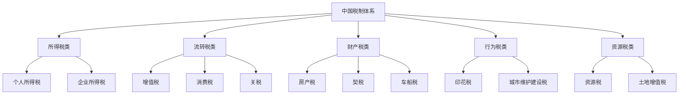
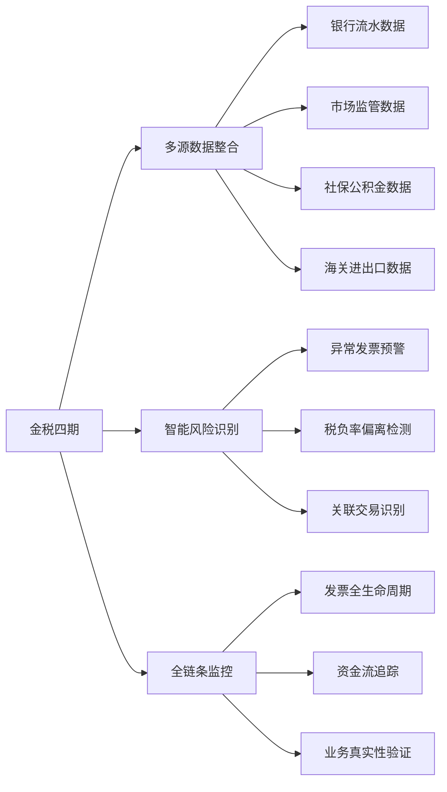

# 第三十章 税务筹划 — 本章小结

本章从税制基础、个人所得税、企业税务、投资优化、跨境税务到风险防范，系统性地构建了一套完整的税务筹划知识体系。本小结将对全章核心内容进行结构化回顾，提炼关键要点，并为不同读者群体制定差异化的行动路线图。

## 一、全章知识体系回顾

### 1.1 中国税制全景

中国现行18个税种，构成一个层次分明的税制体系。理解这个体系是进行一切税务筹划的前提。

与个人和企业关系最密切的三大税种：

| 税种 | 适用对象 | 税率结构 | 筹划空间 |
|------|---------|---------|---------|
| 个人所得税 | 居民个人的综合所得 | 3%-45%七级超额累进 | 专项附加扣除、年终奖拆分、收入类型转化 |
| 增值税 | 销售货物/服务的单位和个人 | 一般纳税人13%/9%/6%；小规模3% | 纳税人身份选择、进项管理、业务拆分 |
| 企业所得税 | 居民企业 | 标准25%；小微5%；高新15% | 税收优惠资格、费用列支、架构设计 |

### 1.2 个人所得税的计算逻辑

个人所得税是绝大多数工薪族最直接面对的税种。其计算遵循一个清晰的逻辑链：

**第一步：确定应纳税所得额**

$$应纳税所得额 = 年收入 - 60{,}000元（基本减除） - 专项扣除 - 专项附加扣除 - 其他扣除$$

其中：
- **基本减除费用**：每月5,000元，全年60,000元，适用于所有纳税人
- **专项扣除**：社保和住房公积金个人缴纳部分，通常占工资的10%-20%
- **专项附加扣除**：七项政策红利，是普通人最容易忽视的节税手段
- **其他扣除**：企业年金、商业健康险、税延养老险等

**第二步：适用税率**

| 级数 | 全年应纳税所得额 | 税率 | 速算扣除数 |
|------|----------------|------|-----------|
| 1 | 不超过36,000元 | 3% | 0 |
| 2 | 36,000-144,000元 | 10% | 2,520 |
| 3 | 144,000-300,000元 | 20% | 16,920 |
| 4 | 300,000-420,000元 | 25% | 31,920 |
| 5 | 420,000-660,000元 | 30% | 52,920 |
| 6 | 660,000-960,000元 | 35% | 85,920 |
| 7 | 超过960,000元 | 45% | 181,920 |

**第三步：计算应纳税额**

$$应纳税额 = 应纳税所得额 \times 税率 - 速算扣除数$$

**案例演示**：某白领年薪40万元，五险一金年缴6万元，有房贷利息（1,000元/月）、赡养老人（3,000元/月）两项专项附加扣除：

- 应纳税所得额 = 400,000 - 60,000 - 60,000 - (1,000+3,000)×12 = 232,000元
- 适用税率20%，速算扣除数16,920
- 应纳税额 = 232,000 × 20% - 16,920 = 29,480元
- 若未申报专项附加扣除，应纳税所得额 = 280,000元，税额 = 280,000 × 20% - 16,920 = 39,080元
- **仅专项附加扣除一项，年省税9,600元**

### 1.3 专项附加扣除的完整清单

七项专项附加扣除是国家给予纳税人的政策红利，每一项都有明确的适用条件和扣除标准：

| 扣除项目 | 扣除标准 | 适用条件 | 注意事项 |
|---------|---------|---------|---------|
| 子女教育 | 2,000元/月/子女 | 年满3岁至博士毕业 | 父母各扣50%或一方扣100% |
| 继续教育 | 400元/月（学历）或3,600元/年（职业资格） | 在学或取得证书当年 | 职业资格需在国家目录内 |
| 大病医疗 | 实际支出超1.5万元部分，最高8万元/年 | 医保目录内自付部分 | 汇算清缴时扣除，需留存票据 |
| 住房贷款利息 | 1,000元/月 | 首套房贷，最长240个月 | 夫妻只能一方扣除 |
| 住房租金 | 800-1,500元/月 | 工作城市无房 | 按城市等级分三档 |
| 赡养老人 | 3,000元/月 | 父母年满60周岁 | 独生子女3,000元，非独生分摊 |
| 3岁以下婴幼儿照护 | 2,000元/月/婴幼儿 | 0-3岁婴幼儿 | 父母各扣50%或一方扣100% |

### 1.4 个人避税策略矩阵

五种主要的个人税务筹划策略，按实施难度和节税效果排列：

**策略一：充分申报专项附加扣除（★☆☆）**

这是最基础、最无风险的节税手段。很多人只知道部分扣除项，导致白白多缴税。建议每年初系统性地检查自己是否遗漏了任何可申报项目。例如，很多年轻人不知道赡养老人扣除从父母满60岁即可开始，不需要实际给付赡养费。

**策略二：年终奖计税优化（★★☆）**

年终奖可以选择单独计税或并入综合所得。两种方式的税负差异可能高达数千甚至上万元。关键决策点：

- 当综合所得应纳税所得额为负数或较低时，并入综合所得更优
- 当综合所得已适用较高税率时，单独计税更优
- 年终奖存在"临界点陷阱"：多发1元可能导致多缴数千元税

年终奖临界点（超过以下金额，税额跳跃式增加）：

| 临界点 | 超过金额 | 多缴税额 |
|--------|---------|---------|
| 36,000 → 36,001 | 1元 | 2,310元 |
| 144,000 → 144,001 | 1元 | 13,200元 |
| 300,000 → 300,001 | 1元 | 16,000元 |
| 420,000 → 420,001 | 1元 | 22,000元 |

**策略三：股权激励递延纳税（★★★）**

上市公司员工取得股权激励，可在不超过12个月内分期缴税。非上市公司符合条件的股权激励可递延至转让时纳税。此策略适用于科技公司、上市公司员工，需要专业税务顾问协助规划。

**策略四：公益捐赠抵税（★★☆）**

通过符合条件的公益性社会组织捐赠，可在应纳税所得额30%以内扣除（部分特殊捐赠可100%扣除）。操作要点：

- 必须通过有税前扣除资格的组织捐赠
- 需取得合规的捐赠票据
- 通过个税APP直接填报最便捷

**策略五：商业健康险和税延养老险（★☆☆）**

购买符合条件的商业健康保险，每年可扣除2,400元（每月200元）；个人税收递延型商业养老保险，每月最高扣除1,000元。虽然节税金额不大，但属于"白捡"的优惠。

## 二、投资领域的税务优化

### 2.1 三大投资品种的税务对比

| 投资品种 | 收益类型 | 税率 | 最优持有策略 |
|---------|---------|------|------------|
| 股票 | 股息红利 | 持有1年以上免税；1月-1年50%计入；1月以内全额 | 长期持有高股息股票，享受免税红利 |
| 股票 | 资本利得 | 境内个人暂免征收 | 无需特别筹划（政策红利期） |
| 公募基金 | 买卖差价 | 暂免征收 | 税务效率最高的权益投资工具 |
| 公募基金 | 分红 | 暂免征收 | 选择红利再投资更高效 |
| 房产 | 增值收益 | 满2年免增值税；满五唯一免个税 | 长期持有+唯一住房可最大化税收优惠 |
| 债券 | 利息 | 国债和地方债免税；企业债20% | 优先配置国债，企业债放在税优账户 |
| 银行存款 | 利息 | 暂免征收 | 无需筹划 |

### 2.2 投资税务优化的核心原则

**原则一：优先使用税优账户**

在有税收优惠的投资工具和渠道中优先配置资产。例如，国债利息免税、公募基金暂免个税，应优先于企业债和银行理财。

**原则二：控制交易频率**

频繁交易不仅增加交易成本，还可能触发税务事件。对于股票投资，持有超过1年可享受股息免税优惠。基金投资的短期赎回费也远高于长期持有。

**原则三：合理安排收益实现时间**

在税率可能变化的情况下，选择合适的时点实现收益。例如，亏损的股票可在年底前卖出实现亏损（虽然目前A股个人资本利得暂不征税，但未来政策可能调整）。

**原则四：善用家庭成员间的税务安排**

夫妻双方收入差距较大时，可将投资资产配置在收入较低的一方名下，降低整体税负。房产交易中"满五唯一"的认定以家庭为单位，需要提前规划。

## 三、企业税务筹划要点

### 3.1 小微企业的税收红利

小微企业是中国税收优惠力度最大的企业类型。判定标准和实际税负：

| 指标 | 标准 |
|------|------|
| 年应纳税所得额 | 不超过300万元 |
| 从业人数 | 不超过300人 |
| 资产总额 | 不超过5,000万元 |
| 实际税率 | 应纳税所得额≤300万部分，实际税负约5% |

与标准税率25%相比，小微企业节省了80%的税负。对于初创企业和中小企业，这是最重要的税收优惠。

**实务提醒**：享受小微优惠的关键是控制三个指标。很多企业在业务扩张后不知不觉突破了标准，需要提前做好税务规划。例如，12月底前将部分业务转移到关联公司，可以保住小微资格。

### 3.2 高新技术企业的税收优势

高新技术企业享受15%的企业所得税税率，同时研发费用可加计扣除100%（制造业企业为120%）。申请条件：

- 拥有核心知识产权
- 高新技术产品收入占比60%以上
- 研发费用占比达标（收入5,000万以下不低于5%；5,000万-2亿不低于4%；2亿以上不低于3%）
- 科技人员占比不低于10%

**筹划建议**：即使不完全满足高新条件，研发费用加计扣除政策仍然适用。企业应建立规范的研发费用核算体系，确保能充分享受加计扣除优惠。

### 3.3 业务拆分与架构设计

**业务拆分**：将一个业务链条中的不同环节拆分为独立的企业，可以分别享受不同的税收优惠。例如：

- 将服务业务从销售企业中分离，适用6%增值税而非13%
- 将设计、咨询等业务独立为小微企业，享受5%所得税
- 将部分业务外包给有税收优惠的企业

**企业架构**：合理的组织形式选择可以显著影响税负。个体工商户、个人独资企业、合伙企业和有限公司各有不同的税收处理方式，需要根据业务规模和性质选择最优形式。

## 四、跨境税务与全球资产配置

### 4.1 税务居民身份判定

中国税务居民需就全球所得向中国纳税。判定标准：

- **住所标准**：在中国有住所（因户籍、家庭、经济利益关系习惯性居住）
- **居住时间标准**：无住所但在一个纳税年度内在中国居住累计满183天

满足任一标准即为中国税务居民。对于在海外有收入或资产的个人，税务居民身份的判定直接影响全球纳税义务。

### 4.2 CRS信息交换

CRS（Common Reporting Standard，共同申报准则）是全球税务透明化的核心机制。中国已于2018年9月首次进行CRS信息交换，覆盖100多个国家和地区。

**CRS交换的信息**：
- 存款账户余额和利息
- 证券账户的股息和资本利得
- 保险合同的现金价值
- 信托的权益信息

**应对策略**：
- 如实申报海外金融资产和收入
- 利用双重征税协定避免重复纳税
- 合理规划资产持有结构（但不可隐瞒或虚假申报）

### 4.3 双重征税协定

中国已与110多个国家和地区签署了避免双重征税协定。协定的核心内容包括：

- 限定来源国的征税税率（如股息通常限制在5%-10%）
- 明确税收抵免规则，避免同一收入被两国同时征税
- 规定相互协商程序，解决税务争议

## 五、税务风险防范与合规经营

### 5.1 金税四期的监管能力

金税四期（智慧税务系统）标志着中国税收征管进入"以数治税"新时代。其核心能力包括：

在金税四期时代，以下行为的风险急剧上升：

- **虚开发票**：包括无真实业务的发票和金额不符的发票，刑事处罚风险
- **隐匿收入**：通过个人账户收款不入账，系统可自动比对银行数据
- **虚假申报**：利用虚假扣除项目或虚假优惠资格少缴税
- **关联交易转移利润**：通过不合理的定价向低税率主体转移利润

### 5.2 十大税务误区深度解析

本章总结了十个最常见的税务认知误区，这里逐一给出纠正方法：

**误区一：税务筹划等于偷税漏税**

纠正：税务筹划是在法律框架内的合法安排，利用税法提供的优惠政策和选择空间降低税负。偷税漏税是故意隐瞒收入或虚报支出的违法行为，两者有本质区别。判断标准是"是否基于真实业务、是否符合立法意图"。

**误区二：收入不高就不需要关注税务**

纠正：即使年收入不足6万元（免征额以下），了解税务知识也有价值。首先，专项附加扣除可以在汇算清缴时申请退税；其次，投资收益的税务处理与收入水平无关；最后，税务知识是个人财务素养的重要组成部分。

**误区三：有发票就能抵扣**

纠正：发票必须基于真实业务才能作为税前扣除凭证。没有真实业务支撑的发票，即使形式合规，也属于虚开发票。金税四期的"四流一致"（合同流、发票流、资金流、货物流）验证机制，可以精准识别虚假发票。

**误区四：个体户不需要缴税**

纠正：个体户需要缴纳增值税和个人所得税（经营所得）。虽然可以享受小规模纳税人免税额度和核定征收等优惠，但必须依法办理税务登记和纳税申报。月销售额10万元以下免征增值税，但经营所得仍需纳税。

**误区五：税收洼地可以随意使用**

纠正：近年来国家大力清理不合规的税收优惠政策。许多所谓的"税收洼地"政策已被取消或收紧。即使某些地方仍有优惠，也需要满足实质性经营条件，不能做空壳公司。霍尔果斯、海南等地的优惠政策都有明确的适用条件和期限。

**误区六：可以通过压低利润避税**

纠正：企业所得税的利润过低（如连续亏损）会触发税务预警。税务机关有权按照合理方法进行纳税调整。关联交易中的转让定价更需要遵循独立交易原则，否则面临特别纳税调整。

**误区七：股票交易不涉及税收**

纠正：虽然个人股票资本利得暂免个税，但股息红利需按持有期限纳税，企业转让股票需缴纳企业所得税，通过基金、信托等间接持股也有不同的税务处理。

**误区八：房产交易只看个人**

纠正：房产交易中的"满五唯一"等优惠以家庭为单位认定。夫妻名下的房产合并计算，家庭成员的住房情况都会影响税务结果。出售前需要全面了解家庭成员的房产状况。

**误区九：做一次税务筹划就够了**

纠正：税务政策持续调整（如2023年个税专项附加扣除标准提高、2024年小微企业优惠延续等），个人和企业的经营状况也在变化。税务筹划需要定期复盘和动态调整，至少每年进行一次全面的税务健康检查。

**误区十：可以绕过金税四期的监管**

纠正：金税四期接入了银行、市场监管、海关、社保等多维数据，可以自动比对和识别异常。在"以数治税"时代，合规经营是唯一正确的选择。试图隐瞒收入或虚开发票，被发现只是时间问题。

## 六、差异化行动路线图

### 6.1 普通工薪族（年收入10-50万）

**立即行动清单**：

1. **今天**：登录个税APP，检查七项专项附加扣除是否全部申报，特别是赡养老人和住房相关扣除
2. **本周**：确认年终奖计税方式（单独计税 vs 并入综合所得），用个税APP的"模拟计算"功能对比两种方式
3. **本月**：检查是否购买了符合条件的商业健康保险，未购买的考虑配置
4. **每年3-6月**：认真完成汇算清缴，确认所有扣除项，可能获得退税

**节税效果预估**：充分利用专项附加扣除+年终奖优化，每年可节省5,000-20,000元税款。

### 6.2 高收入人群（年收入50万以上）

**在普通工薪族的基础上，额外关注**：

1. **股权激励规划**：如有期权/限制性股票，咨询税务顾问制定最优行权和转让计划
2. **公益捐赠策略**：通过有资质的公益组织捐赠，可抵扣30%的应纳税所得额
3. **投资结构优化**：合理配置基金（税务效率最高）和长期持有高股息股票（1年以上股息免税）
4. **海外资产申报**：如有海外金融资产，确保按时申报，利用双重征税协定避免重复征税

**节税效果预估**：综合筹划后，每年可节省20,000-100,000+元税款。

### 6.3 企业主和创业者

**重点关注领域**：

1. **企业类型选择**：根据业务规模选择最优组织形式（小微企业 vs 一般企业 vs 高新技术企业）
2. **业务架构设计**：合理拆分业务链条，分别享受不同税收优惠
3. **研发费用管理**：建立规范的研发费用核算体系，充分享受加计扣除
4. **关联交易合规**：关联交易定价需符合独立交易原则，避免特别纳税调整
5. **发票管理**：严格执行"四流一致"，杜绝虚开发票风险

**节税效果预估**：综合企业税务筹划，可降低实际税负10-30个百分点。

## 七、持续学习与资源推荐

### 7.1 信息获取渠道

- **国家税务总局官网**（www.chinatax.gov.cn）：最权威的政策发布渠道
- **12366纳税服务热线**：税务政策咨询和办税指引
- **个税APP**：个人所得税申报和专项附加扣除填报
- **各地电子税务局**：企业税务申报和发票管理

### 7.2 专业支持建议

以下场景强烈建议寻求专业税务师或注册会计师的帮助：

- 年收入超过100万，涉及多种收入类型
- 买卖房产、股权转让等单笔金额超过100万的交易
- 企业享受高新技术企业、小微企业等优惠政策的申请和维护
- 涉及海外收入和资产的税务申报
- 企业重大重组、并购或上市前的税务规划

## 八、核心理念总结

税务筹划的本质是在法律框架内，通过合理的规划和安排，最大化税后收益。它不是钻法律的空子，而是用法律的智慧保护自己的财富。

三个核心理念贯穿全章：

1. **合规是底线**：金税四期时代，任何违规行为都将无所遁形。合规经营不仅是法律要求，更是最高效的税务策略——避免罚款和滞纳金本身就是最大的节税。

2. **规划要前置**：税务筹划的最佳时机是在交易发生之前。买卖房产、股权转让、企业架构调整等重大事项，事后补救的空间极为有限。提前3-6个月进行税务规划，往往能节省数十倍于事后处理的成本。

3. **知识即财富**：税务知识的学习投入产出比极高。花几个小时了解专项附加扣除政策，可能每年省下数千元税款；花几天时间理解企业税务架构，可能为企业节省数十万元。在合规的前提下，让每一分钱都花在刀刃上，让每一分税都交得明明白白。
