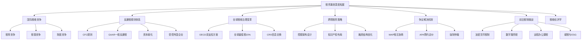
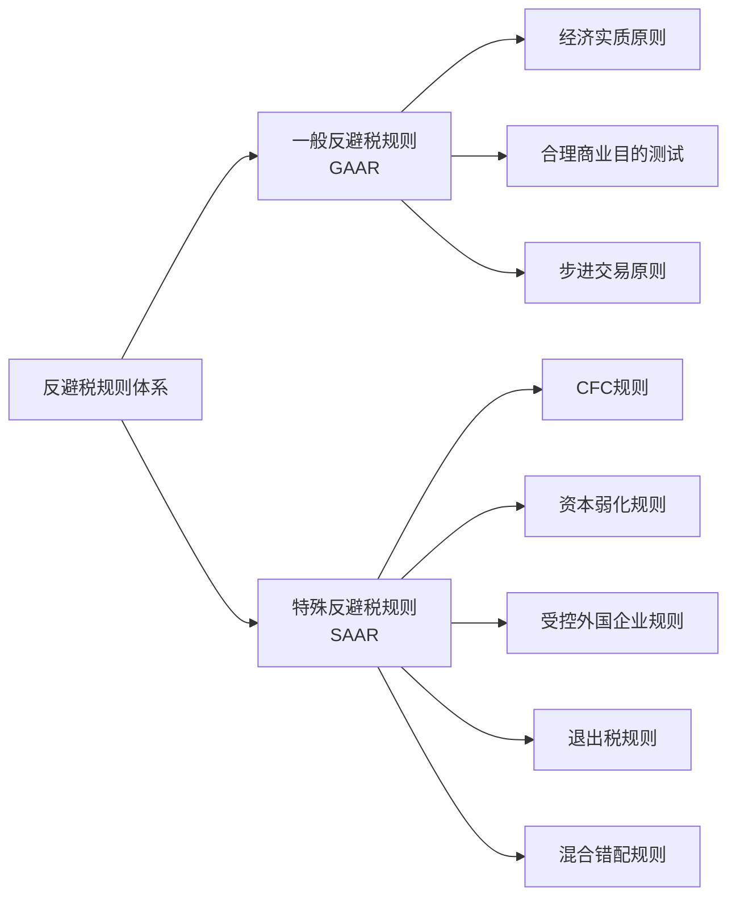
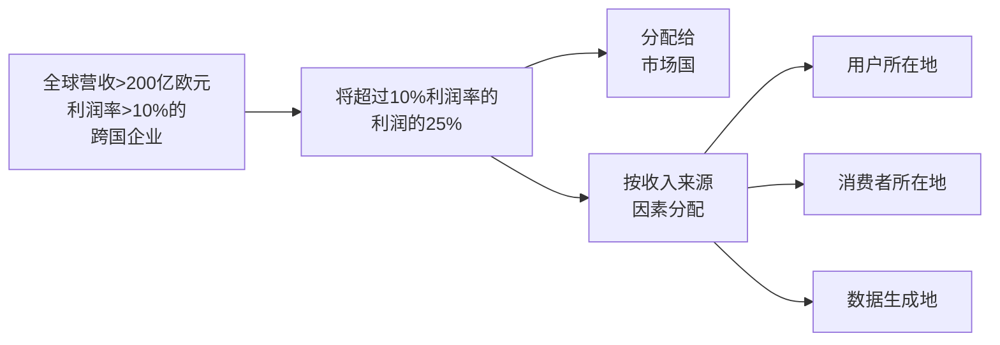
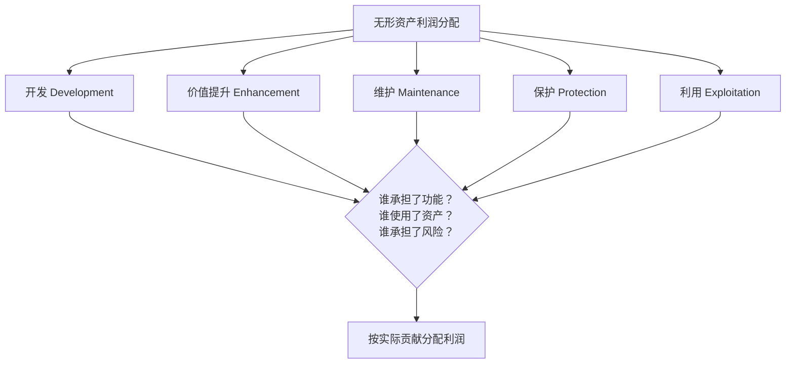
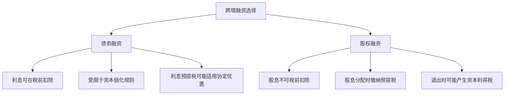
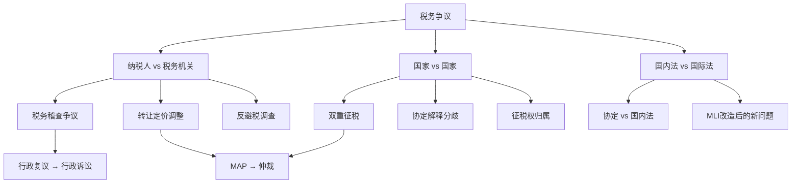
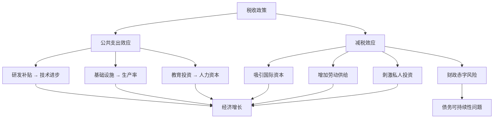
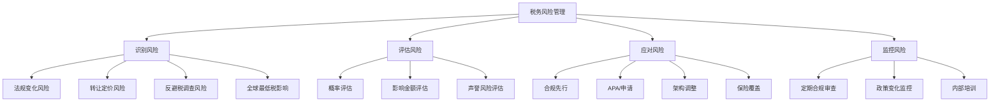

# 税务筹划深度拓展

本章作为全书的压轴章节，将视角从国内税务筹划延伸到国际税收治理的全景。我们将系统梳理国际税收竞争格局、反避税规则体系、全球税收治理变革、跨境税务筹划策略，以及面向未来的新税制挑战。这些内容不仅是大型跨国企业的必修课，也是个人投资者在全球化资产配置中必须理解的基础知识。



---

## 一、国际税收竞争的全景图

### 1.1 税收竞争的理论基础

国际税收竞争是指各国通过降低税率、提供税收优惠等方式，争夺跨国企业和国际资本的行为。这一现象的理论基础可以追溯到蒂布特（Tiebout）的"用脚投票"理论——资本和人才会流向税负最低的地区。

蒂布特模型的核心假设是：存在足够多的辖区供纳税人选择，且纳税人可以自由迁移。现实中，虽然个人的迁移成本较高，但资本的跨境流动已近乎无摩擦，这使得税收竞争主要体现在资本税负的竞赛上。

**税收竞争的三种范式：**

| 维度 | 税率竞争 | 税基竞争 | 制度竞争 |
|------|----------|----------|----------|
| 核心手段 | 直接降低名义税率 | 通过优惠缩小实际税基 | 优化整体营商环境 |
| 典型案例 | 2017年美国企业所得税从35%降至21% | 爱尔兰知识产权收入6.25%优惠税率 | 新加坡简洁高效的税制+广泛税收协定网络 |
| 持续性 | 短期有效，易引发报复 | 中期有效，受国际压力 | 长期有效，难以模仿 |
| 副作用 | 财政收入锐减 | 税基侵蚀，公平性下降 | 需要全面的制度建设 |
| 受益主体 | 所有纳税人 | 特定行业/类型企业 | 高质量跨国企业 |

**案例：2017年美国税改的全球连锁反应**

2017年12月，美国通过《减税与就业法案》（TCJA），将企业所得税税率从35%大幅降至21%，同时引入了属地制税制和海外利润汇回的优惠税率。这一改革产生了显著的全球连锁效应：

- **英国**：提前实施企业所得税税率下调计划，从19%降至17%（后因财政需要回调至25%）
- **法国**：马克龙政府加速推进企业所得税税率从33.3%降至25%的计划
- **日本**：通过税改引入了对数字巨头的课税机制，同时降低有效税率
- **中国**：加大了对高新技术企业的税收优惠力度，研发费用加计扣除比例从75%提至100%

### 1.2 全球低税率管辖区图谱

全球主要的低税率管辖区可以分为以下几类：

**零税率型（不征收企业所得税）：**

| 管辖区 | 特点 | 主要吸引对象 | CRS参与 |
|--------|------|-------------|---------|
| 开曼群岛 | 零税率、保密性强、基金法灵活 | 对冲基金、私募股权 | 是 |
| 百慕大 | 零税率、保险业发达 | 保险公司、再保险公司 | 是 |
| 英属维尔京群岛（BVI） | 零税率、设立成本低 | 控股公司、SPV | 是 |
| 巴哈马 | 零税率、旅游业+金融 | 离岸银行、信托 | 是 |

**低税率型：**

| 管辖区 | 企业所得税率 | 特色政策 | CRS参与 |
|--------|------------|----------|---------|
| 爱尔兰 | 12.5%（一般）/ 6.25%（知识产权） | 知识发展盒（Knowledge Development Box） | 是 |
| 新加坡 | 17%（名义），实际可达0-10% | 新创企业前3年免税、区域总部优惠 | 是 |
| 香港 | 8.25%/16.5%（两级制） | 离岸收入豁免、无资本利得税 | 是 |
| 匈牙利 | 9% | 欧盟最低企业税率 | 是 |
| 阿联酋 | 9%（2023年起，37.5万迪拉姆以上） | 自由区0%税率、无个人所得税 | 是 |

**优惠税制型：**

| 管辖区 | 核心优惠 | 适用条件 |
|--------|----------|----------|
| 荷兰 | 参与免税制度、创新盒（9%） | 实质性经营活动 |
| 卢森堡 | 知识产权制度、基金税制 | 合规的基金架构 |
| 瑞士 | 州际竞争税率（11.9%-21.6%）、专利盒 | 实质经营+研发活动 |
| 英国 | 专利盒（10%）、研发税收抵免 | 真实的研发活动 |

### 1.3 有害税收竞争的治理演进

过度的税收竞争会侵蚀各国税基，导致"逐底竞争"（Race to the Bottom）。OECD自1998年起就开始推动反有害税收竞争的工作。

**治理里程碑：**

- **1998年**：OECD发布《有害税收竞争：一个新兴的全球性问题》报告
- **2000年**：OECD发布首份"避税天堂"名单
- **2009年**：G20伦敦峰会呼吁对不合作辖区采取行动
- **2015年**：BEPS第5项行动计划（实质性活动标准）
- **2017年**：欧盟建立"不合作税收管辖区"名单制度
- **2021年**：G20/OECD就双支柱方案达成共识
- **2024年**：全球最低税在多个国家开始实施

**欧盟的税收黑名单制度运作机制：**

欧盟定期评估全球各管辖区的税收透明度、公平税收和BEPS措施执行情况。评估结果将管辖区分为三类：

1. **绿色名单（合规）**：满足所有评估标准
2. **灰名单（承诺改进）**：已承诺进行改革但尚未完全实施
3. **黑名单（不合作）**：未满足标准且未做出有效承诺

被列入黑名单的管辖区面临的制裁包括：加强税务审查、限制资金流动、在欧盟公共采购中被排除等。截至2024年底，仍有约12个管辖区被列入黑名单或灰名单。

---

## 二、全球反避税规则体系

### 2.1 反避税规则的理论框架

反避税规则的核心理念是"实质重于形式"（Substance over Form）。税务机关有权穿透交易的法律形式，按照交易的经济实质进行课税。

反避税规则分为两个层次：



### 2.2 一般反避税规则（GAAR）

一般反避税规则是税务机关的"兜底条款"，赋予其在特定条件下否定避税安排的权力。

**中国的一般反避税规则：**

《企业所得税法》第四十七条规定："企业实施其他不具有合理商业目的的安排而减少其应纳税收入或者所得额的，税务机关有权按照合理方法调整。"

"不具有合理商业目的"的判断标准包括：
- 以获取税收利益为主要目的之一
- 以形式上符合税法规定但实质上减少应纳税额为结果
- 交易安排与经济实质不匹配

**实际案例：某离岸架构被穿透的税务调整**

某中国居民企业A在开曼群岛设立全资子公司B，B公司再在BVI设立全资子公司C，C公司持有中国境内运营公司D的股权。D公司的利润通过向B和C支付特许权使用费的方式转移到离岸架构。

税务机关认定：
1. B和C公司无实质经营活动（无员工、无办公场所、无独立商业活动）
2. 支付的特许权使用费与B、C公司提供的实际价值不匹配
3. 整个安排的主要目的是规避中国的企业所得税

最终，税务机关依据一般反避税规则，将D公司向B、C支付的特许权使用费重新认定为利润分配，补征了企业所得税和滞纳金。

### 2.3 受控外国企业（CFC）规则

CFC规则的核心目的是防止纳税人通过在低税率地区设立外国子公司来囤积利润、延迟纳税。

**中国CFC规则要点：**

根据《企业所得税法》第四十五条和《特别纳税调整实施办法》：

| 要素 | 中国标准 |
|------|----------|
| 控制标准 | 中国居民企业或个人直接/间接持有外国企业10%以上有表决权股份，且共同持有50%以上 |
| 低税率标准 | 实际税负低于12.5%（即中国法定税率25%的50%） |
| 豁免条件 | ①设立在白名单国家 ②年度利润低于500万元人民币 ③主要取得积极经营所得 |
| 征税方式 | 按持股比例将CFC未分配利润视同已分配，计入中国股东当期所得 |

**CFC规则下的税收计算示例：**

某中国居民企业A持有爱尔兰子公司B 60%的股权。B公司2024年度利润为1000万元人民币，实际缴纳爱尔兰企业所得税125万元（有效税率12.5%），未分配利润875万元。

```text
中国认定税率门槛 = 25% × 50% = 12.5%
B公司实际税率 = 12.5%（等于门槛，但爱尔兰名义税率12.5%一般被视为低于门槛）

假设认定B公司为CFC：
A公司视同收到利润 = 875 × 60% = 525万元
A公司应补缴中国企业所得税 = 525 × 25% = 131.25万元
可抵免爱尔兰已纳税额 = 125 × 60% = 75万元
实际补缴税额 = 131.25 - 75 = 56.25万元
```

### 2.4 资本弱化规则

资本弱化规则限制企业通过过度债务融资（而非股权融资）来获取利息扣除，从而减少应纳税额。

**各国资本弱化规则对比：**

| 国家/地区 | 债资比限制 | 关联方定义 | 超额利息处理 |
|-----------|-----------|-----------|-------------|
| 中国 | 2:1（金融企业5:1） | 直接/间接持股25%以上 | 不得扣除，不得结转 |
| 美国 | 无固定比例，EBITDA限制 | 50%以上关联 | 超过30%EBITDA部分不得扣除 |
| 英国 | 无固定比例 | 25%以上关联 | 超过集团EBITDA 30%部分限制扣除 |
| 德国 | 无固定比例，但30%EBITDA限制 | 25%以上关联 | 超额利息不得扣除，可结转 |
| 日本 | 无固定比例 | 50%以上关联 | 超过调整后所得部分不得扣除 |

**中国的资本弱化规则实操要点：**

1. **债资比计算**：关联方债权性投资 / 权益性投资 ≤ 2（金融企业为5）
2. **权益性投资的认定**：包括实收资本、资本公积、盈余公积和未分配利润
3. **利息扣除限制**：超过债资比标准的关联方利息支出不得在税前扣除
4. **例外情形**：如果企业能够证明其关联交易符合独立交易原则，可以不受固定债资比限制

### 2.5 混合错配安排规则

混合错配安排（Hybrid Mismatch Arrangements）利用不同国家对同一实体或金融工具的税法分类差异，实现双重扣除或一方扣除、一方不计收入的效果。

**常见的混合错配类型：**

1. **混合工具错配**：A国将某金融工具视为债务（利息可扣除），B国将其视为股权（股息免税）
2. **混合实体错配**：A国将某实体视为透明体（收入穿透至股东），B国将其视为非透明体（收入在实体层面征税）
3. **混合支付错配**：同一笔支付在支付方可以扣除，但收款方不计入收入

**BEPS第2项行动计划的应对方案：**

OECD建议各国通过"主要规则"和"次要规则"来消除混合错配的效果。主要规则要求支付方所在国拒绝利息扣除，次要规则要求收款方所在国将相关收入计入应税所得。截至目前，欧盟成员国、澳大利亚、新西兰等已全面实施混合错配规则，中国正在研究制定中。

---

## 三、OECD双支柱方案：全球税收治理的历史性变革

### 3.1 支柱一：征税权的重新分配

支柱一解决的核心问题是：在数字经济时代，将部分征税权从市场国（企业取得收入但无物理存在的国家）重新分配给消费者所在国。

**支柱一的运作机制：**



**金额A（Amount A）的关键参数：**

| 参数 | 标准 |
|------|------|
| 适用门槛 | 全球年收入超过200亿欧元，且利润率超过10% |
| 征税基础 | 超过10%利润率部分的25% |
| 分配因素 | 市场国收入占比 |
| 生效条件 | 需要签署多边公约（MLC），至少30个国家批准 |

截至2024年底，约140个国家参与了双支柱方案的谈判，但支柱一的实施进展较慢，主要原因是美国国会的审批障碍和部分国家对分配公式的争议。

### 3.2 支柱二：全球最低税15%

支柱二（GloBE规则）是目前国际税改中进展最快的部分，其核心目标是确保大型跨国企业集团在全球范围内缴纳不低于15%的有效税率。

**支柱二的适用范围：**

- **收入门槛**：集团年合并收入在连续4个财年中至少有2个财年达到7.5亿欧元
- **排除实体**：政府实体、国际组织、非营利组织、养老基金、投资基金（在特定条件下）

**GloBE规则的四大机制：**

| 规则 | 英文缩写 | 运作方式 | 实施主体 |
|------|----------|----------|----------|
| 收入纳入规则 | IIR | 母公司所在国对低税率子公司补征差额 | 母公司所在国 |
| 低税支付规则 | UTPR | 其他参与国通过调整关联支付来补征 | 各参与国 |
| 合格国内最低补足税 | QDMTT | 低税率管辖区自行征收补足税 | 子公司所在国 |
| 主体例外 | SBIE | 排除5%有形资产回报和5%工资成本 | — |

**全球最低税计算示例：**

某跨国企业集团母公司位于中国，子公司位于爱尔兰（集团年收入超过7.5亿欧元）。

```text
爱尔兰子公司年度数据：
- GloBE收入：10亿欧元
- 符合条件的税款（爱尔兰企业所得税）：1.2亿欧元
- 有形资产回报：5000万欧元
- 工资成本：8000万欧元

Step 1: 计算有效税率
爱尔兰实际有效税率 = 1.2亿 / 10亿 = 12%

Step 2: 计算实质收入排除（SBIE）
SBIE = (有形资产 × 5%) + (工资成本 × 5%) = 250万 + 400万 = 650万欧元

Step 3: 计算超额利润
超额利润 = GloBE收入 - SBIE = 10亿 - 650万 = 约9.935亿欧元

Step 4: 计算补足税
补足税率 = 15% - 12% = 3%
补足税 = 9.935亿 × 3% = 约2980万欧元

Step 5: 确定征收优先级
①爱尔兰实施QDMTT → 爱尔兰优先征收
②如爱尔兰未实施QDMTT → 中国依据IIR补征
③如中国未实施IIR → 其他国家依据UTPR补征
```

### 3.3 各国实施全球最低税的进展

| 国家/地区 | 实施时间 | QDMTT | IIR | UTPR | 特点 |
|-----------|----------|-------|-----|------|------|
| 欧盟成员国 | 2024年1月 | 部分实施 | 已实施 | 已实施 | EU指令强制要求 |
| 韩国 | 2024年1月 | 已实施 | 已实施 | 已实施 | 亚太最早之一 |
| 日本 | 2024年4月 | 已实施 | 已实施 | 待实施 | QDMTT先于IIR |
| 英国 | 2024年1月 | 已实施 | 已实施 | 2025年 | 收入纳入税（IIR等效） |
| 中国香港 | 2025年 | 已实施 | 已实施 | 已实施 | 全球最低税及香港最低补足税 |
| 新加坡 | 2025年 | 已实施 | 已实施 | 已实施 | 补充税（IIR等效） |
| 中国 | 研究中 | 研究中 | 研究中 | 研究中 | 尚未正式立法 |
| 美国 | 部分等效 | 无 | 通过GILTI部分等效 | 无 | GILTI有效税率约13.125% |

**对中国企业的影响：**

虽然中国尚未正式实施GloBE规则，但中国跨国企业在海外的低税率子公司将受到其他国家IIR和UTPR的影响。例如，中国母公司的香港子公司如果实际税率低于15%，香港已实施的QDMTT将优先征收补足税。同时，中国如果引入QDMTT，可以保留对境内低税率收入的征税权。

---

## 四、税收协定与转让定价的深度应用

### 4.1 税收协定的功能与结构

税收协定（DTA）是两个国家之间签订的国际条约，旨在避免对跨国收入的双重征税并防止偷漏税。全球已有超过3500个双边税收协定生效。

**税收协定的四个核心功能：**

1. **分配征税权**：确定各类跨国收入（股息、利息、特许权使用费、劳务报酬等）在来源国和居民国之间的征税权分配
2. **限制税率**：对来源国的预提所得税设定上限，通常低于国内法规定的税率
3. **消除双重征税**：规定居民国应通过免税法或抵免法消除双重征税
4. **信息交换与征管协助**：为两国税务机关之间的信息交换和征管协助提供法律框架

**中国主要税收协定预提税限制税率比较：**

| 收入类型 | 中国国内法税率 | 中美协定 | 中英协定 | 中新（加坡）协定 | 中德协定 | 中日协定 |
|----------|---------------|----------|----------|-------------------|----------|----------|
| 股息 | 10% | 10% | 10% | 10%（25%以上持股5%） | 10%（25%以上持股5%） | 10%（25%以上持股5%） |
| 利息 | 10% | 10% | 10% | 10% | 10%（银行间7%） | 10% |
| 特许权使用费 | 10% | 10% | 10% | 10% | 6% | 10% |

### 4.2 税收协定的实战应用

**场景一：中国企业向海外支付特许权使用费**

某中国企业A需要向美国母公司B支付技术使用费1000万元。B公司未在中国设立机构场所。

```text
无税收协定（按国内法）：
预提所得税 = 1000 × 10% = 100万元
增值税 = 1000 × 6% = 60万元
合计税负 = 160万元

适用中美税收协定：
预提所得税 = 1000 × 10% = 100万元（协定税率也是10%，无变化）
增值税 = 1000 × 6% = 60万元
合计税负 = 160万元

但如果向德国支付（中德协定特许权使用费6%）：
预提所得税 = 1000 × 6% = 60万元
增值税 = 1000 × 6% = 60万元
合计税负 = 120万元
节省税款 = 160 - 120 = 40万元
```

**场景二：协定优惠的申请流程**

在中国申请适用税收协定优惠的步骤：

1. **判断是否为缔约对方居民**：外国企业需提供缔约对方税务机关出具的税收居民身份证明
2. **判断是否为受益所有人**：不能仅以代理人或导管公司的身份申请协定优惠
3. **填报相关表格**：填写《非居民纳税人享受协定待遇管理办法》规定的表格
4. **提交证明材料**：包括税收居民身份证明、合同、受益所有人身份的证明材料等
5. **备案或审批**：根据收入类型的不同，可能需要备案或事先审批

### 4.3 多边工具（MLI）对税收协定的改造

OECD的《多边公约》（MLI）是第一个可以通过一套统一规则同时修改多个双边税收协定的多边工具。截至2024年，已有超过100个国家签署了MLI。

**MLI的核心措施：**

1. **利益限制条款（LOB）**：防止协定滥用，要求享受协定优惠的主体必须具有"实质性经营活动"
2. **主要目的测试（PPT）**：如果获取协定优惠是交易的主要目的之一，可以拒绝给予协定优惠
3. **仲裁条款**：为税收争议提供有约束力的仲裁机制

**MLI对中国的实际影响：**

中国在签署MLI时选择了PPT条款，未选择LOB条款。这意味着，如果某项安排的主要目的是获取中国税收协定的优惠，中国税务机关可以拒绝适用协定优惠。这对中国企业通过中间控股公司（如香港、新加坡）进行的投资架构产生了直接影响——如果中间公司缺乏实质性经营活动，可能面临协定优惠被拒绝的风险。

### 4.4 转让定价的深度应用

转让定价是国际税收中最复杂、争议最多的领域之一。

**OECD五种转让定价方法的适用场景：**

| 方法 | 英文 | 适用场景 | 数据要求 | 优缺点 |
|------|------|----------|----------|--------|
| 可比非受控价格法 | CUP | 存在高度可比的独立交易 | 需要可比交易数据 | 最直接，但可比数据难找 |
| 再销售价格法 | RPM | 关联方从母公司购入商品后转售 | 需要再销售价格和毛利率 | 适用于分销商 |
| 成本加成法 | Cost Plus | 关联方提供加工或服务 | 需要成本数据和行业利润率 | 适用于制造商和服务商 |
| 交易净利润法 | TNMM | 最广泛使用的方法 | 需要可比公司的净利润率 | 容错性高，但需选择合适的利润指标 |
| 利润分割法 | PSM | 双方都贡献独特价值 | 需要合并利润和贡献分析 | 适用于高度整合的交易 |

**DEMPE分析框架——无形资产转让定价的核心：**

对于无形资产（品牌、专利、技术诀窍），传统的转让定价方法难以直接应用。OECD在BEPS项目中提出了DEMPE分析框架：



只有在DEMPE环节中承担了功能、使用了资产、承担了风险的实体，才有权获得无形资产的相关利润。这一规则直接打击了通过设立"壳"公司持有知识产权来转移利润的做法。

### 4.5 中国转让定价管理的最新实践

**中国转让定价管理的关键文件：**

| 文件 | 发布时间 | 核心内容 |
|------|----------|----------|
| 国家税务总局公告2017年第6号 | 2017年 | 特别纳税调查调整及相互协商程序管理办法 |
| 国家税务总局公告2016年第42号 | 2016年 | 关联申报和同期资料管理 |
| 国家税务总局公告2021年第18号 | 2021年 | 预约定价安排年度报告 |

**中国的预约定价安排（APA）实践：**

APA是企业与税务机关事先就未来年度的转让定价方法达成一致的安排。中国的APA制度包括单边APA（仅涉及中国税务机关）和双边APA（涉及中国和另一国税务机关）。

截至2024年，中国已签署了超过100个APA，其中约40%为双边APA。APA的典型签署周期为：单边APA约1-2年，双边APA约2-4年。

**APA申请的实操建议：**

1. **选择合适的交易类型**：关联交易金额大、定价方法相对明确的交易最适合申请APA
2. **准备充分的可比性分析**：提前进行功能分析和可比性分析，选择合适的转让定价方法
3. **积极配合税务机关**：在APA谈签过程中保持沟通，及时提供所需信息
4. **考虑双边APA**：如果关联交易涉及境外关联方，建议申请双边APA，可以同时解决两个国家的转让定价问题

---

## 五、CRS与全球金融信息透明化

### 5.1 CRS的运作机制

CRS（Common Reporting Standard，共同申报准则）是OECD制定的金融账户信息自动交换标准，旨在打击跨境逃税行为。

**CRS的信息交换流程：**


**CRS申报的核心信息：**

| 信息类别 | 具体内容 |
|----------|----------|
| 账户持有人信息 | 姓名、地址、税收居民国、纳税人识别号（TIN） |
| 账户信息 | 账号、金融机构名称及识别号 |
| 财务信息 | 利息、股息、保险合同收入、金融资产出售所得、账户余额/价值 |

### 5.2 CRS的全球实施现状

截至2024年，已有超过120个国家和地区承诺实施CRS，其中约100个国家已开始实际交换信息。

**中国的CRS实施情况：**

- **2017年7月**：中国发布《非居民金融账户涉税信息尽职调查管理办法》
- **2018年9月**：中国进行了首次CRS信息交换
- **覆盖范围**：银行、证券、保险、信托等金融机构的非居民账户

**中国居民在海外的哪些资产会被CRS申报？**

| 资产类型 | 是否被申报 | 说明 |
|----------|-----------|------|
| 海外银行存款 | 是 | 包括活期、定期、储蓄账户 |
| 海外证券账户 | 是 | 包括股票、债券、基金账户 |
| 海外保险现金价值 | 是 | 具有现金价值的保险合同 |
| 海外信托权益 | 是 | 信托的委托人、受益人等信息 |
| 实物资产（房产） | 否 | CRS不覆盖实物资产 |
| 直接持有的海外公司股权 | 否 | 但公司金融账户可能被申报 |

### 5.3 CRS应对的合规策略

**合法的税务筹划策略（不等同于逃避CRS申报）：**

1. **合规申报**：最根本的策略是依法申报海外资产和收入，避免因隐瞒而面临更严重的处罚
2. **利用税收抵免**：在海外已缴纳的税款可以在中国个人所得税中抵免，避免双重征税
3. **合理利用税收协定**：通过合法途径降低海外收入的税负
4. **优化资产配置结构**：CRS不覆盖实物资产，可以考虑适当的实物资产配置（但需注意各国的遗产税和房产税）

**非法的规避行为及法律后果：**

- **开设"壳"账户**：使用他人名义或虚假身份开设账户——构成逃税罪或洗钱罪
- **将资金转移到非CRS参与国**：短期可能有效，但随着CRS网络扩大，效果将递减
- **分散资产降低余额**：刻意将资产分散到多个低余额账户——税务机关可能通过汇总分析识别

**中国对海外资产不申报的处罚：**

| 违规行为 | 法律依据 | 处罚标准 |
|----------|----------|----------|
| 未申报海外收入 | 个人所得税法 | 补缴税款+滞纳金（日万分之五）+罚款（50%-5倍） |
| 未进行境外投资申报 | 外汇管理条例 | 警告+罚款（30万元以下） |
| 情节严重 | 刑法第201条逃税罪 | 3-7年有期徒刑 |

---

## 六、跨境税务筹划策略

### 6.1 控股架构设计

跨境投资的控股架构直接影响整体税负。常见的控股架构选择包括：

**直接控股 vs 间接控股：**

| 比较维度 | 直接控股 | 通过香港间接控股 | 通过新加坡间接控股 |
|----------|----------|-----------------|-------------------|
| 股息预提税 | 取决于双边协定 | 通常5-10% | 通常5-10% |
| 资本利得税 | 取决于投资东道国 | 香港不征收资本利得税 | 新加坡对境外资本利得不征税 |
| 设立成本 | 低 | 中 | 中 |
| CRS信息交换 | 直接暴露 | 与中国交换 | 与中国交换 |
| 实质要求 | 无 | 需要适当实质 | 需要适当实质 |

**控股架构设计的核心原则：**

1. **商业实质优先**：中间控股公司必须具有真实的经营活动、人员和办公场所
2. **协定优惠可达性**：选择与中国和目标市场国都有优惠税收协定的中间地
3. **退出税考量**：考虑未来退出时的资本利得税负
4. **全球最低税影响**：评估GloBE规则对整体架构的影响
5. **CRS信息透明度**：接受信息自动交换的现实，确保合规

### 6.2 知识产权布局策略

知识产权（IP）是跨境税务筹划中的关键要素。合理的IP布局可以在合法框架内优化税负。

**IP布局的核心考虑因素：**

1. **IP所在地的有效税率**：选择对IP收入提供优惠税率的管辖区
2. **研发活动的实质要求**：IP必须与真实的研发活动相关联
3. **DEMPE分析**：确保IP所在地的实体在开发、价值提升、维护、保护和利用方面有实质性贡献
4. **关联交易定价**：特许权使用费率必须符合独立交易原则

**主要管辖区的IP优惠税制比较：**

| 管辖区 | IP制度名称 | 有效税率 | 要求 |
|--------|-----------|----------|------|
| 爱尔兰 | 知识发展盒 | 6.25% | 爱尔兰研发活动产生的IP收入 |
| 英国 | 专利盒 | 10% | 专利等合格IP |
| 荷兰 | 创新盒 | 9% | 自主开发的专利和其他IP |
| 新加坡 | 知识产权收入激励 | 5-10% | 符合条件的IP收入 |
| 中国 | 高新技术企业 | 15% | 认定为高新技术企业 |
| 中国 | 技术转让减免 | 免征/减半 | 居民企业技术转让所得500万以内免征 |

### 6.3 融资结构优化

跨境融资结构对税负有重大影响。关键优化维度包括：

**债务融资 vs 股权融资的税负对比：**



**混合融资工具的运用：**

混合融资工具（如可转换债券、优先股、次级债）可以在特定条件下兼具债务和股权的特征。但需要注意BEPS第2项行动计划（混合错配安排）的限制——如果混合工具导致双重扣除或扣除-不计收入的结果，相关国家可能拒绝给予扣除或免税待遇。

### 6.4 退出策略的税务考量

企业在进行跨境投资退出时，需要充分考虑税务影响。

**退出方式的税务比较：**

| 退出方式 | 税务影响 | 优化策略 |
|----------|----------|----------|
| 股权转让 | 资本利得税（通常10-20%） | 利用中间控股公司所在地的免税政策 |
| 资产转让 | 增值税/所得税双重负担 | 考虑股权交易替代资产交易 |
| 分红退出 | 股息预提税+所得税 | 利用税收协定降低预提税率 |
| 清算退出 | 清算所得课税 | 合理规划清算时点和方式 |

**退出税（Exit Tax）的国际实践：**

越来越多的国家引入了退出税，以防止纳税人通过迁移资产或改变税收居民身份来规避税收。欧盟在ATAD指令中要求成员国对资产迁移征收退出税。美国对放弃绿卡或公民身份的纳税人征收"弃籍税"（Expatriation Tax），对视同出售资产所得征收资本利得税。

---

## 七、前沿税制挑战

### 7.1 加密货币的税收问题

加密货币（比特币、以太坊等）的税收问题是全球税务机关面临的最新挑战之一。

**主要国家/地区加密货币税收政策比较：**

| 国家/地区 | 持有收益 | 挖矿收入 | DeFi收益 | NFT交易 | 备注 |
|-----------|----------|----------|----------|---------|------|
| 美国 | 资本利得税（短期/长期） | 所得税 | 所得税 | 资本利得税 | IRS视为"财产" |
| 中国 | 暂无明确规定 | 禁止挖矿 | 暂无明确规定 | 暂无明确规定 | 2021年全面禁止加密货币交易 |
| 日本 | 杂项所得（最高55%） | 杂项所得 | 杂项所得 | 杂项所得 | 税负较重 |
| 德国 | 免税（持有1年以上） | 所得税 | 所得税 | 所得税 | 长期持有免税 |
| 新加坡 | 不征收资本利得税 | 所得税（如业务性质） | 可能不征税 | 不征收资本利得税 | 对个人投资者友好 |
| 香港 | 不征收资本利得税 | 可能利得税 | 不确定 | 不确定 | 对个人投资者友好 |
| 葡萄牙 | 28%（2023年起） | 所得税 | 所得税 | 28% | 曾完全免税，2023年起征税 |

**加密货币税务合规的实操建议：**

1. **记录所有交易**：保留所有买入、卖出、交换、挖矿、空投等交易的完整记录
2. **使用专业工具**：利用Koinly、CoinTracker等加密税务计算软件
3. **关注DeFi和NFT**：流动性挖矿、质押收益、NFT销售等新兴场景的税务处理仍不明确
4. **了解各国差异**：不同国家对加密货币的税务处理差异巨大，需根据居住国和交易发生地分别分析
5. **咨询专业税务顾问**：鉴于该领域的法规仍在快速变化，建议寻求专业建议

### 7.2 数字服务税的深化

数字服务税（DST）是各国应对数字经济税收挑战的单边措施，但其影响已超越数字经济本身。

**各国数字服务税对比：**

| 国家 | 开征时间 | 税率 | 适用门槛 | 适用范围 |
|------|----------|------|----------|----------|
| 法国 | 2019年 | 3% | 全球收入7.5亿欧元+法国数字收入2500万欧元 | 广告、平台中介、数据销售 |
| 英国 | 2020年 | 2% | 全球收入5亿英镑+英国收入2500万英镑 | 搜索引擎、社交媒体、在线市场 |
| 印度 | 2016/2020年 | 2-6% | 无收入门槛（特定服务） | 在线广告、电子商务 |
| 意大利 | 2020年 | 3% | 全球收入7.5亿欧元+意大利数字收入550万欧元 | 广告、平台中介、数据销售 |
| 西班牙 | 2021年 | 3% | 全球收入7.5亿欧元+西班牙数字收入300万欧元 | 广告、平台中介、数据销售 |
| 加拿大 | 2024年 | 3% | 全球收入10亿欧元+加拿大数字收入2000万加元 | 在线市场、社交媒体、广告 |

**数字服务税对企业的影响：**

数字服务税不仅影响大型科技公司，还影响使用数字平台进行营销和销售的企业。如果企业依赖数字平台获取客户，平台可能会通过提高服务费的方式将DST成本转嫁给商家。

### 7.3 远程办公的课税挑战

新冠疫情加速了远程办公的普及，引发了新的跨境课税问题：

**远程办公涉及的关键税务问题：**

1. **常设机构认定**：员工在另一个国家远程办公是否构成雇主在该国的常设机构？
2. **个人所得税**：远程工作者的收入应在哪个国家纳税？
3. **社会保障**：远程工作者应参加哪个国家的社会保障体系？
4. **雇主扣缴义务**：雇主是否需要在员工远程办公所在国代扣代缴个人所得税？

**OECD的指南要点：**

OECD在2020年和2021年发布了关于COVID-19期间跨境远程工作税务问题的指南。虽然这些指南主要是临时性的，但为后续政策制定奠定了基础。核心原则是：短期临时性远程工作通常不会触发新的纳税义务，但长期或常态化的远程办公可能改变税收居民身份和常设机构认定。

**个人跨境远程办公的税务建议：**

1. **记录远程工作天数**：详细记录在每个国家的远程工作天数
2. **了解税收协定的独立个人劳务条款**：183天规则和常设机构规则
3. **咨询雇主所在地和远程办公所在地的税务顾问**：确保双方都合规
4. **考虑设立个人公司**：如果长期在海外远程工作，设立当地个人公司可能更合规

### 7.4 碳税与ESG税收趋势

碳税和ESG（环境、社会和治理）相关的税收政策正在全球范围内快速推进。

**主要碳税制度比较：**

| 国家/地区 | 碳税水平 | 覆盖范围 | 发展趋势 |
|-----------|----------|----------|----------|
| 瑞典 | 约137美元/吨CO2 | 化石燃料 | 全球最高碳税水平 |
| 瑞士 | 约130美元/吨CO2 | 化石燃料 | 收入用于降低社保缴费 |
| 欧盟 | 约60-100欧元/吨CO2（ETS） | 电力、工业、航空 | CBAM从2026年起全面实施 |
| 加拿大 | 约65加元/吨CO2 | 化石燃料 | 计划2030年提至170加元 |
| 中国 | 约8-10美元/吨CO2（试点） | 电力行业 | 全国碳市场逐步扩大覆盖范围 |

**欧盟碳边境调节机制（CBAM）的影响：**

欧盟CBAM从2023年10月开始过渡期，2026年起全面实施。CBAM要求进口商购买与进口商品碳排放量对应的CBAM证书，以确保进口商品与欧盟内部商品承担相同的碳成本。

对中国出口企业的直接影响：
- **钢铁**：中国钢铁行业碳排放强度较高，CBAM将增加出口成本
- **铝**：铝行业的碳排放主要来自电力消耗，影响显著
- **水泥、化肥、氢**：也在CBAM覆盖范围内
- **电力**：直接影响较小，但间接影响供应链

**应对CBAM的策略：**

1. **降低产品碳排放强度**：投资清洁能源和低碳技术
2. **建立碳排放核算体系**：准确计量产品的嵌入碳排放
3. **利用中国碳市场价格抵扣**：如果中国碳市场的碳价被欧盟认可，可以抵扣部分CBAM成本
4. **调整出口市场**：降低对欧盟市场的依赖，拓展碳税压力较小的市场

---

## 八、税务争议解决机制

### 8.1 税务争议的全景分类

税务争议可能发生在多个层面，每个层面有不同的解决路径：



### 8.2 中国的税务争议解决路径

**行政复议制度：**

纳税人对税务机关的具体行政行为不服，可以在60日内申请行政复议。复议机关在60日内作出决定（复杂案件可延长30日）。

**行政复议的实操要点：**

1. **复议前置**：对纳税争议（如税额核定、补税决定），必须先申请行政复议，对复议不服才能提起行政诉讼
2. **复议不停止执行**：复议期间，税务机关的行政决定一般不停止执行
3. **调解制度**：2024年新修订的行政复议法引入了调解制度，为税务争议提供了更灵活的解决途径

**行政诉讼制度：**

对行政复议决定不服，可以在收到复议决定书之日起15日内向人民法院提起行政诉讼。

**行政诉讼的注意事项：**

1. **举证责任**：税务机关对其作出的行政行为承担举证责任
2. **审查范围**：法院审查行政行为的合法性，也可以审查合理性（行政处罚显失公正的）
3. **判决类型**：维持、撤销、变更、确认违法、责令履行等

### 8.3 相互协商程序（MAP）

MAP是税收协定中规定的国际争议解决机制。

**MAP的申请条件和流程：**

| 步骤 | 内容 | 时间要求 |
|------|------|----------|
| 1. 识别不符合协定的征税 | 纳税人认为缔约国一方的行为导致不符合协定的征税 | 知情后3年内（OECD建议） |
| 2. 提交MAP申请 | 向居民国税务机关提交书面申请 | 通常3年内 |
| 3. 税务机关审查 | 居民国税务机关审查申请并决定是否启动MAP | 数月 |
| 4. 双方协商 | 两国税务机关就争议问题进行协商 | 通常24-36个月 |
| 5. 达成协议或失败 | 双方达成一致或无法达成一致 | — |

**MAP的局限性及改进：**

| 局限性 | 现状 | 改进方向 |
|--------|------|----------|
| 无强制力 | 协商结果无法律约束力 | MLI仲裁条款提供后备保障 |
| 耗时长 | 平均24-36个月 | BEPS第14项行动计划要求24个月目标 |
| 不确定性 | 取决于双方谈判 | 仲裁机制提供最终解决方案 |
| 申请门槛 | 纳税人只能申请，不能主导 | 更透明的程序和进度报告 |

### 8.4 强制仲裁机制

OECD在BEPS第14项行动计划中提出的强制仲裁机制，是MAP的重要补充。MLI中的仲裁条款允许在MAP无法在24个月内解决的情况下，启动有约束力的仲裁程序。

**仲裁程序的核心要素：**

1. **启动条件**：MAP在规定时间内未能解决（通常24个月）
2. **仲裁方式**：最后最佳报价仲裁（Baseball Arbitration）或独立意见仲裁
3. **约束力**：仲裁裁决对双方税务机关具有法律约束力
4. **例外情形**：涉及国家主权事项的争议可以排除仲裁

### 8.5 预约定价安排（APA）作为争议预防工具

APA是解决潜在转让定价争议的最佳预防工具。

**APA的成本效益分析：**

| 因素 | 成本 | 效益 |
|------|------|------|
| 时间 | 单边1-2年，双边2-4年 | 覆盖3-5个未来年度 |
| 费用 | 专业顾问费+内部人力 | 避免高额的转让定价调整和罚款 |
| 信息披露 | 需要详细的功能分析和财务数据 | 确定性，消除税务风险 |
| 灵活性 | 协议期内需遵守约定方法 | 可以申请修订 |

---

## 九、税收政策的经济学分析

### 9.1 税收对经济行为的影响机制

税收政策通过多种渠道影响经济行为。理解这些影响机制，有助于在税务筹划中做出更理性的决策。

**税收的替代效应与收入效应：**

当政府对某种商品或活动征税时，会产生两种效应：

- **替代效应**：消费者或投资者转向税收较低的替代品或活动。例如，高税率国家的投资者倾向于投资免税债券而非应税债券。
- **收入效应**：税收减少了纳税人的实际收入，影响其消费和投资能力。例如，个人所得税的增加可能导致劳动供给减少（如果替代效应主导）或增加（如果收入效应主导）。

两种效应的净效果取决于具体的税率水平、市场条件和个人偏好。

**税收楔子（Tax Wedge）的分析：**

税收楔子是指买方支付价格与卖方获得价格之间的差额，完全由税收造成。世界银行每年发布的《税收楔子报告》显示，全球平均劳动税收楔子约为35%，即雇主每支付100元的劳动成本，员工实际只获得约65元。

```text
税收楔子的计算：
雇主总成本 = 工资 + 社保企业部分 = 100
员工实际所得 = 工资 - 社保个人部分 - 个人所得税 = 65
税收楔子 = 100 - 65 = 35元（35%）
```

### 9.2 拉弗曲线与最优税率

拉弗曲线描述了税率与税收收入之间的非线性关系。它表明，当税率从零开始上升时，税收收入先增后减，存在一个使税收收入最大化的最优税率。

**拉弗曲线的政策含义：**

1. **减税可以增加收入**：如果当前税率超过最优税率，减税反而可以增加税收收入
2. **最优税率因税种而异**：不同税种（所得税、增值税、资本利得税等）的最优税率不同
3. **最优税率因国家而异**：取决于经济发展水平、产业结构、人口结构等因素

**实证研究的结论：**

学术研究对最优税率的估计差异较大。根据Barro和Redlick（2011）的研究，美国的最优边际个人所得税率约为33%。根据Mankiw等人的研究，最优资本利得税率约为28%。这些研究为中国的税制改革提供了参考，但也需要结合中国的具体国情进行调整。

### 9.3 不同税种的经济影响比较

| 税种 | 效率影响 | 公平影响 | 征管难度 | 推荐程度 |
|------|----------|----------|----------|----------|
| 增值税 | 对经济扭曲最小 | 累退性（低收入者负担较重） | 较低 | 经济学家普遍推荐 |
| 个人所得税 | 影响劳动供给 | 可以实现累进 | 中等 | 配合起征点和税率设计 |
| 企业所得税 | 影响投资决策 | 间接影响（通过工资和价格转嫁） | 中等 | 税率不宜过高 |
| 资本利得税 | 影响风险投资和创业 | 可以调节财富差距 | 较高（估值问题） | 适度征收 |
| 财产税 | 对经济扭曲较小 | 可以调节财富分配 | 较高（估值问题） | 稳定税源 |
| 消费税 | 影响特定商品消费 | 累退性（除非针对奢侈品） | 较低 | 针对特定商品 |

### 9.4 中国税制改革的经济学视角

中国的税制改革正在朝着"直接税比重提升、间接税比重下降"的方向推进。

**改革的三个经济学逻辑：**

1. **效率目标**：降低增值税等间接税的比重，可以减少对消费的抑制效应。增值税虽然被认为效率损失最小，但中国的增值税税率（13%/9%/6%）加上小规模纳税人的征收率差异，实际的效率损失不能忽视。

2. **公平目标**：提高个人所得税等直接税的比重，可以更好地实现收入再分配功能。中国目前个人所得税占税收总收入的比重约为8-10%，远低于OECD国家平均的25-30%。

3. **可持续性目标**：房地产税等财产税的开征，可以为地方政府提供稳定的税源，减少对土地出让金的依赖。

**房地产税改革的经济学分析：**

房地产税的开征面临以下经济权衡：

| 维度 | 开征理由 | 潜在风险 |
|------|----------|----------|
| 财政收入 | 为地方政府提供稳定税源 | 短期内难以替代土地出让金 |
| 收入再分配 | 调节存量财富分配 | 可能转嫁给租户 |
| 资源配置 | 抑制投机性购房需求 | 可能影响房地产市场稳定 |
| 经济效率 | 不动产税是扭曲最小的税种之一 | 评估和征管成本较高 |

### 9.5 税收政策与经济增长的关系

实证研究表明，税收政策对经济增长有着显著但复杂的影响。世界银行的研究表明，总税负每增加1个百分点，经济增长率会下降约0.02-0.04个百分点。然而，税收收入用于教育、基础设施等公共投资时，又可以促进经济增长。

**税收增长效应的权衡：**



关键不在于税率的高低，而在于税制的结构和税收的使用效率。中国在推进减税降费的同时，也需要确保教育、科技、基础设施等关键领域的公共投资不受影响。

---

## 十、面向未来的税务筹划框架

### 10.1 税务筹划的系统方法论

在理解了国际税收治理的全景之后，我们可以建立一个系统的税务筹划框架。

**税务筹划的五层框架：**

| 层次 | 内容 | 时间跨度 | 重要性 |
|------|------|----------|--------|
| 合规层 | 确保税务申报准确、及时 | 持续 | ★★★★★ |
| 优化层 | 在合法框架内优化税负 | 年度 | ★★★★ |
| 架构层 | 设计税务高效的企业/投资架构 | 3-5年 | ★★★★★ |
| 战略层 | 将税务考量纳入重大商业决策 | 5-10年 | ★★★★ |
| 前瞻层 | 预判税制变化并提前布局 | 10年以上 | ★★★ |

### 10.2 个人投资者的全球化税务筹划清单

| 事项 | 行动 | 优先级 |
|------|------|--------|
| 税收居民身份 | 明确个人税收居民身份，避免双重居民身份 | 高 |
| 海外资产申报 | 依法申报海外金融资产和收入 | 最高 |
| CRS合规 | 了解CRS覆盖范围，确保合规 | 高 |
| 税收协定利用 | 合理利用税收协定降低海外收入税负 | 中 |
| 资产配置结构 | 根据税务效率调整资产配置 | 中 |
| 遗产规划 | 考虑跨境遗产税和赠与税的影响 | 中 |
| 退出规划 | 提前规划海外投资的退出方式和税负 | 中 |
| 专业顾问 | 聘请具有国际税务经验的专业顾问 | 高 |

### 10.3 跨国企业的税务风险管理框架



---

## 本章小结

税务筹划已经从简单的"避税"发展为涵盖国际税收竞争、反避税规则、全球税收治理、跨境税务策略、争议解决等多个维度的复杂学科。

**全书知识体系回顾：**

| 章节范围 | 主题 | 核心要点 |
|----------|------|----------|
| 第1-5章 | 税务基础 | 税法原理、主要税种、计算方法 |
| 第6-10章 | 个人税务 | 个税筹划、社保优化、财富管理 |
| 第11-15章 | 企业税务 | 企业架构、增值税、所得税优化 |
| 第16-20章 | 高级策略 | 资产重组、并购税务、股权激励 |
| 第21-25章 | 特殊领域 | 房地产、跨境、家族财富 |
| 第26-30章 | 前沿与深度 | 数字经济、国际税改、未来趋势 |

**三大历史性变革正在重塑税务筹划的格局：**

1. **全球最低税15%的推行**：标志着"逐底竞争"的终结，传统的避税天堂模式正在被重塑。跨国企业必须重新评估其全球税务架构。

2. **金融信息透明化（CRS）**：跨境逃税的空间已被大幅压缩。合规申报海外资产和收入是唯一可持续的策略。

3. **数字经济课税规则的变革**：OECD双支柱方案、各国数字服务税、远程办公课税等新规则，正在改变数字经济时代的利润分配格局。

**面对这些变革，税务筹划的核心原则应当是：**

- **合规第一**：在任何税务筹划中，合规是底线，不是目标
- **实质重于形式**：税务安排必须有真实的商业实质
- **动态调整**：税制在不断变化，税务筹划也需要持续更新
- **专业支持**：复杂的税务筹划需要专业的税务顾问和律师

未来的税务筹划将更加依赖于对国际税收规则变化趋势的深刻理解和前瞻性布局。在合规的前提下进行合理的税务筹划，是保护个人和企业财富的必要手段。
