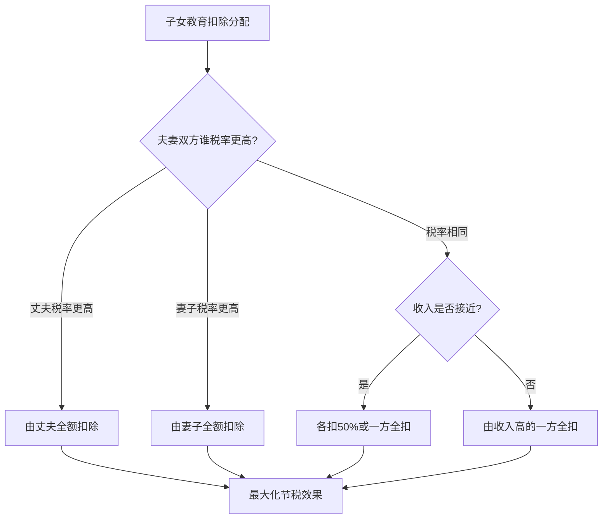
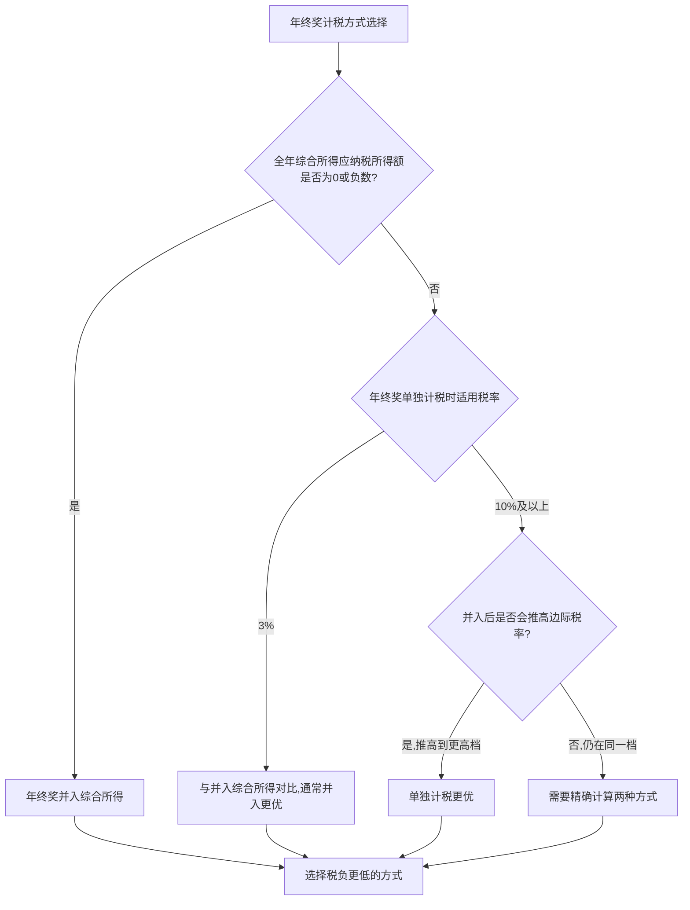
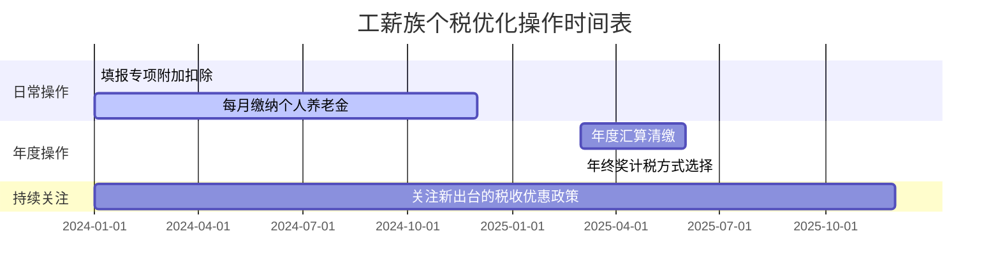

# 案例一：工薪族的个税优化

> 工薪族是中国个人所得税的主力军。据统计，中国约有 1.8 亿人缴纳个人所得税，其中超过 90% 是工薪阶层。然而，绝大多数工薪族从未认真审视过自己的个税缴纳情况——该享受的扣除没有申报，该拆分的收入没有拆分，该规避的临界点没有规避。本案例将通过一位上海互联网从业者的完整税务优化过程，手把手教你如何合法地每年多省下数万元。

## 一、案例背景

### 1.1 人物画像

赵先生，35 岁，在上海某互联网公司担任高级产品经理，已婚，有一个 5 岁的孩子正在上幼儿园。

**个人收入情况**：

| 收入项目 | 金额 | 说明 |
|----------|------|------|
| 月薪（税前） | 35,000 元 | 税前工资 |
| 年终奖 | 100,000 元 | 年底一次性发放 |
| 公积金缴纳比例 | 12% | 个人部分 |
| 年收入合计 | 520,000 元 | 35,000×12 + 100,000 |

**家庭情况**：

| 家庭成员 | 情况 | 税务意义 |
|----------|------|----------|
| 妻子 | 月薪 12,000 元，适用 10% 税率 | 子女教育扣除分配决策 |
| 孩子 | 5 岁，幼儿园在读 | 子女教育扣除 2,000 元/月 |
| 父母 | 均满 60 岁，赵先生为独生子女 | 赡养老人扣除 3,000 元/月 |
| 住房 | 首套房贷在还 | 住房贷款利息扣除 1,000 元/月 |

### 1.2 优化前的状态：什么都没申报

很多工薪族刚入职时只是提交了身份证信息，从未在"个人所得税 APP"上填报过任何专项附加扣除。赵先生就是其中之一——他觉得自己"工资也就那样，能省几个钱"，加上嫌麻烦，入职两年一直没申报。

这是一个非常典型的"认知盲区"。下面我们来算一算，这个"嫌麻烦"到底让他损失了多少钱。

## 二、优化前的税负精确计算

### 2.1 五险一金个人缴纳部分

赵先生月薪 35,000 元，按照上海 2024 年标准，五险一金个人缴纳比例如下：

| 险种 | 个人缴纳比例 | 月缴金额 |
|------|------------|----------|
| 养老保险 | 8% | 2,800 元 |
| 医疗保险 | 2% | 700 元 |
| 失业保险 | 0.5% | 175 元 |
| 住房公积金 | 12% | 4,200 元 |
| **合计** | **22.5%** | **7,875 元** |

> **说明**：上海社保缴费基数上限为上年度社平工资的 300%（约 36,549 元），赵先生的月薪 35,000 元在上限以内，按实际工资计算。工伤保险和生育保险由单位全额承担，个人不缴费。

### 2.2 未申报任何专项附加扣除时的月度个税

每月预扣预缴的计算公式：

```text
应纳税所得额 = 税前工资 - 基本减除费用 - 专项扣除（五险一金） - 专项附加扣除
            = 35,000 - 5,000 - 7,875 - 0
            = 22,125 元
```

查找预扣率表，22,125 元落在第 3 级（超过 12,000 元至 25,000 元部分），预扣率 20%，速算扣除数 1,410 元：

```text
每月预扣个税 = 22,125 × 20% - 1,410 = 3,015 元
```

### 2.3 全年工资个税汇总

由于累计预扣法的特点，前几个月预扣税额较低，后几个月逐渐升高。但全年合计约为：

```text
全年工资预扣个税 ≈ 36,180 元
```

加上年终奖的税负（后文详算），**赵先生优化前全年个税总负担约为 56,180 元**——相当于 1.6 个月的工资交了税。

## 三、专项附加扣除优化——最简单也最容易被忽视的减税手段

### 3.1 赵先生可以享受的专项附加扣除

逐一排查赵先生符合的所有专项附加扣除条件：

| 扣除项目 | 月扣除额 | 年扣除额 | 条件说明 |
|----------|----------|----------|----------|
| 子女教育 | 2,000 元 | 24,000 元 | 孩子满 3 岁至上博士毕业 |
| 住房贷款利息 | 1,000 元 | 12,000 元 | 首套房贷，最长 240 个月 |
| 赡养老人 | 3,000 元 | 36,000 元 | 独生子女，父母满 60 岁 |
| **合计** | **6,000 元** | **72,000 元** | — |

### 3.2 扣除分配的策略选择

这里有一个关键决策：**子女教育扣除由谁来申报？**

赵先生适用 20% 税率（月薪 35,000 元），妻子适用 10% 税率（月薪 12,000 元）。根据累进税率的原理：

- 由赵先生全额扣除：节税 = 2,000 × 12 × 20% = **4,800 元/年**
- 由妻子全额扣除：节税 = 2,000 × 12 × 10% = **2,400 元/年**
- 差额：**2,400 元/年**

**结论**：所有可以自由分配的扣除项（子女教育、3 岁以下婴幼儿照护），都应优先由适用税率更高的一方申报。



> **注意**：住房贷款利息和住房租金不能同时享受，只能选择其一。赵先生有首套房贷，应选择住房贷款利息扣除（1,000 元/月），这比租金扣除更稳定，不受换房影响。

### 3.3 优化后的月度个税计算

```text
应纳税所得额 = 35,000 - 5,000 - 7,875 - 6,000 = 16,125 元
每月预扣个税 = 16,125 × 20% - 1,410 = 1,815 元
全年工资预扣个税 ≈ 21,780 元
```

**仅专项附加扣除一项，全年节税：36,180 - 21,780 = 14,400 元**

这意味着赵先生每个月到手工资多了 1,200 元。而他需要做的，只是在个人所得税 APP 上花 5 分钟填写几个扣除项。

## 四、年终奖计税优化——两种方式差出上万元

### 4.1 两种计税方式的原理

2024 年起，居民个人取得的全年一次性奖金有两种计税方式可选：

**方式一：单独计税**

年终奖不并入综合所得，单独按照月度税率表计算。具体方法是将年终奖除以 12，查找对应的税率和速算扣除数：

```text
100,000 ÷ 12 = 8,333 元 → 适用 10% 税率，速算扣除数 210 元
应纳税额 = 100,000 × 10% - 210 = 7,900 元
税后收入 = 100,000 - 7,900 = 92,100 元
```

**方式二：并入综合所得**

年终奖并入全年工资收入，统一按综合所得税率表计算：

```text
全年综合所得 = 35,000 × 12 + 100,000 = 520,000 元
全年应纳税所得额 = 520,000 - 60,000（基本减除） - 94,500（五险一金） - 72,000（专项附加扣除） = 293,500 元
全年应纳税额 = 293,500 × 20% - 16,920 = 41,780 元
减去已预扣的工资个税 21,780 元 → 年终奖部分需补税 20,000 元
```

### 4.2 对比分析

| 计税方式 | 年终奖税额 | 说明 |
|----------|-----------|------|
| 单独计税 | 7,900 元 | 年终奖独立按月度税率表计算 |
| 并入综合所得 | 20,000 元 | 年终奖并入工资统一计算 |
| **差额** | **12,100 元** | 单独计税省下 12,100 元 |

**为什么单独计税更优？**

核心原因在于：并入综合所得后，赵先生的应纳税所得额从 16,125×12 = 193,500 元跳升到 293,500 元，虽然仍处于 20% 这一档，但由于边际税率在高收入端更高，年终奖的很大一部分实际上被"叠加"到更高的边际税率上。而单独计税让年终奖"自立门户"，只按 10% 的低税率缴税。

### 4.3 年终奖的"陷阱区间"——多发一块钱，少拿两千三

年终奖单独计税存在一个著名的"税率断崖"问题。当年终奖金额恰好跨越税率级距临界点时，多发 1 元钱会导致税额剧增：

| 年终奖金额 | 税率 | 应纳税额 | 税后收入 | 多发1元的代价 |
|-----------|------|----------|----------|-------------|
| 36,000 元 | 3% | 1,080 元 | 34,920 元 | — |
| 36,001 元 | 10% | 3,390.1 元 | 32,610.9 元 | **少拿 2,309.1 元** |
| 144,000 元 | 10% | 14,190 元 | 129,810 元 | — |
| 144,001 元 | 20% | 27,440.2 元 | 116,560.8 元 | **少拿 13,249.2 元** |
| 300,000 元 | 20% | 58,920 元 | 241,080 元 | — |
| 300,001 元 | 25% | 73,920.25 元 | 226,080.75 元 | **少拿 14,999.25 元** |
| 420,000 元 | 25% | 103,920 元 | 316,080 元 | — |
| 420,001 元 | 30% | 125,920.3 元 | 294,080.7 元 | **少拿 21,999.3 元** |
| 660,000 元 | 30% | 195,920 元 | 464,080 元 | — |
| 660,001 元 | 35% | 227,920.35 元 | 432,080.65 元 | **少拿 31,999.35 元** |
| 960,000 元 | 35% | 331,920 元 | 628,080 元 | — |
| 960,001 元 | 45% | 426,920.45 元 | 533,080.55 元 | **少拿 94,999.45 元** |

**临界点汇总**：36,000 / 144,000 / 300,000 / 420,000 / 660,000 / 960,000

> **实操建议**：如果你的年终奖正好落在临界点附近，可以跟 HR 沟通，将超出部分合并到月薪中发放，或者推迟到下一年度发放。例如年终奖 38,000 元，可以要求拆分为 36,000 元（年终奖）+ 2,000 元（随下月工资发放），这样 36,000 元按 3% 缴税，2,000 元按正常工资税率缴税，总税负远低于 38,000 元全部按 10% 缴税。

### 4.4 如何判断年终奖该单独计税还是并入综合所得



**快速判断法则**：

1. 如果你的月薪较低（年应纳税所得额低于 36,000 元），年终奖并入综合所得可能更优，因为可以利用低税率档位的"空间"。
2. 如果你的月薪已经较高（年应纳税所得额超过 144,000 元），年终奖单独计税通常更优。
3. **最稳妥的方法**：在个税 APP 的年度汇算清缴时，两种方式都试算一遍，选择税负更低的那个。系统会自动提示两种方式的应纳税额。

## 五、进阶优化策略

除了上述两项核心优化外，赵先生还可以通过以下策略进一步降低税负。

### 5.1 提高公积金缴纳比例

住房公积金的缴纳比例在 5%-12% 之间，个人和单位各缴一半。公积金个人缴纳部分免征个税，且账户余额归个人所有。

**分析**：赵先生当前公积金比例为 12%，这已经是最高的法定比例。如果他的公司允许在此基础上补充缴纳住房公积金（部分企业有此福利），则可以进一步增加免税额度。

> **注意**：公积金缴存基数有上限（当地上年度社平工资的 3 倍），超过上限的部分不能免税。上海 2024 年公积金缴存基数上限约为 36,549 元，赵先生的 35,000 元在上限以内。

### 5.2 商业健康保险扣除

购买符合规定的商业健康保险产品（税优健康险），每年可税前扣除 2,400 元（每月 200 元）。

```text
年节税 = 2,400 × 20% = 480 元
```

虽然金额不大，但税优健康险本身保障也不错（带病投保、保证续保），相当于"保障 + 减税"双重收益。

### 5.3 个人养老金扣除

自 2022 年起，个人养老金制度在全国推行。每年向个人养老金账户缴纳的金额（上限 12,000 元）可以税前扣除。

```text
年节税 = 12,000 × 20% = 2,400 元
```

**个人养老金的完整税务优势**：

| 环节 | 税务处理 | 说明 |
|------|----------|------|
| 缴费环节 | 每年最高 12,000 元税前扣除 | 直接降低应纳税所得额 |
| 投资环节 | 投资收益暂不征税 | 复利增长不受税收侵蚀 |
| 领取环节 | 按 3% 单独计税 | 实际领取时才缴税，且税率仅 3% |

对于赵先生这样适用 20% 税率的人群，缴费时省 20% 的税，领取时只交 3% 的税，相当于净赚 17 个百分点的税率差——这是一个被严重低估的税收优惠。

### 5.4 公益捐赠抵税

个人通过公益性社会组织或政府部门进行的慈善捐赠，可以在应纳税所得额 30% 以内扣除。

**适用场景**：如果你既想做公益，又想降低税负，可以在年底进行一笔规划好的捐赠。

**注意事项**：
- 必须通过有公益性捐赠税前扣除资格的社会组织捐赠
- 必须取得合规的《公益事业捐赠统一票据》
- 直接向个人转账捐赠不能税前扣除
- 超过 30% 限额的部分不能结转以后年度扣除

### 5.5 补充医疗保险和企业年金

如果赵先生的公司提供以下福利，也具有税收优惠：

| 福利项目 | 税务处理 | 说明 |
|----------|----------|------|
| 补充医疗保险 | 单位缴费部分暂不征税 | 需要公司统一购买 |
| 企业年金 | 个人缴费不超过工资 4% 部分暂不征税 | 单位和个人共同缴纳 |
| 差旅费津贴 | 按规定标准发放的部分免征个税 | 需有合理的差旅制度 |

## 六、综合优化效果全景

将所有优化措施汇总，计算赵先生的年度节税总额：

### 6.1 工资部分节税明细

| 优化项目 | 月扣除额 | 年扣除额 | 节税金额（20%税率） |
|----------|----------|----------|-------------------|
| 子女教育 | 2,000 元 | 24,000 元 | 4,800 元 |
| 住房贷款利息 | 1,000 元 | 12,000 元 | 2,400 元 |
| 赡养老人 | 3,000 元 | 36,000 元 | 7,200 元 |
| 个人养老金 | 1,000 元 | 12,000 元 | 2,400 元 |
| 商业健康险 | 200 元 | 2,400 元 | 480 元 |
| **合计** | **7,200 元** | **86,400 元** | **17,280 元** |

> 注：上表节税金额为简化估算，实际由于累计预扣法，各月节税金额会略有不同，但全年总额基本一致。

### 6.2 年终奖节税

| 计税方式 | 应纳税额 |
|----------|----------|
| 并入综合所得 | 20,000 元 |
| 单独计税 | 7,900 元 |
| **节税** | **12,100 元** |

### 6.3 年度总节税效果

| 项目 | 优化前 | 优化后 | 节税金额 |
|------|--------|--------|----------|
| 工资个税 | 36,180 元 | 18,900 元 | 17,280 元 |
| 年终奖个税 | 20,000 元 | 7,900 元 | 12,100 元 |
| **合计** | **56,180 元** | **26,800 元** | **29,380 元** |

**赵先生通过合法的税务优化，每年可以多到手近 3 万元，相当于涨薪约 5.6%！**

## 七、操作步骤指南

以下是赵先生从"零申报"到"完全优化"的完整操作步骤：

### 7.1 第一步：下载并登录个人所得税 APP

在手机应用商店搜索"个人所得税"（国家税务总局开发），使用身份证号注册并登录。完成实名认证和银行卡绑定。

### 7.2 第二步：填报专项附加扣除

进入"常用业务" → "专项附加扣除填报"，依次填写：

1. **子女教育**：填写孩子姓名、身份证号、教育阶段（学前教育），扣除比例选择"100%（赵先生全额扣除）"
2. **住房贷款利息**：填写房屋地址、贷款合同编号、贷款银行，选择扣除比例 100%
3. **赡养老人**：填写被赡养人（父亲/母亲）的姓名和身份证号，选择"独生子女"

### 7.3 第三步：开通个人养老金账户

1. 通过银行 APP 或柜台开通个人养老金账户（目前 23 家银行可办理）
2. 每年存入不超过 12,000 元
3. 在个人所得税 APP 中会自动同步扣除信息

### 7.4 第四步：购买税优健康险

咨询保险公司或通过线上渠道购买符合规定的税优健康险产品，获取税优识别码后在个税 APP 中填报。

### 7.5 第五步：年度汇算清缴时选择年终奖计税方式

每年 3 月 1 日至 6 月 30 日，登录个税 APP 进行年度汇算清缴。在"工资薪金"页面，系统会提示你选择年终奖的计税方式。**两种方式都点一下看看应纳税额，选择较低的那个**。

### 7.6 操作时间表



## 八、常见误区与纠偏

### 误区一：「专项附加扣除要交证明材料，太麻烦了」

**真相**：填报时不需要提交任何证明材料，只需如实填写信息即可。税务机关采用"申报即享受、资料留存备查"的方式，只有在抽查时才需要提供相关证明。大部分普通人一辈子都不会被抽查到，但你享受的减税优惠却是实实在在的。

### 误区二：「我的工资不高，省不了多少税」

**真相**：即使月薪只有 8,000 元，如果能申报子女教育 2,000 元 + 赡养老人 3,000 元的扣除，每月应纳税所得额从 (8,000 - 5,000 - 社保) 降到接近 0，个税可能直接归零。越是对"小钱"敏感的工薪族，越应该充分利用每一项扣除。

### 误区三：「年终奖单独计税一定更优」

**真相**：并非总是如此。如果你全年综合所得的应纳税所得额为负数（扣除项大于收入），年终奖并入综合所得反而更优，因为可以利用扣除项的"抵税"效果。一定要两种方式都试算。

### 误区四：「公积金交得越多越好」

**真相**：公积金虽然免税，但流动性很差——只能在买房、租房、退休等特定情况下提取。如果你短期内没有购房计划，过多的公积金意味着资金被"锁定"。需要在减税和资金流动性之间找到平衡。

### 误区五：「夫妻扣除项分配定了就不能改」

**真相**：专项附加扣除的分配比例可以在每个纳税年度进行调整。比如今年由丈夫全额扣除子女教育，明年可以改为妻子全额扣除，或者各扣 50%。每年年初根据双方收入变化重新优化分配方案即可。

## 九、不同收入水平的优化策略对照

为了帮助不同收入水平的工薪族快速定位适合自己的优化策略，下面给出一个对照表：

| 月收入范围 | 主要优化手段 | 预估年节税空间 |
|-----------|-------------|--------------|
| 5,000-8,000 元 | 专项附加扣除（争取将应纳税所得额降到 0） | 0-2,000 元 |
| 8,000-17,000 元 | 专项附加扣除 + 个人养老金 | 2,000-8,000 元 |
| 17,000-30,000 元 | 专项附加扣除 + 个人养老金 + 年终奖优化 | 8,000-20,000 元 |
| 30,000-50,000 元 | 全部优化策略 + 考虑公益捐赠 | 20,000-40,000 元 |
| 50,000 元以上 | 全部策略 + 股权激励规划 + 综合理财税务规划 | 40,000-100,000+ 元 |

## 十、案例复盘与启示

### 10.1 核心启示

1. **税务优化的第一步是"知道"**——你得先知道自己可以享受哪些扣除。很多人不是不想省税，而是根本不知道有这些政策。
2. **税务优化的第二步是"行动"**——知道之后要去做。在个税 APP 上填报扣除项只需要 5 分钟，但这 5 分钟可能价值上万元。
3. **税务优化是持续性的**——每年年初回顾一下家庭变化（新增子女、父母年满 60、换房等），及时更新扣除信息。
4. **合法是底线**——税务筹划与偷税漏税有本质区别。前者是法律赋予纳税人的权利，后者是法律严厉打击的犯罪行为。

### 10.2 年度税务健康检查清单

建议每位工薪族每年年初做一次"税务健康检查"：

- [ ] 专项附加扣除信息是否完整？是否有新增扣除项？
- [ ] 子女教育扣除分配是否最优？（比较夫妻双方税率变化）
- [ ] 个人养老金是否已经开通并缴纳？
- [ ] 年终奖的计税方式是否选择了最优方案？
- [ ] 是否有遗漏的扣除项（如继续教育、大病医疗等）？
- [ ] 是否关注了最新的税收优惠政策？

> **最后的话**：税务优化不是高收入人群的专利。月薪 8,000 元的工薪族和月薪 50,000 元的高管，都有各自可以优化的空间。关键在于：了解规则、用好工具、持续关注。每年多省下来的几千到几万元，积少成多，就是一笔可观的财富。与其抱怨"税太重"，不如花半小时把该享受的优惠都用上——这是法律赋予你的权利。

***

DONE: 01-案例一工薪族的个税优化.md
