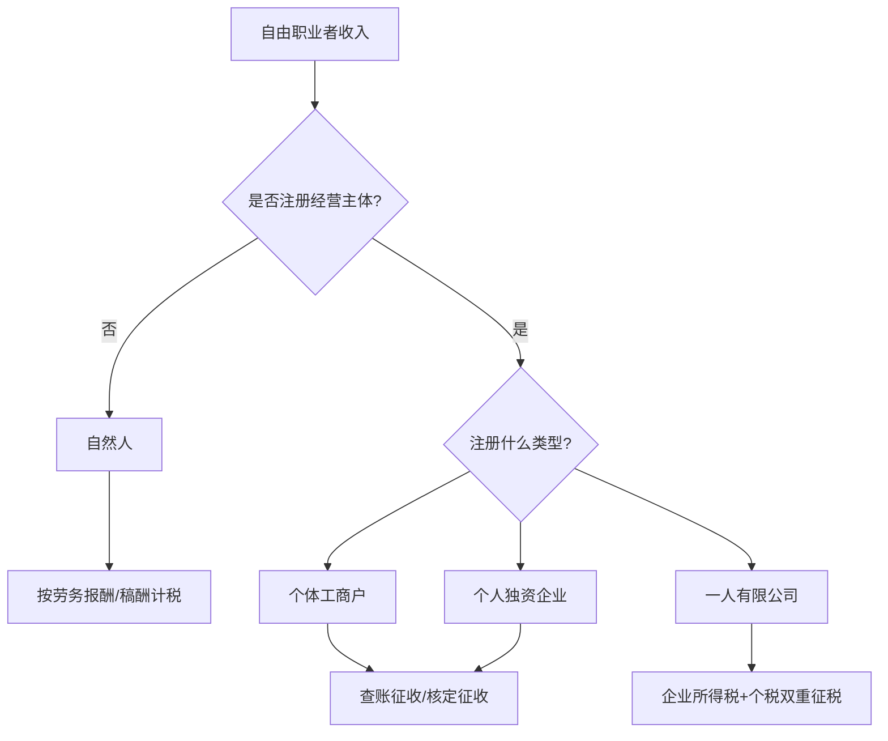
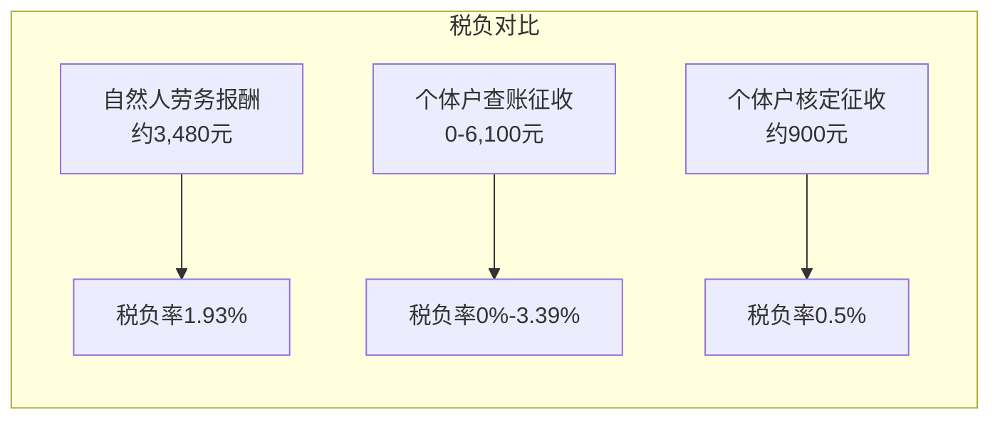
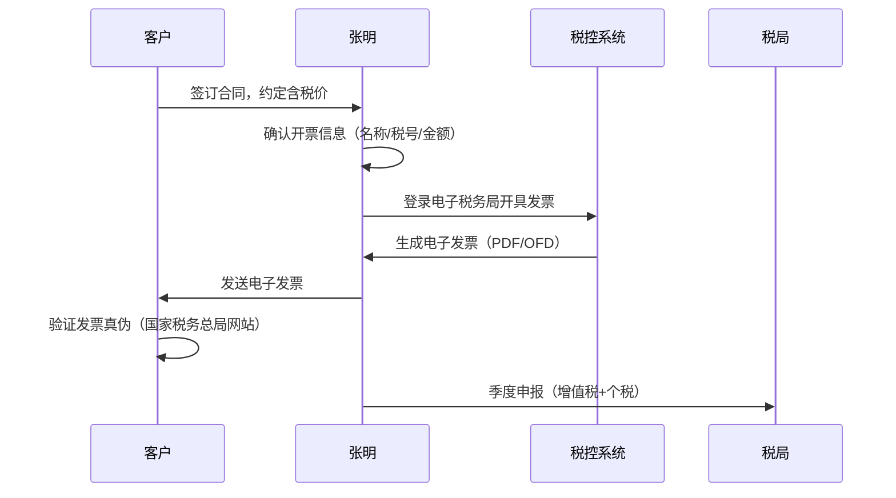
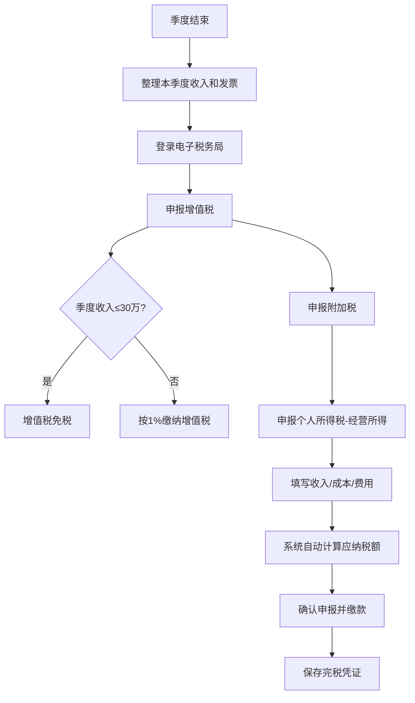

## 案例二：自由职业者的税务优化

自由职业者（包括自媒体人、设计师、程序员、咨询顾问、翻译等）的收入来源多样、支付方分散，税务处理比工薪族复杂得多。本案例以一位典型的自由职业者为样本，完整展示从收入确认、身份选择、计税方式比较、发票管理到社保筹划的全链路优化方案。

### 一、案例背景

**人物画像：** 张明，30岁，前互联网公司UI设计师，2024年辞职成为全职自由职业者。主要收入来源包括：

| 收入类型 | 月均收入（元） | 年收入（元） | 支付方 |
|---------|-------------|------------|-------|
| 设计项目（Logo/海报/网页） | 8,000 | 96,000 | 5家中小企业客户 |
| 在线课程（设计平台） | 3,000 | 36,000 | 腾讯课堂/网易云课堂 |
| 素材售卖（图标/模板） | 2,000 | 24,000 | 站酷海洛/千图网 |
| 咨询顾问费 | 2,000 | 24,000 | 2家创业公司 |
| **合计** | **15,000** | **180,000** | — |

**初始困境：** 张明辞职后完全不了解自由职业者的税务规则，前半年未申报纳税，后被客户提醒需要提供发票才意识到问题的严重性。年收入18万，如果不做任何规划，可能面临高额税负和滞纳金风险。

### 二、自由职业者的税务身份选择

自由职业者在税法上没有独立的"自由职业"类别，需要根据实际业务选择合适的纳税身份。不同身份对应完全不同的税负结构。

#### 2.1 四种可选身份

**身份对比一览：**

| 维度 | 自然人 | 个体工商户 | 个人独资企业 | 一人有限公司 |
|------|-------|-----------|------------|------------|
| 注册门槛 | 无需注册 | 需工商登记 | 需工商登记 | 需工商登记 |
| 税种 | 个人所得税 | 个税+增值税 | 个税+增值税 | 企税+个税+增值税 |
| 计税方式 | 劳务报酬20%-40% | 经营所得5%-35% | 经营所得5%-35% | 企税25%+分红20% |
| 发票能力 | 去税局代开 | 自开普票/专票 | 自开普票/专票 | 自开普票/专票 |
| 社保 | 需自行缴纳 | 可缴纳职工社保 | 可缴纳职工社保 | 强制缴纳五险一金 |
| 适合年收入 | <10万 | 10万-500万 | 10万-500万 | >500万 |
| 风险隔离 | 无限责任 | 无限责任 | 无限责任 | 有限责任 |

#### 2.2 张明的选择分析

张明年收入18万，最优选择是**注册个体工商户**，原因如下：

1. **无需双重征税：** 只缴个人所得税，不像有限公司要先缴25%企业所得税再缴20%分红个税
2. **可核定征收：** 部分地区对设计服务类个体户允许核定征收，税负极低
3. **可自行开票：** 不需要每次去税局代开，客户接受度高
4. **社保灵活：** 可以按灵活就业人员缴纳，也可以注册后按职工标准缴纳

### 三、不同计税方式的税额测算

这是自由职业者税务优化的核心——不同计税方式下，同样18万年收入，税额可能相差数倍。

#### 3.1 方式一：自然人劳务报酬（最差情况）

如果张明以自然人身份取得收入，按劳务报酬计税：

**预扣预缴阶段：**

每笔收入支付方先预扣个税。劳务报酬预扣税率：

| 每次收入 | 预扣率 | 速算扣除数 |
|---------|-------|----------|
| 不超过20,000元 | 20% | 0 |
| 20,000-50,000元 | 30% | 2,000 |
| 超过50,000元 | 40% | 7,000 |

以月均15,000元为例，假设分3笔收到（5,000+5,000+5,000）：

每次预扣 = 5,000 × (1-20%) × 20% = 800元
月预扣合计 = 800 × 3 = 2,400元
年预扣合计 = 2,400 × 12 = 28,800元

**汇算清缴阶段：**

劳务报酬并入综合所得，适用3%-45%累进税率。假设张明无其他扣除：

- 年收入：180,000元
- 劳务报酬收入额：180,000 × (1-20%) = 144,000元
- 基本减除费用：60,000元
- 专项扣除（社保等）：约24,000元（按灵活就业估算）
- 应纳税所得额：144,000 - 60,000 - 24,000 = 60,000元
- 适用税率：10%，速算扣除数2,520元
- 应纳税额：60,000 × 10% - 2,520 = 3,480元

汇算后可退回预扣多缴的部分，但**全年仍需缴税约3,480元**，且存在以下问题：
- 每笔收入被预扣，现金流压力大
- 需要所有支付方配合预扣，实操困难
- 部分客户不愿为自然人代扣代缴

#### 3.2 方式二：个体工商户查账征收

注册个体户后，按经营所得计税。假设张明合理列支了经营成本：

| 项目 | 金额（元） | 说明 |
|------|----------|------|
| 年收入 | 180,000 | 含税收入 |
| 增值税 | 0 | 季度30万以内免征（2024年政策） |
| 经营成本 | 36,000 | 软件订阅+设备折旧+办公费用 |
| 业主工资 | 60,000 | 每月5,000元（部分地区允许） |
| 社保公积金 | 24,000 | 按灵活就业缴纳 |
| 减除费用 | 60,000 | 每年6万基本减除 |
| **应纳税所得额** | **0** | 成本费用已覆盖收入 |

**结果：** 如果成本列支充分，18万年收入可以实现**零个税**。

即使成本列支不充分（比如只有2万可列支），应纳税所得额为：
180,000 - 20,000 - 60,000 - 24,000 = 76,000元

经营所得税率表（全年）：

| 应纳税所得额 | 税率 | 速算扣除数 |
|------------|------|----------|
| 不超过30,000元 | 5% | 0 |
| 30,000-90,000元 | 10% | 1,500 |
| 90,000-300,000元 | 20% | 10,500 |
| 300,000-500,000元 | 30% | 40,500 |
| 超过500,000元 | 35% | 65,500 |

76,000 × 10% - 1,500 = 6,100元

#### 3.3 方式三：个体工商户核定征收

部分地区对个体户实行核定征收，应税所得率通常为10%（服务业）：

- 核定应纳税所得额：180,000 × 10% = 18,000元
- 适用税率：5%
- 应纳税额：18,000 × 5% = 900元

**注意：** 2024年后各地核定征收政策收紧，设计服务类不一定能核定。需要咨询当地税局。

#### 3.4 三种方式税负对比

| 计税方式 | 年税额（元） | 税负率 | 现金流影响 | 操作复杂度 |
|---------|-----------|-------|----------|----------|
| 自然人劳务报酬 | 3,480 | 1.93% | 差（被预扣） | 低 |
| 个体户查账征收 | 0-6,100 | 0%-3.39% | 好（自行申报） | 中 |
| 个体户核定征收 | 900 | 0.5% | 好 | 低 |

**结论：** 张明选择个体户核定征收最优，查账征收次之，自然人劳务报酬最差。但如果年收入超过50万，个体户查账征收可能更优（可充分列支成本）。

### 四、成本费用的合规列支

查账征收的核心在于合法列支成本，降低应纳税所得额。自由职业者常见的可列支成本：

#### 4.1 硬件设备

| 设备 | 购入价（元） | 折旧年限 | 年折旧额（元） |
|------|-----------|---------|-------------|
| MacBook Pro | 16,000 | 3年 | 5,333 |
| 显示器 | 4,000 | 3年 | 1,333 |
| iPad Pro | 8,000 | 3年 | 2,667 |
| 手机 | 6,000 | 3年 | 2,000 |
| **小计** | — | — | **11,333** |

**操作要点：** 购买时必须以个体户名义取得发票（抬头写个体户名称和税号），个人名义购买不能列支。

#### 4.2 软件与服务订阅

| 软件/服务 | 年费（元） | 用途 |
|----------|----------|------|
| Adobe Creative Cloud | 3,500 | 设计工具 |
| Figma专业版 | 1,200 | 协作设计 |
| 蓝湖/墨刀 | 600 | 原型交付 |
| 阿里云服务器 | 2,400 | 作品展示网站 |
| 域名+CDN | 500 | 网站运维 |
| 飞书/钉钉 | 0（免费版） | 客户沟通 |
| **小计** | **8,200** | — |

#### 4.3 办公与差旅

| 项目 | 年费用（元） | 说明 |
|------|-----------|------|
| 咖啡馆办公消费 | 6,000 | 每月500元，需开票 |
| 快递费 | 1,200 | 合同/资料寄送 |
| 客户拜访交通费 | 2,400 | 打车/高铁 |
| 行业会议/展览 | 3,000 | 门票+差旅 |
| 商务餐费 | 4,800 | 客户沟通（60%可列支） |
| **小计** | **14,520** | — |

#### 4.4 学习与提升

| 项目 | 年费用（元） | 说明 |
|------|-----------|------|
| 在线课程 | 3,000 | 专业技能提升 |
| 书籍/资料 | 1,000 | 行业书籍 |
| 认证考试费 | 2,000 | 设计类认证 |
| **小计** | **6,000** | — |

#### 4.5 成本列支汇总

| 类别 | 年金额（元） | 占收入比 |
|------|-----------|---------|
| 硬件折旧 | 11,333 | 6.3% |
| 软件订阅 | 8,200 | 4.6% |
| 办公差旅 | 14,520 | 8.1% |
| 学习提升 | 6,000 | 3.3% |
| **合计** | **40,053** | **22.3%** |

列支40,053元成本后，查账征收的应纳税所得额：
180,000 - 40,053 - 60,000（减除费用）= 79,947元
税额 = 79,947 × 10% - 1,500 = 6,495元

如果再加上社保24,000元，应纳税所得额降至55,947元，税额 = 55,947 × 10% - 1,500 = 4,095元。

### 五、发票管理实务

发票是自由职业者税务合规的命脉。没有发票，收入无法入账；发票管理混乱，可能触发税务稽查。

#### 5.1 开票流程

#### 5.2 发票类型选择

| 场景 | 发票类型 | 税率 | 说明 |
|------|---------|------|------|
| 季度收入≤30万 | 普通发票 | 0% | 免征增值税 |
| 季度收入>30万 | 普通发票 | 1% | 2024年小规模纳税人优惠 |
| 客户要求专票 | 专用发票 | 1% | 无论季度金额，专票不免税 |

**张明的操作：** 月均收入15,000元，季度45,000元，未超过30万免征额度（按季度申报），开普票即可免增值税。

#### 5.3 常见发票问题及解决方案

**问题一：客户不要发票，是否可以不开？**

不可以。即使客户不要票，收入仍需申报纳税。不开票不等于不纳税。税务系统通过银行流水、第三方支付数据可以追溯收入。建议所有收入都正常开票申报。

**问题二：个人客户无法提供发票抬头怎么办？**

个人客户购买设计服务，可以开"个人"抬头的普通发票，税号填写身份证号或留空。

**问题三：跨平台收入如何开票？**

在线课程平台（如腾讯课堂）通常由平台代扣代缴个税并开具发票，这部分收入不需要重复开票。素材售卖平台同理。需要确认平台是否已经代扣，避免重复纳税。

### 六、社保与公积金筹划

自由职业者的社保是个容易被忽视但影响巨大的问题。

#### 6.1 三种社保方案对比

| 方案 | 月缴费（元） | 年缴费（元） | 医保待遇 | 养老待遇 | 适用场景 |
|------|-----------|-----------|---------|---------|---------|
| 灵活就业社保 | 1,500-2,500 | 18,000-30,000 | 职工医保 | 职工养老 | 收入稳定，需要完整保障 |
| 城乡居民社保 | 300-500 | 3,600-6,000 | 居民医保 | 居民养老 | 收入较低，预算有限 |
| 个体户职工社保 | 2,000-3,500 | 24,000-42,000 | 职工医保 | 职工养老 | 已注册个体户，需列支成本 |

#### 6.2 张明的社保策略

张明已注册个体户，选择**个体户职工社保**方案：

- 缴费基数：按当地最低基数（约6,000元/月）
- 个人部分：约800元/月（养老8%+医疗2%+失业0.5%）
- 单位部分：约1,600元/月（养老16%+医疗8%+失业0.5%+工伤0.2%）
- 合计约2,400元/月，年缴费约28,800元

**关键优势：** 单位缴纳部分可以作为经营成本列支，直接减少应纳税所得额。

#### 6.3 公积金的特殊考量

自由职业者通常无法缴纳住房公积金（除非注册公司）。但部分城市已开放灵活就业人员公积金缴存：

- 深圳：灵活就业人员可自愿缴存，月缴存额190-4,172元
- 苏州：已开放灵活就业人员公积金
- 广州：2024年试点灵活就业公积金

公积金缴存可在个人所得税前扣除，同时为未来购房贷款提供资格。如果所在城市支持，建议按最低标准缴存。

### 七、季度申报全流程

#### 7.1 申报时间节点

| 税种 | 申报周期 | 截止日期 | 申报渠道 |
|------|---------|---------|---------|
| 增值税 | 季度 | 次季度首月15日 | 电子税务局 |
| 个人所得税（经营所得） | 季度 | 次季度首月15日 | 自然人电子税务局 |
| 个人所得税（综合所得） | 年度 | 次年3月1日-6月30日 | 个人所得税APP |
| 附加税 | 季度 | 随增值税一同申报 | 电子税务局 |

#### 7.2 季度申报操作步骤

#### 7.3 常见申报错误

| 错误 | 后果 | 正确做法 |
|------|------|---------|
| 季度申报逾期 | 滞纳金（日万分之五）+罚款 | 设置日历提醒，提前3天申报 |
| 收入漏报 | 补税+罚款+信用记录 | 建立收入台账，逐笔记录 |
| 成本凭证缺失 | 成本不得列支，税额增加 | 所有支出即时索要发票 |
| 混淆含税/不含税价 | 税额计算错误 | 合同明确约定含税/不含税 |
| 忘记享受优惠 | 多缴税 | 每季度关注税务局公告 |

### 八、进阶优化策略

#### 8.1 收入拆分策略

如果张明的配偶也有工作能力，可以考虑：

- 部分业务以配偶名义承接和开票
- 将家庭总收入拆分到两个个体户
- 每个个体户单独享受30万/季度免征额度和费用减除

**示例：** 张明年收入18万拆分为张明10万+配偶8万，两个个体户均可享受减除费用，总税负可能降至零。

#### 8.2 业务外包降低收入额

将部分非核心工作外包给其他自由职业者：

- 张明接单设计项目收入10万
- 将插画、动效等外包给他人，支出4万
- 实际经营所得：10万 - 4万 = 6万
- 外包支出取得发票后可作为成本列支

#### 8.3 跨年收入调节

利用经营所得按年度计算的特点，在合法范围内调节收入确认时间：

- 12月完成的项目，合同约定1月付款 → 收入计入下一年
- 提前采购下一年的软件订阅/设备 → 成本计入当年
- 年底集中列支已发生但未入账的费用

#### 8.4 区域税收优惠利用

部分地区对个体户有特殊优惠政策：

| 地区 | 优惠政策 | 适用条件 |
|------|---------|---------|
| 海南自贸港 | 经营所得减按15%征收 | 实质性经营 |
| 部分中西部地区 | 核定征收应税所得率较低 | 需在当地注册经营 |
| 产业园区 | 返税30%-70% | 入驻园区 |

**注意：** 不建议仅为税收优惠在异地注册空壳个体户，存在被认定为虚假注册的风险。

### 九、风险防控

#### 9.1 税务稽查的常见触发条件

| 风险信号 | 说明 | 防范措施 |
|---------|------|---------|
| 长期零申报 | 连续6个月零申报会被关注 | 如实申报，无收入也要按时报 |
| 收入与行业不匹配 | 设计师年收入只有3万？ | 合理申报，不做虚假低报 |
| 成本费用率异常 | 成本占比90%以上 | 控制在合理范围内（30%-60%） |
| 关联交易 | 自己给自己开票 | 避免同一控制人下的开票循环 |
| 大额现金交易 | 收款走私人账户 | 所有业务收入走公户或留痕 |

#### 9.2 合规底线

1. **所有收入如实申报：** 即使客户不要发票，收入仍需计入
2. **发票真实合规：** 不买票、不虚开、不代开
3. **成本凭证完整：** 每笔列支都要有对应发票或合法凭证
4. **按时申报缴纳：** 不逾期、不漏报
5. **保留业务证据：** 合同、聊天记录、交付物保存至少5年

### 十、优化前后对比总结

| 维度 | 优化前（自然人） | 优化后（个体户+核定） | 改善幅度 |
|------|---------------|-------------------|---------|
| 年税额 | 3,480元 | 900元 | 节省74% |
| 增值税 | 不确定 | 0元（季度免征） | 确定免税 |
| 社保 | 无保障 | 职工社保全覆盖 | 质的飞跃 |
| 发票能力 | 需去税局代开 | 自行开具 | 效率提升10倍 |
| 申报合规 | 未申报（风险极高） | 按季申报 | 完全合规 |
| 现金流 | 被预扣，回款慢 | 自行申报，资金自主 | 灵活度大幅提升 |
| 业务拓展 | 无法签正式合同 | 可签合同+开发票 | 客户信任度提升 |

### 十一、关键教训与经验

1. **身份选择是第一步：** 注册个体户的成本很低（很多城市免费），但带来的税务优势巨大。年收入超过10万的自由职业者，强烈建议注册个体户。

2. **发票习惯比税额更重要：** 养成每笔支出索要发票的习惯，年底汇总时不会手忙脚乱。推荐使用电子税务局的"扫码开票"功能，手机扫一下就能开票。

3. **社保不能省：** 自由职业者最大的风险是没有保障。一场大病可能消耗多年积蓄。社保是底线，商业保险是补充。

4. **税务知识是必备技能：** 自由职业者不能把税务完全交给别人。至少要了解基本的税种、税率、申报流程，才能做出正确的经营决策。

5. **合规是长期投资：** 短期看，逃税少缴了钱；长期看，税务风险一旦爆发，罚款、滞纳金、信用记录受损，代价远超省下的税款。

6. **善用数字化工具：** 推荐使用"个人所得税APP"查看自己的纳税记录，使用"电子税务局"进行申报，使用记账软件（如"随手记"、"挖财"）管理收支。

7. **年度复盘不可少：** 每年年底花半天时间，回顾全年收入、成本、税额，评估下一年的税务策略是否需要调整。税法每年都有变化，去年的最优方案今年未必适用。
