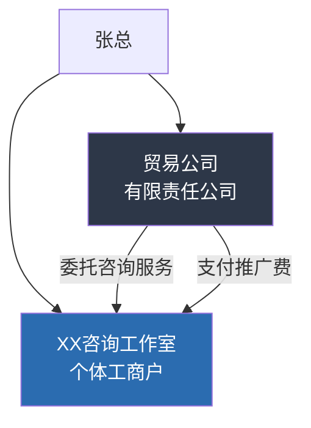
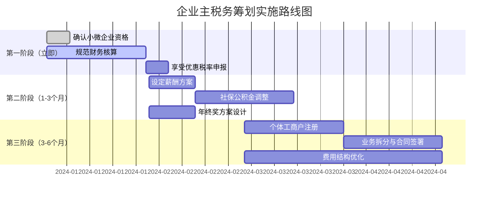

## 案例三：企业主的税务筹划

企业主是税务筹划需求最为复杂、筹划空间也最大的群体。与工薪族和自由职业者不同，企业主同时面对企业所得税、增值税、个人所得税等多重税负，且可以通过调整企业架构、业务模式、薪酬体系等手段实现系统性节税。本案例以一家年营收500万元的贸易公司为原型，展示企业主如何从"裸奔式经营"转变为"合规节税型经营"。

---

### 一、案例背景

#### 1.1 企业基本情况

| 项目 | 详情 |
|------|------|
| 企业类型 | 有限责任公司（一般纳税人） |
| 所属行业 | 日用消费品贸易 |
| 年营业收入 | 500万元 |
| 年利润总额 | 120万元（利润率24%） |
| 员工人数 | 8人 |
| 资产总额 | 300万元 |
| 股东结构 | 张总持股100%，配偶不持股 |
| 张总年薪 | 未设固定薪酬，以分红方式提取 |

#### 1.2 筹划前的税负全景

张总的企业在筹划前处于"自然状态"——没有进行任何主动的税务规划。以下是年度税负明细：

**企业层面税负：**

| 税种 | 计税依据 | 税率 | 应纳税额 |
|------|---------|------|---------|
| 增值税（销项-进项） | 增值额约150万 | 13% | 约19.5万（抵扣后） |
| 附加税（城建+教育费附加） | 增值税额 | 12% | 约2.34万 |
| 企业所得税 | 应纳税所得额120万 | 25% | 30万 |
| 印花税 | 合同金额 | 0.03% | 约0.15万 |
| **企业层面合计** | | | **约52万** |

**个人层面税负（分红）：**

张总将税后利润全部以分红形式提取：

| 项目 | 金额 |
|------|------|
| 税后利润 | 120万 - 30万 = 90万 |
| 个人所得税（股息红利） | 90万 × 20% = 18万 |
| 张总实际到手 | 72万 |

**综合税负率：**

- 总税负：52万 + 18万 = 70万
- 综合税负率：70万 ÷ 500万 = 14%
- 利润税负率：70万 ÷ 120万 = 58.3%

也就是说，张总辛辛苦苦赚了120万利润，最终只有72万到手，近六成被税吃掉了。这个税负水平在中国中小企业中非常普遍，但完全可以通过合法筹划大幅降低。

---

### 二、税务诊断：问题出在哪里？

#### 2.1 三大核心问题

**问题一：没有合理利用小微企业优惠**

张总的企业年应纳税所得额120万，完全符合小型微利企业标准（年应纳税所得额≤300万、从业人数≤300人、资产总额≤5000万），但却按25%的标准税率缴纳企业所得税。如果享受小微企业优惠，实际税率仅为5%（应纳税所得额减按25%计入，税率20%），企业所得税从30万降至6万，直接节省24万。

> 关键点：很多企业主不知道自己符合小微企业条件，或者因为财务核算不规范导致无法享受优惠。

**问题二：薪酬结构完全缺失**

张总没有给自己发工资，所有利润都通过分红提取。分红面临两道税——先交25%企业所得税，再交20%个人所得税，综合税率高达40%。而如果张总给自己设定合理的工资薪金，工资可以在企业所得税前扣除（减少企业所得税），同时适用3%-45%的累进税率，在一定额度内综合税负远低于分红。

**问题三：缺乏业务架构设计**

张总的公司是一家"大而全"的贸易公司，所有业务都在同一个主体内。没有考虑业务拆分、关联交易定价、组织架构优化等手段，白白浪费了很多筹划空间。

#### 2.2 税负损失量化

| 问题 | 损失金额（年） |
|------|--------------|
| 未享受小微企业优惠 | 多缴企业所得税24万 |
| 薪酬结构缺失 | 多缴个税约5-8万 |
| 业务架构未优化 | 潜在节税空间10-15万 |
| **合计潜在节税** | **约40-47万** |

---

### 三、筹划方案设计

张总的税务筹划需要从企业层面和个人层面同步推进，形成一套系统性方案。

#### 3.1 第一层：享受小微企业优惠（立即见效）

**操作要点：**

1. 确认企业符合小型微利企业认定标准
2. 在企业所得税预缴和汇算清缴时正确申报
3. 规范财务核算，确保账目清晰

**政策依据：**

根据《财政部 税务总局关于进一步支持小微企业和个体工商户发展的税收优惠政策的公告》（2023年第6号），小型微利企业年应纳税所得额不超过300万元的部分，减按25%计入应纳税所得额，按20%税率缴纳企业所得税。

**节税效果：**

| 项目 | 筹划前 | 筹划后 |
|------|--------|--------|
| 应纳税所得额 | 120万 | 120万 |
| 适用税率 | 25% | 5%（25%×20%） |
| 企业所得税 | 30万 | 6万 |
| **节省** | | **24万** |

> 注意：如果张总的企业年应纳税所得额接近300万的临界点，需要特别注意利润控制。超过300万一分钱，将按25%全额征税（不能分段计算），可能反而多缴税。

#### 3.2 第二层：优化薪酬体系（中期见效）

**方案设计：**

为张总设定月薪3万元（年薪36万元），同时合理利用年终奖单独计税政策。

**企业层面影响：**

- 工资薪金36万可在企业所得税前扣除
- 社保公积金企业承担部分（约工资的30%）：36万 × 30% = 10.8万，同样可扣除
- 合计可扣除46.8万
- 企业所得税减少：46.8万 × 5%（小微优惠税率）= 2.34万

**个人层面影响：**

| 收入项目 | 金额 | 计税方式 | 应缴个税 |
|---------|------|---------|---------|
| 月薪3万×12月 | 36万 | 累进税率 | 约4.3万（扣除社保公积金和起征点后） |
| 年终奖 | 12万 | 单独计税 | 约1.19万 |
| **工资个税合计** | | | **约5.5万** |

**与纯分红方案对比：**

| 提取方式 | 金额 | 个税 | 税后到手 |
|---------|------|------|---------|
| 纯分红（36万部分） | 36万 | 7.2万 | 28.8万 |
| 工资+年终奖 | 36万+12万=48万 | 5.5万 | 42.5万 |
| **差额** | | **省1.7万** | **多13.7万** |

工资方案不仅个税更低，而且工资+年终奖总共48万比纯分红36万多提取了12万，到手还多了13.7万。这是因为工资在企业所得税前扣除，相当于国家帮你"补贴"了一部分。

**社保公积金的隐藏价值：**

张总按3万月薪缴纳社保公积金，个人承担约10.8万/年。这笔钱虽然当期到手少了，但：
- 公积金个人部分（约4.3万/年）可以提取，相当于强制储蓄
- 社保缴费基数提高，未来退休金更高
- 社保公积金全部在个税税前扣除

#### 3.3 第三层：业务架构优化（中长期见效）

**方案一：设立个体工商户/个独企业承接部分业务**

将公司的部分服务型业务（如市场推广、咨询服务）剥离，由张总或配偶设立的个体工商户承接。

**架构示意：**

**税务效果：**

假设个体工商户承接80万/年的咨询服务业务：

| 项目 | 贸易公司（原） | 个体工商户（新） |
|------|--------------|----------------|
| 收入 | 80万（含在总营收内） | 80万 |
| 税种 | 企业所得税25%+分红20% | 经营所得个税 |
| 综合税率 | 约40% | 核定征收约3%-5% |
| 税负 | 约32万 | 约2.4-4万 |
| **节省** | | **约28-30万** |

> 合规要点：个体工商户必须有真实业务，需要签订合同、开具发票、保留业务凭证。不能虚构业务或虚开发票，否则面临严重的法律风险。

**方案二：合理利用业务招待费和广告费扣除**

| 费用类型 | 扣除限额 | 实际发生 | 可扣除额 |
|---------|---------|---------|---------|
| 业务招待费 | 发生额60%且≤营收0.5% | 10万 | 2.5万（500万×0.5%） |
| 广告和业务宣传费 | ≤营收15% | 20万 | 20万（未超限额） |
| 职工教育经费 | ≤营收8% | 5万 | 5万（未超限额） |

> 提示：业务招待费的扣除限额是"发生额的60%与营收0.5%的较小者"，是所有费用中扣除比例最严的。企业主应尽量将应酬支出转化为会议费、差旅费等可全额扣除的项目（需有真实业务支撑）。

**方案三：固定资产加速折旧**

如果企业购入设备、车辆等固定资产，可以选择加速折旧方法（双倍余额递减法或年数总和法），在资产使用前期多提折旧，延缓纳税。

示例：购入一辆50万的商务用车

| 折旧方法 | 第1年折旧 | 第2年折旧 | 第3年折旧 | 税收递延效果 |
|---------|---------|---------|---------|------------|
| 直线法（4年） | 12.5万 | 12.5万 | 12.5万 | 无 |
| 双倍余额递减法 | 25万 | 12.5万 | 6.25万 | 第1年多抵12.5万 |
| 一次性扣除（500万以下） | 50万 | 0 | 0 | 最大化当年抵扣 |

> 政策依据：单位价值不超过500万元的设备器具，可选择一次性税前扣除。这对有设备采购需求的企业非常有利。

---

### 四、筹划方案汇总与效果对比

#### 4.1 分项节税效果

| 筹划措施 | 年节税金额 | 实施难度 | 见效时间 |
|---------|----------|---------|---------|
| 享受小微企业优惠 | 24万 | ★☆☆☆☆ | 立即 |
| 优化薪酬体系 | 1.7万+（含企业端2.34万） | ★★☆☆☆ | 1-3个月 |
| 设立个体户承接业务 | 28-30万 | ★★★☆☆ | 3-6个月 |
| 费用优化（招待费等） | 3-5万 | ★★☆☆☆ | 1-3个月 |
| 固定资产加速折旧 | 视采购金额而定 | ★☆☆☆☆ | 当年 |

#### 4.2 筹划前后综合对比

| 指标 | 筹划前 | 筹划后 | 变化 |
|------|--------|--------|------|
| 企业所得税 | 30万 | 3-4万 | -26万 |
| 个人所得税（含工资） | 18万 | 12-15万 | -3-6万 |
| 个体户税负 | 0 | 3-4万 | +3-4万 |
| 总税负 | 约70万 | 约20-25万 | **降低约65%-70%** |
| 综合税负率 | 14% | 4%-5% | 下降9-10个百分点 |
| 张总到手 | 72万 | 95-100万 | **增加23-28万** |

这是一个非常可观的改善——同样的业务、同样的利润，通过合法筹划，张总每年可以多拿到手20-30万元。

---

### 五、实施路线图

#### 5.1 分阶段推进

#### 5.2 每一步的具体操作

**第一步：确认小微企业资格（本周完成）**

1. 登录电子税务局，查看企业类型认定
2. 核实从业人数和资产总额是否符合标准
3. 如不符合，联系税务专管员确认或申请变更

**第二步：规范财务核算（1个月内完成）**

1. 聘请或更换为专业的代账会计（如果现有会计不专业）
2. 确保收入、成本、费用的核算准确
3. 建立规范的发票管理制度
4. 区分个人消费和企业经营支出

**第三步：薪酬方案落地（1-3个月完成）**

1. 与代账会计沟通薪酬方案
2. 在工资系统中录入张总的基本工资和社保信息
3. 每月按时申报个税
4. 年终时按单独计税方式申报年终奖

**第四步：业务架构调整（3-6个月完成）**

1. 咨询工商部门，了解个体工商户注册流程
2. 注册个体工商户（可选择在有税收优惠的地区）
3. 与贸易公司签订真实的服务合同
4. 按月开具发票、按期申报纳税

---

### 六、风险提示与合规红线

#### 6.1 绝对不能触碰的红线

| 风险行为 | 后果 | 严重程度 |
|---------|------|---------|
| 虚开发票 | 刑事责任，最高无期徒刑 | ★★★★★ |
| 虚构业务转移利润 | 补税+滞纳金+0.5-5倍罚款 | ★★★★★ |
| 隐瞒收入 | 补税+滞纳金+罚款 | ★★★★☆ |
| 个人消费计入企业费用 | 补税+罚款 | ★★★☆☆ |
| 关联交易定价明显不合理 | 纳税调整+补税 | ★★★☆☆ |

#### 6.2 灰色地带的风险管理

**核定征收的政策变动风险：**

近年来，多地收紧了个体工商户和个人独资企业的核定征收政策。2021年以来，财政部和税务总局多次强调"加强高收入人群税收征管"，核定征收的口径在逐步收窄。

应对策略：
- 不要过度依赖核定征收，做好查账征收的准备
- 保持业务真实性和财务规范性
- 密切关注当地税务政策变化

**业务拆分的合理性审查：**

税务机关可能对业务拆分进行合理性审查，重点关注：
- 拆分后的各主体是否有独立的经营场所和人员
- 关联交易价格是否符合独立交易原则
- 业务拆分是否有合理的商业目的（而非仅为避税）

#### 6.3 常见误区

**误区一：多注册几个公司就能少缴税**

拆分公司确实可以利用多个小微企业的优惠，但如果拆分后的公司之间缺乏独立性（共用人员、场地、客户），税务机关可以认定为"拆分逃税"，将各公司合并征税。

**误区二：把所有开支都塞进公司**

个人消费（家庭开支、子女教育、个人购物）不能计入企业费用。一旦被查，不仅要补缴税款，还可能面临罚款。企业主应严格区分"公司的事"和"个人的事"。

**误区三：税务筹划就是找发票**

找发票抵税是最原始也最危险的做法。金税四期系统下，发票数据与银行流水、社保数据、市场监管数据全面打通，异常发票一查一个准。

**误区四：筹划一次就一劳永逸**

税收政策每年都在调整。2023年小微企业优惠刚经历过变化，2024年又有多项新政策出台。企业主应每年至少进行一次税务健康检查，根据最新政策调整筹划方案。

---

### 七、进阶：企业主的长期税务战略

#### 7.1 从节税到税务资产规划

当企业发展到一定规模（年利润超过300万），简单的筹划手段效果递减，需要从战略层面考虑：

**企业重组与股权架构：**

- 设立控股公司，实现利润在不同主体间的合理分配
- 利用居民企业之间的股息红利免税政策（《企业所得税法》第二十六条）
- 通过股权架构设计为未来的融资、上市做准备

**家族信托与传承规划：**

对于高净值企业主，可以考虑设立家族信托：
- 将企业股权装入信托，实现所有权与经营权分离
- 信托收益分配可以实现一定程度的税务优化
- 同时实现资产隔离和传承目的

#### 7.2 行业特殊优惠政策

不同行业有各自的税收优惠政策，企业主应主动了解和争取：

| 行业/领域 | 优惠政策 | 节税效果 |
|---------|---------|---------|
| 高新技术企业 | 所得税15%+研发加计扣除100% | 所得税降低40% |
| 软件企业 | 增值税即征即退（超3%部分退还） | 增值税大幅降低 |
| 农业企业 | 免征或减半征收企业所得税 | 可能全免 |
| 西部大开发 | 所得税15% | 所得税降低40% |
| 海南自贸港 | 所得税15%+个税优惠 | 综合税负大幅降低 |

#### 7.3 数字化税务管理

随着金税四期的全面推行，企业主应拥抱数字化：

1. **使用专业的财务软件**：告别手工记账，使用金蝶、用友等ERP系统
2. **电子发票管理**：全面使用数电发票，建立发票台账
3. **银行流水与账务联动**：确保每一笔资金进出都有对应的账务处理
4. **定期税务自查**：每季度进行一次内部税务自查，提前发现风险

---

### 八、本案例的核心启示

1. **小微企业优惠是企业主最容易忽略的节税手段**。很多企业主不知道自己符合条件，或者因为账务不规范而无法享受，每年白白多缴几十万税款。

2. **薪酬设计是企业主税务筹划的核心环节**。工资薪金和分红的税负差异巨大，合理的薪酬方案可以同时降低企业所得税和个人所得税。

3. **业务架构设计是高级筹划手段**。通过设立不同类型的经营主体，合理拆分业务，可以在合法合规的前提下大幅降低综合税负。

4. **合规是底线**。所有筹划必须建立在真实业务基础上，不能虚构交易、虚开发票。金税四期时代，侥幸心理是最危险的。

5. **税务筹划是持续过程**。税收政策不断变化，企业经营状况也在变化，筹划方案需要定期复盘和调整。建议企业主每年至少做一次全面的税务健康检查，或者聘请专业的税务顾问进行持续服务。

> 最后提醒：本案例中的数据基于特定假设，实际筹划效果因企业具体情况而异。涉及复杂税务问题时，建议咨询注册税务师或税务律师，确保方案的合法性和可行性。
