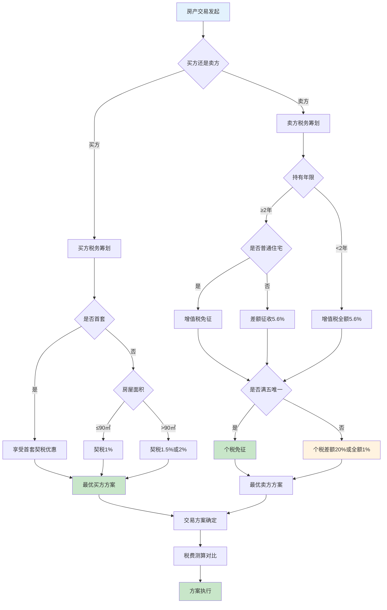
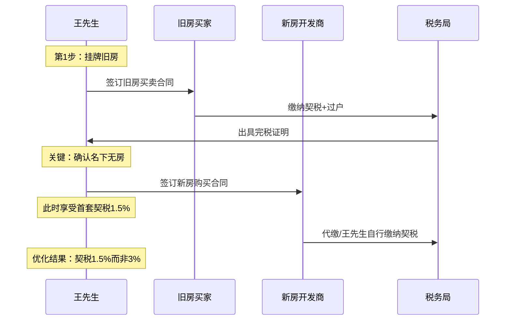
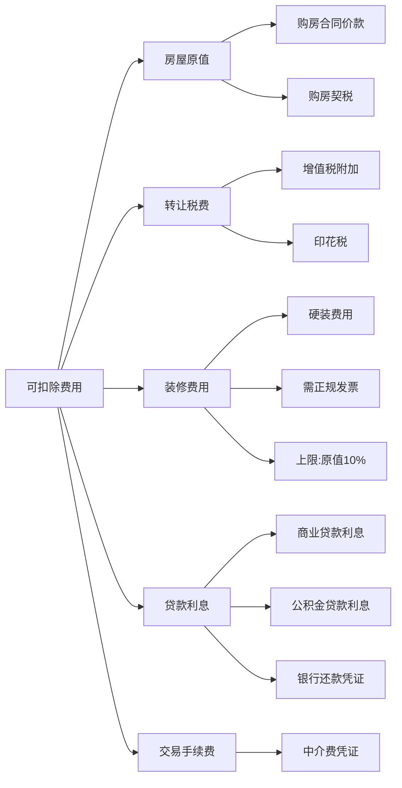
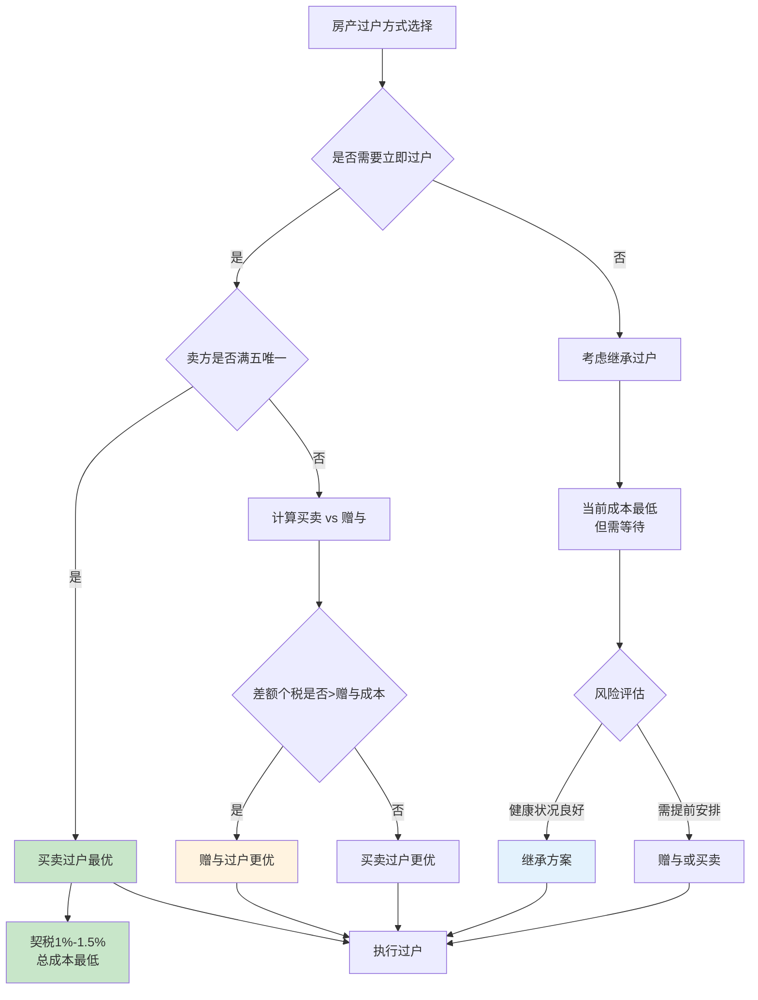
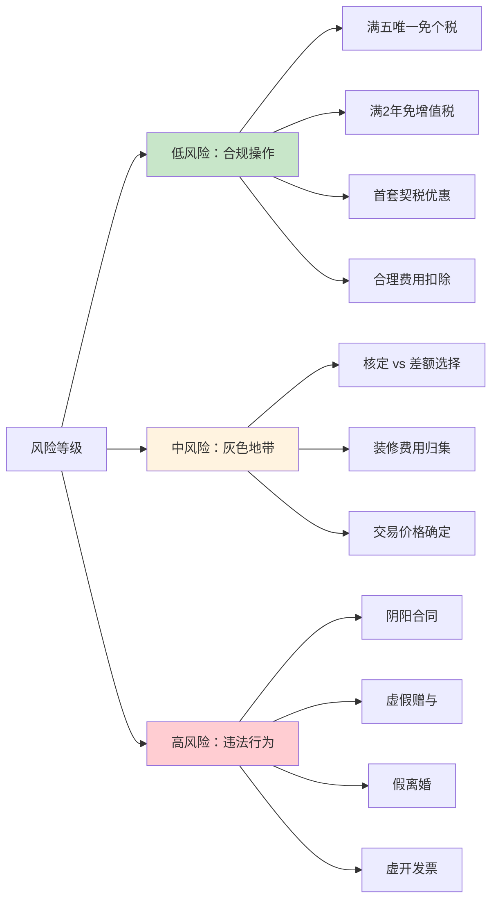

## 案例四：房产交易税务优化

房产交易是中国家庭最大额的单一资产交易，涉及契税、增值税及附加、个人所得税、土地增值税、印花税等多个税种。一套500万的住房交易，税负总额可能在15万至50万之间浮动——通过合理规划，节省10万以上完全可行。本案例以三个真实场景为主线，系统拆解房产买卖全流程的税务优化策略。

### 4.1 房产交易涉及的税种全景

在进入案例之前，先厘清房产交易中涉及的所有税种及计算逻辑。

#### 4.1.1 税种一览表

| 税种 | 纳税人 | 计税基础 | 税率/征收率 | 优惠政策 |
|------|--------|----------|-------------|----------|
| 契税 | 买方 | 成交价/核定价 | 1%-3% | 首套90㎡以下1%，90㎡以上1.5% |
| 增值税 | 卖方 | 差额/全额 | 5%（+附加约0.6%） | 满2年免征（普通住宅）；满5年唯一免征 |
| 个人所得税 | 卖方 | 差额20%/全额1% | 20%或1% | 满5年唯一免征 |
| 土地增值税 | 卖方（个人住宅暂免） | 增值额 | 30%-60%超率累进 | 个人销售住宅暂免 |
| 印花税 | 双方 | 成交价 | 0.025%（2023年后减半） | 个人销售住宅暂免 |

#### 4.1.2 房产交易税务决策流程



---

### 4.2 场景一：置换改善型住房的卖买联动优化

#### 4.2.1 案例背景

**人物画像：** 王先生，35岁，已婚，在上海工作。现有一套2016年购入的60㎡老公房（购入价200万，当前市值400万），属于"满五唯一"。现因家庭人口增加，计划置换一套95㎡、市值650万的新房。

**关键数据：**

| 项目 | 现有房产 | 目标房产 |
|------|----------|----------|
| 面积 | 60㎡ | 95㎡ |
| 购入价 | 200万 | — |
| 当前市值/购入价 | 400万 | 650万 |
| 持有年限 | 10年（满5年） | — |
| 是否唯一 | 是 | — |
| 产权人 | 王先生（单独所有） | — |

#### 4.2.2 直接交易的税负计算

**卖旧房（王先生为卖方）：**

- 增值税：满2年普通住宅，**免征**
- 附加税：随增值税免征
- 个人所得税：满五唯一，**免征**
- 土地增值税：个人住宅，**免征**
- 印花税：个人住宅，**免征**
- **卖方税费合计：0元**

**买新房（王先生为买方）：**

- 契税：卖掉旧房后属于首套，95㎡>90㎡，税率1.5%
- 契税 = 650万 × 1.5% = **9.75万元**
- 印花税：个人购买住宅，**免征**
- **买方税费合计：9.75万元**

**交易总税费：9.75万元**

#### 4.2.3 优化策略一：卖出与买入的时间配合

核心原则：**先卖后买，确保首套资格。**

很多人习惯先签新房合同再卖旧房，这会导致在购买新房时名下已有住房，无法享受首套契税优惠。



**如果顺序颠倒（先买后卖）：**

- 购买新房时名下有房，按二套计算契税
- 95㎡，二套契税 = 650万 × 3% = **19.5万元**
- **多缴税：19.5万 - 9.75万 = 9.75万元**

这个案例中，仅仅是调整交易顺序就能节省近10万元。

#### 4.2.4 优化策略二：产权登记方式的税务影响

王先生计划将新房登记为夫妻共有，这不会影响契税计算（以家庭为单位认定套数），但对未来出售时的税务处理有影响。

**对比分析：**

| 登记方式 | 优势 | 劣势 | 未来出售影响 |
|----------|------|------|-------------|
| 一方单独所有 | 出售时只需一人满足"满五唯一" | 离婚时产权风险 | 个税免征条件更容易达成 |
| 夫妻共有 | 产权清晰，双方权益有保障 | 未来需双方均无其他住房才能"唯一" | 个税免征条件更严格 |

**建议：** 如果未来有出售可能，登记在收入较低或名下无其他房产的一方更有利于税务规划。

#### 4.2.5 优化策略三：旧房装修费用的合理归集

虽然王先生的旧房属于"满五唯一"免征个税，但了解这个策略对其他场景很重要。

如果旧房不满足"满五唯一"，个税按差额20%计算时，装修费用可以作为"合理费用"从转让收入中扣除。

**扣除项目包括：**

- 原购房契税
- 住房装修费用（需有发票，且不超过购入价10%）
- 住房贷款利息（凭银行还款凭证）
- 转让过程中缴纳的税金
- 按规定支付的交易手续费

**实际操作要点：**

1. 装修发票必须在出售前取得，抬头为产权人
2. 装修金额有上限（一般不超过原购房款的10%），各地政策略有差异
3. 银行利息凭证每年从贷款银行打印
4. 所有凭证原件妥善保管，提交税务局审核

---

### 4.3 场景二：投资性房产出售的税负优化

#### 4.3.1 案例背景

**人物画像：** 李女士，42岁，在杭州有三套住宅。其中一套2018年购入的投资房（购入价300万，当前市值520万），计划在2026年出售变现。

**关键数据：**

| 项目 | 数据 |
|------|------|
| 购入价格 | 300万（含契税4.5万） |
| 当前市值 | 520万 |
| 持有年限 | 8年（满2年，满5年） |
| 是否唯一 | 否（名下另有2套） |
| 购入时契税 | 4.5万元 |
| 贷款利息累计 | 35万元 |
| 装修费用 | 15万元（有发票） |

#### 4.3.2 直接出售的税负计算

**增值税：**

满2年普通住宅免征（杭州90㎡以下容积率1.0以上、单价低于同区域均价1.44倍的为普通住宅）。

假设该房为普通住宅：增值税 = **0元**

如果为非普通住宅（杭州2024年后已取消普通/非普通区分，统一满2年免征），此处按免征计算。

**个人所得税：**

不满足"满五唯一"，需缴纳个税。有两种计算方式：

**方式一：差额征收（20%）**

$$应纳税所得额 = 转让收入 - 房屋原值 - 合理费用$$

- 转让收入：520万
- 房屋原值：300万
- 合理费用：契税4.5万 + 贷款利息35万 + 装修费15万 = 54.5万
- 应纳税所得额 = 520万 - 300万 - 54.5万 = **165.5万**
- 个税 = 165.5万 × 20% = **33.1万元**

**方式二：核定征收（全额1%）**

- 个税 = 520万 × 1% = **5.2万元**

**两种方式对比：**

| 计算方式 | 应纳税所得额 | 税率 | 应缴个税 | 适用条件 |
|----------|-------------|------|----------|----------|
| 差额征收 | 165.5万 | 20% | 33.1万 | 能提供完整原值凭证 |
| 核定征收 | 520万（全额） | 1% | 5.2万 | 无法提供原值凭证 |

**结论：** 在增值幅度较大的情况下，核定征收（1%）往往远低于差额征收（20%）。本案中核定征收节省 **27.9万元**。

#### 4.3.3 核心优化策略：充分利用合理费用扣除

如果税务局要求按差额征收（部分城市对能查到原值的强制差额征收），则最大化扣除项目是关键。

**可扣除费用清单：**



**操作建议：**

1. **装修发票补开：** 如果装修时未开发票，出售前联系装修公司补开，注意抬头必须为产权人姓名
2. **贷款利息汇总：** 去贷款银行打印还款明细，要求银行出具利息总额证明
3. **中介费发票：** 如果是通过中介出售，中介费发票也可作为扣除项
4. **原值凭证核实：** 购房合同、契税完税证明、购房发票，三者缺一不可

#### 4.3.4 进阶策略：先赠与再出售 vs 直接出售

有人可能想到：把房产赠与给名下无房的亲属，再由亲属以"满五唯一"出售来免个税。这个思路需要仔细计算。

**赠与环节税费（以直系亲属赠与为例）：**

| 税费项目 | 金额 |
|----------|------|
| 契税 | 520万 × 3% = 15.6万 |
| 个人所得税 | 直系亲属赠与免征 |
| 增值税 | 直系亲属赠与免征 |
| 印花税 | 520万 × 0.025% × 2 = 0.26万 |
| **赠与环节合计** | **约15.86万** |

**受赠人出售环节税费：**

受赠取得的房产，出售时原值按赠与人原始购入价计算，且需要受赠人持有满5年且为唯一住房才能免个税。

如果受赠人名下无房，持有5年后出售：
- 个税：满五唯一，**免征**
- 但需要等待5年时间成本

**直接出售税费：**

- 个税核定征收：5.2万

**对比结论：**

| 方案 | 税费总额 | 时间成本 | 风险 |
|------|----------|----------|------|
| 直接出售（核定） | 5.2万 | 无 | 低 |
| 赠与后出售 | 15.86万 | 等待5年 | 中（政策变动风险） |
| 赠与后立即出售 | 15.86万 + 个税 | 无 | 高（无法免个税） |

**直接出售（核定征收5.2万）是最优选择。** 赠与方案只在差额征收导致个税极高（如增值幅度巨大且无法核定）时才值得考虑。

---

### 4.4 场景三：家庭内部房产过户的税务最优路径

#### 4.4.1 案例背景

**人物画像：** 张老先生，68岁，名下有一套2005年购入的北京市区房产（购入价80万，当前市值800万），希望将房产过户给儿子小张（30岁，名下无房）。

**过户方式选择：** 买卖、赠与、继承——三种方式税费差异巨大。

#### 4.4.2 三种过户方式税费全对比

**方式一：买卖过户**

按正常二手房交易流程，税务机关会参考核定价（通常为市场价的80%-90%）。

| 税费项目 | 计算 | 金额 |
|----------|------|------|
| 契税（买方小张，首套≤90㎡或>90㎡） | 假设80㎡，800万×1%=8万 | **8万** |
| 增值税（卖方，满2年免征） | 免征 | **0** |
| 个人所得税（卖方，满五唯一免征） | 满5年且唯一，免征 | **0** |
| 印花税 | 个人住宅免征 | **0** |
| **合计** | | **8万元** |

**方式二：赠与过户**

| 税费项目 | 计算 | 金额 |
|----------|------|------|
| 契税（受赠方） | 800万×3%=24万 | **24万** |
| 个人所得税 | 直系亲属赠与免征 | **0** |
| 增值税 | 直系亲属赠与免征 | **0** |
| 印花税 | 800万×0.025%×2=0.4万 | **0.4万** |
| 公证费 | 800万×1%-2%（各地不同） | **约8-16万** |
| **合计** | | **约32-40万元** |

**方式三：继承过户**

| 税费项目 | 计算 | 金额 |
|----------|------|------|
| 契税 | 法定继承免征 | **0** |
| 个人所得税 | 继承免征 | **0** |
| 增值税 | 继承免征 | **0** |
| 印花税 | 继承免征 | **0** |
| 公证费/登记费 | 800万×0.5%-1%（部分城市已取消强制公证） | **0-8万** |
| **合计** | | **约0-8万元** |

#### 4.4.3 三种方式综合对比



| 维度 | 买卖 | 赠与 | 继承 |
|------|------|------|------|
| 当前税费成本 | 低（8万） | 高（32-40万） | 最低（0-8万） |
| 时间要求 | 立即办理 | 立即办理 | 需被继承人去世后办理 |
| 受赠/继承人未来出售 | 原值按成交价 | 原值按赠与人购入价 | 原值按被继承人购入价 |
| 未来出售个税风险 | 低（正常差额计税） | 高（原值极低，差额巨大） | 高（同赠与） |
| 法律风险 | 低 | 低 | 可能有继承纠纷 |

#### 4.4.4 关键决策点：未来出售的税务影响

这是大多数人忽略的关键点：**过户方式决定了未来出售时的"原值"认定。**

**小张拿到房产后未来出售的税负对比（假设未来售价1000万）：**

| 过户方式 | 取得方式 | 原值认定 | 出售价 | 差额 | 个税（差额20%） |
|----------|----------|----------|--------|------|----------------|
| 买卖 | 购入 | 800万（成交价） | 1000万 | 200万 | **40万** |
| 赠与 | 受赠 | 80万（赠与人原值） | 1000万 | 920万 | **184万** |
| 继承 | 继承 | 80万（被继承人原值） | 1000万 | 920万 | **184万** |

**差异惊人：** 买卖过户后未来出售仅需缴个税40万，而赠与/继承过户后出售需缴184万——差了144万！

**最终决策建议：**

1. **如果张老先生仍在世且需要立即过户：** 选择买卖过户。当前成本8万，但未来小张出售时可节省144万个税。净节省136万。
2. **如果不急于过户：** 等待继承，当前成本最低，但未来出售个税与赠与相同。适合小张确定不会出售的情况。
3. **赠与过户几乎在所有场景下都不是最优选择：** 当前成本最高，未来出售原值认定也不利。

---

### 4.5 通用税务优化策略总结

#### 4.5.1 卖方六大优化策略

**策略一：充分利用"满五唯一"免个税**

- "满五"：以房产证登记日期或契税完税证明日期起算，孰先原则
- "唯一"：以家庭为单位（夫妻+未成年子女），在省内仅此一套住房
- 操作：如果名下有多套房，可通过提前出售/过户其他房产来满足"唯一"条件
- 注意：部分城市已联网全国查询，跨省"唯一"越来越难操作

**策略二：持有满2年免增值税**

- 2024年后大部分城市已取消普通/非普通住宅区分，满2年统一免征增值税
- 如果不满2年需出售，增值税=核定价÷1.05×5%，加上附加税约核定价的5.6%
- 500万房产，不满2年出售增值税约26.7万——满2年后这笔钱全省

**策略三：合理选择个税计算方式**

- 差额20%：适合增值少、费用凭证齐全的情况
- 全额1%：适合增值幅度大、无法提供完整原值凭证的情况
- 核算公式：临界点 = 原值 + 合理费用 + 转让收入 × 1% ÷ 20%
  - 当增值额 > 临界点时，选核定征收（1%）更划算
  - 当增值额 < 临界点时，选差额征收（20%）更划算

**策略四：最大化可扣除费用**

- 装修费（需发票，上限为原值10%）
- 贷款利息（需银行证明）
- 原购房契税（完税证明）
- 中介费（发票）
- 交易手续费

**策略五：交易价格的合理确定**

- 税务机关有核定价系统（通常参考同小区近期成交价）
- 成交价不能明显低于核定价，否则按核定价计税
- 但可以在核定价范围内选择较低的合理价格
- 注意：阴阳合同风险极高，2023年后金税四期大数据监控加强

**策略六：利用税收洼地政策（企业持有房产）**

- 企业出售房产：可通过核定征收降低税负
- 部分地区对特定类型房产有税收优惠
- 但企业持有房产的持有成本（房产税、土地使用税）需综合考虑

#### 4.5.2 买方三大优化策略

**策略一：首套资格的保护与利用**

- 首套契税优惠（1%-1.5%）vs 二套（2%-3%），500万房产可省7.5-10万
- 认房认贷标准因城市而异：
  - 认房：看当地是否有房
  - 认贷：看全国是否有未结清房贷
  - "认房不认贷"政策（2023年后）：只看当地是否有房，不看贷款记录

**策略二：面积与价格的税务考量**

- 90㎡是契税税率的分水岭（首套90㎡以下1%，以上1.5%）
- 如果在89㎡和91㎡之间选择，2㎡的面积差可能导致契税差异数千元
- 但不应为省契税而牺牲居住品质

**策略三：购房时间节点**

- 年底前完成过户可享受当年的契税优惠（如有新政）
- 关注地方性购房补贴政策（部分城市有契税补贴）
- 新房和二手房的契税计算基数略有不同

#### 4.5.3 买卖双方共同注意事项

**1. 税费分担的谈判策略**

实际交易中，税费分担是重要谈判点：

| 税费 | 法定纳税人 | 市场惯例（卖方市场） | 市场惯例（买方市场） |
|------|-----------|---------------------|---------------------|
| 契税 | 买方 | 买方承担 | 买方承担 |
| 增值税 | 卖方 | 买方承担（到手价模式） | 各付各税 |
| 个税 | 卖方 | 买方承担 | 各付各税 |
| 中介费 | 双方 | 各付2% | 各付1%-1.5% |

**2. 资金监管的重要性**

- 所有房款通过银行资金监管账户划转
- 避免现金交易导致无法证明实际成交价
- 保留完整的银行转账记录作为税务凭证

**3. 合同条款中的税务条款**

- 明确约定税费由哪方承担
- 约定如因政策变动导致税费增加的处理方式
- 约定如税务核定价与合同价不一致时的处理

---

### 4.6 常见误区与风险警示

#### 4.6.1 五大常见误区

**误区一：阴阳合同避税**

做法：签订两份合同，一份低价合同用于过户避税，一份高价合同约定真实价格。

风险：
- 金税四期大数据已实现房管局、银行、税务联网比对
- 一旦被查，补税+滞纳金+0.5-5倍罚款
- 2024年多地已通报阴阳合同案例，补税金额动辄数十万
- 买方未来出售时原值认定为低价合同价，导致个税大幅增加

**误区二：假离婚避税**

做法：离婚后将房产分给一方，另一方以"首套"资格购房。

风险：
- 2023年后多地出台"离婚限购"政策，离婚后一定期限内仍按原家庭计算套数
- 假离婚变真离婚的案例比比皆是，财产分割风险巨大
- 一旦被认定为规避政策，可能被取消购房资格

**误区三：赠与一定比买卖划算**

真相：赠与契税3%（无首套优惠），且未来出售原值按赠与人原值计算。多数情况下买卖过户成本更低。

**误区四：满五唯一一定免所有税**

真相：
- "满五唯一"仅免个人所得税
- 增值税看"满2年"，不是"满5年"
- 契税由买方承担，卖方是否满五唯一不影响买方契税
- 土地增值税：个人住宅暂免，与满五唯一无关

**误区五：装修费随意填写扣除**

真相：
- 装修费必须有正规发票，税务局会审核
- 扣除上限为原购房款的10%（各地略有差异）
- 虚开发票属于违法行为，金税四期下极易被查
- 部分城市已不认可个人手写的装修收据

#### 4.6.2 税务风险等级评估



---

### 4.7 实操工具与模板

#### 4.7.1 房产交易税费速算表（住宅）

以下为2025年主流城市住宅交易税费速算表，实际以当地税务局核定为准：

**卖方税费速算：**

| 条件 | 增值税 | 附加税 | 个税 |
|------|--------|--------|------|
| 满5年+唯一 | 免 | 免 | 免 |
| 满2年+非唯一 | 免 | 免 | 差额20%或全额1% |
| 不满2年 | 核定价÷1.05×5% | 增值税×12% | 差额20%或全额1% |

**买方契税速算（2024年后新政）：**

| 套数 | 面积≤140㎡ | 面积>140㎡ |
|------|-----------|-----------|
| 首套 | 1% | 1.5% |
| 二套 | 1% | 2% |
| 三套及以上 | 3% | 3% |

#### 4.7.2 税费计算模板

```text
房产交易税费计算单

一、基本信息
卖方姓名：________ 买方姓名：________
房屋地址：________
建筑面积：________㎡  房屋性质：住宅/非住宅
产权证号：________  取得日期：________

二、价格信息
合同成交价：________万元
税务核定价：________万元
原购房价格：________万元

三、卖方税费
1. 增值税：________万元  [免征/差额5%/全额5%]
2. 附加税：________万元  [增值税×12%]
3. 个人所得税：________万元 [免征/差额20%/全额1%]
4. 其他：________万元
卖方税费合计：________万元

四、买方税费
1. 契税：________万元  [1%/1.5%/2%/3%]
2. 其他：________万元
买方税费合计：________万元

五、总税费：________万元
六、税费占比：________%（总税费÷成交价×100%）
```

#### 4.7.3 关键时间节点提醒清单

| 事项 | 时间节点 | 说明 |
|------|----------|------|
| 满2年免增值税 | 产权证/契税票日期+2年 | 孰先原则 |
| 满5年免个税 | 产权证/契税票日期+5年 | 且需"唯一" |
| 契税缴纳 | 签合同后10日内 | 逾期有滞纳金 |
| 个税汇算 | 次年3月1日-6月30日 | 卖房收入需并入综合所得汇算（部分城市） |
| 网签备案 | 签约后30日内 | 各地要求不同 |
| 过户登记 | 网签后30-90日内 | 以当地不动产中心要求为准 |

---

### 4.8 本案例核心要点回顾

房产交易是大多数人一生中最大金额的交易，税务优化的收益以万为单位。本案例的三个场景揭示了核心逻辑：

1. **交易顺序决定税基：** 先卖后买可以保住首套资格，单这一步就可能省下近10万元
2. **过户方式影响深远：** 买卖、赠与、继承三种方式不仅当前成本差异巨大，更影响未来出售的税负——买卖过户在绝大多数情况下是综合最优解
3. **个税计算方式的选择：** 增值幅度大时核定征收（1%）远优于差额征收（20%），需根据具体情况测算
4. **费用凭证的提前准备：** 装修发票、贷款利息凭证、契税完税证明——这些平时不起眼的票据，在出售时可能价值数万甚至数十万
5. **合规是底线：** 金税四期时代，阴阳合同、假离婚等"避税"手段的风险远大于收益，依法纳税、合理筹划才是正道
