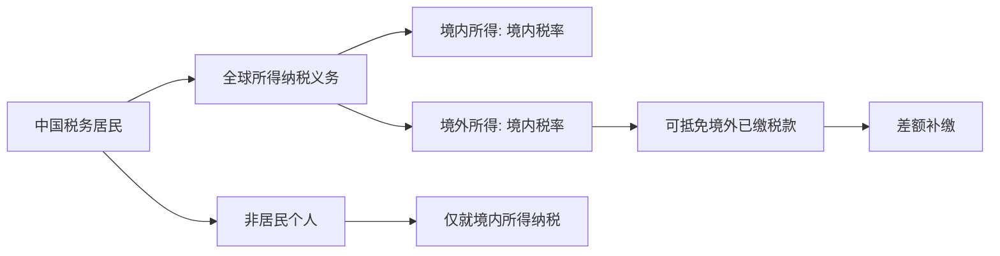
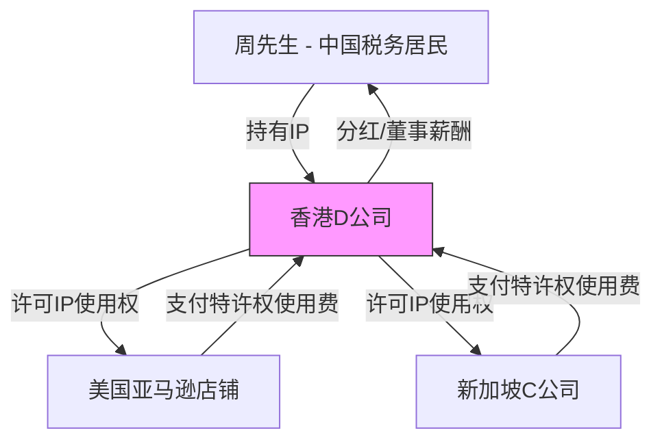

## 案例五：跨境税务筹划

### 案例背景

周先生，38岁，中国税务居民，持有中国护照，家庭定居深圳。2024年起从事跨境电商和技术咨询服务，同时持有美国公司的股权分红收入。周先生的妻子为全职太太，有一个8岁的孩子在读小学。

**收入来源全景：**

| 收入来源 | 年收入（人民币） | 收入性质 | 来源地 |
|----------|-----------------|----------|--------|
| 深圳本地技术咨询公司（A公司）工资 | 480,000元 | 综合所得-工资薪金 | 中国境内 |
| 美国B公司股权分红 | 150,000元（约$21,000） | 股息红利所得 | 美国 |
| 亚马逊跨境电商利润（美国站） | 600,000元 | 经营所得 | 美国 |
| 新加坡C公司技术顾问费 | 300,000元 | 劳务报酬所得 | 新加坡 |
| 香港D公司特许权使用费 | 120,000元 | 特许权使用费所得 | 中国香港 |
| **合计** | **1,650,000元** | - | - |

**跨境税务面临的核心问题：**

1. 中国税法对全球征税：作为中国税务居民，周先生的全球所得均需在中国缴纳个人所得税
2. 美国预扣税：B公司分红被美国预扣10%的税款（根据中美税收协定优惠税率）
3. 新加坡预扣税：C公司支付的顾问费在新加坡被预扣22%的税款
4. 香港预扣税：特许权使用费在香港被预扣4.95%（根据内地与香港税收安排优惠税率）
5. 如何避免同一笔收入被两个国家/地区重复征税

### 第一步：明确税务居民身份与纳税义务

跨境税务筹划的起点是确定纳税人的税务居民身份，因为这决定了纳税义务的范围。

**中国税务居民判定标准：**

根据《中华人民共和国个人所得税法》第一条：
- 在中国境内有住所的个人，为居民个人（无限纳税义务）
- 在中国境内无住所且在一个纳税年度内在中国境内累计居住满183天的个人，为居民个人

周先生在深圳有固定住所（自购房产），符合"有住所"的条件，属于中国税务居民个人。

**税务居民身份的核心影响：**



**居民个人的全球征税范围：**

| 所得类型 | 境内/境外判定 | 纳税义务 |
|----------|--------------|----------|
| 工资薪金 | 劳务发生地 | 全球所得汇总纳税 |
| 股息红利 | 被投资方所在地 | 全球所得汇总纳税 |
| 劳务报酬 | 劳务提供地 | 全球所得汇总纳税 |
| 特许权使用费 | 特许权使用地/支付方所在地 | 全球所得汇总纳税 |
| 经营所得 | 经营活动发生地 | 全球所得汇总纳税 |

### 第二步：计算境外所得在中国的应纳税额

**中国个人所得税综合所得税率表（2024年）：**

| 级数 | 全年应纳税所得额 | 税率 | 速算扣除数 |
|------|-----------------|------|-----------|
| 1 | 不超过36,000元 | 3% | 0 |
| 2 | 36,000-144,000元 | 10% | 2,520 |
| 3 | 144,000-300,000元 | 20% | 16,920 |
| 4 | 300,000-420,000元 | 25% | 31,920 |
| 5 | 420,000-660,000元 | 30% | 52,920 |
| 6 | 660,000-960,000元 | 35% | 85,920 |
| 7 | 超过960,000元 | 45% | 181,920 |

**第一步：汇总计算全年应纳税所得额**

```text
境内综合所得 = 工资480,000 + 劳务报酬300,000 × (1-20%) + 特许权使用费120,000 × (1-20%)
             = 480,000 + 240,000 + 96,000
             = 816,000元

专项扣除（五险一金按深圳标准估算）= 约84,000元/年
基本减除费用 = 60,000元/年
专项附加扣除（子女教育2,000 × 12 + 赡养老人3,000 × 12）= 60,000元/年

境外所得（股息红利150,000 + 经营所得600,000）= 750,000元

全年应纳税所得额 = 816,000 - 84,000 - 60,000 - 60,000 + 750,000
               = 1,362,000元
```

**第二步：计算全年应纳税额**

```text
应纳税额 = 1,362,000 × 45% - 181,920 = 613,080 - 181,920 = 431,160元
```

**第三步：计算境外所得对应的税额（用于确定可抵免限额）**

```text
境外所得占全部所得比例 = 750,000 / (816,000 + 750,000) = 47.9%

境外所得抵免限额 = 431,160 × 47.9% = 206,526元
```

### 第三步：计算各国/地区已缴税款与抵免

**各国/地区已缴税款明细：**

| 国家/地区 | 所得项目 | 所得金额 | 预扣税率 | 已缴税款 |
|-----------|----------|----------|----------|----------|
| 美国 | 股息红利 | 150,000元 | 10%（协定优惠） | 15,000元 |
| 美国 | 电商经营利润 | 600,000元 | 0%（自行申报） | 0元 |
| 新加坡 | 劳务报酬 | 300,000元 | 22% | 66,000元 |
| 中国香港 | 特许权使用费 | 120,000元 | 4.95%（安排优惠） | 5,940元 |
| **合计** | - | - | - | **86,940元** |

> **重要说明**：美国跨境电商利润在中国被归类为"经营所得"，如果周先生以个人名义在美国开展业务，需要在美国联邦和州层面缴纳所得税。但如果通过合理的架构设计（如通过中国公司出口），可以改变所得性质。详见后续优化方案。

**美国电商经营利润的税务处理详解：**

周先生的亚马逊电商利润600,000元需要进一步分析：

- 如果周先生在美国没有"常设机构"（Permanent Establishment），根据中美税收协定，中国保留征税权
- 如果周先生在美国有仓库或雇员构成常设机构，美国也有权征税
- 亚马逊FBA仓库不自动构成常设机构（根据协定具体条款）
- 假设周先生通过中国公司运营，不构成美国常设机构，因此美国不征税

**实际可抵免税款：**

```text
境外已缴税款合计 = 15,000（美国股息）+ 0（美国电商）+ 66,000（新加坡）+ 5,940（香港）
               = 86,940元

境外所得抵免限额 = 206,526元

实际可抵免税额 = min(86,940, 206,526) = 86,940元（已缴税款未超限额，全额抵免）
```

**最终应补缴税款：**

```text
全年应纳税额 = 431,160元
减：境内已预扣税款（工资薪金等）≈ 180,000元（估算）
减：境外已缴税款抵免 = 86,940元

年度汇算应补缴 = 431,160 - 180,000 - 86,940 = 164,220元
```

### 第四步：跨境税务筹划方案

基于以上分析，制定以下优化方案：

#### 方案一：利用税收协定优惠降低预扣税

**现状问题：** 如果不申请协定优惠，各国会按国内法定税率扣税。

| 国家/地区 | 法定预扣税率 | 协定优惠税率 | 所得类型 |
|-----------|------------|------------|----------|
| 美国 | 30% | 10% | 股息 |
| 美国 | 30% | 10% | 特许权使用费 |
| 新加坡 | 22%（非居民） | 10% | 特许权使用费 |
| 新加坡 | 22%（非居民） | 无协定优惠 | 独立个人劳务 |
| 中国香港 | 16.5% | 4.95% | 特许权使用费 |
| 中国香港 | 16.5% | 0%（满足条件） | 股息 |

**具体操作步骤：**

1. **美国方面**：向B公司提供中国税务居民身份证明（Certificate of Tax Residency），填写W-8BEN表格，申请10%的协定优惠预扣税率。需要在每年1月提交，否则默认按30%扣税。

2. **新加坡方面**：向新加坡税务局（IRAS）提交税务居民证明，申请适用于技术服务费的协定税率。注意区分"独立个人劳务"和"特许权使用费"——技术顾问费可能被认定为独立个人劳务（第十四条），无法享受协定优惠。

3. **香港方面**：向香港税务局提交内地税务居民身份证明，申请特许权使用费4.95%的优惠税率。

#### 方案二：合理划分所得性质

**核心策略**：将新加坡的"劳务报酬"重新设计为"特许权使用费"

**操作方法：**

如果周先生向C公司提供的不仅是人工服务，还包含技术诀窍（Know-how）、专利使用权或软件许可，可以将合同拆分为两部分：

| 合同类型 | 所得性质 | 新加坡预扣税率 | 协定优惠税率 |
|----------|----------|--------------|------------|
| 技术服务合同（人工） | 独立个人劳务 | 22% | 无优惠 |
| 技术许可合同（IP） | 特许权使用费 | 22% | 10% |

**节税计算：**

```text
假设300,000元中，180,000为技术服务，120,000为技术许可：

原方案：300,000 × 22% = 66,000元（新加坡预扣税）
优化后：180,000 × 22% + 120,000 × 10% = 39,600 + 12,000 = 51,600元

节税：66,000 - 51,600 = 14,400元
```

> **风险提示**：所得性质的重新划分必须有真实业务实质支撑，不能仅为避税目的进行虚假合同拆分。税务局会审查合同内容、实际服务内容和支付安排是否一致。

#### 方案三：通过香港公司优化特许权使用费结构

**架构设计：**



**操作说明：**

1. 在香港注册D公司（已有），周先生作为唯一股东和董事
2. 将相关的技术诀窍、品牌、软件等IP归属到香港公司
3. 境外客户（C公司、亚马逊店铺）向香港公司支付特许权使用费
4. 香港公司向周先生支付董事薪酬或分红

**节税效果分析：**

| 环节 | 原方案 | 优化方案 | 差异 |
|------|--------|----------|------|
| 新加坡→个人 | 300,000 × 22% = 66,000 | 300,000 × 10% = 30,000（支付给香港公司） | -36,000 |
| 香港公司利得税 | 无 | (300,000-120,000成本) × 8.25% = 14,850 | +14,850 |
| 香港→个人分红 | 无 | 免税（香港无股息税） | 0 |
| 香港特许权使用费预扣税 | 120,000 × 4.95% = 5,940 | 0（香港不征收出境预扣税） | -5,940 |
| **合计** | **71,940** | **44,850** | **-27,090** |

> **重要提醒**：香港公司必须有真实商业实质（办公场所、员工、银行账户），否则可能被中国税务局依据"受控外国企业"（CFC）规则进行纳税调整。同时，中国对向境外关联方支付特许权使用费有转让定价要求，需要准备同期资料。

#### 方案四：跨境电商架构优化

**问题**：个人名义运营亚马逊店铺，利润直接归个人，600,000元利润并入综合所得适用最高45%税率。

**优化方案：设立中国境内个人独资企业/个体工商户**

```text
方案A：在税收洼地设立个体工商户

在深圳前海或海南自贸港设立电商个体工商户：
- 适用核定征收或查账征收
- 经营所得适用5%-35%累进税率
- 部分地区对电商个体户有税收优惠

方案B：设立中国公司出口

设立深圳XX贸易有限公司：
- 企业所得税25%（小微企业实际税率5%）
- 利润分配给个人时需缴20%股息税
- 综合税负：约23.75%（非小微）或约24%（小微）
```

**方案A详细计算（个体工商户核定征收）：**

假设在深圳某园区设立电商个体户，核定应税所得率10%：

```text
年销售收入 = 600,000元
核定应税所得 = 600,000 × 10% = 60,000元
应纳税额 = 60,000 × 10% - 1,500 = 4,500元

对比原方案：600,000元并入综合所得，边际税率30%
原方案税负 = 600,000 × 30% - 52,920（速算扣除）= 127,080元

节税：127,080 - 4,500 = 122,580元
```

> **风险提示**：2024年起，国家税务总局对核定征收政策收紧，多地已取消电商个体户的核定征收资格。建议采用查账征收，并做好成本票管理。

#### 方案五：利用海南自贸港优惠政策

**政策依据**：《海南自由贸易港高端紧缺人才个人所得税政策》

对在海南自贸港工作的高端紧缺人才，个人所得税实际税负超过15%的部分予以免征。

**适用条件：**
- 在海南自贸港实质性工作
- 年收入超过30万元（海南紧缺人才目录）
- 符合海南自贸港高端紧缺人才认定标准

**如果周先生将部分业务转移到海南：**

```text
假设将技术咨询业务（年收入480,000元）转移到海南设立的公司：

原方案：480,000元工资适用25%税率段
优化后：15%封顶

应纳税所得额 = 480,000 - 60,000 - 84,000 - 60,000 = 276,000元
原方案税额 = 276,000 × 20% - 16,920 = 38,280元
海南方案税额 = 276,000 × 15% = 41,400元（实际税负15%，多缴部分返还）

实际差异：需要具体计算超过15%部分的返还金额
```

### 第五步：综合优化效果汇总

| 项目 | 优化前税负 | 优化后税负 | 节税金额 |
|------|-----------|-----------|----------|
| 境内工资个税 | 约82,000元 | 约72,000元（专项扣除充分利用） | 10,000元 |
| 美国股息预扣税 | 15,000元 | 15,000元（已是协定优惠税率） | 0元 |
| 新加坡预扣税 | 66,000元 | 30,000元（通过香港公司） | 36,000元 |
| 香港特许权使用费预扣税 | 5,940元 | 0元 | 5,940元 |
| 跨境电商利润 | 127,080元 | 4,500元（个体户核定） | 122,580元 |
| 香港公司利得税 | 0元 | 14,850元 | -14,850元 |
| **合计** | **296,020元** | **136,350元** | **159,670元** |

**年节税约16万元，综合税负从17.9%降至8.3%。**

### 第六步：合规要点与风险防控

#### 必须履行的申报义务

1. **境外所得申报**：每年3月1日至6月30日，在个人所得税年度汇算中申报境外所得
2. **境外税收抵免**：需要提供境外完税凭证原件或经公证的复印件
3. **外汇登记**：跨境收入需要通过正规银行渠道结汇，保留银行流水
4. **转让定价文档**：如果与关联方（如香港公司）有交易，需要准备同期资料

#### 常见风险与应对

| 风险类型 | 具体风险 | 应对措施 |
|----------|---------|----------|
| 税务居民身份争议 | 中国和外国同时认定为税务居民 | 保留出入境记录，善用"加权规则"判定 |
| 所得性质被调整 | 税务局将特许权使用费重新认定为劳务报酬 | 确保合同内容与实质一致 |
| 受控外国企业（CFC） | 香港公司无实质经营被视为壳公司 | 在香港设立真实办公场所和员工 |
| 转让定价调整 | 关联交易价格不公允 | 准备独立交易原则证明文档 |
| 核定征收被追缴 | 个体户核定征收资格被取消 | 保留完整的成本票和账簿 |
| CRS信息交换 | 境外金融账户信息自动交换给中国税务局 | 如实申报境外所得，不要心存侥幸 |

#### CRS（共同申报准则）对中国税务居民的影响

自2018年起，中国已与100多个国家和地区自动交换税务居民的金融账户信息。这意味着：

- 周先生在美国、新加坡、香港的银行账户信息会被自动报送给中国税务局
- 包括账户余额、利息收入、股息收入等
- 试图通过隐瞒境外收入来避税已不可行
- **唯一正确的做法是如实申报，然后利用合法的税收协定和政策工具降低税负**

### 第七步：年度操作清单

| 时间节点 | 操作事项 | 负责方 |
|----------|---------|--------|
| 1月 | 向美国B公司提交W-8BEN表格和税务居民证明 | 周先生 |
| 1月 | 向新加坡IRAS提交税务居民证明 | 周先生/税务代理 |
| 3-6月 | 年度汇算清缴，申报境外所得并申请税收抵免 | 税务代理 |
| 5月 | 准备转让定价同期资料（如适用） | 税务代理 |
| 每月 | 记录境外收入、已缴税款、汇率 | 周先生/会计 |
| 每季度 | 香港公司审计和报税 | 香港会计师 |
| 年底 | 评估下一年度税务筹划方案调整 | 税务顾问 |

### 关键经验总结

1. **先确定身份再谈方案**：税务居民身份是跨境税务筹划的基础，身份判断错误会导致整个方案失效
2. **善用税收协定网络**：中国已签订110多个双边税收协定，预扣税率优惠是最直接的节税手段
3. **架构设计要实质重于形式**：空壳公司、虚假合同等手段在CRS时代已无生存空间，必须有真实商业实质
4. **分清"避税"与"逃税"的边界**：利用税收协定优惠、合理划分所得性质属于合法避税；隐瞒收入、虚构交易属于逃税
5. **专业的事交给专业的人**：跨境税务涉及多国税法和国际条约，建议聘请有跨境业务经验的税务师或会计师事务所

> **免责声明**：本案例中的税率、政策和计算方法基于2024年有效的法规。跨境税收政策变化频繁，实际操作前请咨询专业税务顾问，并以各国/地区最新法规为准。本案例中的数据为模拟数据，仅供参考学习使用。
