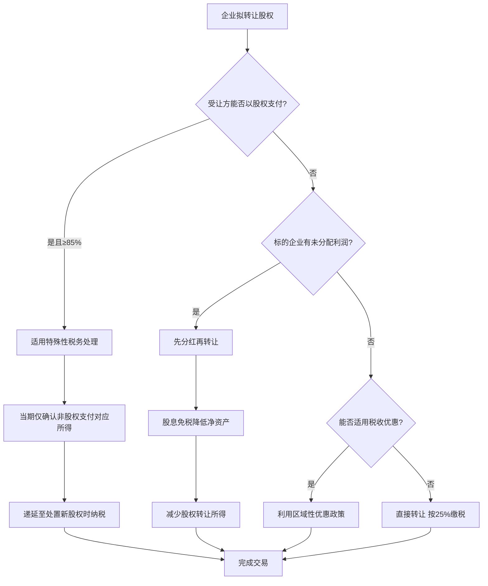

## 案例六：股权转让税务筹划

股权转让是个人和企业投资活动中最常见的资本运作方式之一。一次股权转让涉及的税种多、金额大、政策复杂，如果不做税务筹划，可能多缴数十万甚至上百万元税款。本案例以三个典型场景为主线，系统讲解股权转让的税务筹划方法。

---

### 一、股权转让基础知识

#### 1.1 什么是股权转让

股权转让是指公司股东依法将自己的股东权益有偿转让给他人，使他人取得股权的民事法律行为。转让标的是股东权益，而非公司资产本身——这是很多初学者容易混淆的关键概念。

**股权转让的主要类型：**

| 类型 | 说明 | 典型场景 |
|------|------|----------|
| 有限公司股权转让 | 有限责任公司股东之间或向外部人转让股权 | 创始人退出、引入投资人 |
| 股份有限公司股权转让 | 通过证券市场或协议转让股份 | 上市公司减持、定向转让 |
| 合伙企业份额转让 | 合伙人转让其在合伙企业中的份额 | PE/VC基金退出、份额转让 |
| 个人独资企业转让 | 转让个人独资企业的全部或部分权益 | 个体经营者转让业务 |

#### 1.2 股权转让涉及的税种

股权转让涉及的税种因转让主体（个人或企业）和标的企业类型不同而有所差异：

| 税种 | 个人转让方 | 企业转让方 | 税率 |
|------|-----------|-----------|------|
| 个人所得税 | ✅ | ❌ | 20%（财产转让所得） |
| 企业所得税 | ❌ | ✅ | 25%（一般税率） |
| 印花税 | ✅ | ✅ | 0.05%（产权转移书据） |
| 增值税 | 限上市公司股票 | 限上市公司股票 | 6%/3% |
| 土地增值税 | ❌ | 特殊情况 | 30%-60% |

**关键提醒：** 个人转让非上市公司股权不缴纳增值税；转让上市公司股票（限售股除外）免征个人所得税，但需缴纳增值税。这个区别非常关键。

#### 1.3 股权转让收入的确认

根据《国家税务总局关于发布〈股权转让所得个人所得税管理办法（试行）〉的公告》（国家税务总局公告2014年第67号），股权转让收入的确认遵循以下原则：

**应当确认为股权转让收入的情形：**

1. 现金、银行存款、应收账款、应收票据等货币形式的收入
2. 非货币形式的收入，包括固定资产、生物资产、无形资产、股权投资、存货、不准备持有至到期的债券投资、劳务以及有关权益等
3. 违约金、补偿金以及其他名目的款项、资产、权益等
4. 合同约定的收入分期收取的，以合同约定的收款日期确认收入

**视为股权转让收入明显偏低的情形（无正当理由）：**

1. 申报的股权转让收入低于股权对应的净资产份额
2. 申报的股权转让收入低于初始投资成本或取得该股权所支付的价款及相关税费
3. 申报的股权转让收入低于相同或类似条件下同一企业同一股东或其他股东股权转让收入
4. 申报的股权转让收入低于相同或类似条件下同类行业的企业股权转让收入
5. 不具合理性的无偿让渡股权或股份

---

### 二、股权转让的计税基础

#### 2.1 个人转让股权的计税公式

```text
应纳税所得额 = 股权转让收入 - 股权原值 - 合理费用
应纳税额 = 应纳税所得额 × 20%
```

**股权原值的确认方法：**

| 取得方式 | 原值确认 |
|----------|----------|
| 现金出资 | 实际出资额 + 相关税费 |
| 非货币资产出资 | 入股时非货币资产的评估价格 + 相关税费 |
| 继承或赠与（配偶、父母等） | 发生股权原值的原持有人的股权原值 |
| 继承或赠与（其他） | 受赠发生的税费 + 合理费用 |
| 资本公积/盈余公积转增 | 转增额和相关税费之和 |
| 以低于净资产价格取得 | 净资产份额（除特定情形外） |

**合理费用包括：** 股权转让时按照规定支付的有关税费（如印花税、中介费、评估费等），但不包括个人所得税本身。

#### 2.2 企业转让股权的税务处理

企业转让股权时，转让所得并入应纳税所得额缴纳企业所得税。对于居民企业之间的直接股权投资，符合条件的股息红利免税（即"居民企业之间免税"政策），但股权转让所得仍需缴税。

**投资成本的确认：**

- **货币出资：** 以实际支付的价款为投资成本
- **非货币资产出资：** 以该资产的公允价值为投资成本
- **通过支付现金以外方式取得的资产：** 以该资产的公允价值和支付的相关税费为成本

---

### 三、案例一：个人转让有限公司股权（创始人退出）

#### 3.1 案例背景

张三2018年以100万元现金出资设立A科技有限公司（有限责任公司），持股60%。2024年，张三计划将全部股权转让给战略投资人李四。转让时A公司的财务状况如下：

| 项目 | 金额 |
|------|------|
| 注册资本 | 200万元 |
| 未分配利润 | 500万元 |
| 盈余公积 | 80万元 |
| 资本公积（溢价入股） | 120万元 |
| 净资产合计 | 900万元 |

张三持股60%，对应净资产为540万元。双方协商转让价格为600万元。转让过程中发生中介费5万元、印花税0.03万元。

#### 3.2 未做筹划的税负

```text
股权转让收入 = 600万元
股权原值 = 100万元（实际出资额）
合理费用 = 5万元（中介费）+ 0.03万元（印花税）= 5.03万元

应纳税所得额 = 600 - 100 - 5.03 = 494.97万元
应纳个人所得税 = 494.97 × 20% = 98.99万元

总税负 = 98.99 + 0.03 = 99.02万元
```

**税负率约为 16.5%，绝对金额近100万元。**

#### 3.3 筹划方案对比

**方案一：先分红再转让**

A公司将未分配利润500万元先分配，张三按60%持股比例获得300万元分红。分红后净资产降至600万元（900-300），张三持股对应360万元，协商转让价格调整为360万元。

```text
分红个税 = 300 × 20% = 60万元
转让应纳税所得额 = 360 - 100 - 印花税等
印花税 = 360 × 0.05% = 0.18万元
转让个税 = (360 - 100 - 0.18) × 20% = 51.96万元
总税负 = 60 + 51.96 + 0.18 = 112.14万元
```

⚠️ **此方案反而多缴税！** 因为分红和转让的个人所得税税率相同（都是20%），先分红并没有降低税基，反而多交了分红对应的印花税。这个方案看起来"聪明"，实际上是一个经典误区。

**方案二：利用正当理由争取合理低价**

如果张三能提供正当理由（如A公司存在未披露的或有负债、核心技术团队不稳定等），经税务机关认可，可以按照净资产法确认转让收入：

```text
转让收入 = 净资产对应份额 = 540万元
应纳税所得额 = 540 - 100 - (540 × 0.05% + 5) = 434.73万元
应纳个人所得税 = 434.73 × 20% = 86.95万元
总税负 = 86.95 + 0.27 + 5 ≈ 92.22万元
```

比原方案节省约6.8万元，但空间有限。

**方案三：分步转让 + 利用税收优惠地区政策（综合最优）**

部分地区对股权转让所得有财政返还政策（如某些经济开发区、高新区），实际税负可降至12%-14%。操作步骤：

1. 在有财政返还政策的地区设立持股平台（有限合伙企业）
2. 将目标公司股权先转至持股平台
3. 通过持股平台完成最终转让
4. 享受当地财政返还

⚠️ **注意：** 2021年以来，多地已收紧股权转让的税收返还政策。选择方案时务必确认当地政策的有效性和合规性，避免"空壳转移"被税务机关穿透认定。

**方案四：技术入股递延纳税**

如果张三当初以技术成果出资而非现金，根据《财政部 国家税务总局关于个人非货币性资产投资有关个人所得税政策的通知》（财税〔2015〕41号），个人以非货币性资产投资，应确认的非货币性资产转让所得可在不超过5个公历年度内分期缴纳个人所得税。

这意味着如果当初以技术入股，可以将纳税义务递延到后续转让时一并处理，获得资金时间价值。

#### 3.4 方案对比总结

| 方案 | 总税负 | 税负率 | 适用条件 | 风险 |
|------|--------|--------|----------|------|
| 直接转让 | 99.02万 | 16.5% | 无特殊条件 | 无 |
| 先分红再转让 | 112.14万 | 18.7% | 不推荐 | 反增税负 |
| 净资产法定价 | 92.22万 | 15.4% | 有正当理由 | 需税务认可 |
| 税收优惠地区 | 约79万 | 13.2% | 设立持股平台 | 政策变动风险 |
| 技术入股递延 | 递延至转让时 | - | 非货币出资 | 仅限新设时 |

---

### 四、案例二：企业转让股权（集团公司重组）

#### 4.1 案例背景

B集团（母公司）持有C公司80%股权，初始投资成本800万元。C公司目前净资产3000万元，B集团对应份额2400万元。现D公司欲以3200万元收购B集团持有的C公司80%股权。

B集团适用企业所得税税率25%。

#### 4.2 未做筹划的税负

```text
股权转让所得 = 3200 - 800 = 2400万元
企业所得税 = 2400 × 25% = 600万元
印花税 = 3200 × 0.05% = 1.6万元
增值税 = 0（非上市公司股权转让不缴增值税）

总税负 = 600 + 1.6 = 601.6万元
```

**税负率高达18.8%。**

#### 4.3 筹划方案

**方案一：特殊性税务处理（企业重组）**

根据《财政部 国家税务总局关于企业重组业务企业所得税处理若干问题的通知》（财税〔2009〕59号），符合条件的企业重组可以适用特殊性税务处理，即暂不确认股权转让所得，递延纳税。

**适用条件（必须同时满足）：**

1. 具有合理的商业目的，且不以减少、免除或者推迟缴纳税款为主要目的
2. 被收购的股权不低于被收购企业全部股权的50%
3. 企业重组后的连续12个月内不改变重组资产原来的实质性经营活动
4. 企业重组中取得股权支付的原主要股东，在重组后连续12个月内不得转让所取得的股权
5. 股权支付金额不低于交易支付总额的85%

**在本案例中：** 如果D公司以自身股权（而非现金）支付对价，且股权支付比例≥85%，则可以适用特殊性税务处理，B集团暂不确认股权转让所得，递延至未来处置D公司股权时再纳税。

```text
假设D公司以2720万元自身股权 + 480万元现金支付：
股权支付比例 = 2720/3200 = 85%，满足条件

非股权支付对应的资产转让所得 = (3200-800) × (480/3200) = 360万元
当期应纳企业所得税 = 360 × 25% = 90万元
递延部分 = (2400-360) × 25% = 510万元（未来处置D公司股权时缴纳）

当期税负 = 90 + 1.6 = 91.6万元
```

**节税效果：当期少缴企业所得税510万元，递延至未来缴纳。** 虽然总税额不变，但获得了巨大的资金时间价值。

**方案二：股权划转（100%直接控制的母子公司之间）**

如果B集团下还有一个100%控股的子公司E，可以先将C公司股权划转至E公司，再由E公司转让给D公司。根据财税〔2014〕109号文，100%直接控制的母子公司之间按账面净值划转股权，可以选择特殊性税务处理，不确认所得。

但这增加了架构复杂度，且最终转让时仍需缴税。适用于需要通过E公司实现其他商业目的的场景。

**方案三：先分配利润再转让（企业场景有效）**

与个人转让不同，企业转让前先分配利润在税务上是有意义的。因为符合条件的居民企业之间的股息红利免税（《企业所得税法》第二十六条），而股权转让所得需要全额缴税。

```text
假设C公司有未分配利润1000万元：
B集团先获得分红 = 1000 × 80% = 800万元（免税）
分红后C公司净资产降至2000万元
转让价格相应调整（假设仍为溢价交易）为2400万元
股权转让所得 = 2400 - 800 = 1600万元
企业所得税 = 1600 × 25% = 400万元

比原方案少缴 600 - 400 = 200万元！
```

**这个方案在企业场景下非常有效**，因为股息免税而转让所得征税，通过先分红降低了股权的公允价值，从而减少转让所得。这与个人场景（分红和转让都是20%）形成了本质区别。

#### 4.4 企业股权转让筹划决策流程



---

### 五、案例三：合伙企业份额转让与税收洼地

#### 5.1 案例背景

王五是X有限合伙企业（持股平台）的有限合伙人，持有X企业40%的份额。X企业持有上市公司Y的股票（原始股），初始投资成本500万元，当前市值5000万元。王五拟转让其在X企业中的份额给赵六。

#### 5.2 合伙企业的"税收穿透"原则

合伙企业本身不是所得税纳税主体，采用"先分后税"原则——合伙企业的所得按合伙协议约定的比例分配给各合伙人，由合伙人分别缴纳所得税。

**关键政策依据：**

根据《财政部 国家税务总局关于合伙企业合伙人所得税问题的通知》（财税〔2008〕159号），合伙企业以每一个合伙人为纳税义务人，合伙人是自然人的缴纳个人所得税，合伙人是法人和其他组织的缴纳企业所得税。

**合伙企业份额转让的税务处理：**

目前对于自然人合伙人转让合伙企业份额的个人所得税处理，各地执行口径不一：

- **部分地区按"财产转让所得"20%征税**（如某些地方税务机关认为份额转让属于财产转让）
- **部分地区按"经营所得"5%-35%征税**（认为合伙企业的权益转让属于经营性质）

这个口径差异直接影响税负，需根据当地税务机关的实际执行口径进行规划。

#### 5.3 税负测算

**口径一：按财产转让所得20%**

```text
转让收入 = 5000 × 40% = 2000万元
份额原值 = 500 × 40% = 200万元
应纳税所得额 = 2000 - 200 = 1800万元
个人所得税 = 1800 × 20% = 360万元
```

**口径二：按经营所得5%-35%**

```text
应纳税所得额 = 1800万元
适用税率 = 35%（超过50万元部分）
速算扣除数 = 6.55万元
个人所得税 = 1800 × 35% - 6.55 = 623.45万元
```

两种口径税负相差263万元，差异巨大。

#### 5.4 筹划策略

**策略一：利用核定征收（适用小规模合伙企业）**

部分地区对合伙企业的经营所得采用核定应税所得率征收。如果应税所得率核定为10%，则：

```text
应纳税所得额 = 收入 × 10% = 转让收入 × 核定利润率
```

⚠️ **重要警示：** 2021年以来，财政部和税务总局明确要求规范合伙企业税收管理，对权益性投资的合伙人不得核定征收。《关于权益性投资经营所得个人所得税征收管理的公告》（财政部 税务总局公告2021年第41号）规定，持有股权、股票、合伙企业财产份额等权益性投资的个人独资企业、合伙企业，一律适用查账征收方式。核定征收路径已经基本堵死。

**策略二：在税收优惠地区设立合伙企业**

在有税收返还政策的地区（如某些经济开发区）设立合伙企业，享受地方财政留存部分的返还。虽然名义税率不变，但实际税负可以降低30%-40%。

⚠️ 返还比例和政策稳定性是关键考量。2023年以来各地陆续清理不规范的税收返还政策。

**策略三：通过上市公司股票直接减持**

如果X企业（合伙企业）将持有的Y公司股票分配给各合伙人，再由王五直接在二级市场卖出股票：

- 个人转让上市公司股票免征个人所得税（财税字〔1998〕61号）
- 但需按金融商品转让缴纳增值税（限售股需特别处理）
- 非限售股的增值税税率为0（金融商品转让免征增值税的前提是持有超过12个月）

⚠️ 此方案涉及合伙企业"分配合伙财产"的环节，税务处理复杂，需要专业税务顾问指导。

**策略四：转让定价优化**

在合伙企业份额转让中，可以合理确定份额的公允价值。如果合伙企业持有的是未上市公司的股权，公允价值评估有较大的灵活性。通过合理的资产评估方法（如收益法、市场法、资产基础法），可以在合法范围内确定一个相对较低的转让价格。

---

### 六、股权转让税务筹划的核心原则

#### 6.1 合法性原则

税务筹划的前提是合法。以下行为不属于税务筹划，而是偷逃税：

| 行为 | 性质 | 后果 |
|------|------|------|
| 签订阴阳合同（低价报税、高价实际交易） | 偷税 | 补税+滞纳金+0.5-5倍罚款 |
| 虚构债务冲减股权价值 | 逃税 | 同上，严重者追究刑事责任 |
| 通过虚假评估压低转让价格 | 虚假申报 | 同上 |
| 利用已注销的壳公司转让 | 虚假交易 | 可被税务机关穿透认定 |

#### 6.2 常见筹划工具箱

| 工具 | 适用场景 | 节税原理 | 风险等级 |
|------|----------|----------|----------|
| 先分红再转让 | 企业转让方、标的企业有留存收益 | 股息免税降低转让所得 | 低 |
| 特殊性税务处理 | 企业重组、股权支付≥85% | 递延确认转让所得 | 低 |
| 非货币性资产出资 | 个人以技术等出资 | 分期递延纳税 | 中 |
| 持股平台架构 | 多股东、多轮投资 | 统一管理+税收优惠 | 中 |
| 合理确定转让价格 | 有正当理由的低价转让 | 降低应税收入 | 中高 |
| 跨境架构设计 | 涉及境外投资人 | 利用税收协定降低预提税 | 高 |

#### 6.3 时间节点的税务筹划

股权转让的时机选择也会影响税负：

1. **年度中间转让 vs 年末转让：** 如果标的企业当年亏损较大，年末转让可能使当年亏损无法弥补。在盈利较好的年度转让，可以平滑税负。
2. **上市前转让 vs 上市后转让：** 个人转让上市公司股票免征个税，但限售股有特殊规定。如果能合理安排解禁期，可以利用免税政策。
3. **分批转让 vs 一次性转让：** 大额股权可以分多个纳税年度转让，降低单年应纳税所得额（主要影响企业所得税的弥补亏损和税率优惠等）。

---

### 七、股权转让的申报与合规要求

#### 7.1 个人转让股权的申报流程

1. **签订股权转让协议：** 明确转让价格、支付方式、交割时间
2. **办理工商变更登记：** 向市场监督管理部门提交变更申请
3. **纳税申报：** 在签订股权转让协议后次月15日内，向被投资企业所在地主管税务机关申报
4. **提交资料：** 股权转让协议、身份证明、股权原值凭证、资产评估报告（如需）

#### 7.2 扣缴义务

根据67号公告，受让方（个人）或被投资企业有扣缴义务。如果受让方是个人，应在股权转让协议签订后5个工作日内报告被投资企业主管税务机关。

#### 7.3 被投资企业的报告义务

被投资企业应在董事会或股东会结束后5个工作日内，向主管税务机关报告以下事项：

- 股东变更情况
- 股权转让协议
- 转让价格及定价依据
- 资产评估报告（如适用）

#### 7.4 税务机关的核定权

如果申报的股权转让收入明显偏低且无正当理由，税务机关有权采用以下方法核定：

1. **净资产核定法：** 按转让时被投资企业的净资产份额核定
2. **类比法：** 参照相同或类似条件下同一企业同一股东或其他股东的股权转让收入核定
3. **其他合理方法**

---

### 八、常见误区与风险警示

#### 误区一：低价转让一定不被认可

**纠正：** 如果有正当理由，低价转让是被允许的。67号公告列举了正当理由：能出具有效文件证明被投资企业因国家政策调整生产经营受到重大影响；相关法律、政府文件或企业章程规定的继承或转让给配偶、父母、子女等。

#### 误区二：股权转让不需要评估

**纠正：** 虽然法律没有强制要求所有股权转让都做评估，但以下情况必须评估：涉及国有资产转让；以非货币资产出资；税务机关认为需要评估的情形。建议所有大额股权转让都做评估，以备税务机关核查。

#### 误区三：注册资本=股权价值

**纠正：** 股权价值取决于企业净资产和未来盈利能力，注册资本仅是股东认缴的出资额，二者可以相差很大。以注册资本价格转让股权，如果明显低于净资产份额，可能被税务机关核定调整。

#### 误区四：转让亏损企业的股权不用交税

**纠正：** 即使标的企业亏损，只要转让价格高于股权原值和合理费用之和，仍然需要缴纳个人所得税。亏损企业股权转让的关键是原值确认——如果以低于原值的价格转让，确实不用缴税，但需要有合理的定价依据。

#### 误区五：口头约定价格就够了

**纠正：** 股权转让必须签订书面协议，明确转让价格、支付方式、交割条件等关键条款。口头约定在税务稽查时无法作为定价依据，可能导致税务机关按核定方法确定收入。

---

### 九、进阶话题：特殊场景的税务处理

#### 9.1 股权激励退出的税务处理

员工通过股权激励获得的股权在退出（转让）时，可能涉及两道税：

1. **行权时：** 工资薪金所得，适用3%-45%的累进税率
2. **转让时：** 财产转让所得，20%税率

筹划要点：选择合适的行权时点（在低收入年度行权），利用递延纳税政策（上市公司股权激励可递延12个月）。

#### 9.2 对赌协议中的税务处理

股权投资中常见的对赌协议（业绩补偿条款）在税务处理上一直是争议焦点。如果转让方因业绩未达标需要向受让方支付补偿款：

- **补偿款是否可以调减股权转让收入？** 目前税务实践中存在争议，部分税务机关不允许追溯调减
- **建议：** 在股权转让协议中明确约定税务处理方式，并提前与主管税务机关沟通

#### 9.3 代持股权的还原

股权代持还原（隐名股东显名化）的税务处理因地区而异。部分税务机关将代持还原视为股权转让征税，部分视为权属确认不征税。建议在代持协议中约定税务承担方式。

---

### 十、本案例核心要点总结

1. **股权转让涉及多税种，** 个人主要关注个人所得税（20%），企业关注企业所得税（25%），两者筹划方法不同
2. **企业转让前先分红是经典且有效的策略，** 因为股息免税、转让征税，这与个人场景本质不同
3. **特殊性税务处理适用于企业重组场景，** 可实现递延纳税，但需满足85%股权支付等严格条件
4. **合伙企业的税收穿透特性** 使得税务处理更加复杂，需关注当地执行口径
5. **核定征收通道已基本堵死，** 切勿依赖过去的"税收洼地"经验
6. **所有筹划方案都应以合法合规为前提，** 阴阳合同、虚假评估等行为面临严重的法律风险
7. **大额股权转让务必聘请专业税务顾问，** 税务筹划的收益远大于顾问费用

> **法律依据汇总：**
> - 《个人所得税法》第二条、第六条
> - 《企业所得税法》第二十六条（居民企业之间免税）
> - 财税〔2009〕59号（企业重组特殊性税务处理）
> - 财税〔2014〕109号（股权划转）
> - 财税〔2015〕41号（非货币性资产投资分期纳税）
> - 国家税务总局公告2014年第67号（股权转让所得个人所得税管理办法）
> - 财税〔2008〕159号（合伙企业合伙人所得税）
> - 财政部 税务总局公告2021年第41号（权益性投资不得核定征收）
