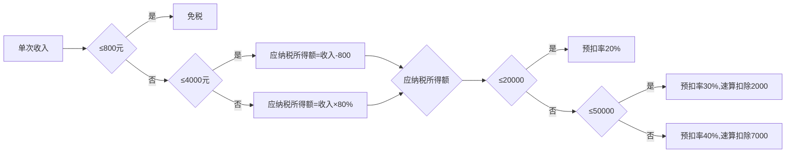
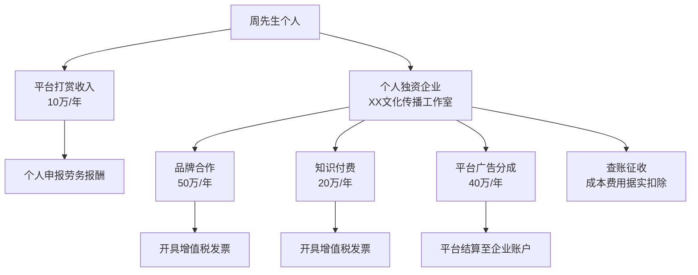
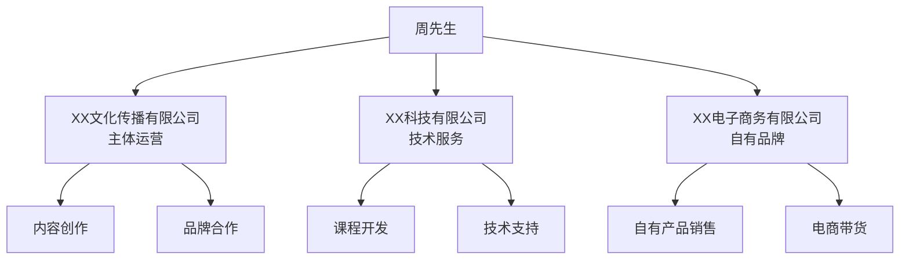

## 案例七：自媒体博主的税务转型

### 案例背景与行业画像

自媒体行业经过十余年发展，已从早期的"玩票"性质演变为年产值数千亿的成熟产业。根据《2025年中国自媒体行业发展报告》，全职自媒体从业者超过500万人，年收入超过50万的博主约有80万人。这个群体面临的税务问题极具代表性：收入来源分散、平台代扣标准不一、收入波动大、合规意识薄弱。

**本案例主角**：周先生，28岁，全职自媒体博主，主要平台为抖音和B站，合计粉丝200万。内容方向为科技数码评测，已运营3年，年收入稳定在120万元左右。

**收入构成明细**：

| 收入来源 | 年收入 | 支付方式 | 平台代扣情况 |
|----------|--------|----------|--------------|
| 平台广告分成（创作者激励） | 40万元 | 平台按月打款 | 平台按劳务报酬预扣20% |
| 品牌合作推广（软广/商单） | 50万元 | 品牌方直接转账 | 品牌方按劳务报酬预扣 |
| 知识付费课程（录播+直播） | 20万元 | 平台结算 | 平台按劳务报酬预扣 |
| 粉丝打赏和直播礼物 | 10万元 | 平台结算 | 平台代扣情况不一 |
| **合计** | **120万元** | - | - |

**周先生当前的困境**：

1. 每年预扣税款约28-32万元，但年度汇算后应纳税约21万元，退税流程漫长
2. 各平台代扣标准不统一，有的按20%预扣，有的按40%预扣（单次收入超过5万）
3. 为了拍摄、剪辑、设备维护等支出约25万元/年，但无法在劳务报酬中扣除
4. 收入全部通过个人账户，没有建立任何企业架构
5. 对核定征收、个体工商户等概念一知半解，担心"被查"

### 第一阶段：税务诊断——先搞清楚钱是怎么被收走的

在设计优化方案之前，必须先彻底理解现有税负结构。很多博主只看最终扣了多少钱，却不知道税是怎么算出来的。

#### 1.1 劳务报酬的预扣预缴机制

根据《个人所得税扣缴申报管理办法（试行）》（国家税务总局公告2018年第61号），劳务报酬所得的预扣预缴分为三档：



**周先生预扣预缴模拟**（简化计算，假设每月收入均匀）：

| 收入来源 | 月均收入 | 每次预扣税额 | 年预扣税额 |
|----------|----------|--------------|------------|
| 平台广告分成 | 3.33万 | 3.33万×80%×30%-2000=6000元 | 7.2万 |
| 品牌合作（假设月均2单，每单2.5万） | 4.17万 | 每单2.5万×80%×20%=4000元 | 9.6万 |
| 知识付费 | 1.67万 | 1.67万×80%×20%=2667元 | 3.2万 |
| 打赏收入 | 0.83万 | 0.83万×80%×20%=1333元 | 1.6万 |
| **合计** | - | - | **约21.6万** |

> **注意**：品牌合作如果单笔超过5万元，预扣率会跳到40%，实际预扣会更高。周先生如果某月接到一笔10万元的商单，该笔预扣税为10万×80%×40%-7000=2.5万元。

#### 1.2 年度汇算清缴的"多退少补"

劳务报酬在年度汇算时并入综合所得（工资薪金+劳务报酬+稿酬+特许权使用费），适用3%-45%的七级超额累进税率。

**周先生年度汇算计算**：

```text
年度收入总额 = 120万元
减除费用 = 120万 × 20% = 24万（劳务报酬的20%费用扣除）
专项扣除（五险一金）= 0（全职博主无雇主缴纳）
专项附加扣除 = 约2.4万（假设住房租金1500/月 + 赡养老人1000/月）
基本减除费用 = 6万

应纳税所得额 = 120万 - 24万 - 0 - 2.4万 - 6万 = 87.6万
```

查综合所得税率表：87.6万落在"超过66万至96万"档，税率35%，速算扣除8.592万。

```text
应纳税额 = 87.6万 × 35% - 8.592万 = 22.068万
```

已预扣约21.6万，汇算补税约0.47万。但实际预扣往往更高（单笔大额商单按40%预扣），汇算时会退税。

**实际税负率 = 22.068万 ÷ 120万 ≈ 18.4%**

这个税负率看起来不算太高，但关键问题在于：周先生有25万元的经营成本（设备、场地、差旅、外包剪辑等）完全无法在劳务报酬中扣除。如果这25万可以作为成本列支，应纳税所得额将大幅降低。

#### 1.3 被忽视的隐性税负

除了个人所得税，自媒体博主还面临以下隐性税负：

| 隐性税负项目 | 年成本估算 | 说明 |
|--------------|------------|------|
| 设备折旧（相机、灯光、电脑） | 5-8万 | 3年直线折旧 |
| 场地租金（工作室/直播间） | 6-12万 | 一线城市更高 |
| 外包费用（剪辑、设计、运营） | 8-15万 | 无法取得发票 |
| 差旅费用（探店、发布会） | 3-5万 | 交通+住宿+餐饮 |
| 软件订阅（剪辑、特效、音乐库） | 0.5-1万 | Adobe全家桶等 |

这些支出在劳务报酬模式下无法税前扣除，相当于"双重征税"——先用税后收入支付成本，再对全部收入征税。

### 第二阶段：方案设计——三条优化路径对比

针对周先生的情况，有三条可行的优化路径。每条路径的适用条件、节税效果和风险等级各不相同。

#### 路径一：注册个体工商户（核定征收）

**适用条件**：年收入500万以下，所在地有核定征收政策，经营所得应税所得率适用。

**方案要点**：

1. 在有核定征收政策的地区注册个体工商户，经营范围填写"文化创意服务、互联网信息服务"
2. 将品牌合作、知识付费收入通过个体工商户签订合同、开具发票
3. 适用"经营所得"核定征收，应税所得率通常为10%（文化创意服务）
4. 小规模纳税人增值税免征（月销售额10万以下免征，季度30万以下免征）

**税务计算**：

```text
个体工商户收入 = 品牌合作50万 + 知识付费20万 + 平台分成40万 = 110万
核定应税所得额 = 110万 × 10% = 11万
经营所得个税 = 11万 × 10% - 1500 = 9500元
增值税 = 0（小规模纳税人季度30万以下免征，需分季度确认）
附加税 = 0

打赏收入保持个人申报 = 10万
劳务报酬个税 = 10万 × 80% × 10% - 2520 = 5480元
（注：10万×80%=8万，落在"超过3.6万至14.4万"档，税率10%，速算扣除2520）

实际应区分：打赏是劳务报酬还是偶然所得？若按偶然所得20%，则为10万×20%=2万。
此处按劳务报酬计算。

总税负 = 9500 + 5480 = 14,980元
实际税负率 = 14,980 ÷ 120万 ≈ 1.25%
```

**节税效果**：22.068万 - 1.498万 = 20.57万元，节税率93.2%

**风险提示**：
- 2024年以来，多地收紧核定征收政策，特别是针对"空壳个体户"
- 需要有实际经营场所、业务流水、人员配置
- 税务局可能要求转为查账征收

#### 路径二：注册个人独资企业（查账征收）

**适用条件**：收入规模较大，有真实业务成本，可以取得合规发票。

**方案要点**：

1. 注册个人独资企业（文化传播工作室），查账征收
2. 全部业务收入通过企业账户收取
3. 合理列支成本费用：设备采购、场地租金、外包费用、差旅费等
4. 建立规范的财务账簿，聘请代理记账

**税务计算**：

```text
工作室收入 = 120万
可列支成本：
  - 设备折旧（6万/年）
  - 场地租金（9.6万/年，8000/月）
  - 外包费用（12万/年，需取得发票）
  - 差旅费用（4万/年）
  - 软件订阅（0.8万/年）
  - 代理记账（0.6万/年）
  - 其他经营费用（2万/年）
  合计成本 = 35万

应纳税所得额 = 120万 - 35万 - 6万（基本减除）= 79万
经营所得个税 = 79万 × 35% - 6.55万 = 21.1万
```

**节税效果**：22.068万 - 21.1万 = 0.968万元，节税率4.4%

**分析**：查账征收下，如果成本费用只有35万，节税效果有限。但如果能够充分列支成本（比如购置更多设备、扩大团队），节税空间会增大。

**关键差异**：查账征收的真正优势在于成本费用可以据实扣除，且随着业务规模扩大，扣除额也会增加。核定征收虽然当前税负更低，但无法扣除实际成本。

#### 路径三：混合架构（最优方案）

**适用条件**：收入来源复杂，既有平台分成又有商单，需要灵活应对不同场景。

**方案设计**：



**具体操作**：

1. **个人独资企业（XX文化传播工作室）**：承接品牌合作、知识付费、平台广告分成
2. **个人账户**：仅接收粉丝打赏和零星小额收入
3. **成本费用最大化扣除**：将所有经营相关支出都通过工作室列支

**税务计算**：

```text
工作室收入 = 110万
合理成本费用 = 42万（含设备、场地、外包、差旅、培训等）
应纳税所得额 = 110万 - 42万 - 6万 = 62万
经营所得个税 = 62万 × 35% - 6.55万 = 15.15万

个人打赏收入 = 10万
劳务报酬个税 = 10万 × 80% × 10% - 2520 = 5480元

总税负 = 15.15万 + 0.548万 = 15.698万
实际税负率 = 15.698万 ÷ 120万 ≈ 13.1%
```

**节税效果**：22.068万 - 15.698万 = 6.37万元，节税率28.9%

**与路径一对比**：虽然税负比核定征收高，但完全合规，不存在政策收紧风险。

#### 三条路径综合对比

| 对比维度 | 路径一：核定征收 | 路径二：查账征收 | 路径三：混合架构 |
|----------|------------------|------------------|------------------|
| 总税负 | 1.498万 | 21.1万 | 15.698万 |
| 实际税负率 | 1.25% | 17.6% | 13.1% |
| 节税金额 | 20.57万 | 0.968万 | 6.37万 |
| 合规风险 | 高（政策收紧） | 低 | 低 |
| 实施难度 | 中 | 高 | 高 |
| 长期可持续性 | 不确定 | 强 | 强 |
| 适用场景 | 收入稳定，成本低 | 成本费用高 | 多元收入 |

**最终推荐**：考虑到周先生28岁，自媒体事业处于上升期，收入预计还会增长，推荐**路径三（混合架构）**。原因如下：

1. 合规性最强，不存在政策收紧风险
2. 成本费用可以据实扣除，随着业务扩大扣除额也增加
3. 企业架构为未来融资、品牌化打下基础
4. 可以享受小微企业所得税优惠（如果未来注册有限公司）

### 第三阶段：实施落地——六个月转型路线图

税务转型不是一蹴而就的，需要分阶段实施。以下是详细的执行时间表：

#### 月份1-2：前期准备

**第1周：税务咨询**
- 聘请专业税务师进行一对一咨询，费用约3000-5000元
- 确认所在地最新的个体工商户/个人独资企业政策
- 评估核定征收与查账征收的适用性

**第2-3周：工商注册**
- 确定企业类型：个人独资企业（推荐）或个体工商户
- 确定经营范围：文化创作服务、互联网信息服务、电子商务
- 准备注册材料：身份证、经营场所证明、银行开户
- 注册流程：


**第4-6周：业务对接**
- 联系主要合作品牌方，告知新的开票主体
- 联系平台客服，申请将结算账户变更为企业账户
- 与代理记账公司签订合同（月费200-500元）

**第7-8周：试运行**
- 用新主体签订1-2个小额合同，测试开票和收款流程
- 确认增值税发票开具无误
- 建立初步的财务记账体系

#### 月份3-4：全面切换

- 将品牌合作收入全部切换到工作室账户
- 将知识付费收入切换到工作室账户
- 将平台广告分成切换到工作室账户（需与平台协商）
- 打赏收入保持个人账户

#### 月份5-6：优化完善

- 根据前几个月的实际数据，优化成本费用结构
- 建立季度税务申报制度
- 准备首次年度汇算清缴
- 评估是否需要申请一般纳税人（年收入超过500万时）

### 第四阶段：风险防控——那些博主踩过的坑

自媒体博主的税务转型中，以下是最常见的错误和风险点：

#### 风险1：核定征收被追缴

**案例**：2024年，某头部MCN机构旗下50余名博主被税务局追缴税款。原因是这些博主在某园区注册的个体工商户被认定为"空壳"，核定征收被取消，改为查账征收，补缴税款加滞纳金合计超过2000万元。

**防范措施**：
- 工作室必须有真实的经营活动：签订合同、开具发票、交付服务
- 需要有实际的办公场所（可以是共享办公空间，但不能是虚假地址）
- 需要有至少1-2名员工（可以是兼职，但需有社保记录）
- 保留完整的业务证据链：合同、交付物、沟通记录、付款凭证

#### 风险2：公私账户混同

**案例**：某美食博主将工作室收入直接转入个人账户用于消费，被税务局认定为"个人消费不得税前扣除"，调增应纳税所得额80余万元。

**防范措施**：
- 严格区分企业账户和个人账户
- 企业支出走公账，个人消费走私账
- 如需从企业提取利润，按正规程序分红或工资发放
- 定期进行账务核对

#### 风险3：发票管理混乱

**常见问题**：
- 无法取得外包费用的发票（剪辑师、摄影师以个人名义提供服务）
- 虚开发票（让朋友公司开票充成本）
- 发票内容与实际业务不符

**解决方案**：
- 外包人员注册为个体工商户，或通过灵活用工平台支付
- 绝对禁止虚开发票，这是刑事犯罪
- 确保发票内容与合同、交付物一致

#### 风险4：收入拆分过度

**案例**：某博主将一个工作室拆分为5个，每个年收入控制在50万以下以享受小规模纳税人免征增值税政策。被税务局认定为"拆分收入、逃避纳税义务"，全部合并征税并处罚款。

**防范措施**：
- 业务拆分必须有合理的商业目的
- 每个实体需要有独立的经营场所和人员
- 不能纯粹为了避税而拆分

#### 风险5：忽视社会保险

**问题**：全职博主没有雇主缴纳社保，自行缴纳负担重，且可能影响未来退休待遇。

**解决方案**：
- 以灵活就业人员身份缴纳职工养老保险和医疗保险
- 工作室成立后，可以为自己缴纳社保（企业部分+个人部分）
- 考虑商业保险作为补充：百万医疗险、意外险、重疾险

### 第五阶段：进阶优化——当收入突破300万

随着自媒体事业发展，当周先生的年收入突破300万时，需要考虑更高级的架构设计。

#### 5.1 升级为有限公司

当年收入超过500万时，必须申请一般纳税人。此时可以考虑：

- 注册有限责任公司（文化传播有限公司）
- 企业所得税税率：25%（小微企业5%）
- 增值税税率：6%（现代服务业）
- 股东分红个税：20%

**有限公司税负计算（假设年收入500万）**：

```text
收入 = 500万
成本费用 = 200万（含工资、房租、设备、外包等）
应纳税所得额 = 500万 - 200万 = 300万
企业所得税 = 300万 × 25% = 75万（若为小微企业，前300万按5%=15万）
税后利润 = 300万 - 75万 = 225万
股东分红个税 = 225万 × 20% = 45万
总税负 = 75万 + 45万 = 120万
实际税负率 = 120万 ÷ 500万 = 24%
```

#### 5.2 家族化架构

当收入进一步增长，可以考虑：



**架构优势**：
- 不同业务适用不同税率和优惠政策
- 风险隔离：一个业务出问题不影响其他业务
- 为未来融资或上市做准备

#### 5.3 利用税收优惠政策

| 优惠政策 | 适用条件 | 节税效果 |
|----------|----------|----------|
| 小微企业所得税优惠 | 年应纳税所得额≤300万 | 实际税率5% |
| 研发费用加计扣除 | 有技术研发投入 | 100%加计扣除 |
| 高新技术企业认定 | 满足高新条件 | 企业所得税15% |
| 西部大开发政策 | 注册在西部地区 | 企业所得税15% |
| 海南自贸港政策 | 注册在海南 | 企业所得税15%+个税优惠 |

### 成果复盘与数据对比

**优化前后全景对比**：

| 对比维度 | 优化前 | 优化后（混合架构） | 改善幅度 |
|----------|--------|-------------------|----------|
| 总税负 | 22.068万 | 15.698万 | -28.9% |
| 实际税负率 | 18.4% | 13.1% | -5.3个百分点 |
| 成本费用扣除 | 0 | 42万 | +42万 |
| 增值税 | 0 | 0（小规模免征） | - |
| 企业架构 | 无 | 个人独资企业 | 从0到1 |
| 合规风险 | 低（纯个人） | 低（规范企业） | 保持 |
| 发展潜力 | 有限 | 具备融资基础 | 大幅提升 |

**三年累计节税预测**：

| 年份 | 年收入 | 优化前税负 | 优化后税负 | 年节税 | 累计节税 |
|------|--------|------------|------------|--------|----------|
| 第1年 | 120万 | 22.068万 | 15.698万 | 6.37万 | 6.37万 |
| 第2年 | 180万 | 36.468万 | 24.898万 | 11.57万 | 17.94万 |
| 第3年 | 250万 | 54.218万 | 35.598万 | 18.62万 | 36.56万 |

> **注**：第2、3年税负按收入增长比例估算，实际取决于成本费用结构和政策变化。

### 关键要点与行动清单

**立即行动（本月内）**：
- [ ] 预约税务师咨询，明确所在地政策
- [ ] 整理当前收入明细和成本费用清单
- [ ] 确定企业类型和注册地点
- [ ] 评估核定征收vs查账征收的适用性

**短期行动（1-3个月）**：
- [ ] 完成工商注册和税务登记
- [ ] 与主要合作方沟通新的结算方式
- [ ] 建立财务记账体系
- [ ] 申请增值税发票

**中期行动（3-6个月）**：
- [ ] 全面切换收入通道
- [ ] 优化成本费用结构
- [ ] 完成首次季度申报
- [ ] 评估节税效果

**长期行动（6-12个月）**：
- [ ] 根据政策变化调整方案
- [ ] 评估是否升级为有限公司
- [ ] 建立税务风险监控机制
- [ ] 规划3-5年的税务架构

***

