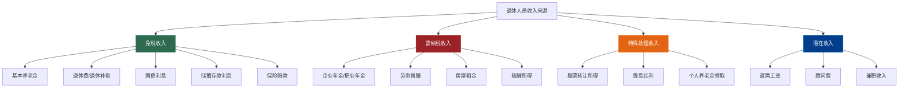

## 案例八：退休人员的收入优化

退休并不意味着收入来源的终结，也不意味着税务筹划的终结。恰恰相反，退休阶段的收入结构往往比在职时更加多元——养老金、企业年金、投资收益、房屋租金、返聘劳务费——每一种收入的税务处理规则各不相同。一个精心设计的退休收入组合，每年可以合法节税数千甚至上万元，这对固定收入的退休人员而言意义重大。

### 案例背景

**人物档案**：

王建国，62岁，2024年从某省会城市国有企业退休。配偶李芳，58岁，2022年已退休。两人育有一子（已独立）。王建国的父亲仍健在，88岁，与王建国的弟弟轮流赡养。

**退休前收入情况**：
- 王建国：月薪 18,000 元，年终奖 30,000 元
- 李芳：原月薪 12,000 元（2022年退休时）

**资产情况**：
- 自住房产一套（无贷款）
- 投资性房产一套（2018年购买，位于城市新区，月租金 3,500 元）
- 银行理财产品 80 万元（年化收益约 3.5%）
- 股票账户市值 25 万元
- 国债 30 万元
- 住房公积金余额：王建国 12 万元，李芳 8 万元

**退休后收入来源**：

| 收入来源 | 金额（月/元） | 年收入（元） | 性质 |
|----------|-------------|-------------|------|
| 基本养老金 | 6,800 | 81,600 | 免税 |
| 企业年金 | 2,200 | 26,400 | 单独计税 |
| 房屋租金 | 3,500 | 42,000 | 财产租赁所得 |
| 银行理财收益 | 2,333 | 28,000 | 混合（见下文） |
| 股票分红 | 不定 | 约 8,000 | 股息红利 |
| 国债利息 | — | 约 9,000 | 免税 |
| 退休前未休年假补偿 | — | 15,000 | 一次性收入 |

王建国夫妇年收入合计约 21 万元。看似不算高，但如果税务处理不当，每年可能多缴 5,000-8,000 元的税款。

### 退休人员的收入税务全景

退休后的收入来源可以分为四大类，税务待遇截然不同：

**免税收入详解**：

| 收入类型 | 免税依据 | 注意事项 |
|----------|----------|----------|
| 基本养老金 | 《个人所得税法》第四条 | 仅指社保发放的基本养老金，不含企业年金 |
| 离休退休费 | 财税〔2018〕164号 | 按国家统一规定发放的退休费、退职费 |
| 国债利息 | 《个人所得税法》第四条 | 国债和国家发行的金融债券利息免税 |
| 储蓄存款利息 | 财税〔2008〕132号 | 暂免征收个人所得税（政策持续有效） |
| 保险赔款 | 《个人所得税法》第四条 | 保险赔款免税，但分红型保险的分红部分需注意 |
| 差旅补贴 | 国税发〔1994〕089号 | 退休后返聘如产生差旅补贴，按标准内免税 |

### 企业年金的税务优化

企业年金是退休后最容易被忽略的纳税项目。王建国每月领取 2,200 元企业年金，按现行政策需要缴纳个人所得税。

**政策依据**：财税〔2018〕164号文规定，个人达到国家规定的退休年龄，领取的企业年金、职业年金，不并入综合所得，全额单独计算应纳税款。

**关键公式**：

企业年金应纳税额 = 每月领取金额 × 适用税率 - 速算扣除数

适用月度税率表（非年度综合所得税率表）：

| 月应纳税所得额 | 税率 | 速算扣除数 |
|--------------|------|-----------|
| 不超过 3,000 元 | 3% | 0 |
| 3,000-12,000 元 | 10% | 210 |
| 12,000-25,000 元 | 20% | 1,410 |
| 25,000-35,000 元 | 25% | 2,660 |
| 35,000-55,000 元 | 30% | 4,410 |

**王建国的企业年金纳税计算**：

每月领取 2,200 元，落在第一档（不超过 3,000 元，税率 3%）：
- 每月应纳税额 = 2,200 × 3% = 66 元
- 全年应纳税额 = 66 × 12 = 792 元

**优化策略一：选择按月领取而非一次性领取**

如果王建国选择一次性领取全年的企业年金 26,400 元：

一次性领取适用月度税率表时，需要将总额除以领取月数（此处为 12 个月）确定适用税率：

26,400 ÷ 12 = 2,200 元 → 适用 3% 税率

一次性应纳税额 = 26,400 × 3% = 792 元

结果相同。但如果企业年金余额较大（比如 50 万元），一次性领取将适用高得多的税率：

500,000 ÷ 12 = 41,667 元 → 适用 30% 税率
一次性应纳税额 = 500,000 × 30% - 4,410 = 145,590 元

而按月领取 2,200 元，领取 227 个月（约 19 年），总纳税 = 66 × 227 = 14,982 元。

节税金额：145,590 - 14,982 = 130,608 元。

**结论：企业年金余额较大时，务必选择按月领取。**

**优化策略二：合理安排领取节奏**

如果退休后还有其他收入（返聘工资等），可以考虑在高收入年份减少企业年金领取量（部分计划允许调整），在低收入年份多领取。但由于企业年金是单独计税，这个策略的效果不如想象中大，主要适用于有一次性领取需求的情况。

**优化策略三：企业年金与个人养老金的衔接**

2022年11月起实施的个人养老金制度，允许退休后继续缴存。如果王建国在退休前已参加个人养老金计划，退休后领取时需按 3% 单独计税。建议将企业年金和个人养老金的领取计划统一规划，避免某一年份集中领取导致税率跳档。

### 房屋租金收入的税务处理

王建国的投资性房产月租金 3,500 元，年租金 42,000 元。这是退休后最需要关注的税源之一。

**财产租赁所得的计税方法**：

根据《个人所得税法》第六条，财产租赁所得每次收入不超过 4,000 元的，减除费用 800 元；超过 4,000 元的，减除 20% 的费用，余额为应纳税所得额。

**个人出租住房的优惠税率**：财税〔2008〕24号文规定，个人出租住房减按 10% 的税率征收个人所得税。

**方案一：据实申报（有完整凭证）**

假设王建国每月租金收入 3,500 元，可扣除的费用如下：

| 扣除项目 | 月金额（元） | 说明 |
|----------|-------------|------|
| 费用扣除 | 700 | 3,500 × 20% = 700 |
| 房产税 | 140 | 3,500 × 4% = 140（个人出租住房优惠） |
| 增值税 | 0 | 月租金 10 万以下免征增值税 |
| 城建税及附加 | 0 | 增值税免征则附加免征 |
| 维修费用（分摊） | 约 200 | 凭发票据实扣除，按年 2,400 元分摊 |

每月应纳税所得额 = 3,500 - 700 - 140 - 200 = 2,460 元
每月应纳税额 = 2,460 × 10% = 246 元
全年应纳税额 = 246 × 12 = 2,952 元

**方案二：核定征收（无完整凭证）**

部分地区对个人出租住房采用综合征收率。以某省会城市为例，月租金 3,500 元的综合征收率约为 4%-8%（各地不同）。

假设综合征收率为 5%：
全年应纳税额 = 3,500 × 12 × 5% = 2,100 元

比据实申报少缴 852 元。

**操作要点**：

1. **确认当地政策**：各地住房租赁的综合征收率差异很大。有的城市对个人出租住房月租金 10 万以下免征个税（如上海对月租金 10 万以下的个人出租住房综合税率为 0%），有的城市则需要缴纳。务必到当地税务局或 12366 热线确认。

2. **装修费用的扣除**：出租前的装修费用不能一次性扣除，应按租赁期限分摊。如果装修花了 6 万元，租赁期限约定 5 年，每年可扣除 12,000 元（每月 1,000 元），大幅降低应纳税所得额。

3. **修缮费用的扣除**：出租期间发生的修缮费用，每月最高扣除 800 元，一次扣不完的结转下月继续扣除。保留所有维修发票至关重要。

4. **转租的处理**：如果王建国是从别人那里租来再转租的，支付的租金可以在转租收入中扣除。

**王建国的最优方案**：

经查询，王建国所在城市（假设为某省会城市）对个人出租住房月租金 10 万以下采用综合征收率 4%。

全年应纳税额 = 3,500 × 12 × 4% = 1,680 元

### 投资收益的税务筹划

退休人员通常持有大量金融资产，投资收益的税务处理直接影响实际回报。

#### 银行理财收益

**关键区分**：

| 理财产品类型 | 税务处理 | 税率 |
|-------------|----------|------|
| 银行存款利息 | 免税 | 0% |
| 国债利息 | 免税 | 0% |
| 地方政府债券利息 | 免税 | 0% |
| 公募基金分红（股票型） | 免税 | 0% |
| 公募基金分红（债券型） | 免税 | 0% |
| 公募基金转让所得 | 免税（暂免） | 0% |
| 银行理财（资管新规后） | 需缴税 | 20% |
| 信托产品收益 | 需缴税 | 20% |
| 券商收益凭证 | 需缴税 | 20% |

**王建国的 80 万理财结构调整**：

当前配置：银行理财产品 80 万，年化 3.5%，年收益 28,000 元。

如果全部是资管新规后的净值型银行理财（非免税），每年需缴税：
28,000 × 20% = 5,600 元

**优化方案**：

| 资产类型 | 金额（万元） | 年化收益 | 年收益（元） | 应缴税（元） |
|----------|-------------|----------|-------------|-------------|
| 国债 | 20 | 2.8% | 5,600 | 0 |
| 大额存单 | 20 | 2.5% | 5,000 | 0 |
| 公募债券基金 | 20 | 3.2% | 6,400 | 0 |
| 银行理财（净值型） | 20 | 3.8% | 7,600 | 1,520 |
| **合计** | **80** | **3.08%** | **24,600** | **1,520** |

优化前纳税 5,600 元，优化后纳税 1,520 元，年节税 4,080 元。

虽然总收益从 28,000 降至 24,600 元，但考虑税后实际到手：
- 优化前：28,000 - 5,600 = 22,400 元
- 优化后：24,600 - 1,520 = 23,080 元

税后收益反而增加了 680 元，且风险更加分散。

**重要提醒**：资管新规后的银行理财产品收益，理论上应由银行代扣代缴个税，但实际执行中多数银行并未代扣。这不代表免税，而是税务机关暂未严格征管。一旦政策收紧，可能面临补税风险。主动选择免税产品是更稳妥的策略。

#### 股票投资收益

王建国持有股票账户市值 25 万元，涉及两种收益类型：

**股息红利**：

| 持股时间 | 税务处理 | 实际税负 |
|----------|----------|----------|
| 持股 > 1 年 | 免税 | 0% |
| 1 个月 < 持股 ≤ 1 年 | 减半计入 | 10% |
| 持股 ≤ 1 个月 | 全额计入 | 20% |

**优化策略**：退休人员投资股票应以长期持有为主，享受股息红利免税优惠。计划卖出前确认持股已超过 1 年，避免短期持有导致红利被征税。

**股票转让所得**：目前个人转让上市公司股票的所得暂免征收个人所得税（财税〔1998〕61号，政策持续有效）。但转让限售股需按 20% 缴纳个税。

**王建国的操作建议**：
- 将股票账户调整为高股息蓝筹股为主，每年获取免税分红
- 避免频繁交易（短线交易产生的佣金和印花税也是一笔不小的支出）
- 如果持有限售股，在解禁后的第一个纳税年度评估转让时机

### 返聘收入的税务处理

许多退休人员会选择返聘或从事自由职业。这部分收入的税务处理有其特殊性。

**返聘收入的性质认定**：

| 工作形式 | 收入性质 | 税率 | 扣除标准 |
|----------|----------|------|----------|
| 签订劳动合同的返聘 | 工资薪金 | 3%-45% | 基本减除 5,000 元/月 + 专项附加扣除 |
| 签订劳务合同的返聘 | 劳务报酬 | 3%-45%（预扣20%-40%） | 每次 800 元或 20% 费用 |
| 独立顾问/咨询 | 劳务报酬 | 3%-45% | 同上 |
| 稿酬 | 稿酬所得 | 70% 计入 | 同上 |

**关键差异**：退休人员再任职取得的收入，如果符合"退休人员再任职"条件（签订劳动合同、享受同等福利、按月支付报酬），可以按照"工资薪金所得"计税，享受每月 5,000 元的基本减除和专项附加扣除。否则按"劳务报酬"计税，预扣税率更高（20%起），虽然年度汇算时可能退税，但会占用资金。

**王建国的返聘场景假设**：

退休后被原单位返聘为技术顾问，每月报酬 8,000 元。

**方案一：签订劳动合同（工资薪金所得）**

每月应纳税所得额 = 8,000 - 5,000 - 赡养老人 1,500 = 1,500 元
（赡养老人：非独生子女，与兄弟分摊，每月最高 1,500 元）

每月应纳税额 = 1,500 × 3% = 45 元
全年应纳税额 = 45 × 12 = 540 元

**方案二：签订劳务合同（劳务报酬所得）**

每月预扣预缴：
收入 8,000 元，扣除 800 元费用后，应纳税所得额 7,200 元
预扣税额 = 7,200 × 20% = 1,440 元
全年预扣 = 1,440 × 12 = 17,280 元

年度汇算时：
全年劳务报酬收入 = 8,000 × 12 = 96,000 元
计入综合所得的收入 = 96,000 × (1-20%) = 76,800 元
应纳税所得额 = 76,800 - 60,000 - 18,000（赡养老人）= -1,200 元

应纳税所得额为负数，全年个税为 0，之前预扣的 17,280 元全额退回。

**方案三：签订劳务合同但享受不了基本减除（已领养老金的特殊情形）**

这里需要特别注意：退休人员再任职的收入，在年度汇算时，基本减除费用 60,000 元是与其他综合所得合并计算的。如果王建国只有这一项综合所得，那么即使按劳务报酬计税，汇算时也能享受 60,000 元扣除，结果与工资薪金相近。

**真正的差异在于现金流**：
- 工资薪金：每月只扣 45 元，现金流压力小
- 劳务报酬：每月预扣 1,440 元，虽然汇算时能退，但要等到次年 3-6 月

**建议**：尽量争取签订劳动合同，按工资薪金计税，保持每月现金流的稳定。

### 退休过渡期的一次性收入处理

王建国退休时有几笔一次性收入需要处理：

#### 1. 住房公积金提取

退休时一次性提取住房公积金 12 万元，这是**免税**的。

根据《财政部 国家税务总局关于基本养老保险费 基本医疗保险费 失业保险费 住房公积金有关个人所得税政策的通知》（财税〔2006〕10号），个人实际领（支）取原提存的基本养老保险金、基本医疗保险金、失业保险金和住房公积金时，免征个人所得税。

**操作**：退休后尽快办理公积金提取，不要长期闲置在账户中（利率极低）。

#### 2. 未休年假工资补偿

退休前未休完的年假，单位按照日工资的 300% 支付补偿。王建国有 5 天未休年假，日工资 = 18,000 ÷ 21.75 = 827.59 元，补偿金额 = 827.59 × 3 × 5 = 12,414 元（取整 15,000 元含其他补贴）。

这笔收入在发放当月并入工资薪金计税。如果在退休前最后一个月份发放，该月收入会较高，可能适用较高税率。

**优化策略**：与单位协商，将未休年假补偿在退休前的一个普通月份发放（而非退休当月，因为退休当月可能还有其他结算），避免与退休结算叠加推高税率。

#### 3. 一次性补贴（部分地区政策）

部分国有企业在员工退休时发放一次性生活补贴、安家费等。根据国税发〔1999〕58号文，个人因解除劳动关系取得的一次性补偿收入，在当地上年职工平均工资 3 倍数额以内的部分免税。

但退休不属于"解除劳动关系"，这一条款不直接适用。退休一次性补贴通常并入当月工资薪金计税。如果金额较大，应与单位财务沟通发放时间，分散到多个月份发放以降低边际税率。

### 综合优化方案

经过以上分析，为王建国夫妇设计以下综合优化方案：

#### 优化后的年度税务计算

**王建国**：

| 收入项目 | 年收入（元） | 应纳税额（元） | 优化策略 |
|----------|-------------|---------------|----------|
| 基本养老金 | 81,600 | 0 | 依法免税 |
| 企业年金（按月领） | 26,400 | 792 | 按月领取，适用 3% 最低档 |
| 房屋租金 | 42,000 | 1,680 | 选择综合征收率，保留维修发票 |
| 投资收益（调整后） | 24,600 | 1,520 | 增配国债/存款/公募基金 |
| 国债利息 | 9,000 | 0 | 依法免税 |
| 股票分红（长期持有） | 8,000 | 0 | 持股超 1 年免税 |
| 返聘收入（工资薪金） | 96,000 | 540 | 签劳动合同，享受基本减除 |
| **合计** | **287,600** | **4,532** | — |

**李芳**：

| 收入项目 | 年收入（元） | 应纳税额（元） |
|----------|-------------|---------------|
| 基本养老金 | 约 54,000 | 0 |
| 企业年金（如有） | 约 12,000 | 360 |
| **合计** | **约 66,000** | **约 360** |

**家庭年度总纳税**：约 4,892 元

#### 优化前后对比

| 项目 | 优化前（估算） | 优化后 | 年节税 |
|------|-------------|--------|--------|
| 企业年金税 | 792 | 792 | 0（已是最低档） |
| 房租收入税 | 3,360（按 20% 标准税率） | 1,680 | 1,680 |
| 投资收益税 | 5,600 | 1,520 | 4,080 |
| 返聘收入税 | 17,280（预扣） | 540 | 约 2,000（考虑退税时间成本） |
| **合计** | **约 27,032** | **约 4,892** | **约 6,500-8,500** |

每年合法节税约 6,500-8,500 元，相当于增加一个月的养老金。

### 常见误区与风险提示

#### 误区一：养老金免税等于退休后所有收入免税

很多人以为退休后就不需要缴税了。实际上，只有基本养老金（社保发放的）免税，企业年金、劳务报酬、租金收入等都需要依法纳税。

#### 误区二：出租房屋不报税没关系

虽然税务机关对个人出租住房的征管力度不如企业严格，但随着不动产登记信息联网和大数据比对，租金收入被发现只是时间问题。一旦被查，不仅要补税，还有滞纳金（每日万分之五）和 0.5-5 倍的罚款。

#### 误区三：股票分红都要缴税

持股超过 1 年的股息红利完全免税。很多退休老人持有的银行股、电力股分红丰厚，只要坚持长期持有，这部分收入是零税负的。

#### 误区四：返聘收入可以不申报

退休人员再任职的收入，无论金额大小，都应依法申报。单位发放报酬时会代扣代缴，但如果有多处收入来源，年度汇算时可能需要补税或申请退税。

#### 误区五：理财收益不用自己操心

资管新规后的银行理财产品，收益的税务处理尚不明确。虽然多数银行没有代扣代缴，但这不代表免税。主动选择国债、存款等免税产品，是规避未来税务风险的明智之举。

### 进阶策略

#### 策略一：利用家庭成员间的收入转移

如果配偶收入较低或免税额度有余，可以考虑：
- 将部分金融资产放在配偶名下，利用其免税额度
- 房产共有权的调整，影响租金收入的分配

**注意**：资产转移应有合理商业目的，避免被认定为避税行为。夫妻间的资产转移通常不涉及税务问题，但房产更名可能涉及契税等费用，需要综合评估成本。

#### 策略二：合理利用个人养老金账户

2022年11月起实施的个人养老金制度，每年缴存上限 12,000 元，领取时按 3% 单独计税。对于退休前参加并持续缴存的退休人员，退休后领取时可享受这一优惠税率。

如果王建国退休前已参加个人养老金计划，退休后领取时：
- 每年领取 12,000 元，应纳税额 = 12,000 × 3% = 360 元
- 而如果不参加个人养老金，这 12,000 元的收益可能按 20% 纳税

#### 策略三：慈善捐赠抵税

退休人员如果有慈善捐赠意愿，通过合规渠道（向有资质的慈善组织）的捐赠，可以在综合所得中扣除，最高不超过应纳税所得额的 30%。

例如，王建国返聘年收入 96,000 元，如果通过合规渠道捐赠 5,000 元，可以在汇算时扣除，进一步降低应纳税所得额。

#### 策略四：医疗保险和长期护理保险

部分商业健康保险和长期护理保险的保费可以在个税前扣除（每年最高 2,400 元或 1,200 元）。退休人员购买这类保险不仅获得保障，还能享受税收优惠。

### 年度税务日历

退休人员虽然没有了单位代扣代缴的依赖，但仍需关注以下时间节点：

| 时间 | 事项 | 操作 |
|------|------|------|
| 每月 15 日前 | 企业年金个税 | 通常由年金管理机构代扣代缴，确认扣税金额 |
| 每季度末 | 房租收入申报 | 到税务局申报或通过电子税务局线上申报 |
| 3-5 月 | 年终奖计税选择 | 如果返聘单位发年终奖，选择单独计税或并入综合所得 |
| 次年 3 月 1 日-6 月 30 日 | 年度汇算 | 综合所得汇算清缴，申请退税或补税 |
| 次年 3-6 月 | 专项附加扣除确认 | 赡养老人、大病医疗等扣除项的确认和更新 |
| 不定期 | 关注税收新政 | 退休人员税收优惠政策可能调整 |

### 本案例的核心启示

1. **免税不等于不用管**：虽然基本养老金免税，但其他收入仍需关注税务处理。
2. **投资组合的税务效率**：同样的收益水平，选择免税产品可以显著提高税后回报。
3. **返聘合同类型很重要**：劳动合同和劳务合同的税负差异可达数千元。
4. **时间安排影响税率**：一次性收入的发放时间、企业年金的领取节奏都会影响适用税率。
5. **主动规划胜过被动应对**：退休前就应该开始规划退休后的收入结构，而不是退休后才匆忙应对。
6. **保留凭证是基础**：无论是租房的维修发票还是医疗费用单据，完整的凭证是享受税收优惠的前提。
7. **政策在变，规划要更新**：税收政策会随着经济发展不断调整，退休人员应保持对政策的关注，或定期咨询专业税务顾问。

退休阶段的税务筹划，核心不是"少缴税"，而是"不多缴税"。在合法合规的前提下，让每一分钱的税款都对应真实的纳税义务，不多一分也不少一分——这才是退休收入税务优化的最高境界。
