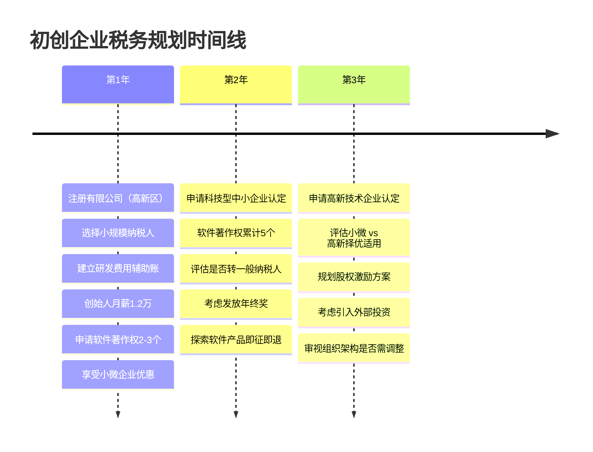

## 案例九：初创企业的税务规划

初创企业是税务规划最具杠杆效应的阶段——一张白纸好作画。从注册类型的选择、纳税人身份的确定，到组织架构的设计、优惠政策的运用，每一个决策都会在未来数年产生深远的税务影响。本案例通过一个真实的技术型初创企业从0到1的全过程，系统演示初创阶段如何构建税务最优架构。

---

### 一、案例背景

#### 1.1 创始人画像

**人物：** 张工，32岁，前互联网公司高级研发工程师，年收入45万元（含年终奖）。妻子李芳，30岁，设计行业从业者，年收入18万元。家庭有80万元积蓄。

**创业方向：** 企业级SaaS软件——面向中小餐饮企业的智能点餐与库存管理系统。张工负责技术研发，计划初期雇佣3-5名开发人员。

**关键财务预测（首年）：**

| 指标 | 保守估计 | 乐观估计 |
|------|----------|----------|
| 首年营收 | 30万元 | 80万元 |
| 首年成本 | 50万元（含人工） | 60万元 |
| 首年利润 | -20万元 | 20万元 |
| 第二年营收 | 120万元 | 300万元 |
| 第三年营收 | 300万元 | 800万元 |

#### 1.2 核心税务问题

张工面临以下关键税务决策：

1. **经营主体选择：** 以个人身份接单（劳务报酬），还是注册公司？注册什么类型的公司？
2. **纳税人身份：** 选择小规模纳税人还是一般纳税人？
3. **组织架构：** 单一公司还是需要搭建母公司+子公司结构？
4. **优惠政策：** 如何最大化享受国家对初创企业、高新技术企业、小微企业的税收优惠？
5. **薪酬设计：** 创始人和员工的薪酬如何设计才能税负最优？
6. **研发投入：** 研发费用如何归集才能最大化加计扣除？

---

### 二、经营主体选择——第一步也是最关键的一步

#### 2.1 个体工商户 vs. 有限公司 vs. 个人独资企业

这是初创阶段的第一个重大决策，直接影响未来三年的税负结构。

**三种主体的税务对比：**

| 对比维度 | 个体工商户 | 个人独资企业 | 有限公司 |
|----------|-----------|-------------|----------|
| 所得税类型 | 个人所得税（经营所得） | 个人所得税（经营所得） | 企业所得税 + 个税（分红） |
| 税率 | 5%-35%超额累进 | 5%-35%超额累进 | 25%（基本税率）+ 20%分红 |
| 亏损弥补 | 不可向后结转 | 不可向后结转 | 可结转5年（最长10年） |
| 融资能力 | 弱 | 弱 | 强 |
| 责任范围 | 无限责任 | 无限责任 | 有限责任 |
| 优惠政策 | 较少 | 较少 | 丰富（小微/高新/研发加计扣除） |
| 股权激励 | 无法实施 | 无法实施 | 可以实施 |

**分析与决策：**

对于张工的情况——技术型SaaS产品、预计前期亏损、未来需要融资扩张——**有限责任公司是最优选择**，原因如下：

- **前期亏损可结转：** 首年预计亏损20万元，有限公司可以用未来5年的利润弥补，节省企业所得税5万元（20万×25%）。个体户和个独无法享受。
- **优惠政策丰富：** 小微企业优惠、高新技术企业15%税率、研发费用100%加计扣除，都是有限公司才能享受的。
- **融资需求：** SaaS企业通常需要天使轮/A轮融资，投资机构不会投个体户。
- **有限责任保护：** 技术产品可能面临知识产权纠纷，有限责任保护个人资产。

#### 2.2 注册地选择

注册地直接影响可享受的地方性优惠政策。

**税收优惠园区对比：**

| 类型 | 典型地区 | 优惠内容 | 适用条件 |
|------|---------|---------|---------|
| 国家级高新区 | 各地高新区 | 高新企业15%所得税率 | 需认定高新资质 |
| 自贸区 | 上海/海南/深圳前海 | 特定行业所得税优惠 | 符合产业目录 |
| 西部大开发地区 | 西安/成都/重庆 | 鼓励类产业15%税率 | 主营收入占比60%以上 |
| 海南自贸港 | 海南全域 | 新增境外直接投资免征所得税 | 实质性运营 |
| 地方财政返还园区 | 各地产业园 | 增值税/所得税地方留存部分返还30%-80% | 需实体办公 |

**张工的决策：** 注册在本市国家级高新技术产业开发区。理由：(1) 有实体办公需求，不能空壳注册；(2) 申请高新资质后可享受15%企业所得税率；(3) 园区有孵化器政策，前三年租金减免。

#### 2.3 注册资本规划

注册资本并非越高越好，尤其在认缴制下：

- **过高的风险：** 认缴不等于不缴，公司清算时需补足未缴部分。100万注册资本如果认缴但未实缴，清算时需要补缴。
- **过低的问题：** 影响客户信任度，部分B2B客户会查看企业注册资本。
- **推荐方案：** SaaS行业建议注册资本50万-100万元，实缴到位。张工选择注册资本50万元，首期实缴30万元（货币出资），剩余20万元在两年内缴足。

---

### 三、纳税人身份选择——小规模 vs. 一般纳税人

#### 3.1 政策要点

根据现行政策：

- **小规模纳税人：** 年应税销售额500万元以下，增值税征收率3%（部分时期减按1%），不可抵扣进项税额。
- **一般纳税人：** 年应税销售额超过500万元应登记为一般纳税人；未超过也可主动申请。增值税税率6%（服务业），可抵扣进项税额。

#### 3.2 测算与决策

张工的业务是SaaS软件服务，属于现代服务业，关键变量是**可抵扣进项的多少**。

**临界点分析：**

设年销售额为S，可抵扣进项占销售额比例为R：

- 小规模纳税人税负 = S × 3%
- 一般纳税人税负 = S × 6% × (1 - R) = S × 6% - S × 6% × R

两者税负相等时：3% = 6% × (1 - R)，解得 R = 50%。

即：**当可抵扣进项占销售额比例超过50%时，一般纳税人更优。**

**张工的实际测算（首年保守场景）：**

| 方案 | 收入 | 税率 | 可抵扣进项 | 应纳增值税 | 附加税（12%） | 合计 |
|------|------|------|-----------|-----------|-------------|------|
| 小规模 | 30万 | 1%（优惠期） | 0 | 0.3万 | 0.036万 | 0.336万 |
| 一般纳税人 | 30万 | 6% | 服务器等约2万 | 1.8-0.12=1.68万 | 0.2万 | 1.88万 |

**结论：** 首年作为小规模纳税人。因为初创期SaaS企业人工成本占大头（约70%），而工资薪金不能抵扣增值税，可抵扣进项极少。

**转换时机：** 当年销售额接近500万元或可抵扣进项比例显著提升时（如大规模采购服务器、外包开发取得专票），主动申请转为一般纳税人。预计在第2-3年转换。

---

### 四、企业所得税筹划——核心税务规划战场

#### 4.1 小微企业优惠（最重要的优惠）

**政策要点（2024年延续政策）：**

- 年应纳税所得额 ≤ 300万元：实际税率5%（应纳税所得额减按25%，税率20%）
- 对比基本税率25%，节省幅度达80%

**张工的运用：**

首年利润-20万元（亏损），无需缴纳企业所得税，亏损可结转至第二年。

第二年预计利润60万元：

| 项目 | 无优惠 | 享受小微优惠 |
|------|--------|------------|
| 应纳税所得额 | 60万 | 60万 |
| 税率 | 25% | 5%（25%×25%） |
| 应纳所得税 | 15万 | 3万 |
| 节省金额 | — | 12万 |

**关键注意点：**

- 小微企业判定标准：从业人数 ≤ 300人、资产总额 ≤ 5000万元、年应纳税所得额 ≤ 300万元。
- 三个条件必须**同时满足**，任何一个不满足即不能享受。
- 从业人数包括劳务派遣用工，需提前规划人员规模。
- 如果计划引入外部投资使资产总额膨胀，需注意5000万元红线。

#### 4.2 高新技术企业认定（中期目标）

**认定条件：**

| 条件 | 具体要求 | 张工的现状 |
|------|---------|-----------|
| 核心技术 | 拥有自主知识产权 | 自研SaaS系统，可申请软著 |
| 科技人员占比 | ≥ 10% | 5人团队中4人为技术，占比80% |
| 研发费用占比 | 营收<5000万：≥5%；5000万-2亿：≥4%；>2亿：≥3% | 首年研发费用约40万，占比>5% |
| 高新收入占比 | ≥ 60% | SaaS收入即为高新收入 |
| 创新能力评价 | ≥ 71分（满分100） | 需积累知识产权和成果转化 |

**高新认定带来的税务收益：**

- 企业所得税率从25%降至**15%**
- 与小微企业优惠**不能叠加**，但可择优适用
- 当利润超过300万元（不适用小微）时，高新优惠的价值凸显

**决策路径：**

```text
年利润 ≤ 300万 → 适用小微优惠（实际税率5%），无需高新认定
年利润 > 300万 → 申请高新认定（税率15%），节省10个百分点
```

张工计划在第二年申请软著（3-5个），第三年营收预计突破300万元时申请高新认定。

#### 4.3 研发费用加计扣除

这是技术型初创企业**最具价值的税收优惠之一**。

**政策要点：**

- 研发费用加计扣除比例：**100%**（2023年起所有企业适用）
- 即：实际发生100万元研发费用，可在税前扣除200万元
- 形成无形资产的，按成本的200%摊销

**研发费用归集范围：**

| 费用类别 | 具体内容 | 可加计金额 |
|----------|---------|-----------|
| 人员人工 | 研发人员工资、社保、公积金 | 100%加计 |
| 直接投入 | 服务器租赁、云服务、测试耗材 | 100%加计 |
| 折旧摊销 | 研发设备折旧、软件摊销 | 100%加计 |
| 设计试验 | 产品设计费、临床试验费 | 100%加计 |
| 其他费用 | 差旅费、专利费、查新费 | 100%加计（限额10%） |
| 委托研发 | 委托外部研发费用 | 80%加计 |

**张工的研发费用规划：**

| 费用项目 | 金额（年） | 加计扣除额 | 节税效果（5%税率） |
|----------|-----------|-----------|-----------------|
| 研发人员工资 | 40万 | 40万 | 2万 |
| 云服务器费用 | 6万 | 6万 | 0.3万 |
| 开发工具/软件 | 3万 | 3万 | 0.15万 |
| 专利/软著申请 | 2万 | 2万 | 0.1万 |
| 委托测试 | 4万 | 3.2万（80%） | 0.16万 |
| **合计** | **55万** | **54.2万** | **约2.7万** |

**实操要点：**

1. **建立研发费用辅助账：** 从公司成立第一天起，就要设置研发费用辅助账，按项目归集研发支出。税务稽查时，没有辅助账的加计扣除可能被否决。
2. **研发项目立项：** 每个研发项目需编制立项报告，明确研发目标、技术路线、经费预算、人员配置。
3. **工时记录：** 研发人员必须记录工时分配，兼职研发人员按实际参与研发的工时比例分摊。
4. **费用分摊：** 研发与生产经营共用的设备、场地，需按合理方法分摊。

#### 4.4 亏损结转的筹划技巧

**政策：** 高新技术企业和科技型中小企业亏损结转年限延长至**10年**（普通企业5年）。

**张工的运用：**

首年亏损20万元。如果第三年申请到高新资质，这20万亏损可在10年内弥补（到第11年），而普通企业只能弥补到第6年。

亏损结转在利润快速增长的SaaS企业中价值巨大——前期投入的研发和市场费用形成的亏损，可以抵消后期的高额利润。

---

### 五、增值税筹划——小规模纳税人的精细化管理

#### 5.1 小规模纳税人免税额度

**政策要点：**

- 小规模纳税人月销售额 ≤ 10万元（季度 ≤ 30万元）：**免征增值税**
- 超过部分按1%征收率缴纳（优惠期内）

**张工的运用：**

首年保守营收30万元，月均2.5万元，完全在免税范围内。

**关键操作技巧：**

1. **控制开票节奏：** 按季度申报的小规模纳税人，注意控制每季度开票金额不超过30万元。如果某季度收入集中，可与客户协商分期开票。
2. **开票类型选择：** 免税额度内优先开具普通发票。开具增值税专用发票的部分不享受免税。
3. **收入确认时点：** SaaS企业采用预收模式时，收入确认时点影响纳税义务发生时间。

#### 5.2 即征即退政策（进阶）

软件产品增值税即征即退：增值税实际税负超过3%的部分即征即退。

**适用条件：**

- 取得软件著作权登记证书
- 通过软件产品检测
- 销售自行开发的软件产品

**测算：** 如果张工的SaaS产品取得软件著作权并登记为软件产品，年收入100万元时：

- 一般纳税人应纳增值税 = 100万 × 6% - 进项 ≈ 5.4万元
- 即征即退 = 5.4万 - 100万 × 3% = 2.4万元
- 实际增值税税负仅3%

**注意事项：** 此政策仅适用于软件产品的**许可/销售**收入，纯SaaS订阅服务收入在各地执行口径不一，需咨询当地税务局确认。

---

### 六、薪酬与社保筹划

#### 6.1 创始人薪酬设计

张工从原公司离职创业，自己的薪酬设计直接影响个人所得税和企业成本。

**方案对比：**

| 方案 | 月工资 | 年收入 | 个税（年） | 企业可扣除成本 | 综合评价 |
|------|--------|--------|-----------|--------------|---------|
| 方案A：高工资 | 2万 | 24万 | 约1.08万 | 24万+社保 | 前期利润低时不划算 |
| 方案B：低工资+分红 | 0.8万 | 9.6万+分红 | 工资个税约0.18万 | 9.6万+社保 | 分红税负高（20%） |
| 方案C：适中工资 | 1.2万 | 14.4万 | 约0.36万 | 14.4万+社保 | **最优平衡** |

**推荐方案C，理由如下：**

1. **1.2万/月** 基本用完免征额（6万/年）和专项附加扣除，个税负担极轻。
2. 工资作为成本在企业所得税前扣除（虽然小微企业税率低，但仍有价值）。
3. 社保缴纳基数合理，保障社保权益（医保、养老）。
4. 避免零工资引发税务风险（税务局关注创始人零薪酬的合理性）。
5. 后期利润增长后，可通过年终奖单独计税优化。

**年终奖的运用：**

第二年利润改善后，发放年终奖36000元（单独计税，税率3%，个税1080元），比并入综合所得节税效果显著。

#### 6.2 员工薪酬优化

**股权激励（期权/限制性股票）：**

初创企业现金紧张，股权激励是吸引人才的核心手段。

**税务处理要点：**

| 激励方式 | 授予时 | 行权/解锁时 | 出售时 |
|----------|--------|-----------|--------|
| 股票期权 | 不征税 | 工资薪金所得（3%-45%） | 财产转让所得（20%） |
| 限制性股票 | 不征税 | 工资薪金所得（3%-45%） | 财产转让所得（20%） |
| 股权奖励 | 不征税 | 工资薪金所得（可递延） | 财产转让所得（20%） |

**非上市公司股权激励优惠：**

符合条件的非上市公司股权激励，经向主管税务机关备案，员工在取得股权激励时可暂不纳税，递延至转让股权时按**20%税率**缴纳（而非45%最高边际税率）。

**张工的操作：** 给核心技术员工期权，行权价格按净资产定价，备案享受递延纳税优惠。既减轻员工税负，又降低企业现金支出压力。

---

### 七、全流程时间线——从注册到第三年的税务规划



---

### 八、三年税务数据总览

| 项目 | 第1年 | 第2年 | 第3年 |
|------|-------|-------|-------|
| 营业收入 | 30万 | 120万 | 300万 |
| 利润总额 | -20万 | 60万 | 150万 |
| 弥补亏损后所得 | 0 | 40万（弥补20万） | 150万 |
| 适用优惠 | 小微企业 | 小微企业 | 小微企业/高新 |
| 企业所得税 | 0 | 2万（40万×5%） | 7.5万（150万×5%） |
| 增值税 | 0（免税额度内） | 约1.2万 | 约3-5万 |
| 附加税 | 0 | 约0.14万 | 约0.36-0.6万 |
| 研发加计扣除节税 | 0（亏损） | 约1.5万 | 约3万 |
| **三年累计税负** | — | — | **约10-13万** |
| **对比无筹划税负** | — | — | **约45-55万** |
| **累计节省** | — | — | **约35-42万** |

---

### 九、常见误区与风险提示

#### 误区一：初创期利润低，不需要税务规划

**事实：** 初创期恰恰是税务规划的黄金期。注册类型、纳税人身份、股权结构等决策一旦确定，后期变更成本极高。例如，个体户转有限公司需要注销重设，涉及资产过户的税费。

#### 误区二：为了享受优惠注册空壳公司

**事实：** 税务局对"实质性运营"的审查日趋严格。在税收洼地注册无实际办公的空壳公司，面临纳税调整和罚款风险。2024年起多地已开展空壳清理行动。

#### 误区三：零申报省钱省事

**事实：** 长期零申报会被列为异常户。即使没有收入，也要按时申报。而且合理的费用支出（如注册费、办公费）应该入账，形成亏损可用于弥补未来利润。

#### 误区四：研发费用加计扣除可以随意归集

**事实：** 研发费用加计扣除是税务稽查的重点领域。常见被否决情形：

- 研发项目立项不规范，缺乏技术可行性论证
- 研发人员工时记录缺失，无法证明参与研发活动
- 研发费用与生产费用混同，无法合理分摊
- 委托研发未取得合规发票

#### 误区五：注册资本越高越显实力

**事实：** 在认缴制下，注册资本是股东对公司承担责任的上限。100万注册资本意味着公司清算时股东最多承担100万的出资义务。SaaS初创企业50万-100万足矣，后续可通过增资调整。

#### 误区六：分红比工资更划算

**事实：** 分红适用20%个税，且分红前必须先缴企业所得税。工资薪金虽然最高边际税率达45%，但有免征额、专项扣除、专项附加扣除等优惠。对于月薪1-2万的创始人，工资的实际税负远低于分红。

---

### 十、进阶内容：特殊税务场景处理

#### 10.1 技术入股的税务处理

如果张工以自研软件著作权作价出资设立公司：

**税务处理：**

- 个人以技术成果投资入股，可选择**递延纳税**——在投资入股当期暂不缴纳个税，递延至转让股权时缴纳。
- 递延期间税率为20%（财产转让所得），而非工资薪金的最高45%。
- 需要提供技术评估报告，评估价格需合理（税务局可核定）。

**操作步骤：**

1. 委托有资质的评估机构对软件著作权进行价值评估
2. 签订技术出资协议，办理知识产权转移登记
3. 向主管税务机关备案递延纳税
4. 在公司章程中明确技术出资的金额和比例

#### 10.2 政府补贴的税务处理

初创企业可能获得的政府补贴及税务处理：

| 补贴类型 | 是否征税 | 企业所得税处理 |
|----------|---------|--------------|
| 高新企业认定补贴 | 不征增值税 | 符合条件可作为不征税收入 |
| 科技型中小企业创新基金 | 不征增值税 | 符合条件可作为不征税收入 |
| 人才引进补贴 | 部分免个税 | 需单独核算支出 |
| 知识产权补贴 | 不征增值税 | 符合条件可作为不征税收入 |

**注意：** 不征税收入用于支出所形成的费用，不得在税前扣除。因此，如果企业处于盈利状态，选择征税收入（正常缴税）反而可能更优——因为对应的支出可以税前扣除。

#### 10.3 关联交易与转让定价

如果张工同时设立多个公司（如母公司+研发子公司+销售子公司），需注意关联交易的定价问题：

- 关联交易定价需符合**独立交易原则**
- 年关联交易金额超过2亿元需准备**同期资料**
- 不符合独立交易原则的，税务局有权进行纳税调整

初创企业关联交易金额通常较小，暂不需要准备同期资料，但仍需保留定价依据的文档。

---

### 十一、经验总结

**张工案例的核心启示：**

1. **早规划比晚规划好：** 公司注册阶段的决策（类型、身份、注册地）影响未来5-10年的税负。创业前花一周做好税务规划，可能节省几十万的税。

2. **优惠政策要主动争取：** 小微企业优惠自动享受，但研发加计扣除、高新认定、软件产品即征即退等优惠需要主动申请和归集。不申请就等于放弃。

3. **账务规范是基础：** 所有税务筹划都建立在规范的账务基础上。研发费用辅助账、工时记录、合同管理，从第一天就要做好。

4. **动态调整很重要：** 税务规划不是一成不变的。随着企业规模增长，纳税人身份、适用优惠、组织架构都可能需要调整。建议每半年做一次税务健康检查。

5. **合规是底线：** 所有筹划都在法律框架内进行。虚开发票、虚列成本、隐匿收入不是筹划，是偷税。金税四期下，税务大数据的监管能力远超想象。

6. **专业支持不可少：** 初创企业可以不设专职税务岗，但建议聘请一位熟悉科技企业税务的会计师或税务师做常年顾问。每年几千元的顾问费，换来的是合规保障和优惠落地。
