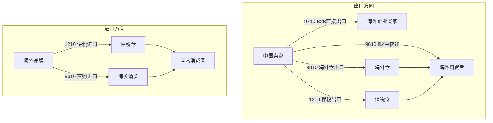
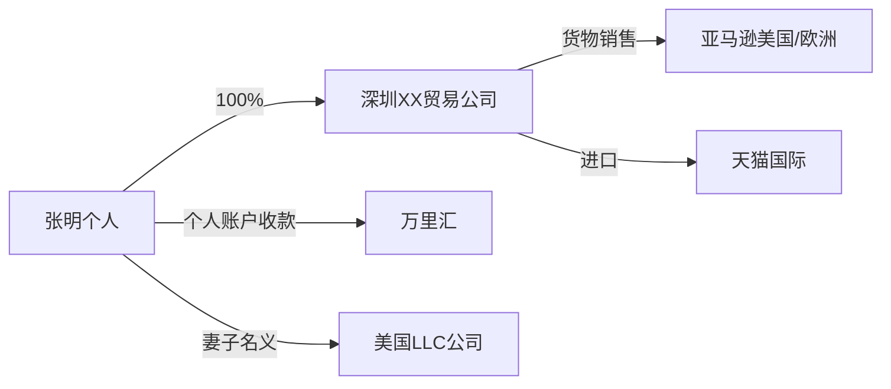
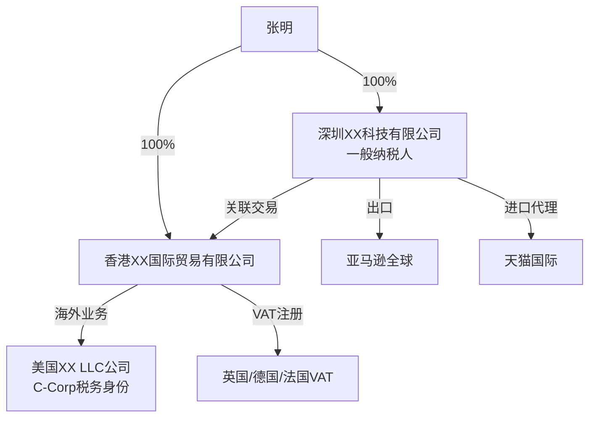

## 案例十：跨境电商业务的税务合规

### 案例背景

跨境电商是近年来增长最快的商业模式之一，但其税务合规复杂度远超国内业务。不同国家的税制差异、进出口环节的多重税种、转让定价规则、增值税（VAT）注册义务等问题交织在一起，使得许多跨境卖家在快速发展中积累了大量税务风险。

本案例以一个真实的跨境电商创业团队为例，展示其从"野蛮生长"到"合规经营"的完整转型过程，涵盖进口端和出口端的双重税务合规挑战。

**主人公画像：**

- 创始人：张明（化名），32岁，原外贸公司业务经理，2022年辞职创业
- 团队：初期2人，一年后扩展至8人
- 主营业务：通过亚马逊（Amazon）和独立站向欧美市场销售家居用品，同时通过天猫国际从日本进口美妆产品在国内销售
- 起步资金：50万元人民币
- 年营收：第一年380万元，第二年预计突破1200万元

**核心税务痛点：**

| 痛点 | 具体表现 | 潜在风险 |
|------|----------|----------|
| 出口端税务不清 | 不知道自己能否享受出口退税，如何申报 | 多缴税或被追缴 |
| 进口端税务混乱 | 跨境电商综合税、行邮税概念混淆 | 海关处罚、补税 |
| 海外VAT未注册 | 在欧洲销售但未注册VAT | 平台封号、罚款 |
| 转让定价无文档 | 中国公司与海外仓之间的定价随意 | 被认定利润转移 |
| 资金回流不规范 | 通过个人账户收取平台回款 | 个人所得税风险 |
| 关税分类错误 | HS编码填报不准确 | 海关查验、补税罚款 |

### 跨境电商的业务模式与税务框架

#### 主流跨境电商模式对比

跨境电商的业务模式决定了税务处理方式，不同模式下的纳税义务差异巨大。



**四大海关监管代码详解：**

| 监管代码 | 全称 | 适用场景 | 税务特点 |
|----------|------|----------|----------|
| 9610 | 跨境电商零售进出口 | B2C小包直邮出口/直购进口 | 清单核放、汇总申报；进口享综合税优惠 |
| 9710 | 跨境电商B2B直接出口 | B2B线上成交直接出口 | 与一般贸易出口类似，可享出口退税 |
| 9810 | 跨境电商出口海外仓 | 先运至海外仓再销售 | 出口环节可退税，海外仓有当地税务义务 |
| 1210 | 保税跨境贸易 | 保税仓备货进口/出口 | 进口享综合税优惠；出口可退税 |

#### 跨境电商涉及的主要税种

**出口端（中国卖家向海外销售）：**

1. **增值税**：出口货物适用零税率或免税，可申请退还进项税额
2. **企业所得税**：全球所得按25%税率缴纳（小微企业有优惠）
3. **关税**：出口关税较少，部分资源性产品需缴纳
4. **消费税**：出口应税消费品可退还已纳消费税

**进口端（从海外采购商品在国内销售）：**

1. **跨境电商综合税**：关税×0%（限值内）+ 增值税×70% + 消费税×70%
2. **行邮税**：个人自用物品通过邮寄渠道进口，税率20%/30%/50%三档
3. **一般贸易进口税**：关税 + 增值税13% + 消费税（如适用）

**海外目的国税务（以欧美为例）：**

| 国家/地区 | 主要税种 | 税率范围 | VAT注册门槛 |
|-----------|----------|----------|-------------|
| 英国 | VAT | 20%标准税率 | 远程销售即需注册 |
| 德国 | VAT | 19%标准税率 | 远程销售即需注册 |
| 法国 | VAT | 20%标准税率 | 远程销售即需注册 |
| 美国 | Sales Tax | 各州不同，0%-10.25% | 经济关联（economic nexus）规则 |
| 日本 | 消费税 | 10% | 年销售额超1000万日元 |
| 澳大利亚 | GST | 10% | 年销售额超7.5万澳元 |

> **重要提示**：2021年7月起，欧盟取消了22欧元以下小包裹免增值税的规定。所有从欧盟境外进口的货物，无论价值高低，均需缴纳增值税。价值不超过150欧元的货物可通过IOSS（Import One-Stop Shop）简化申报。

### 执行过程：从混乱到合规的五阶段转型

#### 第一阶段：税务风险全面诊断（第1-2个月）

张明在创业初期没有税务规划意识，业务快速增长后才意识到问题的严重性。他聘请了一家专注跨境电商的税务咨询机构进行全面诊断。

**诊断发现的六大问题：**

**问题一：出口退税资格未利用**

张明的公司通过亚马逊FBA向美国销售家居用品，年出口额约280万元。但公司一直以"小规模纳税人"身份经营，从未申请出口退税。

**损失计算：**

```text
进项税额 = 采购成本 × 13% = 280万 × 70%（采购成本率）× 13% = 25.48万元
如果升级为一般纳税人并申请出口退税，理论上可退回约25万元
```

**问题二：海外仓转让定价无依据**

张明在美国FBA仓的货物，从中国公司到美国关联公司（张明妻子名下）的定价仅比成本高5%，明显低于独立交易价格。美国IRS可能认定中国公司故意压低利润以减少美国税负，而中国税务机关也可能认定利润被转移到海外。

**问题三：欧洲VAT完全未注册**

张明通过亚马逊欧洲站（德国、法国、意大利、西班牙）销售，但从未注册VAT。亚马逊在2021年后已要求卖家提供VAT税号，不合规的账号面临封禁风险。

**问题四：进口端综合税计算错误**

张明通过天猫国际代理进口日本美妆产品，将应按"跨境电商综合税"申报的商品错误地按"行邮税"申报，导致少缴税款。海关稽查后，需补缴税款及滞纳金约8万元。

**问题五：资金回流路径不规范**

亚马逊美国站的回款通过万里汇（WorldFirst）打入张明个人银行账户，再转入公司账户。这种操作可能被税务机关认定为个人收入，需缴纳个人所得税。

**问题六：关联交易文档缺失**

中国公司、香港公司、美国关联公司之间的交易没有任何转让定价文档，不符合OECD BEPS行动计划和中国《特别纳税调整实施办法》的要求。

#### 第二阶段：企业架构重组（第3-4个月）

基于诊断结果，张明在税务顾问指导下进行了架构重组。

**重组前架构：**



**重组后架构：**



**架构重组的关键决策：**

| 决策项 | 选择 | 理由 |
|--------|------|------|
| 深圳公司类型 | 升级为一般纳税人 | 可享受出口退税，进项税可抵扣 |
| 是否设香港公司 | 是 | 作为海外业务中间层，便于利润归集和再投资 |
| 美国公司形式 | C-Corp而非LLC | C-Corp可享受中美税收协定优惠，LLC的穿透税务身份导致中国股东在美国需申报个税 |
| 欧洲VAT | 注册英国+德国VAT | 英国脱欧后需单独注册；德国是欧洲最大市场且税务机关对跨境电商稽查严格 |
| 资金回流 | 公司账户收款 | 所有平台回款均进入公司对公账户，避免个人账户混同 |

#### 第三阶段：出口退税体系建设（第5-6个月）

**一般纳税人资格申请：**

深圳公司从小规模纳税人升级为一般纳税人，需要满足以下条件：
- 年应税销售额超过500万元（必须登记）
- 或自愿申请（年销售额未达标准也可申请）

申请流程：
1. 向主管税务机关提交《增值税一般纳税人登记表》
2. 提供营业执照、银行开户许可证、经营场所证明
3. 税务机关审核通过后，次月起按一般纳税人计税

**出口退税操作流程：**


**跨境电商出口退税的特殊要求：**

对于9610（零售出口）模式，采用"清单核放、汇总申报"方式：
1. 每日通过"单一窗口"向海关发送电子清单
2. 海关审核后放行，货物出境
3. 每月末将清单汇总为报关单
4. 凭汇总报关单申请出口退税

**退税金额计算：**

```text
退税金额 = 出口货物离岸价 × 外汇人民币牌价 × 退税率

家居用品退税率：13%
年出口额：280万元
年退税金额：280万 × 13% = 36.4万元
```

> **注意**：实际退税金额还受到进项发票取得情况的限制。如果采购环节无法取得增值税专用发票，则无法享受退税。张明在重组后要求所有供应商开具增值税专用发票，进项税额抵扣链条完整。

#### 第四阶段：海外税务合规落地（第5-8个月）

**欧洲VAT合规方案：**

张明选择了英国和德国作为首批VAT注册国，采用以下合规方案：

**VAT注册流程（以德国为例）：**

1. **准备材料**：
   - 公司营业执照（需公证翻译）
   - 法人身份证明
   - 公司章程
   - 亚马逊店铺链接及销售数据
   - 授权委托书（委托税务代理）

2. **提交申请**：通过德国联邦税务局（Bundeszentralamt für Steuern）在线申请

3. **获得税号**：通常需要4-12周

4. **定期申报**：月度预申报 + 年度汇总申报

**欧盟OSS（One-Stop Shop）方案：**

自2021年7月起，张明注册了欧盟OSS，简化了跨境VAT申报：
- 在一个成员国注册OSS
- 通过该国统一申报所有欧盟成员国的B2C远程销售VAT
- 无需在每个销售国分别注册VAT（已有VAT注册的国家除外）

**VAT计算示例（德国市场）：**

```text
商品售价（含VAT）：€50.00
VAT计算：€50.00 ÷ 1.19 = €42.02（不含税价）
应缴VAT：€50.00 - €42.02 = €7.98
年销售5000单的年VAT：€7.98 × 5000 = €39,900
```

**美国Sales Tax合规：**

美国没有联邦层面的销售税，各州自行征收。张明通过亚马逊FBA在多个州有库存（经济关联），需在以下州注册并申报销售税：

| 州 | 税率 | 申报频率 | 备注 |
|----|------|----------|------|
| 加利福尼亚 | 7.25%（州税）+ 地方附加 | 季度 | FBA仓所在州 |
| 得克萨斯 | 6.25% + 地方附加 | 季度 | FBA仓所在州 |
| 宾夕法尼亚 | 6% + 地方附加 | 月度 | FBA仓所在州 |

> **好消息**：亚马逊已在美国所有征收销售税的州代扣代缴（Marketplace Facilitator法律），卖家无需自行计算和缴纳。但卖家仍需注册销售税许可证，并按时提交申报表（即使税款已由平台代缴）。

#### 第五阶段：转让定价文档与资金合规（第7-10个月）

**转让定价文档体系：**

根据OECD BEPS行动计划和中国《特别纳税调整实施办法》，张明的关联交易需要准备三层文档：

**1. 主体文档（Master File）：**

描述集团整体的业务概况、无形资产、关联交易、财务状况等。

**2. 本地文档（Local File）：**

详细分析每笔关联交易的定价方法和合理性。张明的主要关联交易包括：
- 深圳公司向香港公司销售货物
- 香港公司向美国LLC公司提供管理服务

**3. 国别报告（Country-by-Country Report）：**

适用于年合并收入超过55亿元的集团，张明的公司暂不适用。

**关联交易定价方法选择：**

| 关联交易 | 推荐方法 | 理由 |
|----------|----------|------|
| 货物销售（深圳→香港） | 再销售价格法 | 香港公司有对外销售的独立交易价格可参考 |
| 管理服务（香港→美国） | 成本加成法 | 服务性质，成本可明确归集，加成率参考行业标准 |

**定价基准设定：**

```text
货物销售（深圳→香港）：
  独立交易利润率区间：5%-15%（基于可比公司分析）
  选择中位值：10%
  定价 = 成本 × (1 + 10%)

管理服务（香港→美国）：
  成本加成率：8%-12%
  选择：10%
  服务费 = 成本 × (1 + 10%)
```

**资金回流合规路径：**

```text
亚马逊回款 → 万里汇（公司账户）→ 香港公司银行账户
香港公司 → 利润分配 → 深圳公司（股东分红）
深圳公司 → 代扣代缴企业所得税/个人所得税
```

**外汇合规要点：**
- 所有跨境收付款必须通过正规银行渠道
- 出口收汇需在规定时间内核销
- 大额交易（单笔等值5万美元以上）需向银行提交交易背景材料

### 成果数据

经过10个月的合规整改，张明的跨境电商企业实现了税务全面合规，并显著降低了整体税负。

| 指标 | 整改前 | 整改后 | 变化 |
|------|--------|--------|------|
| 年营收 | 380万元 | 380万元（同口径） | — |
| 出口退税 | 0元 | 36.4万元/年 | +36.4万元 |
| 海外VAT合规 | 未注册 | 英德已注册+OSS | 合规 |
| 综合税负率 | 约28%（含风险成本） | 约15% | 降低13个百分点 |
| 税务罚款风险 | 约50万元潜在罚款 | 0 | 风险清零 |
| 转让定价风险 | 高风险 | 三层文档齐全 | 风险可控 |
| 资金回流 | 个人账户混同 | 全部走公司账户 | 合规 |
| 合规成本 | 0 | 约18万元/年（代理+顾问） | — |
| **净收益** | — | **出口退税36.4万 - 合规成本18万 = 18.4万/年** | — |

**第二年（预计）数据：**

随着年营收增长至1200万元：
- 出口退税预计：约120万元
- 海外VAT已规范，平台运营正常
- 合规成本：约25万元/年（规模效应下增幅有限）
- 净税务收益：约95万元/年

### 跨境电商税务筹划的关键策略

#### 策略一：充分利用出口退税

出口退税是跨境电商最大的税务红利。核心要点：

1. **升级为一般纳税人**：小规模纳税人无法享受出口退税
2. **完善进项发票管理**：所有采购必须取得增值税专用发票
3. **选择正确的退税率**：不同商品退税率不同（0%-13%），选品时可将退税率作为参考因素
4. **规范报关流程**：9610模式需做好清单核放和汇总申报的衔接

#### 策略二：合理选择海外公司架构

| 方案 | 适用场景 | 优势 | 劣势 |
|------|----------|------|------|
| 纯国内公司 | 小规模起步 | 简单、成本低 | 无法优化海外税负 |
| 国内+香港公司 | 中等规模 | 利润归集灵活、避免双重征税 | 需维护两个主体 |
| 国内+香港+目的国公司 | 大规模运营 | 完整的税务优化链 | 管理复杂、合规成本高 |

> **注意**：设立海外公司必须有商业实质，不能仅为避税。税务机关会审查公司的人员、办公场所、决策地点等因素。

#### 策略三：海外VAT合规管理

1. **及时注册**：在达到注册门槛前主动注册，而非被平台强制要求
2. **利用IOSS/OSS**：欧盟卖家可通过IOSS简化进口VAT申报，通过OSS统一申报欧盟境内远程销售
3. **保留完整记录**：所有销售记录、发票、进口文件至少保存7年（欧盟要求）
4. **定期自查**：每季度核对VAT申报数据与平台销售数据是否一致

#### 策略四：转让定价风险管理

1. **准备同期资料**：关联交易金额超过标准的，必须准备同期资料
2. **选择合理的定价方法**：再销售价格法、成本加成法、交易净利润法等
3. **年度更新**：每年根据最新数据更新可比性分析
4. **预约定价安排（APA）**：对于大额关联交易，可与税务机关协商预约定价，消除不确定性

### 常见误区与纠正

#### 误区一：跨境电商不需要在国内缴税

**现实**：无论通过哪个平台销售，中国税务居民企业的全球所得均需在中国缴纳企业所得税。亚马逊销售所得属于企业收入，必须如实申报。通过个人账户收款不申报的做法属于偷税，税务机关可通过外汇数据、平台数据交叉比对发现。

#### 误区二：注册了海外公司就不用在国内交税

**现实**：如果海外公司的实际管理机构在中国（如由中国人控制、在中国做决策），该海外公司可能被中国税务机关认定为中国税务居民企业，全球所得均需在中国缴税。此外，中国股东从海外公司取得的分红仍需在中国缴纳个人所得税。

#### 误区三：欧洲VAT可以不注册，平台会代扣

**现实**：虽然亚马逊等平台在某些情况下会代扣代缴VAT，但卖家仍需自行注册VAT税号并按时提交申报表。未注册VAT的卖家即使被平台代扣了税款，仍然违反了税务登记义务，可能面临罚款。

#### 误区四：小包裹不用报关

**现实**：所有跨境货物均需向海关申报。9610模式虽然采用"清单核放"简化了流程，但仍然需要向海关发送电子清单并最终汇总申报。未申报的货物可能被海关扣押，卖家面临罚款。

#### 误区五：转让定价只要不亏就行

**现实**：转让定价的核心原则是"独立交易原则"（Arm's Length Principle），即关联交易的价格应与非关联交易一致。不是不亏就行，而是要有合理的定价依据和文档支持。税务机关可以通过可比公司分析来判断定价是否合理。

### 进阶内容：跨境电商税务数字化管理

#### ERP系统集成

对于年营收超过500万元的跨境电商企业，建议采用专业的ERP系统实现税务自动化管理：

| 系统 | 适用规模 | 核心税务功能 | 月费参考 |
|------|----------|-------------|----------|
| 积加ERP | 中小卖家 | 利润核算、VAT计算 | 300-800元 |
| 领星ERP | 中大卖家 | 全链路利润分析、税务报表 | 500-2000元 |
| SAP Business One | 大型企业 | 完整的财务和税务管理 | 定制报价 |

#### 税务合规检查清单

**月度检查项：**
- [ ] 核对平台销售数据与账面收入是否一致
- [ ] 确认进项发票已全部认证抵扣
- [ ] 检查VAT申报是否按时提交
- [ ] 核对出口报关单与实际发货数据

**季度检查项：**
- [ ] 出口退税申报及跟踪
- [ ] 关联交易定价合理性复核
- [ ] 海外库存与账面核对
- [ ] 资金流水与业务匹配性检查

**年度检查项：**
- [ ] 企业所得税汇算清缴
- [ ] 转让定价同期资料更新
- [ ] 海外公司年审及税务申报
- [ ] VAT注册信息更新（如有变更）
- [ ] 下一年度税务筹划方案制定

### 经验总结

张明的案例为跨境电商从业者提供了以下核心启示：

1. **合规先行，而非事后补救**：创业初期就应咨询税务专业人士，建立合规框架。张明事后整改的成本（约18万元/年+前期补税8万元+顾问费12万元）远高于一开始就合规的成本。

2. **出口退税是跨境电商的"隐藏利润"**：很多中小卖家忽略了出口退税，实际上这是国家鼓励出口的政策红利。仅此一项，张明每年节省36万元以上。

3. **海外税务合规不可回避**：欧盟VAT、美国Sales Tax等是硬性要求，不是可选项。不合规的后果不仅是罚款，还可能失去平台经营资格。

4. **架构设计要趁早**：企业架构一旦确定，调整成本很高。在业务初期就应考虑未来的扩张需求，预留架构调整空间。

5. **转让定价文档是保护伞**：完善的转让定价文档不仅是合规要求，更是在税务稽查中保护企业利益的关键证据。没有文档的企业在面对税务机关质疑时几乎没有议价能力。

6. **数字化管理是必然趋势**：当SKU超过100个或年营收超过500万元时，手工管理税务几乎不可能不出错。尽早投入ERP系统和税务自动化工具，长期来看是成本最低的选择。

7. **选择专业的税务顾问**：跨境电商税务涉及多个国家和地区的税法，普通会计难以胜任。选择有跨境电商经验的税务顾问或会计师事务所，虽然费用较高，但能避免重大税务风险。
