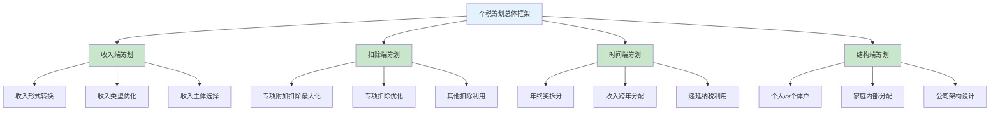
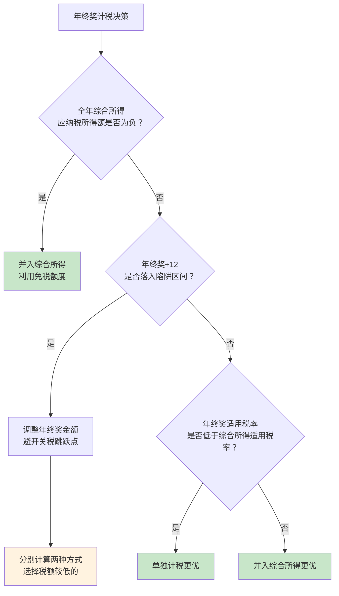

## 一、个人所得税合法避税策略

个人所得税是绝大多数工薪阶层和自由职业者接触最多的税种，也是税务筹划空间最大的领域之一。合法避税的核心逻辑不是"少交税"，而是在法律框架内，通过合理安排收入结构、充分利用扣除政策、选择最优计税方式，实现"该交的一分不少，不该交的一分不多"。

> **关键认知**：税务筹划≠逃税。逃税是隐瞒收入、虚列扣除，属于违法犯罪行为；税务筹划是在法律允许范围内，对经济活动进行事先规划和安排，使税负最优化。二者的本质区别在于"合法性"。

### 1.1 个税筹划总体框架

个人所得税的筹划可以从四个维度展开，每个维度对应不同的策略层次：



**四个维度的关系**：

| 维度 | 难度 | 效果 | 适用人群 |
|------|------|------|----------|
| 扣除端筹划 | ★☆☆ | ★★☆ | 所有纳税人 |
| 时间端筹划 | ★★☆ | ★★★ | 有年终奖/股权激励者 |
| 收入端筹划 | ★★★ | ★★★ | 有多元收入来源者 |
| 结构端筹划 | ★★★★ | ★★★★★ | 高收入者/企业主 |

### 1.2 扣除端筹划：把每一分扣除都用足

扣除端筹划是最基础、最安全、最容易操作的策略，适用所有纳税人。

#### 1.2.1 专项附加扣除的深度利用

专项附加扣除是2019年个税改革的最大红利，但大量纳税人并未充分利用。以下是七项扣除的完整攻略：

| 扣除项目 | 扣除标准 | 条件 | 常见遗漏 |
|----------|----------|------|----------|
| 子女教育 | 2000元/月/子女 | 满3岁至博士毕业 | 民办学校、国际学校同样适用；境外学历需教育部认证 |
| 继续教育 | 400元/月 或 3600元/年 | 学历教育或职业资格 | 取得证书当年扣除，需在《国家职业资格目录》内 |
| 大病医疗 | 最高8万元/年 | 自付超过15,000元部分 | 医保目录范围内自付部分，不含自费药；可由配偶扣除 |
| 住房贷款利息 | 1,000元/月 | 首套房贷，最长240个月 | 首套认定以贷款合同为准；婚前各自购房可选一套扣除 |
| 住房租金 | 800-1,500元/月 | 根据城市级别 | 与房贷利息二选一；工作城市无房才可扣除 |
| 赡养老人 | 3,000元/月 | 父母年满60岁 | 非独生子女每人最多1,500元/月；祖父母/外祖父母不算 |
| 3岁以下婴幼儿照护 | 2,000元/月/婴幼儿 | 3岁以下 | 2022年新增，很多人不知道；出生当月即可扣除 |

**核心技巧：夫妻间的扣除分配优化**

个税采用累进税率，这意味着让收入高、税率高的一方多扣除，家庭整体节税效果最大。

**案例对比**：

丈夫月薪40,000元（适用25%税率），妻子月薪15,000元（适用10%税率），育有一名5岁子女。

| 分配方式 | 丈夫扣除 | 妻子扣除 | 家庭年度节税 |
|----------|----------|----------|--------------|
| 方式一：各50% | 1,000元/月 | 1,000元/月 | 1,000×12×25% + 1,000×12×10% = 4,200元 |
| 方式二：丈夫100% | 2,000元/月 | 0元 | 2,000×12×25% = 6,000元 |
| 方式三：妻子100% | 0元 | 2,000元/月 | 2,000×12×10% = 2,400元 |

**结论**：方式二（丈夫全额扣除）比方式三（妻子全额扣除）每年多省3,600元。即使只有一名子女，合理分配就能产生显著差异。如果家庭有多个子女，差异会进一步放大。

**实操建议**：每年年初在"个人所得税"APP中重新确认扣除分配方案。当夫妻收入结构发生变化（如加薪、跳槽、离职）时，及时调整分配比例。

#### 1.2.2 专项扣除的隐性优化空间

专项扣除（五险一金）看似固定，实则存在优化空间：

- **住房公积金**：缴纳比例在5%-12%之间，企业有一定自主权。公积金缴纳基数和比例越高，税前扣除越多，且公积金账户中的资金归个人所有。部分企业允许员工在法定范围内申请提高公积金比例，相当于变相减税。
- **企业年金**：企业年金个人缴费部分不超过本人缴费工资计税基数4%的标准，可以从当期应纳税所得额中扣除。如果公司提供企业年金计划，积极参与可以增加扣除。

#### 1.2.3 其他可扣除项目

除了专项扣除和专项附加扣除外，还有几项容易被忽视的扣除：

- **个人养老金**：每年最高12,000元（每月1,000元），在综合所得或经营所得中据实扣除。这是2022年底推出的政策，通过商业银行开户缴存。
- **商业健康保险**：购买符合规定的商业健康保险产品，每年最高2,400元（每月200元）可税前扣除。需取得税优识别码。
- **税延养老保险**：每月不超过1,000元可税前扣除（目前仅在试点地区）。
- **企业年金**：个人缴费部分不超过工资4%可扣除。
- **公益捐赠**：通过合格机构捐赠，不超过应纳税所得额30%部分可扣除（详见1.5节）。

### 1.3 时间端筹划：年终奖的精算艺术

年终奖计税是个税筹划中效果最显著、最容易操作的领域，但也是最容易踩坑的领域。

#### 1.3.1 年终奖的两种计税方式

| 方式 | 计算方法 | 适用场景 |
|------|----------|----------|
| 单独计税 | 年终奖÷12确定税率，单独计算 | 年终奖相对较低，综合所得较高 |
| 并入综合所得 | 年终奖计入全年收入一起算税 | 年终奖较高，综合所得较低（如年中有失业期） |

**单独计税的计算公式**：

```text
应纳税额 = 年终奖 × 适用税率 - 速算扣除数
适用税率 = 查找（年终奖÷12）对应的月度税率表
```

**年终奖单独计税月度税率表**：

| 每月应纳税所得额（年终奖÷12） | 税率 | 速算扣除数 |
|-------------------------------|------|-----------|
| 不超过3,000元 | 3% | 0 |
| 3,000-12,000元 | 10% | 210 |
| 12,000-25,000元 | 20% | 1,410 |
| 25,000-35,000元 | 25% | 2,660 |
| 35,000-55,000元 | 30% | 4,410 |
| 55,000-80,000元 | 35% | 7,160 |
| 超过80,000元 | 45% | 15,160 |

#### 1.3.2 年终奖的六大"陷阱区间"

年终奖存在"多发一块钱，少拿好几千"的陷阱。这是由于税率跳档导致的：

| 陷阱临界点 | 多发1元后的税额变化 | 实际少拿金额 |
|-----------|-------------------|-------------|
| 36,000元 → 36,001元 | 税额从1,080元跳到3,390元 | 少拿2,309元 |
| 144,000元 → 144,001元 | 税额从14,190元跳到27,390元 | 少拿13,199元 |
| 300,000元 → 300,001元 | 税额从29,590元跳到54,590元 | 少拿24,999元 |
| 420,000元 → 420,001元 | 税额从41,790元跳到79,590元 | 少拿37,799元 |
| 660,000元 → 660,001元 | 税额从95,590元跳到141,590元 | 少拿45,999元 |
| 960,000元 → 960,001元 | 税额从160,590元跳到256,590元 | 少拿95,999元 |

**解决方案**：

1. **卡位发放**：年终奖定在临界点整数（如36,000、144,000等），超出部分并入月薪或单独发放。
2. **拆分发放**：如果年终奖落在陷阱区间内，将其拆分为两部分——一部分按临界点发放，超出部分并入当月工资。
3. **提前沟通**：在公司制定年终奖方案前，主动与HR或财务沟通，说明陷阱区间的数学原理。

**拆分示例**：

某员工年终奖50,000元，落在36,001-144,000区间（税率10%）。

| 方案 | 年终奖发放 | 适用税率 | 税额 | 税后到手 |
|------|-----------|---------|------|----------|
| 不拆分 | 50,000元 | 10% | 4,790元 | 45,210元 |
| 拆分：36,000+14,000（并入工资） | 36,000元 | 3% | 1,080元 | 34,920元 |
| 14,000元并入当月工资 | 按工资税率 | 视工资而定 | — | — |

如果该员工月薪适用20%税率，14,000元并入工资的税额为14,000×20%=2,800元，总税额1,080+2,800=3,880元，比不拆分省910元。如果该员工月薪适用10%税率，拆分反而可能更贵，需要具体计算。

#### 1.3.3 单独计税vs并入综合所得的决策模型

如何判断年终奖应该单独计税还是并入综合所得？以下决策框架可以参考：



**判断口诀**：年终奖税率低于综合所得税率时，单独计税；年终奖税率高于综合所得税率时，并入综合所得。如果综合所得扣除后余额为负或为零（如年中离职、失业），年终奖一定并入综合所得更优。

#### 1.3.4 年终奖筹划的高级技巧

**技巧一：多次发放奖金**

如果公司允许，将年度奖金拆分为季度奖+年终奖。每季度发放的奖金单独计税，可以降低单次奖金的适用税率。但需注意，一年内对同一笔年终奖只能使用一次单独计税。

**技巧二：利用低税档空间**

计算当年综合所得应纳税所得额，找到当前税率档位的剩余空间。如果综合所得适用20%税率、但离25%税率档还有空间，可以将部分年终奖并入综合所得，刚好填满20%档位，而剩余年终奖单独计税时适用更低税率。

**技巧三：跨年调节**

如果公司支持灵活选择奖金发放时间，可以在12月和次年1月之间调整发放比例，将收入在两个纳税年度间合理分配，降低单年度的适用税率。

### 1.4 收入端筹划：重构你的收入结构

收入端筹划是效果最显著但操作难度最大的策略，通常需要在收入获取之前进行规划。

#### 1.4.1 工资薪金的结构优化

企业发放工资时，不同项目的税务处理不同。合理设计薪酬结构，可以在不增加企业成本的前提下提高员工税后收入。

| 项目 | 是否征税 | 说明 |
|------|----------|------|
| 基本工资 | 征税 | 税率按累计预扣法 |
| 差旅费津贴/误餐补助 | 不征税 | 需有合理标准和实际发生 |
| 通讯补贴 | 部分不征税 | 实报实销部分不征税 |
| 交通补贴 | 部分不征税 | 实报实销或公务用车改革补贴 |
| 住房补贴 | 征税 | 现金形式的住房补贴需缴税 |
| 高温津贴 | 征税 | 虽然叫"津贴"但仍需缴税 |
| 独生子女补贴 | 不征税 | 按当地标准 |
| 托儿补助费 | 不征税 | 按当地标准 |
| 差旅费包干 | 不征税 | 需有内部管理制度和标准 |

**实操建议**：
- 与HR协商，将部分工资以"差旅费津贴""误餐补助"等免税项目发放，但必须有真实业务背景和内部制度支撑。
- 将现金补贴改为实报实销（如通讯费、交通费），报销部分不计入应税收入。
- 注意：这些优化需要企业配合，个人无法单方面操作。

#### 1.4.2 劳务报酬的筹划

劳务报酬预扣税率高达20%-40%（单次超过20,000元的部分），但年度汇算时并入综合所得，可能享受退税。

**关键策略**：

1. **关注预扣税差**：劳务报酬预扣20%-40%，但综合所得最高45%、最低3%。如果综合所得适用税率低于20%，汇算时会退税。反之，如果综合所得适用30%以上税率，汇算时需要补税。
2. **拆分大额劳务**：单笔劳务报酬超过50,000元时，预扣税率为40%。如果可能，将大额劳务拆分到不同月份结算，降低单次预扣率。
3. **费用扣除选择**：劳务报酬收入不超过4,000元的，扣除800元费用；超过4,000元的，扣除20%费用。可以选择查账征收，扣除实际发生的成本费用（需有完税凭证和成本发票）。

#### 1.4.3 经营所得的筹划路径

经营所得（个体工商户、个人独资企业、合伙企业）的税率为5%-35%，且可以扣除成本费用，筹划空间大于工资薪金。

| 应纳税所得额 | 税率 | 速算扣除数 |
|-------------|------|-----------|
| 不超过30,000元 | 5% | 0 |
| 30,000-90,000元 | 10% | 1,500 |
| 90,000-300,000元 | 20% | 10,500 |
| 300,000-500,000元 | 30% | 40,500 |
| 超过500,000元 | 35% | 65,500 |

**经营所得筹划的核心手段**：

1. **合理列支成本费用**：与经营相关的房租、水电、设备、原材料、员工工资、差旅费等均可税前列支。
2. **核定征收vs查账征收**：部分地区对小规模个体户实行核定征收，按固定利润率计税。核定征收的实际税负通常远低于查账征收。但近年来核定征收政策在收紧，需关注当地最新政策。
3. **组织形式选择**：收入较高时，注册为个体工商户/个人独资企业可能比按工资薪金缴税更省。但需注意：必须有真实业务背景，不能虚构交易。

**对比测算**：

年收入600,000元（假设无专项扣除），不同身份的税负对比：

| 收入类型 | 应纳税所得额 | 适用税率 | 应纳税额 | 实际税负率 |
|----------|-------------|---------|----------|-----------|
| 工资薪金 | 600,000-60,000=540,000 | 30% | 109,080 | 18.2% |
| 经营所得（查账，假设扣除60%成本） | 600,000×40%=240,000 | 20% | 37,500 | 6.25% |
| 经营所得（核定，利润率10%） | 600,000×10%=60,000 | 10% | 4,500 | 0.75% |

> **警告**：此对比仅为说明税制差异。将工资薪金"转化"为经营所得需要真实业务支撑，虚构交易属于违法行为，会被税务机关追缴税款并处罚。

### 1.5 公益捐赠的税务筹划

公益捐赠不仅可以回馈社会，还能享受税前扣除优惠，是一种"既做好事又省税"的策略。

#### 1.5.1 扣除规则详解

| 规则 | 说明 |
|------|------|
| 扣除比例 | 一般捐赠：应纳税所得额的30%以内 |
| 全额扣除 | 向特定机构（如红十字会、扶贫基金、教育基金）捐赠可100%扣除 |
| 扣除顺序 | 先扣基本减除、专项扣除、专项附加扣除，最后扣捐赠 |
| 扣除凭证 | 必须取得财政部或税务总局印制的公益事业捐赠票据 |
| 受赠主体 | 必须是具有公益性捐赠税前扣除资格的社会组织 |
| 捐赠对象 | 直接向个人捐赠不能税前扣除 |

#### 1.5.2 捐赠抵税的精算

**案例**：张先生年应纳税所得额500,000元，适用30%税率，计划捐赠60,000元。

| 项目 | 计算过程 |
|------|----------|
| 捐赠扣除限额 | 500,000 × 30% = 150,000元 |
| 实际捐赠 | 60,000元 < 150,000元，可全额扣除 |
| 扣除后应纳税所得额 | 500,000 - 60,000 = 440,000元 |
| 节税金额 | 60,000 × 30% = 18,000元 |
| 实际捐赠净成本 | 60,000 - 18,000 = 42,000元 |

也就是说，捐赠60,000元实际只花了42,000元，国家帮你"补贴"了30%。

**优化技巧**：

1. **集中在高收入年度捐赠**：收入高的年份适用税率也高，同样金额的捐赠节税效果更大。
2. **避免捐赠金额超过扣除限额**：超出30%限额的部分不能扣除，也不能结转下年。
3. **利用全额扣除政策**：向特定机构捐赠可100%扣除，如中国红十字基金会、中华慈善总会、中国教育发展基金会等。
4. **选择合格受赠机构**：在"信用中国"网站或省级财政部门网站查询机构的公益性捐赠税前扣除资格。

### 1.6 股权激励的税务优化

股权激励是科技公司和上市公司员工的重要收入来源，税务处理较为复杂。

#### 1.6.1 三种股权激励的税务对比

| 类型 | 纳税时点 | 计税方式 | 税率 |
|------|----------|----------|------|
| 股票期权 | 行权时 | 工资薪金所得 | 3%-45%累进 |
| 限制性股票 | 解禁时 | 工资薪金所得 | 3%-45%累进 |
| 股票增值权 | 行权时 | 工资薪金所得 | 3%-45%累进 |

**上市公司特殊政策**：上市公司股权激励的收入不并入综合所得，全额单独适用综合所得税率表计算。这意味着不能享受基本减除费用（6万元）和各项扣除。

**非上市公司特殊政策**：符合条件的非上市公司股权激励，可递延至股权转让时按"财产转让所得"20%税率纳税，且可扣除行权成本。

#### 1.6.2 股权激励的筹划策略

**策略一：分批行权**

如果拥有多笔股票期权或限制性股票，避免集中在同一年度行权。将行权分散到不同纳税年度，可以降低单年度的适用税率。

**案例**：李先生持有100,000股期权，行权价10元/股，当前市价50元/股。

| 方案 | 行权安排 | 行权收益 | 适用税率 | 税额 |
|------|----------|----------|----------|------|
| 一次性行权 | 100,000股一次性行权 | 4,000,000元 | 45% | 约1,628,080元 |
| 分两年行权 | 每年50,000股 | 每年2,000,000元 | 35% | 每年约604,080元，合计1,208,160元 |
| 分三年行权 | 每年约33,333股 | 每年约1,333,333元 | 25% | 每年约282,413元，合计约847,240元 |

分三年行权比一次性行权节省约780,000元。

**策略二：选择行权时机**

股价低迷时行权，行权收益较低，适用税率也较低。如果预期股价会上涨，可以先少量行权锁定低税率，待股价上涨后再行权时，增值部分已在较低税率区间内。

**策略三：利用非上市公司递延纳税**

如果是非上市公司，符合条件的股权激励可以递延至股权转让时纳税。这不仅可以推迟纳税时间（资金时间价值），还可能享受20%的财产转让所得税率，远低于工资薪金的最高45%税率。

### 1.7 结构端筹划：改变收入获取方式

结构端筹划是最高阶的个税筹划手段，通过改变收入获取的法律关系来优化税负。

#### 1.7.1 从"打工"到"合作"的转变

对于有多元收入来源的高收入者，将部分收入从"工资薪金"转化为"经营所得"可以大幅降低税负。

**前提条件**：
- 必须有真实的业务关系转变（如从全职员工转为外包顾问）
- 需要签订服务合同、开具发票、建立独立的业务关系
- 不能是虚假的合同安排，税务机关会审查实质

**适用场景**：
- 自由职业者（设计师、程序员、咨询顾问）
- 有多份兼职收入的高薪人士
- 从公司离职后继续提供顾问服务

#### 1.7.2 家庭内部的收入分配

如果家庭成员之间存在收入差异，可以通过合理的资产配置和收入安排优化家庭整体税负。

**常见方式**：
- 夫妻间房产出租收入的分配
- 家庭合伙企业的利润分配
- 父母代持资产的收益分配

> **注意**：2019年个税改革后，个人所得税以个人为纳税单位，不存在家庭合并申报。因此家庭内部的筹划主要通过资产持有结构和收入分配协议实现。

### 1.8 常见误区与避坑指南

#### 误区一："找发票报销=避税"

**真相**：找不相关的发票报销来替代工资，属于虚列支出，是违法行为。税务机关可以通过大数据比对发现异常报销行为。企业也有连带责任。

**正确做法**：真实的业务支出凭合规票据报销。通讯费、交通费等与工作相关的支出，按公司制度实报实销，这是合法的。

#### 误区二："多发工资不如多发福利"

**真相**：以现金形式发放的福利（如过节费、购物卡）仍然需要缴纳个人所得税。只有特定的免税福利项目（如差旅费津贴、误餐补助）才不征税。

**正确做法**：了解哪些福利免税（见1.4.1节表格），合理设计薪酬结构，而非简单地用"福利"替代"工资"。

#### 误区三："个人养老金肯定划算"

**真相**：个人养老金的税前扣除确实能省税，但取出时需按3%缴税。对于综合所得适用税率低于3%的人（年应纳税所得额不超过36,000元），存入个人养老金并不划算。此外，个人养老金有流动性限制（退休后才能取出），需要考虑资金的时间价值。

**正确做法**：综合所得适用税率在10%及以上的人，存入个人养老金才有明确的税收优势。

#### 误区四："公益捐赠越多越省税"

**真相**：公益捐赠的扣除上限是应纳税所得额的30%，超出部分不能扣除，也不能结转。这意味着捐赠超过收入30%的部分，没有税收优惠。

**正确做法**：如果希望大额捐赠，可以分多年进行，每年控制在30%限额内。或者选择向可全额扣除的特定机构捐赠。

#### 误区五："年终奖单独计税一定更优"

**真相**：并非所有情况下单独计税都更优。如果综合所得应纳税所得额为负数（扣除项目多于收入），年终奖并入综合所得可以利用未用完的扣除额度，反而更省税。

**正确做法**：每年汇算清缴时，分别计算两种方式的税额，选择较低的。个税APP在汇算时会自动提供两种计算结果供选择。

### 1.9 筹划检查清单

以下是个人所得税筹划的年度检查清单，建议每年年初（1-2月）和汇算清缴前（3-5月）各检查一次：

**年初规划（1-2月）**：

- [ ] 确认当年专项附加扣除是否已全部申报
- [ ] 检查夫妻间的扣除分配是否最优
- [ ] 确认子女教育扣除是否需要调整（子女满3岁、毕业等）
- [ ] 确认赡养老人扣除（父母是否满60岁）
- [ ] 确认住房贷款利息或租金扣除（是否还清贷款、是否换房）
- [ ] 开通个人养老金账户并确认当年缴存计划
- [ ] 确认是否有符合条件的继续教育扣除（取得新证书）

**汇算清缴前（3-5月）**：

- [ ] 核实全年收入是否准确（工资、劳务、稿酬等）
- [ ] 检查年终奖计税方式（单独计税vs并入综合所得分别计算）
- [ ] 确认是否有公益捐赠需要扣除
- [ ] 检查大病医疗扣除（需在年度汇算时申报，日常预扣不能扣）
- [ ] 确认商业健康保险和税延养老保险的扣除
- [ ] 检查股权激励收入的计税方式
- [ ] 确认是否有退税可申请

### 1.10 各收入层级的筹划优先级

不同收入水平的纳税人，筹划重点不同：

| 年收入范围 | 筹划优先级 | 预期节税效果 |
|-----------|-----------|-------------|
| 10万以下 | 专项附加扣除申报 > 个人养老金 | 年省1,000-3,000元 |
| 10-30万 | 扣除优化 + 年终奖计税方式 | 年省3,000-10,000元 |
| 30-100万 | 年终奖精算 + 薪酬结构优化 + 捐赠抵税 | 年省10,000-50,000元 |
| 100万以上 | 收入结构重塑 + 股权激励规划 + 经营所得转化 | 年省50,000-500,000元 |

> **重要提醒**：所有筹划策略必须在合法合规的前提下进行。税务机关拥有强大的大数据比对能力，任何虚假申报、虚构交易都会被发现。合法避税的核心是"充分利用政策"，而非"钻法律空子"。随着金税四期系统的全面上线，个人的银行流水、社保缴纳、房产交易等信息都在税务机关的监控范围内。合规是第一原则，节税是第二目标。

***
