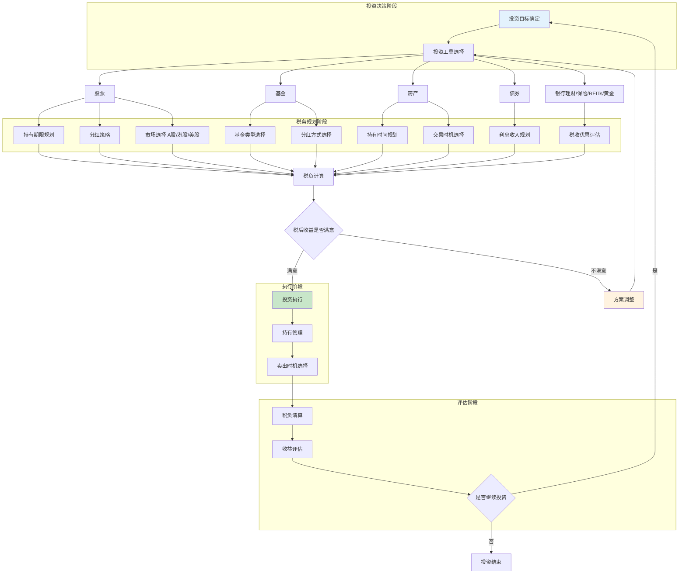
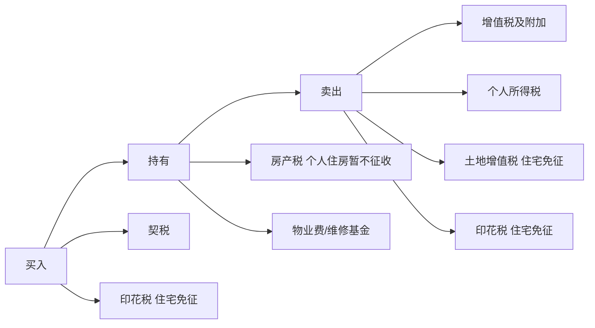
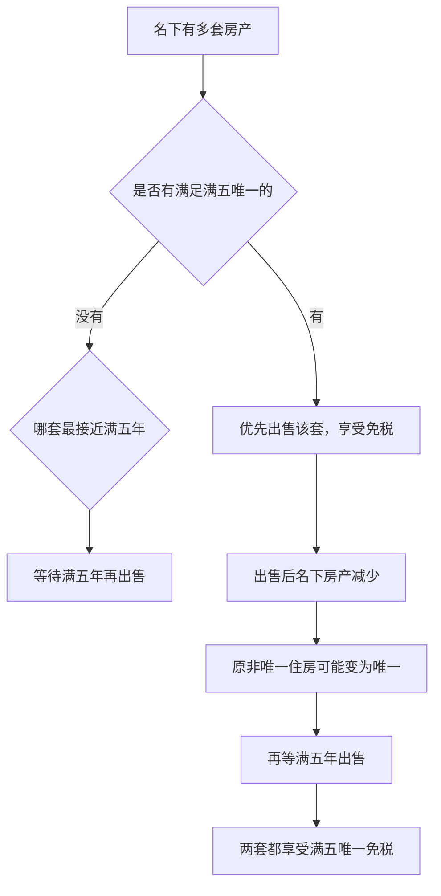
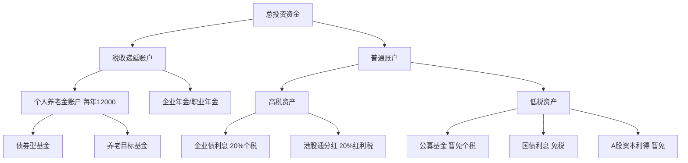

## 二、投资税务优化

投资收益是个人财富增长的核心引擎，但"赚了多少钱"和"到手多少钱"之间往往隔着一道税务鸿沟。同样年化收益8%的两笔投资，税务处理不同，税后收益可能相差30%以上。本节系统梳理各类投资工具的税务规则，教你从税后收益最大化的角度构建投资组合。

### 2.0 投资税务优化决策流程

投资税务优化需要在收益和税负之间找到平衡点，以下是系统化的决策流程：

**优化的四个核心维度**：

| 维度 | 说明 | 关键动作 |
|------|------|----------|
| 持有期限 | 长期持有在多数资产类别中享受税收优惠 | 股票超1年股息免税，房产满2年免增值税 |
| 投资工具 | 不同工具税率差异巨大 | 公募基金免个税，国债利息免个税 |
| 交易时机 | 买卖时间点影响税负 | 年底前实现亏损可抵扣盈利 |
| 资产配置 | 组合层面优化税后收益 | 高税资产放税收递延账户 |

下面逐类展开。

---

### 2.1 股票投资税务优化

#### 2.1.1 A股个人投资者的税负全景

A股个人投资者涉及的税种主要有三个：

| 税种 | 税率 | 征收时点 | 备注 |
|------|------|----------|------|
| 印花税 | 0.05%（单边，卖出时征收） | 卖出时 | 2023年8月28日起减半征收 |
| 股息红利个人所得税 | 0% / 10% / 20% | 持股到期卖出时 | 与持有期限挂钩 |
| 资本利得税 | **暂免** | — | 这是A股独有的重大优惠 |

**关键认知：A股个人投资者的资本利得暂免个人所得税。** 这意味着你低买高卖赚的差价不用交个税。这不是"逃税"，而是政策给予的合法优惠，是A股投资相对于房产、美股等资产的重要税收优势。

#### 2.1.2 股息红利税的三档设计

股息红利的个税与持有期限直接挂钩，这是一个典型的"用税收引导长期投资"的制度设计：

| 持有期限 | 计入应税所得比例 | 实际税率 | 策略含义 |
|----------|-----------------|----------|----------|
| 持股 > 1年 | 0%（免税） | 0% | 长期持有高分红股最优 |
| 1个月 < 持股 ≤ 1年 | 50% | 10% | 中等持有期，税负适中 |
| 持股 ≤ 1个月 | 100% | 20% | 短线交易分红股，税负最重 |

**计算示例**：

持有某银行股获得分红10,000元：
- 持有超过1年：税额 = 0元，到手10,000元
- 持有6个月：税额 = 10,000 × 50% × 20% = 1,000元，到手9,000元
- 持有20天：税额 = 10,000 × 100% × 20% = 2,000元，到手8,000元

**持股期限的计算规则**：
- 持股期限从买入日算起，到卖出日截止
- 多次买入同一只股票时，按"先进先出"原则计算
- 例如：1月买入1000股，6月又买入1000股，次年2月卖出500股——这500股按1月那笔计算，持有超过1年，享受免税

#### 2.1.3 高分红股票的税务优化策略

对于偏好稳定分红的投资者（如退休人群），策略核心是"长持高分红股"：

**第一步：筛选高分红标的**
- 股息率 > 4%的蓝筹股（银行、电力、高速公路、煤炭等行业常见）
- 关注分红的持续性和稳定性，而非单次分红金额
- 优先选择连续3年以上分红且分红比例稳定的企业

**第二步：确保持有期限超过1年**
- 在除权除息日前买入并确认持股已满1年
- 如果持股不满1年就到分红日，考虑是否卖出等分红后再买回（需要计算税负差异）

**第三步：分红再投资**
- 到手的免税分红可以再买入高分红股，形成复利循环
- 长期来看，免税分红再投资的复合效果非常可观

**实战案例**：
张先生持有工商银行10万股，成本价5元/股，持有已超过3年。每年分红约0.3元/股：
- 年分红收入：100,000 × 0.3 = 30,000元
- 因持有超过1年，股息红利免税
- 税后到手：30,000元
- 对比：如果持有不满1个月就卖出，需交税 30,000 × 20% = 6,000元

#### 2.1.4 港股通与美股的税务差异

如果投资范围不限于A股，税务差异更为显著：

| 项目 | A股 | 港股通 | 美股 |
|------|-----|--------|------|
| 资本利得税 | 暂免 | 暂免 | 需申报（中国税务居民需向中国缴纳） |
| 股息红利税 | 0%/10%/20% | **统一20%**（内地个人投资者通过港股通） | 需扣缴10%美国预提税（中美税收协定） |
| 印花税 | 0.05%卖出 | 0.13%双边 | 无 |

**港股通红利税的特殊性**：
通过港股通投资港股，股息红利按20%税率缴纳个人所得税，由中登公司代扣代缴。这里没有A股的持有期限优惠——无论持有多久，港股通分红一律扣20%。这是港股投资的重要隐性成本。

**美股的税务处理**：
- 美国会对非居民的股息预扣30%（有税收协定的为10%）
- 中国税务居民还需就全球收入向中国申报，但可以抵免已缴的外国税款
- 实操中，多数个人投资者自行申报的执行度较低，但从合规角度应如实申报

---

### 2.2 基金投资税务优势

#### 2.2.1 公募基金的税收"超国民待遇"

公募基金在个人所得税方面享受的优惠，堪称所有投资工具中最优厚的：

**核心优惠（法规依据：财税〔2002〕128号、财税〔2004〕78号）**：
- 个人买卖公募开放式基金的差价收入：**暂不征收个人所得税**
- 个人从基金分配中取得的收入（分红）：**暂不征收个人所得税**
- 个人买卖公募基金：**暂不征收印花税**

这意味着，公募基金是个人投资者税务效率最高的标准化投资工具之一。

#### 2.2.2 基金 vs 直接持股的税负对比

这个对比能直观说明基金的税务优势：

| 对比维度 | 直接持有股票 | 通过公募基金持有 |
|----------|-------------|----------------|
| 资本利得税 | A股暂免（同） | 暂免（同） |
| 股息红利税 | 持有≤1年需交税 | **暂不征收** |
| 印花税 | 卖出0.05% | **暂不征收** |
| 基金内部调仓 | — | 不产生投资者层面的税 |
| 分红方式 | 仅现金 | 可选现金分红或红利再投资 |

**关键优势解析**：

1. **基金分红免税**：基金持有的股票分红后，基金再分配给持有人，个人投资者无需缴税。而直接持有同一只股票，持股不满1年需缴10%-20%红利税。
2. **免印花税**：频繁调仓的成本更低。假设年换手率500%，直接持股仅印花税成本就达0.05% × 500% = 2.5%，而基金为零。
3. **内部调仓不产生税负**：基金经理调整持仓组合时，投资者层面不触发任何税务事件。

#### 2.2.3 不同类型基金的税务特征

| 基金类型 | 买卖差价个税 | 分红个税 | 印花税 | 综合税负 |
|----------|------------|----------|--------|----------|
| 公募开放式基金 | 暂免 | 暂免 | 暂免 | 最低 |
| 公募ETF | 暂免 | 暂免 | 暂免 | 最低 |
| 公募LOF | 暂免 | 暂免 | 暂免 | 最低 |
| 私募基金 | 需按"利息、股息、红利所得"20%缴税 | 需缴税 | 视底层资产 | 较高 |
| 券商资管计划 | 视产品类型而定 | 视分配方式 | 视底层资产 | 中等 |

**注意**：私募基金的税务优惠远不如公募。合伙型私募基金穿透至个人投资者，按经营所得5%-35%或财产转让所得20%缴税。这是选择基金类型时需要考虑的重要因素。

#### 2.2.4 基金分红方式的选择策略

基金分红有两种方式，税务影响不同：

**现金分红**：
- 暂不征收个税
- 落袋为安，但打断了复利
- 适合需要定期现金流的投资者

**红利再投资**：
- 暂不征收个税
- 分红自动再买入基金份额，享受复利增长
- 适合长期投资者

**策略建议**：如果不需要定期取现，优先选择红利再投资。基金分红本身不交税，但分红后再买入相当于用免税的收入进行再投资，复利效果更优。

---

### 2.3 债券投资税务优化

#### 2.3.1 不同债券品种的税务规则

债券的利息收入需要缴纳个人所得税，但不同品种差异巨大：

| 债券类型 | 利息收入税务 | 资本利得税务 | 适用场景 |
|----------|-------------|-------------|----------|
| 国债 | **免税** | 暂免 | 保守型投资者首选 |
| 地方政府债 | **免税** | 暂免 | 收益略高于国债 |
| 金融债（政策性银行债） | 需缴20%个税 | 暂免 | 银行柜台购买 |
| 企业债/公司债 | 需缴20%个税 | 暂免 | 收益较高但税负也高 |
| 可转债 | 利息需缴20%个税 | 暂免 | 兼具债性和股性 |

**国债的免税优势**：

假设年化收益率3%，投资100万元：
- 国债利息：100万 × 3% = 30,000元，**免税**，到手30,000元
- 企业债利息：100万 × 4% = 40,000元，交税 40,000 × 20% = 8,000元，到手32,000元
- 看似企业债收益更高，但考虑税后收益和风险后差距大幅缩小

#### 2.3.2 可转债的税务特殊性

可转债（可转换公司债券）的税务处理较为特殊：

**持有阶段**：
- 按期收到的利息按20%缴纳个税（由发行方代扣代缴）
- 利息通常很低（第一年0.2%-0.4%），税负微乎其微

**转股阶段**：
- 可转债转换为股票，**不产生应税事件**
- 转股后的持股成本 = 转股时可转债的账面价值
- 转股后再卖出股票，按A股资本利得规则（暂免个税）

**卖出阶段**：
- 直接卖出可转债的差价收入，**暂不征收个人所得税**
- 这使得可转债成为税务效率较高的投资品种

**可转债 vs 直接持股的税务对比**：
可转债的"下有保底（债券属性）、上不封顶（股票属性）"特征，加上卖出差价暂免个税，使其在税务效率上优于直接持有股票（需承担股息红利税）。

#### 2.3.3 债券投资的税务优化策略

**策略一：用国债替代银行定期存款**
- 国债利息免税，银行存款利息虽然目前也暂免个税（实际执行中暂不征收），但国债收益率通常高于同期定期存款
- 国债的安全性等同于银行存款（国家信用背书）

**策略二：高税负债券放入税收递延账户**
- 如果通过个人养老金账户（每年12,000元额度）购买债券型基金，收益在领取时才缴税（按3%单独计税）
- 适用于预期退休后税率低于当前税率的投资者

**策略三：关注债券基金而非直接持有债券**
- 通过公募债券基金间接持有各类债券，分红和买卖差价均暂免个税
- 比直接持有企业债更省税

---

### 2.4 房产投资税务优化

房产交易涉及的税种最多、金额最大、规则最复杂，是税务筹划的"重灾区"。

#### 2.4.1 房产交易全流程税负图

#### 2.4.2 买入环节：契税优化

契税是买入房产时最大的税负：

| 情形 | 面积 ≤ 90㎡ | 面积 > 90㎡ |
|------|------------|------------|
| 首套房 | **1%** | 1.5% |
| 二套房 | **1%**（2024年新政） | **1%**（2024年新政） |
| 三套及以上 | 3% | 3% |

**2024年契税新政要点**：
- 2024年12月1日起，首套和二套房契税优惠面积标准从90㎡提高到**140㎡**
- 140㎡以下统一1%，140㎡以上首套1.5%、二套2%
- 北京、上海、广州、深圳也纳入二套房契税优惠范围

**优化策略**：
- 购房前确认"首套房"认定标准（各地政策可能不同，有的认房又认贷，有的只认房）
- 如有多套房产计划，先买大面积后买小面积可能更省契税
- 夫妻共同购房 vs 单方购房，影响后续"首套"资格

#### 2.4.3 持有环节：增值税与"满二唯一"

**增值税规则**：

| 持有时间 | 住房 | 非住房（商铺、写字楼等） |
|----------|------|------------------------|
| 不满2年 | 全额征收5%增值税 | 差额征收5%增值税 |
| 满2年 | **免征** | 差额征收5%增值税 |

**计算示例（不满2年出售）**：
出售一套购入价200万的住房，售价280万：
- 增值税 = 280万 ÷ (1+5%) × 5% = 13.33万
- 附加税 = 13.33万 × 12%（城建税7%+教育附加3%+地方教育附加2%）= 1.60万
- 合计增值税及附加 = 14.93万

**满2年后出售**：增值税及附加 = 0

**关键提示**：对于增值税，"满2年"以取得产权证或契税完税证明的时间为起算点。如果急需出售但不满2年，可以考虑等满2年后再交易，节省的税款可能非常可观。

#### 2.4.4 卖出环节："满五唯一"与个人所得税

**个人所得税的两种计算方式**：

| 方式 | 适用条件 | 税率 | 计算公式 |
|------|---------|------|----------|
| 核定征收 | 无法提供完整原值凭证 | 1%-2%（各地不同） | 售价 × 核定税率 |
| 查账征收 | 能提供完整原值和合理费用凭证 | 20% | (售价 - 原值 - 合理费用) × 20% |

**"满五唯一"免税政策**：
个人转让自用**5年以上**且是**家庭唯一**生活用房的所得，免征个人所得税。

这是房产投资中最有价值的税收优惠。以一套购入价200万、售价400万的房产为例：
- 查账征收：(400万 - 200万) × 20% = 40万
- "满五唯一"免税：0元
- **节省40万**

**税务筹划要点**：
- 如果名下有多套房产，规划出售顺序，确保每次出售时尽量满足"满五唯一"
- 先卖非唯一住房，等5年后再出售原唯一住房
- "家庭"范围包括夫妻双方及未成年子女

#### 2.4.5 房产投资的综合税负测算

**案例：一套房产从买入到卖出的全部税负**

买入价：200万元，面积120㎡，首套房，持有6年后以400万元出售。

| 环节 | 税种 | 金额 |
|------|------|------|
| 买入 | 契税（1.5%） | 3.0万 |
| 持有 | 房产税 | 0（个人住房暂免） |
| 卖出 | 增值税 | 0（满2年免征） |
| 卖出 | 个人所得税 | 0（满五唯一免征） |
| 卖出 | 印花税 | 0（住宅免征） |
| **合计** | | **3.0万** |

如果不满足"满五唯一"条件：
| 环节 | 税种 | 金额 |
|------|------|------|
| 卖出 | 个人所得税（核定1.5%） | 6.0万 |
| **合计** | | **9.0万** |

差额：6万元。这就是"满五唯一"的价值。

#### 2.4.6 多套房产的出售顺序优化

当名下有多套房产需要出售时，顺序很重要：

**核心思路**：通过合理安排出售顺序和时间间隔，让尽可能多的房产享受"满五唯一"免税。

---

### 2.5 其他投资工具的税务特征

#### 2.5.1 银行理财产品

| 产品类型 | 利息/收益个税 | 备注 |
|----------|-------------|------|
| 银行存款利息 | 暂免征收 | 虽然税法规定需缴税，但实际执行中暂免 |
| 银行理财（资管新规后） | 不代扣代缴，投资者自行申报 | 实践中多数人未申报 |
| 结构性存款 | 暂免征收 | 保本部分按存款处理 |

**重要提示**：资管新规后，银行理财产品净值化运作，从法律性质上属于资产管理产品，理论上收益应按20%缴纳个税，但实际执行中暂无金融机构代扣代缴。投资者应了解这一合规风险。

#### 2.5.2 保险产品的税务优惠

保险产品在税务方面有独特优势：

| 保险类型 | 保险赔付 | 万能账户收益 | 退保现金价值 |
|----------|---------|-------------|-------------|
| 人寿保险 | **免征个税** | 递延纳税 | 超过已交保费部分需缴税 |
| 健康险（重疾险等） | **免征个税** | — | — |
| 税优健康险 | 赔付免税 | 保费可税前扣除2,400元/年 | — |
| 税延养老保险 | 赔付免税 | 保费可税前扣除12,000元/年 | 领取时按3%缴税 |

**税延养老保险的节税效果**：

假设年收入50万（适用30%边际税率），每年缴纳12,000元税延养老险：
- 每年节税 = 12,000 × 30% = 3,600元
- 退休后领取时按3%缴税 = 12,000 × 3% = 360元
- 净节税 = 3,600 - 360 = 3,240元/年
- 如果距离退休30年，累计节税 = 3,240 × 30 = 97,200元（不考虑资金时间价值）

#### 2.5.3 黄金投资的税务处理

| 投资形式 | 买入 | 持有 | 卖出 |
|----------|------|------|------|
| 实物黄金（金条、金币） | 增值税13%（标准税率） | 无 | 财产转让所得20%个税 |
| 黄金ETF | 无 | 无 | 暂免个税（按基金处理） |
| 银行纸黄金 | 无 | 无 | 不代扣，理论上20% |
| 黄金期货 | 无 | 无 | 暂免个税（个人期货所得） |

**税务最优选择**：黄金ETF和黄金期货的税务效率远高于实物黄金。如果投资目的是配置黄金资产而非持有实物，优先选择黄金ETF。

#### 2.5.4 REITs（不动产投资信托基金）

中国公募REITs于2021年正式上市，税务规则如下：

- 个人投资者买卖公募REITs的差价所得：**暂不征收个人所得税**
- REITs分红：按"利息、股息、红利所得"20%缴纳个税
- 与直接投资房产相比，REITs省去了契税、增值税、个税等复杂税种

**REITs vs 直接持有房产的税务对比**：

| 对比项 | 直接持有房产 | 公募REITs |
|--------|-------------|----------|
| 买入税负 | 契税1%-3% | 无 |
| 持有税负 | 可能有房产税 | 分红按20%缴个税 |
| 卖出税负 | 增值税+个税+可能的土地增值税 | 暂免个税 |
| 流动性 | 极低 | 高（交易所上市交易） |
| 起投门槛 | 高 | 低（几百元起） |

对于想配置不动产资产但不想承担房产交易复杂税负的投资者，REITs是税收效率更高的替代方案。

---

### 2.6 投资亏损的税务价值——亏损抵扣策略

#### 2.6.1 中国税法下的亏损抵扣规则

与美国等成熟市场不同，中国的个人投资者在亏损抵扣方面的空间非常有限：

| 资产类别 | 亏损能否抵扣 | 规则说明 |
|----------|-------------|----------|
| A股股票 | **不能跨品种抵扣** | 股票亏损不能抵扣其他收入 |
| 企业债券 | 亏损可抵扣同类收益 | 同一平台内的债券转让损益可互抵 |
| 房产 | 亏损不可抵扣其他收入 | 但同一房产的亏损不能结转到下一年 |
| 期货 | 盈亏可互抵 | 同一品种不同月份合约的盈亏可互抵 |

**关键限制**：A股个人投资者的股票转让亏损，**不能**用来抵扣工资收入、利息收入或其他资本利得。A股资本利得免税的另一面是——亏损也无法抵税。

#### 2.6.2 美股投资的亏损抵扣

如果投资了美股，情况有所不同：

- 美国税法允许资本亏损抵扣资本利得，每年最多可额外抵扣$3,000普通收入
- 超额亏损可无限期结转至未来年度
- **Wash Sale Rule**（洗售规则）：卖出亏损证券后30天内买入"实质相同"的证券，亏损不可抵扣

**中国税务居民的处理**：
- 在中国申报全球所得时，股票亏损可以在同类所得中抵扣
- 但实操中，多数个人投资者并未就海外投资收益向中国申报

#### 2.6.3 实操中的亏损管理建议

尽管中国个人投资者的亏损抵扣空间有限，但仍有管理空间：

1. **企业债券和基金**：同一平台内的不同债券/基金盈亏可以互抵，年底前有意识地卖出亏损品种可以抵消同平台盈利
2. **期货投资**：充分利用期货的盈亏互抵规则，年底前平掉亏损仓位可减少当年应税所得
3. **房产交易**：如果年内有两套房产出售，一套盈利一套亏损，亏损不可抵消盈利，但可以在时间上错开到不同年度

---

### 2.7 组合层面的税务优化

#### 2.7.1 资产配置中的"税后收益"思维

很多投资者只看税前收益率，但真正决定财富增长的是税后收益。构建投资组合时应将税务效率纳入考量：

**核心原则：高税资产放税收递延账户，低税资产放普通账户。**

具体操作：
- **税收递延账户**（个人养老金、企业年金）中放：债券型基金、高分红股票基金
  - 理由：利息和分红在账户内不交税，取出时按3%缴税，远低于当前边际税率
- **普通账户**中放：公募股票基金、ETF、A股股票
  - 理由：本身暂免个税或免税，不需要占用递延账户额度

#### 2.7.2 家庭层面的投资税务优化

以家庭为单位进行投资税务规划，可以获得额外的优化空间：

**策略一：利用不同家庭成员的税率差异**
- 高收入一方持有的资产以长期免税品种为主（A股长期持有、国债、公募基金）
- 低收入一方持有的资产可以更灵活（短期交易、高分红股票）
- 但注意：家庭成员之间的资产转让可能涉及赠与税或过户费用

**策略二：专项附加扣除与投资收益的联动**
- 高收入一方多承担子女教育、赡养老人等专项附加扣除
- 让高收入一方的实际应税所得下降，从而适用更低税率
- 释放出来的资金可以用于免税品种投资

**策略三：代际传承中的税务规划**
- 房产继承：法定继承人继承房产免征契税和个税
- 股票继承：按继承时的市价作为新成本基础，之前的增值部分免税
- 这为长期财富传承提供了重要的税务优化空间

---

### 2.8 常见投资税务误区

| 误区 | 真相 | 后果 |
|------|------|------|
| "炒股赚的钱都要交税" | A股个人投资者的资本利得暂免个税 | 因恐惧税负而选择低收益产品 |
| "基金分红要交税" | 公募基金分红暂不征收个人所得税 | 选择分红前赎回，白白错过收益 |
| "房产满两年就免个税" | 满两年免的是增值税，个税需要"满五唯一" | 卖房时才发现要交大额个税 |
| "所有债券利息都免税" | 只有国债和地方政府债免税，企业债要交20%个税 | 高估了企业债的税后收益 |
| "亏了就不用交税" | 不同投资品种的亏损不能互相抵扣 | 未做税务规划就盲目交易 |
| "买房只要契税" | 不满2年还有增值税，不满五唯一还有个税 | 低估了持有成本 |
| "港股通和A股税一样" | 港股通分红一律20%个税，没有持有期优惠 | 买港股高分红股时忽略了额外税负 |

---

### 2.9 投资税务优化的年度检查清单

每年至少做一次投资税务健康检查，建议在第四季度进行：

- [ ] 检查当前持仓的持有期限，即将满1年的高分红股票考虑继续持有
- [ ] 盘点年内已实现的投资收益和亏损，评估税负
- [ ] 检查是否充分利用了个人养老金账户的12,000元/年额度
- [ ] 确认是否购买了税优健康险（年扣除2,400元）
- [ ] 评估房产持有状况，规划未来的出售时间和顺序
- [ ] 检查基金分红方式是否选择合理（长期持有选红利再投资）
- [ ] 如有港股通持仓，评估分红税负是否在预期范围内
- [ ] 期货投资者检查当年盈亏，合理安排平仓时机

---

### 2.10 进阶：高净值投资者的税务策略

#### 2.10.1 私募基金的税务考量

高净值投资者常通过私募基金投资，税务处理与公募截然不同：

**合伙型私募基金**：
- 穿透纳税：基金本身不纳税，收益穿透到合伙人
- 自然人合伙人按"经营所得"5%-35%累进税率缴税（部分地方政策）
- 或按"利息、股息、红利所得"20%缴税（取决于收益性质）

**契约型私募基金**：
- 从法律上类似公募基金
- 但个税优惠不明确，存在合规不确定性
- 部分机构会代扣20%个税

#### 2.10.2 家族信托的税务功能

家族信托在税务方面的核心价值不是"避税"，而是"递延"和"隔离"：
- 信托财产的收益在信托层面纳税，分配给受益人时不再重复纳税
- 可以实现代际传承中的税务递延
- 信托财产与委托人个人资产隔离，有助于风险防范

#### 2.10.3 股权架构的税务优化

持有上市公司股权或拟上市公司股权的投资者，需要关注：
- **限售股解禁后的减持**：按"财产转让所得"20%缴纳个税
- **通过合伙企业持股**：部分地区有核定征收优惠（但政策在收紧）
- **员工持股计划（ESOP）**：符合条件的可以递延至转让时纳税

---

投资税务优化的本质不是"少交税"，而是在合法合规的前提下，通过合理的工具选择、持有期限规划、时机把握和组合配置，最大化税后收益。理解每种投资工具的税务规则，是做出正确投资决策的基础能力。

***

