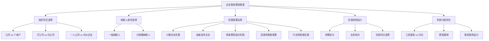
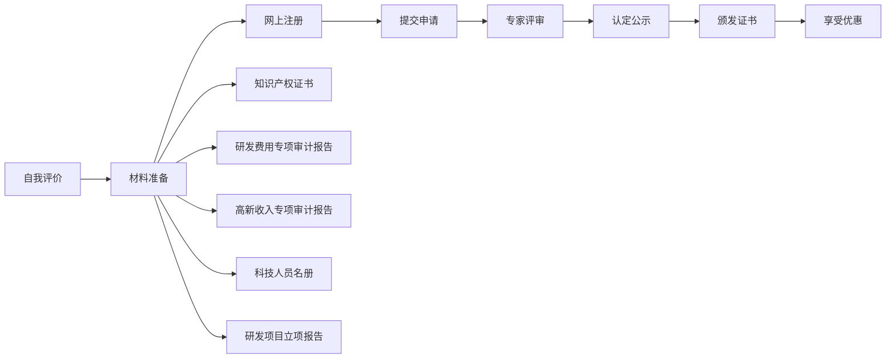

## 三、企业税务筹划

企业税务筹划是所有税务筹划中最复杂、收益也最大的领域。一个年利润 500 万的企业，通过合法筹划，综合税负可能从 40% 降至 15% 以下——每年节省超过 100 万元。本节从企业全生命周期出发，系统讲解从设立、经营、扩张到退出各阶段的税务筹划方法。

### 3.1 企业税务筹划的底层逻辑

#### 3.1.1 企业面临的税种全景

企业经营涉及的税种远比个人复杂。以下是主要税种及其税负占比：

| 税种 | 税率 | 计税基础 | 重要程度 |
|------|------|---------|---------|
| 企业所得税 | 25%（标准）/ 15%（高新）/ 5%（小微） | 应纳税所得额 | ★★★★★ |
| 增值税 | 13%/9%/6%/3% | 增值额 | ★★★★★ |
| 个人所得税（代扣代缴） | 3%-45% | 员工工资薪金 | ★★★★ |
| 分红个税 | 20% | 股东分红 | ★★★★ |
| 印花税 | 0.03%-0.1% | 合同金额 | ★★ |
| 城市维护建设税 | 7%/5%/1% | 增值税+消费税 | ★★ |
| 教育费附加 | 3%+2% | 增值税+消费税 | ★★ |
| 房产税 | 1.2%/12% | 房产原值/租金 | ★★★ |
| 城镇土地使用税 | 定额 | 占用面积 | ★★ |

**关键洞察**：企业从利润到股东个人口袋，至少要过三道关——企业所得税（25%）、增值税（隐含在价格中）、分红个税（20%）。如果不做任何筹划，100 万利润到股东手中可能只剩 50-60 万。

#### 3.1.2 企业税务筹划的三大原则

**原则一：业务真实性原则**

所有税务筹划必须以真实业务为基础。金税四期通过大数据比对发票流、资金流、货物流的"三流合一"，虚构交易无处遁形。

**原则二：事前规划原则**

税务筹划必须在交易发生之前完成。一旦业务完成、发票开具、税款缴纳，再想调整就为时已晚。例如：公司设立时选择一般纳税人还是小规模纳税人，直接决定了未来数年的增值税税负。

**原则三：成本效益原则**

筹划方案的节税收益必须大于实施成本。聘请税务顾问、设立子公司、变更业务模式都需要成本，不能为了省 5 万块税花 10 万块筹划费。



### 3.2 小微企业税收优惠——最直接的节税利器

#### 3.2.1 认定标准详解

小型微利企业需同时满足以下三个条件：

| 条件 | 标准 | 注意事项 |
|------|------|---------|
| 年应纳税所得额 | ≤ 300 万元 | 指纳税调整后的利润，非会计利润 |
| 从业人数 | ≤ 300 人 | 包括劳务派遣用工，按全年平均值计算 |
| 资产总额 | ≤ 5000 万元 | 按全年平均值计算 |

**从业人数计算公式**：

$$从业人数 = \frac{各月从业人数之和}{12}$$

季度平均值 =（季初 + 季末）/ 2，年度平均值 = 四个季度平均值之和 / 4。劳务派遣用工按用工比例计入：派遣用工人数 ×（派遣协议派出人数 / 用工单位签订劳动合同人数 + 派遣协议派出人数）。

#### 3.2.2 优惠政策的计算方法

2023 年起实施的优惠政策：

- 年应纳税所得额 ≤ 300 万元的部分，减按 25% 计入应纳税所得额，按 20% 税率缴纳
- 实际税负 = 25% × 20% = **5%**

**与标准税率的详细对比**：

| 年利润 | 标准税率 25% | 小微企业优惠 5% | 节税金额 | 节税比例 |
|--------|------------|---------------|---------|---------|
| 50 万 | 12.5 万 | 2.5 万 | 10 万 | 80% |
| 100 万 | 25 万 | 5 万 | 20 万 | 80% |
| 200 万 | 50 万 | 10 万 | 40 万 | 80% |
| 300 万 | 75 万 | 15 万 | 60 万 | 80% |
| 500 万 | 125 万 | 15 万 + 200 万 × 25% = 65 万 | 60 万 | 48% |

**注意**：超过 300 万的部分按标准 25% 税率征收。所以利润从 300 万跳到 301 万，税额从 15 万暴增到 15.25 万，边际税率突然从 5% 变成 25%。

#### 3.2.3 临界点筹划策略

当企业利润接近 300 万临界点时，可以采取以下合法策略：

**策略一：合理增加费用支出**

- 在利润预计超过 300 万时，提前采购必要的固定资产、办公设备
- 适度增加员工培训投入（职工教育经费可按工资总额 8% 扣除）
- 公益性捐赠（年度利润 12% 以内可税前扣除）

**策略二：业务拆分**

将企业的不同业务板块拆分到多个独立法人主体。例如：

- 原公司 A 年利润 500 万，需缴纳企业所得税约 65 万
- 拆分为 A1（利润 200 万）+ A2（利润 200 万）+ A3（利润 100 万）
- 合计缴纳 10 + 10 + 5 = 25 万，节税 40 万

**拆分的前提条件**：
- 每个公司有独立的经营场所、人员、业务
- 不得通过虚构交易人为转移利润
- 关联交易需符合独立交易原则
- 需要考虑设立和运营多个公司的管理成本

**策略三：利用亏损弥补**

企业纳税年度发生的亏损，准予向以后年度结转，用以后年度的所得弥补，但结转年限最长不得超过 5 年（高新技术企业为 10 年）。

**案例**：某科技公司 2023 年亏损 200 万，2024 年盈利 480 万。2024 年应纳税所得额 = 480 - 200 = 280 万，享受小微企业优惠，缴税 14 万。若未利用亏损弥补，需缴税 65 万（280 万部分按小微 + 200 万部分按 25%），节税效果显著。

### 3.3 高新技术企业优惠——技术型企业的核心筹划

#### 3.3.1 认定条件全面解读

高新技术企业认定需同时满足 8 个条件：

| 序号 | 条件 | 具体要求 | 常见误区 |
|------|------|---------|---------|
| 1 | 注册年限 | 企业申请认定时须注册成立一年以上 | 不是成立满一年才能申请，是须满一年以上 |
| 2 | 知识产权 | 拥有核心知识产权的自主产权 | 购买的专利也可以，但需有核心支撑作用 |
| 3 | 技术领域 | 属于国家重点支持的高新技术领域 | 包含 8 大领域，涵盖范围很广 |
| 4 | 科技人员比例 | 科技人员占职工总数 ≥ 10% | 科技人员包括研发和直接管理人员 |
| 5 | 研发费用比例 | 近三年研发费用占营收比例达标 | 见下表详细说明 |
| 6 | 高新收入比例 | 高新技术产品收入占总收入 ≥ 60% | 技术服务收入也可以计入 |
| 7 | 创新能力评价 | 综合评价得分 ≥ 71 分 | 知识产权、科技成果转化、研发管理、企业成长性四维度 |
| 8 | 安全合规 | 申请前一年内未发生重大安全/质量/环境违法 | 重大是指受到行政处罚的 |

**研发费用比例要求**：

| 近一年营收 | 研发费用占比要求 |
|-----------|----------------|
| < 5000 万元 | ≥ 5% |
| 5000 万 - 2 亿元 | ≥ 4% |
| > 2 亿元 | ≥ 3% |

其中，企业在中国境内发生的研发费用总额占全部研发费用总额的比例不低于 60%。

#### 3.3.2 高新技术企业的税收优惠

| 优惠项目 | 内容 | 政策依据 |
|---------|------|---------|
| 企业所得税 | 15%（较标准 25% 降低 40%） | 《企业所得税法》第二十八条 |
| 研发费用加计扣除 | 100% 加计扣除 | 财税〔2023〕1 号 |
| 亏损弥补 | 高新资格有效期内亏损结转年限延长至 10 年 | 财税〔2018〕76 号 |
| 地方补贴 | 各地认定奖励 10-200 万不等 | 各地方政府文件 |
| 融资优势 | 银行贷款利率优惠、政府引导基金优先投资 | — |

**节税效果测算**：

某企业年应纳税所得额 1000 万元：

| 项目 | 普通企业 | 高新技术企业 | 差额 |
|------|---------|------------|------|
| 企业所得税 | 1000 × 25% = 250 万 | 1000 × 15% = 150 万 | 100 万 |
| 研发费用加计扣除（假设研发费 200 万） | 无 | 200 × 100% × 15% = 30 万 | 30 万 |
| 合计节税 | — | — | **130 万/年** |

#### 3.3.3 高新技术企业认定的实操流程



**时间规划**：
- 知识产权准备：提前 1-2 年布局专利和软著
- 研发费用归集：从日常核算开始规范归集
- 申报时间：每年 5-7 月集中申报
- 有效期：认定后三年，到期需重新认定

**创新能力评价评分标准**（满分 100 分，71 分以上通过）：

| 评价维度 | 分值 | 提升策略 |
|---------|------|---------|
| 知识产权 | ≤ 30 分 | 发明专利（1 个 7-8 分）> 软著（1 个 1-6 分），建议 6 个以上知识产权 |
| 科技成果转化 | ≤ 30 分 | 5 个以上转化可拿高分，每个成果需提供转化证明 |
| 研发组织管理 | ≤ 20 分 | 建立研发管理制度、研发机构、产学研合作 |
| 企业成长性 | ≤ 20 分 | 营收增长率和净资产增长率各 10 分 |

#### 3.3.4 常见认定失败原因及应对

| 失败原因 | 占比 | 应对策略 |
|---------|------|---------|
| 知识产权不足或质量低 | 35% | 提前布局发明专利，软著数量不少于 6 个 |
| 研发费用归集不规范 | 25% | 建立研发费用辅助账，区分研发与生产费用 |
| 高新收入占比不达标 | 20% | 规范收入分类，确保高新产品收入单独核算 |
| 科技人员比例不足 | 10% | 调整人员结构，将技术人员纳入科技人员 |
| 申报材料不完整 | 10% | 提前 3 个月准备，逐项检查清单 |

### 3.4 研发费用加计扣除——所有企业都能用的优惠

#### 3.4.1 政策详解

研发费用加计扣除是目前覆盖面最广、力度最大的企业所得税优惠之一。2023 年起政策进一步放宽：

- **扣除比例**：未形成无形资产的研发费用，按实际发生额的 **100%** 加计扣除；形成无形资产的，按无形资产成本的 **200%** 摊销
- **适用范围**：除负面清单行业外的所有企业（不再局限于高新技术企业）
- **负面清单行业**：烟草制造业、住宿和餐饮业、批发和零售业、房地产业、租赁和商务服务业、娱乐业

**计算示例**：

企业年研发费用 200 万元（未形成无形资产）：

| 项目 | 金额 |
|------|------|
| 实际研发费用 | 200 万 |
| 据实扣除 | 200 万 |
| 加计扣除（100%） | 200 万 |
| 合计税前扣除 | 400 万 |
| 节税金额（25% 税率） | 200 × 25% = **50 万** |
| 节税金额（15% 税率） | 200 × 15% = **30 万** |

#### 3.4.2 可加计扣除的研发费用范围

| 费用类别 | 具体内容 | 归集要点 |
|---------|---------|---------|
| 人员人工费用 | 研发人员工资、社保、公积金、外聘研发人员劳务费 | 需有研发人员名册和工时分配记录 |
| 直接投入费用 | 材料、燃料、动力、模具、工艺装备开发、设备调整费 | 需区分研发领用与生产领用 |
| 折旧费用 | 用于研发的仪器设备折旧 | 专门用于研发和共用设备均可（共用按工时比例分摊） |
| 无形资产摊销 | 用于研发的软件、专利权、非专利技术摊销 | 摊销年限不低于 10 年 |
| 新产品设计费 | 新产品设计费、新工艺规程制定费、新药研制的临床试验费 | 需与具体研发项目对应 |
| 其他相关费用 | 技术图书资料费、专家咨询费、差旅费、知识产权申请费等 | 不超过研发费用总额的 10% |
| 委托研发费用 | 委托外部机构或个人进行研发的费用 | 按实际发生额的 80% 计入，委托境外研发不超过境内 2/3 |

#### 3.4.3 研发费用归集的实操要点

**第一步：建立研发项目管理制度**

- 设立研发项目立项书，明确研发目标、技术路线、预算
- 成立研发管理部门或指定专人负责
- 建立研发费用辅助账（税务机关重点检查项）

**第二步：研发费用辅助账的建立**

研发费用辅助账需按项目单独归集，格式如下：

| 项目名称 | 费用类别 | 金额 | 发生日期 | 凭证号 | 备注 |
|---------|---------|------|---------|--------|------|
| 智能控制系统研发 | 人员人工 | 50,000 | 2025-01 | 工资表-001 | 张三、李四 |
| 智能控制系统研发 | 直接投入 | 30,000 | 2025-01 | 领料单-015 | 芯片、传感器 |
| AI 算法研发 | 人员人工 | 80,000 | 2025-01 | 工资表-002 | 王五等 5 人 |

**第三步：研发与生产的费用区分**

这是税务稽查的重点。企业需建立清晰的费用划分标准：

- **研发领料**：需要有研发项目领料单，注明用途
- **设备共用**：按研发工时占总工时的比例分摊折旧
- **人员共用**：按研发人员在研发项目上的实际工时比例分摊

**常见错误**：将生产费用混入研发费用、研发人员名单与社保记录不一致、没有研发工时记录。

### 3.5 增值税筹划——企业的第一大税种

#### 3.5.1 一般纳税人 vs 小规模纳税人

这是企业设立时最重要的税务决策之一：

| 对比维度 | 小规模纳税人 | 一般纳税人 |
|---------|------------|-----------|
| 年销售额 | ≤ 500 万元 | 不限 |
| 税率 | 3%（征收率） | 13%/9%/6% |
| 进项抵扣 | 不可抵扣 | 可以抵扣 |
| 发票 | 自开或代开普通发票 | 可开增值税专用发票 |
| 计税方法 | 简易计税 | 一般计税（销项 - 进项） |
| 适合场景 | 进项少、客户不需要专票 | 进项多、客户要求专票 |

**选择决策模型**：

$$增值率平衡点 = \frac{征收率}{税率 - 征收率}$$

以 13% 税率为例：平衡增值率 = 3% /（13% - 3%）= 30%

- 如果企业增值率 < 30%（进项充足），选择一般纳税人更省税
- 如果企业增值率 > 30%（进项不足），选择小规模纳税人更省税

**案例对比**：

某企业年销售额 400 万元，进项发票 200 万元（税率 13%）：

| 项目 | 小规模纳税人 | 一般纳税人 |
|------|------------|-----------|
| 销项税额 | 400 × 3% = 12 万 | 400 × 13% = 52 万 |
| 进项税额 | 0 | 200 × 13% = 26 万 |
| 应纳税额 | 12 万 | 52 - 26 = 26 万 |
| **结论** | **更省税** | — |

#### 3.5.2 增值税进项管理策略

**策略一：优化供应商选择**

优先选择能提供增值税专用发票的一般纳税人供应商。即使含税价格略高，进项抵扣后的实际成本可能更低。

**案例**：采购 100 万元原材料

| 供应商类型 | 含税价格 | 可抵扣进项 | 不含税成本 | 实际成本差异 |
|-----------|---------|-----------|-----------|------------|
| 一般纳税人 | 100 万 | 100/1.13 × 13% = 11.5 万 | 88.5 万 | 基准 |
| 小规模纳税人 | 95 万（便宜 5%） | 95/1.03 × 3% = 2.77 万 | 92.23 万 | 贵 3.73 万 |
| 小规模纳税人 | 90 万（便宜 10%） | 90/1.03 × 3% = 2.62 万 | 87.38 万 | 便宜 1.12 万 |

**结论**：小规模供应商需要便宜 10% 以上，才能与一般纳税人供应商的实际成本持平。

**策略二：合理安排进项税额抵扣时点**

- 销项税额大的月份，优先认证抵扣进项发票
- 进项发票认证期限已从 360 天取消，但建议及时认证
- 月末集中采购可推迟到下月初，将进项税额留到销项大的月份

**策略三：利用增值税留抵退税**

2022 年起，符合条件的企业可以申请存量留抵退税和增量留抵退税。主要条件：

- 纳税信用等级为 A 或 B 级
- 申请前 36 个月未发生骗取留抵退税、虚开发票等行为
- 增量留抵税额大于零（连续 6 个月增量留抵税额均大于零）

#### 3.5.3 混合销售与兼营的税务处理

| 情形 | 税务处理 | 筹划建议 |
|------|---------|---------|
| 混合销售 | 以主营业务确定税率 | 如果主业税率高，考虑分离业务 |
| 兼营 | 分别核算分别适用税率；未分别核算从高适用税率 | 一定要分别核算！ |

**案例**：某企业既销售设备（13%）又提供安装服务（9%/3%）

- 未分别核算：全部按 13% 征税
- 分别核算：设备按 13%，安装服务可选简易计税按 3%

分别核算后，假设合同总价 100 万（设备 70 万 + 安装 30 万），安装服务选择简易计税：

| 项目 | 未分别核算 | 分别核算 |
|------|-----------|---------|
| 设备销项 | 100/1.13 × 13% = 11.50 万 | 70/1.13 × 13% = 8.05 万 |
| 安装销项 | — | 30/1.03 × 3% = 0.87 万 |
| 合计 | 11.50 万 | 8.92 万 |
| **节税** | — | **2.58 万** |

### 3.6 企业架构优化——顶层设计的税务考量

#### 3.6.1 组织形式选择

不同的组织形式，税负差异巨大：

| 组织形式 | 企业所得税 | 个人所得税 | 综合税负 | 适合场景 |
|---------|-----------|-----------|---------|---------|
| 有限公司 | 25%（标准） | 分红 20% | 约 40% | 需要融资、品牌信任 |
| 个体工商户 | 无 | 经营所得 5%-35% | 核定约 2%-5% | 小规模经营、自由职业 |
| 个人独资企业 | 无 | 经营所得 5%-35% | 核定约 2%-5% | 咨询、设计、技术服务 |
| 合伙企业 | 无（穿透） | 各合伙人分别缴纳 | 视合伙人身份 | 投资基金、律所、会计所 |

**利润从企业到个人的完整税负链条**（以有限公司为例）：


**优化方案**：将部分利润以工资薪金形式发放给股东

假设股东年薪 50 万（合理薪酬水平）：

| 方案 | 企业端成本 | 个人端税负 | 总税负 |
|------|-----------|-----------|-------|
| 全部分红 | 25 万企税 + 15 万个税 | 40 万 | 40 万 |
| 50 万工资 + 50 万分红 | 企税 12.5 万 + 工资可扣除 50 万，分红个税 7.5 万 | 个税约 10 万 | 约 30 万 |

工资薪金可以作为费用在企业所得税前扣除，且 50 万年薪的个税边际税率约 20%-25%，低于分红的固定 20%。但需注意工资必须合理，税务机关会审查薪酬的合理性。

#### 3.6.2 子公司 vs 分公司

| 对比维度 | 子公司 | 分公司 |
|---------|-------|-------|
| 法律地位 | 独立法人 | 非独立法人 |
| 企业所得税 | 独立纳税 | 与总公司汇总纳税 |
| 亏损处理 | 亏损不能与母公司合并 | 亏损可与总公司合并抵减 |
| 税收优惠 | 可独立享受 | 视具体情况 |
| 设立成本 | 较高 | 较低 |

**筹划建议**：

- **新业务初期预计亏损**：设分公司，亏损可抵减总公司利润
- **新业务享受区域税收优惠**：设子公司，独立享受当地优惠
- **风险隔离需要**：设子公司，独立承担法律责任
- **跨区域经营**：分公司可汇总纳税，减少资金占用

#### 3.6.3 税收洼地与区域优惠

部分地区的税收优惠是企业架构筹划的重要工具：

**主要税收优惠区域**：

| 区域 | 主要优惠 | 适用条件 |
|------|---------|---------|
| 海南自贸港 | 鼓励类企业 15% 企业所得税；高端人才个税封顶 15% | 实质性运营在海南 |
| 西部大开发地区 | 鼓励类企业 15% 企业所得税 | 主营业务收入占比 60% 以上 |
| 横琴/平潭/前海 | 符合条件的企业 15% 企业所得税 | 属于优惠目录内的产业 |
| 各地经济开发区 | 增值税、企业所得税地方留存部分返还 30%-80% | 需在当地注册经营 |

**地方留存比例参考**：

| 税种 | 中央留存 | 地方留存 | 可返还比例（举例） |
|------|---------|---------|-----------------|
| 增值税 | 50% | 50% | 地方留存的 30%-80% |
| 企业所得税 | 60% | 40% | 地方留存的 30%-80% |

**重要提醒**：2021 年后，国务院严格规范地方税收优惠，不允许各地通过财政返还等方式变相减免税。企业需要确保在优惠地有"实质性运营"——有办公场所、有员工、有实际业务，而非仅注册一个空壳公司。

### 3.7 利润分配与股东回报优化

#### 3.7.1 股东获取企业利润的合法途径

| 方式 | 税负 | 条件 | 优缺点 |
|------|------|------|--------|
| 工资薪金 | 3%-45% 累进 | 签订劳动合同，合理薪酬 | 可作为企业费用扣除，但超过一定水平不合理 |
| 分红 | 20% | 弥补亏损、提取公积金后 | 简单直接，但企业已缴所得税 |
| 借款 | 0%（短期） | 年度内归还 | 超过 1 年不还需视同分红征税 |
| 费用报销 | 0% | 真实业务发生的费用 | 有限额和合理性要求 |
| 租赁 | 增值税+个税 | 股东资产出租给公司 | 价格需公允 |
| 股权转让 | 20% | 按"财产转让所得" | 适用特定退出场景 |

#### 3.7.2 薪酬与分红的最优配比

对于有限公司的股东兼员工，工资和分红的配比直接影响总税负。

**测算模型**：假设企业利润 200 万（税前），股东唯一

| 方案 | 工资 | 企业税前利润 | 企税（小微 5%） | 税后利润 | 分红个税 | 个人总收入 | 总税负 |
|------|------|-----------|---------------|---------|---------|-----------|-------|
| 全部分红 | 0 | 200 万 | 10 万 | 190 万 | 38 万 | 152 万 | 48 万 |
| 50 万工资 | 50 万 | 150 万 | 7.5 万 | 142.5 万 | 28.5 万 | 164 万 | 36 万 |
| 80 万工资 | 80 万 | 120 万 | 6 万 | 114 万 | 22.8 万 | 171.2 万 | 28.8 万 |

**结论**：在合理范围内，将部分利润以工资形式发放可以显著降低综合税负。但工资超过一定水平（通常 50-100 万/年），税务机关可能质疑其合理性。

#### 3.7.3 股权架构设计

**自然人直接持股 vs 通过持股平台持股**：

```mermaid
graph TD
    subgraph 方案一：直接持股
        A1[股东张三] -->|直接持股| B1[目标公司]
    end

    subgraph 方案二：通过有限公司持股
        A2[股东张三] -->|持股| B2[持股公司<br>注册在税收洼地]
        B2 -->|持股| C2[目标公司]
    end

    subgraph 方案三：通过合伙企业持股
        A3[股东张三] -->|持股| B3[有限合伙企业<br>注册在税收洼地]
        B3 -->|持股| C3[目标公司]
    end
```

| 方案 | 分红税负 | 股权转让税负 | 灵活性 | 适合场景 |
|------|---------|------------|-------|---------|
| 直接持股 | 20%（直接） | 20% | 低 | 简单经营 |
| 有限公司持股 | 免税（居民企业间） | 25% 企税 | 中 | 长期持股、再投资 |
| 合伙企业持股 | 穿透至个人 20% | 穿透 5%-35% 或核定 | 高 | 股权激励、投资基金 |

**关键策略**：居民企业之间的股息红利免税。如果股东是一家公司（而非自然人），从被投资公司获得的分红不需要缴纳企业所得税。这就是"持股公司"架构的核心价值——利润可以免税沉淀在持股公司中，用于再投资。

### 3.8 企业不同生命周期的税务筹划

#### 3.8.1 初创期（0-3 年）

**核心目标**：活下来，用足优惠

| 筹划要点 | 具体措施 |
|---------|---------|
| 选择纳税人身份 | 进项少选小规模，进项多选一般纳税人 |
| 利用小微企业优惠 | 控制利润在 300 万以内 |
| 研发费用归集 | 从第一天起就建立规范的研发费用辅助账 |
| 注册地点选择 | 对比不同地区的税收优惠和营商环境 |
| 固定资产一次性扣除 | 单价 500 万以下的设备可一次性税前扣除 |

**案例**：某初创科技公司，前两年累计亏损 300 万，第三年盈利 280 万

- 前两年亏损可结转弥补：280 - 300 = -20 万（仍有 20 万可结转）
- 第三年实际应纳税所得额为 0，不需缴税
- 若公司已认定高新技术企业，亏损结转期为 10 年，容错空间更大

#### 3.8.2 成长期（3-7 年）

**核心目标**：扩大规模，享受政策红利

| 筹划要点 | 具体措施 |
|---------|---------|
| 申请高新技术企业 | 提前布局知识产权，规范研发管理 |
| 研发费用加计扣除 | 最大化归集研发费用，享受 100% 加计扣除 |
| 业务架构优化 | 通过子公司/分公司布局不同区域的税收优惠 |
| 员工股权激励 | 利用股权激励递延纳税政策 |
| 固定资产加速折旧 | 选择加速折旧方法，提前享受税前扣除 |

**股权激励的税务优惠**：符合条件的非上市公司股权激励，员工在取得股权时可暂不纳税，递延至转让股权时按 20% 税率纳税（而非并入综合所得按 3%-45%）。

#### 3.8.3 成熟期（7 年以上）

**核心目标**：优化税负结构，利润最大化

| 筹划要点 | 具体措施 |
|---------|---------|
| 集团架构优化 | 在税收洼地设立功能性公司（研发中心、销售中心） |
| 转让定价管理 | 制定符合独立交易原则的关联交易定价政策 |
| 关税和进口环节税优化 | 利用自贸区、保税区政策 |
| 资产重组 | 通过合并、分立、资产划转实现税务优化 |
| 利润分配策略 | 综合运用工资+分红+持股公司架构 |

### 3.9 转让定价与关联交易

#### 3.9.1 什么是转让定价

转让定价是指关联企业之间在交易中制定的价格。税务机关关注的核心问题是：关联方之间的交易价格是否符合"独立交易原则"（Arm's Length Principle）——即是否与非关联方在相同或类似条件下的交易价格一致。

**常见关联交易类型**：

| 交易类型 | 税务风险点 | 合规要求 |
|---------|-----------|---------|
| 货物购销 | 价格偏离市场价 | 可比非受控价格法、再销售价格法等 |
| 劳务提供 | 费用分摊不合理 | 需证明劳务实际发生且受益 |
| 无形资产许可 | 特许权使用费过高 | 需提供价值评估依据 |
| 资金融通 | 利率偏离市场水平 | 参照同期同类贷款利率 |

#### 3.9.2 转让定价筹划的合规边界

**合法的转让定价筹划**：
- 在不同税率地区设立功能性公司，按功能和风险分配利润
- 制定符合独立交易原则的定价政策
- 准备同期资料（主体文档、本地文档、国别报告）

**违法的转让定价行为**：
- 人为将利润转移到低税率地区（无实质经营）
- 关联交易价格明显偏离市场价且无合理商业理由
- 不准备同期资料或资料不完整

**特别纳税调整风险**：税务机关有权对不符合独立交易原则的关联交易进行纳税调整，并加收利息（基准利率 + 5 个百分点）。

### 3.10 企业税务筹划的常见误区

#### 误区一：买发票抵税

**错误做法**：没有真实业务，从第三方购买增值税专用发票用于抵扣。

**法律后果**：
- 虚开增值税专用发票罪：3 年以下有期徒刑；虚开金额较大或有其他严重情节的，3-10 年；虚开金额巨大或有其他特别严重情节的，10 年以上或无期徒刑
- 补缴税款 + 滞纳金（日万分之五）+ 0.5-5 倍罚款

**正确做法**：优化供应商选择，从正规渠道获取发票。

#### 误区二：私户收款不入账

**错误做法**：客户将货款打入股东个人账户，不计入公司收入。

**风险**：金税四期已实现银行与税务数据共享。个人账户异常大额交易会被银行报告，税务机关可直接调取银行流水。

**正确做法**：所有收入通过对公账户收取，如实申报。

#### 误区三：股东借款长期不还

**错误做法**：股东从公司借款超过 1 年不归还，也不用于经营。

**税务后果**：财税〔2003〕158 号规定，纳税年度内个人投资者从其投资企业借款，在该纳税年度终了后既不归还，又未用于企业生产经营的，其未归还的借款可视为企业对个人投资者的红利分配，依照"利息、股息、红利所得"项目计征个人所得税。

**正确做法**：借款在年度终了前归还，或签订正式借款合同并约定利息。

#### 误区四：滥用核定征收

**错误做法**：在税收洼地设立多个个人独资企业，利用核定征收将综合税率降至 2%-3%，然后将利润通过虚构服务合同转移。

**风险**：2021 年起，税务总局明确要求加强核定征收管理，权益性投资经营所得一律查账征收。多地已收紧核定征收政策。

**正确做法**：核定征收适用于真实经营的小规模纳税人，不能作为利润转移工具。

#### 误区五：忽视税务合规成本

**错误做法**：为了省税不设账簿、不请会计、不按时申报。

**后果**：
- 未按规定设置账簿：罚款 2000 元以下；情节严重罚款 2000-10000 元
- 未按期申报：罚款 2000 元以下；逾期不改正罚款 2000-10000 元
- 被认定为非正常户：影响纳税信用等级，进而影响发票领用、贷款、招投标

### 3.11 企业税务筹划的检查清单

企业在进行税务筹划时，可对照以下清单逐项检查：

| 序号 | 检查项目 | 状态 | 备注 |
|------|---------|------|------|
| 1 | 是否充分利用了小微企业优惠政策 | □ | 利润控制在 300 万以内 |
| 2 | 是否申请了高新技术企业认定 | □ | 如符合条件 |
| 3 | 研发费用是否规范归集并享受加计扣除 | □ | 建立辅助账 |
| 4 | 增值税纳税人身份选择是否合理 | □ | 一般纳税人 vs 小规模 |
| 5 | 进项发票管理是否到位 | □ | 及时取得、认证 |
| 6 | 混合销售/兼营是否分别核算 | □ | 避免从高适用税率 |
| 7 | 股东薪酬与分红比例是否最优 | □ | 综合考虑企税+个税 |
| 8 | 关联交易定价是否符合独立交易原则 | □ | 准备同期资料 |
| 9 | 固定资产是否享受了一次性扣除或加速折旧 | □ | 500 万以下设备 |
| 10 | 是否利用了区域税收优惠政策 | □ | 确保实质性运营 |
| 11 | 亏损弥补是否充分利用 | □ | 5 年（高新 10 年）结转 |
| 12 | 税务申报是否按时完成 | □ | 避免滞纳金和罚款 |
