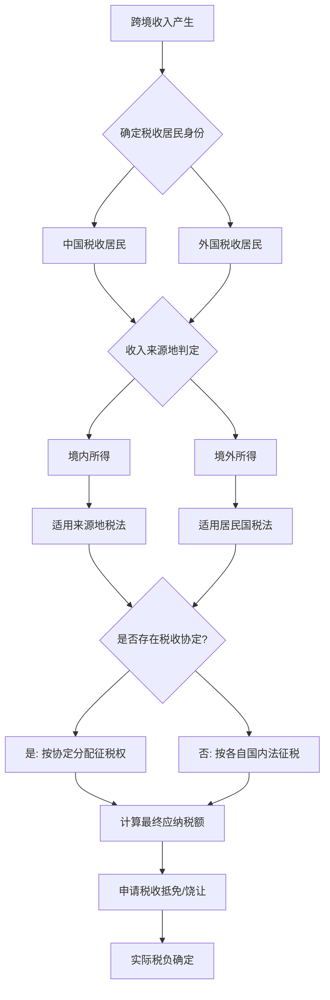
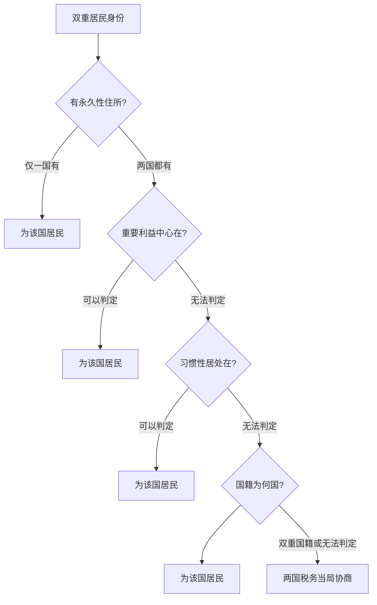
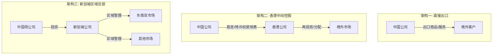

## 四、跨境税务

跨境税务是税务筹划中最复杂的领域之一。当你的收入来源、居住地、注册地跨越两个或多个税收管辖区时，多个税法同时对你产生效力，如何在合法合规的前提下避免重复征税、优化整体税负，是每一个有跨境收入的个人和企业必须面对的课题。

### 4.1 跨境税务的基本概念

#### 4.1.1 什么是跨境税务

跨境税务（Cross-border Taxation）是指涉及两个或两个以上税收管辖区的税务问题。常见场景包括：

- **个人层面**：在中国居住但从境外公司获取工资、从海外平台获取收入（YouTube、Amazon、Upwork）、持有海外资产或投资海外证券
- **企业层面**：出口企业在海外设立分支机构、跨境电商卖家通过海外仓储销售、中国企业对外投资或接受外国投资
- **混合层面**：中国居民为境外公司远程工作、自由职业者同时服务国内外客户

#### 4.1.2 为什么跨境税务很重要

跨境税务处理不当会带来三个层面的风险：

| 风险类型 | 具体后果 | 严重程度 |
|---------|---------|---------|
| 双重征税 | 同一笔收入被两个国家同时征税，实际税负可能高达60%-80% | 高 |
| 合规处罚 | 未申报境外收入面临补税+滞纳金+0.5-5倍罚款 | 极高 |
| 刑事风险 | 故意隐瞒境外大额收入可能构成逃税罪 | 极高 |

同时，合理利用税收协定和各国优惠政策，跨境税务筹划也可以合法地将综合税负降低30%-50%。

#### 4.1.3 跨境税务的核心框架



### 4.2 税收居民身份判定

税收居民身份决定了你对哪个国家负有全面纳税义务，是跨境税务的起点。

#### 4.2.1 中国的税收居民判定标准

根据《个人所得税法》第一条，在中国境内有住所，或者无住所而在一个纳税年度内在中国境内居住累计满183天的个人，为中国税收居民。

**"有住所"的认定**：在中国境内有住所是指因户籍、家庭、经济利益关系而在中国境内习惯性居住。这里的关键是"习惯性居住"——不是看你有没有房产，而是看你生活重心在哪里。

**183天规则的计算**：

```text
一个纳税年度 = 1月1日至12月31日
计算范围 = 该年度内在中国境内的所有天数（含入境日和离境日）
注意：单次离境不超过30天的连续离境天数不扣除
```

**案例：天数计算实操**

张先生持中国护照，2025年出入境记录如下：

| 出入境 | 日期 | 境内天数 |
|--------|------|---------|
| 入境 | 1月5日 | 1月5日-3月20日 = 75天 |
| 出境 | 3月20日 | — |
| 入境 | 4月15日 | 4月15日-4月25日 = 11天 |
| 出境 | 4月25日 | — |
| 入境 | 5月20日 | 5月20日-12月31日 = 226天 |
| **合计** | — | **312天** |

张先生2025年在华居住312天 > 183天，属于中国税收居民，需就全球所得向中国纳税。

#### 4.2.2 常见国家/地区的税收居民标准

| 国家/地区 | 主要标准 | 备注 |
|-----------|---------|------|
| 中国 | 183天或有住所 | "有住所"标准较宽 |
| 美国 | 绿卡持有者或实质居住测试（183天加权计算） | 加权规则：当年1天+去年1/3天+前年1/6天 |
| 英国 | Statutory Residence Test（法定居住测试） | 复杂的多层测试体系 |
| 日本 | 1年住所+5年连续居住（非永久居民/永久居民） | 10年为永久居民判定 |
| 新加坡 | 183天 | 税务年度为1月-12月 |
| 香港 | 通常居住或单次停留超180天 | 地域来源原则征税 |
| 澳大利亚 | 183天+居住意图 | 有多种居民类型 |

#### 4.2.3 双重税收居民身份的解决

当一个人同时满足两个国家的居民标准时（例如在中国有住所且在美国绿卡持有），需要按照税收协定中的"加比规则"（Tie-Breaker Rules）来判定最终居民身份：

1. **永久性住所**：在哪国有永久性住所，即为哪国居民
2. **重要利益中心**：如果两国都有永久性住所，看个人和经济关系更密切的国家
3. **习惯性居处**：如果无法判定利益中心，看在哪国居住更频繁
4. **国籍**：以上都无法判定时，看国籍
5. **协商解决**：最终由两国税务当局协商



**实操提醒**：中国公民即使持有外国永居权，只要户籍和家庭仍在中国，通常仍被认定为中国税收居民。很多移民不移居的人忽略了这一点，导致严重的税务风险。

### 4.3 税收协定与双重征税消除

#### 4.3.1 税收协定概述

税收协定（Double Tax Agreement, DTA）是两个国家之间签订的协议，目的是消除双重征税和防止偷漏税。截至目前，中国已与110多个国家和地区签署了避免双重征税协定。

税收协定通常遵循OECD范本或联合国范本，核心内容包括：

- **征税权的分配**：不同类型的收入由哪国优先征税
- **消除双重征税的方法**：抵免法或免税法
- **非歧视待遇**：不得对对方国家居民施加歧视性税负
- **相互协商程序**：解决协定适用争议的机制

#### 4.3.2 主要收入类型的征税权分配

| 收入类型 | 来源国征税权 | 居民国征税权 | 说明 |
|---------|------------|------------|------|
| 营业利润 | 无常设机构则不征 | 全额征税 | 常设机构是关键门槛 |
| 股息 | 限制税率（通常5%-10%） | 全额征税并允许抵免 | 协定通常降低预提税 |
| 利息 | 限制税率（通常10%） | 全额征税并允许抵免 | 部分协定免税 |
| 特许权使用费 | 限制税率（通常6%-10%） | 全额征税并允许抵免 | 软件许可费的争议较多 |
| 独立个人劳务 | 183天+固定基地则征 | 全额征税 | 远程工作者需特别注意 |
| 受雇劳务 | 来源国可征 | 全额征税并允许抵免 | 183天+雇主非居民+非来源国支付时来源国免征 |
| 资本利得 | 不动产和常设机构资产的来源国可征 | 可征 | 股票转让的协定规定各异 |

#### 4.3.3 消除双重征税的方法

**抵免法（Credit Method）**：

中国采用抵免法。中国居民在境外已缴纳的所得税，可以从其中国应纳税额中抵免，但抵免额不得超过该所得按中国税法计算的应纳税额。

```text
抵免限额 = 中国应纳税所得额 × 中国税率 × (来源于该国的所得 ÷ 境内外应纳税所得总额)
实际抵免 = min(境外已纳税额, 抵免限额)
```

**分国不分项 vs 综合抵免**：

中国个人所得税采用"分国不分项"原则——按国家分别计算抵免限额，但同一国家的不同类型收入合并计算。2020年起，企业所得税新增了综合抵免选项（不分国不分项），但个人所得税暂未采用。

**免税法（Exemption Method）**：

部分国家采用免税法——对境外已税收入直接免税，不再要求计算抵免。典型代表是香港的地域来源原则和部分欧洲国家对特定境外收入的免税政策。

#### 4.3.4 税收饶让抵免

税收饶让（Tax Sparing）是指来源国给予的税收减免，居民国视同已缴税款予以抵免。这对投资发展中国家的企业和个人非常重要——否则来源国的优惠就会被居民国"吃掉"。

中国与部分发展中国家的协定包含税收饶让条款，但与发达国家的协定中较少包含。具体需要查阅相关协定的议定书。

### 4.4 常见跨境收入的税务处理

#### 4.4.1 跨境工资薪金所得

**场景**：中国居民被派往海外工作，或在境内为境外公司远程工作。

**核心规则**：

中国税收居民从中国境内和境外取得的工资薪金所得，均需缴纳个人所得税。境外所得已缴税款可以按规定抵免。

**在中国境内为境外雇主远程工作的税务处理**：

这是一个日益普遍但税务认定模糊的场景。关键在于收入来源地的判定：

- 如果你在境内提供劳务，即使雇主在境外，收入来源仍为中国
- 境外雇主如果在中国没有常设机构，理论上不承担代扣代缴义务
- 但你作为中国税收居民，需要自行申报缴纳个人所得税

**实操步骤**：

1. 确认收入来源地——境内还是境外提供劳务
2. 如为境内所得，按中国工资薪金税率（3%-45%）纳税
3. 如为境外所得，先按当地税法纳税，再在中国申报并申请抵免
4. 保留完税凭证和收入证明

**工资薪金税率表**（综合所得适用）：

| 级数 | 全年应纳税所得额 | 税率 | 速算扣除数 |
|------|----------------|------|-----------|
| 1 | 不超过36,000元 | 3% | 0 |
| 2 | 36,000-144,000元 | 10% | 2,520元 |
| 3 | 144,000-300,000元 | 20% | 16,920元 |
| 4 | 300,000-420,000元 | 25% | 31,920元 |
| 5 | 420,000-660,000元 | 30% | 52,920元 |
| 6 | 660,000-960,000元 | 35% | 85,920元 |
| 7 | 超过960,000元 | 45% | 181,920元 |

#### 4.4.2 跨境自由职业/独立劳务所得

**场景**：在Upwork、Fiverr、Toptal等平台接单，或直接为境外客户提供设计、开发、翻译、咨询等服务。

**税务定性**：

根据中国税法，这类收入属于"劳务报酬所得"，并入综合所得按3%-45%累进税率征税。

根据税收协定中的"独立个人劳务"条款，如果中国居民在对方国家设有固定基地，或在任意12个月中停留超过183天，对方国家也可以征税。

**平台代扣的复杂性**：

不同平台和不同国家的代扣规则不同：

| 平台/场景 | 代扣情况 | 需自行处理 |
|-----------|---------|-----------|
| 美国平台向非美国居民支付 | 可能代扣30%美国预提税 | 提交W-8BEN表格申请协定优惠税率 |
| Upwork | 不代扣所得税 | 自行向中国申报 |
| Fiverr | 不代扣所得税 | 自行向中国申报 |
| YouTube广告收入 | Google代扣美国预提税 | 提交W-8BEN；中国申报并抵免 |
| Apple App Store | 可能代扣来源国预提税 | 查看具体国家代扣比例 |

**W-8BEN表格填写要点**：

```text
Form W-8BEN (Certificate of Foreign Status of Beneficial Owner)
┌─────────────────────────────────────────────────┐
│ Line 1: 姓名（与护照一致）                         │
│ Line 2: 国籍：China                              │
│ Line 3: 永久地址                                  │
│ Line 6: 纳税人识别号（中国身份证号或纳税人识别号）    │
│ Line 10: 税收协定优惠 — 填写China，税率填10%        │
│         (取决于收入类型和协定条款)                   │
│ 签名 + 日期                                       │
└─────────────────────────────────────────────────┘
```

提交W-8BEN后，美国预提税可从30%降至10%（特许权使用费）或10%（部分服务收入），具体取决于中美税收协定的适用条款。

#### 4.4.3 跨境投资所得

**股息所得**：

中国居民从境外公司获得的股息，按20%税率缴纳个人所得税。如果境外已扣缴预提税，可以申请抵免。

以美国股票为例：

```text
美国公司派发股息 $1,000
美国预提税 10%（中美协定优惠税率）= $100
实际收到 $900

中国应税股息 = ¥7,000（假设汇率7.0）
中国应纳税 = ¥7,000 × 20% = ¥1,400
境外已缴抵免 = $100 × 7.0 = ¥700
中国实际补缴 = ¥1,400 - ¥700 = ¥700
```

**利息所得**：

从境外获得的利息（如境外银行存款、债券利息），中国税率为20%。中美协定下美国对利息的预提税为10%。

**资本利得**：

- 境外股票转让所得：按20%税率纳税
- 美国对非居民的股票资本利得通常不征税（NRA exempt）
- 但如果通过美国券商交易，需确认具体处理方式
- 加密货币的跨境交易税务处理较为复杂，详见本章第7节

**香港/新加坡的税务优势**：

| 项目 | 香港 | 新加坡 | 中国大陆 |
|------|------|--------|---------|
| 股息税率 | 0% | 0%（单层税制） | 20% |
| 资本利得税 | 0% | 0% | 20% |
| 利息税率 | 0% | 0-17% | 20% |
| 个人所得税最高税率 | 15% | 22% | 45% |
| 境外收入征税 | 地域来源（通常不征） | 汇入才征 | 全球征税 |

#### 4.4.4 跨境电商的税务处理

跨境电商是跨境税务中最常见的场景之一，也是税务机关重点关注的领域。

**出口跨境电商**：

- **B2C直邮模式**：货物直接发往境外消费者，享受出口退税（增值税退税率5%-13%不等）
- **海外仓模式**：货物先发往海外仓库，再在当地销售。出口时可申请退税，海外仓储环节可能涉及当地的增值税/GST/Sales Tax
- **平台代扣代缴**：Amazon等平台在欧盟、英国等地已实行代扣代缴VAT

**进口跨境电商**：

- **个人年度限额**：单次交易限值5,000元，年度限值26,000元
- **限额内**：关税0%，增值税和消费税按70%征收
- **超限额**：按一般贸易全额征税

**各国VAT/GST注册义务**：

| 国家/地区 | 注册阈值 | 标准税率 | 平台代扣 |
|-----------|---------|---------|---------|
| 欧盟 | 远程销售超过10,000欧元/年 | 17%-27%（各国不同） | 是（OSS机制） |
| 英国 | 任何向英国消费者销售 | 20% | 是 |
| 美国 | 经济关联（Nexus）标准 | 0%-10.25%（各州不同） | 部分州平台代扣 |
| 日本 | 年销售额超过1,000万日元 | 10% | 否 |
| 澳大利亚 | 年销售额超过75,000澳元 | 10% | 是 |

#### 4.4.5 知识产权与特许权使用费

**场景**：通过App Store、Google Play销售应用，授权海外使用软件、专利、商标，或在海外出版作品获取版税。

**税务处理要点**：

1. 特许权使用费在中国按20%税率纳税（并入综合所得按3%-45%适用）
2. 来源国通常按税收协定优惠税率（6%-10%）预扣
3. 在中国申报时可申请抵免境外已扣税款
4. 软件许可费的性质认定存在争议——是特许权使用费还是营业利润？这直接影响来源国是否有权征税

**关键区分**：

- 转让软件版权（著作权）→ 资本利得/特许权使用费
- 授权使用软件（许可费）→ 特许权使用费
- 仅提供软件技术服务 → 营业利润或独立个人劳务

### 4.5 跨境税务筹划的核心策略

#### 4.5.1 利用税收协定优惠

这是最基础也最直接的策略。中国已签署的110多个税收协定中，绝大多数包含降低预提税率的条款。

**实操步骤**：

1. 确认收入类型和来源国
2. 查阅中国与该国的税收协定（国家税务总局网站可查）
3. 确认协定中对该收入类型的税率限制
4. 在来源国申请协定优惠税率（通常需要提交中国税收居民身份证明）
5. 保留境外完税凭证用于中国申报抵免

**中国税收居民身份证明的开具**：

```text
申请材料：
1. 《中国税收居民身份证明》申请表
2. 申请人的身份证明文件（居民身份证、护照等）
3. 与取得收入有关的合同、协议等
4. 申请人在中国境内的住所或居所证明
5. 主管税务机关要求提供的其他资料

办理地点：所在地主管税务机关（区/县税务局）
办理时限：一般10-20个工作日
有效期：一般为一个纳税年度
```

#### 4.5.2 优化收入性质

不同性质的收入在税收协定中的待遇不同。例如：

- **工资薪金** vs **独立劳务** vs **董事费**：征税权分配规则不同
- **股息** vs **利息** vs **特许权使用费**：预提税率不同
- **营业利润** vs **特许权使用费**：软件/技术服务的定性直接影响税负

**案例：软件授权 vs 技术服务**

某程序员为中国公司开发了一款SaaS软件，美国客户使用该软件：

方案A：以特许权使用费（License Fee）名义收取
- 美国预提税：10%（中美协定）
- 中国个税：20%
- 实际可抵免，综合税负约20%

方案B：以技术服务费（Service Fee）名义收取
- 美国通常不征预提税（NRA服务收入在美国境外提供，一般免税）
- 中国个税：按劳务报酬3%-45%
- 综合税负取决于收入金额

选择哪种方案，需要综合考虑收入金额、两国实际税负和合同安排的合理性。税务机关会按照经济实质判断收入性质，不能仅通过合同标题改变定性。

#### 4.5.3 合理安排跨境架构

对于有一定规模的跨境业务，通过合理的公司架构可以优化整体税负。

**常见架构**：



**香港中间架构的考量**：

- 香港利得税标准税率16.5%，两级制下首200万港元利润税率8.25%
- 香港不征收资本利得税和股息税
- 中港税收安排下，股息预提税5%（持股25%以上）或10%
- 但需要注意：香港公司必须有实质经营（经济实质要求），不能是空壳公司
- 2023年起香港实施FSIE制度（外地收入豁免征税机制），消极收入如无经济实质可能被征税

**新加坡架构的考量**：

- 企业所得税17%，实际可享受各种优惠降至约13%-15%
- 新加坡不对境外来源的收入征税（除非汇入新加坡且不符合免税条件）
- 中新税收协定下股息预提税为10%（可降低）
- 需满足经济实质要求——有办公场所、员工、决策在当地做出

**重要警告**：跨境架构的筹划必须有真实的商业实质，不能仅为税务目的设立空壳公司。中国《一般反避税管理办法》和CRS（共同申报准则）的实施，使得纯避税安排面临越来越大的风险。

#### 4.5.4 时间和金额规划

- **时间规划**：合理安排收入确认时间和支付时间，避免在高税率年度集中确认收入
- **金额规划**：部分国家对小规模纳税人有简化制度或免税额度
- **递延纳税**：利用税收协定中的递延条款，延迟纳税义务的发生

### 4.6 中国反避税与合规要求

#### 4.6.1 CRS（共同申报准则）

CRS（Common Reporting Standard）是OECD推出的金融账户涉税信息自动交换标准。截至目前，已有100多个国家和地区参与，中国于2018年9月进行了首次信息交换。

**对你意味着什么**：

你在境外的银行账户、投资账户、保险现金价值等金融资产信息，会被自动报告给中国税务机关。具体包括：

- 存款账户：余额和利息收入
- 证券账户：股息、利息和出售所得
- 保险合同：现金价值
- 信托权益：信托的收入和资产

**CRS覆盖的主要国家/地区**：

几乎所有主要金融中心都已加入CRS，包括瑞士、新加坡、香港、开曼群岛、BVI（英属维尔京群岛）、日本、澳大利亚、加拿大、英国等。美国是唯一未加入CRS的OECD国家，但美国有FATCA（外国账户税收合规法案），与多国（包括中国）有信息交换安排。

#### 4.6.2 受控外国企业（CFC）规则

如果中国居民（个人或企业）控制的境外企业位于实际税负明显偏低（低于12.5%）的国家或地区，且不分配利润或减少分配，中国税务机关可以将该企业应分配给中国居民的利润视同已分配，计入中国居民的当期收入。

**CFC规则的适用条件**：

1. 中国居民直接或间接持有境外企业50%以上股份
2. 该境外企业的实际税负低于12.5%
3. 该企业不分配或少分配利润（无合理经营需要）

**对个人的影响**：如果你在BVI、开曼群岛等地持有公司，该公司有利润但不分配，你可能面临CFC规则的调整，需要在中国就视同分配的利润缴纳个人所得税。

#### 4.6.3 一般反避税条款（GAAR）

《个人所得税法》第八条赋予税务机关对不合理商业安排进行纳税调整的权力：

> 个人实施其他不具有合理商业目的的安排而获取不当税收利益，税务机关有权按照合理方法进行纳税调整。

这条一般反避税条款是"兜底条款"，即使你的安排在形式上合法，如果缺乏合理商业目的而仅为获取税收利益，仍可能被调整。

**判断"合理商业目的"的要素**：

1. 安排的主要目的是否为获取税收利益
2. 安排的形式与实质是否一致
3. 是否有真实的商业活动和经济实质
4. 是否遵循独立交易原则

#### 4.6.4 境外所得申报要求

**申报义务**：

中国税收居民从境外取得的所得，应当在取得所得的次年3月1日至6月30日内向中国税务机关申报纳税。

**申报材料**：

1. 《个人所得税年度自行纳税申报表》（B表）
2. 境外所得的完税凭证或税收缴款书（原件及中文翻译件）
3. 境外税务机关出具的税款所属年度的纳税凭证
4. 合同、协议等收入证明文件

**可抵免税额的计算**：

```text
第1步：将境外所得换算为人民币（按中国税务机关公布的汇率）
第2步：计算境外所得按中国税法应缴纳的税额
第3步：确认境外实际缴纳的税额（需换算为人民币）
第4步：抵免限额 = min(境外实际缴税, 中国应纳税额中归属于境外所得的部分)
第5步：实际应补缴 = 中国应纳税额 - 允许抵免额
```

**特别提醒**：如果境外实际税率高于中国税率，超出部分不能抵免（但可以向后结转5年）。如果境外实际税率低于中国税率，需要在中国补缴差额。

### 4.7 跨境税务风险与常见错误

#### 4.7.1 高风险行为

| 风险行为 | 后果 | 风险等级 |
|---------|------|---------|
| 不申报境外收入 | 补税+滞纳金+罚款（0.5-5倍） | 极高 |
| 通过境外空壳公司隐匿收入 | GAAR调整+罚款+可能追究刑事责任 | 极高 |
| 误用税收协定（不满足条件） | 补税+罚款 | 高 |
| 境外支付未扣缴税款 | 扣缴义务人和纳税人均有责任 | 高 |
| 错误判定收入性质 | 多缴或少缴税款 | 中 |
| 忽略外汇管制要求 | 外汇违规处罚 | 中 |

#### 4.7.2 常见误区

**误区一：在境外已经交过税就不用在中国交了**

错。中国实行全球征税，境外已缴税款只能抵免，不能免除中国的纳税义务。只有当境外税率高于中国税率时，才不需要在中国补缴。

**误区二：在国外待了半年以上就自动变成外国居民**

不一定。对于中国公民，即使在境外居住超过183天，如果在中国仍有户籍、家庭和经济利益关系，中国仍可能认定你为中国税收居民。需要看具体协定中的加比规则。

**误区三：用个人账户收外汇没有问题**

问题很大。个人外汇收入超过一定金额需要申报来源，未申报的外汇收入可能引发税务和外汇管理双重问题。同时，银行的大额交易和可疑交易报告机制会自动上报异常资金流动。

**误区四：境外公司的利润不分配就不用交税**

在CFC规则下，不分配利润不等于不纳税。如果控制的实际税负低于12.5%的境外公司不分配利润，中国税务机关可以视同分配并征税。

**误区五：小金额的境外收入不用申报**

错。中国个税法对境外所得申报没有金额下限。理论上，即使只有100美元的境外利息收入，也需要申报。当然，实际执行中税务机关会优先关注大额和异常的境外收入。

### 4.8 实战案例

#### 4.8.1 案例一：远程工作者的跨境税务

**背景**：李明，30岁，中国公民，软件工程师。2025年1月起远程为一家美国科技公司工作，年薪$80,000。李明全年居住在中国。

**税务分析**：

1. 李明是中国税收居民（有住所+境内居住）
2. 收入来源：在中国境内提供劳务，收入来源为中国
3. 美国税务：在美国境外为非美国雇主工作，通常不在美国纳税（但需确认雇主是否有美国扣缴义务）
4. 中国税务：按工资薪金所得纳税

**税务计算**：

```text
年收入：$80,000 × 7.2 = ¥576,000
减：基本减除费用 ¥60,000
减：专项扣除（五险一金等，自行缴纳假设）¥30,000
减：专项附加扣除（假设）¥24,000
应纳税所得额：¥462,000

适用税率：30%，速算扣除数52,920
应纳税额：¥462,000 × 30% - ¥52,920 = ¥85,680

实际税负率：85,680 ÷ 576,000 = 14.9%
```

**优化建议**：

1. 如果美国雇主愿意在合同中安排部分为技术咨询费，可能适用不同的税务处理，但必须有商业实质
2. 考虑是否能适用专项附加扣除（继续教育、住房贷款等）
3. 如果美国雇主代扣了任何税款，申请抵免

#### 4.8.2 案例二：跨境电商卖家的税务优化

**背景**：王芳在Amazon美国站销售家居用品，年销售额$200,000，毛利率40%。目前以个人身份经营，货物从中国直邮。

**现状税负**：

```text
毛利润：$200,000 × 40% = $80,000 = ¥576,000
中国个人所得税（劳务报酬或经营所得）：约¥130,000
综合税负率：约22.6%
```

**优化方案**：

| 方案 | 结构 | 预估综合税负 | 复杂度 |
|------|------|------------|--------|
| 方案A | 个人→注册个体工商户（核定征收） | 5%-10% | 低 |
| 方案B | 注册香港公司运营 | 8.25%-16.5%（利得税）+中国个人所得税 | 中 |
| 方案C | 注册美国LLC（作为穿透实体） | 需分析中国和美国的税务影响 | 高 |

**方案A详细分析**：

注册个体工商户，适用核定征收：
- 部分地区对跨境电商个体户核定应税所得率约10%
- 应税所得 = ¥576,000 × 10% = ¥57,600
- 个税（经营所得5%） = ¥57,600 × 5% = ¥2,880
- 综合税负率约0.5%

注意：核定征收政策各地差异大且正在收紧，需关注当地最新政策。

#### 4.8.3 案例三：海外投资的税务规划

**背景**：赵磊持有价值$500,000的美股投资组合，年股息收入约$15,000（股息率3%），每年交易产生资本利得约$20,000。

**当前税负**：

```text
股息收入：
  美国预提税 10%（中美协定）= $1,500
  中国个税 20% = $3,000
  抵免后中国补缴 = $1,500
  股息总税负 = $3,000 (20%)

资本利得：
  美国通常不对NRA征收资本利得税
  中国个税 20% = $4,000
  资本利得总税负 = $4,000 (20%)

年度总税负 = $3,000 + $4,000 = $7,000
年度总收入 = $35,000
综合税负率 = 20%
```

**优化策略**：

1. 通过香港券商投资港股：股息和资本利得均可能享受更低税率
2. 利用股票选择权：持有成长型股票（低分红）替代高分红股票，减少股息税
3. 考虑ETF替代个股：部分爱尔兰注册的ETF对非居民有税务优势（需注意中国税务申报义务）

### 4.9 跨境税务工具与资源

#### 4.9.1 税收协定查询

| 资源 | 网址 | 用途 |
|------|------|------|
| 国家税务总局税收协定专栏 | chinatax.gov.cn → 国际税收 → 税收协定 | 中文协定文本 |
| OECD税收协定数据库 | oecd.org/tax/treaties | 多国协定比较 |
| IBFD（国际财政文献局） | ibfd.org | 专业税务研究数据库（付费） |
| Tax Treaty Database | taxsummaries.pwc.com | 各国税收政策概览 |

#### 4.9.2 税务合规工具

| 工具 | 用途 | 适用场景 |
|------|------|---------|
| 个人所得税APP | 年度汇算清缴、境外所得申报 | 个人申报 |
| 电子税务局 | 在线办理各类税务事项 | 企业+个人 |
| TaxAct / TurboTax | 美国税务申报 | 在美国有收入的非居民 |
| 专业税务师/会计师 | 复杂跨境税务咨询 | 收入较大或结构复杂 |

#### 4.9.3 外汇管理

跨境收入的外汇管理同样重要：

- **个人年度便利化额度**：每人每年等值5万美元
- **超出额度的收入**：凭相关税务证明和合同材料到银行办理
- **境外投资外汇登记**：个人对外投资需要在外汇管理局办理登记（ODI登记）
- **跨境电商收汇**：可通过第三方支付机构（如Payoneer、万里汇、PingPong）收汇

### 4.10 本节要点总结

| 核心知识点 | 要点 |
|-----------|------|
| 税收居民身份 | 183天规则 + 住所标准；双重居民按加比规则判定 |
| 税收协定 | 110+国家签署；降低预提税、分配征税权 |
| 抵免法 | 境外已缴税可抵免，但不超过中国应纳税额 |
| 全球征税 | 中国税收居民需就全球所得纳税 |
| CRS | 境外金融账户信息自动交换，无法隐匿 |
| CFC规则 | 低税地公司不分配利润也可能被视同分配征税 |
| 收入性质 | 不同性质收入待遇不同，合理定性很重要 |
| 经济实质 | 跨境架构必须有真实商业实质 |
| 申报期限 | 次年3月1日-6月30日 |
| 风险警示 | 不申报境外所得是高风险行为 |
