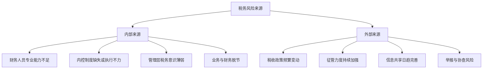
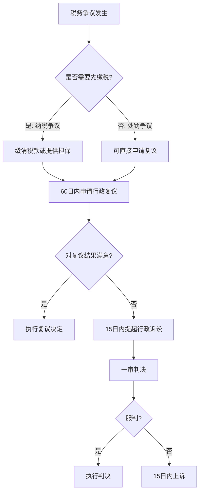

## 五、税务风险防范

税务风险防范是税务筹划的底线思维——任何筹划方案如果不能通过税务机关的审查，不仅筹划收益化为乌有，还可能面临补税、滞纳金和罚款，甚至刑事责任。本章系统讲解税务风险的识别、评估、防范与应对，帮助你在合法合规的前提下实现税务优化。

### 1. 税务风险的本质与分类

#### 1.1 什么是税务风险

税务风险是指因税务处理不当而导致的经济损失和法律责任。其核心在于**税企双方对同一事项的税法适用存在分歧**，或者纳税人确实存在违反税法规定的行为。

税务风险的三个层次：

| 层次 | 含义 | 后果 | 典型场景 |
|------|------|------|----------|
| **合规风险** | 违反税法强制性规定 | 补税+滞纳金+罚款 | 隐匿收入、虚列成本 |
| **筹划风险** | 筹划方案被认定为避税 | 纳税调整+补税 | 关联交易定价不合理 |
| **政策风险** | 对政策理解有误 | 补税（可能免滞纳金） | 税收优惠适用条件判断错误 |

#### 1.2 税务风险的来源



**内部来源详解：**

- **人员能力不足**：财务人员不熟悉最新税收政策，导致错误适用税率、遗漏扣除项目、错过申报期限等问题。特别是在金税四期背景下，大数据比对越来越精准，过去靠"混"过关的做法已经行不通。
- **内控制度缺失**：没有建立发票管理制度、税务申报复核制度、税务档案管理制度等，导致日常操作中的低级错误不断积累。
- **业务财务脱节**：业务部门签了合同、收了款项、开了发票，但不及时告知财务部门，导致收入确认时点错误、发票开具不规范等问题。

**外部来源详解：**

- **政策变动**：税收政策调整频繁，如增值税率调整、个税专项附加扣除标准变化、小微企业优惠政策延续与否等，都需要及时跟进。
- **征管升级**：金税四期实现了"以数治税"，税务机关可以通过银行、社保、市场监管等多部门数据交叉比对，精准发现异常。
- **举报风险**：离职员工、竞争对手、商业纠纷对方等都可能成为举报人，一旦举报，税务机关必然立案检查。

#### 1.3 税务风险等级评估矩阵

| | 低概率 | 中概率 | 高概率 |
|--|--------|--------|--------|
| **高影响** | 关注区（持续监控） | 警戒区（主动防范） | 危险区（立即处理） |
| **中影响** | 可接受（定期检查） | 关注区（加强管理） | 警戒区（优先处理） |
| **低影响** | 可忽略 | 可接受（常规管理） | 关注区（适时处理） |

影响程度的判断标准：
- **高影响**：补税金额超过10万元，或可能触发刑事责任
- **中影响**：补税金额1-10万元，或影响纳税信用等级
- **低影响**：补税金额1万元以下，且不涉及信用评级

### 2. 高频税务风险场景深度解析

#### 2.1 收入确认风险

**风险点一：隐匿收入**

这是最常见的税务风险。典型表现包括：

1. **私户收款不入账**：通过个人银行卡、微信、支付宝收取经营款项，不计入公司收入。金税四期下，银行数据与税务数据打通，大额私户交易必然被监控。
2. **现金收入不申报**：特别是餐饮、零售等行业，现金收入部分不入账。但随着电子支付普及，现金交易比例大幅下降，这一空间越来越小。
3. **预收账款长期挂账**：货物已发出或服务已提供，但以"预收款"名义不确认收入。税法规定，发出货物或提供服务时即应确认收入。
4. **关联方交易转移利润**：以低价将产品销售给关联公司，再由关联公司以市场价对外销售，将利润留在低税率的关联公司。

**防范措施：**

- 所有经营收入必须通过对公账户收取，确需个人账户代收的，应在24小时内转入对公账户并做好备注
- 建立收入确认的标准化流程，明确各业务类型（销售商品、提供服务、让渡资产使用权）的确认时点
- 定期核对银行流水与账面收入，确保一致性
- 关联交易必须按照独立交易原则定价，保留完整的定价依据文档

**风险点二：视同销售未申报**

税法中的"视同销售"是指某些行为虽然没有直接产生销售收入，但税法要求按照销售处理。常见情形：

| 业务场景 | 增值税处理 | 企业所得税处理 | 个人所得税处理 |
|----------|-----------|---------------|---------------|
| 将自产产品用于职工福利 | 视同销售 | 视同销售 | 并入工资薪金 |
| 将外购商品赠送客户 | 视同销售 | 视同销售 | 按"偶然所得"20% |
| 将货物用于对外投资 | 视同销售 | 视同销售 | 股权转让所得 |
| 将资产用于偿债 | 视同销售 | 视同销售 | 债务重组所得 |
| 总机构向分支机构移送货物 | 同一县市视同销售 | 不视同销售 | 不涉及 |

**实操要点：**

- 企业自产或外购商品用于非销售用途时，必须按照市场公允价值计算增值税销项税额
- 赠送客户的礼品，需要代扣代缴个人所得税（税率20%），这是很多企业容易遗漏的环节
- 年终抽奖、年会礼品等都属于"偶然所得"，需要代扣个税

#### 2.2 成本费用扣除风险

**风险点一：发票问题**

发票是企业所得税税前扣除的核心凭证。常见风险包括：

1. **取得虚开发票**：从第三方购买发票、让他人为自己开具与实际业务不符的发票，无论是否知情，取得虚开发票均不得税前扣除。如果被认定为"善意取得"，可以免于处罚但仍然不能扣除。
2. **发票信息不完整**：发票抬头错误、缺少纳税人识别号、商品名称笼统（如只写"办公用品"而无明细清单）。
3. **跨期发票**：2024年的费用取得2025年的发票，或者反之。企业所得税以权责发生制为原则，但发票日期也是税务机关重点关注的指标。
4. **白条入账**：某些小额零星支出（个人500元以下）可以用收款凭证替代发票，但需要注明收款人姓名、身份证号、支出项目和金额。

**发票管理实操清单：**

```text
□ 发票抬头与公司全称一致
□ 纳税人识别号正确
□ 商品名称具体明确（非笼统的大类名称）
□ 金额与实际支付一致
□ 日期在合理范围内
□ 电子发票已查验真伪（国家税务总局全国增值税发票查验平台）
□ 大额发票（5万元以上）附有合同或订单
□ 差旅费发票附有行程单和审批单
□ 业务招待费发票附有招待事由和参与人员说明
```

**风险点二：费用扣除限额超标准**

税法对部分费用设定了扣除限额，超出部分不得在税前扣除：

| 费用类型 | 扣除限额 | 计算基数 | 注意事项 |
|----------|---------|---------|---------|
| 业务招待费 | 发生额×60%与营收×5‰孰低 | 当年营业收入 | 取较小值，非较大值 |
| 广告费和业务宣传费 | 营收×15%（化妆品等30%） | 当年营业收入 | 超出部分可结转以后年度 |
| 职工福利费 | 工资总额×14% | 当年工资薪金总额 | 包括货币和非货币福利 |
| 职工教育经费 | 工资总额×8% | 当年工资薪金总额 | 超出部分可结转 |
| 工会经费 | 工资总额×2% | 当年工资薪金总额 | 须取得工会经费收入专用收据 |
| 公益性捐赠 | 年度利润总额×12% | 会计利润 | 超出部分3年内可结转 |
| 利息支出 | 不超过金融企业同期同类贷款利率 | — | 关联方借款有资本弱化限制 |

**案例：业务招待费的扣除计算**

某企业2025年营业收入5000万元，业务招待费实际发生80万元。

- 按发生额计算：80×60% = 48万元
- 按营收计算：5000×5‰ = 25万元
- 可扣除金额：取较小值 = 25万元
- 纳税调增：80 - 25 = 55万元

这意味着55万元的业务招待费需要缴纳企业所得税（按25%税率计算，多缴税款13.75万元）。

**风险点三：资本性支出一次性扣除**

将应计入固定资产的支出一次性计入当期费用，是最常见的税务风险之一。税法规定：

- 单位价值不超过500万元的设备器具，可选择一次性税前扣除（政策延续至2027年12月31日）
- 超过500万元的固定资产，必须按年限计提折旧
- 房屋建筑物无论价值大小，均不得一次性扣除

#### 2.3 增值税专项风险

**风险点一：进项税额转出遗漏**

以下情形需要做进项税额转出，很多企业容易遗漏：

1. **非正常损失**：因管理不善导致货物被盗、丢失、霉烂变质，对应的进项税额必须转出。自然灾害损失不需要转出。
2. **改变用途**：外购货物原用于生产经营（可抵扣），后改变用途用于集体福利或个人消费（不可抵扣），需要转出。
3. **简易计税项目混用**：一般纳税人同时有一般计税项目和简易计税项目，用于简易计税项目的进项税额不得抵扣，已抵扣的需要转出。

**风险点二：增值税税负率异常**

税务机关通过行业税负率监控企业申报情况。如果企业增值税税负率长期低于行业预警值，会触发风险提示。

各行业增值税税负率预警参考值：

| 行业 | 税负率预警下限 | 税负率预警上限 |
|------|--------------|--------------|
| 制造业 | 2.0% | 4.0% |
| 批发零售业 | 1.0% | 2.5% |
| 建筑业 | 2.5% | 4.5% |
| 信息技术服务业 | 3.0% | 6.0% |
| 餐饮住宿业 | 2.0% | 4.0% |

注意：税负率偏低不等于违法，但需要有合理的解释（如大量固定资产采购导致进项集中抵扣等）。

#### 2.4 个人所得税专项风险

**风险点一：工资薪金与劳务报酬混淆**

| 区别要素 | 工资薪金 | 劳务报酬 |
|----------|---------|---------|
| 法律关系 | 劳动关系（签劳动合同） | 劳务关系（签劳务合同） |
| 管理方式 | 接受用人单位管理 | 独立完成工作 |
| 社保缴纳 | 用人单位缴纳 | 一般自行缴纳 |
| 预扣预缴 | 累计预扣法（3%-45%） | 按次预扣（20%-40%） |
| 汇算清缴 | 并入综合所得 | 并入综合所得 |

**常见风险场景：**

- 企业将员工工资拆分为"基本工资+劳务费"，试图降低社保缴费基数。这种做法一旦被社保或税务部门查实，将面临补缴社保和罚款。
- 个人提供劳务，企业按"经营所得"代开票并核定征收，但实际符合"劳务报酬"特征，可能被追缴个税差额。

**风险点二：年终奖计税方式选择错误**

全年一次性奖金可以选择单独计税或并入综合所得计税。错误的选择可能导致多缴或少缴税款：

- **单独计税**：将年终奖除以12个月，按月度税率表确定税率，适用3%-45%的税率
- **并入综合所得**：与全年工资薪金合并计算

**选择建议：**

- 如果综合所得应纳税所得额为负数（扣除项大于收入），优先选择并入综合所得
- 如果综合所得应纳税所得额已经较高（超过税率跳档临界点），优先选择单独计税
- 最准确的做法是两种方式都计算一遍，选择应纳税额较低的方案

**风险点三：专项附加扣除不实**

常见的不实申报包括：
- 子女教育：子女已满学历教育终止年龄仍继续扣除
- 住房贷款利息：首套房贷款已还清或已出售仍继续扣除
- 赡养老人：兄弟姐妹分摊扣除金额合计超过标准
- 继续教育：取得证书后36个月内未扣除，过期后又扣除

### 3. 金税四期下的风险防控体系

#### 3.1 金税四期的监控能力

金税四期实现了"以数治税"的根本性转变。与金税三期相比：

| 对比维度 | 金税三期 | 金税四期 |
|----------|---------|---------|
| 数据来源 | 税务系统内部 | 多部门数据共享（银行、社保、市监、海关等） |
| 分析方式 | 规则比对 | 大数据+AI智能分析 |
| 监控范围 | 企业为主 | 企业+个人全方位监控 |
| 预警机制 | 事后检查为主 | 实时监控+事前预警 |
| 发票管理 | 以票控税 | 以数治税（全电发票） |

**金税四期重点关注的异常指标：**

1. **企业层面**：
   - 税负率异常（长期低于行业均值）
   - 收入成本比率异常（成本率畸高或畸低）
   - 应收账款/应付账款长期挂账
   - 存货周转率异常
   - 现金流与收入不匹配
   - 增值税与所得税申报收入不一致

2. **个人层面**：
   - 个人银行账户大额交易（单笔5万元以上或累计20万元以上）
   - 私户收款与经营规模不匹配
   - 个人所得税申报收入与银行流水不一致
   - 多处取得收入未汇算清缴

#### 3.2 建立企业税务风险内控体系

**第一层：事前预防**

```text
┌─────────────────────────────────────────────────┐
│                 事前预防机制                      │
├─────────────────────────────────────────────────┤
│ 1. 合同涉税审核制度                              │
│    - 所有合同签署前由财务/税务部门审核            │
│    - 重点关注：含税/不含税价格、发票类型、        │
│      付款条件、代扣代缴义务                       │
│                                                   │
│ 2. 重大交易税务评估                              │
│    - 单笔10万元以上的交易需做税务影响评估         │
│    - 涉及跨地区、跨境交易必须做税务尽调           │
│                                                   │
│ 3. 税收政策跟踪机制                              │
│    - 指定专人跟踪国家税务总局最新政策             │
│    - 每月整理政策变化清单并通知相关部门           │
│    - 重要政策变化及时调整账务处理                 │
└─────────────────────────────────────────────────┘
```

**第二层：事中控制**

1. **月度税务自查清单**：

```text
□ 增值税销项税额与收入匹配
□ 增值税进项税额与采购匹配
□ 进项税额转出事项已处理
□ 个人所得税代扣代缴已申报
□ 印花税应税合同已贴花/申报
□ 其他税种（房产税、土地使用税等）已按期申报
□ 发票开具与取得合规
□ 税收优惠条件持续符合
```

2. **季度税务健康检查**：

```text
□ 增值税税负率与行业均值对比分析
□ 企业所得税实际税负率分析
□ 各项费用扣除限额使用情况
□ 关联交易定价合理性检查
□ 往来款项账龄分析
□ 存货账实核对
□ 固定资产折旧计提核对
```

**第三层：事后应对**

- **税务稽查应对预案**：明确稽查来临时的应对流程、资料准备清单、沟通话术
- **税务争议解决机制**：了解行政复议、行政诉讼的程序和时限
- **补救措施**：发现历史问题后的自查补税方案

### 4. 常见税务稽查重点与应对

#### 4.1 税务稽查的触发条件

税务机关启动稽查的常见触发条件：

| 触发类型 | 具体情形 | 风险等级 |
|----------|---------|---------|
| 系统预警 | 税负率异常、申报数据异常 | ★★★ |
| 专项检查 | 行业专项整治（如电商、医美） | ★★★★ |
| 举报 | 内部举报、外部举报 | ★★★★★ |
| 协查 | 上下游企业被查后延伸检查 | ★★★ |
| 随机抽查 | 双随机一公开制度 | ★★ |

#### 4.2 稽查应对原则

**"三要三不要"原则：**

| 要 | 不要 |
|----|------|
| 要积极配合，如实回答询问 | 不要对抗执法，拒绝检查 |
| 要提供账簿凭证等法定资料 | 不要隐匿、销毁账簿凭证 |
| 要聘请专业税务师协助应对 | 不要自行编造虚假解释 |

**应对流程：**

1. **收到检查通知后**：第一时间联系专业税务师/税务律师，不要自行处理
2. **准备资料阶段**：按照检查通知书要求准备账簿、凭证、合同、银行流水等资料，但注意只提供要求范围内的资料，不要主动提供额外材料
3. **接受检查阶段**：回答问题要实事求是，不确定的问题可以说"需要回去核实"
4. **检查结论阶段**：对检查结论有异议的，应在规定时间内提出陈述申辩意见

#### 4.3 税务行政处罚的裁量基准

了解处罚标准有助于评估风险敞口：

| 违法行为 | 处罚标准 | 从轻/减轻情形 |
|----------|---------|--------------|
| 偷税 | 补税+滞纳金+50%-5倍罚款 | 自查补税可免罚款 |
| 逃避追缴欠税 | 补税+滞纳金+50%-5倍罚款 | 主动缴纳可从轻 |
| 骗取出口退税 | 追回退税款+1-5倍罚款 | — |
| 虚开发票 | 没收违法所得+罚款 | 情节严重移送司法 |
| 未按期申报 | 2000元以下罚款（一般） | 首违不罚 |

**重要提示：** "首违不罚"是国家税务总局推行的柔性执法措施，对于首次发生且危害后果轻微并在规定期限内改正的违法行为，不予行政处罚。但这仅限于轻微违法行为，偷税、虚开发票等严重违法行为不适用。

### 5. 税务风险防范的实操工具

#### 5.1 税务健康自检表

定期使用以下清单对企业税务状况进行全面体检：

**基础合规检查（每月）：**

```python
# 税务健康自检清单（示例）
monthly_checklist = {
    "增值税": {
        "销项税额与开票金额一致": False,
        "进项税额与认证金额一致": False,
        "进项转出事项已处理": False,
        "免税项目正确适用": False,
        "申报表与账面数据核对": False,
    },
    "企业所得税": {
        "收入确认符合权责发生制": False,
        "成本结转方法一致": False,
        "费用扣除凭证齐全": False,
        "资产折旧/摊销正确计提": False,
        "税收优惠条件持续满足": False,
    },
    "个人所得税": {
        "全员全额申报": False,
        "专项附加扣除信息真实": False,
        "劳务报酬代扣代缴": False,
        "股权激励个税处理正确": False,
    },
    "其他税种": {
        "印花税应税合同已申报": False,
        "房产税/土地使用税已申报": False,
        "城建税及附加计算正确": False,
    },
}
```

#### 5.2 税务风险预警指标

设置以下指标的预警阈值，定期监控：

| 指标名称 | 计算公式 | 预警阈值 | 监控频率 |
|----------|---------|---------|---------|
| 增值税税负率 | 实纳增值税÷应税收入 | 低于行业均值30% | 月度 |
| 所得税税负率 | 实纳所得税÷利润总额 | 低于15%（非优惠企业） | 季度 |
| 业务招待费占比 | 业务招待费÷营业收入 | 超过5‰ | 年度 |
| 应收账款周转天数 | 平均应收账款÷日均收入 | 超过180天 | 季度 |
| 存货周转天数 | 平均存货÷日均成本 | 超过365天 | 季度 |
| 关联交易占比 | 关联交易额÷总交易额 | 超过50% | 年度 |
| 私户交易占比 | 私户收款÷总收入 | 超过5% | 月度 |

#### 5.3 税务档案管理规范

完整的税务档案是应对税务检查的基础保障：

**必须留存的档案清单：**

1. **基础类**：营业执照、税务登记证（或多证合一证件）、公司章程、股权变更文件
2. **申报类**：各税种纳税申报表及附表、财务报表、年度汇算清缴报告
3. **发票类**：发票领购簿、已开具发票存根联、取得的进项发票、发票作废记录
4. **凭证类**：记账凭证及原始凭证（至少保存10年）
5. **合同类**：所有涉税合同及补充协议
6. **优惠类**：享受税收优惠的备案资料、认定文件
7. **检查类**：税务检查结论、税务处理决定书、行政处罚决定书

### 6. 税务争议解决路径

当纳税人与税务机关发生争议时，有以下解决途径：



**关键注意事项：**

1. **纳税争议必须"先缴后议"**：对税务机关的纳税决定不服，必须先缴清税款或提供担保，才能申请行政复议。这是强制性的前置程序。
2. **复议期限**：知道税务机关作出具体行政行为之日起60日内申请行政复议。
3. **诉讼期限**：对复议决定不服的，在收到复议决定书之日起15日内向人民法院提起诉讼。
4. **处罚争议可以直接诉讼**：对税务行政处罚决定不服的，可以选择先复议再诉讼，也可以直接提起诉讼。

### 7. 不同主体的税务风险防范要点

#### 7.1 个人（自由职业者/高收入者）

- **收入申报完整性**：所有来源的收入（工资、劳务、稿酬、特许权使用费、经营所得等）都必须如实申报
- **避免"阴阳合同"**：通过签订阴阳合同少报收入，一旦被查实将面临补税和罚款
- **大额资金往来留痕**：借款、赠与、投资等大额资金往来保留完整证据链
- **关注CRS信息交换**：在境外有金融资产的，需要按照规定申报

#### 7.2 小微企业

- **优惠政策边界**：准确理解小型微利企业的认定标准（资产总额、从业人数、应纳税所得额三个条件同时满足）
- **优惠叠加规则**：增值税小规模纳税人减免与企业所得税小微优惠可以同时享受
- **临界点管理**：应纳税所得额300万元是小微企业的关键临界点，超过则税负剧增

#### 7.3 一般纳税人企业

- **进项管理**：建立完善的进项发票取得、认证、抵扣流程
- **销项管理**：严格按照纳税义务发生时间确认销项税额
- **留抵退税**：符合条件的企业应及时申请留抵退税，但要确保申请资料真实完整

### 8. 税务风险防范的常见误区

| 误区 | 真相 | 正确做法 |
|------|------|---------|
| "税务局查不到我" | 金税四期下几乎无死角 | 主动合规，不要心存侥幸 |
| "找关系能摆平" | 反腐高压下关系越来越不好使 | 靠专业能力解决问题 |
| "小金额没问题" | 累积金额同样严重 | 每笔业务都要合规处理 |
| "会计说没问题就行" | 会计可能不了解最新政策 | 聘请专业税务师定期审查 |
| "补税就行了，不用罚款" | 偷税行为最低50%罚款 | 发现问题先自查补税，争取免罚 |
| "税务筹划就是少交税" | 不交税或少交税不是筹划目标 | 在合法范围内合理降低税负 |
| "以前没人查，以后也不会" | 稽查有追溯期（一般5年，偷税无限期） | 尽早清理历史问题 |

### 9. 进阶：构建企业税务合规文化

税务风险防范不仅是财务部门的事，而是需要全员参与的系统工程：

1. **管理层重视**：将税务合规纳入企业战略层面，设立税务合规KPI
2. **全员培训**：定期对业务人员进行基础税务知识培训，使其了解业务行为的税务影响
3. **流程嵌入**：将税务审核节点嵌入业务流程（合同审批、付款审批、报销审批等）
4. **外部支持**：与专业税务师事务所建立长期合作关系，定期进行税务健康检查
5. **持续改进**：建立税务风险事件的复盘机制，从每次问题中学习改进

**总结：** 税务风险防范的核心理念是"预防为主，应对为辅"。与其事后花大量精力和金钱应对税务检查，不如在日常经营中建立完善的税务合规体系。在金税四期"以数治税"的时代背景下，合规是唯一可持续的选择。
