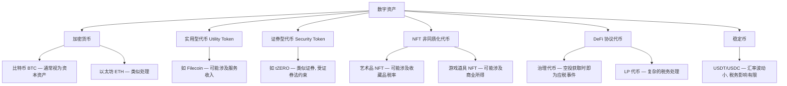
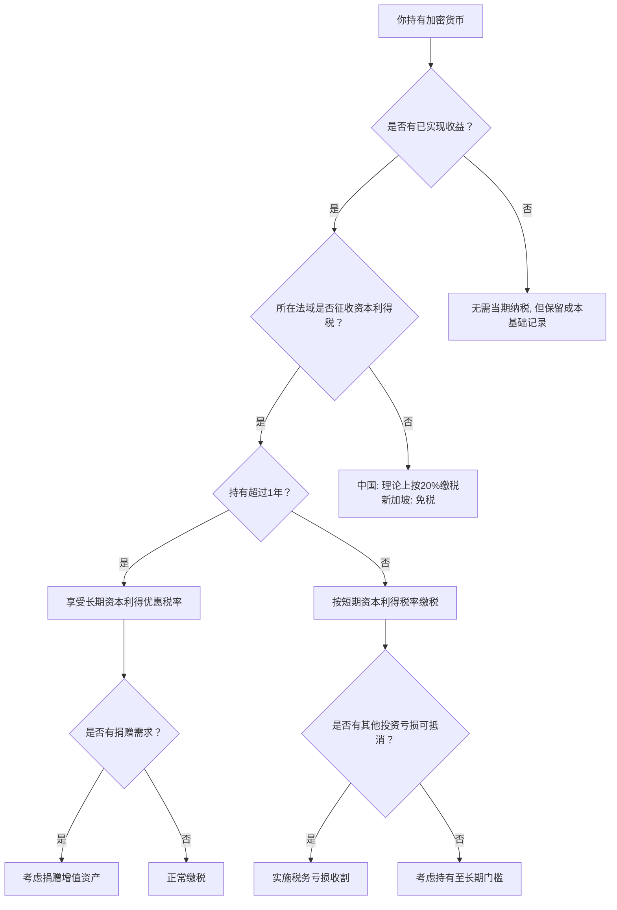

## 七、数字资产和加密货币的税务问题

数字资产（加密货币、NFT、DeFi 代币等）的税务处理是近年来税务筹划领域最具挑战性的议题之一。一方面，数字资产的去中心化、跨境性和技术复杂性给传统税制带来了巨大冲击；另一方面，各国税务机关正加速出台监管规则，持有和交易数字资产的纳税义务日趋明确。本节从资产分类、应税事件识别、计算方法、跨境问题、合规策略五个维度，系统梳理数字资产的税务处理逻辑。

### 1. 数字资产的法律与税务分类

#### 1.1 资产属性认定——决定税务命运的第一步

数字资产在不同法域下的分类直接决定了适用的税种和税率：

| 分类方式 | 代表国家/地区 | 税务处理逻辑 | 典型税种 |
|----------|--------------|-------------|---------|
| **财产/资本资产** | 美国（IRS Notice 2014-21） | 视为财产，处置产生资本利得/损失 | 资本利得税 |
| **虚拟商品** | 中国（无明确认定，实务中参照） | 暂无专门税法，但转让所得理论上属应税所得 | 个人所得税（财产转让所得） |
| **金融资产** | 英国（HMRC） | 视为类似股票的金融资产 | 资本利得税（CGT） |
| **货币** | 萨尔瓦多（比特币为法定货币） | 类似外币处理 | 通常免资本利得税 |
| **无形资产** | 新加坡 | 不征收资本利得税，但商业交易所得征所得税 | 企业所得税 |
| **杂项资产** | 日本（2017年后） | 杂项所得，最高税率55% | 所得税（综合课税） |

**关键认知**：同一笔交易在不同国家可能面临完全不同的税务后果。例如，一个中国税务居民通过海外交易所卖出比特币获利10万元，在中国理论上按"财产转让所得"缴纳20%个人所得税；同一交易如果纳税人是新加坡税务居民且属于非商业性质，则可能完全免税。

#### 1.2 主要数字资产类型的税务属性



### 2. 应税事件全图谱——每一笔操作都可能触发税务义务

#### 2.1 应税事件速查表

| 操作类型 | 是否应税（多数法域） | 所得性质 | 税务处理要点 |
|----------|:-------------------:|---------|-------------|
| 法币买入加密货币 | ❌ 否 | — | 购入成本即为计税基础 |
| 持有不动 | ❌ 否 | — | 未实现收益不征税（绝大多数国家） |
| 卖出换回法币 | ✅ 是 | 资本利得 | 卖出价 − 成本基础 = 应税所得 |
| 加密货币互换（如 BTC→ETH） | ✅ 是 | 资本利得 | 视为先卖后买，需计算原币种的利得 |
| 用加密货币消费 | ✅ 是 | 资本利得 | 消费时点的市值 − 成本基础 = 应税所得 |
| 挖矿收入 | ✅ 是 | 所得税/自雇收入 | 收到时按市价确认收入，同时成为成本基础 |
| 质押收益（Staking） | ✅ 是（争议中） | 所得税 | 收到时按市价确认收入 |
| 空投（Airdrop） | ✅ 是 | 所得税 | 收到时按市价确认收入（成本基础为0或市价） |
| 硬分叉获得新币 | ✅ 是（部分法域） | 所得税 | 美国 IRS 视为收入（2019年指引） |
| DeFi 借贷利息 | ✅ 是 | 利息所得 | 按收到利息时的市价确认 |
| NFT 出售 | ✅ 是 | 资本利得或商业所得 | 取决于创作 vs 转售、频率 |
| 收到工资（加密货币形式） | ✅ 是 | 工资薪金所得 | 按收到时市价折算 |
| 赠与加密货币 | 视法域 | — | 部分国家有赠与税；中国暂无 |

#### 2.2 中国语境下的特殊考量

中国对加密货币的态度具有双重性：2021年9月十部委联合通知明确虚拟货币相关业务活动属于非法金融活动，但从税法角度看：

**理论上仍存在纳税义务的灰色地带**：
- 个人从海外交易所获取的加密货币收益，按《个人所得税法》第一条"在中国境内有住所的个人，从中国境内和境外取得的所得，缴纳个人所得税"
- 加密货币转让所得可归入"财产转让所得"（20%税率）
- 挖矿/质押收益可归入"偶然所得"或"其他所得"

**实操中的困境**：
1. 中国公民在境内从事加密货币交易本身处于政策禁止的灰色地带
2. 税务机关对加密货币的稽查能力正在建设中
3. 申报渠道和申报表格暂无专门设计
4. 银行卡/第三方支付的大额进出可能触发反洗钱调查

**建议**：如果持有大量数字资产并有变现需求，应咨询专业税务律师，评估合规风险。在当前政策环境下，境内居民的加密货币税务处理需要在"依法纳税"与"政策合规"之间寻找平衡。

### 3. 成本基础计算方法——决定你交多少税的核心

#### 3.1 四种主流计算方法

成本基础的计算方法直接影响应税所得额。以下是国际通行的四种方法：

| 方法 | 英文 | 计算逻辑 | 适用场景 | 税务影响 |
|------|------|---------|---------|---------|
| **先进先出法** | FIFO | 最早买入的币最先被卖出 | 简单、多数国家默认 | 币价上涨时税负较高 |
| **后进先出法** | LIFO | 最近买入的币最先被卖出 | 美国不适用于加密货币 | 币价上涨时税负较低 |
| **个别计价法** | Specific ID | 精确指定卖出哪批币 | 灵活性最高，需详细记录 | 可优化税负 |
| **加权平均法** | HIFO/ACB | 按持仓成本的加权平均值 | 加拿大、英国默认 | 中等税负 |

#### 3.2 案例演示：同一笔卖出，不同方法的税负差异

假设以下持仓和交易记录：

```text
2024年1月: 以 $30,000 购入 1 BTC
2024年5月: 以 $45,000 购入 1 BTC
2024年8月: 以 $60,000 购入 1 BTC
2024年12月: 以 $70,000 卖出 1 BTC
```

| 计算方法 | 成本基础 | 应税所得 | 税率20%税额 |
|----------|---------|---------|-----------|
| FIFO（先进先出） | $30,000 | $40,000 | $8,000 |
| LIFO（后进先出） | $60,000 | $10,000 | $2,000 |
| 个别计价（选8月批次） | $60,000 | $10,000 | $2,000 |
| 加权平均 | $45,000 | $25,000 | $5,000 |

**结论**：在币价上涨的市场中，LIFO 或个别计价法（选择高成本批次）可以显著降低当期税负。但前提是你的法域允许该方法，且你有完整的交易记录来支撑。

#### 3.3 个别计价法的实操技巧

个别计价法（Specific Identification）是最灵活但要求最高的方法：

1. **每次交易必须记录**：买入日期、数量、单价、交易所、交易哈希
2. **卖出时需明确指定**：卖出的币来自哪一批买入
3. **记录需在交易时完成**，不能事后追溯选择
4. **建议工具**：Koinly、CoinTracker、TokenTax 等自动生成记录

### 4. 复杂场景的税务处理

#### 4.1 DeFi（去中心化金融）税务

DeFi 的税务处理是目前最复杂的领域，因为传统税法从未预设过这些场景：

**流动性挖矿（Liquidity Mining）**：
- 向 Uniswap 等 DEX 提供流动性 → 存入代币本身可能不触发应税事件（视法域而定）
- 收到 LP 代币 → 有争议，部分税务师认为视同交换（应税）
- 收到交易手续费分成 → 应税所得（收到时按市价）
- 提取流动性时的无常损失 → 可能确认资本损失

**借贷协议（如 Aave、Compound）**：
- 存入资产获得利息 → 利息部分为应税所得
- 借入资产 → 通常不视为应税事件
- 抵押品被清算 → 应税事件（视同出售）

**收益聚合器（如 Yearn Finance）**：
- 存入 → 可能不触发应税
- 自动复投产生的收益 → 每次复投都可能是应税事件
- 这意味着高频复投策略可能产生大量小额应税所得


#### 4.2 NFT 税务

NFT 的税务处理需要区分两个角色：

**创作者（Mint & 首次销售）**：
- 铸造成本（Gas Fee）可作为费用扣除
- 首次销售收入 → 经营所得或自雇收入
- 版税收入（Royalties） → 持续性经营所得

**收藏者/投资者（二级市场交易）**：
- 买入成本 = 购买价格 + Gas Fee
- 卖出收益 = 卖出价格 − 成本基础 − 平台手续费
- 美国：NFT 可能被归类为"收藏品"（Collectibles），资本利得税率最高28%（高于普通资本资产的20%）

**中国特殊情况**：国内NFT（数字藏品）平台的交易所得理论上属于"财产转让所得"，但实操中极少有纳税人主动申报。数字藏品平台通常已代扣代缴相关税费。

#### 4.3 空投和硬分叉

**空投（Airdrop）**：
- 收到空投代币时 → 按当时市价确认为收入
- 成本基础 = 收到时的市价
- 后续卖出时 → 成本基础以上的部分为资本利得
- 常见问题：很多空投代币收到时没有明确市价（刚上线，流动性差），实务中可参考首个有流动性的交易所价格

**硬分叉（Hard Fork）**：
- 2017年 BTC/BCH 分叉是典型案例
- 美国 IRS：收到新币时按市价确认收入（Rev. Rul. 2019-24）
- 中国：尚无明确规定，理论上应按收到时市价确认所得
- 实操难点：分叉币可能在分叉时尚无交易市场

#### 4.4 加密货币工资和薪酬

越来越多的公司（尤其 Web3 行业）用加密货币发放工资或奖金：

- **雇主端**：仍需按工资薪金代扣代缴个人所得税（中国），计算基数为发放时的法币等值
- **员工端**：收到的加密货币按发放日的市场中间价折算为人民币计税
- **汇率确定**：通常参考 CoinGecko、CoinMarketCap 等平台的当日报价
- **后续持有风险**：如果收到后币价下跌，员工仍需按收到时的高价缴税——这是"phantom income"（幻影收入）问题

### 5. 跨境与合规问题

#### 5.1 交易所所在地的税务影响

不同交易所的注册地和合规程度直接影响税务处理：

| 交易所 | 注册地 | KYC要求 | 税务信息报告 | 对用户税务的影响 |
|--------|--------|---------|-------------|----------------|
| Binance | 开曼群岛 | 有 | 部分国家自动报告 | 高 KYC 国家用户可能被自动推送信息 |
| Coinbase | 美国 | 有 | 1099表（美国用户） | 美国用户信息直报 IRS |
| OKX | 塞舌尔 | 有 | 暂无自动报告 | 用户自行申报为主 |
| Bybit | 迪拜 | 有 | 暂无自动报告 | 用户自行申报为主 |
| 去中心化交易所 | 链上 | 无 KYC | 无自动报告 | 完全依赖用户自行申报和链上数据分析 |

**趋势**：OECD 的加密资产报告框架（CARF）将于2026年起在参与国实施，要求交易所自动向税务机关报告用户的交易数据。这意味着"不申报"的空间正在快速缩小。

#### 5.2 CRS 与加密货币

共同申报准则（CRS）目前不直接覆盖加密货币交易所，但：
- 如果加密货币收益转入银行账户，该银行账户信息仍会通过 CRS 交换
- 部分国家已开始将加密资产纳入 CRS 修订版本
- 美国的 FATCA 框架也在考虑覆盖数字资产

#### 5.3 反洗钱（AML）与税务稽查的交叉

加密货币的链上透明性是一把双刃剑：
- 区块链上的每一笔交易永久可追溯
- 链上分析公司（如 Chainalysis、Elliptic）已与多国税务机关合作
- 交易所的 KYC 信息 + 链上分析 = 完整的交易画像
- 混币器（Mixer）的使用本身可能触发更严格的审查

### 6. 税务记录与申报实操

#### 6.1 必须保留的记录清单

| 记录类型 | 具体内容 | 保留期限 | 重要性 |
|----------|---------|---------|:------:|
| 交易记录 | 日期、币种、数量、单价、交易对手 | 至少5年 | ⭐⭐⭐ |
| 钱包地址 | 所有钱包的地址和关联关系 | 永久 | ⭐⭐⭐ |
| 交易所账户 | 注册邮箱、UID、KYC信息 | 永久 | ⭐⭐⭐ |
| 成本基础 | 每次买入的成本和费用 | 至少5年 | ⭐⭐⭐ |
| DeFi 交互 | 智能合约地址、LP代币数量、Gas费 | 至少5年 | ⭐⭐ |
| 空投/分叉记录 | 收到日期、数量、当时市价 | 至少5年 | ⭐⭐ |
| 税务申报表 | 历年申报表副本 | 至少10年 | ⭐⭐⭐ |

#### 6.2 税务计算工具推荐

**国际工具**：
- **Koinly**：支持400+交易所和钱包导入，自动生成税表，支持中国税法（有限）
- **CoinTracker**：与 Coinbase 深度集成，美国用户首选
- **TokenTax**：支持 DeFi 和 NFT，提供税务师咨询服务
- **Accointing**：欧洲用户较多，支持多种成本基础方法
- **CryptoTaxCalculator**：对 DeFi 支持较好，自动识别复杂交易类型

**中国用户特别注意事项**：
- 上述工具主要面向欧美税法，中国税法支持有限
- 建议使用工具生成交易明细，再手动或请税务师按中国税法计算
- 可以导出 CSV 用 Excel/Pandas 自行计算

#### 6.3 自动化税务计算示例（Python）

对于有一定技术能力的用户，可以用 Python 自动处理交易记录：

```python
import pandas as pd
from datetime import datetime

class CryptoTaxCalculator:
    """简易加密货币税务计算器（FIFO方法）"""
    
    def __init__(self):
        self.holdings = {}  # {coin: [(date, qty, cost_per_unit), ...]}
        self.taxable_events = []
    
    def buy(self, date, coin, qty, cost_per_unit, fee=0):
        """记录买入"""
        if coin not in self.holdings:
            self.holdings[coin] = []
        total_cost = cost_per_unit * qty + fee
        self.holdings[coin].append({
            'date': date,
            'qty': qty,
            'cost_per_unit': total_cost / qty,
            'remaining': qty
        })
    
    def sell(self, date, coin, qty, sell_price_per_unit, fee=0):
        """记录卖出（FIFO），计算应税所得"""
        if coin not in self.holdings:
            raise ValueError(f"没有 {coin} 的持仓记录")
        
        remaining_to_sell = qty
        total_cost_basis = 0
        
        for lot in self.holdings[coin]:
            if remaining_to_sell <= 0:
                break
            if lot['remaining'] <= 0:
                continue
            
            sold_from_lot = min(remaining_to_sell, lot['remaining'])
            cost_basis = sold_from_lot * lot['cost_per_unit']
            total_cost_basis += cost_basis
            lot['remaining'] -= sold_from_lot
            remaining_to_sell -= sold_from_lot
        
        proceeds = qty * sell_price_per_unit - fee
        gain_loss = proceeds - total_cost_basis
        
        self.taxable_events.append({
            'date': date,
            'coin': coin,
            'qty': qty,
            'proceeds': proceeds,
            'cost_basis': total_cost_basis,
            'gain_loss': gain_loss,
            'holding_period': '需根据具体买入批次判断'
        })
        
        return gain_loss
    
    def get_tax_summary(self, tax_year=None):
        """生成税务汇总"""
        df = pd.DataFrame(self.taxable_events)
        if tax_year:
            df = df[df['date'].str.startswith(str(tax_year))]
        
        total_gain = df[df['gain_loss'] > 0]['gain_loss'].sum()
        total_loss = df[df['gain_loss'] < 0]['gain_loss'].sum()
        net = total_gain + total_loss
        
        return {
            '总收益': f"¥{total_gain:,.2f}",
            '总损失': f"¥{total_loss:,.2f}",
            '净所得': f"¥{net:,.2f}",
            '交易笔数': len(df),
            '预估税额（20%）': f"¥{max(net, 0) * 0.2:,.2f}"
        }


# 使用示例
calc = CryptoTaxCalculator()
calc.buy('2024-01-15', 'BTC', 0.5, 200000)    # 10万元买入0.5 BTC
calc.buy('2024-06-20', 'BTC', 0.3, 350000)    # 10.5万元买入0.3 BTC
gain = calc.sell('2024-11-10', 'BTC', 0.4, 500000)  # 20万元卖出0.4 BTC
print(f"本次卖出应税所得: ¥{gain:,.2f}")
print(calc.get_tax_summary())
```

### 7. 税务筹划策略

#### 7.1 合法节税的七个方向

**（1）长期持有策略（HODL）**
- 在征收资本利得税的国家（如美国），持有超过1年可享受长期资本利得税率（0%/15%/20%），远低于短期税率（最高37%）
- 中国虽不区分长短期，但持有时间越长，未来政策变化的可能性越大

**（2）税务亏损收割（Tax-Loss Harvesting）**
- 卖出亏损的加密货币，用亏损抵消其他投资收益
- 美国：加密货币目前不受"洗售规则"（Wash Sale Rule）约束——即卖出亏损后可立即买回同一币种（但2025年可能立法改变）
- 中国：暂无明确的洗售规则适用于加密货币

**（3）合理选择成本基础方法**
- 如允许个别计价法，优先卖出成本基础最高的批次
- 需要在交易时就做好记录

**（4）利用免税额度**
- 英国：每年 £3,000 资本利得免税额（2024/25）
- 德国：持有超过1年的加密货币免税
- 澳大利亚：个人持有超过1年的资产享受50%资本利得折扣

**（5）慈善捐赠**
- 在部分国家，将增值的加密货币直接捐赠给合格慈善机构可避免资本利得税，同时获得捐赠抵扣
- 美国：如果持有超过1年，捐赠可按市价全额抵扣且不确认资本利得

**（6）退休账户投资（美国）**
- 通过自管IRA（Self-Directed IRA）或比特币IRA持有加密货币
- 传统IRA：投资收益延税
- Roth IRA：投资收益免税（满足条件）

**（7）移居低税/零税国家**
- 新加坡：无资本利得税
- 阿联酋：无个人所得税
- 葡萄牙：曾对加密货币免征资本利得税（2023年后对短期持有征税）
- 需注意：中国税务居民即使移居海外，仍可能因"住所"标准而被全球征税

#### 7.2 筹划策略决策树



### 8. 常见误区与纠正

| 误区 | 真相 | 风险等级 |
|------|------|:--------:|
| "加密货币匿名，税务局查不到" | 区块链完全透明，交易所KYC信息可被调取，链上分析技术成熟 | 🔴 极高 |
| "不换回法币就不交税" | 加密货币互换、消费、DeFi交互都可能触发应税事件 | 🔴 极高 |
| "空投是免费的，不用交税" | 大多数法域要求收到空投时按市价确认收入 | 🟡 中等 |
| "亏了就不用管" | 即使亏损也应记录，可用于税务亏损收割抵消其他收益 | 🟡 中等 |
| "交易所显示的收益就是应税所得" | 交易所通常不考虑成本基础和费用扣除，数字往往不准确 | 🟡 中等 |
| "稳定币交易不用交税" | USDT/BTC互换仍是应税事件（BTC的利得/损失需确认） | 🟡 中等 |
| "挖矿收入只在卖出时交税" | 收到挖矿奖励时即为应税事件，不是卖出时 | 🟡 中等 |
| "DeFi收益是去中心化的，不用交" | 去中心化不等于免税，税务义务仍然存在 | 🔴 极高 |
| "只在交易所买的才需要报" | 钱包间转账虽通常不触发应税，但所有来源的收益都需申报 | 🟡 中等 |
| "几年前的交易可以不报了" | 多数国家追征期为3-7年，逃税无追征期限 | 🔴 极高 |

### 9. 2024-2025年全球监管趋势

#### 9.1 关键政策变化

**美国**：
- 2024年起，交易所需向 IRS 报告用户的成本基础和收益（Form 1099-DA）
- 拜登政府提议对挖矿征收30%消费税（DAME税），尚未通过
- 洗售规则可能扩展至加密货币

**欧盟**（MiCA 框架 + DAC8）：
- 加密资产市场监管法规（MiCA）2024年全面生效
- DAC8 指令要求加密资产服务商自动向税务机关报告用户数据
- 2026年起全面实施信息自动交换

**OECD（CARF 框架）**：
- 加密资产报告框架（Crypto-Asset Reporting Framework）
- 47个参与国承诺在2027年前实施
- 覆盖中心化交易所、DeFi（部分）、NFT平台

**中国**：
- 维持2021年十部委通知的高压态势
- 数字人民币（e-CNY）与加密货币区别对待
- 暂无专门针对加密货币的税收细则出台
- 但不排除未来以"追溯性文件"方式明确征税规则

#### 9.2 对投资者的实际影响

```text
2024-2025: 交易所开始收集和报告税务信息（美国率先）
2026:       OECD CARF 框架在参与国启动
2027:       全面信息自动交换，"信息差"优势消失
趋势:       全球税务透明化不可逆，合规申报是唯一出路
```

### 10. 专业支持与下一步行动

#### 10.1 何时需要专业税务师

以下情况建议寻求专业帮助：
- 持有或交易金额超过 50 万元人民币
- 涉及复杂的 DeFi 操作（流动性挖矿、收益聚合等）
- 持有 NFT 且有创作/销售收入
- 跨多个交易所和钱包，交易记录分散
- 有跨境交易（如海外交易所、海外钱包）
- 收到加密货币形式的工资或服务报酬
- 有大额空投或硬分叉收益
- 面临税务稽查或问询

#### 10.2 自查清单

```text
□ 是否保留了所有加密货币交易的完整记录？
□ 是否知道每笔交易的成本基础？
□ 是否了解所在法域的应税事件定义？
□ 是否计算了本年度的应税所得？
□ 是否利用了可用的税收优惠和抵扣？
□ 是否评估了跨境交易的税务影响？
□ 是否有应急计划应对政策变化？
□ 是否咨询过专业税务师？
```

### 本节小结

数字资产税务的核心逻辑与传统资产税务一脉相承——有收入就要纳税，有交易就可能产生所得。不同之处在于技术复杂性和监管滞后性带来的不确定性。应对策略可以概括为三句话：

1. **全面记录**：每一笔交易、每一次链上交互都留痕
2. **及时申报**：不要心存侥幸，全球税务透明化是不可逆的趋势
3. **专业求助**：涉及金额较大或交易复杂时，投资一次专业咨询远比承担稽查风险划算

加密货币不是法外之地。随着 CARF、DAC8 等国际框架的推进，以及链上分析技术的成熟，"灰色空间"正在快速缩小。合规申报既是法律义务，也是保护自身资产安全的必要措施。
