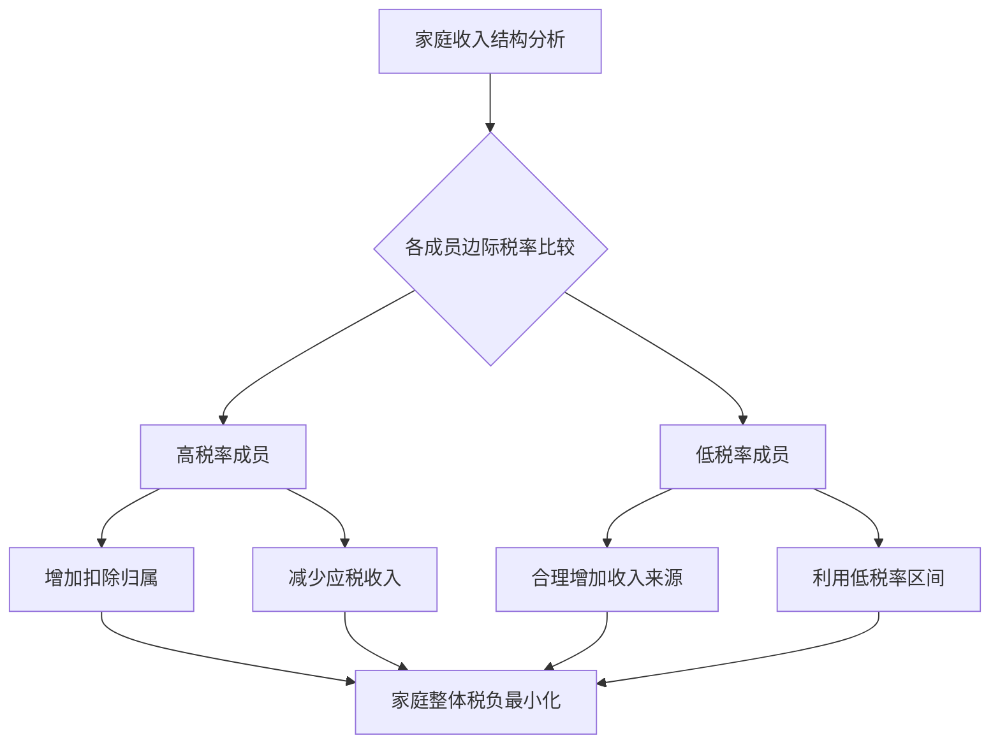
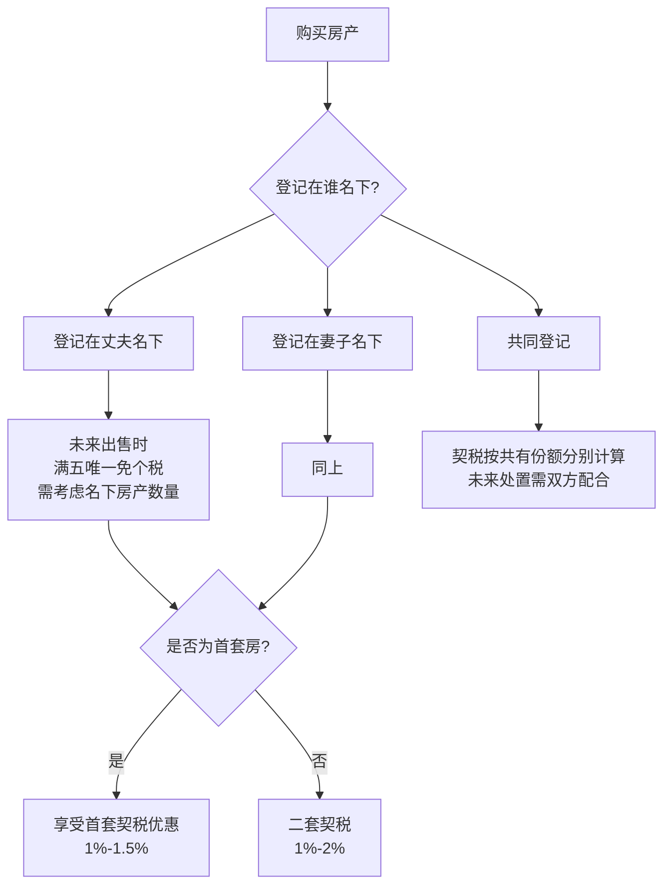
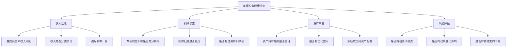

## 八、家庭税务筹划的整体视角

### 8.1 为什么要把家庭作为税务筹划的基本单元

大多数人在做税务筹划时，目光只停留在自己身上——"我的工资怎么少交税""我的年终奖怎么选计税方式"。但税务筹划的真正威力在于**跳出个体，站在家庭的高度看问题**。

原因很简单：中国个人所得税以**个人为纳税单位**，但家庭成员之间的收入、支出、资产是高度关联的。同一个税务事实，放在不同家庭成员身上，税负可能天差地别。

举个最直观的例子：

> 张先生月薪3万，妻子全职在家。如果把家庭看作一个整体，全部税负压在张先生一个人身上。但如果妻子名下有一套出租房产，租金收入按财产租赁所得计税（扣除20%费用后税率20%），而张先生的工资收入边际税率已经达到25%甚至更高。通过合理安排资产持有结构，家庭整体税负可以显著降低。

**家庭税务筹划的核心思想**：在合法合规的前提下，通过优化收入在家庭成员间的分配、资产的持有结构、扣除的申报策略，实现**家庭整体税后可支配收入最大化**。

#### 8.1.1 个体视角与家庭视角的差异

| 维度 | 个体视角 | 家庭视角 |
|------|----------|----------|
| 收入规划 | 只看自己的收入结构 | 统筹所有家庭成员的收入来源 |
| 扣除申报 | 用自己的扣除额度 | 在家庭成员间分配扣除（如房贷、子女教育） |
| 资产配置 | 资产登记在自己名下 | 根据税负差异选择最优登记人 |
| 风险考量 | 只考虑个人风险 | 考虑家庭整体的税务风险敞口 |
| 时间维度 | 当年优化 | 跨生命周期的长期规划 |

#### 8.1.2 家庭税务筹划的法律基础

家庭税务筹划建立在以下法律框架之上：

- **《个人所得税法》**：以个人为纳税单位，但专项附加扣除允许夫妻间选择扣除主体
- **《民法典·婚姻家庭编》**：夫妻共同财产与个人财产的界定，影响资产持有方式
- **《契税法》《印花税法》**：家庭成员间房产、股权转让的税收规定
- **《继承法》相关税收规定**：遗产传承中的税务考量

需要特别强调的是，家庭税务筹划的前提是**合法合规**。家庭成员之间的收入转移必须有真实的业务背景或法律依据（如赠与、继承、合理的报酬支付），虚构交易或伪造合同是违法行为，不在讨论范围内。

### 8.2 家庭成员收入结构优化

#### 8.2.1 收入在家庭成员间的分配原理

中国个人所得税采用**七级超额累进税率**（综合所得），边际税率从3%到45%。这意味着收入越高，每一元增量收入的税负越重。

```text
应纳税所得额 = 收入总额 - 60000（基本扣除）- 专项扣除 - 专项附加扣除 - 其他扣除
```

**核心策略**：让收入更多地流向税率较低的家庭成员，让扣除更多地归集到税率较高的家庭成员。



#### 8.2.2 夫妻间的收入分配策略

**策略一：工资薪金的优化**

如果夫妻双方都有工作，需要比较两人的边际税率：

- **案例**：丈夫月薪4万（边际税率25%），妻子月薪8000（边际税率3%）
  - 专项附加扣除（如房贷利息、子女教育）应优先由丈夫申报
  - 如果丈夫所在公司有福利政策（如通讯补贴、交通补贴），应尽量让丈夫享受

**策略二：投资收益的归属安排**

- 股票、基金等金融资产的分红和转让收益，应尽量安排在税率较低的家庭成员名下
- 个体工商户的经营所得，如果家庭成员中有人是低税率者，可以考虑由其作为经营者

**策略三：年终奖的组合优化**

当夫妻双方都有年终奖时，需要找到最优的分配方案：

| 分配方案 | 丈夫年终奖 | 妻子年终奖 | 合计应纳税额 |
|----------|-----------|-----------|-------------|
| 方案A | 144,000 | 36,000 | 14,190 + 1,080 = 15,270 |
| 方案B | 100,000 | 80,000 | 9,790 + 5,790 = 15,580 |
| 方案C | 120,000 | 60,000 | 11,790 + 3,590 = 15,380 |

*注：以上为简化计算，实际需结合综合所得汇算清缴综合判断*

#### 8.2.3 代际间的收入分配

**父母与成年子女之间**：

- 如果父母已退休，边际税率较低（养老金免征个税），而子女处于事业上升期，可以考虑：
  - 家庭出租房产的租金收入登记在父母名下（如适用核定征收，实际税负可能更低）
  - 父母持有大额存单，利息收入免征个税
  - 子女创业的个体工商户，如果父母参与经营且边际税率更低，可合理分配经营所得

**注意事项**：代际间的收入转移必须有真实依据。单纯为了避税将资产名义上转给父母/子女，但实际控制权和收益权仍在自己手中，可能被税务机关认定为**虚假安排**。

### 8.3 专项附加扣除的家庭优化

专项附加扣除是家庭税务筹划中**最容易操作、见效最快**的领域。

#### 8.3.1 扣除项目与分配规则

| 扣除项目 | 扣除标准 | 分配规则 | 家庭最优策略 |
|----------|----------|----------|-------------|
| 子女教育 | 2000元/月/孩 | 父母各50%或一方100% | 归属高税率方 |
| 继续教育 | 400元/月（学历）或3600元/年（证书） | 本人扣除 | 本人无法扣除时，子女教育的额度更应给配偶 |
| 大病医疗 | 超15000元部分，最高80000元 | 本人或配偶扣除 | 归属高税率方 |
| 住房贷款利息 | 1000元/月 | 首套房，夫妻约定 | 归属高税率方 |
| 住房租金 | 800-1500元/月 | 工作城市无房的一方 | 归属高税率方 |
| 赡养老人 | 3000元/月 | 独生子女全额，非独生分摊 | 归属高税率方 |
| 3岁以下婴幼儿照护 | 2000元/月/孩 | 父母各50%或一方100% | 归属高税率方 |

#### 8.3.2 扣除归属的优化计算

**案例**：李先生（月薪3.5万，边际税率25%）和王女士（月薪1.2万，边际税率10%）

家庭扣除项目：
- 2个孩子（一个上学、一个3岁以下）：4000元/月
- 房贷利息：1000元/月
- 赡养老人：3000元/月

**分配方案对比**：

| 项目 | 全部归丈夫 | 全部归妻子 | 丈夫多归 | 优化后 |
|------|-----------|-----------|---------|--------|
| 子女教育(上学) | 1000 | 1000 | 1000 | 1000 |
| 婴幼儿照护 | 2000 | 2000 | 2000 | 2000 |
| 房贷利息 | 1000 | 1000 | 1000 | 1000 |
| 赡养老人 | 3000 | 3000 | 3000 | 3000 |
| 月扣除合计 | 7000 | 7000 | 7000 | 7000 |
| 丈夫节税(25%) | 1750 | 0 | 1250 | 1750 |
| 妻子节税(10%) | 0 | 700 | 450 | 0 |
| **家庭合计节税** | **1750** | **700** | **1700** | **1750** |

结论：所有扣除项目全部归属高税率方（丈夫），家庭整体节税效果最优，每月多省1050元，全年12600元。

#### 8.3.3 常见扣除分配误区

**误区一：默认各50%分配**

很多人在个税APP上选择扣除比例时，默认选"夫妻各50%"。当双方边际税率差异较大时，这是最差的选择。

**纠正方法**：每年年初，比较双方的边际税率，将所有可选扣除归集到高税率方。

**误区二：忽略大病医疗的归属**

大病医疗支出超过15000元的部分可以扣除，最高80000元。这笔扣除可以由本人或配偶扣除，如果一方收入较高，应由高税率方扣除。

**误区三：忘记扣除分配的动态调整**

如果一方收入在年中发生较大变化（如升职加薪、失业、换工作），应及时调整扣除分配方案。

### 8.4 家庭资产持有的税务架构

#### 8.4.1 不动产的家庭持有策略

不动产是大多数家庭最大的资产，持有方式直接影响交易环节和持有环节的税负。

**房产登记人选择的考量因素**：



**关键规则**：

1. **契税优惠**：首套房90平米以下契税1%，90平米以上1.5%；二套房1%-2%（各地不同）。"首套"以家庭为单位认定（夫妻+未成年子女），登记在名下房产较少的一方更可能享受首套优惠。

2. **房产税试点**：上海、重庆已试点房产税，未来可能扩大。家庭人均面积免征额度的计算需要提前规划。

3. **出售时的个人所得税**：满五唯一免征个税。如果家庭有多套房产，可以考虑分散在不同家庭成员名下，确保每人都有"满五唯一"的机会。

#### 8.4.2 金融资产的家庭配置

**银行存款与理财**：

- 存款利息目前免征个税，但未来政策可能变化
- 大额存单、结构性存款等收益的税务处理需要关注政策动向
- 理财产品的税务处理因产品类型不同而异

**股票与基金**：

- A股个人投资者的股票转让差价暂免个税
- 股息红利：持股超1年免税，1个月至1年按50%计入应税所得，1个月以内全额计入
- 基金分红：个人投资者暂不征收个税

**保险**：

- 人寿保险的理赔金免征个税
- 年金保险的领取涉及个税，但有递延纳税的效果
- 家庭成员间合理配置保险，既可以节税，又可以实现资产传承

#### 8.4.3 家庭成员间资产转移的税务成本

家庭成员间的资产转移并非零成本，需要考虑以下税种：

| 转移方式 | 涉及税种 | 税负水平 | 适用场景 |
|----------|---------|---------|---------|
| 赠与房产（直系亲属） | 契税3%，免个税和增值税 | 中等 | 父母过户给子女 |
| 赠与房产（非直系） | 契税3%，个税20% | 较高 | 非亲属间赠与 |
| 继承房产 | 契税（法定继承免征），免个税 | 最低 | 遗产传承 |
| 夫妻间更名 | 免契税、免个税 | 零成本 | 婚内财产调整 |
| 股权赠与（直系亲属） | 免个税，印花税0.05% | 极低 | 家族企业传承 |
| 股权赠与（非直系） | 按财产转让所得20% | 较高 | 非亲属间转让 |

**关键发现**：直系亲属间的资产赠与和继承，在税收上享有显著优惠。家庭税务筹划应充分利用这些优惠政策，提前规划资产的持有和传承路径。

### 8.5 家庭经营的税务架构

#### 8.5.1 家庭经营模式的选择

如果家庭有经营性收入（如开店、工作室、自由职业），选择合适的经营形式至关重要：

| 经营形式 | 税种 | 税率 | 优点 | 缺点 |
|----------|------|------|------|------|
| 个体工商户 | 个人所得税（经营所得） | 5%-35%累进 | 注册简单，成本低 | 承担无限责任 |
| 个人独资企业 | 个人所得税（经营所得） | 5%-35%累进 | 可核定征收 | 承担无限责任 |
| 合伙企业 | 个人所得税（经营所得） | 5%-35%累进 | 灵活的利润分配 | 合伙人承担无限责任 |
| 有限责任公司 | 企业所得税+分红个税 | 25%+20% | 有限责任保护 | 双重征税 |

**家庭经营架构的核心原则**：

1. **谁的边际税率低，谁当经营者**：如果家庭成员A的工资边际税率是30%，而成员B没有其他收入来源，由B成立个体工商户经营，整体税负更低。

2. **利用核定征收**：部分地区的个体工商户可以申请核定征收，实际税负率可能低至0.5%-3.5%，远低于查账征收的累进税率。

3. **小规模纳税人优惠**：月销售额10万元以下（季度30万以下）免征增值税，家庭小型经营应充分利用。

#### 8.5.2 家庭劳务报酬的优化

如果家庭成员有兼职收入、咨询收入、稿酬等劳务报酬，可以考虑：

- **转化为经营所得**：如果收入稳定且金额较大，成立工作室（个体户/个独）将劳务报酬转化为经营所得，可以列支成本费用，降低税基
- **分次支付**：劳务报酬按次预扣，单次金额越低，适用税率越低
- **费用报销**：与劳务相关的合理支出（如交通、通讯、设备），可以在经营所得中列支

#### 8.5.3 家庭企业间的关联交易注意事项

如果家庭成员分别持有企业，企业间的交易（如A企业向B企业采购服务）需要特别注意：

- 价格必须符合**独立交易原则**（即与非关联方交易的价格一致）
- 需要有真实的业务背景和完整的合同、发票
- 税务机关有权对关联交易进行**特别纳税调整**

### 8.6 跨代际的税务规划

#### 8.6.1 教育金的税务考量

子女教育是家庭最大的长期支出之一，不同的储蓄方式有不同的税务影响：

| 储蓄方式 | 收益税负 | 流动性 | 适合场景 |
|----------|---------|--------|---------|
| 银行定期存款 | 免税（目前） | 高 | 短期储蓄 |
| 教育储蓄保险 | 领取时部分征税 | 低 | 长期规划 |
| 教育基金定投 | 基金分红免税，赎回差价暂免 | 中 | 中长期增值 |
| 子女名下存款 | 免税（目前） | 高 | 长期储蓄 |
| 教育信托 | 信托收益征税 | 低 | 高净值家庭 |

#### 8.6.2 养老金的家庭统筹

**基本养老保险**：个人缴纳部分在计算个税时扣除（专项扣除），这是最基础的养老税务优惠。

**企业年金/职业年金**：
- 缴费阶段：个人缴费不超过本人缴费工资4%的部分，暂不缴纳个税
- 投资阶段：投资收益暂不缴纳个税
- 领取阶段：全额按照"工资、薪金所得"项目适用税率计税

**个人养老金**：
- 每年最高缴存12000元，可以在个税前扣除
- 投资阶段：收益暂不征税
- 领取阶段：单独按照3%的税率计税

**家庭养老税务优化策略**：

1. 高税率方优先缴存个人养老金（节税效果最大）
2. 如果企业有企业年金，尽量参加（企业缴费部分相当于额外收入）
3. 父母赡养的专项附加扣除，应归属边际税率高的子女

#### 8.6.3 遗产与赠与的税务规划

目前中国尚未开征遗产税和赠与税，但以下环节仍有税务成本：

- **房产继承**：法定继承人继承房产免征契税和个税，但非法定继承人（如遗赠给朋友）需缴纳3%契税
- **房产赠与**：直系亲属赠与免征个税和增值税，但受赠方需缴纳3%契税
- **股权继承**：直系亲属继承股权免征个税

**提前规划的建议**：

1. 大额不动产尽量通过**继承**而非赠与传承（继承的税务成本最低）
2. 如果有多套房产，可以考虑在生前通过**满五唯一**的方式出售再购买，避免后代继承后出售时无法享受满五唯一优惠
3. 家族企业的股权传承，应提前规划好代际交接的时间点，利用股权赠与的免税政策

### 8.7 家庭年度税务健康检查

#### 8.7.1 年度检查清单

每年1-3月（汇算清缴前），家庭应进行一次全面的税务健康检查：



#### 8.7.2 汇算清缴的家庭策略

每年3月1日至6月30日的综合所得汇算清缴，是家庭税务筹划的**最后优化窗口**：

1. **确认扣除归属**：检查全年的专项附加扣除归属是否正确，如有错误可以在汇算时更正
2. **年终奖计税方式**：选择"单独计税"或"并入综合所得"，需要对两种方式分别计算后选择最优
3. **夫妻分别汇算**：虽然各自独立申报，但扣除归属的选择会影响双方的应纳税额
4. **退税最大化**：如果一方预扣税款较多，应确保其享受所有可享受的扣除和优惠

#### 8.7.3 家庭税务台账模板

建议每个家庭建立简易的税务台账，记录以下信息：

```markdown
## 家庭税务台账

### 成员信息
| 成员 | 年收入 | 收入类型 | 边际税率 | 社保基数 |
|------|--------|----------|----------|----------|
| 丈夫 |        | 工资+劳务 |         |          |
| 妻子 |        | 工资     |         |          |
| 父亲 |        | 退休金   | 免税     |          |
| 母亲 |        | 退休金   | 免税     |          |

### 扣除归属
| 项目 | 月扣除额 | 归属成员 | 年节税额 |
|------|----------|----------|----------|
| 子女教育 |        |          |          |
| 房贷利息 |        |          |          |
| 赡养老人 |        |          |          |

### 资产持有
| 资产 | 登记人 | 购入时间 | 购入价格 | 当前价值 |
|------|--------|----------|----------|----------|
| 自住房产 |    |          |          |          |
| 投资房产 |    |          |          |          |
| 股票账户 |    |          |          |          |
```

### 8.8 不同家庭生命周期的税务筹划重点

#### 8.8.1 新婚家庭（0-5年）

- **重点**：扣除归属优化、首套房购置的税务规划
- **策略**：
  - 婚前各自名下的房产会影响婚后的首套房认定
  - 婚后应重新评估扣除归属（双方收入变化后最优方案可能改变）
  - 如有购房计划，提前规划登记人以享受契税优惠

#### 8.8.2 育儿家庭（5-15年）

- **重点**：子女教育扣除、婴幼儿照护扣除、教育金规划
- **策略**：
  - 两个孩子的扣除额可达4000元/月，全部归属高税率方效果显著
  - 开始为子女教育储蓄，选择税务友好的储蓄方式
  - 如一方需要全职照顾家庭，另一方的扣除归属更重要

#### 8.8.3 成熟家庭（15-30年）

- **重点**：资产增值的税务管理、赡养老人的扣除、子女独立后的调整
- **策略**：
  - 家庭资产规模较大，需要关注资产持有结构的税务影响
  - 子女成年后收入独立，家庭扣除项目可能减少
  - 开始规划养老相关的税务安排（个人养老金、企业年金）

#### 8.8.4 退休家庭（30年以上）

- **重点**：养老金的税务管理、资产传承规划、医疗费用扣除
- **策略**：
  - 退休金免征个税，但其他收入（如房租、投资收益）仍需纳税
  - 大病医疗扣除在退休后可能更有价值（医疗支出增加）
  - 提前规划不动产的传承方式（继承 vs 赠与）

### 8.9 常见家庭税务筹划案例

#### 8.9.1 案例一：双职工家庭的扣除优化

**家庭情况**：
- 丈夫：月薪4万，年终奖10万
- 妻子：月薪1.5万，年终奖3万
- 2个孩子（均在上学），房贷月供，赡养双方老人

**优化前**（扣除各50%）：
- 丈夫年应纳税所得额：48万+10万-6万-3.6万（社保）-4.2万（扣除50%）= 44.2万
- 妻子年应纳税所得额：18万+3万-6万-1.8万（社保）-4.2万（扣除50%）= 9万

**优化后**（扣除全部归丈夫）：
- 丈夫年应纳税所得额：48万+10万-6万-3.6万-8.4万（扣除100%）= 40万
- 妻子年应纳税所得额：18万+3万-6万-1.8万-0 = 13.2万

**节税效果**：丈夫减少4.2万应税所得×25%边际税率 = 节省10,500元/年
妻子增加4.2万应税所得×10%边际税率 = 增加4,200元/年
**净节税：6,300元/年**

#### 8.9.2 案例二：一方高收入一方无业的家庭

**家庭情况**：
- 丈夫：年薪80万（边际税率35%）
- 妻子：全职在家，无收入
- 1个孩子，赡养老人

**优化策略**：
1. 所有扣除归丈夫：子女教育+赡养老人+房贷 = 约7.2万/年，节税25,200元
2. 妻子如果有闲置资金，可以购买国债（利息免税）或大额存单
3. 如果妻子有兼职能力，可以成立个体工商户，利用经营所得的低税率区间
4. 考虑妻子名下持有出租房产，租金收入独立计税

#### 8.9.3 案例三：三代同堂家庭的综合筹划

**家庭情况**：
- 爷爷奶奶：退休，有退休金和一套出租房
- 父亲：企业主，年利润200万
- 母亲：月薪2万
- 儿子：大学在读

**优化策略**：
1. 爷爷的出租房收入：核定征收下实际税负约2%，无需优化
2. 父亲的企业：考虑将部分利润以工资形式发放给母亲（边际税率低于企业所得税率25%）
3. 父亲的个税：充分利用赡养老人扣除（归父亲）、子女教育扣除（归父亲或母亲，视边际税率而定）
4. 儿子成年后：如果开始工作，家庭扣除归属需要重新规划
5. 长期规划：爷爷奶奶的房产通过继承方式传给父亲（税务成本最低）

### 8.10 家庭税务筹划的风险边界

#### 8.10.1 合法筹划与违法避税的界限

| 维度 | 合法筹划 | 违法避税 |
|------|----------|----------|
| 交易真实性 | 有真实业务背景 | 虚构交易或伪造合同 |
| 安排合理性 | 符合商业逻辑 | 无合理商业目的 |
| 信息完整性 | 如实申报 | 隐瞒或虚报 |
| 政策利用 | 合法利用税收优惠 | 滥用税收政策 |

#### 8.10.2 税务机关关注的家庭避税行为

1. **阴阳合同**：房产交易中签订两份不同价格的合同
2. **虚假赠与**：名为赠与实为买卖，逃避交易税款
3. **虚构扣除**：虚报子女教育、赡养老人等扣除项目
4. **收入转移**：将个人收入转入家庭成员名下的壳公司
5. **拆分收入**：将一笔收入拆分成多笔，利用低税率区间

#### 8.10.3 风险防范建议

1. **保留完整凭证**：所有家庭成员间的资金往来，保留银行转账记录和合理说明
2. **如实申报**：不隐瞒收入，不虚报扣除
3. **咨询专业人士**：复杂的家庭税务筹划，建议咨询税务师或会计师
4. **关注政策变化**：税收政策频繁调整，及时更新筹划方案
5. **定期自查**：每年汇算清缴前进行家庭税务健康检查

### 8.11 本节核心要点

1. **家庭是税务筹划的基本单元**：跳出个体视角，统筹考虑家庭整体税负
2. **扣除归属是最低成本的优化手段**：所有可选扣除应归属边际税率最高的家庭成员
3. **资产持有结构影响长期税负**：不动产、金融资产、股权的登记人选择需要前瞻性规划
4. **经营形式的选择至关重要**：个体户、个独、公司的税负差异显著，应根据家庭情况选择
5. **跨代际规划是高级技巧**：教育金、养老金、遗产传承都需要提前布局
6. **年度税务健康检查不可少**：每年至少一次全面审查，及时调整策略
7. **合法合规是底线**：所有筹划必须有真实业务背景，保留完整凭证
