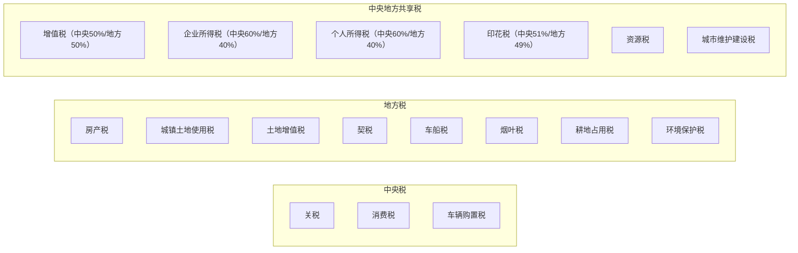
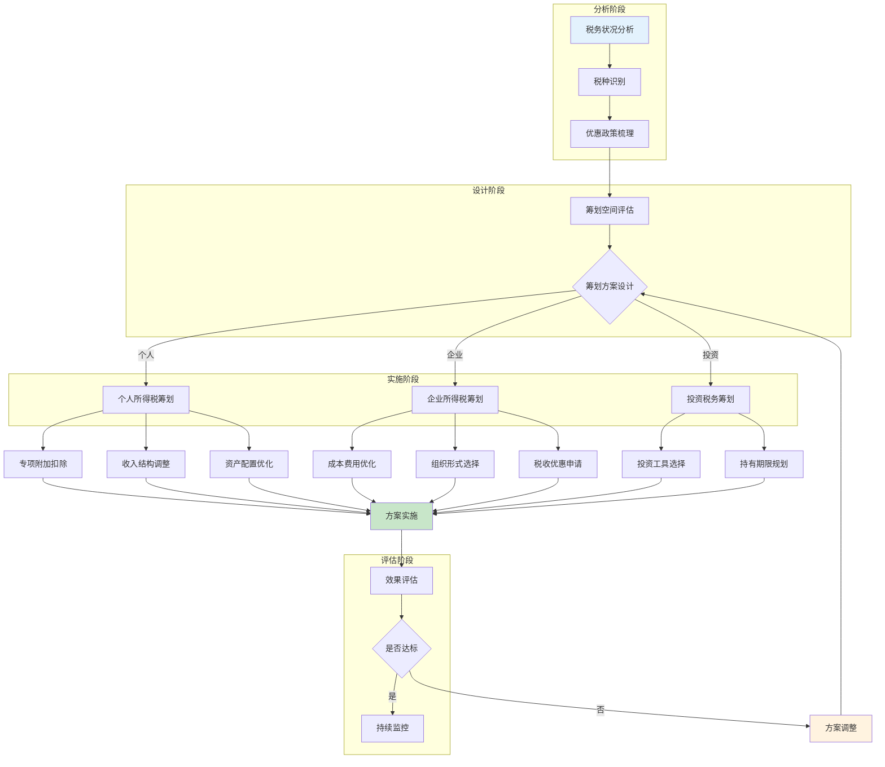
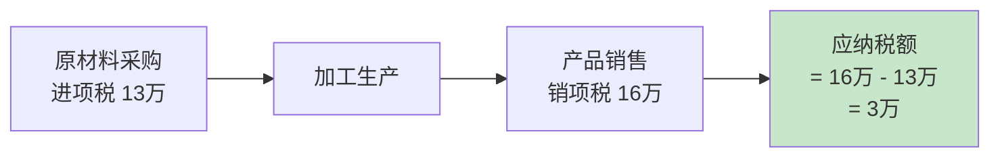
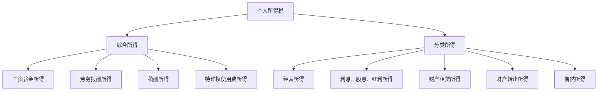
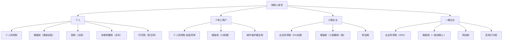
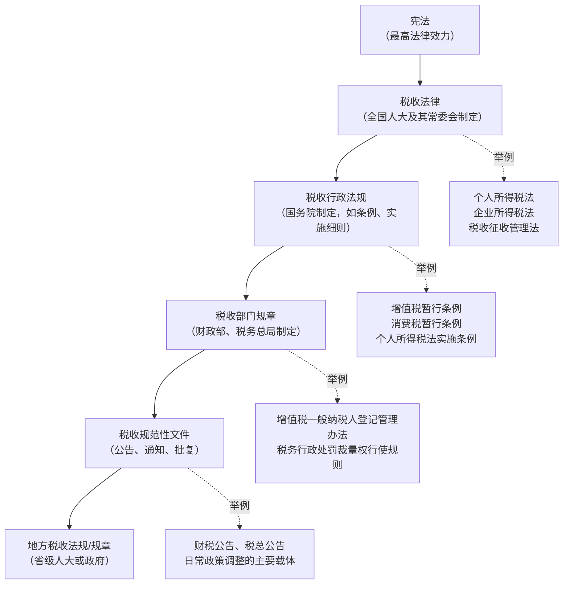
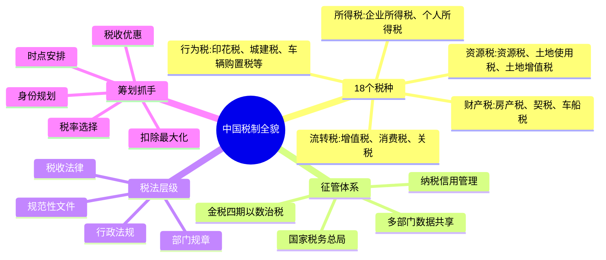

# 一、中国税制概览

税收是国家财政收入的基石，也是每个公民和企业无法回避的经济义务。理解中国税制的全貌，是进行任何税务筹划的前提——你无法优化你不了解的东西。本章将从税制架构、税种体系、征管机制三个维度，系统梳理中国现行税制的完整图景。

---

## 1.0 中国税制的历史演进

理解现行税制，需要先了解它是怎么来的。中国税制经历了数次根本性变革，每一次改革都深刻影响了企业和个人的税负结构。

### 1.0.1 关键改革节点

| 时间 | 改革事件 | 核心影响 |
|------|---------|---------|
| 1994年 | 分税制改革 | 中央与地方按税种划分收入，建立国税/地税两套征管体系 |
| 2009年 | 增值税转型 | 生产型增值税改为消费型，允许抵扣固定资产进项税 |
| 2012-2016年 | 营改增 | 全面取消营业税，改征增值税，打通全行业抵扣链条 |
| 2018年 | 国地税合并 | 省级及以下国税、地税机构合并，统一征管 |
| 2019年 | 个税改革 | 引入综合与分类相结合的个人所得税制，新增专项附加扣除 |
| 2021-2024年 | 金税四期 | 以"以数治税"为核心的智慧税务系统上线 |

### 1.0.2 分税制的底层逻辑

1994年分税制改革是理解中国税制的关键起点。其核心是将税收收入在中央和地方之间进行分配：



这一体制的实务意义在于：**地方政府有动力扶持本地税源企业**，因为企业所得税、增值税的地方分成是地方财政的核心收入。这也解释了为什么各地会出台差异化的招商引资税收优惠政策。

---

## 1.1 税务规划总体框架

税务规划需要在合法合规的前提下，通过合理安排降低税负。需要特别强调的是，**税务筹划与偷税漏税有本质区别**——前者是在法律框架内的合理安排，后者是违法行为。



**税务筹划四原则**：

| 原则 | 含义 | 实务要点 |
|------|------|---------|
| 合法性 | 所有筹划必须在法律框架内进行 | 不做阴阳合同、不虚开发票、不隐瞒收入 |
| 前瞻性 | 在经济行为发生前进行规划 | 业务发生后再调整通常为时已晚 |
| 整体性 | 考虑所有税种的综合影响 | 降低一种税可能导致另一种税增加 |
| 成本效益 | 筹划收益应大于实施成本 | 人力、时间、合规成本都要计入 |

---

## 1.2 中国现行税种体系

中国目前共有**18个税种**，这是2016年"营改增"全面完成后确立的格局。按征税对象可以分为五大类。

### 1.2.1 流转税类

流转税是对商品和服务在流转过程中产生的流转额征税，是中国税收收入的绝对主力，合计占比超过50%。

#### （1）增值税

**增值税是中国第一大税种**，占全部税收收入的约40%。它是对商品（含应税劳务、应税服务）在流转过程中产生的增值额征收的一种税。

**核心机制——抵扣链条**：



增值税的设计精妙之处在于：**每个环节只对增值部分征税**，通过进项抵扣机制避免重复征税。这也是为什么增值税发票如此重要——它是抵扣链条的凭证。

**增值税税率体系（2024年现行）**：

| 税率 | 适用范围 | 典型行业 |
|------|---------|---------|
| 13% | 销售货物、加工修理修配、有形动产租赁 | 制造业、零售业、机械设备租赁 |
| 9% | 交通运输、建筑、基础电信、不动产租赁、农产品 | 物流、建筑、房地产、农业 |
| 6% | 金融、现代服务、生活服务、增值电信 | 互联网、咨询、餐饮、教育 |
| 0% | 出口货物 | 出口退税 |

**小规模纳税人 vs 一般纳税人**：

| 维度 | 小规模纳税人 | 一般纳税人 |
|------|-------------|-----------|
| 年销售额标准 | ≤500万元 | >500万元（或主动申请） |
| 税率/征收率 | 3%（征收率） | 13%/9%/6%（税率） |
| 进项抵扣 | 不可抵扣 | 可抵扣 |
| 发票 | 自开或代开普通发票 | 可开增值税专用发票 |
| 适用场景 | 小微企业、个体户 | 中大型企业、供应链企业 |

**实务要点**：小规模纳税人月销售额10万元以下（季度30万元以下）免征增值税（截至2027年12月31日的政策）。这是小微企业最重要的税收优惠之一。

#### （2）消费税

消费税是对特定消费品在生产（或进口）环节征收的一种税，属于"选择性消费税"。其设计目的是**调节消费结构、引导消费方向、筹集财政收入**。

**现行消费税税目及税率**：

| 税目 | 税率 | 征收环节 | 政策意图 |
|------|------|---------|---------|
| 烟 | 56%或36%（甲类/乙类卷烟）+从量税 | 生产/进口 | 控制烟草消费 |
| 酒 | 白酒20%+0.5元/斤；啤酒250元/吨 | 生产 | 引导健康消费 |
| 高档化妆品 | 15% | 生产/进口 | 调节高消费 |
| 贵重首饰及珠宝玉石 | 10%或5% | 生产/零售 | 调节奢侈品消费 |
| 高尔夫球及球具 | 10% | 生产/进口 | 调节奢侈消费 |
| 高档手表 | 20% | 生产/进口 | 调节奢侈消费 |
| 成品油 | 1.2-1.52元/升 | 生产/进口 | 调节能源消费 |
| 小汽车 | 1%-40%（按排量阶梯） | 生产/进口 | 引导节能减排 |
| 摩托车 | 3%-10% | 生产/进口 | 调节消费 |

**实务影响**：消费税在生产环节征收，意味着生产企业承担了大部分消费税负。这也是为什么茅台等高端白酒的消费税负担极重——20%从价税加0.5元/斤从量税。

#### （3）关税

关税是对进出境货物和物品征收的税。由海关负责征收，中央独享。

- **进口关税**：按货物分类确定税率，最惠国税率通常为0-65%
- **出口关税**：对少数资源性产品征收（如稀土、钨等），一般为10-50%
- **自贸区优惠**：RCEP、中韩FTA等自贸协定下享受更低税率

### 1.2.2 所得税类

所得税是对纳税人的所得（利润或收入）征收的税，是调节收入分配的核心工具。

#### （1）企业所得税

企业所得税是对企业和其他取得收入的组织的应纳税所得额征收的税。

**基本税率与优惠政策**：

| 纳税人类型 | 税率 | 适用条件 |
|-----------|------|---------|
| 一般企业 | 25% | 基本税率 |
| 高新技术企业 | 15% | 需认定，有效期三年 |
| 小型微利企业 | 实际5% | 年应纳税所得额≤300万，且满足从业人数、资产总额标准 |
| 西部大开发企业 | 15% | 鼓励类产业目录内 |
| 技术先进型服务企业 | 15% | 经认定的服务外包企业 |

**小型微利企业优惠计算**（截至2027年12月31日）：

年应纳税所得额≤300万元的部分，减按25%计入应纳税所得额，按20%税率缴纳。实际税负 = 25% × 20% = **5%**。

示例：某小型微利企业年应纳税所得额为200万元：
- 应纳税所得额 = 200万 × 25% = 50万
- 应纳税额 = 50万 × 20% = 10万
- 实际税负率 = 10万 / 200万 = **5%**

**应纳税所得额 = 收入总额 - 不征税收入 - 免税收入 - 各项扣除 - 弥补亏损**

这里的关键是"各项扣除"——成本、费用、税金、损失等准予扣除项目。企业所得税筹划的核心思路之一就是**在合法范围内最大化扣除项**。

#### （2）个人所得税

2019年个税改革后，中国个人所得税采用**综合与分类相结合**的模式：



**综合所得税率表**（按年计算）：

| 级数 | 应纳税所得额 | 税率 | 速算扣除数 |
|------|-------------|------|-----------|
| 1 | ≤36,000元 | 3% | 0 |
| 2 | 36,000-144,000元 | 10% | 2,520 |
| 3 | 144,000-300,000元 | 20% | 16,920 |
| 4 | 300,000-420,000元 | 25% | 31,920 |
| 5 | 420,000-660,000元 | 30% | 52,920 |
| 6 | 660,000-960,000元 | 35% | 85,920 |
| 7 | >960,000元 | 45% | 181,920 |

**专项附加扣除项目**（2024年现行标准）：

| 扣除项目 | 标准 | 条件 |
|---------|------|------|
| 子女教育 | 2000元/月/孩 | 3岁至博士毕业 |
| 继续教育 | 400元/月（学历）或3600元/年（职业资格） | 在学或取证当年 |
| 大病医疗 | 实际支出超1.5万部分，限额8万/年 | 医保目录内自付部分 |
| 住房贷款利息 | 1000元/月 | 首套房贷，最长240个月 |
| 住房租金 | 800-1500元/月 | 工作城市无房，按城市级别 |
| 赡养老人 | 3000元/月 | 父母年满60岁 |
| 婴幼儿照护 | 2000元/月/孩 | 3岁以下 |

**实务计算示例**：

张先生月薪25,000元，五险一金个人缴纳5,000元，有1个上小学的孩子（2,000元/月），赡养老人（3,000元/月），首套房贷（1,000元/月）。

```text
月应纳税所得额 = 25,000 - 5,000 - 5,000（基本扣除） - 2,000 - 3,000 - 1,000 = 9,000元
年应纳税所得额 = 9,000 × 12 = 108,000元
年应纳税额 = 108,000 × 10% - 2,520 = 8,280元
月均税负 = 8,280 / 12 = 690元
实际月税率 = 690 / 25,000 = 2.76%
```

如果不享受专项附加扣除，月应纳税所得额 = 15,000元，年 = 180,000元，年税额 = 180,000 × 20% - 16,920 = 19,080元。**专项附加扣除每年节省税款10,800元**。

### 1.2.3 财产税类

财产税是对纳税人拥有或转移的财产征收的税。

#### （1）房产税

房产税是以房屋为征税对象，按房屋的计税余值或租金收入为计税依据。

| 计税方式 | 税率 | 适用范围 |
|---------|------|---------|
| 从价计征 | 1.2% | 自有房产，按房产原值减除10%-30%后的余值 |
| 从租计征 | 12% | 出租房产，按租金收入 |

**实务要点**：个人自住住房目前免征房产税（非营业用房）。上海、重庆试点对个人住房征收房产税，但范围有限。商业地产和出租住房需要缴纳。

#### （2）契税

契税是在土地、房屋权属转移时，向承受方征收的税。

| 情形 | 税率 |
|------|------|
| 首套房（≤140㎡） | 1% |
| 首套房（>140㎡） | 1.5% |
| 二套房（≤140㎡） | 1% |
| 二套房（>140㎡） | 2% |
| 三套及以上 | 3% |

**注意**：2024年新政将面积标准从90㎡提高到140㎡，大幅降低了购房契税负担。

#### （3）车船税

车船税是对车辆和船舶的所有人或管理人按年征收的税。

| 排量 | 年税额（乘用车） |
|------|----------------|
| 1.0L及以下 | 60-360元 |
| 1.0-1.6L | 300-540元 |
| 1.6-2.0L | 360-660元 |
| 2.0-2.5L | 660-1,200元 |
| 2.5-3.0L | 1,200-2,400元 |
| 3.0-4.0L | 2,400-3,600元 |
| 4.0L以上 | 3,600-5,400元 |

**新能源汽车**：免征车船税（纯电动、燃料电池）；插电混动减半征收。

### 1.2.4 资源税类

资源税类是对占用和开发自然资源、土地资源征收的税。

#### （1）资源税

对在我国境内开采矿产品和生产盐的单位和个人征收。2020年《资源税法》实施后，多数税目实行从价计征（1%-10%），少数实行从量计征。

**水资源税**：自2017年起在河北等10个省份试点，对直接取用地表水和地下水的单位和个人征收。未来将逐步推广至全国。

#### （2）城镇土地使用税

对在城市、县城、建制镇、工矿区范围内使用土地的单位和个人按年征收。

| 区域 | 年税额（每平方米） |
|------|-------------------|
| 大城市 | 1.5-30元 |
| 中等城市 | 1.2-24元 |
| 小城市 | 0.9-18元 |
| 县城、建制镇、工矿区 | 0.6-12元 |

#### （3）土地增值税

对转让国有土地使用权、地上建筑物及其附着物所取得的增值额征收。

实行四级超率累进税率：

| 增值额占扣除项目比例 | 税率 | 速算扣除系数 |
|---------------------|------|-------------|
| ≤50% | 30% | 0 |
| 50%-100% | 40% | 5% |
| 100%-200% | 50% | 15% |
| >200% | 60% | 35% |

**实务要点**：土地增值税是房地产开发企业的重要税种，税负可能非常重。合理的成本分摊和开发时序安排可以显著降低税负。

### 1.2.5 行为税类

行为税类是对特定行为征收的税，税种多但收入占比相对较小。

| 税种 | 征税对象 | 税率/标准 | 与普通人的关系 |
|------|---------|----------|--------------|
| 印花税 | 合同、产权转移书据、营业账簿等 | 0.005%-0.1%不等 | 签合同、买卖股票都会涉及 |
| 城市维护建设税 | 增值税、消费税的附加税 | 市区7%；县镇5%；其他1% | 缴增值税时自动附加 |
| 车辆购置税 | 购买自用的应税车辆 | 10%（新能源车免征至2027年底） | 买车时一次性缴纳 |
| 耕地占用税 | 占用耕地建房或从事非农业建设 | 5-50元/㎡ | 与普通人关系不大 |
| 烟叶税 | 收购烟叶的单位 | 20% | 与普通人关系不大 |
| 环境保护税 | 直接向环境排放应税污染物 | 按污染物种类和排放量 | 企业排污相关 |
| 船舶吨税 | 进出中国港口的境外船舶 | 按吨位和停留时间 | 与普通人关系不大 |

---

## 1.3 税收收入结构

理解税收收入结构，可以帮助你判断哪些税种是税务筹划的重点——**收入占比越高的税种，筹划的杠杆效应越大**。

### 1.3.1 全国税收收入构成

根据财政部公布的数据（2023年）：

| 税种 | 收入（亿元） | 占比 | 主要纳税人 |
|------|-------------|------|-----------|
| 国内增值税 | 69,332 | 约38% | 企业 |
| 企业所得税 | 41,098 | 约22% | 企业 |
| 国内消费税 | 16,118 | 约9% | 特定消费品生产企业 |
| 个人所得税 | 14,775 | 约8% | 个人（代扣代缴） |
| 进口环节税 | 17,523 | 约10% | 进口企业 |
| 其他各税 | 约23,000 | 约13% | 各类纳税人 |

### 1.3.2 不同身份纳税人的主要税种



---

## 1.4 税收征管体系

了解征管体系和流程，是税务合规的基础。税务筹划如果脱离征管实践，就会变成纸上谈兵。

### 1.4.1 征管机构

2018年国地税合并后，全国税务系统形成了以**国家税务总局**为龙头的统一征管体系：

- **国家税务总局**：国务院直属机构，主管全国税收工作
- **省级税务局**：各省、自治区、直辖市设税务局
- **市级税务局**：地级市设税务局
- **县级税务局**：县、区设税务局（基层征管单位）
- **税务所/分局**：最基层的征收管理单位

### 1.4.2 纳税人分类管理

税务机关根据企业规模、行业特点、纳税信用等级等，对纳税人实施分类管理：

| 纳税人类型 | 管理方式 | 典型特征 |
|-----------|---------|---------|
| 大企业 | 专业化管理，专人对接 | 年纳税额高，集团化运营 |
| 重点税源企业 | 重点关注，定期评估 | 所在地纳税大户 |
| 一般企业 | 常规管理 | 正常纳税申报 |
| 小规模纳税人 | 简化管理 | 年销售额≤500万 |
| 个体工商户 | 定期定额或查账征收 | 规模小，账簿不健全 |

### 1.4.3 金税四期与"以数治税"

金税四期是中国税收征管的最新技术基础设施，对纳税人的影响是深远的。

**金税系统演进**：

| 阶段 | 时间 | 核心能力 |
|------|------|---------|
| 金税一期 | 1994年 | 增值税交叉稽核 |
| 金税二期 | 2001年 | 防伪税控开票系统 |
| 金税三期 | 2016年 | 全国统一征管数据平台 |
| 金税四期 | 2021年起 | 多部门数据共享，"以数治税" |

**金税四期的核心变化**：

1. **数据共享**：打通银行、市场监管、海关、社保、不动产等部门数据
2. **企业画像**：通过大数据为企业建立税务风险画像
3. **个人关联**：监控企业主个人账户与企业资金的异常流动
4. **智能预警**：自动识别异常申报、虚开发票、税负率异常等风险

**实务警示**：在金税四期下，以下行为将被重点监控：
- 私户收款不入账
- 虚开发票或接受虚开发票
- 税负率长期异常偏低
- 员工工资与社保基数不匹配
- 大额资金在关联企业间频繁流转无合理商业目的
- 个人卡大额频繁交易（银行与税务数据共享）

### 1.4.4 纳税信用管理

纳税信用等级直接影响企业的经营和税务待遇：

| 等级 | 标准 | 影响 |
|------|------|------|
| A级 | 年度评价指标90分以上 | 绿色通道，优先办理出口退税 |
| B级 | 年度评价指标70分以上 | 正常管理 |
| M级 | 新设立企业或无收入企业 | 正常管理 |
| C级 | 年度评价指标40分以上 | 加强监管 |
| D级 | 年度评价指标40分以下 | 严格监管，限制发票，联合惩戒 |

**信用等级修复**：D级纳税人可以通过纠正失信行为、补缴税款等方式申请信用修复，但需要连续12个月无新增失信行为。

---

## 1.5 税法体系层级

中国税法体系有明确的层级结构，**下位法不得与上位法相抵触**。了解这个层级有助于判断政策的权威性和有效期。



**实务要点**：

- **税收法律**（全国人大制定）：权威性最高，修改需要走立法程序
- **暂行条例**（国务院制定）：多数税种的实际征收依据，虽名为"暂行"，但已执行多年
- **公告/通知**（财政部、税务总局）：日常政策调整的主要载体，更新频率最高。税务筹划需要密切关注这类文件
- **地方性政策**：各省可以在法定范围内制定具体执行标准，如房产税扣除比例、土地使用税等级划分等

---

## 1.6 核心税务概念

在进入具体税种筹划之前，需要先建立几个核心概念的认知框架。

### 1.6.1 税率类型

| 税率类型 | 含义 | 适用税种举例 |
|---------|------|-------------|
| 比例税率 | 不论数额大小，统一按固定比例 | 增值税、企业所得税、契税 |
| 累进税率 | 所得越高，税率越高 | 个人所得税（超额累进）、土地增值税（超率累进） |
| 定额税率 | 按单位数量固定金额征收 | 车船税、部分消费税（从量计征） |
| 复合税率 | 同时采用从价和从量 | 白酒消费税（20%从价+0.5元/斤从量） |

### 1.6.2 纳税义务发生时间

这是税务筹划中容易被忽视但极其重要的概念。不同税种、不同交易类型的纳税义务发生时间不同：

| 交易类型 | 增值税纳税义务发生时间 |
|---------|---------------------|
| 直接收款销售 | 收到销售款或取得索取凭据当天 |
| 赊销/分期收款 | 合同约定的收款日 |
| 预收款销售 | 发出商品当天 |
| 委托代销 | 收到代销清单当天 |
| 提供应税服务 | 服务完成当天或收到款项当天（以先到者为准） |

**筹划意义**：通过合理安排合同条款中的付款时间、交付时间，可以在合法范围内调节纳税时点，改善现金流。

### 1.6.3 税收管辖权原则

中国税收管辖权的判定涉及两个关键概念：

| 概念 | 含义 | 适用 |
|------|------|------|
| 居民纳税人 | 在中国有住所，或无住所但一个纳税年度内居住满183天 | 全球所得纳税 |
| 非居民纳税人 | 在中国无住所且一个纳税年度内居住不满183天 | 仅就中国境内所得纳税 |
| 税收居民企业 | 依法在中国境内成立，或实际管理机构在中国 | 全球所得纳税 |
| 非居民企业 | 依外国法律成立且实际管理机构不在中国 | 仅就中国境内所得纳税（或与境内有实际联系的所得） |

**实务影响**：对于在海外有收入的中国税务居民个人，需要就全球所得向中国申报纳税。但可以按照税收协定（中国已与110多个国家签订避免双重征税协定）申请境外税收抵免。

---

## 1.7 税收优惠体系

税收优惠是税务筹划的核心抓手之一。中国现行税收优惠政策可以分为以下几大类：

### 1.7.1 按优惠形式分类

| 优惠形式 | 说明 | 典型政策 |
|---------|------|---------|
| 免税 | 免除纳税义务 | 农业生产者销售自产农产品免征增值税 |
| 减税 | 减按较低税率或减征一定比例 | 小型微利企业所得税减按20%税率 |
| 先征后退/即征即退 | 先征收入库，再退还 | 软件产品增值税即征即退超3%部分 |
| 加计扣除 | 在实际发生额基础上加计一定比例扣除 | 研发费用加计扣除100% |
| 加速折旧 | 缩短折旧年限或采用加速折旧方法 | 新购设备500万以下一次性扣除 |
| 延期纳税 | 推迟纳税时间 | 递延纳税优惠 |

### 1.7.2 按适用对象分类

| 对象 | 主要优惠政策 |
|------|-------------|
| 小微企业 | 增值税免征、所得税5%实际税负、六税两费减半 |
| 高新技术企业 | 所得税15%、研发费用加计扣除100% |
| 初创科技企业 | 投资额70%抵扣应纳税所得额 |
| 创业投资企业 | 投资中小高新技术企业2年后按投资额70%抵扣 |
| 重点群体 | 吸纳建档立卡贫困人口定额扣除 |
| 残疾人 | 安置残疾人就业增值税即征即退、工资加计扣除 |

---

## 1.8 常见误区与纠正

在税务领域，许多认知偏差会导致错误决策。以下是最常见的误区：

### 误区一：收入越少交税越少

**现实**：合理的费用扣除和税收优惠利用，可能比降低收入更有效。例如，研发费用加计扣除意味着企业多投入研发反而可以少缴税。盲目减少收入会限制企业发展空间，而充分利用扣除和优惠才是正确的筹划方向。

### 误区二：小规模纳税人一定比一般纳税人划算

**现实**：如果你的客户需要增值税专用发票进行抵扣，小规模纳税人无法提供或只能代开（征收率3%），可能会失去客户。供应链中的角色决定了纳税人身份的选择——如果下游是大企业，一般纳税人身份可能更有利于业务开展。

### 误区三：个人所得税筹划就是多填专项附加扣除

**现实**：专项附加扣除只是个税筹划的一个维度。收入性质的转化（工资薪金vs劳务报酬vs经营所得）、收入时点的安排（年终奖单独计税还是并入综合所得）、股权激励的税务处理等，都是个税筹划的重要内容。

### 误区四：税务筹划就是找税收洼地

**现实**：近年来国家大力清理税收洼地政策，不合理的核定征收和财政返还面临被追缴的风险。真正的税务筹划是基于业务实质的合理安排，而不是简单地注册空壳公司转移利润。

### 误区五：个人账户收款税务局查不到

**现实**：金税四期已经实现银行数据与税务数据的共享。大额个人账户交易（单笔5万元以上或累计200万元以上）会被金融机构报告给央行反洗钱系统，并可能被税务机关比对发现。

---

## 1.9 本章小结



中国税制的核心特征可以概括为：**以增值税和所得税为主体、多税种多层次调节、征管技术日益数字化**。对纳税人而言，理解税制全貌的意义在于——**在合法合规的前提下，找到属于自己的最优税务方案**。

接下来的章节将逐一深入各个核心税种的筹划方法，本章建立的税制框架将作为后续学习的地图和参照系。

---

> **本章关键数字速记**：
> - 18个税种（营改增后的完整格局）
> - 增值税占税收收入约38%（第一大税种）
> - 一般企业所得税率25%，高新技术15%，小微实际5%
> - 个人所得税综合所得最高税率45%
> - 7项专项附加扣除
> - 小规模纳税人年销售额标准500万元
> - 金税四期实现多部门数据共享
> - 中国与110多个国家签订税收协定
