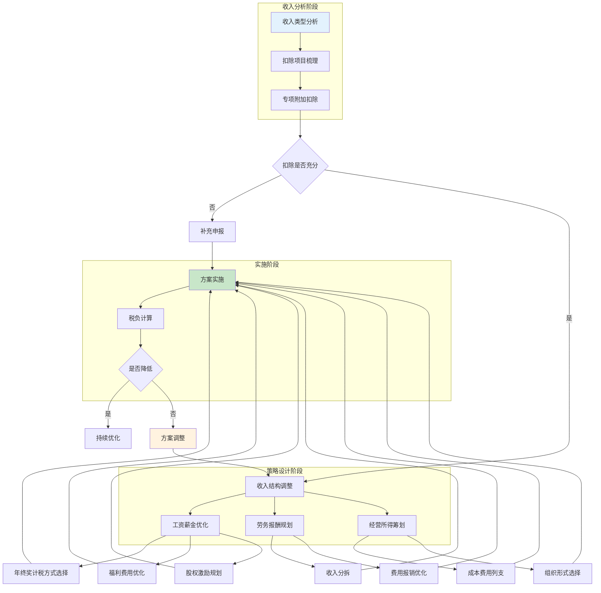
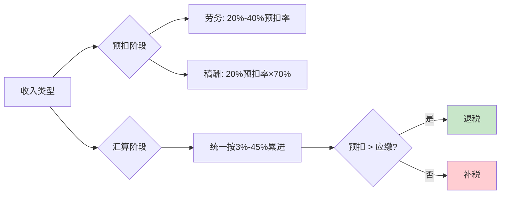
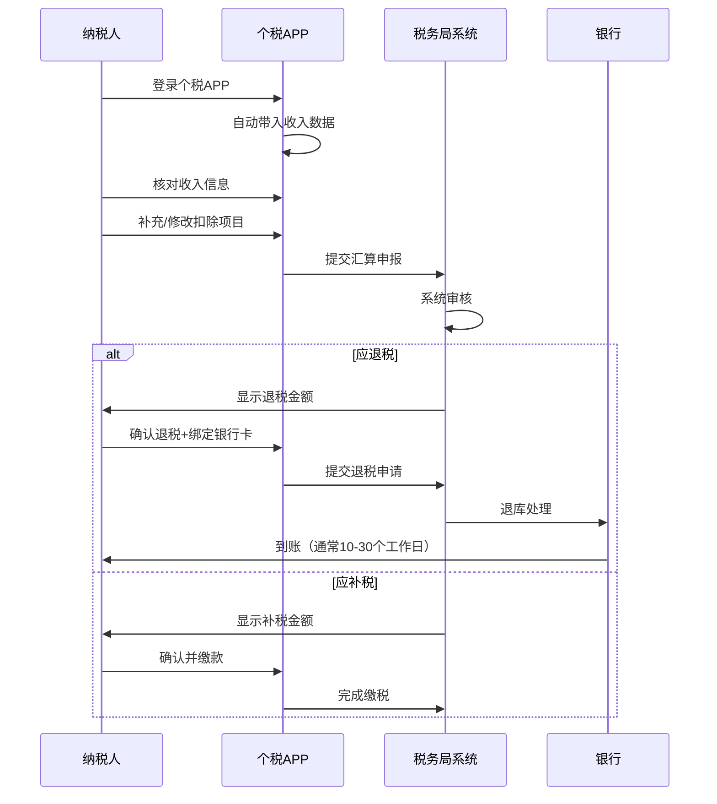

## 二、个人所得税详解

个人所得税是与每个人关系最密切的税种。无论你是工薪族、自由职业者、企业主还是投资者，理解个税规则都是税务筹划的基础。本章将从法律框架、计算逻辑、扣除机制到实战筹划，系统性地拆解个人所得税的方方面面。

### 2.0 个人所得税节税策略总览

在深入细节之前，先建立一个全局视角。个税筹划的核心逻辑是：**在合法框架内，通过优化收入结构、充分利用扣除、选择最优计税方式来降低实际税负**。



**四大核心策略**：

- **充分利用扣除**：确保所有专项附加扣除都已申报。很多纳税人每年因此多缴数千元甚至上万元税款。
- **收入时间规划**：合理安排收入确认时间，特别是跨年度的收入分配。
- **收入形式转换**：将部分工资薪金转化为免税福利（如通讯补贴实报实销、差旅津贴等）。
- **投资工具选择**：选择税收优惠的投资产品，如个人养老金账户（每年12,000元税前扣除）。

### 2.1 个人所得税的法律框架

#### 2.1.1 核心法律依据

个人所得税的法律依据主要包括：

| 层级 | 法规名称 | 核心内容 |
|------|---------|---------|
| 法律 | 《个人所得税法》（2018年修订） | 税制框架、税率、纳税人义务 |
| 行政法规 | 《个人所得税法实施条例》 | 具体执行细则 |
| 部门规章 | 国家税务总局各项公告 | 扣除标准、征管操作 |
| 规范性文件 | 财税〔2018〕164号等 | 年终奖、股权激励等过渡政策 |

2018年修订是个税法历史上最大的一次改革，实现了从分类税制向**综合与分类相结合**的税制转变。

#### 2.1.2 纳税人分类

个人所得税将纳税人分为两类，这对税务筹划至关重要：

| 类型 | 判定标准 | 纳税义务 | 典型人群 |
|------|---------|---------|---------|
| 居民个人 | 在中国有住所，或无住所但一个纳税年度内居住累计满183天 | 全球所得纳税 | 中国公民、长期居住的外国人 |
| 非居民个人 | 无住所且不满足183天居住条件 | 仅中国境内来源所得纳税 | 短期来华外国人 |

> **实务要点**：对于有海外收入的高净值人士，居民/非居民身份的判定直接影响数百万的税负。如果可以通过安排居住天数来改变身份，筹划空间巨大。

#### 2.1.3 九类所得的分类

根据《个人所得税法》第二条，个人所得分为以下九类：

| 序号 | 所得类型 | 计税方式 | 税率 | 是否综合计税 |
|------|---------|---------|------|------------|
| 1 | 工资、薪金所得 | 按月预扣、按年汇算 | 3%-45%七级超额累进 | 是 |
| 2 | 劳务报酬所得 | 按次预扣、按年汇算 | 20%-40%预扣/3%-45%汇算 | 是 |
| 3 | 稿酬所得 | 按次预扣、按年汇算 | 20%预扣（减征30%）/3%-45%汇算 | 是 |
| 4 | 特许权使用费所得 | 按次预扣、按年汇算 | 20%预扣/3%-45%汇算 | 是 |
| 5 | 经营所得 | 按年计算、按季预缴 | 5%-35%五级超额累进 | 否 |
| 6 | 利息、股息、红利所得 | 按次代扣 | 20%比例税率 | 否 |
| 7 | 财产租赁所得 | 按次/按月 | 20%（住房10%） | 否 |
| 8 | 财产转让所得 | 按次 | 20% | 否 |
| 9 | 偶然所得 | 按次代扣 | 20% | 否 |

**关键理解**：第1-4项统称为"综合所得"，年终合并计算应纳税额，多退少补。第5-9项各自独立计税，不参与综合汇算。这意味着**不同类别所得之间的税负差异就是筹划的空间**。

### 2.2 综合所得税率与计算

#### 2.2.1 七级超额累进税率表

综合所得适用3%-45%的七级超额累进税率：

| 级数 | 全年应纳税所得额 | 税率 | 速算扣除数 | 对应年收入区间（不含五险一金扣除） |
|------|-----------------|------|-----------|--------------------------------|
| 1 | 不超过36,000元 | 3% | 0 | 约6万-9.6万 |
| 2 | 36,000-144,000元 | 10% | 2,520 | 约9.6万-20.4万 |
| 3 | 144,000-300,000元 | 20% | 16,920 | 约20.4万-36万 |
| 4 | 300,000-420,000元 | 25% | 31,920 | 约36万-48万 |
| 5 | 420,000-660,000元 | 30% | 52,920 | 约48万-72万 |
| 6 | 660,000-960,000元 | 35% | 85,920 | 约72万-102万 |
| 7 | 超过960,000元 | 45% | 181,920 | 102万以上 |

> **注意**：表中"对应年收入区间"为近似值，假设仅有基本减除费用6万元和基本五险一金扣除，实际因扣除项不同而变化。

#### 2.2.2 综合所得计算公式

完整的计算流程如下：

$$应纳税所得额 = 年收入总额 - 60{,}000元（基本减除） - 专项扣除 - 专项附加扣除 - 其他合法扣除$$

$$应纳税额 = 应纳税所得额 \times 适用税率 - 速算扣除数$$

**详细计算示例**：

假设小王月薪25,000元，五险一金个人缴纳5,000元/月，有1个子女（3岁以上）、首套房贷、父母年满60岁，无其他收入：

```text
年工资收入：         25,000 × 12 = 300,000元
减：基本减除费用：                  60,000元
减：专项扣除（五险一金）：          5,000 × 12 = 60,000元
减：子女教育：                      2,000 × 12 = 24,000元
减：住房贷款利息：                  1,000 × 12 = 12,000元
减：赡养老人：                      3,000 × 12 = 36,000元
───────────────────────────────────────────────
应纳税所得额：                      108,000元

对照税率表：108,000元落在第2级（36,000-144,000元），税率10%，速算扣除数2,520元
应纳税额 = 108,000 × 10% - 2,520 = 8,280元
实际税负率 = 8,280 ÷ 300,000 = 2.76%
```

如果不申报任何专项附加扣除：
```text
应纳税所得额：300,000 - 60,000 - 60,000 = 180,000元
应纳税额 = 180,000 × 20% - 16,920 = 19,080元
实际税负率 = 19,080 ÷ 300,000 = 6.36%
```

**仅因未申报专项附加扣除，每年多缴税 10,800 元。** 这就是为什么"充分利用扣除"是第一优先级的筹划策略。

### 2.3 专项扣除详解

专项扣除是个人缴纳的"五险一金"，由单位代扣代缴，个人无需额外操作，但需要了解其构成和优化空间。

#### 2.3.1 五险一金缴纳比例

| 险种 | 个人缴纳比例 | 单位缴纳比例 | 缴纳基数 | 备注 |
|------|------------|------------|---------|------|
| 养老保险 | 8% | 16% | 上年度月均工资（60%-300%社平工资） | 全国统一 |
| 医疗保险 | 2% | 8%-10% | 同上 | 各地比例略有差异 |
| 失业保险 | 0.5% | 0.5% | 同上 | 农村户口可能免缴 |
| 工伤保险 | 0 | 0.2%-1.9% | 同上 | 个人不缴 |
| 生育保险 | 0 | 0.5%-1% | 同上 | 已并入医保 |
| 住房公积金 | 5%-12% | 5%-12% | 同上 | 个人与单位比例一致 |

#### 2.3.2 五险一金的筹划空间

**住房公积金是最大的筹划工具**。公积金个人缴纳部分全额免税，且属于个人账户资产。在政策允许的范围内，将公积金缴纳比例调到最高（12%），实质上是将部分应税工资转化为免税储蓄。

**计算对比**（假设月薪30,000元，公积金比例分别为5%和12%）：

| 项目 | 公积金5% | 公积金12% | 差异 |
|------|---------|----------|------|
| 公积金个人缴纳 | 1,500元/月 | 3,600元/月 | +2,100元 |
| 单位同比例匹配 | 1,500元/月 | 3,600元/月 | +2,100元 |
| 年度税前扣除增加 | — | 25,200元 | — |
| 年度节税（20%税率档） | — | 约5,040元 | — |
| 年度个人公积金增收 | — | 25,200元 | — |
| **综合收益** | — | **约30,240元/年** | — |

> **注意**：公积金比例由单位与职工协商确定，需在5%-12%范围内。部分单位可能不愿提高单位缴纳比例，此时个人可考虑自愿缴存（部分城市支持灵活就业人员缴存公积金）。

### 2.4 专项附加扣除完全指南

专项附加扣除是2019年个税改革的最大亮点，也是大多数纳税人最容易遗漏的减税工具。

#### 2.4.1 七项扣除明细

| 扣除项目 | 扣除标准 | 适用条件 | 扣除方式 | 起止时间 |
|----------|---------|---------|---------|---------|
| 子女教育 | 2,000元/月/子女 | 满3岁至博士研究生毕业 | 父母各50%或一方100% | 满3岁当月至毕业当月 |
| 继续教育 | 学历400元/月，职业资格3,600元/年 | 学历（学位）继续教育或取得职业资格证书 | 本人扣除 | 学历最长48个月；职业资格取得当年 |
| 大病医疗 | 实际支出超15,000元部分，上限80,000元/年 | 医保目录内自付部分 | 本人或配偶扣除；未成年子女由父母扣除 | 年度汇算时扣除 |
| 住房贷款利息 | 1,000元/月 | 首套住房贷款，最长240个月 | 本人或配偶一方扣除 | 贷款合同约定还款起始月至还清或满240个月 |
| 住房租金 | 800/1,100/1,500元/月（按城市） | 本人及配偶在主要工作城市无自有住房 | 由签订租赁合同的一方扣除 | 租赁合同约定起止月 |
| 赡养老人 | 3,000元/月 | 父母任一方年满60岁 | 独生子女全额；非独生分摊（每人不超1,500元） | 被赡养人满60岁当月至去世当年年末 |
| 3岁以下婴幼儿照护 | 2,000元/月/婴幼儿 | 3岁以下婴幼儿 | 父母各50%或一方100% | 出生当月至满3岁当月 |

#### 2.4.2 住房租金扣除的城市标准

| 扣除标准 | 城市范围 |
|---------|---------|
| 1,500元/月 | 直辖市、省会（首府）城市、计划单列市及国务院确定的其他城市 |
| 1,100元/月 | 市辖区户籍人口超过100万的城市 |
| 800元/月 | 市辖区户籍人口不超过100万的城市 |

> **重要提醒**：住房贷款利息与住房租金**不能同时享受**。如果你在A城市有房贷、在B城市租房工作，需要选择扣除金额更高的一项。

#### 2.4.3 赡养老人的分摊规则

非独生子女家庭的赡养老人扣除（3,000元/月）需要在兄弟姐妹之间分摊，有三种方式：

1. **均摊**：每人扣除相同金额（如3人，每人1,000元/月）
2. **约定分摊**：兄弟姐妹自行约定各自扣除金额（需签订书面协议）
3. **被赡养人指定分摊**：由父母指定各子女的扣除金额（需书面指定）

**筹划要点**：
- 无论哪种分摊方式，每人最高不超过1,500元/月
- 分摊方式和额度在一个纳税年度内不得变更
- 建议约定分摊给收入最高、税率档最高的家庭成员更多扣除额度

#### 2.4.4 常见遗漏与纠错

很多纳税人因不了解规则而错失扣除。以下是最高频的遗漏：

| 遗漏项 | 影响金额 | 纠正方式 |
|--------|---------|---------|
| 子女满3岁未申报 | 2,000元/月/子女 | 通过个税APP补充填报，汇算时追溯扣除 |
| 继续教育未填报 | 400元/月或3,600元/年 | 取得证书后及时填报 |
| 父母刚满60岁未更新 | 3,000元/月 | 及时更新被赡养人信息 |
| 大病医疗忘扣除 | 最高80,000元/年 | 次年汇算时填报（仅汇算扣除） |
| 房贷已还清未停止 | 超期扣除属违规 | 及时更新贷款状态 |
| 婴幼儿出生未填报 | 2,000元/月 | 出生后及时添加 |

### 2.5 年终奖计税——最关键的筹划决策

年终奖（全年一次性奖金）的计税方式选择是影响普通工薪族税负最大的单一决策。

#### 2.5.1 两种计税方式

**方式一：单独计税**（将年终奖除以12确定税率，单独计算）

$$应纳税额 = 年终奖 \times 适用税率 - 速算扣除数$$

年终奖单独计税的月度税率表：

| 月度应纳税所得额（年终奖÷12） | 税率 | 速算扣除数 |
|----------------------------|------|-----------|
| 不超过3,000元 | 3% | 0 |
| 3,000-12,000元 | 10% | 210 |
| 12,000-25,000元 | 20% | 1,410 |
| 25,000-35,000元 | 25% | 2,660 |
| 35,000-55,000元 | 30% | 4,410 |
| 55,000-80,000元 | 35% | 7,160 |
| 超过80,000元 | 45% | 15,160 |

**方式二：并入综合所得**（年终奖与工资等合并计税）

将年终奖并入全年综合所得，统一按七级累进税率计算。

#### 2.5.2 "年终奖陷阱"——税率临界点

年终奖单独计税存在著名的"多发1元，到手少几千"的陷阱。以下是关键临界点：

| 临界点 | 年终奖刚好低于 | 应纳税额 | 到手金额 | 年终奖刚好超过 | 应纳税额 | 到手金额 | 多发1元损失 |
|--------|-------------|---------|---------|-------------|---------|---------|-----------|
| 第1个 | 36,000元 | 1,080元 | 34,920元 | 36,001元 | 3,390.10元 | 32,610.90元 | **少拿2,309元** |
| 第2个 | 144,000元 | 14,190元 | 129,810元 | 144,001元 | 27,490.20元 | 116,510.80元 | **少拿13,299元** |
| 第3个 | 300,000元 | 58,590元 | 241,410元 | 300,001元 | 73,990.25元 | 226,010.75元 | **少拿15,399元** |
| 第4个 | 420,000元 | 102,340元 | 317,660元 | 420,001元 | 126,490.30元 | 293,510.70元 | **少拿24,149元** |
| 第5个 | 660,000元 | 192,590元 | 467,410元 | 660,001元 | 225,490.35元 | 434,510.65元 | **少拿32,899元** |
| 第6个 | 960,000元 | 326,590元 | 633,410元 | 960,001元 | 384,490.45元 | 575,510.55元 | **少拿57,899元** |

> **实操建议**：如果你的年终奖刚好在临界点附近，应该与HR协商，将超出部分并入月薪或下一年的年终奖。例如年终奖应发36,100元，不如约定发36,000元，差额100元以其他形式发放。

#### 2.5.3 两种计税方式的选择决策

没有绝对的最优选择，需要根据具体情况计算：

**倾向于选择"单独计税"的情况**：
- 年终奖金额较高且工资较低（综合所得应纳税所得额为负数或很低）
- 年终奖金额在安全区间（远离临界点）
- 综合所得已经处于较高税率档

**倾向于选择"并入综合所得"的情况**：
- 年终奖金额较低（如不超过36,000元）且综合所得也较低
- 年度中有几个月没有收入（导致基本减除费用未用完）
- 综合所得扣除后应纳税所得额为负数（并入后可抵消）

**决策公式**：分别按两种方式计算应纳税额，选择总税额较低的方式。单位在发放时默认选择单独计税，但个人可以在次年3-6月汇算清缴时更改。

#### 2.5.4 实战计算案例

**案例一：高薪低年终奖**

张先生月薪50,000元，五险一金10,000元/月，专项附加扣除5,000元/月，年终奖60,000元。

```text
方案A：年终奖单独计税
  综合所得应纳税所得额 = (50,000-10,000-5,000)×12 - 60,000 = 360,000元
  综合所得应纳税额 = 360,000 × 25% - 31,920 = 58,080元
  年终奖应纳税额 = 60,000 × 10% - 210 = 5,790元
  合计：63,870元

方案B：年终奖并入综合所得
  综合所得应纳税所得额 = 360,000 + 60,000 = 420,000元
  应纳税额 = 420,000 × 25% - 31,920 = 73,080元

结论：选择单独计税，节省 9,210元
```

**案例二：低薪高年终奖**

李女士月薪8,000元，五险一金1,500元/月，专项附加扣除2,000元/月，年终奖100,000元。

```text
方案A：年终奖单独计税
  综合所得应纳税所得额 = (8,000-1,500-2,000)×12 - 60,000 = -6,000元 → 0元
  综合所得应纳税额 = 0元
  年终奖应纳税额 = 100,000 × 10% - 210 = 9,790元
  合计：9,790元

方案B：年终奖并入综合所得
  综合所得应纳税所得额 = 0 + 100,000 = 100,000元
  应纳税额 = 100,000 × 10% - 2,520 = 7,480元

结论：选择并入综合所得，节省 2,310元
```

### 2.6 经营所得的筹划空间

经营所得适用5%-35%的五级超额累进税率，是独立于综合所得的另一条税制通道。对于个体工商户、个人独资企业和合伙企业（自然人合伙人），经营所得的筹划空间比工资薪金大得多。

#### 2.6.1 经营所得税率表

| 级数 | 全年应纳税所得额 | 税率 | 速算扣除数 |
|------|-----------------|------|-----------|
| 1 | 不超过30,000元 | 5% | 0 |
| 2 | 30,000-90,000元 | 10% | 1,500 |
| 3 | 90,000-300,000元 | 20% | 10,500 |
| 4 | 300,000-500,000元 | 30% | 40,500 |
| 5 | 超过500,000元 | 35% | 65,500 |

#### 2.6.2 核心筹划方法

**方法一：合理列支成本费用**

经营所得的应纳税所得额 = 收入总额 - 成本 - 费用 - 损失。与工资薪金不同，经营所得可以扣除**实际发生的业务成本**，包括：

- 办公场地租金及物业费
- 设备购置与折旧
- 员工工资及社保
- 业务招待费（发生额60%扣除，且不超过收入5‰）
- 广告宣传费（不超过收入15%的部分）
- 交通运输费、通讯费等与经营直接相关的支出

**方法二：核定征收与查账征收**

| 征收方式 | 适用条件 | 税负特点 | 筹划空间 |
|---------|---------|---------|---------|
| 查账征收 | 有完整账簿、能准确核算 | 实际利润×税率 | 通过成本费用优化降低利润 |
| 核定征收 | 无法准确核算的小规模经营者 | 按收入×应税所得率×税率 | 所得率通常较低（如服务业10%-15%） |

> **重要变化**：近年来税务机关对核定征收的适用范围大幅收紧，特别是个人独资企业和合伙企业的核定征收。2021年起，持有股权、股票等权益性资产的合伙企业不得适用核定征收。**不要将核定征收作为长期筹划手段依赖**。

**方法三：选择合适的组织形式**

| 组织形式 | 税种 | 综合税率（估） | 适用场景 |
|---------|------|--------------|---------|
| 个体工商户 | 个人所得税（经营所得） | 5%-35% | 小规模经营、自由职业 |
| 个人独资企业 | 个人所得税（经营所得） | 5%-35% | 一人控制的企业 |
| 合伙企业 | 个人所得税（穿透征税） | 5%-35%（各合伙人分别缴纳） | 多人合作、投资基金 |
| 有限责任公司 | 企业所得税25%+分红个税20% | 综合约40% | 需要法人主体、融资 |
| 有限公司（小型微利） | 企业所得税5%+分红个税20% | 综合约24% | 年利润≤300万 |

### 2.7 劳务报酬与稿酬的特殊规则

#### 2.7.1 预扣预缴与汇算清缴的差异

劳务报酬和稿酬在预扣预缴阶段与汇算清缴阶段的计算方式不同，这导致**很多自由职业者在汇算时能获得退税**。

**预扣预缴阶段**：
- 劳务报酬：每次收入不超过4,000元，减除800元费用；超过4,000元，减除20%费用。余额按20%-40%预扣率计算。
- 稿酬所得：同上减除费用后，再按70%计算（即实际只对56%征税），税率20%。

**汇算清缴阶段**：
- 劳务报酬和稿酬并入综合所得，按3%-45%七级累进税率计算。
- 劳务报酬以收入减除20%费用后的余额计入。
- 稿酬以收入减除20%费用后再打七折的余额计入。



**案例**：自由撰稿人小陈全年稿酬收入30,000元，无其他收入。

```text
预扣阶段：
  应税收入 = 30,000 × (1-20%) × 70% = 16,800元
  预扣税额 = 16,800 × 20% = 3,360元

汇算阶段：
  应税收入 = 30,000 × (1-20%) × 70% = 16,800元
  年综合所得 = 16,800元
  减：基本减除60,000元 → 应纳税所得额为负数，应纳税额 = 0

  退税金额 = 3,360元（全额退回！）
```

> **实务提示**：如果年收入低于60,000元的自由职业者没有做汇算清缴，就白白损失了这笔退税。务必在每年3-6月通过个税APP完成汇算。

#### 2.7.2 劳务报酬转经营所得的筹划

对于年收入较高的自由职业者（如设计师、咨询师、培训师），将业务模式从"劳务关系"转变为"经营关系"可能大幅降低税负。

| 对比项 | 劳务报酬 | 经营所得（个体户） |
|--------|---------|-----------------|
| 税率 | 并入综合所得3%-45% | 5%-35% |
| 费用扣除 | 固定20%或800元 | 实际发生的全部成本费用 |
| 社保 | 需自行缴纳（如无单位） | 可作为企业成本列支 |
| 发票 | 需到税务局代开或自然人代开 | 自行开具 |
| 年收入50万税负（估） | 约8-10万 | 约3-6万（视成本） |

**操作路径**：注册个体工商户或个人独资企业 → 以企业名义承接业务 → 开具发票 → 按经营所得纳税。

> **风险提示**：此方案需有真实业务支撑，不能仅是形式转换。税务机关会审查业务真实性，包括合同、发票、资金流、业务实质是否一致。

### 2.8 股权激励的税务处理

股权激励是科技行业和上市公司高管常见的薪酬形式，税务处理较为复杂。

#### 2.8.1 三种主要形式的税务差异

| 形式 | 纳税时点 | 计税方式 | 适用税率 |
|------|---------|---------|---------|
| 股票期权 | 行权时 | （行权价-授予价）×数量，按工资薪金计税 | 3%-45% |
| 限制性股票 | 解禁时 | （解禁日市价-授予价）×数量，按工资薪金计税 | 3%-45% |
| 股票增值权 | 行权时 | （行权日市价-授予价）×数量，按工资薪金计税 | 3%-45% |

#### 2.8.2 上市公司股权激励的优惠

上市公司（含新三板）的股权激励可选择在不超过12个月内分期缴税，或在不超过36个月内分期缴税（2024年起新规）。非上市公司符合条件的股权激励可递延至转让股权时按20%税率纳税（"递延纳税"政策）。

**筹划要点**：
- 上市公司股票期权的税负核心是行权时机选择——在股价相对低时行权，降低"行权收益"的计税基础
- 非上市公司股权激励务必申请递延纳税，将45%的最高边际税率降至20%

### 2.9 财产性所得的税务规则

#### 2.9.1 利息、股息、红利

| 来源 | 税率 | 免税/优惠情形 |
|------|------|-------------|
| 银行存款利息 | 20%（目前免税） | 2008年10月9日起暂免征收 |
| 国债利息 | 0 | 法定免税 |
| 上市公司股票股息 | 20% | 持股超1年免税；1个月-1年减半（10%）；1个月内全额 |
| 非上市公司股息 | 20% | 无优惠 |

> **筹划要点**：长期持有上市公司股票（超过1年）获得的股息红利免税，这是"价值投资"的税收优势。

#### 2.9.2 财产转让

| 转让标的 | 税率 | 计税基础 | 免税/优惠 |
|---------|------|---------|----------|
| 上市公司股票（A股） | 0 | — | 暂免征收个人所得税 |
| 非上市公司股权 | 20% | 转让收入-原值-合理费用 | 符合条件的可分期缴纳 |
| 房产 | 20%（或核定1%-3%） | 转让收入-原值-合理费用 | 满五唯一免征 |
| 其他财产 | 20% | 转让收入-原值-合理费用 | — |

**房产转让的特殊规则**：

"满五唯一"（自用5年以上且为家庭唯一住房）免征个人所得税，这是房产税务筹划的核心。

对于不满足"满五唯一"条件的房产转让：
- 能提供原值凭证：（转让价-原值-合理费用）× 20%
- 不能提供原值凭证：转让价 × 核定征收率（各地1%-3%不等）

### 2.10 年度汇算清缴实操

#### 2.10.1 汇算清缴时间与范围

- **时间**：每年3月1日至6月30日
- **范围**：所有居民个人需将全年综合所得（工资薪金+劳务报酬+稿酬+特许权使用费）汇总计算，多退少补

#### 2.10.2 必须办理汇算的情形

| 情形 | 说明 |
|------|------|
| 年综合所得超过12万且补税超过400元 | 最常见的触发条件 |
| 年中有月份未申报扣除 | 导致预缴税款偏多 |
| 有符合条件的扣除未申报 | 如大病医疗仅在汇算时扣除 |
| 年中离职/入职导致扣除不完整 | 基本减除费用重复或遗漏 |
| 取得劳务报酬/稿酬/特许权使用费 | 预扣率通常高于实际税率，可退税 |

#### 2.10.3 汇算操作流程



### 2.11 常见误区与纠正

| 误区 | 真相 | 影响 |
|------|------|------|
| "个税是单位的事，我管不了" | 专项附加扣除需个人主动申报 | 每年可能多数缴数千元税款 |
| "年终奖越多越好" | 临界点多发1元可能损失数千到数万 | 实际到手反而减少 |
| "自由职业不用交税" | 所有收入均需依法纳税 | 逾期可能面临滞纳金和罚款 |
| "房贷还完了还能继续扣除" | 贷款还清当月停止扣除 | 超期扣除需补税并可能罚款 |
| "夫妻可以同时扣除同一套房贷" | 只能由一方扣除100% | 重复扣除属违规 |
| "公积金交越多越好" | 超过12%的部分不能税前扣除 | 超限部分无税收优惠 |
| "股票亏损可以抵扣工资税" | 不同类别所得不能互相抵扣 | A股转让亏损不能冲减工资 |
| "辞职后不需要汇算" | 只要年度内有综合收入且需补税/退税 | 不办理可能影响个人纳税信用 |

### 2.12 进阶筹划：跨所得类型的组合优化

对于有多元收入的高净值人士，个税筹划的核心在于**利用不同所得类型的税率差异进行组合优化**。

#### 2.12.1 收入结构优化矩阵

| 收入类型 | 最高边际税率 | 筹划方向 |
|---------|------------|---------|
| 工资薪金 | 45% | 降低至经营所得（35%）或资本性所得（20%） |
| 劳务报酬 | 45%（汇算） | 转为经营所得，增加费用扣除 |
| 经营所得 | 35% | 充分列支成本，利用税收优惠 |
| 股息红利 | 20% | 长期持有享受免税 |
| 财产转让 | 20% | 利用原值扣除，房产满五唯一 |
| 偶然所得 | 20% | 个人养老金每年12,000元税前扣除 |

#### 2.12.2 高薪人士的综合筹划方案

以年收入200万（工资100万+劳务50万+投资50万）为例：

| 筹划措施 | 节税金额（估） | 操作方式 |
|---------|--------------|---------|
| 充分申报专项附加扣除 | 1.2-3万/年 | 子女教育+房贷+赡养老人等 |
| 公积金提至12% | 1-2万/年 | 与单位协商提高比例 |
| 年终奖最优分割 | 2-5万/年 | 避开临界点，选择最优计税方式 |
| 个人养老金缴满12,000元 | 3,600-5,400元/年 | 开通个人养老金账户 |
| 劳务报酬转经营所得 | 5-15万/年 | 注册个体户承接业务 |
| 股票长期持有（>1年） | 视金额而定 | 股息免税 |
| 综合筹划效果 | **约12-30万/年** | 需根据具体收入结构定制方案 |

> **提醒**：所有筹划必须基于真实业务和合法合规的前提。虚构业务、虚开发票、隐瞒收入等行为属于偷税，面临补税、滞纳金（日万分之五）、0.5-5倍罚款，情节严重的可能追究刑事责任。
