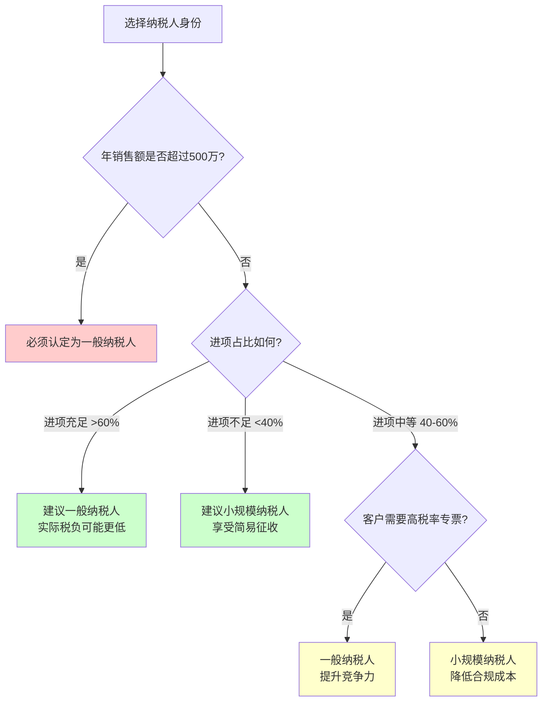
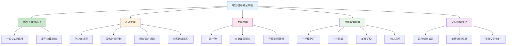

## 三、增值税基础

### 3.0 什么是增值税：从一杯咖啡说起

你买了一杯 30 元的拿铁，其中包含了多少税？答案是大约 3.45 元的增值税。这杯咖啡从咖啡豆进口、烘焙加工、运输仓储到门店销售，每一个环节都在征收增值税——但税负并不叠加，因为增值税的核心设计就是**对增值部分征税**。

增值税（Value-Added Tax，VAT）是中国第一大税种，2024 年全国增值税收入约 6.7 万亿元，占全部税收收入的 35% 以上。它覆盖了商品和服务从生产到消费的每一个流转环节，但通过进项抵扣机制避免了重复征税。

理解增值税对于税务筹划至关重要，原因有三：

1. **它无处不在**：你购买的几乎所有商品和服务都包含增值税，理解它能帮你识别真实成本
2. **它影响定价**：企业定价必须考虑增值税的影响，定价策略直接关系到税后利润
3. **它有巨大的筹划空间**：纳税人身份选择、进项管理、发票策略等都直接影响税负

### 3.1 增值税的底层逻辑：为什么它比营业税优越

#### 3.1.1 从营业税到增值税的演变

2016 年 5 月 1 日，中国全面推开"营改增"（营业税改征增值税），结束了营业税与增值税并行 20 多年的历史。这次改革被称为"1994 年分税制改革以来中国最深刻的税制变革"。

营业税为什么被淘汰？核心问题是**重复征税**。

以一个简单的例子说明：


在营业税制下，每个环节按全额征税，制造商缴纳的 10 万营业税中包含了原材料商已经交过的那 5 万对应的重复计税。三个环节累计营业税 30 万，但实际经济增值只有 300 万。


在增值税制下，每个环节只对"增值"部分纳税。原材料商增值 100 万，缴税 13 万；制造商增值 100 万（200-100），缴税 13 万；零售商增值 100 万（300-200），缴税 13 万。三个环节累计 39 万，但每个环节的实际税负仅为其增值部分。

**关键认知**：增值税的本质是"道道征收、道道抵扣"，最终税负由消费者承担，企业只是代收代缴。

#### 3.1.2 增值税的计算公式

增值税的一般计算方法（一般纳税人）：

```text
应纳增值税 = 当期销项税额 - 当期进项税额
```

其中：
- **销项税额** = 销售额 × 税率（你卖东西时向客户收取的税）
- **进项税额** = 购进金额 × 税率（你买东西时供应商向你收取的税）
- 当进项大于销项时，差额可以结转下期继续抵扣

如果当期销项税额 13 万，进项税额 10 万，那么应纳增值税 = 13 - 10 = 3 万。这就是"增值"部分对应的税。

对于小规模纳税人，则采用简易计税：

```text
应纳增值税 = 销售额 × 征收率
```

没有进项抵扣，计算简单，但税负可能较高或较低，取决于进项比例。

#### 3.1.3 增值税与价外税的特殊性

增值税是**价外税**，即税款不包含在标价中。但在日常消费中，我们看到的价格几乎都是"含税价"。换算关系：

```text
不含税价 = 含税价 ÷ (1 + 税率)
税额 = 不含税价 × 税率
```

例如，含税价 113 元的商品（税率 13%）：
- 不含税价 = 113 ÷ 1.13 = 100 元
- 税额 = 100 × 13% = 13 元

这个换算在商业谈判和成本核算中非常重要。很多人在报价时搞混含税价和不含税价，导致利润计算出错。

### 3.2 纳税人分类：一般纳税人 vs 小规模纳税人

#### 3.2.1 分类标准

中国增值税纳税人分为两类，分类标准主要依据年应税销售额：

| 维度 | 一般纳税人 | 小规模纳税人 |
|------|-----------|------------|
| **年销售额标准** | >500 万元 | ≤500 万元 |
| **会计核算** | 健全，能准确核算进销项 | 不能准确核算或选择简易方式 |
| **计税方法** | 一般计税（销项-进项） | 简易计税（销售额×征收率） |
| **税率/征收率** | 13%、9%、6%、0% | 3%（部分时期减按1%） |
| **发票权限** | 可自行开具增值税专用发票 | 可自开或代开专票（特定行业） |
| **进项抵扣** | 可以抵扣 | 不可以抵扣 |
| **申报频率** | 月度申报 | 季度申报（多数） |

**500 万标准的计算**：连续不超过 12 个月或四个季度的累计应税销售额。注意不是自然年，而是滚动计算。

#### 3.2.2 如何选择纳税人身份

这是一个经典的税务筹划决策点。选择的核心逻辑：

**选择小规模纳税人的情形**：
- 客户不需要增值税专用发票（或接受你代开/自开的 1%-3% 专票）
- 进项发票获取困难（如人力密集型服务业、农产品收购等）
- 年销售额远低于 500 万
- 享受小规模纳税人免征优惠（月销售额 ≤10 万元免征增值税）

**选择一般纳税人的情形**：
- 客户是一般纳税人，需要 13%/9%/6% 的专票用于抵扣
- 进项充足，实际税负可能低于小规模纳税人
- 行业要求（如出口退税必须是一般纳税人）
- 供应链上下游都是一般纳税人，选择小规模会被"挤出"

**数值化比较示例**：

假设一家贸易公司年含税销售额 400 万元，进项含税 260 万元：

| 项目 | 一般纳税人 | 小规模纳税人 |
|-----|-----------|------------|
| 不含税收入 | 400÷1.13=353.98万 | 400÷1.03=388.35万 |
| 销项税额 | 353.98×13%=46.02万 | 388.35×3%=11.65万 |
| 不含税进项 | 260÷1.13=230.09万 | — |
| 进项税额 | 230.09×13%=29.91万 | — |
| 应纳增值税 | 46.02-29.91=16.11万 | 11.65万 |
| **实际税负率** | 16.11÷353.98=**4.55%** | 11.65÷388.35=**3%** |

看起来小规模更优？但别忘了：一般纳税人的客户如果也是一般纳税人，那 46.02 万的销项发票可以帮客户抵扣进项——这意味着你有了更强的议价能力，可以提高售价。而且如果进项更多，一般纳税人的实际税负可能更低。



#### 3.2.3 身份转换的注意事项

- 小规模纳税人转一般纳税人：一经登记为一般纳税人，**不得转回**小规模纳税人（2018年修订后的规定）
- 一般纳税人转小规模：在特定政策窗口期可能允许（如 2020 年疫情期间有临时政策），但通常不可逆
- 新办企业可在办理税务登记时自主选择身份

**实操建议**：新办企业如果预计短期内销售额不会突破 500 万，且进项获取困难，可以先从小规模做起。但要提前评估：如果业务增长快，转为一般纳税人后进项抵扣的"红利期"能否覆盖身份转换带来的合规成本增加。

### 3.3 税率体系：四档税率的适用范围

#### 3.3.1 现行税率表

自 2019 年 4 月 1 日起，中国增值税实行四档税率：

| 税率 | 适用范围 | 典型行业/商品 |
|------|---------|-------------|
| **13%** | 销售货物、提供加工修理修配劳务、有形动产租赁 | 制造业、批发零售、修理修配、设备租赁 |
| **9%** | 交通运输、邮政、基础电信、建筑、不动产租赁、销售不动产、转让土地使用权、农产品 | 物流、快递、房地产、建筑施工、粮食 |
| **6%** | 金融、现代服务、生活服务、增值电信、无形资产转让 | 咨询、IT、餐饮、住宿、教育、医疗 |
| **0%** | 出口货物及服务 | 外贸出口 |

#### 3.3.2 征收率（小规模纳税人适用）

| 征收率 | 适用情形 |
|-------|---------|
| **3%** | 一般情形 |
| **1%** | 优惠政策（阶段性，如 2023-2027 年小规模纳税人减按 1%） |
| **5%** | 销售不动产、出租不动产 |
| **3% 减按 2%** | 销售自己使用过的固定资产（特定情形） |

#### 3.3.3 易混淆的税率边界

实际业务中，同一项业务可能涉及不同税率，以下是常见的混淆点：

**餐饮外卖 vs 食品销售**：
- 餐饮企业提供堂食或外卖（现场加工制作）：6%（生活服务）
- 餐饮企业销售预包装食品（如超市卖方便面）：13%（货物销售）
- 外卖平台服务费：6%（现代服务-信息技术服务）

**运输服务**：
- 货物运输服务：9%（交通运输）
- 货运代理服务：6%（现代服务-经纪代理）
- 无运输工具承运业务：9%（交通运输）
- 仓储服务：6%（现代服务-物流辅助）

**租赁服务**：
- 有形动产租赁：13%
- 不动产租赁：9%
- 融资租赁（有形动产）：13%
- 融资租赁（不动产）：9%

**建筑服务**：
- 工程服务、安装服务、修缮服务、装饰服务、其他建筑服务：9%
- 建筑设计、工程监理：6%（现代服务-专业技术服务）
- 建筑施工设备出租（配操作人员）：9%（建筑服务）
- 建筑施工设备出租（不配操作人员）：13%（有形动产租赁）

这些边界差异看似微小，但对于大额交易来说，3-7 个百分点的税率差异可能导致数十万甚至上百万的税额差距。在签订合同时，务必明确交易性质和适用税率。

### 3.4 进项抵扣机制：增值税的核心引擎

#### 3.4.1 什么是进项抵扣

进项抵扣是增值税最核心的机制，也是税务筹划中最有操作空间的环节。简单来说：

- 你买东西时付了增值税（进项税额）
- 你卖东西时收了增值税（销项税额）
- 用你付出去的税抵扣你收上来的税，差额交给国家

这意味着：**你的实际税负取决于你能获取多少合规的进项发票**。

#### 3.4.2 可抵扣的进项税额

以下进项税额**可以**从销项税额中抵扣：

| 取得方式 | 抵扣凭证 | 说明 |
|---------|---------|------|
| 增值税专用发票 | 专票上注明的税额 | 最常见的抵扣方式 |
| 海关进口增值税专用缴款书 | 缴款书上注明的税额 | 进口货物适用 |
| 农产品收购发票/销售发票 | 收购金额×9%（或10%加计扣除） | 农产品深加工企业 |
| 代扣代缴税收缴款凭证 | 注明的税额 | 境外单位或个人在境内发生应税行为 |
| 通行费电子发票 | 发票上注明的税额 | 桥闸通行费等 |
| 国内旅客运输服务电子发票 | 发票上注明的税额 | 火车票、机票行程单等 |

#### 3.4.3 不可抵扣的进项税额

以下进项税额**不得**抵扣：

1. **用于简易计税方法计税项目**：如选择简易计税的老项目
2. **用于免征增值税项目**：如部分教育、医疗服务
3. **用于集体福利或个人消费**：如食堂采购、员工旅游
4. **非正常损失的购进货物**：如被盗、丢失、霉烂变质
5. **非正常损失的在产品、产成品所耗用的购进货物**
6. **国务院规定的其他项目**

**重要提醒**：用于"个人消费"的进项不得抵扣，这包括：
- 公司购买的烟酒用于招待客户（交际应酬消费）
- 公司名下的豪华轿车用于高管个人使用（非生产经营用途）
- 公司为员工购买的节日礼品（集体福利）

但如果这些已经抵扣了进项税额，需要做**进项税额转出**处理——即从已抵扣的进项中扣除，补缴对应的增值税。

#### 3.4.4 混合用途的进项分摊

当购进的货物或服务既用于可抵扣项目又用于不可抵扣项目时，需要按比例分摊：

```text
可抵扣进项 = 全部进项 × (可抵扣项目销售额 ÷ 全部销售额)
```

**案例**：某公司购入一台电脑 11,300 元（含税），取得专票进项税额 1,300 元。这台电脑 70% 用于正常经营（可抵扣），30% 用于集体福利（不可抵扣）：
- 可抵扣进项 = 1,300 × 70% = 910 元
- 需转出进项 = 1,300 × 30% = 390 元

#### 3.4.5 进项抵扣的筹划空间

进项管理是企业税务筹划的核心战场：

**策略一：优先选择一般纳税人供应商**
从一般纳税人处采购可以获得 13%/9%/6% 的进项抵扣，而从小规模纳税人处采购只能获得 3%（或 1%）的抵扣。即使一般纳税人报价略高，考虑进项抵扣后的实际成本可能更低。

**数值化比较**：
| 项目 | 一般纳税人供应商 | 小规模纳税人供应商 |
|-----|---------------|-----------------|
| 含税报价 | 113 万 | 103 万 |
| 不含税成本 | 100 万 | 100 万 |
| 进项税额 | 13 万 | 3 万 |
| 实际成本（考虑抵扣后） | 100 万 | 103 万 |
| 差额 | — | 多花 3 万 |

如果企业是一般纳税人，小规模供应商的含税价必须比一般纳税人供应商低 10% 以上才有成本优势（13% vs 3% 的进项差）。

**策略二：合理安排采购时间**
如果当期销项税额较大，可以通过提前采购获取进项发票，将纳税义务递延到下期。但要注意"三流一致"（资金流、货物流、发票流一致），不能为了获取进项而虚构采购。

**策略三：固定资产进项抵扣**
2009 年起，中国允许固定资产的进项税额一次性抵扣。购入生产设备、车辆等固定资产时，进项税额可以在当期全额抵扣，这对于初创企业和扩张期企业来说是一个重要的现金流优化手段。

**策略四：旅客运输服务抵扣**
自 2019 年 4 月 1 日起，纳税人购进国内旅客运输服务，其进项税额允许从销项税额中抵扣。具体凭证包括：
- 增值税电子普通发票：按发票上注明的税额抵扣
- 注明身份信息的航空运输电子客票行程单：(票价+燃油附加费)÷(1+9%)×9%
- 注明身份信息的铁路车票：票面金额÷(1+9%)×9%
- 注明身份信息的公路、水路等其他客票：票面金额÷(1+3%)×3%

这对差旅频繁的企业来说是一个显著的进项来源。

### 3.5 发票管理：增值税的"生命线"

#### 3.5.1 发票类型

中国增值税发票体系包含以下主要类型：

| 发票类型 | 用途 | 开具主体 | 抵扣能力 |
|---------|------|---------|---------|
| **增值税专用发票** | 一般纳税人之间的交易 | 一般纳税人 | 可抵扣进项 |
| **增值税普通发票** | 面向消费者或小规模纳税人 | 所有纳税人 | 一般不可抵扣（旅客运输等除外） |
| **电子普通发票** | 与纸质普票同等效力 | 所有纳税人 | 同上 |
| **机动车销售统一发票** | 机动车销售 | 机动车销售企业 | 可抵扣 |
| **二手车销售统一发票** | 二手车交易 | 二手车交易市场 | 视情况 |
| **通行费电子发票** | 高速公路通行费 | ETC 服务方 | 可抵扣 |
| **全电发票（全面数字化电子发票）** | 全国推广中的数字化发票 | 所有纳税人 | 同专票/普票 |

#### 3.5.2 全电发票：正在重塑发票生态

2021 年起，中国开始试点"全面数字化的电子发票"（全电发票），这是发票管理的重大变革：

- **无需申领**：不再需要到税务局领取纸质发票，系统自动赋予开票额度
- **无需税控设备**：告别金税盘、税控盘等硬件
- **自动交付**：通过电子发票服务平台自动交付给购买方
- **数据实时**：开票信息实时上传税务系统，强化监管

全电发票正在全国范围内推广，预计将在近年内全面替代传统纸质发票。对于企业来说，这意味着：
- 发票管理成本大幅降低
- 虚开发票的空间被极大压缩
- 税务数据透明度显著提升

#### 3.5.3 发票开具的核心规则

**"三流一致"原则**：
- **资金流**：付款方与发票上的购买方一致
- **货物流**：实际收货方与发票上的购买方一致
- **发票流**：开票方与实际销售方一致

三流不一致是税务稽查的重点关注对象。常见违规情形：
- A 公司采购，让 B 公司付款（资金流与发票流不一致）
- A 公司采购货物直接发往 C 公司（货物流与发票流不一致）
- 让第三方代开发票（发票流与实际销售方不一致）

**开票时限**：
- 纳税义务发生时即应开具发票，不得提前或滞后
- 特殊规定：先开具发票的，纳税义务发生时间为开具发票的当天

**发票认证期限**：
- 2017 年 7 月 1 日起取得的增值税专用发票：取消 360 天认证期限（2020 年 3 月 1 日起追溯适用）
- 这意味着早期因超期未认证的进项发票，现在可以申请抵扣

#### 3.5.4 虚开发票的严重后果

虚开增值税专用发票是严重的刑事犯罪，最高可判处无期徒刑。以下是量刑标准：

| 虚开税额 | 量刑 |
|---------|------|
| 5 万元以上 | 3 年以下有期徒刑或拘役 |
| 50 万元以上 | 3-10 年有期徒刑 |
| 250 万元以上 | 10 年以上有期徒刑或无期徒刑 |

**什么是虚开**：
- 为他人虚开：没有真实交易，为他人开具发票
- 为自己虚开：为自己虚增进项
- 让他人为自己虚开：通过中间人购买发票
- 介绍他人虚开：充当虚开发票的中介

**税务筹划的底线**：任何涉及虚开发票的"筹划"都不是筹划，而是犯罪。税务筹划必须建立在真实交易的基础上。

### 3.6 特殊计税方法与优惠政策

#### 3.6.1 简易计税

一般纳税人在特定情形下可以选择简易计税方法（按 3% 或 5% 征收率，不得抵扣进项）：

- **建筑服务中的"甲供材"项目**：3%
- **清包工建筑服务**：3%
- **销售 2016 年 4 月 30 日前取得的不动产**：5%
- **出租 2016 年 4 月 30 日前取得的不动产**：5%
- **公共交通运输服务**：3%
- **电影放映服务**：3%

选择简易计税后，36 个月内不得变更。

#### 3.6.2 差额征税

部分行业允许从销售额中扣除特定项目后计算增值税：

- **旅游服务**：可扣除住宿费、餐饮费、交通费、签证费、门票费等
- **经纪代理服务**：可扣除代为支付的政府性基金或行政事业性收费
- **劳务派遣服务**：可扣除代用工单位支付给劳务派遣员工的工资、福利等
- **金融商品转让**：按卖出价扣除买入价后的余额为销售额

**案例**：某旅行社取得旅游收入 100 万元，其中代付住宿 30 万、餐饮 20 万、交通 15 万、门票 10 万：
- 差额后销售额 = 100 - 75 = 25 万
- 应纳增值税 = 25 ÷ 1.06 × 6% = 1.42 万
- 如果不差额征税：100 ÷ 1.06 × 6% = 5.66 万
- **节税效果**：差额征税节省了 4.24 万

#### 3.6.3 小规模纳税人免征优惠

现行政策（截至 2027 年 12 月 31 日）：

- **月销售额 ≤10 万元**（季度 ≤30 万元）：免征增值税
- **超过免征额的部分**：减按 1% 征收率征收（原 3%）

这对个体工商户和小微企业来说是一个重大利好。月收入 10 万以下（年 120 万以下）的小微企业可以完全免征增值税。

**筹划思路**：如果业务可以拆分为多个独立经营主体（如家庭成员分别注册个体户），每个主体的月收入控制在 10 万以内，可以合法享受免征优惠。但要注意：
- 拆分必须有合理的商业实质
- 各主体之间不能有明显的关联交易
- 业务拆分后不能影响正常经营

#### 3.6.4 加计抵减政策

部分现代服务业和生活性服务业的一般纳税人可以享受"加计抵减"优惠：

- **生产性服务业**：按照当期可抵扣进项税额加计 5% 抵减应纳税额
- **生活性服务业**：按照当期可抵扣进项税额加计 10% 抵减应纳税额

**案例**：某生活性服务企业当期销项税额 60 万，进项税额 40 万：
- 正常应纳税额 = 60 - 40 = 20 万
- 加计抵减额 = 40 × 10% = 4 万
- 实际应纳税额 = 20 - 4 = 16 万
- 节税 4 万，相当于进项抵扣的"增强版"

### 3.7 增值税与个人的关系

#### 3.7.1 个人何时需要缴纳增值税

虽然增值税主要由企业缴纳，但个人在以下情形中也需要关注增值税：

**个体工商户**：
- 从事生产经营活动，需要缴纳增值税
- 可选择小规模纳税人身份，享受免征优惠
- 月销售额 ≤10 万元免征

**自然人出租不动产**：
- 出租住房：按 5% 征收率减按 1.5% 计算
- 出租非住房：按 5% 征收率计算
- 每次（日）销售额 300-500 元以下免征（各省标准不同）

**自然人出售不动产**：
- 购买不足 2 年的住房对外销售：按 5% 全额征收
- 购买 2 年以上（含）的住房对外销售：免征（北上广深除外）
- 北上广深的普通住房购买 2 年以上免征，非普通住房按差额征收

**自然人转让股权**：
- 转让非上市公司股权：不征增值税（股权转让不属于增值税应税行为）
- 转让上市公司股票：按金融商品转让征收增值税（个人免征）

#### 3.7.2 个人的增值税筹划要点

**房产交易**：
- 满 2 年再出售可免征增值税，这是最直接的筹划
- 对于不满 2 年的房产，增值税及附加约占售价的 5.3%-5.6%，在定价时需要充分考虑
- 夫妻更名、继承、赠与等情形有特殊免税规定

**自由职业者**：
- 可以注册为个体工商户或个人独资企业，享受小规模纳税人免征优惠
- 代开发票时需缴纳增值税，但季度 ≤30 万免征
- 通过合理安排收入确认时间（如分月均匀确认），可以控制在免征额度内

### 3.8 2026 年增值税法：立法层面的重大变化

#### 3.8.1 从暂行条例到法律的跃迁

2025 年 12 月 25 日，十四届全国人大常委会第十三次会议表决通过了《中华人民共和国增值税法》，自 2026 年 1 月 1 日起施行。这是中国增值税制度从"暂行条例"上升为"法律"的标志性事件。

**立法意义**：
- 提升了增值税制度的法律位阶和权威性
- 将营改增以来的改革成果以法律形式固化
- 增强了税制的稳定性和可预期性

#### 3.8.2 增值税法的主要变化

**应税交易范围更加清晰**：
- 明确了"应税交易"的概念，包括销售货物、服务、无形资产和不动产
- 将"服务"细化为交通运输、邮政、电信、金融、现代服务、生活服务等
- 明确了视同销售的范围

**税率体系保持稳定**：
- 维持 13%、9%、6% 三档税率不变
- 出口零税率和免税政策延续
- 小规模纳税人征收率及优惠政策延续

**进项抵扣规则优化**：
- 进一步明确了不得抵扣的进项范围
- 简化了部分抵扣凭证要求
- 强化了电子发票的法律地位

**征管效率提升**：
- 全电发票的法律地位得到确认
- 税务机关的信息获取权和检查权进一步强化
- 纳税人的权利义务更加明确

**对个人和企业的影响**：
- 现有优惠政策的延续或调整需关注后续配套文件
- 小规模纳税人标准和优惠政策可能微调
- 全电发票推广将加速，企业需尽快适应

### 3.9 增值税常见误区与纠正

#### 误区一："不开票就不用交税"

**真相**：增值税的纳税义务发生在应税行为完成时，与是否开具发票无关。未开票收入同样需要申报纳税。未申报的未开票收入属于隐匿收入，被查到将面临补税+罚款+滞纳金。

金税四期系统可以通过银行流水、电商平台数据、物流信息等多维度交叉比对，不开票并不意味着税务机关发现不了。

#### 误区二："进项越多越好，多多益善"

**真相**：进项抵扣的前提是**与生产经营相关**。与经营无关的进项不得抵扣，强行抵扣属于违规。此外，如果长期进项大于销项（即长期零申报或负申报），会触发税务系统预警，引发稽查。

合理的做法是：确保经营相关的进项充分抵扣，同时控制非经营性支出的进项认证。

#### 误区三："小规模纳税人不能开专票"

**真相**：自 2020 年起，所有小规模纳税人均可自行开具增值税专用发票（之前部分行业需要代开）。但小规模纳税人开具的专票税率是 1% 或 3%，而不是 13%/9%/6%。

#### 误区四："个体户不用交增值税"

**真相**：个体户同样需要缴纳增值税。只是月销售额 ≤10 万元（季度 ≤30 万元）可以享受免征优惠。超过免征额度的部分仍需按规定缴纳。

#### 误区五："增值税是企业的事，跟我个人无关"

**真相**：增值税最终由消费者承担，只是通过企业代收。个人在房产交易、车辆购置等大额消费中直接承担增值税。个人出租不动产、从事经营活动也需要缴纳增值税。

#### 误区六："买发票充进项是行业潜规则"

**真相**：这是虚开发票，是刑事犯罪。近年来税务机关通过大数据分析，已能精准识别异常发票流向。接受虚开发票的企业不仅进项要做转出，还可能面临罚款甚至刑事责任。任何"买发票"的行为都不是筹划，而是犯罪。

### 3.10 实操清单：增值税合规与优化要点

#### 对企业主的建议

1. **合理选择纳税人身份**：根据业务模式、客户结构、进项比例综合决策
2. **严格管理发票**：建立发票领用、开具、保管、认证的全流程制度
3. **优先选择一般纳税人供应商**：在价格差异不大的情况下，优先获取高税率进项
4. **关注优惠政策**：小规模免征、加计抵减、差额征税等政策要及时享受
5. **定期进行税负分析**：比较实际税负率与行业平均水平，发现优化空间
6. **避免三流不一致**：确保交易的真实性和一致性，降低稽查风险
7. **提前规划采购时间**：在销项较大的期间适当提前采购，优化现金流

#### 对个人的建议

1. **房产交易注意满 2 年/5 年规则**：合理安排交易时间，享受增值税和个人所得税优惠
2. **出租不动产及时申报**：个人出租不动产需要缴纳增值税，但可以享受优惠征收率
3. **自由职业者考虑注册个体户**：享受小规模纳税人免征优惠，合法降低税负
4. **大额消费索取发票**：虽然个人一般不能抵扣进项，但发票是维权和售后的凭证
5. **了解视同销售规则**：个人向企业无偿转让资产（如赠与房产给公司）可能触发增值税



> **本节要点回顾**：增值税是中国第一大税种，理解其"道道征收、道道抵扣"的底层逻辑是税务筹划的基础。对于企业，重点在于纳税人身份选择和进项管理；对于个人，重点在于房产交易时机和自由职业者的身份规划。无论哪种情形，发票管理和合规底线都是不可逾越的红线。
