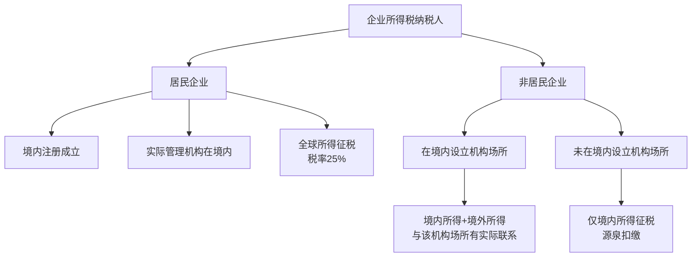
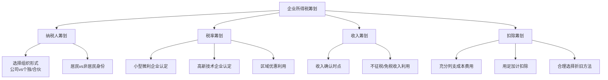

## 四、企业所得税基础

企业所得税是中国税收体系中的主体税种之一，与增值税并列为对企业影响最大的两个税种。2024年全国企业所得税收入约4.7万亿元，占全国税收收入的22%左右。理解企业所得税的底层逻辑，是所有税务筹划的起点——不懂规则，就无法在规则内优化。

### 4.1 纳税人与征税范围

#### 4.1.1 纳税人的界定

企业所得税的纳税人是在中国境内取得收入的企业和其他取得收入的组织，但**不包括个人独资企业和合伙企业**。这一排除非常关键，因为许多创业者在选择企业形式时会因为不了解这一点而多缴税。

| 组织形式 | 是否缴纳企业所得税 | 缴纳什么税 | 原因 |
|----------|-------------------|-----------|------|
| 有限责任公司 | 是 | 企业所得税→个人所得税 | 独立法人，双重征税 |
| 股份有限公司 | 是 | 企业所得税→个人所得税 | 独立法人，双重征税 |
| 个人独资企业 | 否 | 个人所得税（经营所得） | 非法人，穿透征税 |
| 合伙企业 | 否 | 个人所得税（经营所得） | 非法人，穿透征税 |
| 个体工商户 | 否 | 个人所得税（经营所得） | 非法人，穿透征税 |
| 外商投资企业 | 是 | 企业所得税→个人所得税 | 2008年起与内资统一 |

**关键理解：** 企业所得税的本质是对"法人"取得的所得征税。个人独资企业和合伙企业不是法人实体，其利润"穿透"到投资者个人层面征税，这就是所谓的"税收穿透"（pass-through taxation）。

#### 4.1.2 居民企业与非居民企业的划分

这是企业所得税中一个极具实务意义的分类，直接影响纳税义务的范围。

**居民企业**：依法在中国境内成立，或依照外国（地区）法律成立但实际管理机构在中国境内的企业。居民企业就其**全球所得**缴纳企业所得税。

**非居民企业**：依照外国（地区）法律成立且实际管理机构不在中国境内，但在中国境内设立机构、场所的，或者在中国境内未设立机构、场所但有来源于中国境内所得的企业。

**实际管理机构的判定标准（国税发〔2009〕82号）：**
1. 企业负责实施日常经营管理运作的高层管理人员及其高层管理部门履行职责的场所主要位于中国境内
2. 企业的财务决策（如借款、放款、融资、财务风险管理等）和人事决策（如任命、解聘和薪酬等）由位于中国境内的机构或人员决定，或需要得到位于中国境内的机构或人员批准
3. 企业的主要财产、会计账簿、公司印章、董事会和股东会议纪要档案等位于或存放于中国境内
4. 企业1/2（含）以上有投票权的董事或高层管理人员经常居住于中国境内

**实务要点：** 许多企业在香港或新加坡设立公司，但如果实际管理机构（董事会召开地、高管办公地、财务决策地）在中国境内，依然会被认定为居民企业，就全球所得缴纳25%的企业所得税。

#### 4.1.3 所得来源地的判定规则

| 所得类型 | 来源地判定标准 |
|----------|--------------|
| 销售货物所得 | 交易活动发生地 |
| 提供劳务所得 | 劳务发生地 |
| 转让财产所得 | 不动产转让：不动产所在地；动产转让：转让方所在地；权益性投资资产转让：被投资企业所在地 |
| 股息、红利等权益性投资所得 | 分配所得的企业所在地 |
| 利息所得、租金所得、特许权使用费所得 | 负担或支付所得的企业或机构场所所在地 |

### 4.2 应纳税所得额的计算

企业所得税的应纳税所得额计算是整个税种的核心。掌握这个计算过程，才能找到合法的筹划空间。

#### 4.2.1 基本公式

$$应纳税所得额 = 收入总额 - 不征税收入 - 免税收入 - 各项扣除 - 允许弥补的亏损$$

$$应纳税额 = 应纳税所得额 \times 税率 - 减免税额 - 抵免税额$$

这两个公式看似简单，但每一项都有大量的细节规定，下面逐一拆解。

#### 4.2.2 收入总额

企业以货币形式和非货币形式从各种来源取得的收入，为收入总额。包括：

| 收入类别 | 具体项目 | 确认时点 |
|----------|---------|----------|
| 销售货物收入 | 产品、商品、原材料等 | 发出商品并取得索取价款凭据时 |
| 提供劳务收入 | 加工、修理、咨询等 | 完工百分比法或完成合同法 |
| 转让财产收入 | 固定资产、股权、债权等 | 转让协议生效且办妥手续时 |
| 股息红利等权益性投资收益 | 被投资方利润分配决定时 | 被投资方股东会/股东大会决议日 |
| 利息收入 | 存款、贷款、债券等 | 合同约定的债务人应付利息日 |
| 租金收入 | 固定资产、包装物出租 | 合同约定的承租人应付租金日 |
| 特许权使用费收入 | 专利权、非专利技术、商标权等 | 合同约定的使用人应付使用费日 |
| 接受捐赠收入 | 货币和非货币捐赠 | 实际收到捐赠资产时 |
| 其他收入 | 溢价收入、违约金收入、补贴收入等 | 实际收到或确认时 |

**收入确认的关键原则——权责发生制：**

企业应纳税所得额的计算，以权责发生制为原则。属于当期的收入和费用，不论款项是否收付，均作为当期的收入和费用；不属于当期的收入和费用，即使款项已经在当期收付，均不作为当期的收入和费用。

**视同销售（容易遗漏的收入）：**

企业发生非货币性资产交换，以及将货物、财产、劳务用于捐赠、偿债、赞助、集资、广告、样品、职工福利或者利润分配等用途的，应当视同销售货物、转让财产或者提供劳务。

**实务中常见的视同销售场景：**
- 企业将自产产品用于员工福利（如节日发放自产商品）
- 将自产产品无偿赠送给客户作为样品
- 以自产产品抵偿债务
- 企业间非货币性资产交换

#### 4.2.3 不征税收入与免税收入

这是两个经常被混淆的概念，但在税务处理上差异巨大：

| 对比项 | 不征税收入 | 免税收入 |
|--------|-----------|---------|
| 性质 | 不属于企业营利性活动带来的经济利益 | 属于企业营利性活动带来的经济利益，但给予免税优惠 |
| 对应支出能否扣除 | 不能扣除（其支出不得在计算应纳税所得额时扣除） | 可以扣除 |
| 亏损弥补 | 不征税收入用于支出所形成的亏损不得弥补 | 无此限制 |
| 典型项目 | 财政拨款、行政事业性收费、政府性基金 | 国债利息、符合条件的居民企业间股息红利、符合条件的非营利组织收入 |

**不征税收入的三个条件（财税〔2011〕70号）：**
企业从县级以上各级人民政府财政部门及其他部门取得的应计入收入总额的财政性资金，凡同时符合以下条件的，可以作为不征税收入：
1. 企业能够提供规定资金专项用途的资金拨付文件
2. 财政部门或其他拨付资金的政府部门对该资金有专门的资金管理办法或具体管理要求
3. 企业对该资金以及以该资金发生的支出单独进行核算

**重要提醒：** 不征税收入看似优惠，但如果企业5年（60个月）内未支出且未缴回的，应计入第六年的应税收入。而且不征税收入对应的支出不得扣除，实际税负可能反而更高。企业应仔细测算，选择更有利的处理方式。

#### 4.2.4 税前扣除项目

税前扣除是企业所得税筹划的主战场。理解哪些能扣、扣多少、怎么扣，直接决定税负高低。

**扣除的基本原则——真实性、相关性、合理性：**
- 真实性：实际发生的支出才能扣除，虚构的支出不得扣除
- 相关性：与取得收入直接相关的支出才能扣除
- 合理性：支出应当是必要的和正常的，符合经营常规

**主要扣除项目详解：**

**（1）工资薪金支出**

企业发生的合理的工资薪金支出准予扣除。"合理"的判断标准：
- 企业制定了较为规范的员工工资薪金制度
- 企业所制定的工资薪金制度符合行业及地区水平
- 企业在一定时期所发放的工资薪金是相对固定的，工资薪金的调整是有序进行的
- 企业对实际发放的工资薪金，已依法履行了代扣代缴个人所得税义务
- 有关工资薪金的安排，不以减少或逃避税款为目的

**实务中的常见问题：**
- 老板给自己发过高的工资（不合理部分不得扣除）
- 工资与社保基数不一致（可能被稽查）
- 年终奖的扣除时点（实际发放年度扣除，非计提年度）

**（2）职工福利费、工会经费、职工教育经费**

| 项目 | 扣除限额 | 超过部分处理 |
|------|---------|-------------|
| 职工福利费 | 工资薪金总额的14% | 不得扣除，不得结转 |
| 工会经费 | 工资薪金总额的2% | 不得扣除，不得结转 |
| 职工教育经费 | 工资薪金总额的8% | 超过部分准予在以后纳税年度结转扣除 |

**（3）社会保险费和住房公积金**

企业依照国务院有关主管部门或者省级人民政府规定的范围和标准为职工缴纳的基本养老保险费、基本医疗保险费、失业保险费、工伤保险费、生育保险费等基本社会保险费和住房公积金，准予扣除。

企业为投资者或者职工支付的补充养老保险费、补充医疗保险费，在国务院财政、税务主管部门规定的范围和标准内（分别不超过职工工资总额5%）的部分，准予扣除。

**（4）利息支出**

| 借款类型 | 扣除规则 |
|----------|---------|
| 金融机构借款 | 据实扣除（不高于金融机构同期同类贷款利率） |
| 非金融企业间借款 | 不超过金融企业同期同类贷款利率部分可扣除 |
| 关联方借款 | 债资比不超过2:1（金融企业5:1）的部分，且利率不超过同期同类贷款利率 |
| 向自然人借款 | 同非金融企业间借款规则 |
| 投资者未按期缴足资本的借款 | 相当于未缴资本部分的利息不得扣除 |

**关联方借款的债资比：** 这是一个容易被忽略但影响巨大的规定。如果关联方借款超过债资比（一般企业2:1，金融企业5:1），超出部分对应的利息支出不得在税前扣除，即使利率完全合理。

**（5）业务招待费**

按照发生额的60%扣除，但最高不得超过当年销售（营业）收入的5‰。

**举例：** 某企业年收入1000万元，发生业务招待费20万元。按60%计算为12万元，按收入5‰计算为5万元。取较低者，只能扣除5万元，调增15万元。

**实务建议：** 业务招待费是"双重限制"项目，企业应严格控制其发生额。可以将部分接待活动转化为会议费、培训费等有更高扣除限额的费用。

**（6）广告费和业务宣传费**

一般企业：不超过当年销售（营业）收入15%的部分准予扣除，超过部分准予在以后纳税年度结转扣除。

特殊行业（化妆品制造或销售、医药制造、饮料制造——不含酒类制造）：扣除比例提高到30%。

烟草企业的烟草广告费和业务宣传费支出，一律不得扣除。

**（7）公益性捐赠支出**

企业通过公益性社会组织或者县级（含县级）以上人民政府及其部门，用于符合法律规定的慈善活动、公益事业的捐赠，在年度利润总额12%以内的部分准予扣除；超过部分准予在以后3年内结转扣除。

**直接捐赠不得扣除。** 企业直接向受赠人的捐赠不得在税前扣除，必须通过公益性社会组织或政府部门。

**（8）固定资产折旧**

| 折旧方法 | 适用情形 | 说明 |
|----------|---------|------|
| 直线法（年限平均法） | 一般情形 | 税法默认方法 |
| 加速折旧（双倍余额递减法、年数总和法） | 技术进步快、强震动/高腐蚀的固定资产 | 需符合规定条件 |
| 一次性扣除 | 单位价值≤500万元的设备器具（2018-2027） | 财税〔2018〕54号及延续政策 |

**固定资产最低折旧年限：**

| 资产类型 | 最低折旧年限 |
|----------|-------------|
| 房屋、建筑物 | 20年 |
| 飞机、火车、轮船、机器、机械和其他生产设备 | 10年 |
| 与生产经营活动有关的器具、工具、家具等 | 5年 |
| 飞机、火车、轮船以外的运输工具 | 4年 |
| 电子设备 | 3年 |

**（9）资产损失**

企业实际发生的资产损失，减除责任人赔偿和保险赔款后的余额，可按规定在税前扣除。资产损失分为实际资产损失和法定资产损失。

**申报方式：**
- 实际资产损失：在实际发生且会计上已作损失处理的年度申报扣除
- 法定资产损失：在企业向主管税务机关提供证据资料证明该项资产已符合法定资产损失确认条件，且会计上已作损失处理的年度申报扣除

#### 4.2.5 不得扣除的项目

以下支出即使真实发生，也绝对不得在税前扣除：

1. 向投资者支付的股息、红利等权益性投资收益款项
2. 企业所得税税款
3. 税收滞纳金
4. 罚金、罚款和被没收财物的损失
5. 超过年度利润总额12%以外的公益性捐赠支出（2017年之前不得结转，2017年起可结转3年）
6. 赞助支出（非广告性质的赞助支出）
7. 未经核定的准备金支出
8. 企业之间支付的管理费、企业内营业机构之间支付的租金和特许权使用费，以及非银行企业内营业机构之间支付的利息
9. 与取得收入无关的其他支出

**实务中最常踩的坑：**
- 罚款：交通罚款、环保罚款、税务罚款均不得扣除
- 滞纳金：所有税种的滞纳金都不得扣除
- 赞助支出：与广告费不同，非广告性质的赞助支出不得扣除
- 管理费：母公司向子公司收取的管理费不得扣除（应通过服务费形式收取）

### 4.3 税率体系

#### 4.3.1 基本税率

企业所得税的法定税率为**25%**。这是大多数企业适用的税率。

#### 4.3.2 优惠税率

| 税率 | 适用对象 | 政策依据 |
|------|---------|---------|
| 25% | 一般企业 | 企业所得税法第四条 |
| 20% | 符合条件的小型微利企业（实际按应纳税所得额分段计算） | 企业所得税法第二十八条 |
| 15% | 国家重点扶持的高新技术企业 | 企业所得税法第二十八条 |
| 15% | 技术先进型服务企业 | 财税〔2017〕79号 |
| 15% | 设在西部地区的鼓励类产业企业 | 财税〔2020〕23号及延续政策 |
| 10% | 非居民企业取得的应税所得（源泉扣缴） | 企业所得税法第四条 |
| 0%（免税） | 符合条件的非营利组织收入 | 企业所得税法第二十六条 |

#### 4.3.3 小型微利企业的企业所得税优惠

这是绝大多数中小企业最常享受的优惠，需要重点关注。

**认定条件（需同时满足）：**
1. 年度应纳税所得额不超过300万元
2. 从业人数不超过300人
3. 资产总额不超过5000万元

**计算方式（2023年起延续的政策）：**

小型微利企业年应纳税所得额不超过300万元的部分，减按25%计入应纳税所得额，按20%税率缴纳企业所得税。

实际税负 = 25% × 20% = **5%**

**举例：** 某小型微利企业年应纳税所得额为280万元。
- 应纳税额 = 280万 × 25% × 20% = 14万元
- 实际税负率 = 14 ÷ 280 = 5%
- 若按一般税率计算：280万 × 25% = 70万元
- 节税 = 70 - 14 = 56万元

#### 4.3.4 高新技术企业的15%税率

**认定条件（八项条件需同时满足）：**
1. 企业申请认定时须注册成立一年以上
2. 企业通过自主研发、受让、受赠、并购等方式，获得对其主要产品（服务）在技术上发挥核心支持作用的知识产权的所有权
3. 对企业主要产品（服务）发挥核心支持作用的技术属于《国家重点支持的高新技术领域》规定的范围
4. 企业从事研发和相关技术创新活动的科技人员占企业当年职工总数的比例不低于10%
5. 企业近三个会计年度的研究开发费用总额占同期销售收入总额的比例符合规定要求：
   - 最近一年销售收入＜5000万元：不低于5%
   - 5000万元≤最近一年销售收入＜2亿元：不低于4%
   - 最近一年销售收入≥2亿元：不低于3%
   - 其中，企业在中国境内发生的研究开发费用总额占全部研究开发费用总额的比例不低于60%
6. 近一年高新技术产品（服务）收入占企业同期总收入的比例不低于60%
7. 企业创新能力评价应达到相应要求
8. 企业申请认定前一年内未发生重大安全、重大质量事故或严重环境违法行为

**高新技术企业的筹划价值：**
- 企业所得税税率从25%降至15%，节省40%的税额
- 研发费用加计扣除（100%或120%）
- 亏损结转年限由5年延长至10年
- 地方政府通常配套补贴和奖励

### 4.4 应纳税额的计算

#### 4.4.1 居民企业应纳税额

$$应纳税额 = 应纳税所得额 \times 适用税率 - 减免税额 - 抵免税额$$

**抵免税额——避免双重征税的核心机制：**

| 抵免类型 | 说明 | 限额计算 |
|----------|------|---------|
| 直接抵免 | 居民企业来源于中国境外的应税所得，已在境外缴纳的所得税税额 | 不超过该所得按中国税法计算的应纳税额（分国不分项或不分国） |
| 间接抵免 | 居民企业从其直接或间接控制的外国企业分得的股息红利，负担的境外所得税额 | 持股比例≥20%的直接/间接控制 |

**境外所得税抵免的选择权：**

企业可以选择"分国（地区）不分项"或"不分国（地区）不分项"方式计算抵免限额，一经选择，5年内不得改变。

#### 4.4.2 非居民企业应纳税额

| 情形 | 计算方式 | 税率 |
|------|---------|------|
| 在境内设立机构场所，所得与该机构场所有实际联系 | 同居民企业 | 25% |
| 在境内设立机构场所，所得与该机构场所无实际联系 | 收入全额 × 10% | 10%（法定20%，减按10%） |
| 未在境内设立机构场所 | 收入全额 × 10%（源泉扣缴） | 10% |

**源泉扣缴的扣缴义务人：** 以支付人为扣缴义务人。税款由扣缴义务人在每次支付或者到期应支付时，从支付或者到期应支付的款项中扣缴。

### 4.5 税收优惠体系

企业所得税的优惠体系庞大而复杂，这里梳理最实用的几种。

#### 4.5.1 免税收入

1. **国债利息收入：** 企业持有国务院财政部门发行的国债取得的利息收入免税
2. **符合条件的居民企业之间的股息、红利等权益性投资收益：** 直接投资于其他居民企业取得的投资收益免税（不包括连续持有居民企业公开发行并上市流通的股票不足12个月取得的投资收益）
3. **在中国境内设立机构、场所的非居民企业从居民企业取得与该机构、场所有实际联系的股息、红利等权益性投资收益**
4. **符合条件的非营利组织的收入**

#### 4.5.2 加计扣除

**（1）研发费用加计扣除**

这是激励企业创新最重要的税收优惠政策。

| 企业类型 | 加计扣除比例 | 政策有效期 |
|----------|-------------|-----------|
| 所有企业（负面清单行业除外） | 100% | 长期有效 |
| 集成电路企业和工业母机企业 | 120% | 2023-2027年 |

**负面清单行业（不得享受加计扣除）：**
- 烟草制造业
- 住宿和餐饮业
- 批发和零售业
- 房地产业
- 租赁和商务服务业
- 娱乐业
- 财政部和国家税务总局规定的其他行业

**研发费用的归集范围：**
1. 人员人工费用：直接从事研发活动人员的工资薪金、基本养老保险费、基本医疗保险费、失业保险费、工伤保险费、生育保险费和住房公积金，以及外聘研发人员的劳务费用
2. 直接投入费用：研发活动直接消耗的材料、燃料和动力费用；用于中间试验和产品试制的模具、工艺装备开发及制造费；不构成固定资产的样品、样机及一般测试手段购置费等
3. 折旧费用：用于研发活动的仪器、设备的折旧费
4. 无形资产摊销：用于研发活动的软件、专利权、非专利技术（包括许可证、专有技术、设计和计算方法等）的摊销费用
5. 新产品设计费、新工艺规程制定费、新药研制的临床试验费、勘探开发技术的现场试验费
6. 其他相关费用：如技术图书资料费、资料翻译费、专家咨询费、高新科技研发保险费等（不得超过可加计扣除研发费用总额的10%）

**举例：** 某科技企业年度研发费用500万元。
- 加计扣除金额 = 500万 × 100% = 500万元
- 减少应纳税所得额500万元
- 节税金额 = 500万 × 25% = 125万元（一般企业）
- 节税金额 = 500万 × 15% = 75万元（高新技术企业）

**（2）安置残疾人员工加计扣除**

企业安置残疾人员的，在按照支付给残疾职工工资据实扣除的基础上，按照支付给残疾职工工资的100%加计扣除。

#### 4.5.3 减计收入

企业综合利用资源，生产符合国家产业政策规定的产品所取得的收入，可以在计算应纳税所得额时减按90%计入收入总额。

#### 4.5.4 抵免税额

企业购置并实际使用《环境保护专用设备企业所得税优惠目录》、《节能节水专用设备企业所得税优惠目录》和《安全生产专用设备企业所得税优惠目录》规定的环境保护、节能节水、安全生产等专用设备的，该专用设备的投资额的10%可以从企业当年的应纳税额中抵免；当年不足抵免的，可以在以后5个纳税年度结转抵免。

### 4.6 亏损弥补

#### 4.6.1 基本规则

企业纳税年度发生的亏损，准予向以后年度结转，用以后年度的所得弥补，但结转年限最长不得超过**5年**。

高新技术企业和科技型中小企业：结转年限延长至**10年**。

#### 4.6.2 亏损的计算

亏损额 = 收入总额 - 不征税收入 - 免税收入 - 各项扣除 - 弥补以前年度亏损

**注意：** 免税收入和不征税收入要先减掉，再算亏损。这防止了企业先用免税收入弥补亏损后再享受优惠的情况。

#### 4.6.3 亏损弥补的特殊规定

| 特殊情形 | 规则 |
|----------|------|
| 企业合并 | 合并前的亏损可在合并后企业弥补（有限额限制） |
| 企业分立 | 分立前的亏损可按分立协议约定由分立企业弥补 |
| 资产重组 | 特殊性税务处理下的亏损结转有专门规定 |

### 4.7 征收管理

#### 4.7.1 纳税年度

企业所得税按纳税年度计算。纳税年度自公历1月1日起至12月31日止。

企业在一个纳税年度中间开业，或者终止经营活动，使该纳税年度的实际经营期不足十二个月的，应当以其实际经营期为一个纳税年度。

#### 4.7.2 预缴与汇算清缴

**预缴方式：**
1. 按照月度或者季度的实际利润额预缴
2. 按照上一纳税年度应纳税所得额的月度或者季度平均额预缴
3. 按照经税务机关认可的其他方法预缴

**汇算清缴的时间：** 企业应当自年度终了之日起5个月内，向税务机关报送年度企业所得税纳税申报表，并汇算清缴，结清应缴应退税款。

#### 4.7.3 关联申报与同期资料

符合条件的企业需在年度终了后报送关联业务往来报告表，以及准备和保存同期资料。这是反避税管理的基础。

**需准备同期资料的条件：**
1. 年度发生的关联购销金额（来料加工业务按年度进出口报关价格计算）在2亿元人民币以上
2. 其他关联交易金额在4000万元人民币以上
3. 与低税率国家（地区）关联方发生业务往来
4. 成本分摊协议
5. 资本弱化（关联债资比超过标准比例）

### 4.8 企业所得税与其他税种的关系

#### 4.8.1 企业所得税与增值税

| 对比项 | 企业所得税 | 增值税 |
|--------|-----------|--------|
| 征税对象 | 所得（利润） | 增值额（流转环节） |
| 纳税时间 | 有利润才缴 | 有收入就缴 |
| 可转嫁性 | 不可转嫁 | 可转嫁（通过价格） |
| 计税基础 | 应纳税所得额 | 销售额 |
| 与成本的关系 | 成本高→所得少→少缴 | 与成本无关（进项可抵扣） |

**实务启示：** 增值税和企业所得税的筹划方向有时是矛盾的。比如，加速折旧会减少企业所得税（利润减少），但不影响增值税。而取得更多的进项发票主要减少增值税，对企业所得税的影响取决于成本费用的扣除政策。

#### 4.8.2 企业所得税与个人所得税——股东分红的双重征税

企业赚取利润后，先缴纳25%的企业所得税（假设一般税率），税后利润分配给个人股东时，还要缴纳20%的个人所得税（股息红利所得）。

**综合税负计算：**
- 企业利润100万元
- 企业所得税：100 × 25% = 25万元
- 税后利润：100 - 25 = 75万元
- 个人所得税（分红）：75 × 20% = 15万元
- 股东实际到手：75 - 15 = 60万元
- 综合税负率：(25 + 15) / 100 = **40%**

这就是为什么选择企业组织形式（有限公司 vs 个人独资/合伙企业）对税负影响巨大。

### 4.9 常见误区与风险提示

**误区1：企业所得税按开票金额计算**

企业所得税按应纳税所得额（利润）计算，不是按开票金额。成本费用的充分列支是降低税负的关键。但前提是要取得合法有效的扣除凭证。

**误区2：没有收入就不用申报**

即使企业当年没有收入，也必须在规定期限内进行企业所得税申报（年度汇算清缴），否则可能面临罚款并影响纳税信用等级。

**误区3：白条可以入账但不能税前扣除**

确实如此，但许多企业长期存在大量白条入账的情况，汇算清缴时不做纳税调整，这是典型的税务风险。应规范发票管理，确保合规扣除。

**误区4：亏损企业不需要关注企业所得税**

亏损企业虽然当年不缴税，但亏损额的确认直接影响未来5年（或10年）的弥补。错误的亏损确认可能导致税务稽查风险。

**误区5：所有的罚款都不能扣除**

并非所有罚款都不得扣除。只有行政性罚款（如税务罚款、环保罚款）不得扣除，经营性违约金、合同罚款可以扣除。

**误区6：关联方交易价格可以自行确定**

关联方之间的交易价格必须符合独立交易原则（arm's length principle），否则税务机关有权进行纳税调整。特别关注关联交易定价、关联借款利息、管理费分摊等。

### 4.10 企业所得税筹划的核心思路

理解了企业所得税的完整框架后，可以归纳出四大筹划方向：

**核心原则：** 税务筹划必须在法律允许的范围内进行，以业务真实性为基础，以合理商业目的为前提。一切以偷逃税为目的的"筹划"都是违法行为。

### 4.11 自查清单

企业在年度汇算清缴前，应逐项检查以下内容：

| 检查项目 | 检查内容 | 风险等级 |
|----------|---------|---------|
| 收入完整性 | 是否有未确认的视同销售、延迟确认的收入 | 高 |
| 工资薪金合理性 | 工资水平是否与行业匹配，是否代扣代缴个税 | 中 |
| 福利费/业务招待费限额 | 是否超过扣除限额，超支部分是否做了纳税调整 | 高 |
| 发票合规性 | 扣除凭证是否合规，有无白条列支 | 高 |
| 折旧摊销 | 折旧年限是否低于税法最低年限，方法是否正确 | 中 |
| 捐赠扣除 | 公益性捐赠是否通过合规渠道，是否超过限额 | 低 |
| 优惠备案 | 享受的税收优惠是否已完成备案/备查 | 中 |
| 关联交易 | 关联交易定价是否符合独立交易原则 | 高 |
| 研发费用加计扣除 | 研发项目是否立项、费用归集是否准确 | 中 |
| 亏损弥补 | 以前年度亏损的弥补计算是否正确 | 低 |
