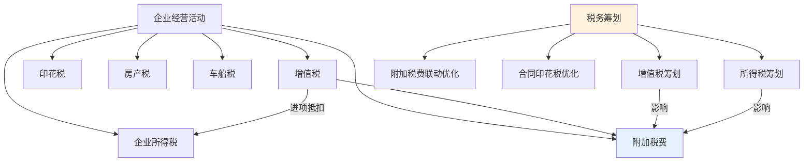

## 五、其他重要税种

在前面的章节中，我们已经系统讲解了中国税收体系的三大核心税种——个人所得税、增值税和企业所得税。这三个税种合计占全国税收收入的约75%，是税务筹划的主战场。但完整的税务筹划视野不能仅限于此，中国现行18个税种中，还有不少税种在特定场景下对个人和企业的税负有重要影响。

本章将按照与个人和中小企业的关联程度，逐一解析这些"其他重要税种"的征税逻辑、税率结构、优惠政策和筹划空间。

### 5.1 契税——房产交易的第一道税

#### 5.1.1 契税基本概念

契税是在土地使用权和房屋所有权发生转移时，向承受方（买方）征收的一种税。简单来说，**买房就要交契税**，这是每个购房者都无法回避的税种。

**法律依据**：《中华人民共和国契税法》（2021年9月1日起施行），取代了此前执行近30年的《契税暂行条例》。

**纳税人**：土地、房屋权属的承受方（买方、受赠方、互换支付差价方）。

**征税范围**：
- 国有土地使用权出让
- 土地使用权转让（出售、赠与、互换）
- 房屋买卖、赠与、互换

> **关键理解**：契税是"买方税"，由买方承担。这与个人所得税（卖方税）形成互补——房产交易中，卖方交个税（或增值税），买方交契税。

#### 5.1.2 税率与计算

**法定税率**：3%～5%，具体由省级政府在幅度内确定。

**实际执行税率**（个人购买住房，全国普遍适用）：

| 情形 | 税率 | 说明 |
|------|------|------|
| 首套房，面积≤90㎡ | 1% | 优惠税率 |
| 首套房，面积>90㎡ | 1.5% | 优惠税率 |
| 二套房，面积≤90㎡ | 1% | 优惠税率 |
| 二套房，面积>90㎡ | 2% | 优惠税率 |
| 三套及以上住房 | 3%～5% | 无优惠，按地方标准 |
| 非住房（商铺、车位等） | 3%～5% | 无优惠 |

> **注意**：上述1%～2%的优惠税率仅限于个人购买**家庭唯一住房**或**第二套改善性住房**，具体认定标准由各地税务机关执行。部分城市对"首套房"的认定以"区"为单位（认房不认贷或认贷不认房），需关注当地政策。

**计税依据**：
- 房屋买卖：成交价格（不含增值税）
- 土地使用权出让：成交价格
- 赠与：税务机关参照市场价格核定
- 互换：价格差额

**计算公式**：

$$应纳契税 = 计税价格 \times 适用税率$$

**案例**：小张在北京购买首套住房，面积85㎡，成交价300万元（含税，增值税免税），则：

$$契税 = 300万 \times 1\% = 3万元$$

若面积为120㎡，则：

$$契税 = 300万 \times 1.5\% = 4.5万元$$

#### 5.1.3 契税的筹划空间

**（一）住房套数的认定优化**

契税优惠的核心在于"首套"和"二套"的认定。在全国范围内：
- 部分城市实行"认房不认贷"——只要当前名下无房即为首套，不论是否有贷款记录
- 部分城市实行"认贷不认房"——有过贷款记录即算二套
- 2023年后，多数城市已转向"认房不认贷"

**筹划要点**：在购房前，先了解目标城市的认定规则。如果城市认房不认贷，可以先卖掉名下房产再购买，享受首套优惠。

**（二）合理拆分交易价格**

对于同时购买住房和车位/储藏室的情况，部分地区允许分别签订合同。由于车位通常按3%～5%缴税，如果能合理拆分价格，可以适当降低整体税负。但需注意：拆分必须有合理商业理由，税务机关有权核定。

**（三）夫妻间加名/更名的契税免征**

根据《契税法》第六条，婚姻关系存续期间夫妻之间变更土地、房屋权属，**免征契税**。这意味着：
- 夫妻间加名：免契税
- 夫妻间减名：免契税
- 离婚析产过户：免契税

这是最常见的合法节税手段之一。如果需要在家庭成员间调整房产归属，优先考虑通过婚姻关系变更路径。

**（四）法定继承免契税**

法定继承人通过继承承受土地、房屋权属，**免征契税**。但遗赠（非法定继承人受赠）仍需缴纳契税。

#### 5.1.4 常见误区

**误区一：契税可以和卖方协商谁交**

法律明确规定契税由承受方（买方）缴纳。虽然实务中双方可以通过调整房价来转移税负，但申报义务和法律责任在买方。

**误区二：交了契税就完成了房产过户**

契税完税只是过户的前置条件之一。完整的过户流程还需要：不动产登记申请、权属审核、登记簿记载、证书发放。在一些城市，契税和不动产登记已实现"一窗办理"。

**误区三：契税可以退**

原则上契税一经缴纳不予退还。但以下情形可以申请退税：
- 因人民法院判决导致土地、房屋权属转移行为无效，已缴契税可退
- 出让土地使用权交付时因容积率调整退还部分土地出让金，对应契税可退
- 新建商品房交付后实测面积小于合同约定面积，多缴部分可退

---

### 5.2 印花税——最"不起眼"但无处不在的税

#### 5.2.1 印花税基本概念

印花税是对经济活动和经济交往中书立、领受的应税凭证征收的一种税。它覆盖面极广，几乎涉及所有经济合同和产权转移行为。

**法律依据**：《中华人民共和国印花税法》（2022年7月1日起施行）。

**核心特征**：
- **税负极轻**：税率多为万分之几甚至千分之几
- **覆盖面极广**：17类合同/凭证需要缴纳
- **双向征收**：合同的双方（或多方）都是纳税人
- **自行贴花/申报**：不需要税务机关核定

#### 5.2.2 应税凭证与税率

印花税的应税凭证分为四大类：合同、产权转移书据、营业账簿、证券交易。以下是最常见的应税凭证及税率：

| 应税凭证 | 税率 | 计税依据 | 说明 |
|----------|------|----------|------|
| 买卖合同 | 0.03% | 合同金额 | 不含增值税 |
| 借款合同 | 0.005% | 借款金额 | 银行及金融机构借款 |
| 租赁合同 | 0.1% | 租金总额 | 含物业管理费 |
| 技术合同 | 0.03% | 合同金额 | 技术开发、转让、咨询、服务 |
| 建设工程合同 | 0.03% | 合同金额 | 工程承包 |
| 运输合同 | 0.03% | 运输费用 | 货运、客运 |
| 仓储保管合同 | 0.1% | 保管费用 | 仓储服务 |
| 财产保险合同 | 0.1% | 保险费 | 不含人身保险 |
| 土地使用权出让/转让书据 | 0.05% | 合同金额 | 产权转移 |
| 房屋买卖合同 | 0.05% | 合同金额 | 产权转移 |
| 股权转让书据 | 0.05% | 转让金额 | 上市公司为0.1% |
| 营业账簿（实收资本+资本公积） | 0.025% | 账簿金额 | 仅"营业账簿"税目 |
| 证券交易 | 0.05%（出让方） | 成交金额 | 2023年8月起减半 |

> **重要提示**：2023年8月28日起，证券交易印花税由0.1%减半至0.05%，仅对出让方征收。这是A股市场的重大利好。

#### 5.2.3 印花税的计算实例

**案例一：企业签订购销合同**

某公司与供应商签订原材料采购合同，金额100万元（不含增值税）：

$$印花税 = 100万 \times 0.03\% = 300元$$

由于买卖双方都是纳税人，双方各缴300元。

**案例二：个人购买二手房**

小李购买一套二手房，成交价200万元（不含增值税）：

$$买卖合同印花税 = 200万 \times 0.05\% = 1000元$$

但根据现行政策，个人销售或购买住房**暂免征收印花税**。因此小李实际缴纳0元。

**案例三：租赁合同**

某公司签订3年办公场地租赁合同，年租金60万元：

$$租赁合同印花税 = 60万 \times 3年 \times 0.1\% = 1800元$$

在签订合同时一次性缴纳。

#### 5.2.4 印花税的筹划空间

**（一）合同类型的合理选择**

不同类型的合同适用不同税率。例如：
- "技术开发合同"（0.03%）vs "技术服务合同"（0.03%）税率相同，但"技术咨询合同"如果能归入"技术合同"税目同样享受0.03%，而非按"其他合同"处理
- 财产租赁合同（0.1%）的税负是购销合同（0.03%）的3倍多。在交易实质允许的前提下，合同结构的设计对印花税有直接影响

**（二）合同金额的合理拆分**

对于包含多种业务的综合合同，如果能合理拆分为不同类型的合同，可能适用更低的税率。但需注意：拆分必须有合理商业理由，不能人为割裂。

**（三）利用免税政策**

印花税有较多法定免税项目，与个人和中小企业关系密切的包括：
- 个人销售或购买住房的买卖合同
- 个人出租住房的租赁合同
- 无息、贴息贷款合同
- 农牧业保险合同
- 与高校学生签订的高校学生公寓租赁合同
- 对金融机构与小型企业、微型企业签订的借款合同免征印花税

**（四）"小额零星"免征**

应税合同、产权转移书据未列明金额的，按照实际结算金额确定。如果合同金额极小（如某些框架合同），需评估是否值得单独贴花。

#### 5.2.5 常见误区与风险

**误区一：口头合同不用交印花税**

印花税以应税凭证为纳税依据，口头合同确实不产生书面凭证。但如果口头合同后续通过结算单、收据等书面形式确认，这些凭证可能成为应税凭证。

**误区二：电子合同不用交**

根据规定，以电子形式签订的应税凭证，与书面凭证具有同等法律效力，同样需要缴纳印花税。电商平台的订单、电子签约平台的合同都在征税范围内。

**误区三：框架协议/意向书不交**

框架协议和意向书如果未明确金额、标的等关键条款，一般不视为应税合同。但如果包含了实质性交易内容，税务机关可能认定为应税凭证。

---

### 5.3 消费税——隐形的价格推手

#### 5.3.1 消费税基本概念

消费税是以消费品的流转额作为征税对象的一种税，属于流转税。它不是对所有商品征收的，而是**选择性地对特定消费品征收**，目的是调节消费结构、引导消费方向。

**法律依据**：《中华人民共和国消费税暂行条例》（2008年修订）。

**纳税人**：在中国境内生产、委托加工和进口应税消费品的单位和个人。

**核心特征**：
- **价内税**：消费税包含在商品价格中，消费者在购买时已经承担但看不到单独的税额
- **单环节征收**：一般在生产（进口）环节征收，不是每个流转环节都征
- **选择性征收**：只对15类特定消费品征收

> **与个人的关系**：消费税虽然由生产者或进口商缴纳，但税负最终通过价格转嫁给消费者。你买烟、酒、化妆品、成品油时，价格中已经包含了消费税。理解消费税有助于理解价格构成，以及为什么某些商品特别贵。

#### 5.3.2 应税消费品与税率

消费税目前覆盖15个税目，以下是最主要的几类：

| 税目 | 税率范围 | 征收方式 | 与个人的关系 |
|------|----------|----------|------------|
| 烟（卷烟、雪茄、烟丝） | 56%或36%+0.003元/支 | 复合计征 | 极高税负，占烟价60%+ |
| 高档化妆品 | 15% | 从价 | 完税价格≥1万元/千克 |
| 贵重首饰及珠宝玉石 | 5%或10% | 从价 | 金银首饰5%，其他10% |
| 成品油（汽油、柴油等） | 1.52～1.52元/升 | 从量 | 加油即承担 |
| 小汽车 | 1%～40% | 从价（超豪华加征） | 按排量分档 |
| 摩托车 | 3%～10% | 从价 | 按排量分档 |
| 高尔夫球及球具 | 10% | 从价 | 高端消费品 |
| 高档手表 | 20% | 从价 | 完税价格≥1万元 |
| 游艇 | 10% | 从价 | 高端消费品 |
| 电池 | 4% | 从价 | 含铅蓄电池 |
| 涂料 | 4% | 从价 | 施工状态下VOC>420g/L |

#### 5.3.3 消费税的税率结构——以卷烟为例

消费税的税率设计体现了明确的政策导向。以卷烟为例，其税负构成非常复杂：

```text
生产环节：
  甲类卷烟（调拨价≥70元/条）：56% + 0.003元/支
  乙类卷烟（调拨价<70元/条）：36% + 0.003元/支

批发环节（2009年起加征）：
  11% + 0.005元/支
```

这意味着一包烟的最终价格中，消费税占比可能超过60%。再加上增值税13%，以及城建税和教育费附加（以消费税和增值税为税基），一包烟的综合税负可达最终零售价的70%以上。

#### 5.3.4 小汽车消费税的筹划空间

对于个人购买汽车，消费税已经在车价中体现（价内税），消费者不需要单独缴纳。但理解消费税结构有助于做出更经济的购车决策：

**按排量分档的税率**：

| 排量 | 税率 | 车型举例 |
|------|------|----------|
| ≤1.0L | 1% | 微型车 |
| 1.0L～1.5L | 3% | 大部分紧凑型车 |
| 1.5L～2.0L | 5% | 中型车 |
| 2.0L～2.5L | 9% | 中大型车 |
| 2.5L～3.0L | 12% | 中高端车 |
| 3.0L～4.0L | 25% | 豪华车 |
| >4.0L | 40% | 超豪华车 |

**超豪华小汽车加征**：零售价格130万元（不含增值税）及以上的乘用车和中轻型商用客车，在生产（进口）环节消费税基础上，**零售环节再加征10%消费税**。

**筹划思路**：
- 排量每增加一个档次，消费税率跳升幅度巨大。2.0L和2.5L之间，税率从5%跳到9%，反映到车价上可能是数万元的差异
- 对于企业购车，超豪华汽车的零售环节10%加征由零售环节纳税人（即4S店）代收代缴，最终体现在价格中
- 新能源汽车（纯电动、燃料电池）不征收消费税，这是国家鼓励新能源的政策体现

#### 5.3.5 消费税改革趋势

消费税是中国税制改革的重点方向之一。近年来的改革趋势包括：

1. **征收环节后移**：将部分消费税（如成品油、烟酒）的征收环节从生产端后移到批发或零售端，使消费税更贴近消费地，增加地方政府收入
2. **税率结构调整**：对高档手表、私人飞机、游艇等奢侈品可能进一步提高税率
3. **扩大征税范围**：可能将高糖饮料、私人安保等纳入征税范围
4. **收入归属调整**：消费税可能从中央税转为中央与地方共享税

这些改革动向对税务筹划有前瞻性指导意义——如果征收环节后移到零售端，消费者将更直观地感受到消费税的存在。

---

### 5.4 房产税——持有环节的长期成本

#### 5.4.1 房产税基本概念

房产税是以房屋为征税对象，按房屋的计税余值或租金收入为计税依据，向产权所有人征收的一种财产税。

**法律依据**：《中华人民共和国房产税暂行条例》（1986年）。

**核心区分**：目前中国房产税有两个体系，必须区分清楚：

| 维度 | 传统房产税 | 房产税改革试点 |
|------|-----------|--------------|
| 法律依据 | 1986年暂行条例 | 2021年全国人大授权决定 |
| 征税范围 | 经营性用房 | 重庆、上海试点住宅 |
| 对个人住房 | 暂不征收（自住） | 试点城市部分征收 |
| 现状 | 全国执行 | 试点城市执行，暂未全国推广 |

> **关键理解**：绝大多数普通居民的自住住房，目前**不缴纳房产税**。房产税主要影响的是企业持有的房产、个人出租的房产，以及重庆和上海试点范围内的部分个人住房。

#### 5.4.2 传统房产税的计算

**经营性用房（自用）**：

$$应纳税额 = 房产原值 \times (1 - 扣除比例) \times 1.2\%$$

扣除比例一般为10%～30%，由省级政府确定。

**经营性用房（出租）**：

$$应纳税额 = 租金收入 \times 12\%$$

**个人出租住房**（优惠税率）：

$$应纳税额 = 租金收入 \times 4\%$$

**案例**：某公司将一栋办公楼出租，年租金收入100万元：

$$房产税 = 100万 \times 12\% = 12万元$$

如果改为自用，假设房产原值800万元，扣除比例30%：

$$房产税 = 800万 \times (1-30\%) \times 1.2\% = 6.72万元$$

自用的税负远低于出租，这体现了"自用低税、出租高税"的政策导向。

#### 5.4.3 上海和重庆试点概况

**上海试点（2011年至今）**：
- 征收对象：本市居民家庭第二套及以上住房、非本市居民家庭新购住房
- 计税依据：交易价格的70%
- 税率：0.6%（应税价格低于上年度新建商品住房平均价格2倍的，减为0.4%）
- 免税面积：人均60平方米

**重庆试点（2011年至今）**：
- 征收对象：独栋商品住宅、高档住房（均价2倍以上）、非本市居民新购第二套及以上住房
- 税率：0.5%～1.2%
- 免税面积：独栋100平方米、高档住房100平方米

> **实际影响有限**：从十多年试点效果看，上海和重庆的房产税试点对房价的抑制作用有限，税收收入占比也很小。全国性的房产税立法因经济形势变化而暂缓推进。

#### 5.4.4 房产税的筹划空间

**（一）经营用房的用途规划**

如果持有商业房产，自用和出租的税负差异很大（自用1.2% vs 出租12%）。对于闲置商铺，需要综合考虑：
- 出租收益能否覆盖12%的房产税及其他税费
- 自用经营的利润是否高于出租净收益减去税负差异

**（二）个人出租住房的综合税负优化**

个人出租住房涉及的税种包括：增值税（1.5%优惠）、房产税（4%优惠）、个人所得税（10%优惠税率）、城建税及附加。如果按综合征收率计算，许多城市采用"综合征收率"简化申报：

| 城市 | 综合征收率（月租金≤10万） | 说明 |
|------|------------------------|------|
| 北京 | 约5% | 增值税免征后约2.5% |
| 上海 | 约5% | 增值税免征后约2.5% |
| 深圳 | 约4.5% | 各区略有差异 |
| 广州 | 约4%～6% | 按月租金分档 |

**核心要点**：个人出租住房月租金不超过10万元的，免征增值税，综合税负大幅下降。

**（三）提前关注全国房产税立法进展**

虽然全国性的房产税立法目前暂缓，但长远来看是大势所趋。对于持有多套房产的个人，应关注政策动向，提前评估：
- 持有成本增加对投资回报率的影响
- 是否需要在政策落地前调整资产结构
- 首套免征或人均面积免征的政策预期

---

### 5.5 车船税——有车一族的固定支出

#### 5.5.1 车船税基本概念

车船税是对在中国境内的车辆、船舶的所有人或管理人征收的一种财产税。

**法律依据**：《中华人民共和国车船税法》（2012年1月1日起施行）。

**核心特征**：
- **按年申报，一次缴纳**：每年缴纳一次
- **与交强险捆绑**：通常在购买交强险时由保险公司代收代缴
- **按排量分档**：乘用车按发动机排量分7档

#### 5.5.2 乘用车税率标准

| 排量 | 年税额 | 典型车型 |
|------|--------|----------|
| ≤1.0L | 60～360元 | 微型车 |
| 1.0L～1.6L | 300～540元 | 紧凑型车 |
| 1.6L～2.0L | 360～660元 | 中型车主流区间 |
| 2.0L～2.5L | 660～1200元 | 中大型车 |
| 2.5L～3.0L | 1200～2400元 | 豪华入门 |
| 3.0L～4.0L | 2400～3600元 | 高性能车 |
| >4.0L | 3600～5400元 | 超跑/超豪华 |

> 具体税额由省级政府在幅度内确定。例如，北京市1.6L～2.0L排量的乘用车年税额为480元。

#### 5.5.3 车船税的减免政策

**法定免征**：
- 捕捞、养殖渔船
- 军队、武装警察部队专用车船
- 警用车船
- 悬挂应急救援专用号牌的国家综合性消防救援车辆和船舶
- 外国驻华使领馆、国际组织驻华代表机构及其有关人员的车船

**法定减半**：
- 节能汽车（排量1.6L以下，综合工况油耗达标）减半征收

**新能源车免征**：
- 纯电动汽车、燃料电池汽车：免征
- 插电式混合动力汽车：减半征收

> **实际意义**：对于购买新能源汽车的个人，车船税虽然金额不大（数百到数千元/年），但免征是实实在在的优惠。加上购置税减免和消费税免征，新能源汽车在税费方面有显著优势。

---

### 5.6 车辆购置税——买车时的一次性税费

#### 5.6.1 车辆购置税基本概念

车辆购置税是在中国境内购置应税车辆时缴纳的一次性税收。

**法律依据**：《中华人民共和国车辆购置税法》（2019年7月1日起施行）。

**纳税人**：购置（购买、进口、自产、受赠、获奖等方式取得）应税车辆的单位和个人。

**税率**：统一10%。

**计税依据**：应税车辆的计税价格（不含增值税）。

$$应纳税额 = 计税价格 \times 10\%$$

**案例**：购买一辆裸车价20万元（不含增值税）的汽车：

$$车辆购置税 = 20万 \times 10\% = 2万元$$

#### 5.6.2 车辆购置税的减免政策

这是车辆购置税筹划中最有价值的部分：

| 车辆类型 | 优惠政策 | 政策有效期 |
|----------|----------|-----------|
| 新能源汽车（纯电动） | 免征 | 延续至2027年底 |
| 新能源汽车（插混、增程） | 免征 | 延续至2027年底 |
| 节能汽车（排量≤2.0L且不含税≤30万） | 减半（阶段性） | 根据政策公告 |
| 回国留学人员购车 | 免征（国产车） | 长期有效 |
| 外交人员车辆 | 免征 | 长期有效 |

**新能源汽车免征购置税**的经济意义：

以购买一辆不含税价30万元的新能源汽车为例：
- 传统燃油车购置税：30万 × 10% = 3万元
- 新能源汽车购置税：0元

节省3万元，加上免征消费税和车船税，新能源汽车在购车和持有环节的税费优势合计可达数万元。

#### 5.6.3 车辆购置税的筹划空间

**（一）新能源 vs 燃油车的税费对比**

| 对比维度 | 燃油车（2.0L排量） | 纯电动新能源车 |
|----------|-------------------|--------------|
| 购置税 | 10% | 免征 |
| 消费税 | 5%（含在车价中） | 免征 |
| 车船税（年） | 约480～660元 | 免征 |
| 上牌费用 | 相同 | 相同 |
| 10年持有税费节省 | - | 约5～8万元 |

**（二）计税价格的确认**

车辆购置税的计税价格是不含增值税的价格。如果经销商开具的发票价格明显偏低且无正当理由，税务机关有权按照最低计税价格核定。因此：
- 不要为了少交购置税而要求低开发票，税务机关会按核定价格征收
- 同时，正常开票即可，不必为了"全额纳税"而高开发票

**（三）二手车不征购置税**

车辆购置税只在新车购置时征收一次。购买已税二手车不需要再次缴纳。但如果新车购置时享受了减免税优惠（如新能源免税），车辆转让后，新车主在该车报废前不再补征。

---

### 5.7 城市维护建设税与教育费附加——"税上税"

#### 5.7.1 基本概念

城市维护建设税（城建税）和教育费附加不是独立税种，而是以纳税人实际缴纳的增值税和消费税税额为计税依据征收的附加税费。可以理解为"税上税"。

| 项目 | 税/费率 | 计税依据 |
|------|---------|----------|
| 城市维护建设税 | 7%/5%/1% | 实缴增值税 + 实缴消费税 |
| 教育费附加 | 3% | 实缴增值税 + 实缴消费税 |
| 地方教育附加 | 2% | 实缴增值税 + 实缴消费税 |

**城建税税率**：
- 市区：7%
- 县城、镇：5%
- 其他地区：1%

#### 5.7.2 附加税费的优惠

**小规模纳税人和小微企业减免**：
- 2023年至2027年底，增值税小规模纳税人、小型微利企业和个体工商户，城建税、教育费附加、地方教育附加减半征收
- 月销售额≤10万元（季度≤30万元）免征教育费附加和地方教育附加

**实际影响**：对于月销售额不超过10万元的小微企业和个体户，增值税免征后，对应的附加税费自然为零。

---

### 5.8 土地增值税——房地产开发的"利润收割机"

#### 5.8.1 基本概念

土地增值税是对转让国有土地使用权、地上建筑物及其附着物所取得的增值额征收的一种税。它主要影响房地产开发企业和转让不动产的单位个人。

**法律依据**：《中华人民共和国土地增值税暂行条例》。

**纳税人**：转让房地产并取得收入的单位和个人。

**计税依据**：转让房地产所取得的增值额（收入减去扣除项目）。

#### 5.8.2 税率结构——四级超率累进税率

土地增值税采用四级超率累进税率，增值越多税率越高：

| 增值率 | 税率 | 速算扣除系数 |
|--------|------|------------|
| ≤50% | 30% | 0 |
| 50%～100% | 40% | 5% |
| 100%～200% | 50% | 15% |
| >200% | 60% | 35% |

> **增值率** = 增值额 ÷ 扣除项目金额 × 100%

#### 5.8.3 与个人的关系

**个人销售住房免征土地增值税**：根据现行规定，个人销售住房暂免征收土地增值税。这极大地简化了个人二手房交易的税负。

**个人转让非住房需缴纳**：如果个人转让商铺、写字楼、车位等非住房不动产，需要缴纳土地增值税。

**案例**：小王5年前购买一间商铺100万元，现在以200万元转让。扣除合理费用（契税、印花税、中介费等）后，扣除项目合计120万元：

$$增值额 = 200万 - 120万 = 80万$$
$$增值率 = 80万 ÷ 120万 = 66.7\%$$
$$土地增值税 = 80万 × 40\% - 120万 × 5\% = 32万 - 6万 = 26万$$

这是一个相当可观的税负。在投资商铺等非住房不动产时，必须将土地增值税纳入持有成本测算。

---

### 5.9 环境保护税——排污付费

#### 5.9.1 基本概念

环境保护税是对在中国境内直接向环境排放应税污染物的企事业单位和其他生产经营者征收的一种税。

**法律依据**：《中华人民共和国环境保护税法》（2018年1月1日起施行）。

**纳税人**：直接向环境排放应税污染物的企事业单位和其他生产经营者。**个人不属于纳税人**。

**应税污染物**：大气污染物、水污染物、固体废物、噪声。

#### 5.9.2 与个人的关系

虽然个人不直接缴纳环保税，但理解环保税有以下意义：
- **投资视角**：高污染行业的企业面临更高的环保税负，影响其利润和估值。投资决策中应考虑目标企业的环保合规风险
- **创业视角**：如果创办制造业企业，环保税是必须纳入成本测算的项目
- **间接影响**：环保税成本最终可能通过商品价格传导给消费者

---

### 5.10 资源税与城镇土地使用税

#### 5.10.1 资源税

资源税是对在中国境内开采矿产品或者生产盐的单位和个人征收的一种税。

**与个人的关系**：个人一般不直接涉及资源税。但了解资源税有助于理解能源和原材料价格的构成。例如：
- 原油、天然气的资源税税率为6%
- 煤炭的资源税税率为2%～10%（从价计征）
- 稀土、钨、钼等战略性矿产资源税率为轻稀土7%～12%、中重稀土和钨20%、钼8%

这些税率直接影响能源和原材料价格，进而影响CPI和PPI。

#### 5.10.2 城镇土地使用税

城镇土地使用税是对在城市、县城、建制镇和工矿区范围内使用土地的单位和个人征收的一种税。

**计税方式**：按实际占用土地面积 × 适用税额标准（每平方米年税额）。

**与个人的关系**：
- 个人自住住宅用地暂免征收
- 个人经营性用房占地需要缴纳
- 税额标准由各地在法定幅度内确定（大城市1.5～30元/㎡/年，小城市0.9～18元/㎡/年）

---

### 5.11 各税种筹划的综合视角

#### 5.11.1 房产交易的全税种分析

一次房产交易涉及的税种远比多数人想象的多。以下是一手房和二手房交易的完整税种清单：

**二手房交易税负全景**：

| 环节 | 卖方承担 | 买方承担 |
|------|----------|----------|
| 签约 | 增值税（不满2年）、个税（非满五唯一）、印花税（住房免征） | 契税、印花税（住房免征） |
| 过渡 | — | — |
| 过户 | — | 不动产登记费 |
| 持有（年） | — | 房产税（经营性）、城镇土地使用税（经营性） |

**案例：北京一套500万元二手房的税费全景**（满五唯一，首套90㎡以下）：

| 税费项目 | 金额 | 承担方 |
|----------|------|--------|
| 增值税 | 0（满2年免征） | 卖方 |
| 个人所得税 | 0（满五唯一免征） | 卖方 |
| 契税 | 500万 × 1% = 5万 | 买方 |
| 印花税 | 0（住房免征） | 双方 |
| 中介费 | 约10～15万 | 双方各半 |
| **买方总税费** | **约5万** | - |
| **卖方总税费** | **约0 + 中介费** | - |

同一个案例，如果不满足"满五唯一"条件：

| 税费项目 | 金额 | 承担方 |
|----------|------|--------|
| 个人所得税 | 500万 × 1% = 5万（或差额20%） | 卖方 |
| **卖方总税费** | **约5万 + 中介费** | - |

> **筹划核心**：个人住房交易中，"满二"免增值税和"满五唯一"免个税是最大的两个税收优惠。在选择出售时机时，等待满足这些条件可以节省数万甚至数十万元税费。

#### 5.11.2 企业经营的多税种联动

企业经营涉及的税种之间存在联动关系，筹划时必须整体考虑：



**关键联动关系**：
- 增值税减少 → 附加税费随之减少（城建税、教育费附加以增值税为税基）
- 增值税进项充分抵扣 → 既降低增值税，也降低附加税费
- 合理拆分合同类型 → 降低印花税税负
- 房产自用 vs 出租 → 房产税税率差异巨大（1.2% vs 12%）

#### 5.11.3 个人家庭的税种优化清单

将本章涉及的所有与个人相关的税种优化点汇总：

| 税种 | 核心优化策略 | 潜在节税 |
|------|------------|----------|
| 契税 | 确认首套认定规则；利用夫妻更名免税 | 数万元 |
| 印花税 | 个人住房买卖免征；合同类型优化 | 数千元 |
| 消费税 | 购车选排量/新能源；了解价格中的隐含税 | 数千～数万元 |
| 房产税 | 出租住房享受4%优惠税率；月租≤10万免增值税 | 数千～数万元 |
| 车船税 | 购买新能源车免征 | 数百元/年 |
| 车辆购置税 | 购买新能源车免征 | 数万元 |
| 土地增值税 | 个人住房免征；转让非住房需规划时机 | 数万～数十万元 |
| 附加税费 | 依托增值税优惠自动减免 | 与增值税联动 |

---

### 5.12 本节常见误区总结

#### 误区一："小税种不重要，不用关注"

事实：单一小税种金额确实不大，但多个小税种叠加后金额可观。一次房产交易中，契税+印花税+附加税费可能达到数万甚至十多万元。忽视它们会导致财务规划出现重大缺口。

#### 误区二："消费税跟我没关系，那是企业交的"

事实：消费税是价内税，税负包含在商品价格中。你买每一包烟、每一升汽油、每一瓶高档化妆品，都已经承担了消费税。理解消费税有助于理解商品定价逻辑和做出更理性的消费决策。

#### 误区三："房产税马上要全国推行了"

事实：全国性房产税立法因经济形势变化而暂缓。短期内大规模推广的可能性较低，但长期仍是方向。不要因为恐慌而仓促卖房，也不应完全忽视这一趋势。

#### 误区四："印花税金额小，随便交就行"

事实：印花税虽然单笔金额小，但违法行为的处罚力度不轻。未贴或少贴印花税的，处以应补税额50%以上5倍以下的罚款。对于企业而言，印花税的合规管理不可忽视。

#### 误区五："买新能源车就是零税费"

事实：新能源汽车在消费税、车辆购置税、车船税方面确实有减免，但仍需缴纳增值税（13%）、交强险、上牌费等。新能源车的综合持有成本低，但不是零。

---

### 5.13 进阶：税种间的政策协同

理解各税种之间的政策协同关系，是税务筹划从"单点优化"迈向"系统优化"的关键：

**协同一：新能源汽车的税费全链条优惠**

国家对新能源汽车的支持是全方位的税费减免：
- 生产端：免征消费税
- 购买端：免征车辆购置税
- 持有端：免征车船税
- 使用端：充电费用按较低的电价计费（不含成品油消费税）

四个环节的税费优惠叠加，使得新能源汽车的全生命周期成本显著低于同价位燃油车。

**协同二：小微企业和个体户的税费联动减免**

- 增值税：月销售额≤10万元免征
- 附加税费：增值税免征则附加税费为零
- 印花税：借款合同免征
- 企业所得税/个税：小型微利企业优惠税率

一个环节的减免触发多个环节的联动效果。

**协同三：住房交易的税费套餐优化**

通过合理安排交易时机，可以同时触发多个税种的优惠：
- "满二"免增值税 → 同时免附加税费
- "满五唯一"免个人所得税
- 住房买卖免印花税
- 首套/二套享受契税优惠税率

在最优条件下，一套住房交易的税费可以降到最低——买方仅需缴纳1%～1.5%的契税。

---

### 5.14 实操工具：税种速查表

在进行任何重大经济决策前，用以下清单快速排查涉及的税种：

```text
□ 购买房产 → 契税、印花税（住宅免征）
□ 出售房产 → 增值税（满二免）、个税（满五唯一免）、土增税（住宅免）
□ 租赁房产 → 增值税、房产税（4%）、个税、附加税费
□ 购买车辆 → 车辆购置税（新能源免）、消费税（含在车价中）
□ 持有车辆 → 车船税（新能源免）/年
□ 签订合同 → 印花税
□ 企业经营 → 增值税、企业所得税、附加税费、印花税
□ 转让股权 → 印花税、所得税
□ 转让商铺 → 增值税、土增税、个税、印花税
□ 投资理财 → 个税（股息/利息/转让所得）
```

掌握这个清单，你就不会在重大决策中遗漏任何一个需要考虑的税种。

---

> **本节小结**：中国税制的18个税种中，个人所得税、增值税和企业所得税是"主战场"，但其他税种在特定场景下同样能产生重大影响。契税关系到每一次房产交易，印花税无处不在，消费税隐藏在价格中，房产税是未来的重要变量。系统掌握这些税种的基本逻辑和筹划空间，才能做到税务筹划的全面覆盖，不留盲区。
