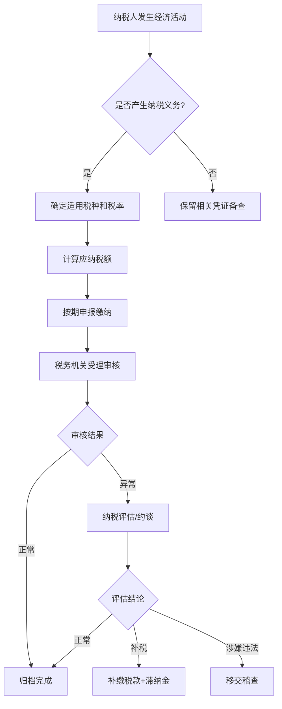
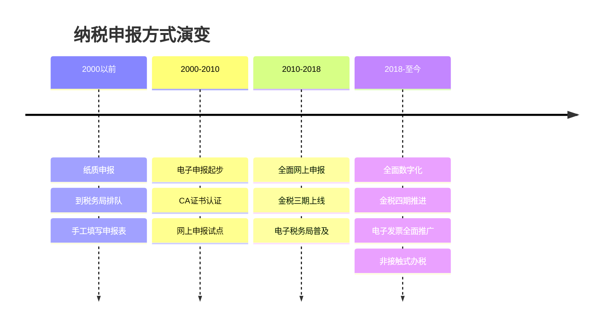
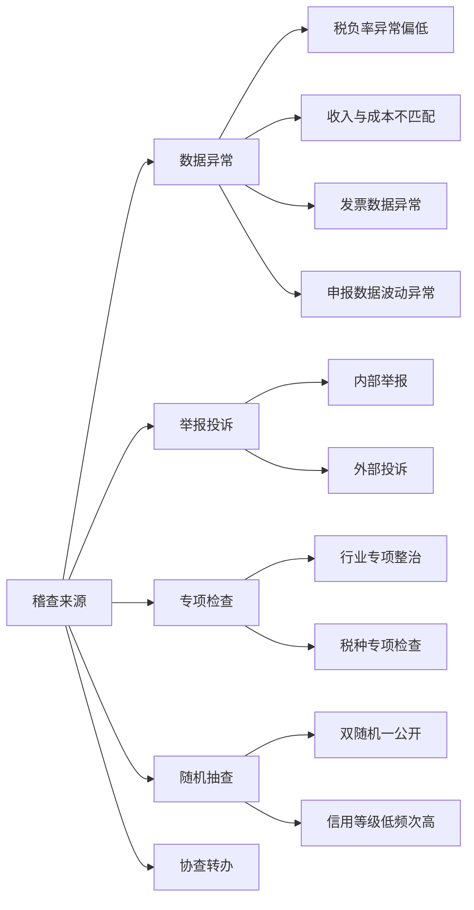

## 六、税收征管基础

税收征管是税务筹划的"游戏规则"。不懂征管制度的税务筹划，就像不懂交通规则的司机——即使车技再好，也随时可能翻车。本章系统讲解中国税收征管制度的核心框架，帮助你理解税务机关如何运作、纳税人有哪些权利义务，以及如何在合规的前提下高效完成涉税事务。

### 6.1 税收征管的法律框架

#### 6.1.1 核心法律体系

中国税收征管的法律基础是一个多层级的体系：

| 层级 | 法律法规 | 核心内容 | 与纳税人的关系 |
|------|----------|----------|----------------|
| 法律 | 《税收征收管理法》（2015年修正） | 征管程序的基本规则 | 确定纳税人权利义务的根本依据 |
| 法律 | 《税收征收管理法实施细则》 | 征管法的细化操作规定 | 具体操作层面的合规指引 |
| 行政法规 | 《发票管理办法》 | 发票开具、使用、保管规则 | 日常经营必须遵守 |
| 部门规章 | 各税种征管公告 | 具体税种的申报要求 | 每次申报的具体依据 |
| 规范性文件 | 国家税务总局公告 | 政策解读和操作指引 | 理解政策口径的关键参考 |

**关键认知**：税务筹划的第一步不是研究"怎么少交税"，而是研究"征管流程是怎么走的"。因为很多筹划空间恰恰藏在征管程序的选择节点中——比如收入确认时点、申报方式选择、发票开具时点等。

#### 6.1.2 征管法的核心原则

《税收征收管理法》确立了几项基本原则，理解这些原则有助于判断筹划方案的合规边界：

**税收法定原则**：税务机关必须依法征税，不能随意增加纳税人的税负，也不能随意减免税款。这意味着税法没有禁止的行为，纳税人有权选择对自己有利的方式。

**实质课税原则**：税务机关有权按照交易的经济实质而非法律形式征税。这意味着"形式上合规但实质上虚构交易"的筹划方案可能被税务机关否定。

**诚实推定原则**：在没有证据证明纳税人违法之前，应当推定纳税人是诚实的。但在实践中，税务机关有权进行纳税评估和稽查。

### 6.2 税务登记与管理

#### 6.2.1 税务登记制度

税务登记是纳税人与税务机关建立法律关系的起点。2015年起，中国实行"三证合一、一照一码"改革，将营业执照、组织机构代码证、税务登记证合并为统一社会信用代码。

**企业纳税人登记流程**：

1. **工商注册**：在市场监督管理部门办理营业执照，取得统一社会信用代码
2. **信息确认**：税务机关根据工商共享信息自动完成税务登记
3. **税种认定**：税务机关根据经营范围核定应纳税种、税率、申报期限
4. **银行账户备案**：开立基本存款账户后，需在15日内向税务机关报告
5. **财务制度备案**：选择适用的会计准则和财务核算方法

**个人纳税人登记**：

个人从事生产经营活动，需要办理临时税务登记或个体工商户登记。以下情况需要特别注意：

| 身份类型 | 登记方式 | 适用场景 | 税务处理 |
|----------|----------|----------|----------|
| 个体工商户 | 工商登记+税务登记 | 实体店铺、网店经营 | 经营所得，查账或核定征收 |
| 自由职业者 | 临时税务登记（年收入>12万） | 设计、咨询、写作等 | 劳务报酬或经营所得 |
| 网络主播 | 需要企业化运营 | 直播带货、内容创作 | 视收入规模选择主体形式 |
| 股东/投资人 | 自然人无需单独登记 | 股权投资、分红 | 代扣代缴或自行申报 |

#### 6.2.2 税种认定与申报期限

税务登记完成后，税务机关会进行税种认定，确定你需要申报哪些税种以及申报期限。常见的认定结果：

| 税种 | 申报期限 | 征收方式 | 备注 |
|------|----------|----------|------|
| 增值税（小规模） | 季度终了15日内 | 查账/核定 | 年销售额<500万 |
| 增值税（一般纳税人） | 次月15日内 | 查账征收 | 可抵扣进项税 |
| 企业所得税 | 季度预缴+年度汇算 | 查账/核定 | 年度汇算5月31日前 |
| 个人所得税（综合所得） | 次月15日代扣代缴 | 代扣代缴为主 | 年度汇算3月1日-6月30日 |
| 个人所得税（经营所得） | 季度终了15日内 | 查账/核定 | A表季度B表年度 |
| 印花税 | 按次/按期 | 自行申报 | 合同签订时即产生义务 |

**筹划要点**：了解自己的申报期限和征收方式，是税务筹划的基础。比如，小规模纳税人季度销售额不超过30万元免征增值税（截至2027年12月31日），合理安排收入确认时点可以享受免税优惠。

### 6.3 纳税申报制度

#### 6.3.1 申报方式的演变

中国纳税申报经历了从"跑大厅"到"网上办"的深刻变革：

#### 6.3.2 电子税务局操作实务

电子税务局（etax.chinatax.gov.cn）是目前纳税人办理绝大多数涉税事项的主要渠道。以下是最常用的功能模块：

**日常申报操作**：

1. **登录**：使用统一社会信用代码/身份证号+密码，或通过个人所得税APP扫码登录
2. **税费申报**：进入"我要办税"→"税费申报及缴纳"→选择对应税种
3. **数据填写**：系统通常会预填部分数据（如增值税发票数据），需核对并补充
4. **提交申报**：确认无误后提交，系统自动校验逻辑关系
5. **税款缴纳**：选择三方协议扣款、银联缴款或银行端缴款

**常用功能清单**：

| 功能 | 路径 | 使用频率 | 注意事项 |
|------|------|----------|----------|
| 增值税申报 | 我要办税→税费申报及缴纳 | 每月/每季 | 注意进项税抵扣时限 |
| 企业所得税预缴 | 同上 | 每季 | 季度利润可能与年度差异大 |
| 个税代扣代缴 | 自然人电子税务局 | 每月 | 注意专项附加扣除信息更新 |
| 发票领用 | 我要办税→发票使用 | 按需 | 首次需核定票种 |
| 税务证明开具 | 我要办税→证明开具 | 按需 | 完税证明、纳税证明等 |
| 优惠备案 | 我要办税→税收减免 | 按需 | 部分优惠需事前备案 |

#### 6.3.3 申报错误的更正处理

申报后发现错误是常见情况，处理方式因发现时间和错误类型而异：

**更正申报 vs 补充申报**：

- **更正申报**：申报期内发现错误，可以直接在电子税务局进行更正
- **补充申报**：已过申报期但未进入稽查程序，需要到税务机关办理补充申报
- **稽查补税**：已被税务机关检查发现的错误，需要配合稽查处理

**常见错误及处理方式**：

| 错误类型 | 发现阶段 | 处理方式 | 后果 |
|----------|----------|----------|------|
| 数据填写错误 | 申报期内 | 电子税务局更正 | 无额外处罚 |
| 漏报收入 | 汇算清缴前 | 补充申报+补税 | 加收滞纳金 |
| 多缴税款 | 发现后 | 申请退税或抵缴 | 无处罚 |
| 错用税率 | 自查发现 | 更正申报+补税 | 可能加收滞纳金 |
| 虚开发票 | 稽查发现 | 配合调查 | 行政处罚乃至刑事责任 |

### 6.4 发票管理制度

#### 6.4.1 发票的本质与作用

发票不仅是交易凭证，更是税收征管的核心工具。在中国以"以票控税"为特征的征管体系下，发票承担着三重功能：

- **交易凭证功能**：证明交易的真实发生
- **税收监控功能**：税务机关通过发票数据监控税源
- **抵扣凭证功能**：增值税专用发票可以抵扣进项税额

#### 6.4.2 发票类型与适用场景

| 发票类型 | 适用主体 | 能否抵扣 | 开具方式 | 典型场景 |
|----------|----------|----------|----------|----------|
| 增值税专用发票 | 一般纳税人 | 可以抵扣 | 税控设备/电子发票 | 企业间采购 |
| 增值税普通发票 | 所有纳税人 | 不可抵扣 | 税控设备/电子发票 | 零售、个人消费 |
| 电子普通发票 | 所有纳税人 | 一般不可抵扣 | 电子税务局 | 电商、服务业 |
| 全电发票 | 试点地区 | 视类型 | 电子税务局 | 全面数字化趋势 |
| 机动车销售统一发票 | 汽车经销商 | 可以抵扣 | 专用系统 | 购买机动车 |
| 通行费电子发票 | 收费公路经营方 | 可以抵扣 | 特定平台 | ETC通行费 |

#### 6.4.3 全电发票（数电票）的变革

全电发票（全面数字化的电子发票）是中国发票制度的重大变革，正在逐步全国推广：

**与传统发票的区别**：

| 对比维度 | 传统发票 | 全电发票 |
|----------|----------|----------|
| 载体 | 纸质/电子PDF | 纯数字化XML |
| 领用 | 需申领发票号码段 | 无需申领，按需开具 |
| 限额 | 固定限额 | 动态额度管理 |
| 税控设备 | 需要税控盘/金税盘 | 不需要 |
| 红字发票 | 需申请审批 | 发起确认即可 |
| 查验方式 | 通过特定平台 | 统一平台实时查验 |
| 存储 | 企业自行保管 | 税务机关统一存储 |

**对纳税人的影响**：

1. **降低开票成本**：无需购买和维护税控设备
2. **简化操作流程**：登录电子税务局即可开具
3. **提高数据质量**：结构化数据便于自动处理
4. **加强税务监管**：实时数据传输，异常发票快速发现

#### 6.4.4 发票管理的常见风险

**虚开发票的法律后果**：

虚开发票是最严重的发票违法行为，根据《刑法》第205条：

- **虚开增值税专用发票**：处三年以下有期徒刑或拘役，并处二万元以上二十万元以下罚金
- **虚开税款数额较大**：处三年以上十年以下有期徒刑，并处五万元以上五十万元以下罚金
- **虚开税款数额巨大**：处十年以上有期徒刑或无期徒刑，并处没收财产

**常见的发票违规行为**：

| 违规行为 | 常见场景 | 风险等级 | 后果 |
|----------|----------|----------|------|
| 为他人虚开 | 帮朋友公司"走账" | 极高 | 刑事责任 |
| 让他人为自己虚开 | 购买发票冲成本 | 极高 | 刑事责任 |
| 代开发票 | 未发生真实交易 | 高 | 行政处罚至刑事 |
| 发票开具内容与实际不符 | 品名、金额不一致 | 中-高 | 补税+罚款 |
| 未按规定保管发票 | 丢失发票 | 低-中 | 罚款 |
| 超范围开具发票 | 超出核定的经营范围 | 中 | 可能被认定虚开 |

### 6.5 税务稽查制度

#### 6.5.1 稽查的触发条件

税务稽查并非随机发生。了解稽查的触发条件，有助于在日常经营中做好风险防范：

**金税系统监控的异常指标**：

| 异常指标 | 预警阈值（参考） | 可能的原因 | 风险等级 |
|----------|------------------|------------|----------|
| 增值税税负率 | 低于行业均值30%以上 | 少计收入/多抵进项 | 高 |
| 所得税贡献率 | 低于行业均值50%以上 | 虚增成本/少计收入 | 高 |
| 进项税额占比 | 进项/销项>85% | 虚增进项/收入体外循环 | 高 |
| 期末存货占比 | 存货/收入>50% | 收入确认延迟/虚增存货 | 中 |
| 管理费用占比 | 管理费用/收入>30% | 费用归集不当 | 中 |
| 其他应付款余额 | 持续大额挂账 | 隐匿收入 | 中-高 |
| 现金交易比例 | 现金收入/总收入>40% | 收入不入账 | 高 |

**注意**：以上阈值仅为参考，实际预警标准由各地税务机关根据行业特征动态调整。不同行业的合理税负率差异很大，不能简单横向比较。

#### 6.5.2 稽查流程与纳税人权利

税务稽查有严格的法定程序，纳税人享有多项程序性权利：

**稽查流程**：

1. **选案**：通过数据分析、举报线索等确定检查对象
2. **检查**：送达《税务检查通知书》，调取账簿资料，实地检查
3. **审理**：对检查结果进行法律审核，形成处理意见
4. **执行**：送达《税务处理决定书》和《税务行政处罚决定书》

**纳税人在稽查中的权利**：

| 权利 | 法律依据 | 行使时机 | 实际意义 |
|------|----------|----------|----------|
| 知情权 | 征管法第8条 | 全程 | 有权了解检查的依据和内容 |
| 陈述申辩权 | 征管法第8条 | 检查和审理阶段 | 对事实认定和法律适用提出意见 |
| 听证权 | 行政处罚法 | 拟处罚阶段 | 较大数额罚款前可申请听证 |
| 复议权 | 征管法第88条 | 收到决定后 | 对征税决定可申请行政复议 |
| 诉讼权 | 征管法第88条 | 复议后 | 对复议决定不服可提起行政诉讼 |
| 赔偿权 | 国家赔偿法 | 违法征税后 | 因税务机关违法造成损失可申请赔偿 |
| 保密权 | 征管法第8条 | 全程 | 税务机关对纳税人信息负有保密义务 |

#### 6.5.3 稽查应对策略

面对税务稽查，正确的应对策略至关重要：

**配合而非对抗**：税务机关有法定的检查权，拒绝配合检查本身可能构成违法。正确的做法是在配合检查的同时，积极行使自己的合法权利。

**证据意识**：对税务机关认定的事实有异议时，需要提供相反的证据。日常经营中保留完整的合同、发票、银行流水、物流凭证等，是应对稽查的基础。

**专业支持**：涉及金额较大或情况复杂的稽查案件，建议聘请专业的税务律师或税务师参与应对。专业人士熟悉稽查程序和沟通技巧，能有效保护纳税人权益。

**时间节点**：

| 程序节点 | 期限 | 注意事项 |
|----------|------|----------|
| 收到检查通知书 | 知悉 | 核实检查范围和期间 |
| 提供账簿资料 | 一般15日内 | 可申请延期 |
| 收到处理决定书 | 送达生效 | 60日内可申请复议 |
| 收到处罚决定书 | 送达生效 | 60日内复议或6个月内诉讼 |
| 缴纳税款和滞纳金 | 决定书规定期限 | 复议期间不影响执行 |
| 申请强制执行 | 逾期未缴 | 税务机关可采取强制措施 |

### 6.6 纳税信用管理

#### 6.6.1 信用等级评定

纳税信用等级是税务机关对纳税人纳税遵从度的综合评价，直接影响企业的经营便利程度：

| 等级 | 评分标准 | 占比（参考） | 核心特征 |
|------|----------|-------------|----------|
| A级 | 年度评价指标得分≥90分 | 约10-15% | 纳税遵从度高，无重大违法记录 |
| B级 | 年度评价指标得分≥70分 | 约60-70% | 正常纳税，偶有小瑕疵 |
| M级 | 新设立企业或评价年度无收入 | 新企业 | 默认等级，有待观察 |
| C级 | 年度评价指标得分≥40分 | 约10-15% | 存在较多扣分项 |
| D级 | 年度评价指标得分<40分或直接判D | 约3-5% | 严重失信 |

#### 6.6.2 信用等级的影响

信用等级对企业的实际影响远超多数人的认知：

**A级纳税人权益**：

- 增值税普通发票可按需领用，一次可领3个月用量
- 可单次领取不超过3个月的增值税发票用量
- 连续3年A级可享受绿色通道或专人服务
- 税务机关提供"一对一"纳税辅导
- 出口退税优先办理

**D级纳税人限制**：

- 增值税专用发票领用按辅导期一般纳税人政策执行
- 出口退税从严审核
- 纳入重点监控对象，提高监督检查频次
- D级评价保留2年，第三年不得评为A级
- 相关信息向社会公示，可能影响招投标和融资

#### 6.6.3 信用修复机制

信用等级并非一成不变。如果被评为D级，可以通过以下方式修复：

1. **纠正违法行为**：补缴税款、滞纳金和罚款
2. **消除不良影响**：配合税务机关完成后续管理事项
3. **申请信用修复**：满足条件后可向主管税务机关申请
4. **持续合规经营**：通过后续年度的合规表现逐步提升等级

### 6.7 电子税务局与数字化征管

#### 6.7.1 金税四期的核心变革

金税四期是中国税收征管数字化转型的标志性工程，相比金税三期有质的提升：

| 维度 | 金税三期 | 金税四期 |
|------|----------|----------|
| 数据来源 | 以发票数据为主 | 多源数据融合（银行、市监、社保等） |
| 监控范围 | 以企业为主 | 企业和个人全覆盖 |
| 分析能力 | 规则匹配为主 | AI智能分析+风险画像 |
| 协作机制 | 税务系统内部 | 多部门信息共享 |
| 预警方式 | 事后分析为主 | 实时监控+提前预警 |

**金税四期重点关注领域**：

1. **银行账户监控**：大额交易和可疑交易自动报告
2. **个人收入监控**：多来源收入的归集和比对
3. **关联交易监控**：个人与企业之间的资金往来
4. **社保与个税比对**：社保缴纳基数与个税申报收入的匹配
5. **发票全链条追踪**：从开具到抵扣的完整链路监控

#### 6.7.2 个人税务数字化管理

随着个人所得税APP的普及和金税四期的推进，个人纳税人的数字化管理也在快速升级：

**个人所得税APP核心功能**：

- 综合所得年度汇算（3月1日-6月30日）
- 专项附加扣除信息采集和变更
- 收入纳税明细查询
- 纳税记录开具
- 异议申诉

**个人纳税人的数字足迹**：

在数字化征管环境下，个人的以下信息已基本实现税务可查：

| 信息类型 | 数据来源 | 对个人的影响 |
|----------|----------|--------------|
| 工资薪金 | 扣缴义务人申报 | 基础数据，通常无争议 |
| 劳务报酬 | 代扣代缴+代开发票 | 多来源需自行归集汇算 |
| 经营收入 | 银行流水+发票数据 | 需要完整记账 |
| 股息红利 | 上市公司/被投资企业申报 | 代扣代缴为主 |
| 财产转让 | 不动产/股权登记信息 | 卖房卖股有据可查 |
| 利息收入 | 银行申报 | 个人储蓄利息免税 |
| 租金收入 | 代开发票/合同备案 | 不开发票也有其他数据源 |

### 6.8 纳税人的权利与义务

#### 6.8.1 核心权利

除了前文稽查部分提到的程序性权利外，纳税人在日常办税中还享有以下重要权利：

**税收优惠享受权**：只要符合法定条件，纳税人有权享受税收优惠政策，税务机关不得以任何理由拒绝。但纳税人有义务主动了解政策并按要求申报。

**延期申报权**：因不可抗力或其他正当理由不能按期申报的，可以在申报期限届满前向税务机关申请延期。经核准后，延期期限一般不超过3个月。

**延期缴税权**：因不可抗力导致重大损失或当期货币资金不足以缴纳税款的，经省级税务机关批准，可以延期缴纳税款，但最长不超过3个月。

**退税权**：多缴的税款，纳税人有权要求退还。税务机关发现多征的，应当立即退还；纳税人自结算缴纳税款之日起3年内发现的，可以要求退还并加算银行同期存款利息。

#### 6.8.2 核心义务

| 义务 | 具体要求 | 违反后果 |
|------|----------|----------|
| 依法办理税务登记 | 变更后30日内办理变更登记 | 责令限期改正，可处罚款 |
| 依法设置账簿 | 自领取营业执照之日起15日内 | 责令限期改正，可处罚款 |
| 依法保管账簿 | 账簿、凭证保存10年 | 责令限期改正，可处罚款 |
| 按期申报纳税 | 在规定期限内办理纳税申报 | 责令限期改正+滞纳金，严重的可处罚款 |
| 接受税务检查 | 如实提供资料，不得拒绝 | 责令改正，可处罚款，严重的追究刑责 |
| 报告涉税信息 | 银行账户、关联交易等 | 责令限期改正，可处罚款 |

### 6.9 滞纳金与罚款制度

#### 6.9.1 滞纳金

滞纳金是因未按期缴纳税款而产生的经济补偿，按日加收：

- **计算标准**：滞纳税款 × 0.05% × 滞纳天数
- **起算时间**：从税款缴纳期限届满次日起
- **截止时间**：实际缴纳税款之日
- **无上限**：滞纳金没有封顶限制，长期欠税可能导致滞纳金超过税款本身

**实例计算**：

假设应缴税款10万元，缴纳期限为2024年1月15日，实际于2024年6月15日缴纳：
- 滞纳天数：1月16日至6月15日 = 151天
- 滞纳金 = 100,000 × 0.05% × 151 = 7,550元
- 滞纳金占税款比例：7.55%

**与银行贷款利率对比**：滞纳金年化利率约为18.25%（0.05%×365），远高于一般商业贷款利率。这意味着"拖延缴税"的财务成本非常高，通常不划算。

#### 6.9.2 行政处罚

税务行政处罚主要针对违反税收法律法规但尚未构成犯罪的行为：

| 违法行为 | 处罚标准 | 法律依据 |
|----------|----------|----------|
| 未按期申报 | 2,000元以下罚款；情节严重2,000-10,000元 | 征管法第62条 |
| 偷税 | 追缴税款+滞纳金+50%-5倍罚款 | 征管法第63条 |
| 逃避追缴欠税 | 追缴税款+滞纳金+50%-5倍罚款 | 征管法第65条 |
| 骗取出口退税 | 追缴退税款+1-5倍罚款 | 征管法第66条 |
| 抗税 | 追缴税款+滞纳金+1-5倍罚款 | 征管法第67条 |
| 虚开发票 | 没收违法所得+罚款 | 发票管理办法第37条 |
| 未按规定保管发票 | 10,000元以下罚款 | 发票管理办法第35条 |

### 6.10 税收征管基础对税务筹划的启示

理解税收征管制度后，可以提炼出以下对税务筹划有直接指导意义的认知：

**第一，征管流程中的每个选择节点都是筹划空间**。

从税务登记时的组织形式选择，到收入确认时点的选择，再到发票开具方式的选择，征管流程中的每个决策节点都可能影响税负。筹划的本质是在合法合规的前提下，选择对自己最有利的路径。

**第二，数据透明化是不可逆的趋势**。

金税四期和全电发票的推进，使得税务机关对纳税人的数据掌握越来越全面。过去依赖"信息不对称"的避税手段正在失去空间。未来的税务筹划必须建立在"数据可查、交易真实、逻辑自洽"的基础上。

**第三，合规成本远低于违规成本**。

从滞纳金的年化18.25%利率，到偷税的5倍罚款，再到虚开发票的刑事责任，违规的代价远远超过合规的成本。在数字化征管时代，被发现的概率也越来越高。做好日常合规管理，是最基础也最有效的"筹划"。

**第四，信用管理是长期资产**。

纳税信用等级不仅影响办税便利度，还可能影响招投标、融资、商业合作等。维护良好的纳税信用，是企业和个人的长期战略投资。

**第五，专业支持的投入产出比很高**。

税收征管制度复杂且不断变化，普通纳税人很难全面掌握。在重大交易、年度汇算、稽查应对等关键节点，聘请专业税务师或税务律师的费用，通常远小于他们帮你节省或避免的损失。
