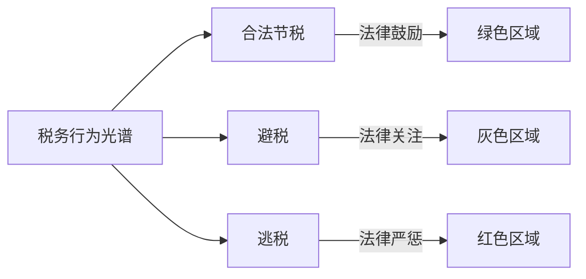
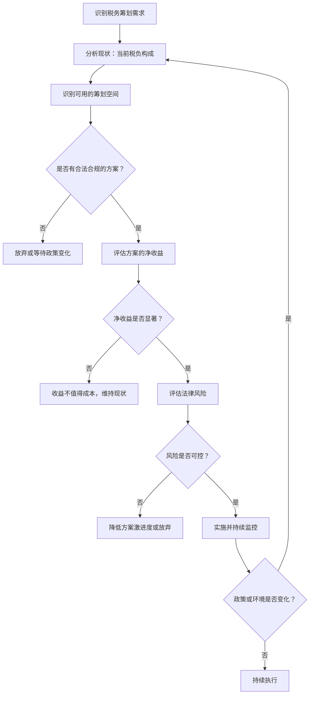

## 七、税务筹划的底层逻辑与思维框架

前面六节分别介绍了中国税制的整体架构、个人所得税、增值税、企业所得税、其他税种以及税收征管的运作方式。本节作为理论基础篇的收尾，将这些碎片化的知识点整合为一套完整的思维框架——不是告诉你"有哪些税"，而是告诉你"如何思考税务问题"。

掌握底层逻辑，比记住任何一条具体政策都更重要。政策会变，但思维方式不会过时。

### 7.1 税务筹划的本质：三个层次的分界线

#### 7.1.1 重新定义"税务筹划"

税务筹划的本质不是"少交税"，而是"不多交税"。这句话听起来像文字游戏，但它划出了一条关键的法律边界。

税务筹划是在完全遵守法律的前提下，通过合理安排经济活动的时间、方式、主体和结构，使纳税人承担与其经济实质相匹配的税负。它与逃税的根本区别不在于"结果"（都少交了税），而在于"手段"（是否合法合规）。

理解这个本质需要区分三个层次，它们在法律性质上完全不同：



| 维度 | 合法节税 | 避税 | 逃税 |
|------|----------|------|------|
| **法律性质** | 合法且受鼓励 | 形式合法但实质存疑 | 违法 |
| **与立法意图关系** | 完全吻合 | 相悖或规避 | 严重违背 |
| **税务机关态度** | 支持 | 反避税调查 | 稽查、处罚、移送司法 |
| **典型手段** | 利用优惠政策、选择权 | 利用税法漏洞、关联交易转移利润 | 隐瞒收入、虚列成本、伪造凭证 |
| **法律后果** | 无风险 | 补税+利息，可能加收滞纳金 | 补税+罚款（0.5-5倍）+滞纳金，严重的追究刑事责任 |
| **举证责任** | 纳税人举证优惠适用条件 | 税务机关启动反避税调查，纳税人举证商业实质 | 税务机关举证违法行为 |

**关键判断标准：** 如果一个方案需要你"造假"才能实现，它就不是筹划而是逃税。如果一个方案虽然合法但没有合理的商业目的、仅仅为了获取税收利益，它就是避税，随时面临被纳税调整的风险。

#### 7.1.2 合法节税的四大法理基础

合法节税之所以被法律允许，背后有明确的法理支撑：

**（1）税收法定原则**

《立法法》第八条明确规定，税种的设立、税率的确定和税收征收管理等税收基本制度只能由法律规定。这意味着：法律没有规定要交的税，你就可以不交；法律给了你选择权，你就可以选择对自己有利的方式。

这是税务筹划最根本的法理基础——你只是在行使法律赋予的选择权。

**（2）实质课税原则**

税务征管应当尊重经济活动的实质而非形式。反过来说，如果你的经济活动确实符合某项优惠政策的实质条件，仅仅因为形式上的小瑕疵而被否定优惠，你可以援引实质课税原则来维护自己的权益。

**（3）量能课税原则**

税负应当与纳税人的负担能力相匹配。高收入者适用高税率、低收入者适用低税率，正是量能课税原则的体现。合理利用这一原则进行税务安排（如将家庭收入在成员间合理分配），是完全正当的。

**（4）信赖利益保护原则**

当纳税人基于现行税法的明确规定做出经济安排后，即使后续税法修改，纳税人的既有利益也应受到保护。这给了长期税务规划一定的确定性保障。

### 7.2 税务筹划的五个底层原理

掌握了法律边界之后，还需要理解驱动税务筹划策略的底层原理。这些原理是所有具体技巧的"公理"——无论政策怎么变，这些原理始终成立。

#### 7.2.1 原理一：货币的时间价值

**核心思想：** 同样金额的税款，今天缴纳和明天缴纳的实际负担是不同的。早交的钱失去了投资增值的机会，晚交的钱在这段时间内可以继续为你工作。

**数学表达：**

```text
递延纳税的价值 = 税款 × [(1 + 投资收益率)^递延年数 - 1]
```

**具体计算：**

假设你有100万元应缴税款，投资年化收益率为6%：

| 递延期 | 终值 | 递延价值 | 递延价值占税款比例 |
|--------|------|----------|-------------------|
| 1年 | 106.0万 | 6.0万 | 6.0% |
| 3年 | 119.1万 | 19.1万 | 19.1% |
| 5年 | 133.8万 | 33.8万 | 33.8% |
| 10年 | 179.1万 | 79.1万 | 79.1% |

递延5年，你就省下了33.8%的等效税负；递延10年，接近80%。这就是为什么几乎所有国家的税务筹划教科书都把"递延"列为第一原理。

**中国税制中的递延机会：**

- **固定资产加速折旧**：允许一次性税前扣除或缩短折旧年限，将未来的税前扣除提前到现在
- **企业亏损结转**：高新技术企业和科技型中小企业可结转10年（普通企业5年），用未来盈利弥补当前亏损
- **分期收款销售**：按合同约定的收款日期确认收入，而非发货时一次性确认
- **股权激励递延纳税**：符合条件的股权激励可在取得时暂不纳税，递延至转让时
- **年终奖单独计税**：在政策有效期内，年终奖可以选择单独计税，有时能实现跨年度的税率递延
- **递延所得税资产/负债**：企业因暂时性差异确认的递延所得税，本身就是时间价值原理的制度化体现

**重要提醒：** 递延不等于免税。递延的价值取决于递延期长短和投资收益率。如果递延期很短（几个月）或资金没有投资渠道，递延的收益可能不值得为之付出的筹划成本。

#### 7.2.2 原理二：边际税率思维

**核心思想：** 在累进税制下，"赚了多少"不重要，"在哪个税率区间赚的"才重要。同样是1万元收入，对月薪5000元的人和月薪10万元的人，税负完全不同。

**中国个人所得税累进税率表（综合所得）：**

| 级数 | 全年应纳税所得额 | 税率 | 速算扣除数 | 该区间实际税负 |
|------|-----------------|------|-----------|---------------|
| 1 | 不超过36,000元 | 3% | 0 | 最高1,080元 |
| 2 | 36,001-144,000元 | 10% | 2,520 | 最高10,800元 |
| 3 | 144,001-300,000元 | 20% | 16,920 | 最高30,000元 |
| 4 | 300,001-420,000元 | 25% | 31,920 | 最高30,000元 |
| 5 | 420,001-660,000元 | 30% | 52,920 | 最高72,000元 |
| 6 | 660,001-960,000元 | 35% | 85,920 | 最高105,000元 |
| 7 | 超过960,000元 | 45% | 181,920 | 无上限 |

**边际税率的实际含义：** 当你的年应纳税所得额超过96万元时，每多赚1块钱，就要多交4毛5分的税。到手只有5毛5。这意味着你需要找到收益率至少82%（=45%÷55%）的投资机会，才能让税后收入的增长速度跟上税前收入。

**边际税率思维的三个应用方向：**

**方向一：税率区间管理——控制收入落入哪个区间**

对于接近税率跳档临界点的纳税人，每减少1万元应纳税所得额，节省的不是3%而是跳档对应的税率差。例如应纳税所得额刚好超过42万元的人，如果能通过合法扣除减少1万元，节省的不是2,500元（25%税率）而是3,000元（30%税率），因为避免了从25%跳到30%的档次。

**方向二：收入类型转换——利用不同收入的税率差异**

| 收入类型 | 最高边际税率 | 适用对象 |
|----------|-------------|---------|
| 工资薪金所得 | 45% | 受雇劳动者 |
| 劳务报酬所得 | 45%（并入综合所得） | 独立劳务提供者 |
| 经营所得 | 35% | 个体工商户、个人独资企业 |
| 利息、股息、红利所得 | 20% | 投资者 |
| 财产转让所得 | 20% | 财产出售者 |
| 财产租赁所得 | 20%（并入综合所得45%） | 出租人 |

从上表可以看到，工资薪金和经营所得之间的税率差异最高可达10个百分点（45% vs 35%），而投资所得的20%比例税率对高收入者更具优势。合法的收入类型转换（如从雇佣关系转为合作关系、从工资转为经营所得）可以产生显著的节税效果，但必须有真实的业务实质支撑。

**方向三：时间维度分散——避免收入集中在单一纳税年度**

将高收入分散到多个纳税年度，可以使每年的收入落入较低的税率区间。例如一笔300万元的服务费，如果在一年内确认，适用35%-45%的边际税率；如果分三年确认，可能全部适用20%-25%的税率。

#### 7.2.3 原理三：纳税主体选择

**核心思想：** 同样的经济活动，由不同的主体（个人、个体工商户、个人独资企业、合伙企业、有限公司）来承担，适用的税制和税率完全不同。

**不同主体的税负对比（以年利润100万元为例）：**

| 主体类型 | 主要税种 | 税负估算 | 税后所得 | 适用场景 |
|----------|---------|---------|---------|---------|
| 工资薪金个人 | 个税（综合所得45%） | 约27.7万 | 约72.3万 | 受雇劳动者 |
| 个体工商户 | 个税（经营所得35%） | 约28.0万 | 约72.0万 | 小规模经营 |
| 个人独资企业 | 个税（经营所得35%） | 约28.0万 | 约72.0万 | 一人经营 |
| 有限公司（小型微利） | 企业所得税5%+个税20%分红 | 约24.0万 | 约76.0万 | 小型微利企业 |
| 有限公司（一般） | 企业所得税25%+个税20%分红 | 约40.0万 | 约60.0万 | 一般企业 |
| 高新技术企业 | 企业所得税15%+个税20%分红 | 约32.0万 | 约68.0万 | 科技企业 |

*注：以上为简化计算，未考虑增值税及其他附加税费，实际税负因具体情况而异。*

**关键洞察：** 小型微利企业的综合税负（企业所得税5% + 分红个税20% ≈ 24%）显著低于个人直接经营的35%，更远低于高薪人群的45%。这就是为什么很多高收入者会通过设立公司来承接业务——不是为了逃税，而是为了适用更优惠的税制。

**但必须注意：** 纳税主体选择必须有真实的商业实质。如果一个人实质上仍然是受雇劳动，仅仅为了避税而设立公司将其包装为"经营所得"，税务机关可以穿透形式认定实质，按照工资薪金征税并加收滞纳金和罚款。

#### 7.2.4 原理四：税收优惠的杠杆效应

**核心思想：** 税收优惠本质上是政府的财政补贴工具。它不是"少交税"，而是"政府替你交了一部分税"。理解这一点，才能真正把握优惠的战略价值。

**税收优惠的三种形式：**

**（1）税率式优惠——直接降低税率**

高新技术企业15%的企业所得税税率（一般企业25%）、小型微利企业的实际税负5%等，直接减少了应纳税额。

**（2）税基式优惠——缩小计税基础**

研发费用加计扣除（2023年起制造业企业加计100%扣除）、固定资产加速折旧、公益性捐赠税前扣除等，通过减少应纳税所得额来降低税负。

**（3）税额式优惠——直接减少应纳税额**

增值税留抵退税、出口退税、购置环保设备投资额10%抵免应纳税额等，直接从应纳税额中扣减。

**优惠的杠杆效应计算：**

假设某企业年利润500万元，研发投入100万元：

| 场景 | 应纳税所得额 | 税率 | 应纳税额 | 节税效果 |
|------|------------|------|---------|---------|
| 一般企业，无研发加计 | 500万 | 25% | 125万 | 基准 |
| 一般企业，研发加计100% | 400万 | 25% | 100万 | 节税25万 |
| 高新技术企业，研发加计100% | 400万 | 15% | 60万 | 节税65万 |

高新技术企业身份 + 研发加计扣除的组合，比单独使用任何一项优惠的效果都好。这就是优惠的"杠杆效应"——多种优惠叠加时，效果不是简单相加而是相乘。

#### 7.2.5 原理五：风险与收益的平衡

**核心思想：** 税务筹划不是在真空中进行的数学优化，它必须在收益与风险之间找到平衡点。过于激进的筹划可能带来远超节税收益的风险成本。

**税务筹划风险的四个维度：**

| 风险类型 | 说明 | 典型场景 | 后果 |
|----------|------|---------|------|
| **政策风险** | 税法修订导致原有方案失效 | 优惠政策到期、税率调整 | 补税、方案作废 |
| **执行风险** | 筹划方案执行不到位 | 未及时备案、资料不齐全 | 丧失优惠资格 |
| **认定风险** | 税务机关否定筹划方案的定性 | 关联交易定价不合理、缺乏商业实质 | 纳税调整、加收利息 |
| **声誉风险** | 被公开曝光的税务违规 | 高收入个人、上市公司税务案件 | 品牌损失、投资者信心 |

### 7.3 税务筹划的决策模型

理解了底层原理之后，需要一套可操作的决策框架来指导具体行动。以下提供三个不同场景的决策模型。

#### 7.3.1 成本效益决策模型

任何税务筹划方案的第一步都是做成本效益分析。这不是"节税越多越好"，而是"净收益最大化"。

**决策公式：**

```text
净收益 = 节税金额 - 筹划直接成本 - 机会成本 - 风险成本（概率加权）
```

其中：
- **节税金额** = 不筹划时的应纳税额 - 筹划后的应纳税额
- **筹划直接成本** = 专业咨询费 + 新设主体费用 + 额外合规成本
- **机会成本** = 因筹划方案限制而放弃的商业灵活性的价值
- **风险成本** = 被否定的概率 × (补税金额 + 罚款 + 滞纳金)

**实战案例：个人工作室筹划方案评估**

某互联网公司技术总监，年薪150万元（含工资+奖金），正在考虑辞职后以自由职业者身份通过个人工作室接单。

| 项目 | 在职方案 | 工作室方案 |
|------|---------|-----------|
| 年收入 | 150万 | 150万 |
| 个人所得税 | 约39.5万（综合所得45%边际） | 约31.5万（经营所得35%边际） |
| 增值税及附加 | 0（公司代扣代缴） | 约4.5万（小规模纳税人1%优惠税率+附加） |
| 社保公积金 | 约36万（个人+公司部分） | 约5万（灵活就业社保） |
| 总税费+社保 | 约75.5万 | 约41万 |
| 筹划成本（注册+记账+咨询） | 0 | 约3万/年 |
| 风险成本（被认定为劳动关系的概率15%） | 0 | 15% × (8万补税+4万罚款) = 1.8万 |
| **净收益** | 基准 | 节省约29.7万/年 |

但这个计算忽略了重大风险因素：如果税务机关将工作室收入认定为工资薪金（实质重于形式原则），不仅需要按45%补税差额，还可能面临罚款。因此，决策不仅要看数字，还要评估方案的法律稳固性。

**决策流程图：**



#### 7.3.2 个人税务筹划的决策矩阵

对于个人纳税人，税务筹划决策可以按照收入类型和生命周期两个维度来组织：

**按收入类型的筹划优先级：**

| 收入类型 | 年收入区间 | 筹划空间 | 优先级 | 核心策略 |
|----------|-----------|---------|--------|---------|
| 工资薪金 | <30万 | 较小 | 低 | 充分利用专项附加扣除 |
| 工资薪金 | 30-100万 | 中等 | 中 | 年终奖计税方式选择+扣除项最大化 |
| 工资薪金 | >100万 | 较大 | 高 | 收入类型转换+纳税主体选择+递延 |
| 经营所得 | 不限 | 较大 | 高 | 成本费用规划+主体类型选择 |
| 投资所得 | 不限 | 中等 | 中 | 持有期规划+亏损抵扣 |
| 财产转让 | 不限 | 大 | 高 | 转让方式选择+税收优惠适用 |

**按生命周期的筹划重点：**

- **单身期（22-28岁）**：收入较低，重点是养成合规习惯、充分利用各项扣除
- **家庭成长期（28-40岁）**：房贷利息、子女教育、赡养老人等专项附加扣除开始发挥作用，同时收入增长使筹划价值增大
- **事业高峰期（40-55岁）**：收入最高，边际税率最高，筹划空间最大，需要系统性的税务规划
- **退休过渡期（55-65岁）**：收入结构变化（从劳动所得转向投资所得和退休金），需要重新规划
- **退休期（65岁+）**：主要关注财产传承的税务安排

#### 7.3.3 企业税务筹划的决策框架

企业的税务筹划比个人更复杂，因为涉及的税种更多、金额更大、合规要求更高。

**企业税务筹划的五步法：**

**第一步：税务健康诊断**

对企业的税务状况进行全面体检：
- 税负率与同行业对比（偏高说明有筹划空间，偏低可能有风险）
- 各税种的申报准确性
- 已享受的优惠政策是否充分
- 历史年度是否存在税务风险隐患

**第二步：筹划空间识别**

按照税种逐一排查筹划机会：

| 税种 | 常见筹划空间 | 复杂度 |
|------|------------|--------|
| 企业所得税 | 研发加计扣除、固定资产折旧、亏损结转、优惠税率适用 | 中 |
| 增值税 | 纳税人身份选择、进项管理、免税政策适用 | 中 |
| 个人所得税 | 薪酬结构设计、股权激励方案、福利制度优化 | 高 |
| 房产税/土地使用税 | 房产原值核算、减免政策适用 | 低 |
| 印花税 | 合同类型选择、电子化管理 | 低 |

**第三步：方案设计与评估**

为每个筹划机会设计具体方案，计算净收益，评估法律风险。方案应有明确的法律依据、执行步骤、预期节税金额和风险分析。

**第四步：方案实施**

按照方案执行，注意：
- 在规定时限内完成备案和申报
- 保存完整的支持性资料和证据链
- 与税务机关保持良好沟通

**第五步：持续监控与调整**

税法在变、业务在变、政策在变。筹划方案不是一次性工程，需要定期（至少每年一次）复盘和调整。

### 7.4 税务筹划中的常见思维误区

即使是理解了底层原理的人，也容易陷入以下思维误区。识别这些误区，是避免筹划失败的关键。

#### 误区一："筹划就是找发票抵税"

**错误本质：** 混淆了"合理列支成本费用"和"虚开发票"。

**正确理解：** 企业所得税的税前扣除强调真实性、相关性和合理性。只有真实发生的、与经营活动相关的、金额合理的支出才能扣除。找人代开发票、虚增成本，无论金额大小都是违法行为。2023年虚开发票刑事案件中，超过60%的被告最初只是想"做点税务筹划"。

#### 误区二："收入转入个人账户就不交税"

**错误本质：** 以为税务机关看不到个人账户的资金流动。

**正确理解：** CRS（共同申报准则）信息交换、大额交易报告制度、银行与税务的数据共享，使得个人账户的异常资金流动越来越透明。2019年起，个人账户大额交易（个人转账50万元以上、对公转账200万元以上）会自动报送央行反洗钱系统，税务机关可以通过多种渠道获取这些信息。

#### 误区三："洼地注册就是筹划"

**错误本质：** 把"税收洼地"当成了万能药方。

**正确理解：** 部分地区确实有地方性税收优惠（如西部大开发的15%企业所得税、海南自贸港的个人所得税优惠），但这些优惠通常有严格的适用条件（如实质性经营要求、人员和资产的当地配置要求）。仅仅在洼地注册一个空壳公司、将利润通过关联交易转移过去，不仅不能享受优惠，还可能被认定为避税行为。

2021年以来，国务院多次发文清理地方税收洼地，大量没有实质经营的"税收筹划"方案被否定。

#### 误区四："所有收入都要筹划"

**错误本质：** 过度筹划导致不必要的复杂性和风险。

**正确理解：** 不是所有收入都值得花精力去筹划。如果你的年收入在30万元以下，充分用好专项附加扣除和年终奖计税方式选择，基本就能实现最优税负。过度筹划（如为了省几千块钱的税去注册公司）的投入产出比往往很低，而且增加了合规负担。

#### 误区五："以前这样做都没事，以后也没问题"

**错误本质：** 用过去的执法宽松度来预测未来的合规风险。

**正确理解：** 中国税收征管正在快速走向数字化和精准化。金税四期全面上线后，税务机关的大数据分析能力大幅提升。过去没有被发现的违规行为，不代表永远不会被发现。税务稽查的追溯期一般为3-5年，特殊情况可以无限期追溯。历史上的合规安全不代表未来的风险为零。

### 7.5 中国税制的演变趋势与前瞻性规划

税务筹划不是静态的，它必须跟随税制的变化而调整。了解趋势，才能做出经得起时间考验的决策。

#### 7.5.1 个人所得税改革方向

**（1）综合征收范围扩大**

目前个人所得税的综合所得仅包括工资薪金、劳务报酬、稿酬和特许权使用费四项。经营所得、利息股息红利所得、财产租赁所得、财产转让所得仍然分类征收。

改革方向是逐步将更多收入类型纳入综合征收。特别是经营所得，未来很可能并入综合所得统一适用累进税率。这对目前依赖经营所得35%上限税率的筹划方案将产生根本性影响。

**前瞻性建议：** 不要把所有筹划方案都建立在"经营所得税率低于综合所得税率"这个前提上，因为它可能在未来5-10年内改变。

**（2）资本利得税的讨论**

目前中国对个人转让A股上市公司的股票所得暂免征收个人所得税（限境内上市公司的股票转让所得），对个人转让非上市公司股权按"财产转让所得"征收20%的个人所得税。

但随着共同富裕政策的推进和资本市场的成熟，对资本利得征税的讨论越来越频繁。如果开征，将直接影响股票投资、股权转让、房产交易等领域的税务安排。

**前瞻性建议：** 大额的股权和房产交易，在有合理商业理由的情况下，当前的安排比未来可能的安排更有确定性。

**（3）专项附加扣除标准提高**

从2019年的6项到2023年增加3岁以下婴幼儿照护扣除，专项附加扣除覆盖范围持续扩大。扣除标准也在提高（如子女教育从每人每月1000元提高到2000元）。趋势是继续提高标准和增加项目。

**前瞻性建议：** 密切关注每年的扣除标准变化，及时更新个人所得税APP中的申报信息。

#### 7.5.2 房产税改革方向

个人住房房产税从"交易环节征税"向"持有环节征税"转变是确定趋势。上海和重庆的试点已经运行十多年，虽然扩大试点的节奏比预期慢，但方向没有改变。

**对个人的影响：**
- 多套房持有者的持有成本将显著增加
- 出租房产的租金收入与房产税的关系需要重新计算
- "以房养老"等方案的税务影响将更加复杂

**前瞻性建议：** 持有多套房产的家庭应提前评估房产税开征后的持有成本，并考虑是否需要调整资产配置。

#### 7.5.3 国际税收格局变化

**OECD"双支柱"方案：**

- **支柱一**：将大型跨国企业的部分征税权从注册地重新分配到市场所在地
- **支柱二**：设定全球最低企业所得税税率15%

对中国纳税人的影响：
- 在海外有业务的中国企业，可能面临更高的有效税率
- 利用低税率国家（如爱尔兰12.5%）进行利润转移的空间将被压缩
- CRS信息交换的深化使得海外资产更加透明

**前瞻性建议：** 有海外资产或海外收入的纳税人，应关注全球最低税率的落地进展，提前评估对现有架构的影响。

### 7.6 税务筹划的实操工具链

理论和框架最终要落地为工具和流程。以下是税务筹划中常用的工具和平台，按照使用场景分类。

#### 7.6.1 官方工具（必备）

| 工具 | 功能 | 使用频率 | 备注 |
|------|------|---------|------|
| 个人所得税APP | 专项附加扣除申报、汇算清缴、纳税记录查询 | 每年至少1次（汇算清缴） | 下载官方APP，不要用第三方 |
| 电子税务局 | 企业纳税申报、发票管理、税务登记、优惠备案 | 每月/每季 | 企业必用，需实名认证 |
| 国家税务总局官网 | 政策查询、法规解读、办税指南 | 遇到政策问题时 | 最权威的政策来源 |
| 12366纳税服务热线 | 电话咨询税收政策 | 遇到不确定问题时 | 免费，但各地解答可能不一致 |

#### 7.6.2 专业服务（按需）

| 服务类型 | 适用对象 | 费用区间 | 选择标准 |
|----------|---------|---------|---------|
| 税务师事务所 | 企业汇算清缴、税务鉴证 | 3,000-50,000元/年 | 看资质和行业经验 |
| 税务律师 | 税务争议、稽查应对、行政复议 | 5,000-100,000元/案 | 看胜诉案例和专业背景 |
| 四大/大型事务所 | 跨境税务、企业重组、上市税务 | 10万-100万+ | 看项目团队而非品牌 |
| 财税SaaS | 日常记账、发票管理、自动算税 | 200-5,000元/年 | 看更新频率和合规性 |

#### 7.6.3 自查与监控工具

**税负率自查：**

企业应定期计算自己的税负率并与行业平均水平对比。税负率过低可能触发税务预警，税负率过高则说明可能有筹划空间。

```text
增值税税负率 = 实际缴纳增值税 ÷ 不含税销售收入 × 100%
企业所得税税负率 = 实际缴纳企业所得税 ÷ 利润总额 × 100%
```

各行业增值税税负率参考值（国家税务总局公开数据）：

| 行业 | 增值税税负率预警值 |
|------|-------------------|
| 制造业 | 2%-4% |
| 批发零售业 | 1%-3% |
| 建筑业 | 2%-4% |
| 信息技术服务业 | 3%-6% |
| 房地产业 | 3%-5% |

### 7.7 思维框架总结

将本节的核心内容浓缩为一张可操作的检查清单，供日常决策参考：

**税务筹划决策清单（每项必须逐一确认）：**

```text
□ 1. 合法性检查：方案是否有明确的法律依据？是否需要"造假"才能实现？
□ 2. 合理性检查：方案是否有真实的商业目的？还是纯粹为了获取税收利益？
□ 3. 实质性检查：方案的经济实质是否与税收处理一致？形式与实质是否匹配？
□ 4. 时间价值检查：递延纳税的收益是否值得筹划成本？
□ 5. 边际税率检查：是否充分利用了税率区间管理和收入类型转换？
□ 6. 主体选择检查：当前的纳税主体结构是否最优？
□ 7. 优惠叠加检查：已享受的税收优惠是否最大化？是否有遗漏的优惠？
□ 8. 风险评估检查：方案被否定的概率有多大？后果是否可承受？
□ 9. 成本效益检查：净收益（节税-成本-风险）是否为正且显著？
□ 10. 前瞻性检查：方案是否经得起未来3-5年的政策变化？
```

**最终忠告：** 税务筹划的第一原则永远是"安全合规"。宁可多交一点税，也不要把自己放在法律的风险线上。税务筹划的目标是让你睡得安稳，不是让你半夜担心税务局敲门。如果你对一个方案是否合法有疑问，答案通常是"不确定就不要做"——找一个专业税务师确认后再行动。

> **本节要点**：税务筹划的底层逻辑建立在五个原理之上——货币的时间价值、边际税率思维、纳税主体选择、税收优惠的杠杆效应、风险与收益的平衡。所有具体的筹划技巧都可以回溯到这五个原理。决策时必须进行成本效益分析，避免常见的思维误区，并关注税制演变的前瞻性趋势。记住：最好的税务筹划不是让你少交最多的税，而是让你在合法合规的前提下不多交一分钱，同时睡得安稳。
