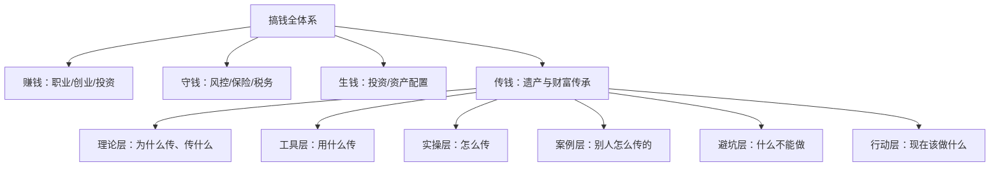
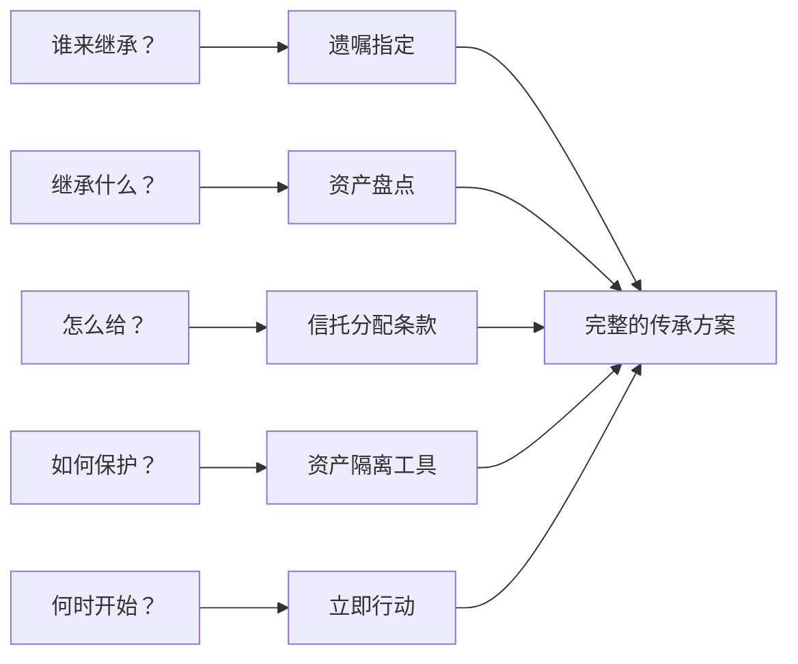
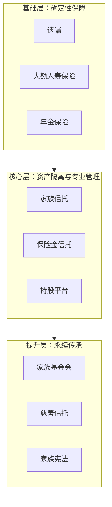
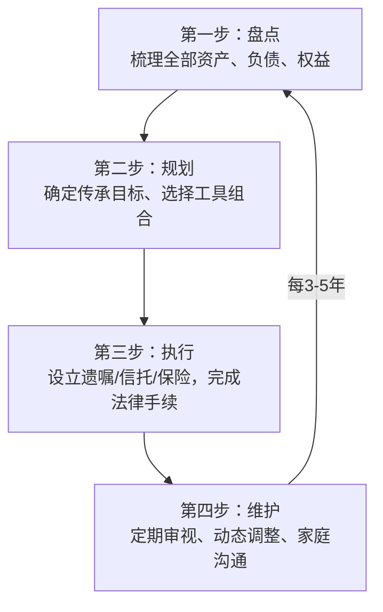

# 第31章：遗产与财富传承

## 为什么这一章可能比你读过的任何理财章节都重要

你花十年攒下500万，花了三年学会投资让资产翻倍——然后因为一份无效遗嘱、一次失败的婚姻、或者一个不成器的继承人，三年内财富归零。这不是危言耸听，而是中国千万家庭正在发生的真实故事。

财富传承是整个"搞钱"体系中**最容易被忽视、却最具破坏力**的环节。前面30章教你如何赚钱、守钱、让钱生钱，这一章教你如何让财富在你离开后继续存在——并且按照你的意愿存在。

### 一组触目惊心的数据

| 指标 | 数据 | 来源 |
|------|------|------|
| 家族企业传承到第二代的成功率 | 约30% | 中国民营经济研究会 |
| 传承到第三代的成功率 | 约12% | 全球家族企业研究 |
| 三代后财富仍保持的比例 | 不到5% | 麦肯锡家族企业研究 |
| 中国高净值人群已立遗嘱的比例 | 不足10% | 招商银行私人财富报告 |
| 因继承纠纷导致家庭反目的案例占比 | 超过60%（遗产诉讼中） | 各级法院公开数据 |

"富不过三代"不是诅咒，而是缺乏规划的必然结果。这一章将帮你打破这个魔咒。

***

## 章节定位与知识地图

本章在全书中的位置：**从"赚钱"到"传钱"的最后一块拼图**。

### 本章的六大知识模块

| 模块 | 核心内容 | 解决的问题 |
|------|----------|------------|
| 理论基础 | 遗嘱法律体系、信托结构、代际传承框架、财富保全工具、遗产税、家族企业治理、沟通艺术、数字遗产 | 传承的底层逻辑是什么？ |
| 核心技巧 | 遗嘱撰写实操、信托搭建步骤、保险传承方案、企业交接方法、全球传承策略、风险管理、方案动态调整 | 具体怎么操作？ |
| 实战案例 | 李嘉诚家族、洛克菲勒家族、中小企业主、再婚家庭、数字资产持有者等9个真实案例 | 别人是怎么做的？效果如何？ |
| 常见误区 | 7大认知误区与纠正方法 | 哪些坑千万不能踩？ |
| 练习方法 | 传承自查清单、家庭财务梳理模板、方案设计工作坊 | 如何将知识转化为行动？ |
| 本章小结 | 核心原则回顾、分阶段行动指南 | 如何快速回顾和执行？ |

***

## 核心问题：传承到底在解决什么？

### 五个必须回答的问题

1. **谁来继承？** ——法定继承人vs你想指定的人，两者可能完全不同
2. **继承什么？** ——有形资产（现金、房产、股权）+ 无形资产（品牌、关系、家风）
3. **怎么给？** ——一次性给完 vs 分阶段给 vs 附条件给，效果天壤之别
4. **如何保护？** ——如何防止继承人的配偶、债务人、骗子分走你的遗产
5. **何时开始？** ——答案是：现在

### 传承失败的三大根因

**根因一：没有规划（占失败案例的50%以上）**

大多数人从未认真思考过传承问题。他们认为"我还年轻""等以后再说"——直到意外来临，家人才在悲痛中面对一团乱麻的资产。

**根因二：规划错误（占失败案例的约30%）**

有人立了遗嘱但形式不合法被认定无效；有人用代持协议代替正式信托，结果代持人反悔；有人把所有资产都给了一个子女，导致其他子女诉讼——这些错误的根源是对传承工具的理解不足。

**根因三：执行失败（占失败案例的约20%）**

方案设计得很好，但缺乏执行：遗嘱立完锁在抽屉里从未更新；信托设立后受托人与家族产生利益冲突；接班人培养了十年临阵退缩——传承是一个需要持续维护的动态系统。

***

## 传承工具全景图

财富传承不是某一个工具能解决的，而是一个**工具组合**。以下是主要传承工具的功能对比：

| 工具 | 核心功能 | 门槛 | 成本 | 灵活性 | 隔离性 | 适用人群 |
|------|----------|------|------|--------|--------|----------|
| **遗嘱** | 确定分配方案 | 零门槛 | 几乎为零 | 高（可随时修改） | 无 | 所有人 |
| **大额人寿保险** | 锁定传承金额、快速理赔 | 年缴数千元起 | 中等 | 中 | 部分（指定受益人） | 有家庭责任者 |
| **保险金信托** | 保险+信托双重功能 | 保额100万起 | 中等 | 较高 | 强 | 中产及以上 |
| **家族信托** | 资产隔离+专业管理+灵活分配 | 300万-1000万起 | 较高（设立费+管理费） | 最高 | 最强 | 中高净值家庭 |
| **持股平台** | 股权控制权与分红权分离 | 视企业规模 | 中等 | 中 | 部分 | 企业主 |
| **家族基金会** | 永续传承+社会公益 | 数千万起 | 高 | 低 | 强 | 超高净值家族 |
| **慈善信托** | 公益目的+税收优惠 | 数百万起 | 中等 | 中 | 强 | 有公益意愿的家族 |
| **家族宪法** | 家族治理制度化 | 无资产门槛 | 低 | 最高 | 无 | 所有家族 |

### 工具组合的三层架构

**基础层**——人人需要：一份合法有效的遗嘱 + 足够的人寿保险，确保无论发生什么，家人的基本生活有保障。

**核心层**——中产以上需要：家族信托或保险金信托，实现资产与个人风险的隔离，防止因离婚、债务、诉讼等原因损失传承资产。

**提升层**——超高净值家族需要：家族基金会、家族宪法，实现家族价值的永续传递和社会影响力的延续。

***

## 关键概念速览

在深入学习之前，先建立核心概念的清晰认知：

**遗嘱（Will）**——被继承人生前对其个人财产所作的处分，死亡时生效的法律文件。中国《民法典》规定了自书、代书、打印、录音录像、口头、公证六种遗嘱形式，以最后设立的遗嘱为准（民法典已取消公证遗嘱的优先效力）。

**家族信托（Family Trust）**——委托人将资产转移给受托人，由受托人为受益人的利益进行管理和分配的法律安排。其核心价值在于**资产隔离**：信托资产独立于委托人、受托人、受益人的固有资产，不因任何一方的债务、离婚、破产而受影响。

**代际传承（Intergenerational Wealth Transfer）**——财富、企业、文化从一代人传递给下一代人的系统过程。它不仅是资产的物理转移，更是价值观、能力、资源的全面传递。

**财富保全（Asset Protection）**——通过法律工具和策略保护已有财富不因婚姻变故、债务纠纷、经营风险等原因而损失。核心手段包括保险、信托、持股平台等。

**遗产税（Estate Tax）**——对被继承人死亡后遗留的财产征收的税种。中国目前尚未开征，但多数发达国家已实施，最高税率可达55%（日本）。未来中国开征遗产税是大概率事件，提前规划势在必行。

**家族宪法（Family Constitution）**——家族治理的最高文件，规定家族使命、成员权利义务、企业管理原则、冲突解决机制等，是家族从"人治"走向"法治"的标志。

**保险金信托（Insurance Trust）**——将人寿保险的理赔金直接装入信托，结合了保险的杠杆效应（用较少保费撬动较大保额）和信托的隔离与灵活分配功能，是中产家庭传承的"性价比之王"。

**数字遗产（Digital Legacy）**——包括加密货币、网络账号、数字内容、游戏资产等数字化财富。随着数字经济的发展，数字遗产的传承将成为越来越重要的课题。

***

## 传承规划的核心逻辑

### 四步法：从无到有建立传承体系

**第一步：资产盘点**——你可能比自己以为的更富有，也可能比自己以为的更脆弱。完整盘点包括：不动产、金融资产、企业股权、保险权益、海外资产、数字资产、债权债务、知识产权。

**第二步：传承规划**——根据家庭结构、资产规模、传承目标，选择合适的工具组合。一个三口之家、资产500万的方案，与一个三代同堂、资产5000万的方案，可能完全不同。

**第三步：法律执行**——再好的规划不落地都是空谈。遗嘱要合法有效，信托要完成资产过户，保险要指定正确的受益人——每一步都有法律细节需要注意。

**第四步：持续维护**——传承不是一次性事件，而是持续的过程。家庭情况变化、法律环境变化、资产状况变化，都要求你定期审视和调整传承方案。

### 传承的五大原则

1. **早规划**：在健康和头脑清醒时就开始安排，不要等到危机来临
2. **多工具**：遗嘱、保险、信托等工具组合使用，不依赖单一工具
3. **勤沟通**：在生前与家人充分沟通，达成共识，避免身后纷争
4. **专业化**：引入律师、会计师、理财师等专业团队，不要自己闭门造车
5. **制度化**：建立家族治理制度，让传承不依赖个人意志，而是依靠制度运转

***

## 学习路径：本章怎么读

### 按需求选读

| 你的需求 | 推荐阅读顺序 | 预计时间 |
|----------|--------------|----------|
| 我什么都不懂，想全面了解 | 理论基础 → 核心技巧 → 案例 → 误区 → 练习 | 6-8小时 |
| 我有基础，想直接学操作 | 核心技巧 → 案例 → 误区 | 3-4小时 |
| 我是企业主，关注企业传承 | 理论基础（第六节）→ 核心技巧（第五节）→ 案例一/二/三 | 3-4小时 |
| 我想快速行动 | 练习方法 → 常见误区 → 本章小结 | 1-2小时 |
| 我是专业人士，需要深度内容 | 理论基础全读 → 核心技巧全读 → 深度拓展 | 8-10小时 |

### 完成本章学习后，你将能够

1. 理解不同传承工具（遗嘱、信托、保险、基金会等）的优劣和适用场景
2. 根据自己家庭的具体情况制定传承规划方案
3. 识别并规避传承过程中最常见的7大误区
4. 建立跨代际的财富管理思维，理解"传钱"比"赚钱"更需要智慧
5. 掌握传承中的家庭沟通方法，让方案得到全家人的理解和支持
6. 了解数字遗产等新型传承课题，为未来做好准备
7. 建立定期审视和动态调整传承方案的习惯

***

## 适用人群

本章的内容面向所有关注财富安全和家庭未来的人群，尤其是：

- **有一定资产积累的中产家庭**：资产从几十万到几百万，开始思考"如果我不在了，这些钱怎么办"
- **高净值人群**：资产在千万以上，需要系统性的传承规划和专业工具
- **企业主和创业者**：企业资产与个人资产如何隔离，如何实现代际交接
- **已婚已育人群**：关注配偶和子女的未来保障
- **再婚家庭**：前婚子女和现婚家庭的利益平衡
- **数字资产持有者**：加密货币、网络账号、数字内容等新型资产的传承
- **对家族财富管理感兴趣的所有读者**：即使目前资产不多，提前了解传承知识也能让你在未来的财富规划中占据主动

***

## 一个你可能不想面对但必须面对的事实

> 财富传承的规划，本质上是对死亡和不确定性的正视。大多数人回避这个话题，不是因为不了解它的重要性，而是因为不愿面对"如果我不在了"这个假设。但正是这种回避，导致了绝大多数传承失败。
>
> 正视它，规划它，然后忘掉它——把精力继续投入到创造财富中去。这才是最理性的态度。

准备好了吗？让我们从理论基础开始。
