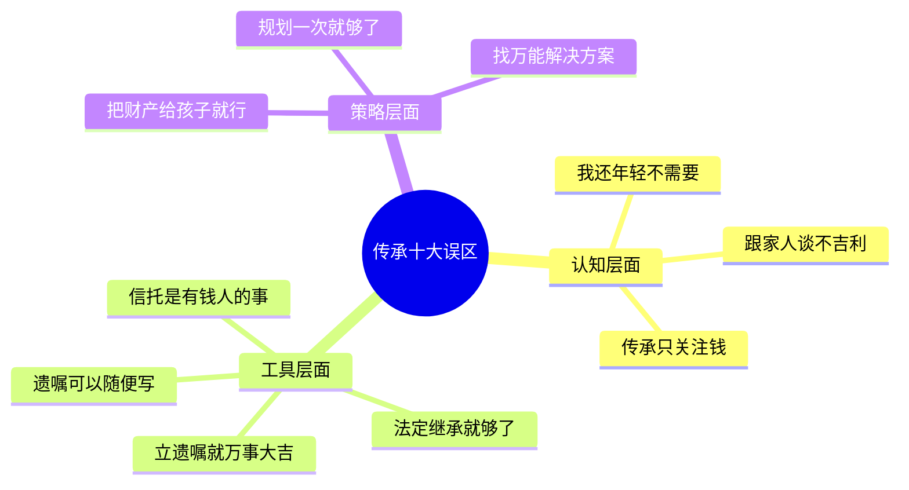
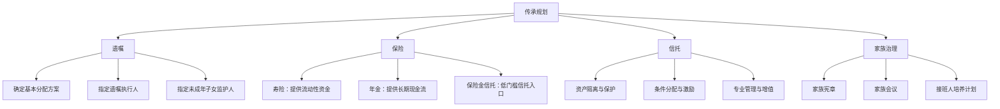
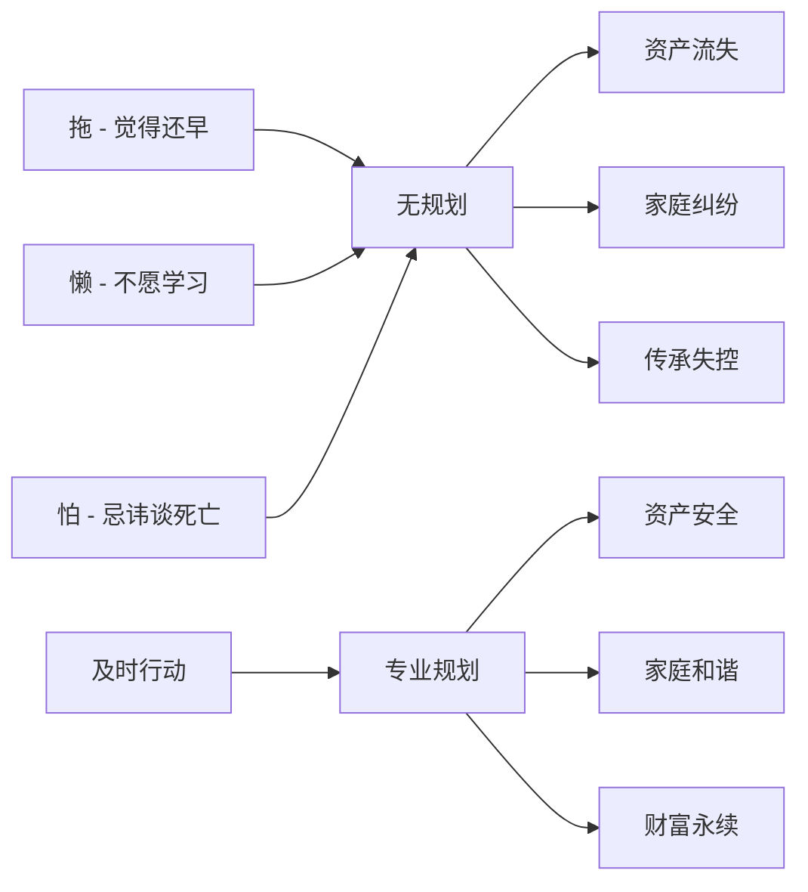

# 第31章 常见误区：遗产与财富传承

传承规划是一个高度专业化的领域，涉及法律、金融、税务、心理学等多个学科。然而，绝大多数人对传承的认知停留在表面，甚至存在严重的误解。这些误区轻则导致规划效率低下、多花冤枉钱，重则造成资产流失、家庭破裂。本章系统梳理传承规划中最常见的十大误区，逐一拆解其成因、危害和纠正方法，帮助读者建立正确的传承认知框架。

---

## 误区一："我还年轻，不需要考虑传承"

### 误区表现

这是最普遍、也是危害最大的误区。很多人认为传承是六七十岁才需要考虑的事情，自己三四十岁、身体健康、事业上升期，没必要现在就操心身后事。这种想法的底层逻辑是：**传承 = 为死亡做准备**。这个等式本身就是错的。

### 为什么这个误区危害最大

**年轻猝死的数据触目惊心**。根据国家心血管病中心发布的《中国心血管健康与疾病报告》，中国每年心源性猝死人数约54.4万，其中相当比例发生在40岁以下群体。2023年某互联网大厂35岁员工猝死事件引发社会广泛关注，其家属在遗产处理过程中遭遇的种种困难——银行账户无法取出、房产过户手续繁琐、公司股权归属争议——充分说明了提前规划的必要性。

**意外不等人**。交通事故、突发疾病、自然灾害——这些事件的发生完全没有年龄门槛。2024年全国交通事故死亡人数约6万人，其中25-45岁占比超过30%。

**没有遗嘱的代价极高**。根据《民法典》第1127条，没有遗嘱的情况下，遗产按法定继承处理。这意味着：

| 情形 | 有遗嘱 | 无遗嘱（法定继承） |
|------|--------|---------------------|
| 想把房子留给配偶 | 按意愿执行 | 配偶、子女、父母均分 |
| 想给某个子女更多 | 按比例分配 | 所有子女平均分配 |
| 想留给非亲属（如好友） | 可以通过遗赠实现 | 完全无法实现 |
| 想排除某继承人 | 可以明确排除 | 无法排除 |
| 处理时间 | 通常1-3个月 | 可能拖数月甚至数年 |
| 家庭纠纷概率 | 较低 | 极高 |

### 正确做法：按人生阶段启动传承规划

传承规划不是一次性任务，而是随人生阶段逐步升级的动态过程：

**25岁以后（单身期）**：立一份基础遗嘱，指定遗产受益人。同时配置一份定期寿险（保额至少覆盖父母养老所需），受益人写父母。成本极低——一份律师见证的遗嘱约500-2000元，一份100万保额的定期寿险年保费仅几百元。

**结婚后（家庭形成期）**：重新审视遗嘱，增加配偶为受益人。考虑配置夫妻互保寿险。如果双方财产差异较大，建议签署婚前/婚后财产协议，明确各自的财产归属。

**有子女后（家庭成长期）**：全面升级传承方案。遗嘱中增加子女受益条款，配置教育金保险，开始考虑保险金信托。这个阶段最重要的是**确定子女的监护人**——如果夫妻双方同时意外离世，谁来照顾未成年子女？这必须在遗嘱中明确指定。

**事业有成后（财富积累期）**：引入专业团队（律师、税务师、信托顾问），建立包含遗嘱、保险、信托、家族治理在内的完整传承体系。这个阶段的传承规划同时也是资产保护规划。

> **关键认知转变**：传承规划的本质不是"为死亡做准备"，而是"为家人的未来提供确定性保障"。就像买保险不是因为觉得自己会出事，而是因为爱家人、不想让他们在意外发生时手足无措。

---

## 误区二："立了遗嘱就万事大吉"

### 误区表现

很多人完成遗嘱签署后就长舒一口气，觉得传承规划已经"搞定了"。这种想法就像认为买了驾照就等于会开车一样荒谬——遗嘱只是传承工具箱中的一件工具，远远不是全部。

### 遗嘱的六大局限性

**局限一：遗嘱不能实现资产隔离**

遗嘱解决的是"遗产归谁"的问题，但不能保护资产不受外部风险侵蚀。举个例子：老王在遗嘱中把全部财产留给儿子小王。老王去世后，小王继承了遗产。但小王当时正在闹离婚，根据《民法典》第1062条，继承所得的财产在没有明确约定的情况下属于夫妻共同财产。结果老王辛苦攒下的家产，有一半被前儿媳分走了。

如果老王生前设立了家族信托，将资产装入信托，指定小王为受益人但设定分配条件（比如离婚期间暂停分配），就能有效避免这种情况。

**局限二：遗嘱需要经过继承程序**

遗嘱生效后，继承人需要办理继承权公证或通过法院确认继承权。这个过程需要：
- 所有法定继承人到场或出具书面同意
- 提供完整的亲属关系证明
- 提供遗产清单和权属证明
- 缴纳公证费（通常为遗产价值的0.1%-0.3%）

如果任何一个继承人不配合或有异议，就需要通过诉讼解决，耗时可能长达一到两年。

**局限三：遗嘱可能被挑战效力**

根据《民法典》第1143条，以下情况遗嘱可能被认定无效：
- 遗嘱人立遗嘱时不具备完全民事行为能力
- 遗嘱系受欺诈、胁迫所立
- 遗嘱被篡改
- 遗嘱内容处分了他人财产

实践中，"立遗嘱时是否神志清醒"是最常见的争议点。如果立遗嘱时没有留下充分的证据（如录像、医生证明、律师见证记录），遗嘱很可能被挑战。

**局限四：遗嘱不能防止后代挥霍**

遗嘱只能决定"谁得到什么"，但不能控制"怎么花"。如果继承人是个挥金如土的纨绔子弟，一份遗嘱无法阻止他在三年内把家产败光。

**局限五：遗嘱无法应对复杂的分配需求**

如果你想设置"每月给子女分配2万元生活费，考上大学额外奖励10万，创业成功奖励50万"这样的条件分配机制，遗嘱是无法实现的。这种需求需要信托来完成。

**局限六：遗嘱不能处理所有类型的资产**

保险金（指定了受益人的）、信托受益权、合伙企业份额等资产的传承路径并不完全受遗嘱约束。特别是保险金——如果保单指定了受益人，保险金直接支付给受益人，不进入遗产分配程序。

### 正确做法：构建"遗嘱+"的组合传承体系

| 工具 | 核心功能 | 适用场景 | 成本 | 起步门槛 |
|------|----------|----------|------|----------|
| 遗嘱 | 确定分配方案 | 所有人 | 低（500-5000元） | 无 |
| 寿险 | 提供确定性现金流 | 有家庭责任者 | 中（年缴保费） | 无 |
| 保险金信托 | 低门槛信托+条件分配 | 中产家庭 | 中（信托管理费） | 100-300万 |
| 家族信托 | 全面资产隔离与管理 | 高净值家庭 | 较高 | 1000万+ |
| 家族治理 | 长期传承机制 | 有家族企业者 | 低 | 无 |

---

## 误区三："法定继承就够了"

### 误区表现

有些人认为中国有完善的继承法律体系，按照法定继承处理遗产合情合理，没必要专门立遗嘱。甚至有人认为立遗嘱是"不信任家人"的表现。

### 法定继承的四大盲区

**盲区一：遗产流向可能完全出乎意料**

法定继承的第一顺序继承人是配偶、子女、父母。假设张先生（40岁）意外去世，名下有一套价值500万的房产和200万存款，没有遗嘱。法定继承的结果是：

| 继承人 | 份额 | 金额 |
|--------|------|------|
| 配偶（妻子） | 1/4 | 175万 |
| 子女（1个孩子） | 1/4 | 175万 |
| 父亲 | 1/4 | 175万 |
| 母亲 | 1/4 | 175万 |

这个结果存在多个问题：
- 妻子需要独自抚养孩子，但只拿到1/4的遗产
- 房产可能需要卖掉才能分割，妻子和孩子可能失去住所
- 张先生的父母如果年迈且有其他子女赡养，他们可能并不需要这笔钱
- 如果张先生希望全部留给妻子和孩子，法定继承完全无法实现

**盲区二：复杂家庭结构下的混乱**

再婚家庭是法定继承的"重灾区"。李先生（60岁）再婚，与前妻有一个儿子小李（30岁），与现任妻子有一个女儿小花（10岁）。李先生去世后，法定继承的分配是：

- 现任妻子、小李、小花三人均分遗产
- 如果李先生与前妻离婚时已将大部分财产分给前妻，再婚后积累的财产可能主要来自现任妻子的贡献，但现任妻子仍只能拿到1/3
- 小李和小花的继承份额相同，但小李已成年独立，小花年幼需要大量抚养费用

如果李先生有遗嘱，可以合理安排：给现任妻子更多份额以保障小花的成长，给小李适当份额以体现父子情分。

**盲区三：代位继承和转继承的连锁效应**

法定继承中存在"代位继承"（《民法典》第1128条）——如果继承人先于被继承人死亡，由继承人的直系晚辈血亲代位继承。这意味着遗产可能流向你从未预料到的人。

转继承更复杂——如果继承人在继承开始后、遗产分割前死亡，其应继承的份额转由其继承人继承。这在多人同时死亡（如车祸、灾难）的情况下尤其容易引发混乱。

**盲区四：遗产可能"充公"**

根据《民法典》第1160条，无人继承又无人受遗赠的遗产，归国家所有，用于公益事业。如果你既没有法定继承人，也没有立遗嘱指定受遗赠人，你辛苦积累的财富将全部归国家。

### 正确做法

无论家庭情况多么简单，都建议至少立一份基础遗嘱。遗嘱不需要复杂，但必须包含以下核心要素：
1. 明确遗产范围和归属
2. 指定遗嘱执行人
3. 如果有未成年子女，指定监护人
4. 留有余地，处理"其他财产"

---

## 误区四："遗嘱可以随便写"

### 误区表现

"我在纸上写几句话，签个名，不就是遗嘱了吗？"——这是对遗嘱法律效力最危险的误解。遗嘱是严肃的法律文件，必须符合法定形式要件才能生效。《民法典》规定了六种遗嘱形式（自书遗嘱、代书遗嘱、打印遗嘱、录音录像遗嘱、口头遗嘱、公证遗嘱），每种都有严格的形式要求。

### 六种遗嘱形式的常见错误详解

**自书遗嘱（第1134条）**

法定要求：遗嘱人亲笔书写全文，签名，注明年月日。

常见致命错误：

| 错误 | 后果 | 纠正方法 |
|------|------|----------|
| 打印后手写签名 | 可能被认定为打印遗嘱，需要两个见证人 | 全部内容亲笔手写 |
| 只写年月不写日 | 日期不完整，可能影响效力判断 | 精确到年月日 |
| 用铅笔书写 | 内容可能被篡改，证据效力弱 | 使用黑色签字笔 |
| 有涂改但未在涂改处签名注明 | 涂改部分可能无效 | 涂改处签名并注明日期 |
| 处分了夫妻共同财产中配偶的份额 | 超出部分无效 | 只处分自己的份额 |
| 使用"大部分给""尽量照顾"等模糊表述 | 无法执行 | 用具体数字或比例 |

**打印遗嘱（第1136条）**

这是2021年《民法典》新增的遗嘱形式，要求打印遗嘱应当有两个以上见证人在场见证，遗嘱人和见证人应当在遗嘱每一页签名，注明年月日。

关键陷阱：**每一页都必须签名**。如果遗嘱有5页，只在最后一页签名，前4页的效力可能被质疑。这是实践中最常见的打印遗嘱瑕疵。

**代书遗嘱（第1135条）**

法定要求：两个以上见证人在场见证，其中一人代书，注明年月日，代书人、其他见证人和遗嘱人签名。

常见致命错误：
- 只有一个见证人（无效）
- 见证人是继承人或与继承人有利害关系的人（无效）
- 代书人就是受益人（无效）
- 遗嘱人口述、代书人书写，但遗嘱人没有在场确认签名

**录音录像遗嘱（第1137条）**

要求两个以上见证人在场见证，遗嘱人和见证人应当记录姓名或肖像及日期。

关键陷阱：录像中如果遗嘱人只是默读一份文件而没有口述，可能被质疑为伪造。正确做法是遗嘱人面对镜头口述遗嘱内容，见证人在镜头中出现并表明身份。

**口头遗嘱（第1138条）**

仅在危急情况下可以设立，且需要两个以上见证人在场。危急情况消除后，如果遗嘱人能够以书面或录音录像形式立遗嘱，口头遗嘱自动失效。

关键陷阱：什么是"危急情况"？法院通常认定的标准是"生命受到紧迫威胁，客观上无法采用其他遗嘱形式"。在医院住院期间，即使病情严重，如果能说话、能写字，法院可能不认可口头遗嘱的效力。

**公证遗嘱（第1139条）**

由遗嘱人经公证机构办理。公证遗嘱的效力曾被认为高于其他遗嘱形式（旧《继承法》的规定），但《民法典》已取消这一规定——现在以最后一份遗嘱为准，公证遗嘱不再具有优先效力。

但公证遗嘱仍有独特优势：公证机构会审查遗嘱人的行为能力、确认意思表示真实、留存完整的公证档案，这些都是其他遗嘱形式难以比拟的证据保障。

### 遗嘱见证人的资格红线

根据《民法典》第1140条，以下人员不能作为遗嘱见证人：
- **无民事行为能力人、限制民事行为能力人**（如未成年人、精神障碍患者）
- **继承人、受遗赠人**
- **与继承人、受遗赠人有利害关系的人**（如继承人的配偶、子女、债权人、合伙人等）

这是实践中出问题最多的条款。很多老人请邻居或朋友做见证人，但这些见证人可能同时是某个继承人的朋友或有经济往来，导致遗嘱效力存疑。

### 正确做法

| 遗嘱类型 | 适用场景 | 成本 | 推荐指数 |
|----------|----------|------|----------|
| 自书遗嘱 | 财产简单、家庭关系清晰 | 几乎为零 | ★★★ |
| 打印遗嘱 | 不擅长手写、内容较多 | 低 | ★★★ |
| 代书遗嘱 | 文化程度有限或身体不便 | 低（需2+见证人） | ★★★ |
| 录音录像遗嘱 | 作为辅助证据 | 低 | ★★★★ |
| 公证遗嘱 | 财产复杂、可能有争议 | 中（遗产的0.1%-0.3%） | ★★★★★ |
| 律师见证遗嘱 | 综合性价比最高 | 中（2000-10000元） | ★★★★★ |

**最佳实践**：采用"公证遗嘱 + 录音录像"的双重保障模式。公证遗嘱提供法律效力保障，录音录像提供意思表示真实的证据。遗嘱完成后，原件交律师或公证处保管，复印件交遗嘱执行人。

---

## 误区五："信托是有钱人的事"

### 误区表现

"家族信托？那是亿万富翁才玩得起的东西，跟我有什么关系？"——这种想法让大量中产家庭错失了信托工具带来的传承保障。

### 信托门槛的真实面貌

| 信托类型 | 最低门槛 | 主要功能 | 适合人群 |
|----------|----------|----------|----------|
| 传统家族信托 | 1000万元 | 全面资产隔离、专业管理、条件分配 | 高净值家庭 |
| 保险金信托 | 100-300万元（保额） | 保险金的条件分配与管理 | 中产家庭 |
| 家庭服务信托 | 100万元 | 资产配置、收益分配 | 中产家庭 |
| 慈善信托 | 无明确门槛 | 公益慈善、家族传承 | 有慈善意愿的家庭 |

2023年6月，原银保监会（现国家金融监督管理总局）发布《关于规范信托公司信托业务分类的通知》，明确将信托业务分为三大类，其中"资产服务信托"下的"家庭服务信托"门槛降至100万元，大幅降低了普通家庭使用信托工具的门槛。

### 保险金信托：中产家庭的最优解

保险金信托是"保险 + 信托"的组合产品，运作方式是：

1. 投保人购买大额人寿保险（保额通常100万以上）
2. 将保险金的受益人变更为信托公司
3. 保险事故发生后，保险金进入信托账户
4. 信托公司按照信托合同的约定，向受益人分配资金

**保险金信托的核心优势**：

- **低门槛起步**：不需要一次性拿出1000万，只需要每年缴纳几万元保费
- **杠杆效应**：寿险保额通常是保费的数十倍，用小资金撬动大传承
- **条件分配**：可以设定"考上大学奖励10万""30岁前每月只领5000生活费""禁止用于赌博"等条件
- **资产隔离**：保险金进入信托后，不属于受益人的个人财产，离婚不分、债务不追

**真实案例**：张先生（35岁，IT工程师，年收入50万）购买了一份300万保额的终身寿险，年缴保费约3万元，同时设立保险金信托。信托条款规定：如果张先生意外去世，300万保险金进入信托，儿子每月领取1万元生活费直到18岁，之后每年领取5万元教育金直到研究生毕业，30岁时一次性领取剩余资金的50%，40岁时领取剩余全部资金。这个方案用每年3万元的成本，为儿子构建了一个跨越25年的财务保障体系。

### 正确做法

不要因为"觉得自己钱不够多"就放弃信托工具。根据自己的资产规模和传承需求，选择合适的信托类型：

- **年收入30万以上、有未成年子女**：考虑保险金信托
- **可投资资产100万以上**：考虑家庭服务信托
- **可投资资产1000万以上**：考虑传统家族信托
- **有慈善意愿**：任何资产规模都可以考虑慈善信托

---

## 误区六："把财产给孩子就行"

### 误区表现

很多父母认为传承就是把财产过给孩子，越早给越好——反正都是自己的孩子，给谁不是给？甚至有些父母在孩子刚成年时就把房产过户、把存款转过去，以为这样就完成了传承。

### 直接赠与的六大风险

**风险一：子女婚姻变动导致资产外流**

根据《民法典》第1062条，婚姻关系存续期间继承或受赠的财产，原则上属于夫妻共同财产（除非赠与合同或遗嘱中明确只归一方所有）。这意味着：你给儿子的房子，在儿子离婚时，儿媳有权分走一半。

**风险二：子女投资失败或被骗**

年轻人缺乏理财经验和风险意识，一次性获得大笔资产后，很容易被高收益理财产品、P2P、加密货币、传销等"收割"。真实案例屡见不鲜：父母把价值500万的房子过户给儿子，儿子拿去抵押贷款投资，血本无归，房子被银行拍卖。

**风险三：失去对资产的控制权**

一旦资产过户到子女名下，法律上就是子女的财产了。父母对这些资产不再有处分权。如果子女不孝顺、挥霍无度、甚至虐待父母，父母已经给出去的资产很难追回。

**风险四：没有激励效应**

"反正爸妈的钱都是我的"——这种心态会让子女失去奋斗的动力。洛克菲勒家族之所以能传承七代不衰，一个核心原则就是：**永远不要让后代觉得财富是理所当然的**。

**风险五：税务风险**

虽然中国目前没有遗产税和赠与税，但未来政策存在不确定性。而且房产赠与涉及的契税（3%）、增值税、个人所得税等成本并不低。如果未来开征遗产税，已赠与的资产可能无法享受免税额度。

**风险六：遗产争夺提前上演**

过早的资产分配可能引发子女之间的矛盾。"为什么哥哥分到了房子，我只分到了存款？""爸妈偏心！"——这些矛盾在父母健在时就已经开始，比身后争夺更伤感情。

### 正确做法：有条件的转移策略

**策略一：利用信托实现"控制权 + 受益权"分离**

将资产装入信托，父母保留对信托的修改权和撤销权（可撤销信托），子女作为受益人享受收益但不能处分本金。这样既实现了资产转移，又保留了控制权。

**策略二：设定阶梯式分配条件**

| 条件类型 | 具体条款示例 |
|----------|-------------|
| 年龄条件 | 25岁领取20%，30岁领取30%，35岁领取剩余50% |
| 教育条件 | 获得学士学位奖励10万，硕士学位奖励20万，博士学位奖励30万 |
| 事业条件 | 稳定就业满3年奖励10万，创业满3年奖励50万 |
| 行为约束 | 涉及赌博、吸毒、违法犯罪，暂停分配 |
| 婚姻条件 | 婚姻存续满10年，一次性奖励50万 |

**策略三：利用保险的定向传承功能**

购买寿险并指定子女为受益人。保险金直接支付给指定受益人，不进入遗产分配程序，不属于夫妻共同财产（《第八次全国法院民事商事审判工作会议（民事部分）纪要》明确了这一点）。

**策略四：分步赠与而非一次性转移**

不要一次性把所有资产给孩子，而是分步骤、有条件地转移。每完成一个阶段，评估子女的财务管理能力，再决定下一步的转移规模。

---

## 误区七："传承规划一次就够了"

### 误区表现

很多人在40岁时做了一份传承规划，之后就束之高阁，再也不管了。十年过去了，家庭结构变了、资产规模变了、法律政策变了、经济环境变了，但传承方案还是十年前的版本。

### 为什么传承规划必须动态更新

**家庭变化触发更新**：

| 变化事件 | 影响 | 更新动作 |
|----------|------|----------|
| 新生儿出生 | 增加受益人 | 更新遗嘱、调整保险受益人 |
| 子女成年 | 可以直接持有资产 | 重新评估分配方案 |
| 子女结婚 | 增加资产外流风险 | 增加信托保护条款 |
| 离婚/再婚 | 财产分割、继承人变化 | 全面重做传承方案 |
| 父母去世 | 继承人减少 | 更新遗嘱 |
| 继承人去世 | 可能触发代位继承 | 重新评估分配方案 |

**资产变化触发更新**：

- 新购置房产、车辆等大额资产
- 公司股权变动（融资、上市、转让）
- 新增海外资产（海外房产、境外账户）
- 资产大幅增值或减值
- 新增债务或担保

**法律政策变化触发更新**：

- 《民法典》2021年生效后，废止了旧《继承法》，多项规定有重大变化
- 未来可能出台遗产税
- 信托、保险相关法规的修订
- 房产税试点扩大
- 跨境资产监管政策变化

**经济环境变化触发更新**：

- 利率变化影响保险和信托产品的选择
- 通胀影响遗产的实际购买力
- 汇率变化影响海外资产价值
- 市场波动影响投资型资产的估值

### 正确做法：建立定期审视机制

**年度轻审视**：每年年末花1-2小时检查以下事项：
- 遗嘱中涉及的资产清单是否需要更新
- 保险受益人是否需要调整
- 信托条款是否仍然适用
- 家庭成员是否有变化

**重大事件即时审视**：发生上述任何重大变化时，立即联系律师和顾问进行方案调整。

**五年全面复审**：每5年进行一次全面的传承方案复审，评估整体方案的有效性，考虑是否需要引入新的工具或调整策略。

> **经验法则**：如果你的传承方案超过3年没有更新，它很可能已经过时了。

---

## 误区八："跟家人讨论传承不吉利"

### 误区表现

受中国传统文化影响，很多家庭忌讳谈论死亡和遗产的话题。"我身体好好的，谈什么遗产？""说这些不吉利！"——这种心态让传承规划在很多家庭中成为"房间里的大象"——大家都知道存在，但谁都不愿意提。

### 沉默的代价

**代价一：家人对你的意愿一无所知**

你心里想把房子留给女儿、存款留给儿子，但从来没有说过。你去世后，女儿和儿子各自猜测你的意愿，争执不下，最终对簿公堂。

**代价二：突发意外后家人手足无措**

你突然离世，家人不知道你的银行账户有多少、密码是什么、保险在哪里、有没有遗嘱。他们需要花几个月时间一家一家银行去查，一个一个账户去办手续。在最悲痛的时候，还要承受这些琐碎但沉重的行政负担。

**代价三：家庭关系在遗产争夺中彻底破裂**

中国裁判文书网上的继承纠纷案件数量逐年上升，2023年全国继承纠纷一审案件超过12万件。大量原本和睦的家庭因为遗产分配问题反目成仇，兄弟姐妹老死不相往来。

**代价四：传承意愿无法得到反馈**

你认为公平的分配方案，在家人看来可能完全不公平。你可能不知道大儿子最近经济困难急需帮助，也不知道小女儿其实更希望得到奶奶留下的那枚戒指而不是那套房子。没有沟通，你的传承方案可能南辕北辙。

### 正确做法：用"赋能"替代"忌讳"

**框架转换**：不要把这定义为"谈论死亡"，而是定义为"家庭财务安全规划"或"家庭未来保障讨论"。就像你不会忌讳买保险一样，传承规划只是保障家庭财务安全的一部分。

**循序渐进的沟通策略**：

1. **第一步：从故事开始**。分享一个朋友或新闻中关于传承纠纷的案例，自然地引出话题："你看，这种事情如果提前说清楚就不会发生了。"

2. **第二步：从价值观开始**。先不谈具体的钱和财产，而是讨论家庭价值观："你觉得我们家最重要的品质是什么？你希望下一代成为什么样的人？"

3. **第三步：从简单事项开始**。先讨论一些容易达成共识的事项，比如保险受益人、银行账户信息的共享，再逐步引入更复杂的遗产分配话题。

4. **第四步：引入专业第三方**。邀请律师或财务顾问参与家庭会议，由专业人士解释传承规划的必要性和具体方案，减少家庭成员之间的直接冲突。

5. **第五步：形成书面共识**。将讨论结果形成书面文件（家族宪章或家庭备忘录），所有家庭成员签字确认。

**沟通话术示例**：

- ❌ "我老了，该考虑后事了。"
- ✅ "我想确保咱们家无论发生什么情况，每个人都能得到妥善的保障。"
- ❌ "我死了以后，这些东西怎么分。"
- ✅ "我做了一些财务安排，想跟你们说一下，这样万一有什么事情，你们知道该怎么办。"
- ❌ "遗嘱我已经写好了。"
- ✅ "我在做一些家庭财务规划，想听听你们的想法和建议。"

---

## 误区九："传承只需要关注钱"

### 误区表现

大多数人一提到"传承"，脑子里想到的就是房子、存款、股票——有形的、可以用金钱衡量的资产。但真正有价值的传承远不止于此。

### 传承的五大维度

**维度一：有形资产（最容易被关注的）**

房产、现金、股票、基金、债券、黄金、车辆、艺术品等。这是传承的基础，但只是冰山一角。

**维度二：无形资产（最容易被忽略的）**

- **知识产权**：专利、商标、著作权、商业秘密。这些资产可能价值巨大，但传承路径复杂——专利有有效期、商标需要持续使用、著作权的保护期限和继承规则各不相同。
- **数字资产**：社交媒体账号、网络游戏资产、数字货币、域名、自媒体账号。这些资产的价值正在快速增长，但法律保护框架尚不完善。
- **商业信用**：个人品牌、行业声誉、客户关系网络。这些"软资产"虽然无法直接过户，但对家族事业的延续至关重要。

**维度三：社会资本（人脉与关系）**

家族积累的商业人脉、行业关系、合作伙伴网络。这些关系的传承需要长期的培养和对接，不能指望一纸文件就能完成。

**传承方法**：
- 带子女参加商业社交活动，逐步介绍核心人脉
- 让子女参与重要商业决策，培养判断力
- 建立"关系图谱"文档，记录重要联系人的背景和关系

**维度四：知识与经验（经营智慧）**

家族积累的行业洞察、管理经验、经营智慧、失败教训。这些东西不写下来就永远消失了。

**传承方法**：
- 撰写"家族经营手记"，记录关键决策的思考过程
- 建立"案例库"，记录成功经验和失败教训
- 安排子女在不同岗位轮岗实习，亲身学习
- 引入"师徒制"，由老一辈手把手带教

**维度五：精神遗产（最深远的传承）**

家族价值观、家风家训、社会责任感、创业精神、处事原则。这是决定一个家族能否长期繁荣的最核心要素。

洛克菲勒家族传承七代不衰的秘密不是巨额财富（事实上，家族财富已经分散到数百个后代），而是代代相传的家族价值观：节俭、勤奋、回馈社会。洛克菲勒二世给儿子写的38封家书，比任何信托文件都更有传承价值。

### 正确做法：建立多维度传承体系

| 维度 | 传承载体 | 具体做法 |
|------|----------|----------|
| 有形资产 | 遗嘱、信托、保险 | 完善法律文件，确保资产安全转移 |
| 无形资产 | 知识产权转让协议、数字资产清单 | 逐一梳理，制定专门的传承方案 |
| 社会资本 | 家族社交活动、引荐计划 | 有计划地将人脉资源对接给下一代 |
| 知识经验 | 经营手记、案例库、轮岗计划 | 系统化记录和传授 |
| 精神遗产 | 家族宪章、家书、家族故事 | 建立家族文化传承机制 |

---

## 误区十："找一个万能的解决方案"

### 误区表现

"有没有一个方案，能一劳永逸地解决所有传承问题？"——这是很多人的美好愿望，但现实中不存在。每个家庭的情况都是独一无二的，照搬别人的方案往往适得其反。

### 为什么不存在万能方案

**家庭结构的差异**：

| 家庭类型 | 核心挑战 | 侧重工具 |
|----------|----------|----------|
| 核心家庭（夫妻+子女） | 标准传承 | 遗嘱+保险 |
| 单亲家庭 | 未成年子女保障 | 保险+信托+监护安排 |
| 再婚家庭 | 前任子女与现任配偶的利益平衡 | 信托+详细遗嘱 |
| 丁克家庭 | 无直系继承人 | 遗赠+慈善信托 |
| 多子女家庭 | 公平分配 | 信托+家族治理 |
| 独生子女家庭 | 风险集中 | 保险+资产分散 |
| 跨国婚姻家庭 | 多法域法律冲突 | 专业跨境规划 |

**资产类型的差异**：

- 主要资产是房产：需要考虑房产的不可分割性、过户成本、限购政策
- 主要资产是公司股权：需要考虑公司治理、其他股东权益、估值方法
- 主要资产是金融资产：需要考虑流动性管理、投资策略、受益人能力
- 有海外资产：需要考虑外汇管制、跨境税务、CRS信息交换

**个人意愿的差异**：

- 有人希望"绝对平均"，有人希望"能者多得"
- 有人希望子女自力更生，有人希望给子女最好的起点
- 有人重视物质传承，有人更看重精神传承
- 有人希望低调处理，有人希望通过传承表达爱意

### 正确做法：量身定制的四步法

**第一步：全面梳理现状**

列出所有资产（有形+无形）、所有家庭成员、所有潜在风险。不要遗漏任何细节——很多人在梳理时才发现自己有一些早已忘记的资产（比如多年前买的保险、借出去的钱、持有的小公司股份）。

**第二步：明确传承意愿**

问自己三个核心问题：
1. 我希望谁得到什么？（分配意愿）
2. 我希望怎样保护这些资产？（保护意愿）
3. 我希望传递什么样的价值观？（精神意愿）

**第三步：匹配工具组合**

根据现状和意愿，选择最合适的工具组合。不要追求"最先进"或"最昂贵"的工具，而是选择"最适合"的。

**第四步：建立动态调整机制**

传承方案不是石碑上的文字，而是活的文档。建立定期审视和更新的机制，确保方案始终与实际情况匹配。

> **核心原则**：没有最好的方案，只有最适合你的方案。不要被"别人怎么做"影响，专注于"我的家庭需要什么"。

---

## 本节小结

传承规划中的十大误区，本质上源于三种心态：**拖**（觉得还早不用急）、**懒**（不想学习也不愿沟通）、**怕**（忌讳谈论死亡和遗产）。这三种心态的共同后果是：传承规划被无限期推迟，直到意外发生时家人才发现一切都来不及了。

破解这些误区的关键认知转变是：**传承不是为死亡做准备，而是为家人的未来提供确定性保障**。越早开始规划，选择越多，成本越低，效果越好。今天花一小时做规划，胜过家人为遗产争执一年。

**立即行动清单**：

1. **今天**：列出你的所有资产清单（包括银行账户、保险、房产、投资等）
2. **本周**：与配偶或家人进行一次"家庭财务安全"对话
3. **本月**：咨询一位专业遗产律师，了解你的传承方案现状
4. **本季度**：完成基础遗嘱的签署和保险受益人的检查
5. **本年度**：建立完整的传承方案框架，并设定定期审视提醒

记住：完美的方案永远不存在，但一个不完美的方案永远好过没有方案。
