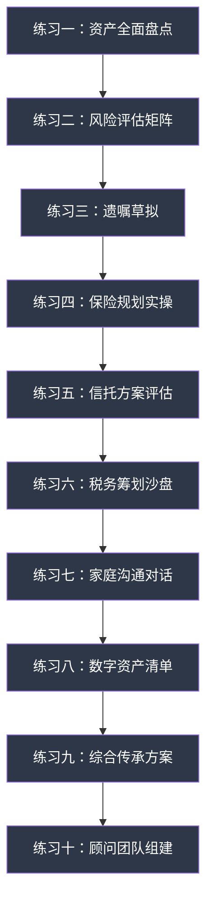
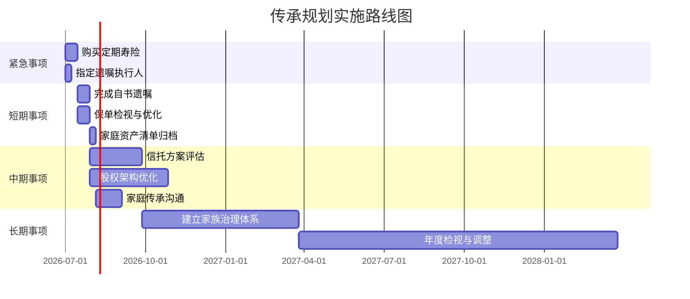

# 第31章 练习方法：遗产与财富传承

> 本章设计了十个递进式练习，覆盖从基础资产盘点到完整传承方案设计的全流程。每个练习都配有详细的操作步骤、模板工具、真实场景模拟和自检清单。建议按顺序完成，前四个为基础练习（约需2-3天），后六个为进阶练习（约需1-2周）。全部完成后，你将拥有一个可落地执行的家庭传承规划初稿。



---

## 练习一：家庭资产全面盘点

### 为什么这个练习排在第一位

资产盘点是所有传承规划的基石。没有准确的资产数据，后续的方案设计都是空中楼阁。很多家庭犯的第一个错误就是"觉得自己知道家里有多少资产"，实际上大部分家庭对配偶名下的资产、父母名下的资产、以及自己遗忘的资产（如多年前买的保险、借给亲友的钱）都缺乏完整认知。

美国私人财富管理协会的调查显示，73%的家庭无法在24小时内列出全部资产清单，41%的家庭存在"隐藏资产"——不是故意隐瞒，而是真的忘记了。

### 操作步骤

**第一步：资产分类登记（建议用时：2-3小时）**

逐一登记以下类别的资产，不要遗漏：

| 资产大类 | 细分项目 | 估值（万元） | 权属人 | 权属证明 | 流动性等级 | 备注 |
|----------|----------|-------------|--------|----------|-----------|------|
| **现金及存款** | 活期存款 | | | 存折/网银截图 | 高 | |
| | 定期存款 | | | 存单 | 高 | 注意到期日 |
| | 货币基金 | | | 基金账户 | 高 | |
| | 现金（家中存放） | | | 无 | 高 | |
| **投资类** | 股票账户 | | | 证券账户 | 中 | |
| | 基金（非货币） | | | 基金账户 | 中 | |
| | 债券 | | | 债券凭证 | 中 | |
| | 银行理财产品 | | | 理财合同 | 低-中 | 注意封闭期 |
| | 私募/PE份额 | | | 合伙协议 | 低 | 通常有锁定期 |
| | 期货/期权 | | | 期货账户 | 高 | |
| **房产类** | 自住住宅 | | | 房产证 | 低 | 记录地址和面积 |
| | 投资性房产 | | | 房产证 | 低 | 含商铺、公寓 |
| | 小产权房 | | | 购房合同 | 极低 | 法律风险高 |
| | 车位/车库 | | | 产权证明 | 低 | |
| **企业资产** | 有限公司股权 | | | 工商登记/章程 | 低 | 记录持股比例 |
| | 合伙企业份额 | | | 合伙协议 | 低 | |
| | 个体工商户 | | | 营业执照 | 低 | |
| | 知识产权（专利/商标） | | | 证书 | 低 | 常被忽视 |
| **保险类** | 人寿保险 | | | 保单 | - | 记录受益人和现金价值 |
| | 年金保险 | | | 保单 | - | |
| | 重疾/医疗险 | | | 保单 | - | |
| **实物资产** | 车辆 | | | 行驶证 | 中 | |
| | 贵金属/珠宝 | | | 购买凭证 | 中 | |
| | 艺术品/收藏品 | | | 鉴定证书/购买凭证 | 低 | 需专业估值 |
| **债权类** | 亲友借款 | | | 借条 | 极低 | 记录借款人和日期 |
| | 其他应收款 | | | 合同/凭证 | 低 | |
| **海外资产** | 海外房产 | | | 产权文件 | 低 | 需注意外汇管制 |
| | 海外账户 | | | 开户信息 | 中 | CRS信息交换 |
| | 海外保险 | | | 保单 | - | |
| **数字资产** | 比特币等加密货币 | | | 私钥/钱包 | 高 | 详见练习八 |
| | 网络店铺/域名 | | | 账号信息 | 低-中 | |
| | 游戏账号/虚拟物品 | | | 账号信息 | 低 | |

**第二步：负债登记（建议用时：30分钟）**

| 负债类型 | 余额（万元） | 债权人 | 利率 | 到期日 | 是否有担保 | 备注 |
|----------|-------------|--------|------|--------|-----------|------|
| 住房按揭贷款 | | | | | | 记录贷款银行 |
| 经营性贷款 | | | | | | |
| 车贷 | | | | | | |
| 信用卡欠款 | | | | | | 分期利率通常很高 |
| 亲友借款 | | | | | | 无息也要记录 |
| 民间借贷 | | | | | | 注意利率是否合法 |
| 担保债务 | | | | | | 为他人担保的潜在负债 |
| 其他 | | | | | | |

**第三步：计算净资产并分析结构（建议用时：30分钟）**

净资产 = 总资产 - 总负债

然后计算以下关键比率：

| 指标 | 计算公式 | 健康范围 | 你的数值 | 是否达标 |
|------|----------|----------|----------|----------|
| 负债率 | 总负债 / 总资产 | < 50% | | |
| 流动比率 | 高流动性资产 / 年度总支出 | > 6个月 | | |
| 投资集中度 | 单一资产类别 / 总资产 | < 30% | | |
| 房产占比 | 房产总值 / 总资产 | 30%-60% | | |
| 保险覆盖度 | 保障型保险保额 / 年收入 | > 10倍 | | |

**第四步：识别"盲区资产"（建议用时：1小时）**

以下是家庭最容易遗忘的资产清单，逐项确认：

- [ ] 多年前购买的、从未查看过的保险保单（尤其是单位统一购买的团体险）
- [ ] 早期购买的、已经遗忘的基金或股票账户
- [ ] 借给亲戚朋友、多年未催收的款项
- [ ] 前雇主代缴的企业年金或公积金补充账户
- [ ] 房改房、安置房等历史遗留房产
- [ ] 祖辈留下的老宅、土地使用权
- [ ] 父母为子女购买的、子女不知情的保险或存款
- [ ] 拆迁补偿尚未到位的权益
- [ ] 网络平台上的余额（支付宝、微信、各电商平台）
- [ ] 会员积分、航空里程等可兑换资产

### 预期成果

完成本练习后，你将获得一份完整的家庭资产-负债全景图，包括：资产总额和构成、负债结构和压力、流动性安全垫厚度、资产集中度风险。这份清单是后续所有练习的数据基础。

### 常见错误

| 错误 | 后果 | 纠正 |
|------|------|------|
| 只登记自己名下的资产 | 漏掉配偶和子女名下的资产，严重低估家庭总资产 | 与配偶共同盘点，甚至涉及父母资产 |
| 用购买价而非当前市价估值 | 房产和投资类资产估值严重失真 | 参考最新成交价、最新净值 |
| 忽略负债中的担保债务 | 以为没有负债，实际上作为担保人可能面临巨额代偿 | 排查所有对外担保 |
| 不记录无形资产 | 知识产权、品牌价值、客户资源等被忽略 | 单独列出，备注"需专业估值" |

---

## 练习二：家庭风险评估矩阵

### 为什么需要系统化的风险评估

传承规划的本质是风险管理。很多家庭只关注"怎么分钱"，却忽略了"钱可能因为什么原因流失"。一份好的传承方案，首先要堵住财富流失的漏洞，其次才谈分配方案。

风险评估不能凭感觉打分，需要有结构化的框架。本练习采用"概率 × 影响"的二维矩阵法，帮助你客观评估每个风险的真实威胁程度。

### 第一步：风险识别（逐项确认是否存在）

**一、人身风险**

| 风险项 | 是否存在 | 发生概率（1-5） | 影响程度（1-5） | 风险得分 | 说明 |
|--------|----------|----------------|----------------|----------|------|
| 家庭经济支柱突发身故 | | | | | 概率×影响 |
| 家庭成员重大疾病 | | | | | 含癌症、心脑血管等 |
| 意外伤残导致丧失劳动能力 | | | | | 含交通事故、工伤等 |
| 家庭成员长期失能（如阿尔茨海默） | | | | | 老龄化社会中概率上升 |

**二、法律风险**

| 风险项 | 是否存在 | 发生概率（1-5） | 影响程度（1-5） | 风险得分 | 说明 |
|--------|----------|----------------|----------------|----------|------|
| 婚姻变动导致财产分割 | | | | | 离婚通常分走50% |
| 继承人之间的遗产纠纷 | | | | | 无遗嘱时尤其严重 |
| 企业经营中的诉讼风险 | | | | | 个人担保连带责任 |
| 债务追索导致资产被执行 | | | | | 含已遗忘的担保 |
| 股权代持引发的权属纠纷 | | | | | 代持人去世或离婚 |

**三、经营风险**

| 风险项 | 是否存在 | 发生概率（1-5） | 影响程度（1-5） | 风险得分 | 说明 |
|--------|----------|----------------|----------------|----------|------|
| 企业经营不善导致亏损 | | | | | |
| 合伙人纠纷导致企业分裂 | | | | | |
| 行业政策变化导致业务萎缩 | | | | | 如教培行业 |
| 企业主个人资产与企业资产混同 | | | | | 公司法人人格否认风险 |

**四、财务风险**

| 风险项 | 是否存在 | 发生概率（1-5） | 影响程度（1-5） | 风险得分 | 说明 |
|--------|----------|----------------|----------------|----------|------|
| 重大投资亏损 | | | | | 如P2P暴雷、股票腰斩 |
| 通货膨胀长期侵蚀购买力 | | | | | 3%通胀30年后购买力减半 |
| 汇率波动影响海外资产 | | | | | |
| 非法集资/金融诈骗 | | | | | 高净值人群是重点目标 |

**五、传承风险**

| 风险项 | 是否存在 | 发生概率（1-5） | 影响程度（1-5） | 风险得分 | 说明 |
|--------|----------|----------------|----------------|----------|------|
| 继承人挥霍遗产 | | | | | "富不过三代"的核心原因 |
| 继承人配偶离婚分走遗产 | | | | | 婚后继承默认为夫妻共同财产 |
| 接班人能力不足导致企业衰败 | | | | | 家族企业传承失败率超60% |
| 无人继承导致资产充公 | | | | | 丁克家庭、独身人士风险 |
| 多子女家庭分配不均引发矛盾 | | | | | 重男轻女观念的后果 |

### 第二步：绘制风险矩阵图

将所有风险项按"概率"和"影响"两个维度标注在矩阵中：

```text
影响程度 ↑
5 │  □低概率高影响    ■高概率高影响（立即处理）
4 │  □                ■
3 │  □低概率中影响    □高概率中影响（优先处理）
2 │  □                □
1 │  □低概率低影响    □高概率低影响（持续监控）
  └──────────────────────────────→ 发生概率
    1    2    3    4    5
```

- **红色区域（概率≥4且影响≥4）**：必须在30天内启动应对措施
- **橙色区域（概率≥3且影响≥3）**：90天内制定应对方案
- **黄色区域（其余中等风险）**：列入年度规划
- **绿色区域（低概率低影响）**：定期复查即可

### 第三步：制定风险应对策略

针对所有红色和橙色区域的风险项，填写应对策略：

| 风险项 | 策略类型 | 具体措施 | 使用工具 | 预算（万元） | 完成期限 | 负责人 |
|--------|----------|----------|----------|-------------|----------|--------|
| （填入） | 规避/转移/减轻/接受 | | 遗嘱/保险/信托等 | | | |

**四种策略类型的含义**：

- **规避**：消除风险源。如退出高风险投资、解除不必要的担保
- **转移**：将风险转嫁给第三方。如购买保险、设立信托
- **减轻**：降低风险发生的概率或影响。如健康管理、分散投资
- **接受**：风险可控或应对成本过高，选择承受。但需要有预案

### 预期成果

完成本练习后，你将获得：一份完整的家庭风险清单、风险矩阵图（可贴在书房墙上）、针对高危风险的具体应对策略和行动时间表。

---

## 练习三：遗嘱草拟练习

### 为什么不能只靠模板

遗嘱是最基础的传承工具，但也是最容易出错的工具。据统计，中国法院审理的继承纠纷案件中，约30%涉及遗嘱效力争议，其中自书遗嘱因形式要件不满足而被认定无效的比例高达40%以上。一份无效的遗嘱比没有遗嘱更糟糕——它给家人带来了虚假的安全感，却在关键时刻无法兑现。

本练习不仅提供模板，更重要的是帮你理解每个条款背后的法律逻辑，让你写出一份真正有效的遗嘱。

### 第一步：理解自书遗嘱的法定要件

根据《民法典》第1134条，自书遗嘱必须同时满足以下全部条件，缺一不可：

| 要件 | 具体要求 | 常见错误 | 后果 |
|------|----------|----------|------|
| 亲笔书写 | 遗嘱全文必须由立遗嘱人亲笔手写 | 打印后只签名、让他人代写 | 遗嘱无效 |
| 注明年月日 | 必须写明完整的年、月、日 | 只写"某年某月"缺日期、写"立遗嘱之日" | 可能影响效力认定 |
| 亲笔签名 | 必须签正式姓名（与身份证一致） | 签小名、曾用名、只按手印 | 效力存疑 |
| 神志清醒 | 立遗嘱时必须具有完全民事行为能力 | 重病期间、服用精神药物后、醉酒状态 | 遗嘱可被撤销 |
| 意思真实 | 必须是立遗嘱人的真实意愿 | 受胁迫、受欺骗 | 遗嘱可被撤销 |

### 第二步：遗嘱全文模板（逐条解读版）

```text
                        遗  嘱

立遗嘱人：[姓名]，[性别]，[民族]，[出生年月日]，
身份证号码：[18位号码]，
现住址：[详细地址]。

    本人在此郑重声明：本人在神志清醒、具有完全民事行为能力
的情况下，未受任何人的胁迫或欺骗，就本人身后的财产处分事宜，
特立遗嘱如下：

一、本人名下财产清单

    1. 不动产
       （1）位于[省/市/区/路/号/室]的住宅一套，建筑面积[XX]
平方米，房屋产权证号：[证号]，系本人于[年份]年购买；
       （2）[如有其他不动产，逐一列明]

    2. 金融资产
       （1）[银行名称][支行名称]的存款，账号：[账号]，截至
立遗嘱日余额约[XX]万元；
       （2）[证券公司]证券账户（账号：[账号]），持有[股票名称]
等股票；
       （3）[如有其他金融资产，逐一列明]

    3. 企业资产
       （1）持有[公司名称]（统一社会信用代码：[代码]）[XX]%
的股权；
       （2）[如有其他企业权益，逐一列明]

    4. 保险资产
       （1）[保险公司名称]人寿保险，保单号：[号码]，受益人
为：[受益人姓名]；
       （2）[如有其他保单，逐一列明，注意：指定受益人的保险
金不纳入遗产]

    5. 其他财产
       （1）[车辆/艺术品/贵金属/其他，逐一列明]

二、财产分配方案

    1. 上述第（一）条第1项第（1）目所列房产，由[继承人姓名]
（与本人关系：[父子/母女/夫妻等]，身份证号：[号码]）继承，
归其个人所有，不作为其夫妻共同财产。[注：明确"个人所有"
可防止因继承人离婚导致遗产外流]

    2. 上述第（一）条第2项所列金融资产，由[继承人A]继承[XX]%，
由[继承人B]继承[XX]%。

    3. 上述第（一）条第3项所列股权，由[继承人姓名]继承。

    4. 上述第（一）条第4项所列保险金，按照各保单指定的受益人
分配，不纳入本遗嘱的遗产分配范围。

    5. 上述第（一）条第5项所列其他财产，由[继承人姓名]继承。

三、遗嘱执行人

    本人指定[执行人姓名]（与本人关系：[关系]，身份证号：
[号码]，联系电话：[电话]）为本遗嘱的执行人，负责：
    1. 保管本遗嘱原件；
    2. 在本人去世后及时通知各继承人；
    3. 按照本遗嘱的内容分配遗产；
    4. 处理遗产分配过程中的争议。

    如该执行人无法或不愿担任，由[备选执行人姓名]接替。

四、特别说明

    1. 本遗嘱为本人最终遗嘱。此前所立遗嘱（包括[年份]年[月]
月所立遗嘱）与本遗嘱不一致的，以本遗嘱为准。
    2. 本遗嘱所列财产以外的、立遗嘱后新取得的财产，按照法定
继承处理。
    3. [如有其他特殊安排，在此说明，如：对某位继承人附条件
的分配、对特定财产的使用限制等]


立遗嘱人（亲笔签名）：_______________

日期：[XXXX]年[XX]月[XX]日

    [如有多页，每页签名并注明页码]
```

### 第三步：自检清单

完成遗嘱草稿后，逐项检查：

- [ ] 全文是否均为本人亲笔手写（无打印部分）？
- [ ] 日期是否写全了年、月、日？
- [ ] 签名是否与身份证上的姓名一致？
- [ ] 财产清单是否完整（对照练习一的资产清单）？
- [ ] 每项财产的描述是否足够具体（地址、账号、证号等）？
- [ ] 继承人的身份信息是否准确（姓名、身份证号、关系）？
- [ ] 是否为每位继承人指定了"个人所有"的条款（防止婚变外流）？
- [ ] 是否指定了遗嘱执行人和备选执行人？
- [ ] 是否声明了此前遗嘱的效力（如有旧遗嘱）？
- [ ] 如有多页，是否每页都签名并注明页码？

### 进阶：见证遗嘱和公证遗嘱的选择

| 遗嘱形式 | 优势 | 劣势 | 适用场景 |
|----------|------|------|----------|
| 自书遗嘱 | 成本最低、隐私性强、随时可写 | 形式要件严格，容易出错 | 资产结构简单的普通家庭 |
| 代书遗嘱 | 适合书写困难的老人 | 需要两个以上无利害关系见证人 | 立遗嘱人书写困难 |
| 打印遗嘱 | 清晰易读 | 每页需签名+见证人签名（2021年民法典新增） | 财产清单较长 |
| 公证遗嘱 | 证据效力最强 | 成本高、需到场、隐私性较低 | 高资产家庭、家庭关系复杂 |
| 录像遗嘱 | 直观展示立遗嘱人状态 | 技术要求高，需两个见证人 | 老年人、身体不便者 |

**重要提示**：《民法典》已取消公证遗嘱效力优先的规定，多份遗嘱以最后一份为准（第1142条）。但公证遗嘱在证据效力上仍有优势，建议资产超过500万元或家庭关系复杂的家庭采用公证遗嘱。

---

## 练习四：保险规划实操

### 为什么保险是传承的核心工具

保险在传承中扮演三重角色：**风险转移**（身故/重疾时提供现金流）、**定向传承**（保险金直接给付指定受益人，不经过遗产分割流程）、**税务优势**（保险赔款不属于遗产，目前免征个税）。

很多家庭把保险当成"投资产品"来比较收益率，这是本末倒置。在传承规划中，保险的核心价值是"确定性"——在不确定的人生中，给家人一笔确定的钱。

### 第一步：评估保障缺口

| 保障项目 | 计算方式 | 你家庭的数值 | 现有保额 | 缺口 |
|----------|----------|-------------|----------|------|
| **身故保障** | 年收入 × 10 + 负债总额 + 子女教育金 - 现有流动资产 | | | |
| **重疾保障** | 治疗费用（50-100万）+ 3年收入损失 + 康复费用 | | | |
| **养老保障** | 退休后年支出 × 预期退休年数 - 社保养老金总额 | | | |

### 第二步：传承导向的保险配置方案

| 家庭阶段 | 核心需求 | 推荐产品类型 | 保额建议 | 受益人安排 |
|----------|----------|-------------|----------|-----------|
| 新婚期（25-30岁） | 身故保障、重疾保障 | 定期寿险 + 重疾险 | 寿险≥年收入10倍 | 配偶 |
| 成长期（30-45岁） | 身故保障、子女教育 | 定期寿险 + 终身寿险 + 教育年金 | 寿险≥负债+教育金 | 配偶为主，子女为辅 |
| 成熟期（45-55岁） | 财富传承、养老 | 终身寿险 + 年金险 | 根据传承目标 | 子女（定向传承） |
| 退休期（55岁+） | 财富传承、医疗 | 终身寿险 + 高端医疗 | 根据遗产规模 | 孙辈（跨代传承） |

### 第三步：受益人安排的策略

受益人安排是保险传承中最容易被忽视、却最关键的环节：

**错误做法**：不指定受益人或写"法定继承人"

**正确做法**：

| 场景 | 推荐受益人安排 | 原因 |
|------|---------------|------|
| 已婚有子女 | 第一顺位：配偶；第二顺位：子女 | 保障配偶生活，同时覆盖子女 |
| 为子女投保 | 受益人写子女本人 | 子女成年后直接获得保险金 |
| 再婚家庭 | 明确指定各受益人的份额 | 避免前婚子女和后婚配偶的纠纷 |
| 企业主 | 受益人为家庭成员而非企业 | 防止企业债务吞噬保险金 |
| 大额保单 | 搭配保险金信托 | 防止子女一次性挥霍大额保险金 |

### 第四步：保单检视清单

如果你已有保单，用以下清单逐份检视：

- [ ] 找出所有保单原件或电子保单（含单位购买的团体险）
- [ ] 确认每份保单的被保险人、受益人、保额
- [ ] 受益人是否仍为当前意愿中的人选？
- [ ] 是否有受益人写成"法定"的情况？（应改为指定受益人）
- [ ] 保额是否与当前收入和负债水平匹配？（通常需要每3-5年调整）
- [ ] 是否有重复购买的保障？（如同一时期买了两份意外险）
- [ ] 保单是否有现金价值？是否需要调整为减额交清或展期？

### 预期成果

完成本练习后，你将获得：家庭保障缺口分析报告、分阶段保险配置方案、现有保单检视结果和优化建议。

---

## 练习五：信托方案评估

### 第一步：判断是否需要设立家族信托

用以下决策树快速判断：

```text
你的可投资资产是否超过1000万元？
├── 否 → 暂时不需要家族信托，用遗嘱+保险组合即可
└── 是 → 是否存在以下任一情况？
    ├── 子女未成年或缺乏财务管理能力
    ├── 家庭关系复杂（再婚、多子女）
    ├── 有企业股权需要隔离风险
    ├── 有海外资产需要统筹管理
    ├── 希望对遗产分配附加条件（如学业、婚姻条件）
    └── 以上任一成立 → 建议设立家族信托
```

### 第二步：信托方案要素设计

| 要素 | 你的选择 | 注意事项 |
|------|----------|----------|
| **信托类型** | 资金信托/股权信托/混合信托 | 资金信托门槛较低（通常1000万起） |
| **委托人** | 本人 / 夫妻共同 | 夫妻共同设立需明确各自份额 |
| **受托人** | 信托公司名称 | 选择有家族信托经验的机构 |
| **受益人** | 列出所有受益人及其份额 | 可设置条件受益人 |
| **信托期限** | [XX]年 / 受益人终身 | 国内信托通常20-50年 |
| **分配条件** | 定期分配 / 条件分配 / 临时分配 | 这是信托的核心价值 |
| **保护人** | [姓名]（监督受托人） | 可以是律师或可信赖的亲属 |

### 第三步：信托分配条件设计（这是最体现传承智慧的部分）

| 分配类型 | 触发条件 | 分配金额/比例 | 设计意图 |
|----------|----------|-------------|----------|
| **基本生活保障** | 每月/每季度固定 | 每月[X]万元 | 保障受益人基本生活 |
| **教育激励** | 取得学历/通过考试 | 本科毕业[X]万，硕士[X]万，博士[X]万 | 鼓励学业上进 |
| **创业支持** | 提交商业计划并通过评审 | 最高[X]万元 | 支持创业但需审核 |
| **婚育奖励** | 结婚/生育 | 结婚[X]万，每个孩子[X]万 | 鼓励家庭稳定 |
| **大额支出审批** | 购房、就医等大额需求 | 由保护人审批 | 防止挥霍 |
| **紧急救助** | 突发重大疾病或意外 | 不设上限，受托人审批 | 人道主义保障 |
| **违规惩罚** | 涉及违法犯罪 | 暂停分配 | 引导向善 |

### 第四步：费用评估

| 费用项目 | 通常费率 | 年费用估算（1000万信托） |
|----------|----------|------------------------|
| 设立费 | 3-10万元（一次性） | 5万元 |
| 管理费 | 信托资产的0.3%-1%/年 | 3-10万元/年 |
| 投资管理费 | 视投资标的 | 另计 |
| 法律顾问费 | 2-5万元/年 | 3万元/年 |

**结论**：信托的年化成本约为信托资产的0.5%-1.5%。对于资产规模较大、家庭情况复杂的家庭，这个成本是值得的；对于普通家庭，遗嘱+保险的组合性价比更高。

---

## 练习六：税务筹划沙盘推演

### 第一步：了解当前税制环境

中国目前尚未开征遗产税和赠与税，但以下税种与传承密切相关：

| 税种 | 涉及场景 | 税率 | 关键要点 |
|------|----------|------|----------|
| **个人所得税** | 继承房产后再出售 | 20%（财产转让所得） | 继承时成本为0，出售时差额全部纳税 |
| **契税** | 继承房产过户 | 法定继承人免征契税 | 非法定继承人按3%-5%缴纳 |
| **增值税** | 继承房产过户 | 免征 | 直系亲属间房产赠与免征增值税 |
| **印花税** | 股权转让 | 0.05% | 继承股权也需要缴纳 |

### 第二步：模拟计算——房产传承的税负对比

假设一套房产：购入价200万元，现值500万元，继承后打算出售。

| 传承方式 | 过户环节税费 | 再出售环节税费 | 税费合计 | 说明 |
|----------|-------------|---------------|----------|------|
| **继承** | 契税：免征（法定继承人） | 个税：(500-200)×20%=60万 | 约60万 | 成本沿用原购入价 |
| **生前赠与** | 契税：500×3%=15万 | 个税：(500-200)×20%=60万 | 约75万 | 赠与后成本沿用原价 |
| **生前买卖** | 契税：500×1.5%=7.5万；增值税及附加：约28万；个税：约10万 | 个税：0（成本已是500万） | 约45.5万 | 满五唯一可免个税和增值税 |

**关键发现**：如果继承后打算出售，"生前买卖"可能是税费最低的方案。这个结论违反直觉，但数据说话。实际操作中需要根据房屋年限、是否唯一住房等因素具体计算。

### 第三步：模拟计算——企业股权传承的税负

| 传承方式 | 主要税负 | 适用条件 | 优化思路 |
|----------|----------|----------|----------|
| 继承 | 暂免个税（继承环节） | 自然人股东去世 | 继承后再转让时需纳税 |
| 生前赠与（直系亲属） | 暂免个税 | 需提供亲属关系证明 | 2014年67号公告允许 |
| 生前转让 | 个税：(转让价-原值)×20% | | 可通过合理定价降低税基 |

### 第四步：制定你的税务优化清单

根据家庭实际情况，列出可执行的税务优化措施：

| 优化措施 | 涉及资产 | 预计节税金额 | 实施难度 | 风险等级 |
|----------|----------|-------------|----------|----------|
| 房产过户方式选择 | | | 低 | 低 |
| 股权架构调整 | | | 高 | 中 |
| 保险赔款替代部分遗产 | | | 低 | 低 |
| 分年赠与利用每年免税额度 | | | 低 | 低 |

**风险提示**：税务筹划必须在合法合规的前提下进行。"阴阳合同"、虚假赠与、虚假离婚等手段不仅违法，而且在金税四期大数据监管下极易被查出。合法节税和非法逃税的界限非常清晰——不要踩红线。

---

## 练习七：家庭沟通对话实操

### 为什么传承对话如此困难

在中国家庭中，谈论"身后事"往往被视为不吉利。很多家庭的传承规划就卡在"开不了口"这一步。但事实是：不沟通导致的后果远比沟通的尴尬更严重——子女不知道父母有多少资产、不知道遗嘱放在哪里、不知道保险保单在哪个公司、不知道父母的临终医疗意愿。

美国遗产规划协会的研究显示，有过正式传承对话的家庭，遗产纠纷率比没有的家庭低78%。

### 场景一：与配偶讨论传承规划

**时机选择**：不要在争吵后、不要在深夜、不要在孩子面前。最佳时机是：一次平静的晚餐后、一次家庭旅行中、或者一次关于"未来计划"的自然对话中。

**参考话术（根据你的家庭风格调整）**：

> "最近我看到一个新闻，说一个家庭因为老人突然去世，子女不知道家里有多少存款和保险，很多钱都找不回来了。我觉得我们也应该把这些事情整理一下，万一有什么事，至少对方能知道家里的情况。你觉得呢？"

**讨论框架（建议分2-3次完成，不要一次谈完）**：

| 讨论次序 | 主题 | 要点 | 预期时长 |
|----------|------|------|----------|
| 第一次 | 资产透明 | 双方各自名下的主要资产和负债 | 1-2小时 |
| 第二次 | 风险保障 | 保险情况、遗嘱情况、应急联系人 | 1小时 |
| 第三次 | 分配意愿 | 对子女的传承安排、对父母的赡养安排 | 1-2小时 |

### 场景二：与成年子女讨论

**核心原则**：传承对话的目的是"赋能"而非"施压"。不要让子女觉得你在安排他们的命运，而是让他们了解家庭情况，学会承担责任。

**参考话术**：

> "你现在也工作了，有些家庭的事情应该让你了解一下。不是什么沉重的话题，就是咱们家的资产情况、我和你爸/妈的一些安排，以及将来你可能需要知道的信息。这些信息你了解了，万一有什么事，你才知道怎么处理。"

**讨论内容清单**：

- [ ] 家庭主要资产的概况（不需要精确数字，但要让子女知道大概在哪些地方）
- [ ] 遗嘱的存在和存放位置
- [ ] 保险保单的公司和保单号
- [ ] 重要的联系人（律师、理财师、会计师的联系方式）
- [ ] 父母的医疗意愿（是否接受过度抢救等）
- [ ] 家族的价值观和期望

### 场景三：与年迈父母讨论

**核心难点**：父母可能觉得你在"惦记"他们的钱，或者觉得谈身后事不吉利。

**参考话术（从关心角度切入）**：

> "爸妈，我最近一个同事家里出了点事，老人突然住院，子女连医保卡放在哪都不知道，折腾了好久。我想咱们家也应该把这些信息整理一下，不是别的意思，就是以防万一。你们觉得方便的话，我帮你们把重要的文件整理一下？"

**行动建议**：

- 不要直接问"你们有多少钱"，而是说"帮你整理一下重要文件"
- 帮父母建立一个"家庭文件夹"（实体的或电子的），集中存放重要信息
- 如果父母抗拒，不要强迫，可以先从帮他们整理医保卡、社保信息等"无害"的信息开始

### 场景四：多子女家庭的分配讨论

**这是最敏感的场景**。处理不当可能引发家庭矛盾。

**核心原则**：

1. **提前私下沟通**：先与每个子女单独沟通，了解他们的想法和需求，不要在家庭会议上"突然宣布"
2. **透明但不绝对平均**：公平不等于平均。如果某个子女承担了更多赡养义务，给予更多分配是合理的
3. **书面记录**：所有分配方案都要形成书面文件，口头承诺是纠纷的最大来源
4. **解释原因**：不要只给结果，要解释分配背后的逻辑

**话术参考**：

> "我和你爸/妈做了一些安排，想和你们说说。我们的想法是[具体安排]，主要考虑是[原因]。每个人的情况不同，所以分配不完全一样，但我们尽力做到公平。你们有什么想法可以和我说。"

### 常见沟通障碍及应对

| 障碍 | 表现 | 应对策略 |
|------|------|----------|
| 文化忌讳 | "谈这些不吉利" | 从风险管理角度切入，不谈"死"，谈"以防万一" |
| 信任不足 | "你是不是想分我的钱" | 强调"了解"而非"分配"，从整理文件开始 |
| 家庭矛盾 | 兄弟姐妹之间已有嫌隙 | 分别沟通，找中立第三方（如家族长辈、律师）协调 |
| 逃避心理 | "以后再说吧" | 设置具体时间节点，"这周末我们花一小时整理一下" |

---

## 练习八：数字资产传承清单

### 为什么数字资产是传承的"新盲区"

数字资产是一个正在快速增长的传承领域。中国互联网络信息中心的数据显示，中国网民人均拥有超过15个网络账号，其中大量账号关联着真实的财产价值。但绝大多数家庭从未考虑过数字资产的传承问题。

### 第一步：数字资产全面清查

| 类别 | 具体项目 | 估值（元） | 登录方式 | 传承安排 |
|------|----------|-----------|----------|----------|
| **支付账户** | 支付宝余额及余额宝 | | 手机号+密码/生物识别 | |
| | 微信零钱及零钱通 | | 手机号+密码/生物识别 | |
| | 云闪付/银行APP | | | |
| **投资账户** | 证券账户 | | | |
| | 基金平台（天天/蛋卷等） | | | |
| | 数字货币（交易所/钱包） | | 交易所账号或私钥 | |
| **电商账户** | 淘宝/天猫（含店铺） | | | |
| | 京东（含余额/E卡） | | | |
| | 拼多多/抖音电商 | | | |
| **内容资产** | 公众号/头条号（粉丝价值） | | | |
| | 抖音/B站/小红书账号 | | | |
| | 知识付费课程/会员 | | | |
| **虚拟物品** | 游戏账号及装备 | | | |
| | 域名 | | | |
| | 云存储（照片、文件） | | | |
| **订阅服务** | 各平台会员（年费总额） | | | |
| | 云服务（iCloud/OneDrive等） | | | |

### 第二步：建立数字资产访问档案

创建一份安全的数字资产访问指南（建议纸质版存放在保险柜中）：

```text
一、设备解锁
- 手机锁屏密码：[记录]
- 电脑开机密码：[记录]

二、核心账户
- 支付宝：绑定手机号[XX]，实名人[XX]
- 微信：绑定手机号[XX]，实名人[XX]
- 银行APP：[银行名称]，卡号[XX]

三、投资账户
- 证券公司：[名称]，账号[XX]
- 基金平台：[名称]，账号[XX]

四、密码管理
- 密码管理工具：[工具名称]，主密码存放位置：[XX]
- 两步验证恢复码存放位置：[XX]

五、特殊说明
- [如有加密货币私钥、企业账号等特殊资产，在此说明]
```

### 第三步：数字资产的法律保护

| 措施 | 操作方式 | 适用场景 |
|------|----------|----------|
| 遗嘱中列明数字资产 | 在遗嘱的"其他财产"中增加数字资产条款 | 所有家庭 |
| 设置账号"遗产联系人" | 部分平台（如Google、Apple）支持设置非活跃账号联系人 | 海外账号较多的家庭 |
| 将加密货币写入遗嘱 | 明确钱包地址和私钥存放位置（但不要在遗嘱中写私钥本身） | 持有加密货币的家庭 |
| 定期导出账号清单 | 每半年更新一次账号和资产清单 | 所有家庭 |

---

## 练习九：综合传承方案设计

### 为什么需要一份综合方案

前面八个练习分别解决了资产盘点、风险评估、遗嘱、保险、信托、税务、沟通和数字资产的问题。但这些工具不是孤立使用的，它们需要组合成一个有机的整体方案。本练习的目标是将前八个练习的成果整合为一份可执行的家庭传承规划书。

### 方案框架模板

**第一部分：家庭概况（填写后约1页）**

| 项目 | 内容 |
|------|------|
| 家庭成员构成 | 姓名、年龄、关系、职业、健康状况 |
| 家庭收入结构 | 各成员收入来源和金额 |
| 家庭特殊状况 | 再婚、单亲、企业主、海外身份等 |

**第二部分：资产-负债全景图（来自练习一，约2页）**

直接引用练习一的资产清单和净资产计算结果。

**第三部分：传承目标（填写后约1页）**

| 时间维度 | 目标 | 优先级 |
|----------|------|--------|
| 紧急（1个月内） | | |
| 短期（1-6个月） | | |
| 中期（6个月-2年） | | |
| 长期（2年以上） | | |

示例目标：
- 紧急：为家庭经济支柱购买足额定期寿险
- 短期：完成自书遗嘱并妥善保管
- 中期：设立子女教育金信托或定投计划
- 长期：建立家族治理体系（家族宪章、定期会议）

**第四部分：风险应对矩阵（来自练习二，约1页）**

直接引用练习二的风险矩阵和应对策略表。

**第五部分：工具组合方案（约2页）**

| 传承工具 | 承担的功能 | 具体安排 | 优先级 | 预算 |
|----------|-----------|----------|--------|------|
| 遗嘱 | 基础分配方案 | 自书遗嘱 / 公证遗嘱 | 最高 | 0-3000元 |
| 保险 | 风险转移+定向传承 | 定期寿险+终身寿险+重疾险 | 最高 | 年缴[X]元 |
| 信托 | 条件分配+资产隔离 | 资金信托 / 股权信托 | 高（资产>1000万） | 设立费[X]万 |
| 赠与 | 生前转移 | 分年赠与+房产过户 | 中 | 见练习六 |
| 公司架构 | 股权传承+隔离风险 | 持股平台/有限合伙 | 中（企业主） | 见核心技巧 |

**第六部分：实施路线图（约1页）**



**第七部分：定期检视机制**

| 检视频率 | 检视内容 | 触发条件 |
|----------|----------|----------|
| 每年一次 | 资产清单更新、保险保额评估、遗嘱内容确认 | 固定时间（如每年生日月） |
| 事件触发 | 家庭成员变动（出生/死亡/婚姻）、资产重大变动（买卖房产/企业上市）、法律变化（遗产税立法） | 事件发生后30天内 |
| 每3年一次 | 传承方案全面评估、工具组合调整 | 固定周期 |

### 自检：方案是否完整？

完成方案后，对照以下清单检查：

- [ ] 是否覆盖了所有家庭成员的保障需求？
- [ ] 是否有明确的遗嘱安排？
- [ ] 是否有足够的保险保障？
- [ ] 资产分配方案是否考虑了税务影响？
- [ ] 是否考虑了婚姻变动对传承的影响？
- [ ] 是否有防止继承人挥霍的机制？
- [ ] 数字资产是否纳入传承范围？
- [ ] 是否有定期检视和调整的机制？
- [ ] 方案是否与家人充分沟通过？
- [ ] 所有重要文件是否有安全的存放位置，且有人知道位置？

---

## 练习十：专业顾问团队组建

### 第一步：识别你需要哪些顾问

不同家庭情况需要不同的专业支持：

| 你的家庭情况 | 核心顾问 | 辅助顾问 | 预算参考 |
|-------------|----------|----------|----------|
| 普通工薪家庭 | 律师（遗嘱见证） | 保险经纪人 | 3000-1万元/次 |
| 中产家庭（资产300-1000万） | 律师 + 理财师 | 保险经纪人 + 税务师 | 2-5万元 |
| 高净值家庭（资产1000万-1亿） | 律师 + 理财师 + 信托公司 | 税务师 + 保险经纪人 + 会计师 | 10-30万元 |
| 超高净值家庭（资产>1亿） | 家族办公室 | 全套专业团队 | 50万元起/年 |

### 第二步：评估顾问的专业能力

**律师评估清单**：

| 评估维度 | 具体问题 | 权重 |
|----------|----------|------|
| 专业资质 | 是否持有执业律师证？是否有婚姻家事或财富管理方向的专业认证？ | 高 |
| 实操经验 | 处理过多少起遗产纠纷案件？起草过多少份遗嘱？ | 高 |
| 服务模式 | 是否提供长期顾问服务（而非只做一次性业务）？ | 中 |
| 收费透明度 | 是否事先告知收费标准？是否有隐性收费项目？ | 中 |
| 沟通能力 | 能否用通俗语言解释法律问题？是否耐心倾听你的需求？ | 中 |
| 团队协作 | 是否愿意与理财师、信托公司协作？ | 低（初期） |

**理财师/财富管理顾问评估清单**：

| 评估维度 | 具体问题 | 权重 |
|----------|----------|------|
| 专业资质 | 是否持有CFP/AFP/CFA等专业证书？ | 高 |
| 独立性 | 是独立顾问还是某个金融机构的销售人员？是否只推荐自家产品？ | 高（利益冲突是最大风险） |
| 客户口碑 | 是否有可联系的现有客户推荐？ | 中 |
| 服务范围 | 是否提供全面的资产配置建议（而非只卖保险或只卖基金）？ | 中 |
| 持续服务 | 是否提供定期的组合检视和调整建议？ | 中 |

### 第三步：建立顾问协作机制

| 机制 | 具体做法 |
|------|----------|
| 统一信息基础 | 所有顾问共享同一份资产清单（脱敏版本） |
| 定期联席会议 | 每年至少一次，律师+理财师+信托公司共同审阅方案 |
| 变更通知 | 任何重大资产变动或家庭变动，及时通知所有顾问 |
| 费用预算 | 提前约定年度顾问费用总额，避免被过度营销 |

### 第四步：警惕"红灯信号"

遇到以下情况，立刻更换顾问：

| 红灯信号 | 具体表现 |
|----------|----------|
| 只推荐一种产品 | 不管你的需求是什么，都推荐同一个产品或方案 |
| 承诺过高收益 | "这个产品年化15%，绝对安全"——大概率是骗局 |
| 催促决策 | "这个产品明天就截止了"——制造紧迫感是销售套路 |
| 模糊收费 | 不愿明确告知收费标准，或者收费结构过于复杂 |
| 贬低同行 | 用攻击其他顾问来抬高自己 |
| 规避监管 | 建议通过"特殊渠道"操作，如海外壳公司、代持等 |

---

## 练习总结与行动清单

### 十个练习的完成标准

| 练习 | 完成标准 | 建议用时 | 优先级 |
|------|----------|----------|--------|
| 一、资产盘点 | 拥有一份完整的资产-负债清单 | 3-4小时 | 最高 |
| 二、风险评估 | 完成风险矩阵图和应对策略表 | 2-3小时 | 最高 |
| 三、遗嘱草拟 | 完成遗嘱初稿并通过自检清单 | 2-3小时 | 最高 |
| 四、保险规划 | 完成保障缺口分析和保单检视 | 2小时 | 高 |
| 五、信托评估 | 判断是否需要信托，完成方案要素设计 | 2-3小时 | 中 |
| 六、税务推演 | 完成主要资产的税负对比计算 | 2小时 | 中 |
| 七、家庭沟通 | 至少与一位家庭成员完成一次正式沟通 | 1小时/次 | 高 |
| 八、数字资产 | 完成数字资产清单和访问档案 | 1-2小时 | 中 |
| 九、综合方案 | 整合前八个练习的成果，输出完整的传承规划书 | 4-6小时 | 高 |
| 十、顾问组建 | 确定需要的顾问类型，完成至少一位顾问的面谈 | 2-4小时 | 中 |

### 最小可行行动（如果时间有限）

如果你无法一次性完成所有练习，请至少在本周内完成以下三件事：

1. **完成练习一**：知道家里到底有多少资产。这是一切的基础。
2. **完成练习三**：写一份自书遗嘱。成本为零，但可能价值百万。
3. **检查受益人**：翻出所有保险保单，确认受益人是否指定了具体的人名（而非"法定"）。

> 传承规划不是一次性工程，而是持续一生的动态过程。不必追求完美，但必须开始行动。今天完成的每一个练习，都是给家人未来的一份保障。
