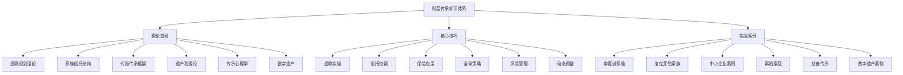
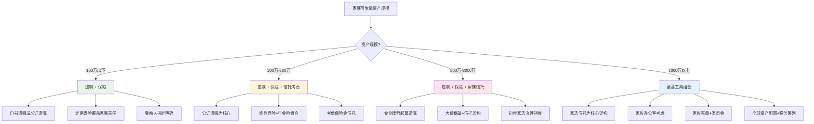
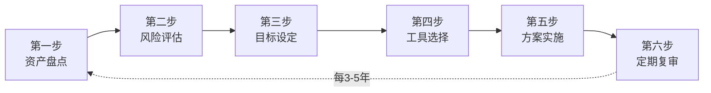

# 第31章 本章小结：遗产与财富传承

## 一、本章核心知识体系回顾

### 1.1 为什么财富传承是一门必修课

财富传承不是老年人的专利，而是每一个有资产、有家庭的人都需要认真对待的课题。"富不过三代"的魔咒之所以反复验证，根本原因不是财富本身的问题，而是缺乏系统性的传承规划。

本章从理论、实操、案例三个维度，构建了一套完整的传承知识体系：

### 1.2 传承的核心逻辑

传承的本质是**三件事**：

| 维度 | 核心问题 | 解决思路 |
|------|----------|----------|
| **资产保护** | 如何确保财富不因风险事件而流失？ | 信托隔离、保险对冲、法律架构设计 |
| **有序分配** | 如何按照本人意愿将财富传递给下一代？ | 遗嘱规划、受益人设计、分配条件设定 |
| **持续增值** | 如何让财富在传承过程中保值增值？ | 专业管理、家族治理、接班人培养 |

这三个维度缺一不可。只做资产保护而忽视分配规划，会导致家族纷争；只做分配规划而忽视持续增值，会导致"坐吃山空"；只关注增值而忽视保护，一次风险事件就可能让所有努力归零。

***

## 二、传承工具体系全景

### 2.1 五大核心工具对比

本章详细讲解了五大传承工具，它们各有侧重、互为补充：

| 工具 | 核心功能 | 适用场景 | 资金门槛 | 设立难度 | 灵活性 | 隐私性 |
|------|----------|----------|----------|----------|--------|--------|
| **遗嘱** | 确定分配方案，表达最终意愿 | 所有人 | 零成本 | 低 | 低（一次性） | 低（需公证/诉讼时公开） |
| **人寿保险** | 提供确定性现金保障 | 有家庭责任者 | 数千元/年起 | 低 | 中（可变更受益人） | 高 |
| **家族信托** | 资产隔离、专业管理、条件分配 | 中高净值家庭 | 300万-1000万起 | 高 | 高（可设分配条件） | 高 |
| **家族基金会** | 永续传承与社会公益 | 超高净值家族 | 数千万起 | 很高 | 中 | 中（需公开披露） |
| **持股平台** | 股权控制与利益分配 | 企业主 | 视情况而定 | 中 | 高 | 中 |

### 2.2 工具选择决策树

不同资产规模和家庭情况，适合的工具组合不同。以下是简化的决策框架：

### 2.3 工具组合的协同效应

单一工具无法解决所有问题。真正有效的传承方案是多工具协同运作的结果：

**遗嘱 + 保险的组合**：遗嘱解决"谁得到什么"的意愿表达，保险解决"钱从哪来"的确定性保障。两者配合，既能体现被继承人的意愿，又能确保受益人获得即时的现金流。

**保险 + 信托的组合（保险金信托）**：将人寿保险的身故理赔金作为信托资产，由受托人按照预设条件管理和分配。这种方式结合了保险的杠杆效应和信托的灵活分配，是中高净值家庭最常用的传承架构之一。

**信托 + 基金会的组合**：信托负责核心资产的保护和管理，基金会负责家族价值观的传承和社会影响力的实现。洛克菲勒家族就是这种组合的经典范例。

**持股平台 + 遗嘱的组合**：通过持股平台实现股权的集中控制，通过遗嘱安排持股平台权益的代际转移，避免直接分割公司股权导致的治理混乱。

***

## 三、传承的核心原则精讲

本章贯穿始终的核心原则可以归纳为六个关键词：

### 3.1 早规划——时间是最强的传承工具

越早开始规划，可选方案越多、成本越低、效果越好。以保险为例：30岁男性购买100万保额的终身寿险，年缴保费约3000-5000元；50岁再买，保费可能翻3-5倍，甚至因健康问题被拒保。

**时间节点建议**：
- **25岁后**：至少立一份基础遗嘱，指定受益人
- **结婚后**：重新审视遗嘱，考虑配偶权益和夫妻共同财产
- **有子女后**：全面规划传承方案，启动保险配置
- **事业有成后**：引入专业团队，建立完整的传承体系
- **50岁后**：重点考虑代际交接和家族治理制度建设

### 3.2 多工具——不要把所有鸡蛋放在一个篮子里

单一工具存在局限性。遗嘱可能被质疑效力，保险可能不够覆盖全部资产，信托可能成本过高。只有多工具组合，才能形成完整的保护网。

**工具组合的基本原则**：
- 遗嘱是底线，所有人都应该有
- 保险是基础杠杆，有家庭责任者必须配置
- 信托是进阶工具，资产规模达到门槛时优先考虑
- 治理制度是顶层设计，决定传承的长期成败

### 3.3 勤沟通——传承最大的敌人是沉默

许多传承失败的根本原因不是工具选错了，而是缺乏沟通。家人不知道你的意愿，不知道你的资产情况，不知道你的安排逻辑，最终导致误解、纷争甚至诉讼。

**沟通的三个层次**：
1. **意愿沟通**：让家人知道你希望如何分配资产，为什么这样安排
2. **信息沟通**：让关键人知道你的资产清单、重要文件存放位置、专业顾问联系方式
3. **价值观沟通**：传递你对财富的态度、对家庭的期望、对下一代的要求

### 3.4 专业化——术业有专攻

传承规划涉及法律、税务、金融、心理等多个领域，个人很难全面掌握。引入专业团队不是可选项，而是必选项。

**核心专业团队成员**：

| 角色 | 职责 | 何时引入 |
|------|------|----------|
| 遗产规划律师 | 起草遗嘱、设计法律架构 | 规划启动时 |
| 税务师 | 税务筹划、合规审查 | 涉及大额资产或跨境资产时 |
| 理财师/信托经理 | 资产配置、信托管理 | 资产规模较大时 |
| 心理咨询师 | 代际沟通、继承人心理辅导 | 涉及复杂家庭关系时 |
| 家族治理顾问 | 制定家族宪章、建立治理机制 | 超高净值家庭 |

### 3.5 制度化——从"人治"到"法治"

传承的终极目标是建立不依赖个人意志的制度体系。洛克菲勒家族能够传承七代，核心不是某一代人的英明决策，而是一套延续百年的家族治理制度。

**家族治理制度的核心要素**：
- **家族宪章**：明确家族使命、价值观、决策规则
- **家族委员会**：定期召开会议，讨论家族重大事务
- **继承人培养计划**：系统性地培养下一代的财务管理能力和社会责任意识
- **冲突解决机制**：预设争议处理流程，避免家族纷争升级

### 3.6 动态化——传承方案不是一劳永逸的

人生阶段、家庭结构、资产规模、法律政策都在变化，传承方案也需要随之调整。建议每3-5年进行一次全面审视，在以下事件发生时立即启动调整：

- 家庭成员出生、死亡、结婚、离婚
- 资产规模发生重大变化（增值或缩水）
- 法律法规发生变化（如遗产税政策出台）
- 企业经营状况发生重大变化
- 海外资产配置发生变化

***

## 四、传承规划的完整流程

### 4.1 六步走流程

本章核心技巧部分详细讲解了传承规划的完整流程，这里做一个系统性回顾：

**第一步：资产盘点**——全面梳理家庭资产和负债，建立完整的资产清单。包括现金、存款、房产、股权、保险、数字资产、海外资产等所有类别。

**第二步：风险评估**——识别可能导致财富流失的风险点，包括人身风险、法律风险、经营风险、财务风险等。

**第三步：目标设定**——明确传承的核心目标：给谁、给多少、什么条件、什么时间。

**第四步：工具选择**——根据资产规模、家庭情况、传承目标，选择合适的工具组合。

**第五步：方案实施**——与专业团队合作，落地执行传承方案。

**第六步：定期复审**——每隔3-5年，或在重大生活事件发生时，重新审视和调整方案。

### 4.2 关键实施要点

在实施过程中，有几个容易被忽视的关键要点：

**文件管理**：所有重要文件（遗嘱、保单、信托合同、资产证明等）需要妥善保管，并让至少一个信任的人知道存放位置。建议使用防火保险箱或银行保管箱，同时保留电子副本。

**受益人管理**：定期检查所有保险、退休账户、投资账户的受益人指定是否仍然符合当前意愿。结婚、离婚、子女出生等事件后，必须立即更新受益人信息。

**税务预判**：虽然中国目前尚未开征遗产税，但需要关注政策动向。如果未来开征遗产税，已有的传承方案可能需要调整。提前了解可能的税务影响，做好预案。

***

## 五、常见误区深度警示

### 5.1 七大误区及纠正

本章详细分析了传承规划中的七大常见误区，这里做一个系统性总结：

| 误区 | 错误认知 | 正确认知 | 危害程度 |
|------|----------|----------|----------|
| "我还年轻" | 传承是老年人的事 | 意外不挑年龄，25岁后就应规划 | ★★★★★ |
| "遗嘱万能" | 立了遗嘱就完成传承 | 遗嘱只是基础环节之一 | ★★★★ |
| "法定继承够用" | 法律会自动公平分配 | 法定继承可能违背本人意愿 | ★★★★ |
| "遗嘱随便写" | 网上模板就行 | 形式要件不满足即无效 | ★★★★★ |
| "信托是有钱人的事" | 资产不够不配用信托 | 保险金信托门槛已大幅降低 | ★★★ |
| "把财产给孩子就行" | 直接给最简单 | 无条件给付可能导致挥霍 | ★★★★ |
| "讨论传承不吉利" | 谈死亡是禁忌 | 沉默是传承最大的敌人 | ★★★★★ |

### 5.2 最危险的三个误区详解

**误区一："我还年轻"**——这是最普遍也最致命的误区。中国每年因意外死亡的人数中，相当比例是40岁以下的青壮年。没有遗嘱的情况下，遗产按照法定继承处理，可能与本人意愿相去甚远。更严重的是，未成年子女的遗产由监护人代管，如果配偶再婚，孩子的利益可能受损。

**误区四："遗嘱随便写"**——这是导致遗嘱无效的最常见原因。自书遗嘱必须亲笔书写全文、签名、注明年月日，缺一不可。代书遗嘱需要两个以上无利害关系的见证人。打印遗嘱需要每一页签名并注明日期。任何一项要件不满足，遗嘱就可能被法院认定无效。

**误区七："讨论传承不吉利"**——这个文化禁忌导致大量家庭从未进行过传承沟通。结果是：被继承人去世后，家人不知道资产在哪里、不知道有什么安排、不知道该如何处理，甚至因为争夺遗产而对簿公堂。打破沉默，是传承规划的第一步。

***

## 六、实战案例的核心启示

### 6.1 三个最具代表性的案例

本章实战案例部分覆盖了多个真实场景，以下是三个最具代表性的案例及其核心启示：

**案例一：李嘉诚家族——教科书级的传承安排**

李嘉诚通过"分家+信托+基金会"的三层架构，实现了家族资产的有序传承。将商业帝国一分为二给两个儿子，同时通过家族信托保留控制权，通过基金会实现慈善传承。核心启示：传承要趁早（李嘉诚在70岁前就完成了核心安排），架构要清晰（每个儿子的资产边界明确），控制权和受益权要分离。

**案例二：洛克菲勒家族——七代传承的百年传奇**

洛克菲勒家族从1870年代至今，财富传承超过150年、七代人。核心不是某一代人的英明决策，而是一套延续百年的家族治理制度——家族宪章、家族委员会、家族办公室、家族慈善基金会。核心启示：制度比个人重要，价值观传承比资产传承更重要。

**案例三：中小企业主的渐进式传承**

并非所有传承都需要复杂的架构。对于中小企业主，最实用的路径是：先通过保险解决家庭保障问题，再通过遗嘱确定基本分配方案，最后在条件成熟时搭建持股平台和信托架构。核心启示：传承可以分步走，不必一步到位。

### 6.2 从案例中提炼的规律

| 规律 | 说明 |
|------|------|
| 规划越早，代价越低 | 李嘉诚、洛克菲勒家族都在鼎盛时期就开始规划传承 |
| 架构比资产更重要 | 好的架构能让财富穿越经济周期，坏的架构会让巨额财富快速蒸发 |
| 沟通是润滑剂 | 传承成功的家族，无一例外都有充分的代际沟通 |
| 专业化是保障 | 所有成功案例背后都有律师、会计师、信托经理等专业团队的支撑 |
| 慈善是加分项 | 家族慈善不仅能实现社会价值，还能增强家族凝聚力和社会声望 |

***

## 七、数字时代的传承新挑战

### 7.1 数字资产的传承

随着数字经济的发展，数字资产已经成为传承规划中不可忽视的新领域。本章专门讨论了数字遗产的传承问题，以下是关键要点：

**需要传承的数字资产类型**：
- **金融类**：支付宝、微信支付、数字货币钱包中的资金
- **账号类**：社交媒体账号、邮箱、云存储账号
- **虚拟财产类**：游戏装备、NFT、域名
- **知识产权类**：自媒体账号的商业价值、数字版权
- **数据类**：个人照片、视频、文档等数字记忆

**实操建议**：
1. 建立一份"数字资产清单"，记录所有重要账号和密码
2. 使用密码管理器（如1Password、Bitwarden）统一管理
3. 在遗嘱中明确数字资产的处置意愿
4. 指定一位"数字执行人"，负责去世后的数字资产处理
5. 了解各平台的账号继承政策（如苹果的"数字遗产联系人"功能）

***

## 八、行动清单与自查框架

### 8.1 分阶段行动清单

**立即行动（本周内）**：
- [ ] 完成家庭资产全面盘点，使用本章练习方法中的资产清单模板
- [ ] 检查现有保险的受益人指定是否符合当前意愿
- [ ] 在安全位置存放所有重要文件的清单
- [ ] 与配偶进行一次非正式的传承话题沟通

**短期行动（1个月内）**：
- [ ] 草拟一份基础遗嘱（可使用自书遗嘱）
- [ ] 审视现有保险是否充足，特别是家庭主要收入来源者的保障
- [ ] 建立一份"数字资产清单"
- [ ] 与家人正式讨论传承意愿

**中期行动（3个月内）**：
- [ ] 咨询一位专业的遗产规划律师，审视遗嘱的法律效力
- [ ] 根据资产规模评估是否需要设立信托
- [ ] 制定初步的传承方案，包括工具选择和时间表
- [ ] 建立家庭重要文件的保管体系

**长期行动（持续进行）**：
- [ ] 每3-5年审视一次传承方案，必要时调整
- [ ] 家庭发生重大变化时及时更新遗嘱和受益人
- [ ] 逐步建立家族治理制度（适用于高净值家庭）
- [ ] 系统性培养下一代的财务管理能力
- [ ] 关注遗产税政策动向，提前做好预案

### 8.2 传承规划自查评分

用以下评分表评估你的传承规划成熟度：

| 评估维度 | 基础（1分） | 进阶（2分） | 成熟（3分） |
|----------|-------------|-------------|-------------|
| **遗嘱** | 没有遗嘱 | 有自书遗嘱 | 有经律师审核的公证遗嘱 |
| **保险** | 没有人寿保险 | 有基本寿险保障 | 有完整的保险+信托架构 |
| **信托** | 未考虑 | 了解信托概念 | 已设立或计划设立信托 |
| **沟通** | 从未讨论 | 偶尔提及 | 定期家庭会议讨论 |
| **专业团队** | 无 | 有律师 | 有律师+会计师+理财师 |
| **数字资产** | 未考虑 | 有密码清单 | 有完整的数字遗产规划 |
| **家族治理** | 未考虑 | 有基本规则 | 有家族宪章和委员会 |

**评分解读**：
- 7-9分：传承规划处于起步阶段，建议尽快完成基础建设
- 10-15分：有一定基础，需要补充完善
- 16-21分：传承规划较为成熟，保持定期审视和调整

***

## 九、关键法律条款速查

### 9.1 《民法典》继承编核心条款

| 条款 | 内容要点 | 实务意义 |
|------|----------|----------|
| 第1123条 | 遗嘱继承优先于法定继承 | 有遗嘱时按遗嘱执行，没遗嘱才按法定继承 |
| 第1127条 | 法定继承人顺序：配偶、子女、父母为第一顺序 | 明确了法定继承的范围 |
| 第1133条 | 自书遗嘱须亲笔书写全文、签名、注明年月日 | 自书遗嘱的形式要件 |
| 第1134-1138条 | 各类遗嘱的形式要件 | 不同遗嘱类型的具体要求 |
| 第1142条 | 遗嘱人可以撤回、变更自己所立的遗嘱 | 遗嘱不是一成不变的 |
| 第1155条 | 遗产分割时应保留胎儿的继承份额 | 保护未出生子女的权益 |
| 第1159条 | 遗产分割前应清偿被继承人依法应缴纳的税款和债务 | 先还债再分配 |

### 9.2 其他相关法律

- **《信托法》**：规范信托的设立、变更和终止，是家族信托的法律基础
- **《保险法》**：关于受益人指定、保险金给付的相关规定
- **《公司法》**：关于股权继承、持股平台设立的相关规定

***

## 十、延伸阅读与学习路径

### 10.1 法律法规

- 《民法典》继承编（第六编）——传承规划的法律基础
- 《信托法》——家族信托的法律框架
- 《保险法》——保险传承的法律依据
- 《慈善法》——家族基金会和慈善信托的法律规范

### 10.2 经典著作

- 《洛克菲勒家族》相关传记——七代传承的制度智慧
- 《家族企业治理》——家族治理制度的设计方法
- 《富过三代》——系统性传承规划的方法论
- 《家族财富》（Family Wealth by James Hughes）——家族办公室领域的经典

### 10.3 深度拓展

本章"深度拓展"部分详细介绍了家族办公室模式、家族宪章制定、全球传承策略等进阶主题，适合资产规模较大或对传承有更深兴趣的读者深入研读。

***

## 一句话总结

> **传承不是为死亡做准备，而是为家人的未来提供保障。越早开始，选择越多，成本越低，效果越好。遗嘱是底线，保险是杠杆，信托是进阶，治理是根本——四者协同，才能真正打破"富不过三代"的魔咒。**

***

## 下一章预告

下一章我们将探讨**搞钱心理学**——你与金钱的关系，你的消费习惯和投资决策背后的心理机制，以及如何培养富人思维。理解金钱心理学，是掌握财富增长的底层逻辑的关键一步。
