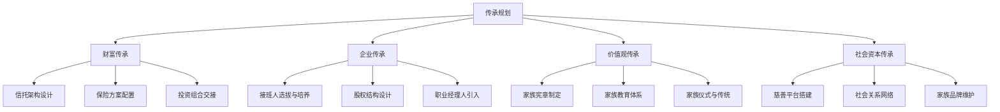
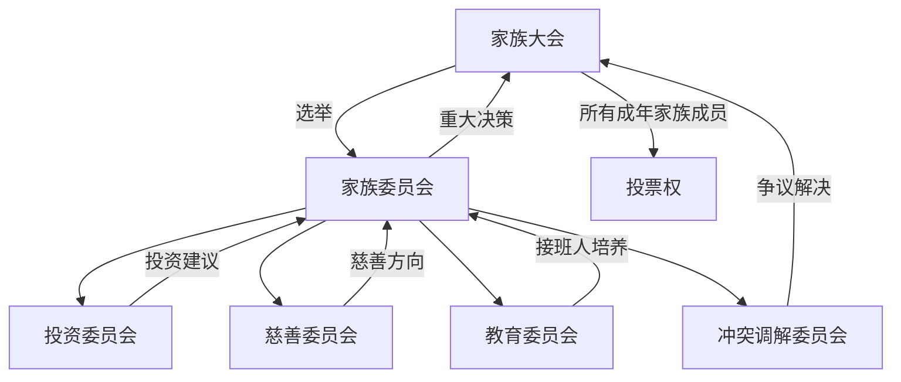
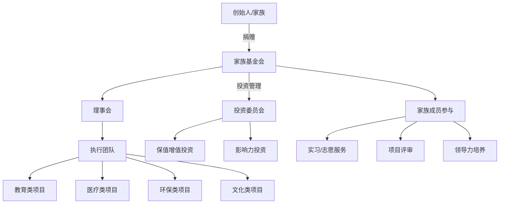
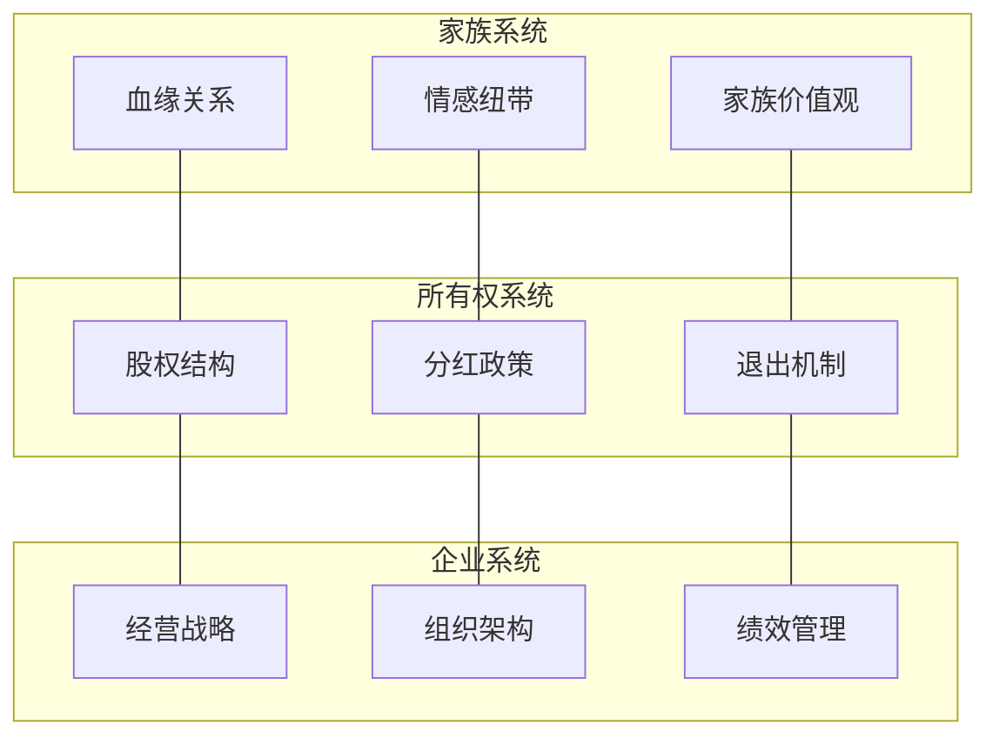

# 遗产与财富传承深度拓展

本章在前文理论基础和核心技巧之上，从家族办公室运营、家族治理制度设计、全球传承工具比较、慈善架构、心理干预、数字资产、税务优化七大维度展开深度剖析。每个维度均提供「理论机制 → 实操框架 → 真实案例 → 中国落地策略」的完整闭环，帮助你建立从宏观架构到微观执行的全景认知。

---

## 一、家族办公室：从概念到落地

### 1.1 家族办公室的本质定义

家族办公室（Family Office，简称FO）不是"高端理财顾问"，而是一个**为单一家族或多个家族提供跨代、跨领域、跨司法管辖区的综合财富治理系统**。它区别于私人银行和财富管理公司的核心差异在于三个维度：

| 维度 | 私人银行 | 财富管理公司 | 家族办公室 |
|------|----------|-------------|-----------|
| 服务立场 | 产品销售导向 | 客户需求导向 | **家族利益至上**（fiduciary duty） |
| 时间视角 | 季度/年度业绩 | 3-5年规划 | **跨代（20-100年）** |
| 服务范围 | 投资+银行产品 | 投资+税务+法律 | **投资+法律+税务+教育+慈善+家族治理+生活方式** |
| 决策权归属 | 银行产品委员会 | 投资团队 | **家族本身**（FO仅执行和建议） |

### 1.2 三种模式的深度对比

**单一家族办公室（SFO, Single Family Office）**

SFO只为一个家族服务，是最高级别的定制化方案。全球约有10,000+个SFO，管理的资产总额超过6万亿美元。

核心优势：
- **完全定制**：投资策略、治理架构、慈善方向全部按家族需求设计
- **极致隐私**：信息不与任何第三方家族共享
- **家族文化传承**：可以将家族价值观深度嵌入运营体系
- **控制权完整**：家族对所有决策拥有最终话语权

核心门槛：
- 可投资资产通常需**5000万美元以上**（部分机构建议1亿美元）
- 年运营成本**200-500万美元**（含人员薪酬、办公场地、技术系统、外包服务）
- 需要持续的专业人才招募和管理能力

SFO的成本结构（以管理2亿美元资产的SFO为例）：

| 成本项 | 年费用（万美元） | 占比 |
|--------|----------------|------|
| 首席投资官（CIO） | 40-80 | 15-20% |
| 投资团队（3-5人） | 60-120 | 25-30% |
| 法律与税务顾问 | 30-50 | 10-15% |
| 运营与合规 | 20-40 | 8-12% |
| 技术系统 | 15-30 | 5-10% |
| 办公与行政 | 20-40 | 8-12% |
| 外部基金费用 | 30-60 | 10-15% |
| **合计** | **215-420** | **100%** |

当SFO的运营成本占管理资产的比例超过0.5%时，应评估转为MFO的可能性。

**联合家族办公室（MFO, Multi-Family Office）**

MFO为多个家族提供共享服务，通过规模效应降低单个家族的成本。

核心优势：
- 成本分摊：单个家族年费通常在**20-100万美元**
- 专业知识共享：投资团队覆盖更多资产类别和市场
- 网络效应：家族之间可以共享投资机会和行业洞察

核心风险：
- **利益冲突**：多个家族的投资偏好可能矛盾
- **隐私泄露**：家族财务信息存在被泄露的风险
- **定制化程度降低**：标准化流程难以满足个性化需求

**嵌入式家族办公室**

将FO职能嵌入家族企业内部，由企业财务团队兼任。适合家族企业资产与企业资产高度重叠、且暂不想独立设立FO的家族。

风险提示：嵌入式FO的最大问题是**利益冲突**——企业利益和家族利益在分红政策、投资决策、人事安排上经常产生矛盾。建议在家族资产超过企业资产的30%时，逐步将FO独立出来。

### 1.3 家族办公室的五大核心职能

**（一）投资管理**

FO的投资管理不是"选基金"，而是构建一个跨代的**全资产配置体系**。

典型配置框架（以1亿美元可投资资产为例）：

| 资产类别 | 配置比例 | 目标收益 | 流动性 |
|----------|---------|---------|--------|
| 全球公开市场股票 | 25-30% | 7-10% | 高 |
| 固定收益/债券 | 15-20% | 3-5% | 高 |
| 私募股权（PE） | 15-20% | 12-18% | 低（锁定期7-10年） |
| 房地产（直接+基金） | 10-15% | 6-10% | 中 |
| 对冲基金 | 5-10% | 5-8% | 中 |
| 基础设施/能源 | 5-8% | 6-9% | 低 |
| 艺术品/收藏品 | 3-5% | 不确定 | 极低 |
| 现金及等价物 | 5-10% | 2-3% | 极高 |
| 数字资产（可选） | 0-3% | 高度波动 | 中 |

投资管理的关键原则：
- **再平衡纪律**：每季度检视一次，偏离目标配置超过5%时触发再平衡
- **流动性分层**：至少保持12个月家族运营支出的现金等价物
- **集中度限制**：单一资产/基金/管理人占比不超过总资产的10%
- **业绩归因**：每年出具详细的投资业绩归因报告，区分beta收益和alpha收益

**（二）税务筹划**

FO的税务筹划是跨司法管辖区的系统工程，核心策略包括：

1. **持股架构优化**：通过BVI、开曼、香港等离岸持股平台，优化跨境投资的税务效率
2. **移民前税务规划**：家族成员移民前的资产转移和税务清算
3. **转让定价管理**：家族企业关联交易的转让定价合规
4. **遗产与赠与税规划**：利用各司法管辖区的免税额度和税收优惠
5. **慈善税务优化**：通过慈善信托和基金会获得税收抵扣

> **关键提醒**：税务筹划必须在合法合规的前提下进行。2018年CRS（共同申报准则）实施后，全球税务透明度大幅提高，传统的避税手段风险急剧上升。所有跨境税务安排必须由持牌税务师和律师审查。

**（三）家族治理**

FO协助建立家族治理架构（详见本章第二节），包括：
- 起草和维护家族宪章
- 组织家族大会和委员会会议
- 管理家族成员信息数据库
- 协调家族内部沟通

**（四）传承规划**

FO的传承规划是多维度的：



**（五）慈善管理**

FO管理家族慈善的全流程：
- 慈善战略制定（聚焦领域、影响力目标、预算）
- 慈善工具选择（基金会/信托/DAF/影响力投资）
- 项目筛选与尽职调查
- 效果评估与报告
- 家族成员参与机制设计

### 1.4 中国家族办公室的现状与特殊挑战

**现状数据（2024-2025年）**

中国内地注册的家族办公室数量约**3,000-5,000家**，但真正达到SFO标准的不足200家。大多数是以"家族办公室"名义运营的财富管理公司或第三方理财机构。

**四大特殊挑战：**

1. **法律框架不完善**
   - 中国《信托法》（2001年）严重滞后，缺乏信托登记制度、信托税收制度
   - 没有专门的家族信托法律，只能依靠营业信托框架
   - 遗产税尚未开征，但未来开征预期增加了规划的不确定性

2. **财富积累时间短**
   - 中国第一代企业家大多在1980-2000年间创业，财富积累仅30-40年
   - 缺乏代际传承的经验和制度积累
   - "创一代"普遍有强烈的控制欲，难以真正放权

3. **文化障碍**
   - 中国传统文化中，"谈钱伤感情"，财富话题被视为禁忌
   - "分家"传统与现代财富保全理念存在冲突
   - "肥水不流外人田"的观念限制了职业经理人的引入

4. **专业人才极度稀缺**
   - 具备法律+金融+税务+家族治理跨学科知识的人才极少
   - 国际化经验（了解海外信托、离岸架构）的人才更少
   - 既懂西方FO理论又了解中国家族文化的人才几乎空白

**中国FO的务实路径：**

对于可投资资产在5000万-3亿人民币的中国家庭，建议采用「三步走」策略：

```text
第一步（1-2年）：建立"虚拟家族办公室"
  → 组建外部顾问团队（律师+税务师+投资顾问）
  → 建立家族财务数据库和决策流程
  → 年成本：50-150万元

第二步（3-5年）：过渡到"嵌入式家族办公室"
  → 在家族企业内设立专职的家族财富管理岗位
  → 开始搭建家族治理架构（家族宪章、家族委员会）
  → 年成本：150-400万元

第三步（5年+）：独立为SFO或加入MFO
  → 资产规模和治理需求成熟后独立运营
  → 或加入信誉良好的MFO降低运营成本
  → 年成本：SFO 500-2000万元 / MFO 100-500万元
```

### 1.5 全球家族办公室标杆案例

**洛克菲勒家族办公室（Rockefeller & Co.）**

- 创立于1882年，是全球最早的家族办公室之一
- 从最初管理约翰·D·洛克菲勒的石油财富，发展为管理超过200亿美元资产的综合FO
- 1979年开放为MFO，开始为其他家族服务
- 核心理念：「用制度而非个人能力来管理财富」
- 传承七代的关键：家族宪章 + 慈善传统 + 专业化管理

**李嘉诚家族办公室**

- 采用「双轨制」：长子李泽钜接管长和系商业帝国，次子李泽楷获得现金自行投资
- 通过家族信托持有长实、长和等上市公司控股权
- 设立了详细的家族宪章，规定家族成员进入企业的条件和退出机制
- 慈善方面：李嘉诚基金会累计捐赠超过300亿港元

---

## 二、家族宪章与治理制度

### 2.1 家族宪章的本质

家族宪章（Family Charter）是家族的「最高宪法」，它回答一个根本问题：**我们这个家族是谁？我们要去哪里？我们如何做出决策？**

家族宪章与商业合同的根本区别在于：商业合同约束的是利益关系，家族宪章守护的是**价值观和情感纽带**。一份好的家族宪章，应该让三代以后的家族成员读到它时，仍然能感受到创始人的愿景和智慧。

### 2.2 家族宪章的七大核心模块

**模块一：家族愿景与使命宣言**

这是宪章的灵魂。它应该回答：
- 我们家族的核心价值观是什么？
- 我们希望家族在社会中扮演什么角色？
- 我们如何定义「成功」——仅仅是财富增长，还是包括社会责任、家族和谐、个人成长？

案例：李锦记家族的使命宣言——「思利及人、永远创业」。这八个字不仅是口号，更被写入了家族委员会的考核标准：家族成员每年必须完成一个「创业项目」（可以是公益项目），否则影响家族分红。

**模块二：家族成员资格界定**

必须明确回答以下问题：
- 什么人算「家族成员」？（仅血亲？包括姻亲？养子女？）
- 家族成员的权利如何获得？何时生效？（出生即获得？成年后申请？）
- 家族成员的资格何时终止？（离婚？主动退出？违反宪章？）
- 非家族成员（如配偶）在家族事务中的角色是什么？

> **常见陷阱**：很多家族宪章回避「姻亲」问题，导致离婚时产生巨大的财产纠纷。建议在宪章中明确规定：姻亲在婚姻存续期间享有有限的参与权，但不享有家族资产的直接所有权。

**模块三：家族治理架构**



家族大会：
- 频率：每年至少1次，重大事项可召开临时大会
- 参与者：所有年满18岁（或21岁）的家族成员
- 决策机制：简单多数（普通事项）或三分之二多数（宪章修改、重大资产处置）
- 建议设置线上参与机制，方便海外家族成员参与

家族委员会：
- 人数：5-9人（单数，避免票数相同）
- 任期：2-3年，可连任一次
- 选举方式：家族大会无记名投票
- 职责：执行家族大会决议、管理日常事务、协调各专业委员会

专业委员会：
- **投资委员会**：监督家族资产配置、审批重大投资决策
- **慈善委员会**：管理家族慈善基金、筛选慈善项目
- **教育委员会**：规划下一代的教育和培养计划
- **冲突调解委员会**：处理家族内部纠纷（详见本章第六节）

**模块四：财富分配原则**

这是宪章中最敏感、最容易引发冲突的部分。需要明确：

1. **分配模式选择**

| 模式 | 描述 | 优点 | 缺点 | 适用场景 |
|------|------|------|------|----------|
| 平等分配 | 每人获得相等份额 | 公平感强，减少争端 | 可能导致企业控制权分散 | 家族资产以金融资产为主 |
| 按需分配 | 根据需求差异化分配 | 照顾弱势成员 | 可能引发不满 | 家族成员经济状况差异大 |
| 按贡献分配 | 参与企业经营者获得更多 | 激励贡献 | 难以量化贡献 | 家族企业为核心资产 |
| 信托+生活费 | 资产放信托，定期发放生活费 | 保护资产不被挥霍 | 限制个人自由 | 第三代以后 |

2. **分配触发条件**
   - 年度定期分配（如每年1月发放）
   - 特殊事件分配（结婚、购房、创业、教育）
   - 紧急分配（重大疾病、法律纠纷）
   - 分配上限：每年总分配不超过家族资产净值的3-5%

3. **分配与贡献挂钩机制**
   - 进入家族企业工作 → 额外获得薪酬和奖金（与市场水平相当）
   - 完成家族教育计划 → 获得一次性奖励
   - 参与家族慈善活动 → 获得「家族积分」（可用于优先获得投资机会）
   - 违反家族宪章 → 扣减或暂停分配

**模块五：接班人培养计划**

系统化的接班人培养不是「送到国外读MBA」那么简单。完整的培养体系包括：

| 阶段 | 年龄 | 培养内容 | 考核标准 |
|------|------|----------|----------|
| 认知启蒙 | 8-14岁 | 基础财商教育、家族历史、参观家族企业 | 完成「家族小课堂」课程 |
| 系统学习 | 14-18岁 | 经济学基础、投资原理、管理学入门 | 完成指定书单和小论文 |
| 海外历练 | 18-22岁 | 名校教育、国际视野、跨文化能力 | 学业成绩+社会实践 |
| 基层锻炼 | 22-26岁 | 在**非家族企业**工作3-5年 | 获得外部雇主正面评价 |
| 企业实习 | 26-30岁 | 进入家族企业从基层做起 | 晋升至中层管理岗位 |
| 独立项目 | 30-35岁 | 独立负责一个业务板块或投资项目 | 项目业绩达标 |
| 全面接管 | 35岁+ | 在导师指导下逐步接管决策权 | 家族委员会评估通过 |

> **关键原则**：接班人必须先在**外部企业**工作，证明自己的能力独立于家族资源。这不仅锻炼能力，更重要的是建立**自信和外部视角**。

**模块六：冲突解决机制**

家族冲突是不可避免的，关键在于建立制度化的解决路径：

```text
第一步：当事人直接沟通（7天内）
  ↓ 未解决
第二步：邀请1-2位双方信任的家族成员调解（14天内）
  ↓ 未解决
第三步：提交家族委员会下设的冲突调解委员会（30天内）
  ↓ 未解决
第四步：聘请外部专业调解人（家族治疗师/律师）（60天内）
  ↓ 未解决
第五步：提交仲裁（具有法律约束力）
  ※ 宪章中应明确规定：家族成员不得就家族事务向法院提起诉讼
```

**模块七：宪章修订机制**

宪章不是一成不变的。建议设置以下修订机制：
- **定期审查**：每3年由家族委员会组织全面审查
- **临时修订**：四分之一以上家族成员联名提出，或家族委员会三分之二多数通过
- **修订门槛**：重大条款修改需家族大会三分之二多数通过
- **过渡安排**：修订生效前设置6-12个月过渡期，保护既得利益

### 2.3 家族宪章制定的实操流程

**阶段一：筹备（3-6个月）**

1. 成立「宪章筹备小组」（3-5人，包括家族核心成员和1-2位外部顾问）
2. 进行家族成员访谈，了解各成员的期望和顾虑
3. 梳理家族资产状况、企业结构、现有法律文件
4. 研究标杆家族的宪章案例
5. 确定宪章的框架和议程

**阶段二：起草（6-12个月）**

1. 由专业顾问团队（律师+家族治理专家+税务师）起草各模块
2. 筹备小组内部讨论和修改
3. 形成初稿

**阶段三：家族讨论（3-6个月）**

1. 组织家族研讨会（建议在中立场所，如度假酒店）
2. 逐条讨论宪章内容，记录所有修改意见
3. 对争议条款进行投票表决
4. 形成终稿

**阶段四：签署与发布**

1. 举办正式的签署仪式（增强仪式感和认同感）
2. 所有年满18岁的家族成员签署
3. 将宪章副本分发给每位家族成员
4. 妥善保存正本（建议存放在律师事务所或银行保险柜）

**阶段五：实施与持续改进**

1. 设立宪章执行监督岗（由家族委员会指定）
2. 每年出具「宪章执行报告」
3. 每3年组织宪章审查
4. 根据家族发展变化进行修订

### 2.4 中国家族宪章的本土化要点

中国家族在制定宪章时，需要特别注意以下本土化因素：

1. **孝道文化的融入**：将「孝道」写入家族价值观，但要避免将其作为压制年轻一代的工具
2. **「分家」的制度化处理**：与其回避分家话题，不如在宪章中明确分家的规则和条件
3. **女性成员的权利保障**：传统观念中女性在家族事务中话语权较弱，宪章应明确保障女性成员的平等权利
4. **「养儿防老」与现代养老的衔接**：宪章应为家族成员的养老提供制度化的保障
5. **家族企业与非企业成员的利益平衡**：参与经营和不参与经营的家族成员之间如何公平分配

---

## 三、跨代财富传承的国际比较

### 3.1 全球传承制度全景

| 国家/地区 | 遗产税税率 | 免税额度 | 信托制度成熟度 | 跨代传承关键工具 | 文化特征 |
|-----------|-----------|---------|--------------|----------------|----------|
| 美国 | 40%（联邦）+ 0-20%（州） | 1,361万美元/人（2024） | ★★★★★ | 不可撤销信托+GRAT+慈善信托 | 重视慈善传承，"美国梦"激励机制 |
| 英国 | 40% | 32.5万英镑/人 | ★★★★★ | 信托+家庭投资公司（FIC） | 重视教育传承，贵族传统 |
| 日本 | 最高55% | 3,600万日元+600万×法定继承人数 | ★★★☆☆ | 养子制度+番头制度+暖簾传承 | 家族荣誉感强，百年企业最多 |
| 新加坡 | 0%（2008年废除） | N/A | ★★★★☆ | 可变资本公司（VCC）+家族信托 | 国际化，区域财富管理中心 |
| 中国香港 | 0% | N/A | ★★★★☆ | 私人信托公司（PTC）+家族信托 | 中西合璧，自由港优势 |
| 中国内地 | 0%（目前） | N/A | ★★☆☆☆ | 家族信托+保险+遗嘱 | 法律框架发展中，文化特殊 |
| 瑞士 | 0-50%（各州不同） | 各州不同 | ★★★★★ | 基金会+信托+保险 | 中立传统，精密制造传承 |
| 德国 | 最高50% | 40万欧元（配偶）/20万欧元（子女） | ★★★★☆ | 双元制教育+隐形冠军模式 | 技术传承，学徒文化 |

### 3.2 日本"百年企业"传承密码

日本拥有**33,000+家百年企业**（全球第一），其中超过200家企业历史超过500年，7家企业历史超过1,000年。最老的企业是金刚组（建筑公司），成立于公元578年，传承超过1,400年。

**传承密码一：养子继承制度（婿养子）**

当亲生子女不适合或不愿继承时，日本家族企业会通过「婿养子」制度收养有能力的人（通常是女婿或优秀员工）作为继承人。这一制度的本质是**将血缘继承转为能力继承**。

统计数据显示：日本企业传承中，约**25-30%的继承人是养子**。在三井、住友、安田等著名财阀的历史中，养子继承多次出现，且养子领导的企业业绩往往不逊于血亲继承。

**传承密码二：番头制度（职业经理人）**

「番头」相当于现代的CEO/总经理，由家族聘请的职业经理人担任。番头负责企业的日常经营，家族保留所有权和监督权。这种**所有权与经营权分离**的模式，在日本已经有数百年的历史。

**传承密码三：暖簾（品牌）传承**

日本家族企业将「暖簾」（品牌声誉）视为最重要的家族资产。传承的首要目标不是财富数量，而是品牌信誉的延续。这与中国「富不过三代」形成鲜明对比——日本企业传承的是**无形资产**，而不仅仅是有形财富。

**传承密码四：本家-分家制度**

日本家族的「本家-分家」制度，允许次子以下的家族成员建立「分家」，分家独立经营但保持与本家的联系和互助。这种制度既避免了家族内部分家产的冲突，又保持了家族网络的凝聚力。

### 3.3 欧洲家族企业的代际传承

**德国模式：隐形冠军与双元制教育**

德国有约1,500家「隐形冠军」（Hidden Champions）——在细分市场占据全球前三的中小企业，绝大多数由家族经营。这些企业传承的关键：

- **双元制教育**：德国的学徒制（Duales System）为家族企业培养了大量技术人才，也培养了下一代的动手能力和工匠精神
- **长期主义**：德国家族企业普遍不追求短期利润，而是注重研发投入和技术积累
- **保守的财务策略**：低负债、高留存收益、不上市（避免资本市场的短期压力）
- **案例**：汉高（Henkel）、博世（Bosch）、默克（Merck）等家族企业均已传承超过百年

**意大利模式：奢侈品与家族品牌**

意大利家族企业的传承与奢侈品行业深度绑定：古驰（Gucci）、普拉达（Prada）、阿玛尼（Armani）、法拉利（Ferrari）等品牌的创始家族，通过家族信托和基金会保持对品牌的控制。

意大利传承的独特之处：
- **设计哲学传承**：品牌的核心不是产品，而是设计理念和美学传统
- **工匠网络维护**：意大利奢侈品依赖分散在各地的家族工匠作坊，传承包括维护这些代际合作关系
- **家族叙事构建**：品牌的「故事」本身就是核心资产，传承包括品牌故事的维护和传播

**瑞士模式：精密制造与金融双轨**

瑞士家族企业分布在精密制造（手表、仪器）和金融服务两大领域，传承特点：
- **极度保守**：瑞士家族企业普遍偏好有机增长，很少进行激进的并购
- **品牌永恒性**：百达翡丽的广告语「没有人真正拥有百达翡丽，只不过为下一代保管」精准概括了瑞士传承哲学
- **基金会护城河**：许多瑞士家族通过基金会持有企业股权，防止恶意收购和家族纷争

### 3.4 华人社会的财富传承困局与破局

**「富不过三代」的全球数据**

| 地区 | 一代到二代 | 二代到三代 | 三代以后 |
|------|-----------|-----------|---------|
| 全球平均 | 70%财富保留 | 20%财富保留 | 10%财富保留 |
| 美国 | 65% | 30% | 15% |
| 欧洲 | 70% | 35% | 20% |
| 日本 | 80% | 50% | 35% |
| 中国 | 60% | 15% | 5% |

中国家族的传承衰减速度明显快于全球平均水平，核心原因：

1. **过度集中的决策模式**：「一言堂」导致组织能力无法独立于创始人
2. **分家传统**：「诸子均分」导致财富和企业被分割
3. **接班人培养不足**：「含着金汤匙」长大，缺乏独立生存能力
4. **家族治理缺失**：没有制度化的治理架构，全靠人治
5. **投资视野短视**：过度依赖房地产和高风险投机

**华人传承的新趋势**

- **港台家族的国际化**：李嘉诚、郭鹤年等家族通过海外信托和离岸架构实现了跨代传承
- **新经济家族的探索**：互联网新贵（如马云、马化腾）正在探索全新的传承模式，包括慈善基金会+影响力投资
- **双轨传承**：家族企业由专业团队管理，家族成员专注于投资、慈善和兴趣领域
- **跨境布局**：越来越多的华人家族在新加坡、香港设立家族办公室，利用两地的制度优势

---

## 四、慈善架构设计与传承功能

### 4.1 慈善为什么是传承的核心工具

很多家族把慈善视为「有钱了才做的事」，这是一个根本性的误解。慈善在传承中的功能远不止「回馈社会」：

1. **价值观锚定**：慈善为家族提供了一个超越金钱的共同目标，增强家族凝聚力
2. **接班人培养**：通过慈善项目，下一代学习领导力、决策力和社会责任感
3. **税务优化**：慈善捐赠在大多数司法管辖区享有税收优惠
4. **声誉资本**：慈善声誉是家族的「软资产」，在危机时刻可以发挥保护作用
5. **冲突缓冲**：慈善为家族成员提供了一个非商业的合作平台，缓解利益冲突

### 4.2 四大慈善工具的深度对比

| 工具 | 设立门槛 | 年度支出要求 | 税收优惠 | 控制权 | 适合人群 |
|------|---------|------------|---------|--------|---------|
| 家族基金会 | 200-800万元 | 美国：资产的5%；中国：公益支出≥上年收入的70% | 捐赠可抵税 | 家族完全控制 | 资产>5000万，有长期慈善愿景 |
| 慈善信托 | 无固定门槛 | 无固定要求 | 信托财产独立，部分免税 | 受托人+保护人制 | 希望资产隔离和灵活安排 |
| 捐赠人建议基金（DAF） | 5-25万元 | 无固定要求 | 捐赠即时抵税 | 建议权（非控制权） | 资产500万-5000万，不想运营实体 |
| 影响力投资 | 无固定门槛 | N/A | 部分税收优惠 | 完全自主 | 希望兼顾社会影响和财务回报 |

**家族基金会的详细架构：**



**DAF（捐赠人建议基金）的运作机制：**

DAF是近年来增长最快的慈善工具。它的核心逻辑是「先捐赠、后建议」：

1. 捐赠人将现金、股票或其他资产存入DAF账户
2. 获得**即时的税收减免**（捐赠当年即可抵税）
3. 资产在DAF账户中继续投资增值（免资本利得税）
4. 捐赠人在方便的时候，建议DAF管理机构将资金捐赠给指定的慈善项目
5. DAF管理机构通常会批准捐赠人的建议（但保留最终决定权）

DAF的优势：
- 设立门槛低（最低5万元人民币即可）
- 无需自行运营基金会（省去合规、审计、报告等成本）
- 可以匿名捐赠
- 适合家族成员逐步学习慈善管理

### 4.3 慈善传承的实操框架

**第一步：确定慈善使命**

家族慈善使命应该与家族价值观紧密相关。引导问题：
- 家族成员对哪些社会问题最有热情？
- 家族的行业专长可以为哪些领域做出独特贡献？
- 希望影响多大的范围（社区/城市/国家/全球）？
- 希望在多长时间内产生影响？

**第二步：选择工具组合**

大多数成熟家族采用「工具组合」策略：

```text
核心工具（70%资产）：家族基金会或慈善信托
  → 用于系统化的长期慈善项目

灵活工具（20%资产）：DAF
  → 用于突发性捐赠需求和家族成员的个人慈善意愿

投资工具（10%资产）：影响力投资
  → 用于尝试创新的慈善模式（社会企业、绿色债券等）
```

**第三步：建立参与机制**

慈善不应由一两个人垄断，而应成为**全家族参与**的活动：
- **青少年**：参与慈善项目的志愿服务
- **大学生**：在基金会实习，学习项目管理
- **成年家族成员**：轮流担任项目评审委员
- **配偶**：主导特定慈善领域的项目（如教育、医疗）
- **孙辈**：设立「小小慈善家」项目，培养早期的公益意识

### 4.4 中国慈善的特殊考量

**法律框架**

- 《慈善法》（2016年9月1日实施）：基本法律框架
- 《基金会管理条例》：基金会的设立和运营规范
- 《慈善信托管理办法》：慈善信托的设立和管理

**税收政策**

- 个人捐赠：不超过应纳税所得额30%的部分可税前扣除
- 企业捐赠：不超过年度利润总额12%的部分可税前扣除，超出部分可结转3年
- 股权捐赠：按公允价值计算，可分期扣除（5年）

**实操建议**

1. **先DAF后基金会**：资产规模不足5000万时，先通过DAF积累经验，再考虑设立基金会
2. **利用慈善信托**：2016年后慈善信托发展迅速，门槛低、灵活性高
3. **股权捐赠规划**：如果持有上市公司股权，可通过捐赠获得税收优惠同时保留投票权（通过捐赠无投票权的优先股或限制性股票）
4. **家族慈善年会**：每年举办一次家族慈善会议，让所有家族成员参与项目选择和效果评估

---

## 五、家族企业治理的深层机制

### 5.1 三环模型的实践应用

家族企业治理的经典理论是三环模型（Three-Circle Model），它将家族企业分解为三个相互交织的系统：



三环模型揭示了家族企业中**七个角色区域**：

| 区域 | 描述 | 治理要点 |
|------|------|----------|
| 仅家族 | 家族成员但不持有股份、不在企业工作 | 参与家族治理，但不干预企业经营 |
| 仅所有者 | 持有股份但不是家族成员、不在企业工作 | 享受分红权，参与股东会议 |
| 仅员工 | 在企业工作但不是家族成员、不持有股份 | 绩效考核与非家族员工一致 |
| 家族+所有者 | 家族成员且持有股份但不在企业工作 | 参与股东决策，不干预日常经营 |
| 家族+员工 | 家族成员在企业工作但不持有股份 | 需要区分「家族身份」和「员工身份」 |
| 所有者+员工 | 持有股份且在企业工作但不是家族成员 | 通常为股权激励的高管 |
| 三者重叠 | 家族成员且持有股份且在企业工作 | 核心传承对象，面临最大角色冲突 |

**关键原则：角色分离**

家族企业中最大的治理陷阱是**角色混淆**。一个在企业担任副总的家族成员，同时持有10%的股份，同时还是家族委员会成员——他/她在讨论企业战略时，到底代表哪个身份？

制度化的解决方案：
1. 家族会议、董事会、管理层会议**分别召开**
2. 每次会议明确参与者的**角色和投票权**
3. 当角色冲突时，以企业利益为优先（否则企业衰败，所有角色受损）
4. 建立「角色冲突申报」机制——参与者在会议开始时主动声明利益冲突

### 5.2 董事会建设的实操指南

家族企业的董事会不应是橡皮图章，而应是**战略决策和管理层监督的核心**。

**董事会构成建议：**

| 角色 | 人数 | 要求 | 职责 |
|------|------|------|------|
| 家族董事 | 2-3人 | 家族核心成员，对企业有深入理解 | 代表家族利益和长期战略 |
| 独立董事 | 2-3人 | 行业专家/法律/财务专业人士 | 提供独立判断，制衡家族权力 |
| 管理层董事 | 1-2人 | CEO/CFO | 提供经营信息和专业建议 |
| 员工董事（可选） | 1人 | 员工代表 | 代表员工声音（适用于大企业） |

独立董事的选聘标准：
- 在行业内有公认的声誉和专业能力
- 与家族成员无亲属关系或重大利益关系
- 有担任上市公司或大型企业董事的经验
- 愿意投入足够时间了解企业（每年至少6-8次会议）

**董事会议事规则：**
- 频率：每季度1次，紧急事项可召开临时会议
- 议程：提前14天发送会议材料
- 决策：简单多数通过，重大事项需三分之二多数
- 回避：涉及个人利益的议题，相关董事必须回避
- 记录：会议纪要在7天内分发给所有董事

### 5.3 家族宪法与法律效力

家族宪章（Charter）和家族宪法（Constitution）的区别：

| 特征 | 家族宪章 | 家族宪法 |
|------|---------|---------|
| 法律约束力 | 道德约束为主 | 可作为股东协议附件，具有法律效力 |
| 灵活性 | 高，易于修改 | 低，修改需法律程序 |
| 覆盖范围 | 家族治理、价值观 | 主要约束股东行为和企业治理 |
| 适用场景 | 家族内部治理 | 与外部投资者/合伙人的关系 |

实操建议：将宪章中涉及股权、分红、退出机制的条款，**同时写入股东协议**，使其具有法律约束力。价值观、教育、慈善等软性条款保留在宪章中，通过道德约束和家族文化来执行。

### 5.4 ESG实践与家族企业的长期优势

ESG（环境、社会、治理）投资理念与家族企业的「长期主义」天然契合。家族企业推行ESG的独特优势：

1. **不受季度业绩压力**：可以投资长期回报但短期无收益的ESG项目
2. **价值观驱动**：创始家族的价值观可以成为ESG战略的内在驱动力
3. **代际传承视角**：「为下一代保管」的理念与可持续发展高度一致
4. **品牌溢价**：家族企业的ESG声誉可以转化为消费者信任和品牌价值

落地建议：
- 在董事会下设ESG委员会
- 发布年度ESG报告（可参考GRI或SASB标准）
- 将ESG指标纳入管理层绩效考核
- 参与行业ESG倡议（如联合国负责任投资原则PRI）

---

## 六、传承中的心理干预与家族调解

### 6.1 财富继承的心理冲击

继承巨额财富对继承人的心理影响被严重低估。研究表明，超过**70%的财富继承者**在继承过程中经历了显著的心理困扰。

**四大心理冲击：**

**（一）身份认同危机**

突然获得巨额财富可能导致「我是谁」的迷失。继承人可能感到：
- 自我价值被财富定义：「别人尊重的是我的钱，不是我这个人」
- 冒名顶替综合征：「我不配拥有这些财富」
- 目标缺失：「我有了足够一辈子花的钱，还需要努力吗？」
- 社交隔离：「我不知道谁是真正的朋友」

**（二）期望压力**

来自家族和社会的期望形成多重压力源：
- 家族期望：「你要比你父亲做得更好」
- 员工期望：「新老板会裁掉我们吗？」
- 媒体期望：「富二代」的刻板印象
- 自我期望：「我必须证明自己」

**（三）关系异化**

财富会改变几乎所有的人际关系：
- 与父母：「他们把财富给我，是爱我还是控制我？」
- 与兄弟姐妹：「为什么他/她分得比我多？」
- 与配偶：「他/她是因为钱才和我在一起吗？」
- 与朋友：「他们找我借钱怎么办？」
- 与员工：「我是靠能力还是靠姓氏坐在这里？」

**（四）决策恐惧**

管理巨额财富的责任导致决策瘫痪：
- 害怕犯错导致家族财富缩水
- 面对复杂的投资建议无法判断
- 在「保守」和「进取」之间摇摆不定
- 对专业人士的建议缺乏信任

### 6.2 「创一代」的放手难题

「创一代」不愿放手的心理根源：

1. **控制欲**：创业过程中形成的「所有事都要亲力亲为」的习惯
2. **身份绑定**：「企业就是我，我就是企业」的自我认同
3. **不信任**：「没有人比我更了解这个行业」
4. **恐惧**：放手意味着承认自己「老了」，面对死亡焦虑
5. **情感依赖**：工作是生活的主要意义来源，退休意味着空虚

**系统化的放手方案：**

| 阶段 | 时间 | 创一代的角色 | 下一代的角色 | 关键动作 |
|------|------|------------|------------|----------|
| 观察期 | 1-2年 | 全面管理 | 观察学习 | 创一代定期向「接班人」讲解决策逻辑 |
| 协作期 | 2-3年 | 主要决策 | 辅助决策 | 重大决策由两人共同讨论 |
| 过渡期 | 2-3年 | 重大决策 | 日常管理 | 创一代只参与战略方向和重大投资 |
| 顾问期 | 1-2年 | 顾问 | 全面负责 | 创一代仅在被邀请时提供建议 |
| 退出期 | 持续 | 退休 | 全面管理 | 创一代专注慈善、教育、兴趣 |

**心理支持工具：**

1. **家族治疗师介入**：在传承开始时就引入家族治疗师，帮助双方表达真实的期望和恐惧
2. **「传承对话」工作坊**：由专业引导师组织创一代和下一代进行结构化对话
3. **创一代的「第二人生」规划**：帮助创一代在退休前建立新的身份和兴趣
4. **外部导师制度**：为创一代找一位已经成功传承的「过来人」作为导师

### 6.3 代际沟通障碍的破解

**常见沟通陷阱与破解方法：**

| 陷阱 | 表现 | 破解方法 |
|------|------|----------|
| 财富话题禁忌 | 「我们家不谈钱」 | 设置固定的「家族财务会议」，在正式场合讨论 |
| 价值观强加 | 「你应该像我一样创业」 | 尊重每代人的选择，用引导代替说教 |
| 情感绑架 | 「我辛苦打下的江山你不懂珍惜」 | 聚焦事实和数据，减少情感化的表达 |
| 比较心理 | 「你看看你哥/姐多能干」 | 每个家族成员的发展路径不同，避免横向比较 |
| 回避冲突 | 「以后再说吧」 | 建立定期沟通机制，不让问题积累 |

**结构化沟通框架——「家族圆桌」**

每月或每季度举行一次「家族圆桌」会议：
1. **开场（5分钟）**：每人分享一件最近的好事
2. **主题讨论（60分钟）**：围绕一个预设主题深入讨论
3. **开放议题（30分钟）**：任何成员可以提出想讨论的话题
4. **总结（15分钟）**：记录决议和待办事项
5. **结束（5分钟）**：每人分享一个收获

### 6.4 「富不过三代」的心理学破解

**第三代魔咒的心理机制：**

```text
第一代：匮乏 → 奋斗 → 创造财富
  ↓
第二代：目睹奋斗 → 部分继承奋斗精神 → 守住财富
  ↓
第三代：从未经历匮乏 → 奋斗动机弱化 → 消耗财富
```

**系统化破解方案：**

1. **「匮乏教育」**：不是让第三代真正受苦，而是通过设计体验让他们理解匮乏的感受
   - 限制生活费（与同龄人平均水平相当）
   - 安排在基层岗位实习（不能用家族名义）
   - 参与贫困地区志愿服务

2. **「使命驱动」**：为第三代提供超越金钱的使命感
   - 参与家族慈善项目，亲眼看到财富的正面影响
   - 承担家族企业中的具体责任（如负责一个新业务线）
   - 建立个人的事业目标（可以与家族无关）

3. **「财务素养」**：从8岁开始的系统化财商教育
   - 8-12岁：认识金钱、储蓄和消费
   - 12-16岁：投资基础、复利效应、风险概念
   - 16-18岁：模拟投资组合管理
   - 18岁+：参与真实的投资决策（从小额开始）

4. **「制度保障」**：不依赖个人意志，而是通过制度防止挥霍
   - 信托架构：资产放入信托，定期发放生活费
   - 分配条件：将分配与教育完成、工作年限等挂钩
   - 独立监察人：聘请外部受托人监督资产使用

### 6.5 家族冲突调解的实操工具

**调解流程设计：**

当家族冲突发生时，按照以下五步流程处理：

**第一步：事实梳理（不带情绪）**

引导冲突双方分别回答：
- 发生了什么？（只描述事实，不加判断）
- 你的感受是什么？（用「我感到……」句式）
- 你的需求是什么？（核心利益而非立场）
- 你愿意做出什么让步？

**第二步：利益分析**

将双方的「立场」（我想多分10%）转化为「利益」（我希望得到公平对待/我希望有足够的创业资金）。很多看似不可调和的立场，背后的利益是可以兼容的。

**第三步：方案共创**

引导双方共同设计解决方案，而不是由调解人给出方案。人们更愿意执行自己参与设计的方案。

**第四步：协议书面化**

将达成的共识以书面形式记录，明确：
- 各方的权利和义务
- 执行时间表
- 违约后果
- 复查机制

**第五步：跟踪执行**

调解不是一次性事件，需要持续跟踪：
- 30天后回访：协议执行情况
- 90天后评估：冲突是否真正解决
- 必要时进行后续调解

---

## 七、数字资产与新型财富的传承

### 7.1 数字资产的分类与传承挑战

数字资产已经从边缘话题变成了传承规划中不可忽视的核心议题。据统计，全球数字资产总值已超过**10万亿美元**，且每年以20%以上的速度增长。

**数字资产分类：**

| 类别 | 具体内容 | 传承难度 | 关键挑战 |
|------|----------|---------|----------|
| 加密货币 | 比特币、以太坊等 | ★★★★★ | 私钥丢失=永久丧失 |
| 数字账户 | 社交媒体、邮箱、云存储 | ★★★☆☆ | 平台条款限制转让 |
| 数字内容 | 照片、视频、博客、代码 | ★★☆☆☆ | 归属权和隐私问题 |
| 虚拟财产 | 游戏装备、NFT、虚拟土地 | ★★★★☆ | 估值困难，流动性差 |
| 数字权益 | 域名、自媒体账号、网店 | ★★★★☆ | 平台规则限制 |
| 数据资产 | 企业数据、算法模型 | ★★★★★ | 知识产权和商业秘密 |

### 7.2 加密货币传承的实操指南

加密货币传承是最具挑战性的数字资产传承场景，因为**丢失私钥=永久丧失资产**。

**加密货币传承清单：**

1. **资产清单**：详细记录持有的所有加密货币种类、数量、存放位置（交易所/钱包）
2. **私钥管理**：
   - 热钱包（在线）：记录助记词和密码
   - 冷钱包（硬件）：记录设备位置、PIN码、助记词
   - 交易所账户：记录登录凭证和二次验证方式
3. **继承方案**（三种选择）：

| 方案 | 描述 | 优点 | 缺点 |
|------|------|------|------|
| 多重签名钱包 | 需要2/3或3/5个签名才能转账 | 安全性高，防止单点失败 | 设置复杂，费用较高 |
| 时间锁智能合约 | 资产在指定时间后自动转移 | 无需信任第三方 | 不可逆，无法应对意外变化 |
| 数字遗产服务商 | 第三方保管密钥，死后释放 | 简单方便 | 依赖第三方安全性 |

4. **定期更新**：每6个月更新一次资产清单和访问凭证
5. **法律文件**：在遗嘱中明确加密资产的分配，并附上资产清单（但**不要在遗嘱中记录私钥**——遗嘱是公开文件）

### 7.3 社交媒体和数字账户的传承

**各平台的遗产处理政策：**

| 平台 | 遗产政策 | 操作方式 |
|------|----------|----------|
| 微信 | 可申请账号继承 | 提供死亡证明和亲属关系证明 |
| 支付宝 | 余额可继承 | 提供死亡证明、继承权公证书 |
| Google | 非活动账号管理（Inactive Account Manager） | 生前设置不活跃期限和联系人 |
| Facebook | 纪念账号或删除 | 亲属申请，可选择纪念或删除 |
| Apple | 数字遗产联系人 | iOS 15.2+支持设置遗产联系人 |
| 抖音 | 可申请账号注销或继承 | 联系客服，提供相关证明 |

**数字资产传承的法律空白：**

目前大多数国家的继承法**没有明确涵盖数字资产**，导致：
- 虚拟财产的法律性质不明确（是财产还是服务使用权？）
- 继承人是否有权访问逝者的社交账号存在争议
- 平台服务条款可能禁止账号转让

**实操建议：**

1. **生前规划**：在意识清醒时就做好数字资产的整理和传承安排
2. **数字遗嘱**：单独制作一份「数字资产遗嘱」，记录所有重要账号和密码
3. **密码管理器**：使用密码管理器（如1Password、Bitwarden）统一管理所有密码，只需传承一个主密码
4. **遗产联系人**：在Apple、Google等支持此功能的平台上设置遗产联系人
5. **定期审计**：每6个月审查一次数字资产清单，删除不再使用的账号

---

## 八、跨境传承的税务优化策略

### 8.1 跨境传承的税务框架

随着全球化加深，越来越多的家族拥有**跨境资产**（海外房产、海外公司股权、海外投资账户）。跨境传承面临的税务挑战包括：

1. **双重征税**：同一笔遗产可能在资产所在国和居住国都被征税
2. **遗产税与赠与税**：不同国家的税率和免税额度差异巨大
3. **外汇管制**：资金跨境转移受到限制
4. **CRS信息交换**：全球税务透明度提高，传统避税手段失效

### 8.2 合法税务优化的六大策略

**策略一：利用税收协定网络**

中国已与100+个国家签署了避免双重征税协定。通过合理的架构设计，可以利用协定中的优惠条款降低跨境传承的税负。

关键条款：
- 遗产税条款：部分协定包含遗产税的分配规则
- 赠与税条款：规定赠与的征税权归属
- 股息/利息/特许权使用费的预提税率优惠

**策略二：信托架构的税务优化**

不同司法管辖区的信托税务处理差异巨大：

| 司法管辖区 | 信托税务处理 | 适合场景 |
|-----------|------------|----------|
| 香港 | 无遗产税、无资本利得税 | 亚太资产传承 |
| 新加坡 | 无遗产税，信托收入可能免税 | 东南亚资产传承 |
| 开曼群岛 | 无直接税 | 纯投资架构 |
| 瑞士 | 各州税率不同，整体较低 | 欧洲资产传承 |
| 英国 | 信托有专门的税务规则，需要规划 | 英国资产传承 |

**策略三：移民前税务规划**

家族成员移民前的税务规划至关重要：
- 赠与税优化：移民前将资产赠与留在国内的家族成员
- 资产重估：移民前对增值资产进行重估，锁定成本基础
- 信托设立：在移民前设立不可撤销信托，将资产移出遗产
- 税务清算：处理移民国可能产生的「弃籍税」（如美国的Exit Tax）

**策略四：保险的跨境税务优势**

人寿保险在许多司法管辖区享有特殊的税务待遇：
- 香港：人寿保险赔付不计入遗产
- 新加坡：人寿保险赔付免遗产税
- 美国：不可撤销人寿保险信托（ILIT）的赔付不计入遗产

**策略五：慈善的跨境税务优化**

通过在低税地区设立慈善基金会：
- 获得捐赠的税收抵扣
- 基金会资产免征资本利得税
- 基金会向后代支付合理薪酬，实现财富转移

**策略六：家族企业的持股架构优化**

通过中间控股公司架构，优化跨境分红和退出的税务效率：

```text
家族成员（中国税务居民）
  ↓ 持有
香港控股公司（利用内地-香港税收安排）
  ↓ 持有
BVI公司（中间层，优化退出税务）
  ↓ 持有
实际运营公司（目标市场）
```

> **重要提醒**：所有跨境税务架构必须由专业税务师设计和审查。2018年CRS实施后，中国税务居民的海外金融资产信息会自动交换给中国税务局。任何隐瞒海外资产的行为都可能构成逃税。

---

## 九、传承风险管理与应急机制

### 9.1 传承过程中的十大风险

| 风险类型 | 具体表现 | 发生概率 | 影响程度 | 防范措施 |
|----------|---------|---------|---------|----------|
| 创一代突然离世 | 未完成传承安排 | 中 | 极高 | 提前立遗嘱+生前赠与 |
| 继承人内斗 | 争夺遗产和控制权 | 高 | 高 | 家族宪章+信托架构 |
| 企业经营危机 | 债务连带家族资产 | 中 | 高 | 资产隔离+有限责任 |
| 婚姻变动 | 离婚分割家族财富 | 中高 | 高 | 婚前协议+信托保护 |
| 税务政策变化 | 遗产税开征 | 中 | 高 | 提前规划+架构调整 |
| 代际价值观冲突 | 下一代不愿继承 | 中 | 中 | 尊重选择+替代方案 |
| 专业人员道德风险 | 受托人/顾问舞弊 | 低 | 高 | 多方制衡+定期审计 |
| 投资失误 | 大额投资亏损 | 中 | 中高 | 分散投资+流动性管理 |
| 法律纠纷 | 继承权争议/遗嘱效力 | 中 | 中高 | 专业法律文件+公证 |
| 不可抗力 | 战争/自然灾害/疫情 | 低 | 高 | 跨地域分散+保险覆盖 |

### 9.2 传承应急预案模板

每个家族都应该有一份**传承应急预案**，类似企业的BCP（业务连续性计划）：

```text
文件名称：[家族名称] 传承应急预案
生效日期：[日期]
最近更新：[日期]

一、核心联系人
  - 家族律师：[姓名/电话/邮箱]
  - 家族税务师：[姓名/电话/邮箱]
  - 家族信托受托人：[姓名/电话/邮箱]
  - 家族办公室负责人：[姓名/电话/邮箱]
  - 家族保险顾问：[姓名/电话/邮箱]

二、资产清单（加密保管）
  - 房产清单及产权证存放位置
  - 金融资产清单及账户信息
  - 企业股权结构及文件位置
  - 保险保单清单
  - 数字资产清单及访问凭证
  - 其他资产（艺术品、收藏品等）

三、法律文件清单
  - 遗嘱存放位置及执行人
  - 信托文件存放位置
  - 股东协议及公司章程
  - 婚前/婚内协议
  - 授权委托书

四、应急决策流程
  - 创一代丧失行为能力时的决策流程
  - 创一代突然离世时的资产保全流程
  - 继承人未成年时的监护和资产管理安排
  - 企业紧急接班方案

五、定期更新机制
  - 每6个月更新资产清单
  - 每年审查保险覆盖范围
  - 每3年更新遗嘱和信托文件
  - 每年进行一次「传承演练」
```

### 9.3 保险在风险管理中的系统化应用

保险不仅是「理财工具」，更是传承风险管理的**第一道防线**。

**传承保险体系设计：**

| 保险类型 | 保障目标 | 保额建议 | 适合人群 |
|----------|---------|---------|---------|
| 定期寿险 | 创一代突然离世的收入替代 | 年收入×10-15倍 | 创一代（收入支柱） |
| 终身寿险 | 遗产税税源+财富传承 | 预估遗产税额 | 高净值人群 |
| 大病保险 | 重大疾病的治疗费用 | 300-500万元 | 所有家族成员 |
| 高端医疗 | 日常医疗费用 | 实报实销 | 家族核心成员 |
| 年金保险 | 养老现金流 | 月支出×12×25年 | 第二代、第三代 |
| 企业关键人保险 | 企业核心人物离世的经营风险 | 企业年利润×3-5倍 | 家族企业 |

---

## 十、前沿趋势与未来展望

### 10.1 AI技术对财富传承的影响

人工智能正在改变财富传承的多个环节：

**智能投资管理**
- AI驱动的资产配置建议（基于家族的风险偏好和传承目标）
- 机器学习预测市场趋势，优化投资时机
- 自动化的再平衡和风险管理

**家族治理数字化**
- 区块链技术记录家族决策，确保透明和不可篡改
- 智能合约自动执行信托分配规则
- 数字化家族档案管理

**接班人培养**
- AI个性化学习路径设计
- 虚拟现实（VR）模拟企业管理场景
- AI辅助的360度领导力评估

### 10.2 区块链与智能合约在传承中的应用

区块链技术为传承提供了**不可篡改、透明、可编程**的基础设施：

**遗嘱执行的智能合约化**
- 将遗嘱条款编码为智能合约
- 当触发条件满足（如死亡证明上传），自动执行资产转移
- 减少遗嘱认证的时间和成本

**信托的去中心化管理**
- DAO（去中心化自治组织）形态的家族信托
- 家族成员通过代币投票参与决策
- 智能合约自动执行分配规则，无需人工干预

**数字身份与遗产**
- 去中心化身份（DID）管理数字资产的继承权
- 零知识证明保护隐私的同时验证继承资格

### 10.3 可持续发展与影响力传承

未来的财富传承将越来越关注**影响力传承**——不仅仅是财富数量的延续，更是社会影响力的扩大。

**影响力传承的三个层次：**

1. **财务影响力**：通过影响力投资，让财富在产生回报的同时解决社会问题
2. **治理影响力**：通过ESG实践和慈善活动，推动行业和社会的可持续发展
3. **价值观影响力**：通过家族教育和文化传承，将可持续发展的理念传递给后代

**案例：洛克菲勒家族的影响力传承**
- 从约翰·D·洛克菲勒的石油帝国，转型为全球最大的慈善家族
- 第四代大卫·洛克菲勒创建了「影响力投资」概念
- 家族成员分布在环境保护、公共卫生、教育创新等领域
- 家族影响力已远远超越了财富本身

### 10.4 中国传承市场的未来趋势

1. **家族办公室专业化**：从「伪FO」向真正的专业FO演进，预计5年内将出现一批高质量的本土FO
2. **信托制度完善**：《信托法》修订和信托登记制度建立，将释放家族信托的巨大潜力
3. **遗产税开征预期**：虽然短期内开征可能性不大，但长期来看是必然趋势，提前规划至关重要
4. **跨境布局常态化**：新加坡、香港将成为中国家族的「第二财富管理中心」
5. **新经济传承**：互联网、科技、新能源等新经济企业家将探索全新的传承模式

---

## 本章小结

遗产与财富传承深度拓展涵盖了家族办公室、家族治理、国际比较、慈善架构、心理干预、数字资产、税务优化、风险管理、前沿趋势九大维度。每一个维度的展开都指向同一个核心认知：**财富传承不是单纯的法律或金融问题，而是一个涉及制度设计、文化建设、心理干预、技术应用的系统工程**。

关键行动清单：

1. **评估起点**：明确家族当前所处的传承阶段（意识萌芽/规划初期/架构搭建/持续优化）
2. **搭建团队**：组建外部顾问团队（律师+税务师+投资顾问+家族治理专家）
3. **启动对话**：在家族内部开启关于传承的正式讨论，打破「财富禁忌」
4. **建立制度**：从家族宪章入手，逐步建立治理架构
5. **技术赋能**：利用数字化工具提升传承管理的效率和安全性
6. **持续学习**：关注全球传承领域的最新实践和法律变化
7. **定期演练**：每年进行一次「传承演练」，检验应急预案的有效性

记住：传承规划的最佳时机是20年前，其次是现在。
