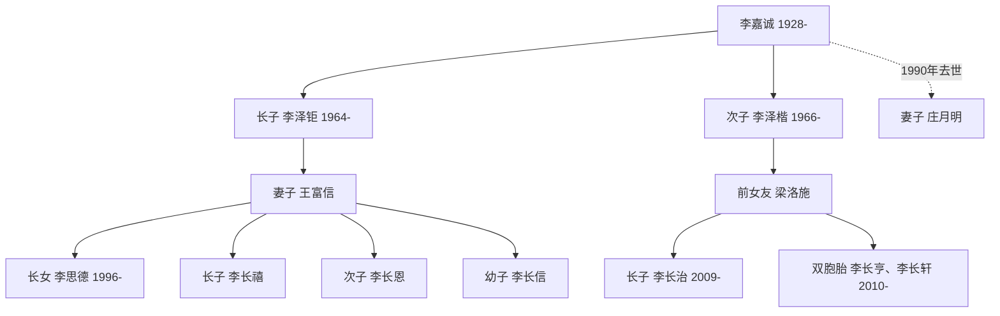
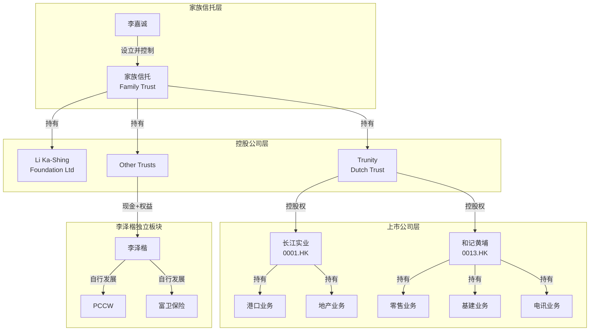
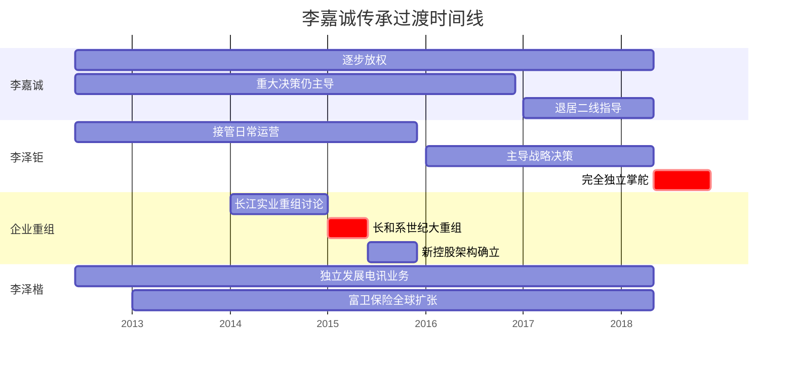

## 案例一：李嘉诚家族——教科书级的传承安排

李嘉诚家族的传承案例被全球财富管理界反复研究，原因不在于其资产规模（尽管确实庞大——巅峰时期李氏商业帝国市值超过万亿港元），而在于其传承安排的系统性、前瞻性和可执行性。从2012年正式宣布分家方案到2018年退休交棒，整个过程平稳有序，没有出现家族争产、兄弟反目、企业动荡等常见的传承翻车场景。

本案例将从背景梳理、方案设计、关键决策、实施过程、效果评估五个维度，完整拆解这个教科书级传承安排的每一个细节。

---

### 一、案例背景：一个商业帝国的形成

#### 1.1 李嘉诚其人

李嘉诚，1928年出生于广东潮州，1940年随家人移居香港。从塑胶花工厂起步，逐步建立起横跨地产、港口、零售、基建、电讯、能源的庞大商业帝国。

| 关键时间节点 | 事件 | 传承意义 |
|-------------|------|---------|
| 1950年 | 创立长江塑胶厂 | 事业起点 |
| 1958年 | 开始投资房地产 | 核心资产形成 |
| 1972年 | 长江实业上市 | 资本化运作开始 |
| 1979年 | 收购和记黄埔 | 国际化布局 |
| 1980年代 | 进入电讯、基建、零售 | 多元化帝国成型 |
| 1999年 | 投资Orange获利千亿 | 战略投资标杆 |
| 2012年 | 公布分家方案 | 传承正式启动 |
| 2018年 | 正式退休 | 交棒完成 |

#### 1.2 家族成员结构

李嘉诚的家庭结构相对简单，这在顶级富豪中是比较少见的：

**关键信息：**

- **长子李泽钜**：性格沉稳，1985年加入家族企业，从基层做起，30余年深耕长和系业务
- **次子李泽楷**：性格独立，很早就明确表示不希望活在父亲的阴影下，偏好科技和媒体领域
- **两个儿子的性格差异**是李嘉诚制定"分家"而非"共治"策略的核心原因

#### 1.3 传承面临的核心挑战

任何一个大型家族企业传承都面临以下挑战，李嘉诚家族也不例外：

**挑战一：业务庞杂，如何划分？**
长江实业、和记黄埔等核心企业涵盖地产、港口、零售、基建、电讯、能源六大板块，总资产超过万亿港元。如何在两个儿子之间公平分配，既不损害企业价值，又不让任何一方觉得不公平？

**挑战二：性格迥异，如何平衡？**
李泽钜是典型的"守成型"接班人，30年扎根企业，熟悉每一块业务；李泽楷是"创业型"人才，偏好科技和媒体，1993年就以9.5亿美元卖掉卫星电视Star TV，展现了独立的商业判断力。把两个完全不同类型的人放在同一个商业体系里共管，几乎必然产生冲突。

**挑战三：控制权如何延续？**
李嘉诚通过复杂的持股结构控制着整个商业帝国。传承不是简单地把股票过户，而是要确保交棒后企业治理结构不会崩塌。

**挑战四：时间窗口的选择**
李嘉诚2012年宣布方案时已经84岁。太早交棒，接班人威望不足；太晚交棒，健康风险增加。选择什么时机启动，本身就是一门学问。

---

### 二、传承方案的核心架构

#### 2.1 总体思路：分而不合，各展所长

李嘉诚的传承方案可以用一句话概括：**"让适合的人做适合的事，用资产划分代替权力争夺。"**

与许多华人家族试图让所有子女共同管理家族企业不同，李嘉诚很早就认识到，强求两个性格迥异的儿子共同管理一个商业帝国，只会埋下冲突的种子。因此他选择了"分家"模式——不是把企业一分为二，而是为每个儿子分配与其能力、兴趣匹配的资产组合。

#### 2.2 资产分配方案

2012年5月25日，李嘉诚在长和系股东大会后正式公布传承方案：

| 分配对象 | 获得资产 | 资产性质 | 预估价值 |
|---------|---------|---------|---------|
| **李泽钜** | 长江实业 + 和记黄埔控股权 | 传统实业帝国（地产、港口、零售、基建、能源） | 约7000亿港元 |
| **李泽楷** | 现金 + 部分资产权益 | 创业资金（用于发展自己的电讯、媒体、科技事业） | 约1000亿港元 |
| **李嘉诚基金会** | 部分资产注入 | 慈善基金，由李嘉诚本人掌控 | 约千亿港元 |

**这个方案的精妙之处在于：**

**第一，不是简单平分。** 李泽钜获得的是整个实业帝国的控制权，价值远超李泽楷获得的现金。这看起来"不公平"，但实际上非常合理——李泽钜30年来一直在管理这些企业，他是唯一有能力接管的人。强行平分只会让两个儿子都无法有效管理。

**第二，给李泽楷的是现金而非企业股权。** 这样做的好处是：李泽楷拿到钱后可以完全自主地发展自己的事业，不受长和系的约束；同时避免了李泽楷在长和系董事会里成为"搅局者"的可能。

**第三，设立了独立的慈善基金。** 李嘉诚基金会（Li Ka Shing Foundation）是一个独立于家族企业的实体，由李嘉诚本人亲自管理。这既体现了李嘉诚的社会责任理念，也为家族资产提供了一个"安全垫"——即使家族企业出现变故，基金会的资产也是独立的。

#### 2.3 家族信托架构

李嘉诚的传承安排不是简单的资产过户，而是通过多层信托架构实现控制权的有序转移：

**信托架构的关键设计：**

**（1）控制权与受益权分离。** 李嘉诚作为信托设立人（Settlor），保留了对信托的重大决策权。即使资产的受益权已经分配给两个儿子，最终的控制权仍在李嘉诚手中，直到他正式退休。

**（2）渐进式转移。** 从2012年公布方案到2018年正式退休，中间有6年的过渡期。在这段时间里，李泽钜逐步接管了各个板块的日常管理权，但重大决策仍需李嘉诚确认。这种渐进式转移大大降低了"交接震荡"的风险。

**（3）防火墙设计。** 通过信托持有上市公司股权，即使家族成员出现债务、离婚、诉讼等风险事件，也不会直接影响到上市公司的控股权。

#### 2.4 李嘉诚基金会的角色

李嘉诚基金会在整个传承架构中扮演着独特的角色：

- **资产规模**：截至2020年，基金会累计捐款超过300亿港元，是亚洲最大的私人慈善基金之一
- **独立运作**：基金会拥有自己的董事会和投资团队，不依附于长和系
- **家族纽带**：基金会的慈善项目（如汕头大学、长江商学院）成为家族成员共同参与的平台，增强了家族凝聚力
- **税务优化**：慈善捐赠可以享受税收减免，基金会的投资收益也有税收优惠
- **声誉资产**：基金会长期积累的社会声誉，成为李氏家族的"软资产"，在商业谈判和政治关系中都有无形价值

---

### 三、关键决策分析

#### 3.1 决策一：为什么选择"分家"而非"共治"？

这是整个传承方案中最关键的战略决策。李嘉诚面临两个选项：

| 维度 | 共治模式 | 分家模式（李嘉诚的选择） |
|------|---------|----------------------|
| 代表案例 | 沃尔顿家族（沃尔玛） | 李嘉诚家族 |
| 适用条件 | 子女能力互补、价值观一致 | 子女能力差异大、志向不同 |
| 优势 | 资产集中、管理效率高 | 避免内耗、各展所长 |
| 风险 | 子女分歧导致决策瘫痪 | 资产分散、协同效应减弱 |
| 华人文化适配度 | 低（"一山不容二虎"） | 高（"分家"是华人传统） |

**李嘉诚选择分家的根本原因：**

1. **对人性的深刻理解。** 他在多次采访中表示，兄弟之间的矛盾往往不是因为经济利益，而是因为权力和话语权。如果让两个儿子共同管理，即使资产平分，谁说了算的问题也会引发无休止的争端。

2. **对儿子的了解。** 李泽楷1990年代就独立创业，展现了强烈的自主意识。把他绑在长和系里，对他是束缚，对企业也是风险。

3. **商业逻辑的考量。** 长和系是一个高度整合的商业帝国，各板块之间有大量关联交易和协同效应。拆分给两个人管，不如让一个人完整接管。

#### 3.2 决策二：如何确定"谁拿企业，谁拿现金"？

这个看似简单的分配，背后有精密的考量：

**选择李泽钜接班的理由：**

- 1985年加入长和系，30年从业经验
- 性格沉稳、执行能力强、熟悉公司治理
- 在长和系内部有广泛的人脉和威望
- 长子身份在华人文化中有天然的继承合法性

**选择李泽楷拿现金的理由：**

- 已有独立创业经历（Star TV、PCCW）
- 性格独立，不喜欢受约束
- 在科技、媒体领域有自己的资源和判断力
- 现金可以给他最大的自由度

**一个鲜为人知的细节：** 李泽楷获得的"现金"并非一次性支付，而是分期获得，并附带了部分资产的选择权。这种安排既保证了李泽楷有足够资金创业，又避免了大额现金一次性流出对长和系现金流的冲击。

#### 3.3 决策三：何时启动传承？

李嘉诚选择在2012年（84岁）公布方案、2018年（90岁）正式退休。这个时间节点的选择非常考究：

**过早的风险：**
- 李泽钜在集团内部的威望尚未完全建立
- 核心管理层（如霍建宁等）可能产生动摇
- 市场对李泽钜独立掌舵的信心不足

**过晚的风险：**
- 李嘉诚的健康状况可能突然恶化（如李兆基家族的教训）
- "太上皇"心态导致交棒不彻底
- 继承人长期等待产生焦虑或离心

**2012年的"刚刚好"：**
- 李泽钜已经在集团工作27年，建立了足够的威望
- 长和系处于稳健增长期，没有重大危机
- 李嘉诚本人精力尚可，可以从容完成过渡
- 全球经济从金融危机中复苏，市场情绪稳定

---

### 四、实施过程详解

#### 4.1 第一阶段：方案公布与市场沟通（2012年）

2012年5月，李嘉诚在长和系股东大会后首次正式公布传承方案。这次公布的方式本身就值得学习：

**沟通策略：**
- 先在股东大会上向投资者说明，体现对股东的尊重
- 随后通过媒体向公众传达，掌控信息发布的主动权
- 李嘉诚亲自出席记者会，回答所有问题，展现诚意和信心
- 两个儿子均在场，传递"兄弟和睦"的信号

**关键表态：**
> "大儿子（李泽钜）会跟我一路，小儿子（李泽楷）会自己走另一条路。我给他的钱，足够他做好多事。"
> ——李嘉诚，2012年5月

这句话看似平淡，实则传递了三层信息：第一，方案已经确定，不会有变；第二，李泽钜是接班人，角色明确；第三，李泽楷的资金充足，不会因为"分少了"而不满。

#### 4.2 第二阶段：渐进式权力转移（2012-2018年）

从方案公布到正式退休，中间6年是关键的过渡期：

**这个阶段的关键动作：**

**（1）2015年世纪大重组。** 长江实业与和记黄埔合并重组为"长和实业"（CK Hutchison Holdings）和"长实集团"（CK Asset Holdings）。这次重组的目的是简化持股结构，为李泽钜接班后的企业治理扫清障碍。重组前的持股结构层级复杂，重组后变得清晰透明。

**（2）核心管理层的稳定。** 霍建宁等跟随李嘉诚数十年的核心高管，在过渡期间获得了丰厚的薪酬和股权激励，确保了管理层的稳定。这是李嘉诚传承方案中经常被忽视的一个关键点——如果核心高管在交接期间流失，李泽钜将面临"空有江山，没有将士"的困境。

**（3）李泽钜的"战功"积累。** 在过渡期间，李泽钜主导了多项重大投资和收购，如收购英国电网公司UK Power Networks、澳洲天然气管道公司APA Group等。这些成功的海外并购，为李泽钜积累了独立的"战功"，让市场相信他有能力独立掌舵。

#### 4.3 第三阶段：正式交棒（2018年）

2018年3月16日，李嘉诚在长和系业绩发布会上宣布，将于5月10日的股东大会后正式退休，由李泽钜接任集团主席。

**退休方式的特点：**
- **彻底退休**：不是"退而不休"，而是完全退出日常管理
- **明确的时间表**：从宣布到正式退休，留出近两个月的时间让市场消化
- **保留象征性角色**：退休后担任集团资深顾问，名义上仍有参与，但不干预决策

---

### 五、传承效果评估

#### 5.1 短期效果（2018-2020年）

| 评估维度 | 表现 | 说明 |
|---------|------|------|
| 股价稳定 | ⭐⭐⭐⭐ | 退休后股价小幅波动但未大跌 |
| 管理层稳定 | ⭐⭐⭐⭐⭐ | 核心高管无一人离开 |
| 业务连续性 | ⭐⭐⭐⭐⭐ | 各板块运营正常 |
| 兄弟关系 | ⭐⭐⭐⭐ | 未出现公开矛盾 |
| 市场信心 | ⭐⭐⭐⭐ | 分析师普遍给予正面评价 |

#### 5.2 中期效果（2020-2025年）

**李泽钜掌舵下的长和系：**

- 应对了COVID-19疫情的冲击，零售和港口业务受影响但整体可控
- 继续推进"去地产化"战略，加大对基建和科技的投入
- 在欧洲市场的投资（如UK Power Networks）持续贡献稳定现金流
- 整体风格延续了李嘉诚时代的稳健，没有激进冒险

**李泽楷的独立发展：**

- PCCW继续深耕电讯和媒体业务
- 富卫保险（FWD Group）成为亚洲增长最快的保险公司之一
- 2021年富卫保险尝试IPO（后因市场环境推迟）
- 在科技投资领域有多项布局

#### 5.3 与其他传承案例的对比

| 对比维度 | 李嘉诚家族 | 霍英东家族 | 龚如心家族 |
|---------|-----------|-----------|-----------|
| 传承模式 | 主动分家 | 遗嘱安排 | 争产诉讼 |
| 公开程度 | 高（提前公布） | 中（身后曝光） | 低（法庭公开） |
| 家族和谐 | ⭐⭐⭐⭐ | ⭐⭐⭐ | ⭐ |
| 企业影响 | 正面 | 中性 | 负面 |
| 社会评价 | 教科书级 | 争议不断 | 警示案例 |
| 关键差异 | 生前规划 | 身后安排 | 缺乏规划 |

---

### 六、李嘉诚传承方案的核心启示

#### 6.1 原则一：传承规划要趁早

李嘉诚从1990年代就开始思考传承问题，2012年正式公布方案，2018年完成交棒。整个过程历时近30年。很多家族企业主直到健康出现问题才开始考虑传承，往往为时已晚。

**建议时间表：**

| 年龄段 | 应完成的事项 |
|--------|------------|
| 50-55岁 | 初步确定接班人选，启动培养计划 |
| 55-60岁 | 建立家族信托架构，完成资产梳理 |
| 60-65岁 | 公布传承方案，启动渐进式交接 |
| 65-70岁 | 完成交棒，退居二线 |
| 70岁+ | 彻底退休，享受生活 |

#### 6.2 原则二：因人而异，不搞一刀切

李嘉诚没有机械地把资产平分给两个儿子，而是根据每个人的能力、兴趣、志向，量身定制分配方案。这种"个性化传承"比"平均主义传承"更科学。

**操作要点：**
- 深入了解每个继承人的优势和劣势
- 让继承人参与到方案设计中来（而非被动接受）
- 给不愿意接班的家族成员提供退出通道
- 避免用"孝道"绑架不愿意接班的子女

#### 6.3 原则三：用制度代替信任

李嘉诚的传承方案不是建立在"我相信大儿子会照顾好弟弟"这种脆弱的信任基础上，而是通过信托、基金、法律文件等制度安排，把各方的权利义务白纸黑字写清楚。

**制度化传承的要素：**
- 家族信托的条款明确各方受益权
- 基金会的章程规定了决策机制
- 公司治理结构确保了管理层的稳定
- 遗嘱中对特殊情况（如继承人早逝、离婚）做了预案

#### 6.4 原则四：主动掌控信息传播

李嘉诚选择在股东大会后主动公布方案，而不是等媒体挖掘。这种"先发制人"的沟通策略，让他掌握了舆论的主动权，避免了猜测和谣言对企业和家族的负面影响。

**沟通要点：**
- 对投资者：在正式场合（股东大会）公布，体现专业和尊重
- 对媒体：主动提供信息，统一口径，避免碎片化报道
- 对公众：展现家族和谐的形象，增强社会信任
- 对员工：内部沟通先于外部，避免员工从媒体获知消息

#### 6.5 原则五：留有余地，不要做绝

李嘉诚的传承方案不是"签完字就结束"，而是留有足够的灵活空间。比如：
- 李泽楷获得的资产有选择权，可以根据市场环境调整
- 基金会的资产可以作为家族的"应急储备"
- 李嘉诚退休后仍担任顾问，可以在必要时提供指导

---

### 七、对普通家庭的启示

你可能觉得李嘉诚的案例离普通人太远——毕竟他管理的是万亿港元的商业帝国，而大多数家庭的资产可能只是几百万甚至几十万。但传承的核心原则是相通的：

#### 7.1 可直接借鉴的做法

| 李嘉诚的做法 | 普通家庭的对应版本 |
|------------|------------------|
| 生前规划传承 | 50岁前完成遗嘱和基本安排 |
| 根据子女能力分配 | 不要机械平分，考虑实际情况 |
| 使用家族信托 | 考虑保险金信托（门槛较低） |
| 设立慈善基金 | 参与社区慈善，培养家族价值观 |
| 主动与家人沟通 | 定期召开家庭会议讨论财产问题 |
| 渐进式交棒 | 逐步让子女参与财务决策 |

#### 7.2 需要注意的差异

**资产类型不同：** 李嘉诚的资产主要是上市公司股权和不动产，流动性强、估值清晰。普通家庭可能还有社保、公积金、个人收藏品等"隐性资产"，需要提前梳理。

**专业团队不同：** 李嘉诚有律师、会计师、信托经理组成的团队。普通家庭至少需要一个靠谱的律师和一个了解遗产税的会计师。

**文化背景不同：** 李嘉诚的方案考虑了华人文化中的长幼有序、面子文化等因素。普通家庭在制定传承方案时，也要考虑家庭文化、地域习俗的影响。

---

### 八、争议与未解问题

任何传承方案都不可能完美，李嘉诚的方案也有一些争议和待观察的问题：

#### 8.1 "偏心"的质疑

有人认为，李泽钜获得7000亿港元的资产，而李泽楷只获得约1000亿港元，这是严重的"偏心"。但支持者认为，李泽钜30年为企业付出的劳动和积累的价值，不能简单用金额衡量。

#### 8.2 慈善基金的独立性

李嘉诚基金会的资产虽然名义上独立于家族企业，但实际上仍由李嘉诚本人控制。如果李嘉诚去世后，基金会的管理权如何安排？这是否会成为下一个争议焦点？

#### 8.3 第三代的传承

李泽钜的子女（四个孩子）目前尚未进入家族企业。当第三代需要接班时，是继续由长房独占，还是在更广泛的家族成员中选拔？这是10-20年后需要面对的问题。

#### 8.4 "李超人"光环的消失

李嘉诚退休后，长和系失去了"李超人"这个巨大的品牌光环。在李泽钜的领导下，企业的市场号召力和政府关系能否维持？这需要时间检验。

---

### 九、延伸阅读

想要深入了解李嘉诚传承案例的读者，可以关注以下维度：

**文献资料：**
- 《李嘉诚传》（李咏诗著）——家族内部视角
- 《亚洲教父》（乔·斯塔威尔著）——第三方分析视角
- 长和系历年年报——了解企业经营数据
- 香港公司注册处的股权变更记录——追踪持股结构变化

**对比案例：**
- 洛克菲勒家族（见本章案例二）——西方家族传承的标杆
- 霍英东家族——华人富豪遗嘱安排的教训
- 王永庆家族——台塑集团的传承模式
- 沃尔顿家族——家族企业通过基金会传承的典范

**关键概念：**
- 家族信托的设立与运作（见本章核心技巧部分）
- 控股公司架构的设计
- 家族宪章的制定
- 家族办公室的功能与运作
