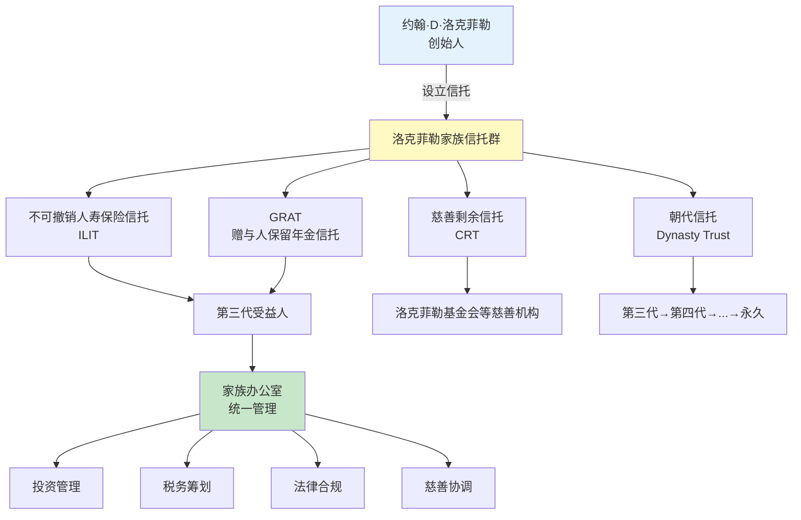

## 案例二：洛克菲勒家族——七代传承的百年传奇

### 一、案例背景

洛克菲勒家族（Rockefeller Family）是美国乃至全球最著名的财富家族之一。从1870年约翰·D·洛克菲勒（John D. Rockefeller, 1839-1937）创立标准石油公司（Standard Oil）算起，这个家族的财富传承已跨越近160年、七代人，至今仍是全球最富有的家族之一。据福布斯估算，洛克菲勒家族总资产在鼎盛时期曾占美国GDP的1.5%以上；经过七代分散后，家族整体财富仍维持在百亿美元量级。

这个案例的价值在于：它不是某一次传承安排的"妙手"，而是一整套**跨越百年的制度化传承体系**。洛克菲勒家族用实践证明了"富不过三代"并非铁律——前提是建立正确的传承机制。

#### 为什么研究洛克菲勒家族？

| 维度 | 洛克菲勒家族的做法 | 普通家庭的常见做法 |
|------|-------------------|-------------------|
| 财富创造 | 第一代建立石油帝国 | 积累房产、存款 |
| 传承规划 | 创始人在壮年期就开始规划 | 通常在晚年或生病后才考虑 |
| 工具选择 | 家族信托+家族办公室+基金会 | 仅靠遗嘱或口头安排 |
| 代际培养 | 系统性的接班人教育体系 | 放任自流或过度溺爱 |
| 家族治理 | 家族宪法+定期家族会议 | 无制度，全靠个人威望 |
| 慈善与声誉 | 慈善作为家族核心价值观 | 偶尔捐款，无系统规划 |
| 传承结果 | 七代传承，家族延续160年 | "富不过三代" |

***

### 二、传承历程：从一代到七代

#### 2.1 第一代：约翰·D·洛克菲勒（1839-1937）——财富创造与传承意识觉醒

约翰·D·洛克菲勒在23岁时（1862年）开始投资炼油业，31岁（1870年）创立标准石油公司。到1880年代，标准石油控制了美国90%以上的炼油能力，洛克菲勒成为人类历史上第一个亿万富翁（按通胀调整后的购买力计算）。

**关键传承决策一：早期系统性财富转移**

洛克菲勒并非等到晚年才开始传承规划。从19世纪80年代起，他就开始系统性地将财富转移给独子小约翰·D·洛克菲勒（John D. Rockefeller Jr.）。具体方式包括：

- **设立多个信托**：从1882年起，洛克菲勒陆续设立了多个不可撤销信托，将标准石油的股权和其他资产装入信托。这些信托的受益人包括儿子、妻子和慈善机构。
- **使用持股公司架构**：通过洛克菲勒家族控股公司（Rockefeller Family & Associates），将家族的商业资产集中管理。
- **慈善作为传承工具**：1913年设立洛克菲勒基金会（Rockefeller Foundation），初始捐赠1亿美元（相当于今天的约30亿美元）。这不仅是慈善行为，更是为家族建立了永久的社会声誉和影响力。

**关键传承决策二：聘请专业顾问**

洛克菲勒很早就认识到自己不可能在所有领域都是专家。他聘请了当时最优秀的律师、会计师和投资顾问，其中包括：

- **弗雷德里克·盖茨**（Frederick T. Gates）：牧师出身，后来成为洛克菲勒的首席投资顾问和慈善顾问。盖茨帮助洛克菲勒系统性地管理慈善事业，并建立了"科学慈善"的理念。
- **斯塔尔·墨菲**（Starr J. Murphy）：律师，负责洛克菲勒家族的法律事务和信托架构设计。

**关键传承决策三：以身作则培养继承人**

洛克菲勒对儿子的教育极其严格。小约翰从少年时期就开始记账——每一笔收入和支出都要记录在账本上。洛克菲勒要求儿子：

- 每周零花钱1.5美元，需要详细记录花销
- 做家务赚取额外收入
- 捐出收入的10%用于慈善
- 18岁起参与家族事务管理

这些做法建立了洛克菲勒家族代代相传的财务纪律传统。

#### 2.2 第二代：小约翰·D·洛克菲勒（1874-1960）——制度化传承的关键推手

小约翰是洛克菲勒家族传承的核心人物。如果说第一代创造了财富，那么第二代则建立了**让财富延续的制度**。

**核心贡献一：家族办公室的建立**

1882年，洛克菲勒家族开始建立家族办公室（Rockefeller Family Office）。最初它只是为管理洛克菲勒个人投资而设立的小型团队，但在小约翰的推动下，逐渐发展成为一个专业的、制度化的家族财富管理机构。到20世纪初，家族办公室已经具备以下功能：

- **投资管理**：负责家族资产的全球配置
- **税务筹划**：聘请专业税务顾问进行合法的税务优化
- **法律事务**：管理家族的信托、遗嘱和法律纠纷
- **慈善管理**：协调家族的多个基金会和慈善项目
- **家族治理**：组织家族会议，维护家族宪法

小约翰将家族办公室从一个"私人秘书处"升级为**专业化的家族企业**，这是洛克菲勒家族能够传承七代的关键制度基础。

**核心贡献二：家族信托架构的完善**

小约翰在1934年和1952年分别设立了两批重要的家族信托。这些信托的设计堪称教科书级别：

| 信托要素 | 具体设计 | 传承效果 |
|---------|---------|---------|
| 受托人选择 | 选择大通曼哈顿银行（Chase Manhattan Bank）作为受托人，而非个人 | 避免个人受托人可能的利益冲突和道德风险 |
| 分配条款 | 设置"收入+本金"的分层分配机制：受益人可获得收入，本金在特定条件下才能动用 | 防止后代挥霍本金，保障长期传承 |
| 反挥霍条款 | 信托资产不得被受益人的债权人追索 | 保护信托资产不受受益人个人债务影响 |
| 孙辈条款 | 信托条款涵盖孙辈和曾孙辈 | 确保跨代传承的连续性 |
| 慈善要求 | 要求受益人参与慈善事业 | 传承家族价值观 |

**核心贡献三：家族精神遗产的制度化**

小约翰最为人称道的贡献之一，是在纽约曼哈顿建造了洛克菲勒中心（Rockefeller Center）。这个项目不仅是一项投资，更是家族精神遗产的物化象征——它代表了洛克菲勒家族对"回馈社会"的承诺。小约翰曾说："我相信每一项权利都伴随着责任，每一次机会都伴随着义务，每一份财富都伴随着信托责任。"

#### 2.3 第三代：五兄弟的分工与协作（20世纪中叶）

第三代由小约翰的五个儿子组成，他们各自在不同领域建立了家族的影响力：

| 姓名 | 生卒年 | 领域 | 主要贡献 |
|------|--------|------|---------|
| **约翰·D·洛克菲勒三世** | 1906-1978 | 慈善与教育 | 创立洛克菲勒兄弟基金会，推动亚洲文化研究 |
| **纳尔逊·洛克菲勒** | 1908-1979 | 政治 | 四任纽约州州长，美国副总统（1974-1977） |
| **劳伦斯·洛克菲勒** | 1910-2004 | 风险投资与环保 | 被称为"风险投资之父"之一，投资了超过100家科技公司 |
| **温思罗普·洛克菲勒** | 1912-1973 | 公共服务 | 阿肯色州州长，推动南方社会发展 |
| **大卫·洛克菲勒** | 1915-2017 | 银行与国际关系 | 大通曼哈顿银行董事长，推动中美关系正常化 |

第三代的传承策略体现了一个重要原则：**分散化发展**。五个儿子没有争夺同一块蛋糕，而是各自在不同领域开疆拓土。这得益于：

1. **家族办公室的协调作用**：家族办公室确保了各分支的资产管理是统一的，尽管各自的工作领域不同
2. **家族信托的分配机制**：信托的分配条款确保了每个儿子都能获得公平的资源支持
3. **家族会议制度**：定期的家族会议（每年至少一次）让五兄弟保持沟通和协作

**家族会议制度详解**

洛克菲勒家族从第三代开始建立了正式的家族会议制度：

- **频率**：每年至少召开一次全体家族会议
- **参会人员**：成年家族成员及其配偶
- **议程**：包括家族财务报告、信托管理情况、慈善项目进展、家族价值观教育等
- **决策机制**：重大决策需要多数票通过
- **记录制度**：所有会议都有详细记录，存入家族档案

#### 2.4 第四代至第七代：制度化传承的延续

从第四代开始，洛克菲勒家族的传承进入了"制度驱动"阶段。家族成员不再需要像前几代那样承担巨大的商业压力，而是可以在各自感兴趣的领域发展，同时通过家族制度保持凝聚力。

**第四代**（约20人）：继续在慈善、商业、政治等领域活跃。代表性人物包括杰伊·洛克菲勒（Jay Rockefeller），曾任西弗吉尼亚州参议员24年。

**第五代至第七代**：家族成员超过200人，绝大多数从事商业、慈善、学术、艺术等领域。虽然单个成员的财富规模已远不及第一代，但家族整体的财富和社会影响力通过制度化机制得以维持。

***

### 三、传承工具体系深度解析

#### 3.1 家族信托：洛克菲勒传承的核心骨架

洛克菲勒家族的信托架构是多层嵌套的复杂体系，但其核心逻辑可以用以下模型理解：

**洛克菲勒家族信托的关键设计特征：**

**特征一：多层信托嵌套**

洛克菲勒家族没有只设立一个大信托，而是根据不同的资产类型和传承目的，设立了多个信托。这种"多层嵌套"的好处是：
- 不同信托可以有不同的受托人，分散管理风险
- 不同信托可以有不同的分配条款，满足不同受益人的需求
- 单个信托出问题不会影响整个家族的传承安排

**特征二：朝代信托（Dynasty Trust）**

洛克菲勒家族使用了朝代信托——一种在美国部分州（如南达科他州、特拉华州）可以设立的、理论上可以永续存在的信托。这种信托的关键特点：
- 在信托存续期间，资产不计入任何一代受益人的遗产，从而避免遗产税
- 信托可以持续数代甚至永久存在
- 通过精心设计的分配条款，确保每一代受益人都能获得合理的利益

**特征三：受托人制度**

洛克菲勒家族选择机构受托人（如大通曼哈顿银行）而非个人受托人，原因包括：
- 机构寿命长于个人，确保存续期间的连续性
- 机构受托人受监管，降低了道德风险
- 机构可以提供专业的投资和法律服务

#### 3.2 家族办公室：超越财富管理

洛克菲勒家族办公室（Rockefeller Family Office）是全球家族办公室行业的"鼻祖"。它在1882年成立时，还只是一个管理洛克菲勒个人财务的"私人秘书处"；到20世纪初，已经发展成为功能完备的家族服务机构。

**家族办公室的四大核心功能：**

| 功能 | 具体内容 | 对传承的作用 |
|------|---------|-------------|
| **投资管理** | 资产配置、基金管理、另类投资 | 确保家族资产保值增值 |
| **税务筹划** | 跨州/跨国税务优化、信托税务规划 | 最大化传承财富 |
| **家族治理** | 组织家族会议、维护家族宪法、教育下一代 | 维持家族凝聚力和价值观 |
| **慈善管理** | 协调多个基金会、评估慈善项目 | 提升家族声誉和社会影响力 |

**洛克菲勒家族办公室的演变历程：**

- **1882年**：洛克菲勒设立私人秘书团队管理投资
- **1900年代**：扩展为包含法律、税务、投资的专业团队
- **1930年代**：正式命名为"Rockefeller Family & Associates"
- **1970年代**：第五大道630号成为家族办公室的标志性办公地点
- **1980年代**：洛克菲勒公司（Rockefeller & Co.）成立，开始为外部客户提供家族办公室服务
- **2018年**：洛克菲勒资本管理（Rockefeller Capital Management）成立，管理资产超过1000亿美元

#### 3.3 慈善基金会：声誉与影响力的永续传承

洛克菲勒家族建立了多个慈善基金会，形成了一个"基金会矩阵"：

| 基金会 | 成立时间 | 主要领域 | 总捐赠规模 |
|--------|---------|---------|-----------|
| 洛克菲勒基金会 | 1913年 | 公共卫生、教育、农业 | 超过200亿美元（累计） |
| 洛克菲勒兄弟基金会 | 1940年 | 社会正义、可持续发展 | 约20亿美元 |
| 大卫·洛克菲勒基金会 | 2005年 | 经济发展、艺术 | 约2亿美元 |
| 洛克菲勒慈善顾问 | 1991年 | 为家族成员提供慈善咨询 | 服务超过30个家族分支 |

慈善基金会在传承中的作用远不止"做好事"：

1. **税务优势**：捐赠可获得所得税抵扣，基金会资产免征遗产税
2. **家族凝聚力**：共同的慈善事业让分散的家族成员保持联系
3. **接班人培养**：基金会项目为年轻一代提供了管理真实组织的实践机会
4. **声誉资本**：慈善为家族积累了巨大的社会声誉，这种声誉本身就是一种"无形资产"

#### 3.4 家族宪法：治理制度的基石

洛克菲勒家族宪法（Family Constitution）是家族治理的最高文件。虽然具体内容从未公开，但从家族成员的公开言论和行为中可以推断出其核心框架：

**家族宪法的核心要素：**

- **家族使命宣言**：明确家族的核心价值观和长期目标
- **成员权利与义务**：规定家族成员的权利（如参与家族会议、获得信托分配）和义务（如维护家族声誉、参与慈善）
- **企业管理原则**：家族办公室和基金会的治理结构
- **冲突解决机制**：当家族成员之间产生分歧时的处理程序
- **新人准入规则**：配偶和其他新成员加入家族事务的规则
- **信息共享规则**：家族财务信息的透明度和保密要求

***

### 四、关键传承策略提炼

#### 4.1 策略一：早规划、长周期

洛克菲勒在53岁（1892年）时就开始系统性地转移资产给儿子。他在78岁（1917年）时已将大部分资产转移到信托和基金会中。这种"早规划"确保了：
- 在创始人头脑清醒、判断力最强时做出决策
- 有足够的时间观察和调整传承安排
- 避免在紧急情况下仓促决策

**对比现实**：中国高净值人群中，超过60%的人在60岁以后才开始认真考虑传承问题。洛克菲勒的做法提醒我们：传承规划的最佳时机是当你还有几十年的时间来观察它是否有效。

#### 4.2 策略二：制度化而非个人化

洛克菲勒家族传承的核心不是"谁来继承"，而是"通过什么制度来传承"。家族信托、家族办公室、家族宪法这些制度的存在，使得财富传承不依赖于某一个人的能力和意愿。

**制度化的好处：**
- 即使某一代继承人能力平庸，制度也能保障基本的资产安全
- 制度可以随时间调整和优化，但不会因为个人情绪而剧烈变动
- 制度为家族成员提供了共同的行为准则，减少内部冲突

#### 4.3 策略三：价值观传承与财富传承并重

洛克菲勒家族传承的不仅是财富，更是价值观。核心价值观包括：

1. **勤俭节约**：即使拥有巨额财富，家族成员仍然强调节俭。约翰·D·洛克菲勒一生保持记账习惯，要求子女也要如此。
2. **回馈社会**：慈善不是可选项，而是家族成员的义务。
3. **独立自主**：鼓励年轻一代建立自己的事业，而非依赖家族财富。
4. **长期主义**：家族决策以十年甚至百年为时间尺度，而非短期利益。

**价值观传承的制度保障：**
- 信托分配条款中包含慈善要求
- 家族会议中定期进行价值观教育
- 年轻一代必须完成特定的社会服务或实习才能参与家族事务

#### 4.4 策略四：分散化与控制权平衡

洛克菲勒家族在资产配置上采取了高度分散化的策略：

- **行业分散**：从石油扩展到银行、房地产、风险投资、科技等
- **地域分散**：资产分布在美国、欧洲、亚洲等多个地区
- **工具分散**：使用信托、基金会、持股公司、保险等多种工具

但在控制权上，家族通过家族办公室和家族宪法保持了统一的决策机制。这种"分散配置+集中治理"的模式，是洛克菲勒家族能够应对不同经济周期和政治环境的关键。

#### 4.5 策略五：拥抱专业管理

从第一代聘请弗雷德里克·盖茨开始，洛克菲勒家族就坚信"专业的事交给专业的人做"。家族办公室的投资团队、法律团队、税务团队都是外部聘请的专业人士。家族成员负责制定战略方向和价值观，但不直接干预具体的资产管理。

这与中国许多家族企业形成鲜明对比——后者往往由家族成员兼任投资决策者，导致决策质量不稳定。

***

### 五、成果数据

#### 5.1 财富传承效果

| 代际 | 时间跨度 | 财富规模（估算） | 传承特点 |
|------|---------|-----------------|---------|
| 第一代 | 1870-1937 | 约14亿美元（当时美国GDP的1.5%） | 财富创造 |
| 第二代 | 1900-1960 | 维持并小幅增长 | 制度化建设 |
| 第三代 | 1930-2010 | 分散后各分支仍达数十亿 | 分散化发展 |
| 第四代 | 1960-至今 | 各分支数亿至数十亿不等 | 制度驱动 |
| 第五至七代 | 1990-至今 | 家族整体仍超百亿美元 | 慈善与影响力 |

#### 5.2 社会影响力

- 洛克菲勒基金会累计捐赠超过200亿美元
- 资助了包括青霉素研发、绿色革命在内的重大科学突破
- 建造了洛克菲勒中心、联合国总部等地标建筑
- 培养了多位州长、参议员、副总统等政治人物
- 全球超过200所大学和研究机构受益于洛克菲勒家族的捐赠

***

### 六、经验总结与对普通家庭的启示

洛克菲勒家族的故事看起来离普通人很远，但其传承逻辑完全可以被不同财富规模的家庭借鉴。以下是核心经验及对应的可操作建议：

#### 6.1 核心经验

| 洛克菲勒的做法 | 核心逻辑 | 普通家庭的可操作版本 |
|---------------|---------|-------------------|
| 壮年期就设立信托 | 早规划 | 至少在40岁前立好遗嘱，50岁前考虑保险金信托 |
| 聘请专业顾问 | 专业的事交给专业的人 | 找靠谱的律师和理财师做传承规划，不要自己拍脑袋 |
| 建立家族宪法 | 制度化治理 | 即使只有一个小家庭，也写一份"家庭财务约定" |
| 慈善作为核心价值观 | 价值观传承 | 定期带孩子参与公益活动，建立家庭捐赠习惯 |
| 多层信托+分散投资 | 风险分散 | 遗嘱+保险+基金定投，不把鸡蛋放在一个篮子里 |
| 家族会议制度 | 沟通机制 | 每年至少一次家庭财务会议，讨论家庭财务状况和计划 |

#### 6.2 普通家庭可直接使用的五步行动清单

**第一步（本月内完成）**：
- 与配偶讨论：如果我们中有一人突然不在了，家庭财务会面临什么问题？
- 梳理家庭全部资产清单（房产、存款、保险、投资、债务）

**第二步（3个月内完成）**：
- 咨询律师，根据家庭情况立一份合法有效的遗嘱
- 检查所有人寿保险的受益人是否正确指定

**第三步（1年内完成）**：
- 评估是否需要设立保险金信托（保额100万以上建议考虑）
- 开始与子女进行定期的财务教育对话

**第四步（持续进行）**：
- 每年审查一次遗嘱和保险受益人
- 每年召开一次家庭财务会议

**第五步（条件成熟时）**：
- 当家庭资产达到一定规模，考虑设立正式的家族信托
- 建立家庭慈善计划（如定期向特定公益组织捐赠）

***

### 七、案例局限性与适用边界

在借鉴洛克菲勒家族经验时，需要注意以下局限：

**不能直接照搬的部分：**

1. **美国法律环境差异**：洛克菲勒家族的信托架构基于美国法律，中国的信托法、税法和继承法有本质区别。例如，美国的朝代信托在中国没有直接对应物。
2. **财富规模差异**：洛克菲勒家族的传承策略需要巨额财富支撑。对于资产在几百万到几千万的家庭，某些工具（如家族办公室、家族基金会）的门槛过高。
3. **文化差异**：美国文化强调个人独立，中国文化强调家庭团结。在代际传承中，需要平衡这两种价值观。

**可以借鉴的核心原则：**

1. **早规划**：无论财富多少，传承规划都应该尽早开始
2. **制度化**：把传承安排写成法律文件，不要只靠口头承诺
3. **专业化**：寻求专业顾问的帮助，不要闭门造车
4. **价值观传承**：财富传承必须伴随价值观传承，否则财富将无法持久
5. **定期审视**：传承方案不是一劳永逸的，需要定期更新

***

### 八、延伸阅读与关联知识

#### 8.1 本章关联内容

- **理论基础第三节**：家族信托的理论基础——深入了解信托的法律结构和运作原理
- **理论基础第四节**：代际传承的理论框架——理解"富不过三代"背后的学术解释
- **理论基础第六节**：家族企业传承的特殊考量——洛克菲勒家族从石油到金融的转型经验
- **核心技巧第二节**：遗嘱规划实操指南——学习如何撰写合法有效的遗嘱
- **核心技巧第三节**：家族信托搭建实操——了解中国境内的信托设立流程
- **案例三**：某制造企业主失败的传承教训——反面案例，对比理解传承失败的原因

#### 8.2 推荐阅读

- 《洛克菲勒家族》（The Rockefellers）——Peter Collier & David Horowitz 著，家族传记权威著作
- 《洛克菲勒回忆录》（Memoirs）——大卫·洛克菲勒 著，第三代核心人物的第一手叙述
- 《财富的责任》（The Gospel of Wealth）——安德鲁·卡内基 著，理解美国富豪阶层的慈善哲学
- 《家族企业治理》（Family Business Governance）——了解家族治理的系统框架

#### 8.3 关键术语对照表

| 中文术语 | 英文术语 | 含义 |
|---------|---------|------|
| 朝代信托 | Dynasty Trust | 可持续数代的超长期信托 |
| 不可撤销人寿保险信托 | Irrevocable Life Insurance Trust (ILIT) | 隔离保险金免征遗产税的信托 |
| 赠与人保留年金信托 | Grantor Retained Annuity Trust (GRAT) | 以较低税负向后代转移增值资产的信托 |
| 慈善剩余信托 | Charitable Remainder Trust (CRT) | 向慈善机构转移资产同时保留收入的信托 |
| 家族办公室 | Family Office | 为超高净值家族提供全方位管理服务的机构 |
| 家族宪法 | Family Constitution | 规定家族治理规则的最高文件 |
| 受托人 | Trustee | 管理信托资产的人或机构 |
| 受益人 | Beneficiary | 享受信托利益的人 |
| 委托人 | Settlor / Grantor | 设立信托的人 |

