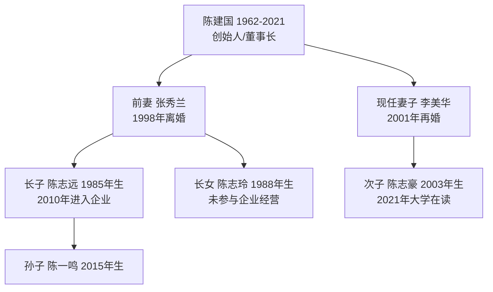
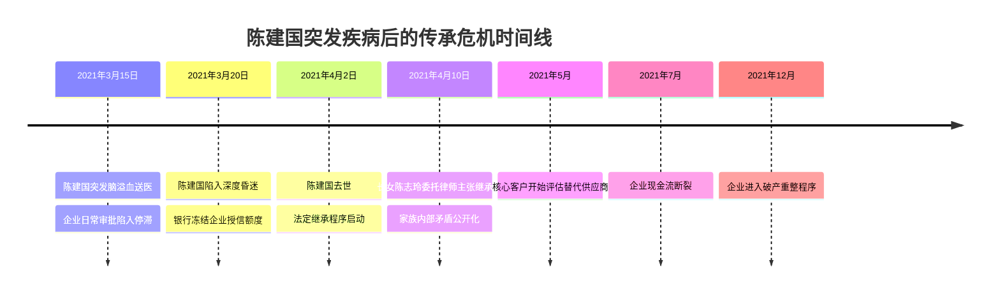
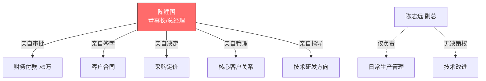
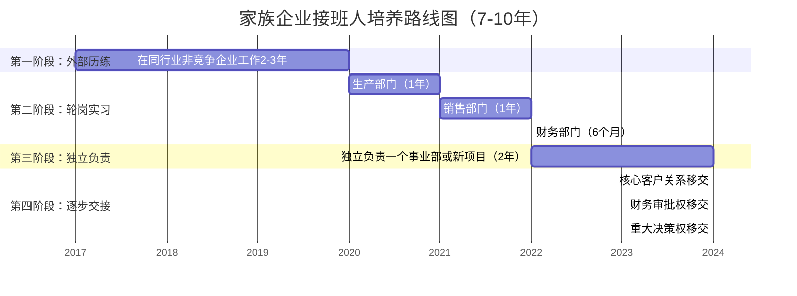
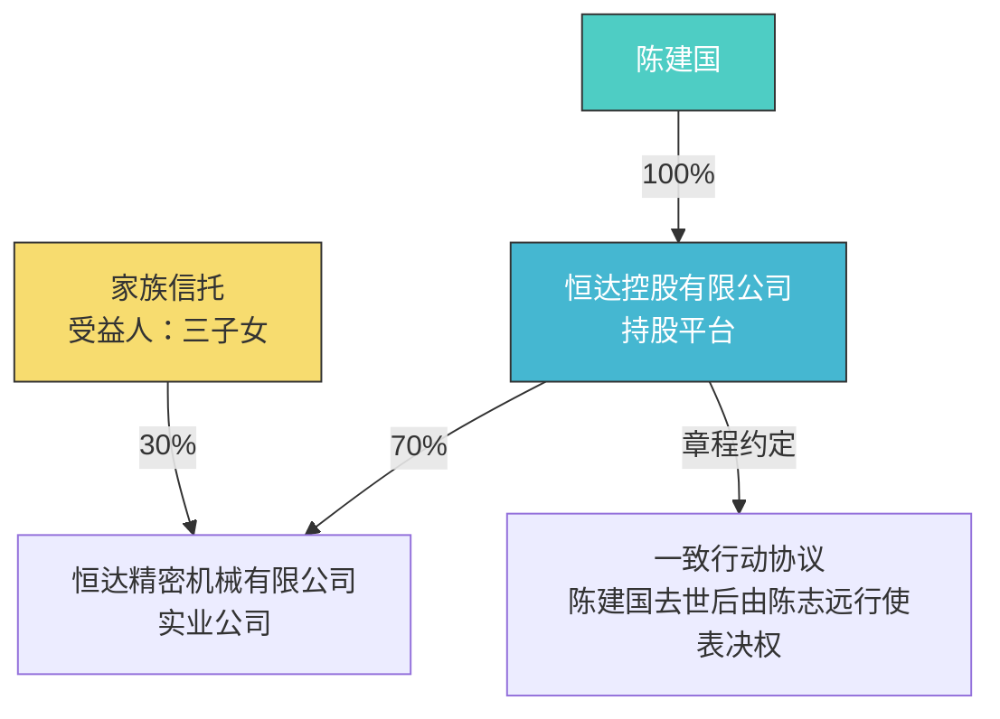

## 案例三：某制造企业主——失败的传承教训

> 成功的传承各有章法，失败的传承却惊人相似——拖延、独断、无预案。本案例完整还原一位年营收过亿的制造企业主，因传承规划缺失导致企业分崩离析的全过程，从中提炼出中小企业主最常踩的七个深坑。

### 一、案例背景

#### 1.1 企业画像

陈建国（化名），浙江温州人，1962年出生，1993年创办"恒达精密机械有限公司"，主营汽车零部件精密加工。经过近三十年发展，企业具备以下规模：

| 维度 | 数据 |
|------|------|
| 年营收 | 1.8亿元（2019年峰值） |
| 员工人数 | 320人 |
| 厂房面积 | 12,000平方米（自有土地+厂房） |
| 核心客户 | 国内两家主机厂一级供应商资质 |
| 专利技术 | 17项实用新型专利，3项发明专利 |
| 净资产 | 约8,500万元（含土地增值） |

企业属于典型的"隐形冠军"——在细分领域有技术壁垒，但高度依赖创始人个人关系网络和管理能力。

#### 1.2 家庭结构

**关键人物关系：**

- **长子陈志远**：大学毕业后进入家族企业，从车间做起，2015年起担任副总经理，主管生产和技术。性格内敛，技术能力强，但缺乏客户拓展能力和管理魄力。
- **长女陈志玲**：嫁到杭州，丈夫从事外贸，对家族企业无参与但有强烈的财产意识。
- **现任妻子李美华**：全职太太，名下无独立资产，但实际控制着陈建国的个人银行卡和多处房产。
- **次子陈志豪**：2021年时18岁，在上海读大学，对企业经营无概念。

#### 1.3 资产全景

| 资产类别 | 具体内容 | 估值（万元） | 权属状态 |
|----------|----------|-------------|----------|
| 企业股权 | 恒达精密100%股权 | 5,200 | 陈建国个人持有 |
| 工业用地+厂房 | 温州经济技术开发区 | 2,800 | 企业名下 |
| 住宅房产 | 温州市区3套 | 1,200 | 陈建国个人名下2套，李美华名下1套 |
| 金融资产 | 银行理财+股票 | 680 | 分散在多个账户 |
| 车辆 | 3辆 | 85 | 个人名下 |
| 应收账款 | 客户欠款 | 约1,500 | 企业名下 |
| **合计** | | **约11,465** | |

### 二、传承规划的致命缺失

#### 2.1 "我还年轻，不急"——拖延症

陈建国在55岁时（2017年），其律师和会计师均建议启动传承规划。他的反应具有极强的代表性：

> "我身体好得很，至少还能干十年。现在谈这些不吉利。等志远再历练几年，我自然会安排。"

这种心态在中小企业主中极为普遍。根据中国民营企业联合会2020年的调查数据：

- 65%的家族企业主未立遗嘱
- 78%的企业主未做系统性传承规划
- 82%的企业主认为"传承是退休后才需要考虑的事"

#### 2.2 "我的就是我的"——权属混乱

陈建国长期将企业资产与个人资产混同使用：

- 企业利润直接转入个人账户用于家庭消费
- 个人房产的装修款从企业支出
- 用企业资金为现任妻子购买理财
- 前妻离婚时的财产分割协议模糊，仅约定"陈建国支付张秀兰补偿款200万元"，未明确企业股权归属

这种混同在税务层面造成潜在风险（公私不分可能被认定为偷逃税），在继承层面则会导致权属争议。

#### 2.3 "到时候自然会分"——无遗嘱、无协议

截至2021年陈建国突发脑溢血去世，以下关键文件**全部缺失**：

| 应有文件 | 实际状态 | 后果 |
|----------|----------|------|
| 遗嘱 | 未立 | 遗产按法定继承分配 |
| 股权继承协议 | 无 | 股权成为争议焦点 |
| 家族宪章 | 无 | 无决策规则可依循 |
| 企业章程修正案 | 未修改 | 原章程无继承条款 |
| 前妻子女财产确认书 | 无 | 长子长女与继母对立 |
| 保险安排 | 仅一份50万意外险 | 流动性严重不足 |
| 企业应急接班计划 | 无 | 企业群龙无首 |

### 三、危机爆发：从突发到崩塌的时间线

#### 3.1 第一阶段：突发变故（2021年3月-4月）

**第一周的关键失误：**

3月15日陈建国突发脑溢血后，企业出现的第一个问题是**审批瘫痪**。由于陈建国长期实行"一支笔"管理——所有超过5万元的付款、所有客户合同签订、所有原材料采购审批均需其本人签字——企业日常运营立即陷入停摆。

长子陈志远虽然是副总经理，但陈建国从未正式授权其代行董事长职权。财务部不敢付款，采购部不敢下单，销售部不敢签约。一家年营收1.8亿的企业，在创始人入院的第一周就陷入了"无人能拍板"的困境。

#### 3.2 第二阶段：家族内战（2021年4月-8月）

陈建国去世后，法定继承的第一道冲击波就击中了企业：

**法定继承人及份额（无遗嘱情况）：**

根据《民法典》第1127条，第一顺序继承人为配偶、子女、父母。陈建国的父母已故，因此：

| 继承人 | 身份 | 法定份额 | 诉求 |
|--------|------|----------|------|
| 李美华 | 现任配偶 | 1/4（约1,300万） | 要求现金补偿，不参与经营 |
| 陈志远 | 长子 | 1/4（约1,300万） | 要求继承企业控制权 |
| 陈志玲 | 长女 | 1/4（约1,300万） | 要求等额分配，反对长子独占 |
| 陈志豪 | 次子 | 1/4（约1,300万） | 由母亲李美华代为主张 |

**矛盾焦点：**

1. **企业股权 vs 现金**：李美华和陈志玲要求"要么给我对应价值的现金，要么把企业卖了分钱"。陈志远坚持"企业不能卖，卖了320个工人怎么办"。但陈志远拿不出约2,600万元现金来买断其他继承人的份额。

2. **隐性资产争议**：张秀兰（前妻）的律师介入，主张"1998年离婚时企业已初具规模，离婚协议中200万补偿显失公平，陈志远和陈志玲应继承的份额应包含其母亲应得而未得的部分"。虽然法律上已过追诉时效，但这一主张加剧了家族内部的不信任。

3. **经营权争夺**：陈志玲的丈夫（外贸从业者）认为自己更有商业头脑，提出"由我来代管企业"，遭到陈志远和老员工的强烈反对。

**家族会议记录（2021年5月-8月，共7次）：**

| 会议 | 核心议题 | 结果 |
|------|----------|------|
| 第1次 | 是否保留企业 | 无共识，陈志玲要求评估企业价值 |
| 第2次 | 聘请第三方评估 | 同意聘请评估机构，费用由企业承担 |
| 第3次 | 评估报告出炉：净资产5,200万 | 李美华认为低估，要求重评 |
| 第4次 | 陈志远提出分期收购方案 | 陈志玲拒绝，要求一次性付清 |
| 第5次 | 引入外部投资者的可行性 | 李美华反对"外人介入" |
| 第6次 | 陈志远提出企业贷款买断 | 银行拒绝——企业已无授信 |
| 第7次 | 彻底谈崩 | 各方决定走法律程序 |

#### 3.3 第三阶段：企业失血（2021年5月-12月）

家族内战的直接后果是企业经营全面恶化：

**人员流失：**

| 时间节点 | 技术骨干 | 管理层 | 一线工人 |
|----------|----------|--------|----------|
| 2021年3月 | 28人 | 12人 | 280人 |
| 2021年6月 | 24人 | 8人 | 250人 |
| 2021年9月 | 18人 | 5人 | 190人 |
| 2021年12月 | 11人 | 3人 | 120人 |

两位核心技术人员被竞争对手挖走，带走了部分工艺诀窍。三位跟随陈建国二十年的老销售经理集体跳槽，带走了主要客户关系。

**客户流失：**

两家主机厂一级供应商资质的审核要求中，明确包含"企业实际控制人稳定性和管理连续性"条款。在得知陈建国去世且家族内部存在纠纷后：

- 2021年6月，A客户将30%订单转移至替代供应商
- 2021年8月，B客户暂停新项目导入
- 2021年10月，A客户正式通知降级为二级供应商
- 2021年12月，两家客户合计订单量仅为峰值的35%

**现金流崩塌：**

| 月份 | 月营收（万元） | 月支出（万元） | 净现金流 |
|------|---------------|---------------|----------|
| 2021年3月 | 1,500 | 1,350 | +150 |
| 2021年5月 | 1,100 | 1,300 | -200 |
| 2021年7月 | 750 | 1,200 | -450 |
| 2021年9月 | 520 | 1,100 | -580 |
| 2021年11月 | 380 | 950 | -570 |

企业从盈利到月亏570万，仅用了8个月。

#### 3.4 第四阶段：法律清算（2021年12月-2023年6月）

2021年12月，三家供应商的货款无法支付，其中一家向法院申请恒达精密破产重整。

**法律程序时间线：**

| 阶段 | 时间 | 关键事项 |
|------|------|----------|
| 破产重整申请 | 2021年12月 | 法院受理，指定管理人 |
| 债权申报 | 2022年1-3月 | 申报债权总额4,200万元 |
| 继承诉讼 | 2022年1-6月 | 四方继承人互相起诉 |
| 重整方案协商 | 2022年4-9月 | 多次方案被否决 |
| 转为破产清算 | 2022年10月 | 重整失败 |
| 资产拍卖 | 2023年1-4月 | 厂房、设备、专利打包拍卖 |
| 分配完结 | 2023年6月 | 债权人分配完毕 |

**最终资产处置结果：**

| 资产 | 评估价（万元） | 拍卖成交价（万元） | 折价率 |
|------|---------------|-------------------|--------|
| 工业用地+厂房 | 2,800 | 1,950 | 30% |
| 设备 | 800 | 380 | 52% |
| 专利组合 | 600 | 120 | 80% |
| 应收账款 | 1,500 | 680（实际回收） | 55% |
| **合计** | **5,700** | **3,130** | **45%** |

原估值8,500万的企业净资产，最终以3,130万成交，蒸发了63%。扣除破产费用、共益债务和优先债权后，普通债权清偿率仅为38%，四位继承人最终每人分得约420万元——不到原预期的三分之一。

### 四、失败根因深度剖析

#### 4.1 致命错误一：权力高度集中，无分权机制

陈建国的企业管理模式可以用"一人帝国"概括：

这种模式的致命缺陷在于：**组织能力完全依附于个人能力**。创始人在位时效率极高（决策链路最短），但一旦创始人缺位，整个组织就失去了"大脑"。

**正确的做法**是建立"关键人风险"的对冲机制：

- **授权体系**：明确副总经理的审批权限（如50万以下付款可自主审批）
- **AB角制度**：每个关键岗位至少有一人可以顶替
- **决策委员会**：重大事项由3-5人的管理委员会集体决策
- **流程固化**：将创始人脑子里的决策逻辑写成制度和流程文件

#### 4.2 致命错误二：股权架构单一，无传承通道

陈建国持有恒达精密100%股权，这种"一人公司"架构在传承中是最危险的：

- 股权100%进入遗产池，所有继承人都有权主张
- 无法通过公司章程限制继承人进入（因为章程从未修改）
- 无法通过信托等工具隔离风险（因为从未设立）

**对比分析：不同股权架构的传承效果**

| 架构方案 | 传承灵活性 | 税务效率 | 控制权稳定性 | 家族治理 |
|----------|-----------|----------|-------------|----------|
| 个人直接持股100%（陈建国现状） | ★☆☆☆☆ | ★★☆☆☆ | ★☆☆☆☆ | ★☆☆☆☆ |
| 持股公司架构（创始人→控股公司→实业公司） | ★★★☆☆ | ★★★☆☆ | ★★★★☆ | ★★☆☆☆ |
| 家族信托+持股公司 | ★★★★★ | ★★★★☆ | ★★★★★ | ★★★★★ |
| 有限合伙企业（创始人做GP） | ★★★★☆ | ★★★☆☆ | ★★★★☆ | ★★★☆☆ |

如果陈建国在2017年将100%股权转让给一个由其控制的持股公司（注册资本100万即可），再通过公司章程约定"股东退出时其他股东有优先购买权"，就可以在很大程度上避免股权被四分五裂。

#### 4.3 致命错误三：家庭关系复杂却无协议安排

陈建国的家庭结构——离异再婚、多段婚姻的子女——本身就是传承的高风险场景。但他从未与任何家庭成员签署过书面协议：

- **离婚时**：未对企业股权的未来归属做出明确约定
- **再婚时**：未签署婚前财产协议
- **子女入职时**：未签署"股权激励协议"或"继承安排确认书"
- **日常经营中**：未向长子正式交接任何管理权限

**高风险家庭结构的必备文件清单：**

| 文件 | 目的 | 签署时机 |
|------|------|----------|
| 婚前/婚内财产协议 | 隔离夫妻共同财产与企业资产 | 再婚前 |
| 子女继承意愿确认书 | 明确各子女是否参与经营、选择股权还是现金 | 子女成年后 |
| 股权代持/信托协议 | 将股权装入信托，避免进入遗产 | 传承规划启动时 |
| 家族宪章 | 规定家族成员的权利、义务和决策规则 | 传承规划启动时 |
| 遗嘱 | 明确遗产分配意愿 | 尽早立立，定期更新 |

#### 4.4 致命错误四：流动性准备严重不足

陈建国的企业虽然年营收1.8亿，但现金流高度紧张——制造业的典型特征是"利润在应收账款和存货里"。当继承发生时，四位继承人各需约1,300万元的分配，但企业账面可用现金不足200万。

**流动性缺口计算：**

| 项目 | 金额（万元） |
|------|-------------|
| 继承分配总需求（4人×1,300万） | 5,200 |
| 企业账面可用现金 | 180 |
| 个人金融资产（可快速变现） | 680 |
| 人寿保险赔付 | 50 |
| **可用流动性合计** | **910** |
| **流动性缺口** | **4,290** |

4,290万元的缺口，只能通过出售企业资产来填补。但紧急出售必然大幅折价，这就形成了"越急越卖、越卖越亏"的恶性循环。

**如果陈建国生前配置了充足的人寿保险：**

| 方案 | 年缴保费（万元） | 身故赔付（万元） | 能否覆盖缺口 |
|------|-----------------|-----------------|-------------|
| 定期寿险（保至70岁） | 约15-20 | 3,000 | 覆盖70% |
| 终身寿险 | 约40-50 | 3,000 | 覆盖70% |
| 定期寿险+终身寿险组合 | 约35-45 | 5,000 | 基本覆盖 |

5,000万保额的寿险赔付，足以让每位继承人获得约1,250万元现金，从而避免被迫贱卖企业资产。以陈建国59岁的年龄和企业主身份，年缴保费约35-45万元，仅为企业年营收的0.2%，完全在承受范围内。

#### 4.5 致命错误五：接班人培养流于形式

陈志远2010年进入企业，表面上"从车间做起"，实际上：

- **没有明确的培养计划**：没有"3年熟悉生产、2年熟悉销售、2年熟悉财务"的轮岗安排
- **没有逐步放权**：陈建国始终把持核心决策权，陈志远只是执行者
- **没有外部历练**：从未在其他企业工作过，视野局限于父亲的管理方式
- **没有建立自己的团队**：核心管理团队仍是陈建国的"老班底"，对陈志远只是表面尊重
- **没有客户关系交接**：最重要的两家主机厂客户关系完全掌握在陈建国个人手中

**接班人培养的正确节奏：**

#### 4.6 致命错误六：忽视"隐性知识"的传承

陈建国的很多经营诀窍存在于他的脑子里，从未被制度化：

- **客户关系**：哪些客户的关键决策人是谁、怎么维护关系、什么价位能拿下订单——全在陈建国的手机通讯录和饭局应酬中
- **供应商管理**：哪家供应商的哪个批次质量好、谁可以赊账、紧急采购找谁——全凭二十年的经验积累
- **技术诀窍**：某些工艺参数的微调、某些质量缺陷的处理方法——虽有17项专利，但真正的know-how在老师傅手里
- **政商关系**：开发区管委会的关系、税务部门的沟通方式——完全依赖陈建国个人

这些"隐性知识"在企业正常运转时价值巨大，但在创始人突然离世后，它们瞬间归零。

**隐性知识显性化的方法：**

| 知识类型 | 显性化方式 | 工具 |
|----------|-----------|------|
| 客户关系 | 建立CRM系统，记录每位客户的决策链、偏好、历史交易 | 企业微信/钉钉CRM |
| 供应商管理 | 编制《供应商管理手册》，记录各供应商的评级、账期、联系方式 | 内部Wiki/知识库 |
| 技术诀窍 | 录制操作视频、编写SOP标准作业程序 | 视频录制+文档管理 |
| 政商关系 | 建立公共关系台账，记录关键联系人、沟通记录 | 专人管理的联络簿 |
| 财务惯例 | 编制《财务管理手册》，明确资金调度规则 | 财务制度文件 |

#### 4.7 致命错误七：未利用专业顾问

陈建国在世时，企业有常年法律顾问和代理记账公司，但从未聘请过专业的传承规划团队。他的理由是"那些都是给大企业用的，我们小企业用不上"。

实际上，一个完整的传承规划团队应包括：

| 角色 | 职责 | 年费参考 |
|------|------|----------|
| 家族律师 | 遗嘱起草、继承协议、股权架构设计 | 5-15万 |
| 税务师 | 税务筹划、股权变更税务方案 | 3-8万 |
| 保险经纪人 | 保险方案设计、保单架构 | 佣金制（无额外费用） |
| 信托顾问 | 家族信托搭建、信托条款设计 | 10-30万（一次性） |
| 家族企业治理顾问 | 家族宪章、接班人培养计划 | 15-30万（一次性） |

上述全部费用合计约30-80万元（含一次性费用），仅为企业年营收的0.2%-0.4%，却可以避免数千万的资产蒸发。

### 五、量化损失：一个传承失败的成本账

| 损失项目 | 金额（万元） | 说明 |
|----------|-------------|------|
| 企业折价出售损失 | 5,370 | 评估价5,700万 - 拍卖价3,130万 |
| 应收账款坏账 | 820 | 1,500万应收回680万 |
| 客户流失导致的营收损失 | 约3,000 | 2022-2023年累计 |
| 员工遣散成本 | 450 | 经济补偿金+社保欠缴 |
| 法律诉讼费用 | 180 | 四方继承人的律师费、诉讼费 |
| 破产管理人费用 | 120 | 按资产比例收取 |
| **直接经济损失合计** | **约9,940** | |

间接损失更难以量化：320名员工失业、两家主机厂的供应链中断、温州精密加工行业的一个技术标杆消失。

**如果陈建国在2017年启动传承规划，所需投入：**

| 投入项目 | 金额（万元） | 说明 |
|----------|-------------|------|
| 专业顾问费 | 50 | 一次性 |
| 人寿保险年缴保费 | 40 | 连续4年至身故 |
| 家族信托设立费 | 20 | 一次性 |
| 企业治理优化 | 30 | 制度建设、培训 |
| **总投入** | **约140** | |

140万元的投入 vs 9,940万元的损失——**传承规划的投资回报率约为70倍**。

### 六、如果重来：假设性的修复方案

如果时光回到2017年，陈建国可以采取以下措施：

#### 6.1 股权架构重组

**具体操作：**
1. 设立恒达控股有限公司（注册资本100万），陈建国持有100%股权
2. 将恒达精密的70%股权转让给恒达控股，30%装入家族信托
3. 恒达控股的章程约定：陈建国去世后，其股权由陈志远继承，但须在5年内向其他继承人支付共计1,500万元补偿款
4. 家族信托的受益人为三名子女，分配规则为：参与经营者获得60%分配权，不参与者获得40%

#### 6.2 流动性安排

1. **人寿保险**：投保5,000万保额的终身寿险，受益人为恒达控股（企业回购股权的资金来源）
2. **股权回购基金**：每年从企业利润中提取5%存入专用账户，作为未来股权回购的储备金
3. **遗嘱信托**：在遗嘱中安排，个人金融资产优先用于支付继承补偿款

#### 6.3 接班人计划

1. 2017-2019年：陈志远到一家日本精密制造企业学习2年
2. 2019-2020年：回到恒达，轮岗销售和财务部门
3. 2020-2021年：独立负责一个新客户的开发项目
4. 2021年起：逐步移交核心客户关系和审批权限
5. 同步：建立管理委员会（陈建国+陈志远+外部独立董事+财务总监+技术总监）

#### 6.4 家庭协议

1. 与李美华签署婚内财产协议，明确企业股权不属于夫妻共同财产
2. 召开家庭会议，形成书面的《家族传承意向书》，三名子女签字确认
3. 在恒达精密的章程中增加条款：股东去世后，其继承人可选择继承股权或获得等值现金补偿，但不得要求解散公司

### 七、本案例的核心教训

#### 7.1 制造企业传承的特殊风险

制造业企业与互联网企业、金融企业不同，其传承失败的代价尤为惨重：

| 风险维度 | 制造业特点 | 传承影响 |
|----------|-----------|----------|
| 资产重 | 厂房、设备占资产大头 | 变现周期长、折价大 |
| 关系深 | 与客户、供应商的合作关系是核心资产 | 关系随创始人消失 |
| 技术专 | 工艺诀窍难以替代 | 技术骨干流失=核心能力丧失 |
| 员工多 | 劳动密集型 | 大规模失业的社会责任 |
| 周期长 | 从接单到回款周期长 | 现金流对突发事件的缓冲能力弱 |

#### 7.2 七个"必须"——写给所有中小企业主

1. **必须在健康时启动传承规划**——不是"等退休再做"，而是"现在就开始"
2. **必须建立分权机制**——至少让两个人可以独立运营企业
3. **必须优化股权架构**——不要用"一人公司"的方式持有企业
4. **必须配置充足的人寿保险**——保额至少覆盖3-5年的企业运营成本
5. **必须培养接班人**——不是"让他在企业里待着"，而是有计划、有节奏地培养
6. **必须将隐性知识显性化**——把脑子里的东西写下来、录下来、系统化
7. **必须聘请专业顾问**——传承规划的投入产出比远超你的想象

#### 7.3 自检清单：你的企业是否正在走向同样的结局？

以下问题，如果超过3个回答"否"，说明你的企业存在严重的传承风险：

| 序号 | 自检项目 | 是/否 |
|------|----------|-------|
| 1 | 你是否已立遗嘱且定期更新？ | |
| 2 | 企业是否有两个以上的人可以独立做出重大决策？ | |
| 3 | 股权架构是否经过专业设计（而非个人直接持有）？ | |
| 4 | 是否配置了足额的人寿保险（保额≥3年运营成本）？ | |
| 5 | 接班人是否有明确的培养计划和时间表？ | |
| 6 | 核心客户关系是否已部分转移给团队？ | |
| 7 | 关键的经营知识是否已文档化或系统化？ | |
| 8 | 家庭成员之间是否就传承安排达成书面共识？ | |
| 9 | 企业章程中是否包含股权继承的相关条款？ | |
| 10 | 是否有专业的传承顾问团队？ | |

### 八、延伸阅读

- **正面案例对比**：参见本章"案例一：李嘉诚家族——教科书级的传承安排"，了解成功的传承是如何规划的
- **保险传承工具**：参见"案例四：王老板的保险传承方案"，了解人寿保险在传承中的具体应用
- **渐进式传承方法**：参见"案例七：中小企业主的渐进式传承"，了解分步骤的传承操作指南
- **理论基础**：参见本章"理论基础"部分的"六、家族企业传承的特殊考量"，深入了解制造业传承的理论框架
- **核心技巧**：参见"核心技巧"部分的"五、家族企业传承的实操方法"，获取可落地的操作工具
